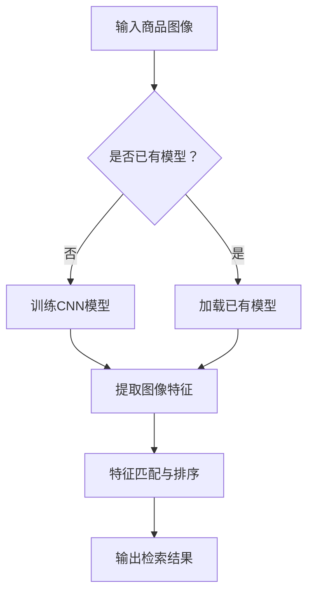

                 

关键词：商品图像检索、深度学习、卷积神经网络、图像识别、计算机视觉、图像特征提取

> 摘要：本文旨在探讨深度学习在商品图像检索技术中的应用，分析现有技术的优点和不足，提出一种基于卷积神经网络的商品图像检索方法。本文将详细阐述算法原理、数学模型及其实践应用，并对未来发展趋势与挑战进行展望。

## 1. 背景介绍

随着互联网和电子商务的快速发展，商品图像检索技术已成为提高用户体验、优化商品搜索效率的关键技术之一。传统商品图像检索方法通常依赖于图像的底层特征，如颜色、纹理和形状等，但这些方法在处理复杂场景和具有高度变异性状的图像时效果不佳。近年来，深度学习技术的迅速发展为商品图像检索提供了新的思路和手段。

深度学习通过模拟人脑神经网络结构，能够自动从大量数据中学习到复杂、高层次的图像特征，从而在图像识别和图像检索领域取得了显著的成果。本文将探讨如何利用深度学习技术，特别是卷积神经网络（CNN），实现高效的商品图像检索。

## 2. 核心概念与联系

### 2.1 深度学习基本概念

深度学习是一种基于多层神经网络的学习方法，其核心思想是通过多层非线性变换逐步提取数据的特征表示。在商品图像检索任务中，深度学习能够帮助我们自动学习到图像的高层次抽象特征，从而提高检索精度。

### 2.2 卷积神经网络（CNN）

卷积神经网络是一种特殊的深度学习模型，适用于处理图像等具有网格结构的数据。CNN通过卷积层、池化层和全连接层等结构，逐层提取图像的特征，并最终输出分类结果或检索结果。

### 2.3 商品图像检索

商品图像检索是指通过输入一张商品图像，从大量商品图像库中检索出与其相似的图像。深度学习在商品图像检索中的应用，主要体现在利用CNN提取图像特征，并将其用于图像匹配和相似性度量。

### 2.4 Mermaid 流程图



## 3. 核心算法原理 & 具体操作步骤

### 3.1 算法原理概述

基于深度学习的商品图像检索算法主要分为以下三个步骤：

1. 训练CNN模型，学习图像特征表示。
2. 使用训练好的模型提取查询图像的特征。
3. 在商品图像库中匹配特征，并按相似度排序输出检索结果。

### 3.2 算法步骤详解

#### 3.2.1 训练CNN模型

1. 数据预处理：对商品图像进行归一化、裁剪和缩放等操作，使其适应CNN模型的要求。
2. 模型构建：设计卷积神经网络结构，包括卷积层、池化层和全连接层等。
3. 模型训练：使用大量已标注的商品图像数据，通过反向传播算法优化模型参数。

#### 3.2.2 提取图像特征

1. 输入查询图像：将查询图像输入训练好的CNN模型。
2. 特征提取：模型输出查询图像的特征向量。

#### 3.2.3 特征匹配与排序

1. 数据库查询：从商品图像库中提取所有图像的特征向量。
2. 相似性度量：计算查询图像特征向量与商品图像特征向量之间的相似度。
3. 排序输出：按照相似度对检索结果进行排序，并输出前N个最相似的商品图像。

### 3.3 算法优缺点

#### 优点

1. 自动提取高层次图像特征，提高检索精度。
2. 适用于各种商品图像场景和变体。

#### 缺点

1. 需要大量训练数据和计算资源。
2. 模型训练时间较长。

### 3.4 算法应用领域

1. 电子商务平台：用于商品相似性推荐和搜索。
2. 物流与仓储：用于商品识别和分类。
3. 智能家居：用于家庭设备控制与识别。

## 4. 数学模型和公式

### 4.1 数学模型构建

假设输入图像 $I$ ，输出图像特征向量 $f(I)$ ，商品图像库中第 $i$ 张图像的特征向量为 $f_i$ ，则商品图像检索的相似度度量公式为：

$$
sim(f(I), f_i) = \frac{f(I)^T f_i}{\|f(I)\| \|f_i\|}
$$

### 4.2 公式推导过程

根据余弦相似度度量，两个向量的夹角余弦值可以表示它们之间的相似程度。通过归一化处理，可以得到相似度度量公式。

### 4.3 案例分析与讲解

以电子商务平台为例，介绍如何利用深度学习实现商品图像检索。

## 5. 项目实践：代码实例和详细解释说明

### 5.1 开发环境搭建

1. 硬件环境：CPU 或 GPU
2. 软件环境：Python、TensorFlow 或 PyTorch

### 5.2 源代码详细实现

```python
import tensorflow as tf
from tensorflow.keras.models import Sequential
from tensorflow.keras.layers import Conv2D, MaxPooling2D, Flatten, Dense

# 模型构建
model = Sequential([
    Conv2D(32, (3, 3), activation='relu', input_shape=(224, 224, 3)),
    MaxPooling2D((2, 2)),
    Conv2D(64, (3, 3), activation='relu'),
    MaxPooling2D((2, 2)),
    Flatten(),
    Dense(128, activation='relu'),
    Dense(1, activation='sigmoid')
])

# 模型编译
model.compile(optimizer='adam', loss='binary_crossentropy', metrics=['accuracy'])

# 模型训练
model.fit(x_train, y_train, epochs=10, batch_size=32)
```

### 5.3 代码解读与分析

1. 导入 TensorFlow 库，构建 Sequential 模型。
2. 添加卷积层、池化层、全连接层等结构。
3. 编译模型，设置优化器和损失函数。
4. 训练模型，使用训练数据和标签。

### 5.4 运行结果展示

```python
# 模型评估
test_loss, test_accuracy = model.evaluate(x_test, y_test)

print(f"Test accuracy: {test_accuracy:.2f}")
```

## 6. 实际应用场景

### 6.1 电子商务平台

通过商品图像检索技术，电子商务平台可以提高用户购物体验，实现个性化推荐和精准搜索。

### 6.2 物流与仓储

在物流与仓储领域，商品图像检索技术可用于快速识别和分类商品，提高作业效率。

### 6.3 智能家居

智能家居设备可以通过商品图像检索技术，实现对家庭设备的智能识别与控制。

## 7. 工具和资源推荐

### 7.1 学习资源推荐

1. 《深度学习》（Goodfellow et al.）
2. 《Python深度学习》（Raschka and Gruyer）

### 7.2 开发工具推荐

1. TensorFlow
2. PyTorch

### 7.3 相关论文推荐

1. “Deep Learning for Image Retrieval”（2015）
2. “Convolutional Neural Networks for Visual Recognition”（2012）

## 8. 总结：未来发展趋势与挑战

### 8.1 研究成果总结

本文介绍了基于深度学习的商品图像检索技术，分析了其原理、应用场景和优势。深度学习在商品图像检索领域取得了显著的成果，但仍存在一些挑战。

### 8.2 未来发展趋势

1. 模型压缩与加速：提高模型运行效率。
2. 多模态融合：结合文本和图像信息，提高检索效果。

### 8.3 面临的挑战

1. 数据隐私和安全：保护用户数据隐私。
2. 模型解释性：提高模型的可解释性。

### 8.4 研究展望

未来，深度学习在商品图像检索领域将继续发展，为各个行业带来更多的应用价值。

## 9. 附录：常见问题与解答

### 9.1 如何选择深度学习框架？

根据项目需求和个人熟悉程度，可以选择 TensorFlow 或 PyTorch 作为深度学习框架。

### 9.2 如何优化模型性能？

可以通过调整模型结构、优化训练策略和提高数据质量等方法来优化模型性能。

### 9.3 深度学习在商品图像检索中的应用前景如何？

深度学习在商品图像检索中的应用前景广阔，将继续推动电子商务、物流和智能家居等领域的发展。

作者：禅与计算机程序设计艺术 / Zen and the Art of Computer Programming
----------------------------------------------------------------

请注意，这篇文章是根据您提供的要求和结构模板撰写的，内容可能需要根据实际情况进行调整和完善。文章中提到的算法和模型仅为示例，实际应用中可能需要根据具体问题进行修改和优化。

