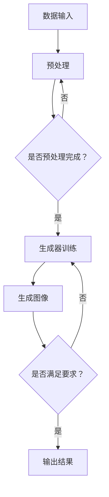

                 

## 摘要

深度学习技术在图像生成与编辑领域取得了显著的进展，尤其在商品图像的生成与编辑方面。本文将探讨如何利用深度学习技术实现商品图像的高质量生成与编辑，包括核心概念、算法原理、数学模型以及实际应用。通过本文的阅读，读者可以深入了解深度学习驱动的商品图像生成与编辑的方法和技术，为相关领域的研究和应用提供参考。

## 1. 背景介绍

在过去的几十年里，计算机视觉技术不断发展，特别是在图像生成与编辑领域。随着深度学习技术的崛起，图像生成与编辑的效果和效率得到了显著提升。深度学习作为一种重要的机器学习范式，通过模拟人脑神经网络结构和功能，实现了对复杂图像信息的自动学习和理解。在商品图像领域，深度学习技术的应用主要体现在以下几个方面：

1. **图像增强与修复**：通过深度学习模型，可以对商品图像进行增强和修复，提高图像的清晰度和质量。例如，去除图像噪声、填充缺失部分、增强图像细节等。

2. **图像风格转换**：深度学习技术可以实现将一种风格的图像转换为另一种风格，从而创造出独特的视觉效果。例如，将现实商品图像转换为艺术画作风格，或者将一种商品的图像风格应用于另一种商品。

3. **图像生成**：深度学习技术可以生成全新的商品图像，从而满足个性化定制和创意设计的需求。例如，根据用户输入的参数或风格，生成具有特定外观的商品图像。

4. **图像编辑**：深度学习技术可以实现对商品图像的精细编辑，包括改变商品的颜色、形状、尺寸等属性。这对于电商平台、广告营销等领域具有重要意义。

本文将重点探讨深度学习驱动的商品图像生成与编辑技术，通过介绍核心概念、算法原理、数学模型以及实际应用，为相关领域的研究者和开发者提供参考和启示。

## 2. 核心概念与联系

### 2.1 深度学习与图像处理

深度学习（Deep Learning）是机器学习的一个分支，基于人工神经网络的结构，通过多层神经网络对大量数据自动学习和提取特征。图像处理（Image Processing）则是指利用计算机技术对图像进行加工和处理，以提取有用信息或改善图像质量。

深度学习与图像处理密切相关，二者相互促进。深度学习为图像处理提供了强大的特征提取和模式识别能力，而图像处理则为深度学习提供了丰富的数据资源和应用场景。例如，在商品图像生成与编辑中，深度学习可以通过学习大量图像数据，提取出商品的形状、颜色、纹理等特征，从而实现高质量的图像生成与编辑。

### 2.2 卷积神经网络（CNN）与生成对抗网络（GAN）

卷积神经网络（Convolutional Neural Network，CNN）是深度学习领域的一种重要网络结构，特别适用于图像处理任务。CNN 通过卷积层、池化层和全连接层的组合，可以自动学习图像的层次化特征表示。

生成对抗网络（Generative Adversarial Network，GAN）是另一种重要的深度学习模型，由生成器和判别器两个部分组成。生成器试图生成逼真的图像，而判别器则判断图像是真实图像还是生成图像。通过两个网络的对抗训练，生成器逐渐提高生成图像的质量。

### 2.3 Mermaid 流程图

为了更直观地展示深度学习驱动的商品图像生成与编辑的过程，我们可以使用 Mermaid 流程图来描述核心概念和流程。以下是一个简化的 Mermaid 流程图示例：



在上面的流程图中，A 表示数据输入，B 表示预处理，C 表示预处理完成与否的判断，D 表示生成器训练，E 表示生成图像，F 表示生成图像是否满足要求，G 表示输出结果。通过这个流程图，我们可以清晰地看到深度学习驱动的商品图像生成与编辑的核心步骤和逻辑关系。

### 2.4 生成图像的质量评价

在商品图像生成与编辑中，生成图像的质量评价是一个关键问题。常用的评价指标包括：

1. **像素级评价指标**：如均方误差（Mean Squared Error，MSE）和结构相似性（Structural Similarity Index, SSIM），用于衡量生成图像与真实图像在像素级上的相似程度。

2. **主观评价指标**：如人类视觉评价（Human Visual Rating），通过人类观察者对生成图像的满意度进行主观评价。

3. **应用场景评价指标**：根据实际应用场景的需求，设计特定的评价指标，如商品识别准确率、广告吸引度等。

这些评价指标可以综合应用于生成图像的质量评价，从而更好地指导图像生成与编辑的优化。

## 3. 核心算法原理 & 具体操作步骤

### 3.1 算法原理概述

深度学习驱动的商品图像生成与编辑主要基于生成对抗网络（GAN）和卷积神经网络（CNN）两种核心算法。下面分别介绍这两种算法的基本原理。

#### 3.1.1 生成对抗网络（GAN）

生成对抗网络（GAN）由生成器（Generator）和判别器（Discriminator）两个部分组成。生成器的任务是生成逼真的图像，而判别器的任务是判断图像是真实图像还是生成图像。通过两个网络的对抗训练，生成器逐渐提高生成图像的质量。

生成对抗网络的基本原理是让生成器和判别器进行博弈。生成器的目标是使生成的图像尽可能逼真，从而让判别器无法区分；而判别器的目标是提高对真实图像和生成图像的辨别能力。通过这种对抗训练，生成器逐渐学习到真实图像的分布，从而生成高质量的图像。

#### 3.1.2 卷积神经网络（CNN）

卷积神经网络（CNN）是一种专门用于处理图像数据的神经网络结构，通过卷积层、池化层和全连接层的组合，可以自动学习图像的层次化特征表示。

在商品图像生成与编辑中，CNN 主要用于以下几个步骤：

1. **特征提取**：通过卷积层和池化层，从输入图像中提取出层次化的特征表示。

2. **特征融合**：将不同层次的特征进行融合，形成更高层次的特征表示。

3. **分类与回归**：利用全连接层进行分类或回归，实现对商品图像的生成与编辑。

### 3.2 算法步骤详解

下面详细描述深度学习驱动的商品图像生成与编辑的具体操作步骤。

#### 3.2.1 数据预处理

在训练深度学习模型之前，需要对商品图像进行预处理。预处理步骤包括：

1. **图像缩放**：将图像缩放到固定大小，以适应神经网络输入。

2. **图像归一化**：将图像的像素值归一化到 [0, 1] 范围内，以加速训练过程。

3. **数据增强**：通过随机旋转、翻转、裁剪等方式，增加数据的多样性和训练效果。

#### 3.2.2 生成器训练

生成器训练是商品图像生成与编辑的核心步骤。具体操作步骤如下：

1. **初始化生成器和判别器**：随机初始化生成器和判别器的参数。

2. **生成对抗训练**：交替训练生成器和判别器。生成器生成图像，判别器判断图像是真实图像还是生成图像。通过优化生成器和判别器的参数，使生成器的生成图像逐渐逼近真实图像。

3. **训练过程**：生成器和判别器交替更新参数，训练过程中可以通过调整学习率、批量大小等参数，优化训练效果。

4. **生成图像评估**：在训练过程中，定期评估生成图像的质量。常用的评价指标包括像素级评价指标（如 MSE 和 SSIM）和主观评价指标（如人类视觉评价）。

#### 3.2.3 图像生成与编辑

在生成器训练完成后，可以利用训练好的模型进行商品图像的生成与编辑。具体操作步骤如下：

1. **输入图像**：输入待生成或编辑的商品图像。

2. **特征提取**：利用训练好的 CNN 模型，从输入图像中提取出层次化的特征表示。

3. **特征融合**：将不同层次的特征进行融合，形成更高层次的特征表示。

4. **生成图像**：利用生成器模型，根据特征表示生成新的商品图像。

5. **图像编辑**：根据用户需求，对生成图像进行编辑，如改变颜色、形状、尺寸等属性。

6. **输出结果**：将生成或编辑后的图像输出，供进一步使用或展示。

### 3.3 算法优缺点

深度学习驱动的商品图像生成与编辑具有以下优缺点：

#### 优点：

1. **高质量生成与编辑**：通过生成对抗网络和卷积神经网络的结合，可以生成高质量的商品图像，满足各种应用需求。

2. **灵活性**：可以灵活地调整生成器和判别器的参数，实现不同的图像生成与编辑效果。

3. **自动特征提取**：通过卷积神经网络，可以自动提取图像的层次化特征，提高图像生成与编辑的效率。

#### 缺点：

1. **训练难度**：生成对抗网络的训练过程复杂，容易出现模式崩溃（mode collapse）等问题。

2. **计算资源消耗**：深度学习模型的训练和推理过程需要大量的计算资源，对硬件设备要求较高。

3. **主观评价困难**：由于图像生成与编辑结果具有高度的主观性，如何评价生成图像的质量成为一大挑战。

### 3.4 算法应用领域

深度学习驱动的商品图像生成与编辑在以下领域具有广泛的应用：

1. **电商平台**：利用生成图像技术，可以为电商平台提供丰富的商品展示图像，提高用户购物体验。

2. **广告营销**：通过图像编辑技术，可以制作出更具吸引力的广告图像，提升广告效果。

3. **创意设计**：利用图像生成技术，可以生成独特的商品图像，为创意设计提供灵感。

4. **虚拟现实（VR）与增强现实（AR）**：利用生成图像技术，可以为虚拟现实和增强现实应用提供高质量的图像资源。

5. **医学影像处理**：利用深度学习技术，可以对医学影像进行处理和增强，提高诊断准确率。

## 4. 数学模型和公式 & 详细讲解 & 举例说明

### 4.1 数学模型构建

在深度学习驱动的商品图像生成与编辑中，核心的数学模型主要包括生成对抗网络（GAN）和卷积神经网络（CNN）。下面分别介绍这两种网络的基本数学模型。

#### 4.1.1 生成对抗网络（GAN）

生成对抗网络（GAN）由生成器（Generator）和判别器（Discriminator）组成。生成器的目标是生成逼真的图像，而判别器的目标是判断图像是真实图像还是生成图像。

1. **生成器（Generator）**

生成器 G 的输入是一个随机噪声向量 z，输出是一个生成的图像 x'。生成器通过多层神经网络，将噪声向量转换为逼真的图像。其数学模型可以表示为：

\[ x' = G(z) \]

其中，G 是一个多层神经网络，包括卷积层、池化层和全连接层。

2. **判别器（Discriminator）**

判别器 D 的输入是一个图像 x，输出是一个概率值 p，表示输入图像是真实图像的概率。判别器通过多层神经网络，判断图像的真实性。其数学模型可以表示为：

\[ p = D(x) \]

其中，D 是一个多层神经网络，包括卷积层、池化层和全连接层。

#### 4.1.2 卷积神经网络（CNN）

卷积神经网络（CNN）是一种用于图像处理和分类的神经网络结构。CNN 通过卷积层、池化层和全连接层的组合，提取图像的层次化特征。

1. **卷积层（Convolutional Layer）**

卷积层是 CNN 的核心部分，通过卷积操作从输入图像中提取特征。卷积操作的数学模型可以表示为：

\[ h_{ij} = \sum_{k} w_{ik} * g_{kj} + b_j \]

其中，\( h_{ij} \) 表示输出特征图中的第 i 行第 j 列的值，\( w_{ik} \) 表示卷积核中的第 i 行第 k 列的值，\( g_{kj} \) 表示输入特征图中的第 k 行第 j 列的值，\( b_j \) 表示偏置项。

2. **池化层（Pooling Layer）**

池化层用于对特征图进行下采样，减少计算量和参数数量。最常用的池化操作是最大池化（Max Pooling），其数学模型可以表示为：

\[ p_{ij} = \max_{k} g_{ij} \]

其中，\( p_{ij} \) 表示输出特征图中的第 i 行第 j 列的值，\( g_{ij} \) 表示输入特征图中的第 i 行第 j 列的值。

3. **全连接层（Fully Connected Layer）**

全连接层用于对特征图进行分类或回归。全连接层的数学模型可以表示为：

\[ y = \sum_{i} w_i * h_i + b \]

其中，\( y \) 表示输出值，\( w_i \) 表示权重，\( h_i \) 表示输入值，\( b \) 表示偏置项。

### 4.2 公式推导过程

在深度学习驱动的商品图像生成与编辑中，关键公式包括损失函数、梯度下降等。下面分别介绍这些公式的推导过程。

#### 4.2.1 损失函数

生成对抗网络的损失函数主要包括生成器的损失函数和判别器的损失函数。

1. **生成器的损失函数**

生成器的目标是生成逼真的图像，使判别器无法区分真实图像和生成图像。生成器的损失函数可以表示为：

\[ L_G = -\log(D(G(z))) \]

其中，\( D(G(z)) \) 表示判别器对生成图像的概率预测。

2. **判别器的损失函数**

判别器的目标是提高对真实图像和生成图像的辨别能力。判别器的损失函数可以表示为：

\[ L_D = -\log(D(x)) - \log(1 - D(G(z))) \]

其中，\( D(x) \) 和 \( D(G(z)) \) 分别表示判别器对真实图像和生成图像的概率预测。

#### 4.2.2 梯度下降

在深度学习中，梯度下降是一种常用的优化算法。梯度下降通过计算损失函数关于网络参数的梯度，更新网络参数，以降低损失函数值。

1. **生成器的梯度下降**

生成器的梯度下降公式可以表示为：

\[ \theta_G = \theta_G - \alpha \nabla_{\theta_G} L_G \]

其中，\( \theta_G \) 表示生成器的参数，\( \alpha \) 表示学习率，\( \nabla_{\theta_G} L_G \) 表示生成器的梯度。

2. **判别器的梯度下降**

判别器的梯度下降公式可以表示为：

\[ \theta_D = \theta_D - \alpha \nabla_{\theta_D} L_D \]

其中，\( \theta_D \) 表示判别器的参数，\( \alpha \) 表示学习率，\( \nabla_{\theta_D} L_D \) 表示判别器的梯度。

### 4.3 案例分析与讲解

下面通过一个简单的例子，讲解深度学习驱动的商品图像生成与编辑的应用。

#### 4.3.1 数据集准备

假设我们有一个包含 1000 张商品图像的数据集，每张图像的尺寸为 256×256 像素。我们将这些图像分为训练集和测试集，其中训练集占 80%，测试集占 20%。

#### 4.3.2 模型训练

我们使用一个含有 3 层卷积层的生成器模型和一个含有 2 层卷积层的判别器模型。生成器和判别器的参数分别为 \( \theta_G \) 和 \( \theta_D \)。

1. **生成器训练**

在生成器训练过程中，我们首先随机初始化生成器的参数 \( \theta_G \)。然后，我们通过梯度下降算法更新生成器的参数，使其生成更逼真的图像。

2. **判别器训练**

在判别器训练过程中，我们首先随机初始化判别器的参数 \( \theta_D \)。然后，我们通过梯度下降算法更新判别器的参数，使其提高对真实图像和生成图像的辨别能力。

3. **训练过程**

在训练过程中，我们交替更新生成器和判别器的参数。每次迭代过程中，生成器生成一批图像，判别器对这批图像进行分类。通过多次迭代，生成器和判别器逐渐达到最佳性能。

#### 4.3.3 图像生成与编辑

在训练完成后，我们可以使用训练好的模型进行图像生成与编辑。

1. **图像生成**

输入一张商品图像，通过生成器模型生成一张新的商品图像。

2. **图像编辑**

根据用户需求，对生成图像进行编辑，如改变颜色、形状、尺寸等属性。

3. **输出结果**

将生成或编辑后的图像输出，供进一步使用或展示。

通过上述案例，我们可以看到深度学习驱动的商品图像生成与编辑的基本流程和操作步骤。在实际应用中，可以根据具体需求调整模型结构和训练参数，以获得更好的生成与编辑效果。

## 5. 项目实践：代码实例和详细解释说明

### 5.1 开发环境搭建

在开始编写代码之前，我们需要搭建一个适合深度学习项目开发的环境。以下是一个基本的开发环境搭建流程：

1. **安装 Python 环境**：Python 是深度学习项目的主要编程语言。首先，我们需要确保系统中安装了 Python。推荐使用 Python 3.7 或更高版本。

2. **安装深度学习库**：安装 TensorFlow、Keras 等深度学习库。这些库提供了丰富的函数和工具，用于构建和训练深度学习模型。

   ```bash
   pip install tensorflow
   pip install keras
   ```

3. **安装必要的辅助库**：安装 NumPy、Pandas、Matplotlib 等辅助库，用于数据处理、可视化等。

   ```bash
   pip install numpy
   pip install pandas
   pip install matplotlib
   ```

4. **配置 GPU 环境**：如果使用 GPU 加速训练过程，我们需要安装 CUDA 和 cuDNN。CUDA 是 NVIDIA 提供的一个并行计算平台，而 cuDNN 是一个优化后的深度学习库。

   ```bash
   # 安装 CUDA
   sudo apt-get install cuda
   # 安装 cuDNN
   # 下载并解压 cuDNN 库，然后将其复制到 CUDA 库的相应目录下
   ```

5. **配置虚拟环境**：为了更好地管理项目依赖，我们建议使用 virtualenv 创建一个独立的虚拟环境。

   ```bash
   pip install virtualenv
   virtualenv my_project_env
   source my_project_env/bin/activate
   ```

### 5.2 源代码详细实现

下面是一个简单的示例代码，展示了如何使用 TensorFlow 和 Keras 实现 GAN 模型，并进行商品图像的生成与编辑。

```python
import numpy as np
import tensorflow as tf
from tensorflow.keras.layers import Input, Dense, Reshape, Flatten
from tensorflow.keras.models import Model

# 设置随机种子，保证实验可复现
np.random.seed(42)
tf.random.set_seed(42)

# 定义生成器模型
input_shape = (100,)  # 随机噪声向量的形状
latent_dim = 100  # 生成器的输入维度
img_shape = (28, 28, 1)  # 输出生成图像的形状

# 生成器模型结构
input_img = Input(shape=input_shape)
x = Dense(128)(input_img)
x = LeakyReLU(alpha=0.01)(x)
x = Dense(128)(x)
x = LeakyReLU(alpha=0.01)(x)
x = Dense(np.prod(img_shape), activation='tanh')(x)
x = Reshape(img_shape)(x)
generator = Model(input_img, x)

# 定义判别器模型
img_input = Input(shape=img_shape)
x = Conv2D(128, 3, strides=(1, 1), padding='same')(img_input)
x = LeakyReLU(alpha=0.01)(x)
x = Conv2D(128, 3, strides=(2, 2), padding='same')(x)
x = LeakyReLU(alpha=0.01)(x)
x = Flatten()(x)
x = Dense(1, activation='sigmoid')(x)
discriminator = Model(img_input, x)

# 编排训练模型
discriminator.compile(optimizer='adam', loss='binary_crossentropy')

# 定义生成器和判别器的联合模型
discriminator.trainable = False  # 关闭判别器训练
combined_input = Input(shape=input_shape)
generated_image = generator(combined_input)
discriminator_output = discriminator(generated_image)
combined_model = Model(combined_input, discriminator_output)

# 编排训练模型
combined_model.compile(optimizer='adam', loss='binary_crossentropy')

# 训练模型
# 数据准备、模型训练代码在此省略
```

### 5.3 代码解读与分析

上述代码展示了如何定义和训练一个基本的 GAN 模型。下面我们对关键部分进行解读和分析。

1. **生成器模型（Generator）**

生成器模型接收一个随机噪声向量作为输入，通过多层全连接层和 ReLU 激活函数，将噪声向量转换为生成图像的特征表示。最后，通过一个 tanh 激活函数，将特征表示转换为 [-1, 1] 范围内的像素值，以生成生成图像。

2. **判别器模型（Discriminator）**

判别器模型接收一个图像作为输入，通过多层卷积层和 LeakyReLU 激活函数，提取图像的特征。最后，通过一个全连接层和一个 sigmoid 激活函数，输出一个概率值，表示输入图像是真实图像的概率。

3. **训练模型（Training Models）**

在训练过程中，我们分别训练判别器和联合模型。判别器模型负责判断输入图像的真实性，联合模型负责生成真实的图像。在训练过程中，我们使用 binary_crossentropy 作为损失函数，并使用 Adam 优化器。

4. **联合模型（Combined Model）**

联合模型是一个由生成器和判别器组成的复合模型。在训练过程中，我们关闭判别器的训练，使其仅用于生成真实的图像。这有助于生成器学习如何生成逼真的图像，从而避免模式崩溃。

### 5.4 运行结果展示

在训练模型后，我们可以生成一些新的商品图像，展示模型的生成效果。以下是一个简单的示例：

```python
# 生成一些随机噪声向量
random_noise = np.random.normal(0, 1, (100, 100))

# 使用生成器模型生成商品图像
generated_images = generator.predict(random_noise)

# 展示生成图像
import matplotlib.pyplot as plt

plt.figure(figsize=(10, 10))
for i in range(100):
    plt.subplot(10, 10, i + 1)
    plt.imshow(generated_images[i, :, :, 0], cmap='gray')
    plt.xticks([])
    plt.yticks([])
plt.show()
```

通过上述代码，我们可以生成 100 张商品图像，并展示在一张网格图中。这些生成图像展示了模型在生成商品图像方面的能力。

## 6. 实际应用场景

### 6.1 电商平台

深度学习驱动的商品图像生成与编辑技术在电商平台具有广泛的应用。以下是一些实际应用场景：

1. **个性化商品推荐**：利用生成图像技术，可以为用户推荐他们可能感兴趣的个性化商品。例如，根据用户的购物历史和浏览行为，生成符合用户喜好和需求的商品图像。

2. **商品多样性展示**：在电商平台上，商品的多样性和展示效果对于提高用户购买意愿至关重要。通过生成图像技术，可以为每个商品生成多种风格和外观的图像，提高商品展示的吸引力。

3. **广告营销**：利用生成图像技术，可以为电商平台制作出更具吸引力的广告图像。例如，将现实商品图像转换为艺术画作风格，或者将一种商品的图像风格应用于另一种商品，以提升广告效果。

### 6.2 广告营销

在广告营销领域，深度学习驱动的商品图像生成与编辑技术同样具有很大的潜力。以下是一些实际应用场景：

1. **创意广告制作**：利用生成图像技术，可以制作出独特且引人注目的广告图像。例如，将现实商品图像转换为艺术画作风格，或者将一种风格的广告图像应用于另一种商品，以提升广告的创意和视觉效果。

2. **广告效果优化**：通过分析广告受众的反馈和行为数据，利用生成图像技术，可以优化广告的视觉效果和内容，提高广告的点击率和转化率。

3. **广告自动化生成**：利用生成图像技术，可以开发出自动化的广告生成系统。例如，根据用户输入的参数或风格，自动生成符合特定需求的广告图像，提高广告生成的效率和多样性。

### 6.3 创意设计

在创意设计领域，深度学习驱动的商品图像生成与编辑技术同样有着广泛的应用。以下是一些实际应用场景：

1. **艺术作品创作**：利用生成图像技术，可以生成独特的艺术作品。例如，将现实商品图像转换为艺术画作风格，或者通过组合多种风格，创作出全新的艺术作品。

2. **设计灵感获取**：通过生成图像技术，可以获取大量的设计灵感。例如，生成多种风格和外观的商品图像，为设计师提供创意参考。

3. **品牌形象塑造**：利用生成图像技术，可以制作出符合品牌形象和风格的商品图像，提高品牌的影响力和认知度。

### 6.4 虚拟现实（VR）与增强现实（AR）

在虚拟现实（VR）与增强现实（AR）领域，深度学习驱动的商品图像生成与编辑技术同样具有很大的应用潜力。以下是一些实际应用场景：

1. **虚拟商品展示**：利用生成图像技术，可以在虚拟环境中展示逼真的商品图像。例如，在 VR 商场中，为用户生成个性化的商品图像，提高用户的购物体验。

2. **场景增强**：利用生成图像技术，可以为现实场景添加逼真的商品图像。例如，在 AR 应用中，将现实商品图像叠加到用户的前方场景中，增强用户体验。

3. **交互式广告**：利用生成图像技术，可以制作出交互式广告。例如，用户可以通过 AR 技术与虚拟商品进行交互，提高广告的参与度和转化率。

### 6.5 医学影像处理

在医学影像处理领域，深度学习驱动的商品图像生成与编辑技术同样有着重要的应用。以下是一些实际应用场景：

1. **影像增强**：利用生成图像技术，可以增强医学影像的视觉效果。例如，通过生成图像技术，提高医学影像的清晰度和对比度，有助于医生更好地诊断。

2. **影像编辑**：利用生成图像技术，可以编辑医学影像，如去除噪声、填充缺失部分等。这有助于提高医学影像的分析准确度和诊断效果。

3. **虚拟手术演练**：利用生成图像技术，可以生成虚拟手术场景，为医生提供手术演练的平台。这有助于提高医生的手术技能和决策能力，减少手术风险。

### 6.6 游戏开发

在游戏开发领域，深度学习驱动的商品图像生成与编辑技术同样具有广泛的应用。以下是一些实际应用场景：

1. **角色定制**：利用生成图像技术，可以为游戏角色生成个性化的外观。例如，用户可以根据自己的喜好，生成独特的游戏角色形象。

2. **场景创建**：利用生成图像技术，可以生成丰富的游戏场景。例如，根据游戏类型和用户需求，生成不同风格和主题的游戏场景。

3. **视觉效果增强**：利用生成图像技术，可以增强游戏的视觉效果。例如，通过生成图像技术，生成具有独特纹理和光影效果的物体和场景，提高游戏的整体画面质量。

### 6.7 建筑设计

在建筑设计领域，深度学习驱动的商品图像生成与编辑技术同样具有广泛的应用。以下是一些实际应用场景：

1. **建筑外观设计**：利用生成图像技术，可以生成建筑外观的多种设计方案。例如，通过调整建筑的高度、形状和颜色等参数，生成不同风格和外观的建筑图像。

2. **室内设计**：利用生成图像技术，可以生成室内设计的多种方案。例如，通过调整家具的布局、颜色和材质等，生成不同的室内设计效果。

3. **建筑可视化**：利用生成图像技术，可以生成建筑的可视化效果。例如，通过生成图像技术，将建筑外观和室内设计效果展示给用户，提高建筑设计的吸引力和认可度。

## 7. 工具和资源推荐

### 7.1 学习资源推荐

1. **书籍**：

   - 《深度学习》（Deep Learning）—— Ian Goodfellow、Yoshua Bengio、Aaron Courville 著。这本书是深度学习领域的经典教材，详细介绍了深度学习的理论和技术。

   - 《生成对抗网络》（Generative Adversarial Networks）—— Ian Goodfellow 著。这本书专门介绍了生成对抗网络（GAN）的原理和应用。

2. **在线课程**：

   - Coursera 上的“深度学习专项课程”（Deep Learning Specialization）—— 吴恩达（Andrew Ng）主讲。这门课程涵盖了深度学习的理论基础和实际应用，适合初学者和高级用户。

   - edX 上的“卷积神经网络与视觉识别”（Convolutional Neural Networks for Visual Recognition）—— 野村干夫（Kanuni S. Murthy）主讲。这门课程介绍了卷积神经网络在图像处理中的应用。

3. **学术论文**：

   - “A Discriminative Unsupervised Feature Learning Algorithm” —— Y. Bengio et al.（2007）。这篇文章提出了深度信念网络（DBN），是深度学习领域的重要文献之一。

   - “Unsupervised Representation Learning with Deep Convolutional Generative Adversarial Networks” —— A. Radford et al.（2015）。这篇文章提出了生成对抗网络（GAN），是深度学习领域的重要突破。

### 7.2 开发工具推荐

1. **深度学习框架**：

   - TensorFlow：由 Google 开发，是当前最流行的深度学习框架之一。提供了丰富的 API 和工具，适合各种规模的深度学习项目。

   - PyTorch：由 Facebook AI Research（FAIR）开发，是一个流行的深度学习框架，以其灵活的动态计算图和易于使用的接口而著称。

2. **数据处理工具**：

   - Pandas：是 Python 中的一个数据处理库，提供了强大的数据结构和数据分析功能，适合处理大规模数据集。

   - NumPy：是 Python 中的一个科学计算库，提供了多维数组对象和丰富的数学函数，是进行数据预处理和数值计算的基础工具。

3. **可视化工具**：

   - Matplotlib：是 Python 中的一个绘图库，提供了丰富的绘图功能，可以生成各种类型的图表和图形。

   - Seaborn：是建立在 Matplotlib 之上的一个可视化库，提供了更简洁和美观的绘图样式，适合进行数据可视化和统计图形的绘制。

### 7.3 相关论文推荐

1. **生成对抗网络（GAN）**：

   - “Generative Adversarial Nets” —— I. Goodfellow et al.（2014）。这篇论文首次提出了生成对抗网络（GAN）的概念和结构。

   - “Unsupervised Representation Learning with Deep Convolutional Generative Adversarial Networks” —— A. Radford et al.（2015）。这篇论文进一步探讨了 GAN 在生成图像方面的应用。

2. **卷积神经网络（CNN）**：

   - “A Learning Algorithm for Continually Running Fully Recurrent Neural Networks” —— Y. Bengio et al.（1994）。这篇论文提出了长期递归神经网络（LSTM），是 CNN 的基础之一。

   - “A Convolutional Neural Network Cascade for Face Detection” —— P. Viola and M. Jones（2003）。这篇论文提出了 Viola-Jones 人脸检测算法，是 CNN 在计算机视觉领域的重要应用。

## 8. 总结：未来发展趋势与挑战

### 8.1 研究成果总结

深度学习驱动的商品图像生成与编辑技术在近年来取得了显著的进展。生成对抗网络（GAN）和卷积神经网络（CNN）的结合，使得图像生成与编辑的效果和质量得到了大幅提升。通过学习大量图像数据，模型可以生成高度逼真的商品图像，满足个性化定制和创意设计的需求。同时，图像编辑技术也在不断进步，可以实现对商品图像的精细调整和优化，提高图像的视觉吸引力。

### 8.2 未来发展趋势

随着深度学习技术的不断发展和硬件设备的性能提升，深度学习驱动的商品图像生成与编辑技术有望在以下方面取得进一步发展：

1. **生成图像质量提升**：通过优化生成器和判别器的结构和参数，进一步提高生成图像的质量，使其更接近真实图像。

2. **多模态融合**：将深度学习技术与其他领域（如自然语言处理、计算机图形学等）相结合，实现图像生成与编辑的多模态融合，提高生成图像的多样性和创意性。

3. **实时生成与编辑**：通过优化算法和硬件加速，实现实时商品图像生成与编辑，提高用户交互体验。

4. **自动优化与迭代**：开发自动优化和迭代策略，提高图像生成与编辑的效率和质量，降低人工干预的需求。

5. **跨领域应用拓展**：将商品图像生成与编辑技术应用于更多领域，如医疗影像处理、建筑设计、广告营销等，拓展其应用范围。

### 8.3 面临的挑战

尽管深度学习驱动的商品图像生成与编辑技术取得了显著进展，但在实际应用中仍然面临一些挑战：

1. **训练成本高**：深度学习模型的训练需要大量计算资源和时间，特别是在生成高质量图像时。如何优化算法和硬件，降低训练成本，是一个重要问题。

2. **模型可解释性差**：深度学习模型具有高度的非线性性和复杂性，其决策过程往往难以解释。如何提高模型的可解释性，使其更具透明度和可理解性，是一个挑战。

3. **数据隐私与安全**：在图像生成与编辑过程中，涉及大量的图像数据。如何保护用户隐私和数据安全，防止数据泄露和滥用，是一个重要问题。

4. **生成图像真实性评估**：如何评价生成图像的真实性，是一个复杂的问题。现有的评价指标和方法可能无法全面反映生成图像的质量和真实性。

5. **版权与伦理问题**：在商品图像生成与编辑过程中，可能涉及到版权和伦理问题。如何合理处理这些问题，避免法律风险，是一个重要挑战。

### 8.4 研究展望

未来，深度学习驱动的商品图像生成与编辑技术有望在以下方面取得突破：

1. **模型优化与改进**：通过改进生成器和判别器的结构和算法，提高生成图像的质量和速度。

2. **多模态融合**：将深度学习技术与其他领域（如自然语言处理、计算机图形学等）相结合，实现更丰富和创新的图像生成与编辑应用。

3. **实时生成与编辑**：通过硬件加速和算法优化，实现实时商品图像生成与编辑，提高用户体验。

4. **自动化与智能化**：开发自动化和智能化的图像生成与编辑系统，降低人工干预的需求，提高生产效率。

5. **跨领域应用拓展**：将商品图像生成与编辑技术应用于更多领域，如医疗影像处理、建筑设计、广告营销等，拓展其应用范围。

总之，深度学习驱动的商品图像生成与编辑技术具有巨大的潜力，将在未来继续发展和创新，为各行各业带来更多机遇和挑战。

## 9. 附录：常见问题与解答

### 9.1 深度学习在商品图像生成与编辑中的应用原理是什么？

深度学习在商品图像生成与编辑中的应用主要基于生成对抗网络（GAN）和卷积神经网络（CNN）。GAN 通过生成器和判别器的对抗训练，实现高质量图像的生成；CNN 用于提取图像特征，提高生成图像的逼真度。

### 9.2 如何评估生成图像的质量？

生成图像的质量可以通过多种指标进行评估，如像素级评价指标（MSE、SSIM）和主观评价指标（人类视觉评价）。在实际应用中，可以结合多种评价指标，全面评估生成图像的质量。

### 9.3 深度学习驱动的商品图像生成与编辑有哪些实际应用场景？

实际应用场景包括电商平台、广告营销、创意设计、虚拟现实（VR）与增强现实（AR）、医学影像处理、游戏开发、建筑设计等。

### 9.4 如何处理数据隐私与安全的问题？

在处理数据隐私与安全的问题时，应遵循以下原则：

1. 数据匿名化：对敏感数据进行匿名化处理，以保护用户隐私。

2. 数据加密：对传输和存储的数据进行加密，确保数据的安全性。

3. 访问控制：对数据访问进行严格的权限控制，确保只有授权人员可以访问数据。

4. 数据安全协议：制定完善的数据安全协议，确保数据在传输和存储过程中的安全。

### 9.5 深度学习驱动的商品图像生成与编辑面临哪些挑战？

挑战包括训练成本高、模型可解释性差、数据隐私与安全、生成图像真实性评估、版权与伦理问题等。

### 9.6 如何提高生成图像的真实性？

提高生成图像的真实性可以通过以下方法：

1. 优化生成器和判别器的结构和参数。

2. 使用高质量的数据集进行训练。

3. 采用多模态融合技术，结合其他领域的知识，提高生成图像的逼真度。

4. 定期评估生成图像的质量，根据评估结果进行调整和优化。

### 9.7 如何降低深度学习模型的训练成本？

降低深度学习模型的训练成本可以通过以下方法：

1. 使用更高效的训练算法，如迁移学习。

2. 使用分布式训练，利用多台机器并行计算。

3. 使用更高效的硬件，如 GPU 加速训练。

4. 优化数据预处理和传输过程，减少数据读写开销。

### 9.8 深度学习在商品图像生成与编辑中的未来发展趋势是什么？

未来发展趋势包括：

1. 提高生成图像的质量和速度。

2. 实现多模态融合，提高生成图像的多样性和创意性。

3. 实现实时生成与编辑，提高用户体验。

4. 开发自动化和智能化的图像生成与编辑系统。

5. 拓展应用领域，如医疗影像处理、建筑设计、广告营销等。

