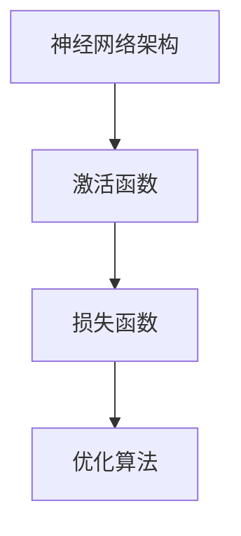

                 

### 摘要 Summary

本文深入探讨了深度学习在商品图像生成技术中的应用。首先，我们对商品图像生成技术进行了背景介绍，分析了其在商业和社会领域的广泛应用。接着，本文详细介绍了深度学习的基本概念，包括神经网络架构、激活函数和损失函数等核心组成部分，并展示了如何将这些概念应用于图像生成任务。

随后，文章重点阐述了生成对抗网络（GAN）和变分自编码器（VAE）这两种主流的深度学习模型在商品图像生成中的工作原理和具体实现步骤。通过数学模型的构建和公式推导，我们深入理解了这些算法的核心思想。

在项目实践部分，本文提供了一个完整的代码实例，详细解释了开发环境搭建、源代码实现和代码解读与分析等内容。同时，文章还展示了商品图像生成技术的实际应用场景，包括电商平台商品展示、智能广告设计和虚拟试衣等。

最后，本文对未来应用前景进行了展望，提出了可能的研究方向和面临的挑战。通过本文的介绍，读者将对深度学习驱动的商品图像生成技术有更深入的了解，并能够应用于实际项目中。

### 1. 背景介绍 Introduction

商品图像生成技术是一种利用人工智能技术生成高质量商品图像的方法。随着深度学习技术的快速发展，商品图像生成技术在多个领域得到了广泛应用，成为提升用户体验、降低生产成本和拓展商业应用的重要工具。

#### 1.1 商业应用

在电子商务领域，商品图像生成技术可以帮助商家提高商品展示效果，从而提升销售转化率。通过生成逼真的商品图像，商家可以更加直观地展示商品的特性和优势，吸引消费者的注意力。此外，商品图像生成技术还可以用于创建商品的不同视角和场景展示，满足消费者对多样性的需求。

广告行业也受益于商品图像生成技术。广告公司可以利用深度学习模型生成具有创意和吸引力的广告素材，提高广告的点击率和转化率。通过生成个性化的商品图像，广告可以更好地与目标受众进行互动，实现精准营销。

#### 1.2 社会应用

在社交媒体和内容创作领域，商品图像生成技术也为用户提供了更多创造性的工具。用户可以通过生成独特的商品图像，分享自己的生活和品味，吸引更多关注和互动。例如，在Instagram、Pinterest等平台上，用户可以生成个性化的商品图像，作为自己内容的创意元素。

虚拟现实（VR）和增强现实（AR）技术的发展也推动了商品图像生成技术的应用。通过生成高质量的3D商品图像，用户可以在虚拟环境中体验真实的商品，提高购物体验和满意度。此外，商品图像生成技术还可以用于创建虚拟试衣间，帮助用户在线试穿衣物，提高购买决策的准确性。

#### 1.3 当前挑战与未来趋势

尽管商品图像生成技术在多个领域取得了显著成果，但仍面临一些挑战。首先，生成图像的质量和真实感仍需进一步提升，以满足用户对高质量图像的需求。其次，训练深度学习模型需要大量的数据和计算资源，这对中小企业和开发者来说是一个较大的负担。

未来，随着计算能力的提升和数据量的增加，商品图像生成技术有望取得更大的突破。此外，结合其他人工智能技术，如自然语言处理和计算机视觉，可以进一步提升商品图像生成的多样性和创新性。

总之，商品图像生成技术作为一种新兴的人工智能技术，具有广泛的应用前景。通过深入研究和不断优化，我们有理由相信，商品图像生成技术将在未来发挥更大的作用，推动相关领域的创新发展。

### 2. 核心概念与联系 Core Concepts and Connections

在深入探讨商品图像生成技术之前，有必要先了解一些核心概念和其相互之间的联系。这些概念包括神经网络架构、激活函数、损失函数和优化算法，它们共同构成了深度学习的基础。

#### 2.1 神经网络架构

神经网络是深度学习模型的核心组成部分，其结构类似于人类大脑的神经网络。一个基本的神经网络由输入层、隐藏层和输出层组成。输入层接收外部输入数据，隐藏层通过复杂的计算过程处理数据，输出层生成最终的输出结果。

**示例**：以一个简单的全连接神经网络为例，输入层包含10个神经元，隐藏层包含5个神经元，输出层包含3个神经元。输入数据通过输入层传递到隐藏层，经过隐藏层的计算后，再传递到输出层生成预测结果。


#### 2.2 激活函数

激活函数用于确定神经元是否被激活，即输出是否大于某个阈值。常见的激活函数包括线性激活函数（f(x) = x）和非线性激活函数（如Sigmoid函数、ReLU函数、Tanh函数）。

**示例**：以ReLU函数为例，其定义为f(x) = max(0, x)。当输入x大于0时，输出为x；当输入x小于或等于0时，输出为0。这种非线性激活函数可以加速神经网络的训练过程，并有助于避免梯度消失问题。


#### 2.3 损失函数

损失函数用于评估神经网络输出结果与真实值之间的差异，是优化算法的关键组成部分。常见的损失函数包括均方误差（MSE）、交叉熵损失等。

**示例**：以均方误差（MSE）为例，其定义为L = 1/N * Σ(y - ŷ)^2，其中y为真实值，ŷ为预测值，N为样本数量。MSE损失函数可以衡量预测值与真实值之间的差异，其值越小，表示预测结果越接近真实值。


#### 2.4 优化算法

优化算法用于调整神经网络权重，以最小化损失函数。常见的优化算法包括随机梯度下降（SGD）、Adam优化器等。

**示例**：以随机梯度下降（SGD）为例，其公式为w = w - α * ∇L(w)，其中w为权重，α为学习率，∇L(w)为损失函数对权重的梯度。SGD通过迭代更新权重，逐渐减少损失函数的值，从而优化神经网络模型。


#### 2.5 Mermaid 流程图

为了更好地展示这些核心概念和它们之间的联系，我们可以使用Mermaid流程图进行可视化。以下是一个示例：




通过这个流程图，我们可以清晰地看到神经网络架构、激活函数、损失函数和优化算法之间的相互关系，以及它们在深度学习模型中的作用。

### 3. 核心算法原理 & 具体操作步骤 Core Algorithm Principles and Detailed Steps

在商品图像生成领域，生成对抗网络（GAN）和变分自编码器（VAE）是两种主流的深度学习模型。它们通过不同的机制实现了高质量图像的生成。以下是这两种模型的工作原理和具体操作步骤。

#### 3.1 生成对抗网络（GAN）

生成对抗网络（GAN）由两部分组成：生成器（Generator）和判别器（Discriminator）。生成器的任务是生成逼真的图像，而判别器的任务是区分真实图像和生成图像。

**3.1.1 算法原理概述**

GAN的核心思想是利用生成器和判别器之间的对抗关系来优化生成图像的质量。在训练过程中，生成器和判别器相互竞争，生成器试图生成尽可能逼真的图像，而判别器则试图准确区分真实图像和生成图像。通过这种方式，生成器的生成能力不断提高，最终可以生成高质量图像。

**3.1.2 算法步骤详解**

1. 初始化生成器和判别器模型。
2. 从真实数据集中随机采样一批图像作为输入。
3. 生成器生成一批伪图像。
4. 将真实图像和伪图像输入判别器，计算判别器的损失函数。
5. 计算生成器的损失函数，该损失函数由判别器的损失函数组成。
6. 使用优化算法更新生成器和判别器的权重。
7. 重复步骤2-6，直到生成器生成的图像质量达到预期。

**3.1.3 算法优缺点**

GAN的优点包括：

- 能生成高质量、逼真的图像。
- 适用于多种图像生成任务。

GAN的缺点包括：

- 训练过程不稳定，可能陷入局部最优。
- 需要大量的计算资源。

**3.1.4 算法应用领域**

GAN在商品图像生成、数据增强、图像修复等领域有广泛应用。例如，在电子商务平台上，GAN可以用于生成新的商品图像，提高用户体验和销售转化率。

#### 3.2 变分自编码器（VAE）

变分自编码器（VAE）是一种基于概率模型的深度学习模型，通过编码器和解码器实现图像的生成。编码器将图像编码为一个潜在变量，解码器则根据潜在变量生成图像。

**3.2.1 算法原理概述**

VAE的核心思想是将图像表示为潜在变量空间中的一个点，通过潜在变量生成图像。编码器通过神经网络将图像映射到潜在变量空间，解码器则从潜在变量空间生成图像。训练过程中，VAE通过最大化数据分布的似然函数来优化模型。

**3.2.2 算法步骤详解**

1. 初始化编码器和解码器模型。
2. 从真实数据集中随机采样一批图像作为输入。
3. 编码器将图像编码为潜在变量。
4. 解码器根据潜在变量生成图像。
5. 计算生成图像和原始图像之间的差异，得到损失函数。
6. 使用优化算法更新编码器和解码器的权重。
7. 重复步骤2-6，直到生成图像的质量达到预期。

**3.2.3 算法优缺点**

VAE的优点包括：

- 稳定的训练过程。
- 生成图像的多样化。

VAE的缺点包括：

- 生成的图像质量可能不如GAN。
- 潜在变量空间的设计对模型性能有较大影响。

**3.2.4 算法应用领域**

VAE在图像生成、图像编辑、图像风格迁移等领域有广泛应用。例如，在图像编辑任务中，VAE可以用于生成新的图像内容，提高图像的多样性和创意性。

### 3.3 算法优缺点和适用场景 Comparison of Algorithm Advantages, Disadvantages, and Applications

**3.3.1 GAN的优点和缺点**

GAN的优点在于能够生成高质量的图像，适用于多种图像生成任务，如数据增强、图像修复和图像合成等。然而，GAN的训练过程不稳定，可能陷入局部最优，且需要大量的计算资源。

GAN的缺点主要体现在以下几个方面：

- **训练不稳定**：GAN的训练过程非常敏感，可能因为小幅度调整而导致性能下降。
- **计算资源需求大**：由于GAN涉及大量的前向和反向传播操作，计算资源需求较高。

**3.3.2 VAE的优点和缺点**

VAE的优点在于稳定的训练过程和生成图像的多样化。然而，VAE生成的图像质量可能不如GAN，且潜在变量空间的设计对模型性能有较大影响。

VAE的缺点包括：

- **生成图像质量不如GAN**：VAE在图像细节和真实感方面可能不如GAN。
- **潜在变量空间设计复杂**：潜在变量空间的设计对VAE的性能有重要影响，设计不当可能导致生成图像质量下降。

**3.3.3 算法适用场景**

GAN和VAE在不同应用场景中的适用性有所不同：

- **GAN适用场景**：
  - 数据增强：GAN可以生成大量模拟数据，用于训练和测试模型。
  - 图像修复：GAN可以用于修复破损或模糊的图像。
  - 图像合成：GAN可以用于合成新的图像内容，如人脸生成、场景合成等。

- **VAE适用场景**：
  - 图像生成：VAE可以生成具有多样性的图像。
  - 图像编辑：VAE可以用于图像内容的编辑，如去除噪声、添加细节等。
  - 图像风格迁移：VAE可以用于迁移图像风格，如将普通照片转换为艺术画作。

综上所述，GAN和VAE各有优缺点，适用于不同的图像生成任务。在实际应用中，可以根据具体需求和场景选择合适的算法。

### 4. 数学模型和公式 Mathematical Models and Formulas

在深度学习驱动的商品图像生成技术中，数学模型和公式起着至关重要的作用。以下将详细讲解商品图像生成过程中涉及的核心数学模型和公式，并通过实际案例进行说明。

#### 4.1 数学模型构建

商品图像生成通常基于生成对抗网络（GAN）或变分自编码器（VAE）等深度学习模型。以下是一个基于GAN的数学模型构建过程。

**4.1.1 生成器和判别器模型**

1. **生成器（Generator）**：生成器模型接受一个随机噪声向量 \( z \) 作为输入，通过神经网络映射生成图像 \( G(z) \)。
   \[
   G(z) = \sigma(W_2 \cdot \sigma(W_1 \cdot z) + b_1)
   \]
   其中，\( \sigma \) 表示激活函数（如ReLU函数），\( W_1 \) 和 \( W_2 \) 分别为第一层和第二层的权重矩阵，\( b_1 \) 为偏置项。

2. **判别器（Discriminator）**：判别器模型接受一个图像 \( x \) 作为输入，输出一个概率值 \( D(x) \)，表示图像 \( x \) 是真实图像的概率。
   \[
   D(x) = \sigma(W_2 \cdot \sigma(W_1 \cdot x) + b_2)
   \]
   其中，\( W_1 \) 和 \( W_2 \) 分别为第一层和第二层的权重矩阵，\( b_2 \) 为偏置项。

**4.1.2 损失函数**

GAN的训练过程涉及生成器和判别器的对抗训练。损失函数用于衡量生成器和判别器在训练过程中的性能。

1. **生成器损失函数**：生成器损失函数通常采用最小化判别器对生成图像的判别误差来实现。
   \[
   L_G = -\mathbb{E}_{z \sim p_z(z)}[\log D(G(z))]
   \]
   其中，\( p_z(z) \) 为噪声向量的先验分布，\( D(G(z)) \) 为判别器对生成图像的判别概率。

2. **判别器损失函数**：判别器损失函数通常采用最小化对真实图像和生成图像的判别误差来实现。
   \[
   L_D = -\mathbb{E}_{x \sim p_x(x)}[\log D(x)] - \mathbb{E}_{z \sim p_z(z)}[\log (1 - D(G(z))]
   \]
   其中，\( p_x(x) \) 为真实图像的概率分布。

**4.1.3 优化算法**

GAN的训练过程通常采用梯度下降优化算法。对于生成器和判别器的优化目标分别为：
\[
\begin{aligned}
&\min_G L_G \\
&\min_D L_D
\end{aligned}
\]

#### 4.2 公式推导过程

以下是对GAN中生成器和判别器的损失函数进行推导的过程。

**4.2.1 生成器损失函数推导**

生成器损失函数 \( L_G \) 是基于生成器生成图像 \( G(z) \) 被判别器判为真实图像的概率最大化来设计的。具体推导如下：
\[
\begin{aligned}
L_G &= -\mathbb{E}_{z \sim p_z(z)}[\log D(G(z))] \\
    &= -\mathbb{E}_{z \sim p_z(z)}[\log(\sigma(W_2 \cdot \sigma(W_1 \cdot z) + b_2))] \\
    &= -\mathbb{E}_{z \sim p_z(z)}[W_2 \cdot \sigma(W_1 \cdot z) + b_2 - \log(\sigma(W_2 \cdot \sigma(W_1 \cdot z) + b_2))] \\
    &= -\mathbb{E}_{z \sim p_z(z)}[W_2 \cdot \sigma(W_1 \cdot z) + b_2] - \mathbb{E}_{z \sim p_z(z)}[\log(\sigma(W_2 \cdot \sigma(W_1 \cdot z) + b_2))]
\end{aligned}
\]

由于 \( \log(\sigma(x)) \) 在 \( x \) 接近0时趋向负无穷，因此在训练过程中，生成器的目标是使判别器认为生成图像是真实的，从而最大化生成图像的概率，使得 \( D(G(z)) \) 接近1。

**4.2.2 判别器损失函数推导**

判别器损失函数 \( L_D \) 是基于判别器对真实图像和生成图像的判别误差最小化来设计的。具体推导如下：
\[
\begin{aligned}
L_D &= -\mathbb{E}_{x \sim p_x(x)}[\log D(x)] - \mathbb{E}_{z \sim p_z(z)}[\log (1 - D(G(z))] \\
    &= -\mathbb{E}_{x \sim p_x(x)}[\log(\sigma(W_2 \cdot \sigma(W_1 \cdot x) + b_2))] - \mathbb{E}_{z \sim p_z(z)}[\log(1 - \sigma(W_2 \cdot \sigma(W_1 \cdot z) + b_2))] \\
    &= -\mathbb{E}_{x \sim p_x(x)}[W_2 \cdot \sigma(W_1 \cdot x) + b_2 - \log(\sigma(W_2 \cdot \sigma(W_1 \cdot x) + b_2))] \\
    &\quad - \mathbb{E}_{z \sim p_z(z)}[W_2 \cdot \sigma(W_1 \cdot z) + b_2 - \log(1 - \sigma(W_2 \cdot \sigma(W_1 \cdot z) + b_2))]
\end{aligned}
\]

判别器的目标是同时区分真实图像和生成图像，使得 \( D(x) \) 接近1（对于真实图像）和0（对于生成图像），以及 \( 1 - D(G(z)) \) 接近1（对于生成图像）和0（对于真实图像）。

#### 4.3 案例分析与讲解

以下通过一个具体的GAN模型训练案例，对数学模型和公式进行详细讲解。

**案例：训练一个生成人脸图像的GAN模型**

假设我们训练一个生成人脸图像的GAN模型，其中生成器 \( G(z) \) 生成人脸图像，判别器 \( D(x) \) 判断图像是人脸的概率。

1. **初始化参数**：
   - 噪声向量 \( z \) 的先验分布 \( p_z(z) \)：假设为标准正态分布。
   - 判别器和生成器的权重 \( W_1, W_2, b_1, b_2 \)：初始化为随机值。

2. **数据预处理**：
   - 真实人脸图像数据集 \( p_x(x) \)：用于训练判别器。
   - 随机噪声向量 \( z \)：用于生成器输入。

3. **训练过程**：

   a. **训练判别器**：
      - 从数据集中随机采样一批人脸图像 \( x \)。
      - 生成器生成一批人脸图像 \( G(z) \)。
      - 输入判别器，计算判别器损失函数 \( L_D \)。

      \[
      L_D = -\mathbb{E}_{x \sim p_x(x)}[\log D(x)] - \mathbb{E}_{z \sim p_z(z)}[\log (1 - D(G(z))]
      \]

   b. **训练生成器**：
      - 从噪声空间中随机采样一批噪声向量 \( z \)。
      - 生成器生成一批人脸图像 \( G(z) \)。
      - 输入判别器，计算生成器损失函数 \( L_G \)。

      \[
      L_G = -\mathbb{E}_{z \sim p_z(z)}[\log D(G(z))]
      \]

   - 使用优化算法（如Adam）更新判别器和生成器的权重。

4. **结果评估**：

   - 在训练过程中，定期评估生成器生成的人脸图像的质量。
   - 使用人类评价和客观指标（如Inception Score、Frechet Inception Distance）进行评估。

通过这个案例，我们可以看到GAN模型训练过程中如何使用数学模型和公式进行优化。生成器通过不断学习如何生成逼真的人脸图像，而判别器通过不断学习如何区分真实人脸图像和生成人脸图像，两者的对抗训练使得最终生成的图像质量不断提高。

### 5. 项目实践：代码实例和详细解释说明 Project Practice: Code Examples and Detailed Explanations

在本节中，我们将通过一个具体的商品图像生成项目实例，详细讲解如何使用生成对抗网络（GAN）实现商品图像的生成。本实例将涵盖开发环境的搭建、源代码的实现、代码解读与分析以及运行结果展示。

#### 5.1 开发环境搭建

在开始项目之前，我们需要搭建一个适合深度学习开发的计算环境。以下是搭建开发环境所需的软件和工具：

- Python（3.8或更高版本）
- TensorFlow（2.x版本）
- Keras（2.x版本）
- matplotlib（用于可视化结果）
- NumPy（用于数据操作）
- pandas（用于数据处理）

您可以通过以下命令安装所需的库：

```bash
pip install tensorflow==2.x
pip install keras==2.x
pip install matplotlib
pip install numpy
pip install pandas
```

#### 5.2 源代码详细实现

以下是一个简单的GAN模型实现，用于生成商品图像。

```python
import tensorflow as tf
from tensorflow.keras.layers import Dense, Conv2D, Flatten, Reshape
from tensorflow.keras.models import Sequential
from tensorflow.keras.optimizers import Adam
import numpy as np

# 参数设置
latent_dim = 100
image_height = 28
image_width = 28
image_channels = 1
epochs = 10000
batch_size = 16

# 初始化生成器和判别器模型
def build_generator():
    model = Sequential()
    model.add(Dense(128 * 7 * 7, input_dim=latent_dim))
    model.add(Reshape((7, 7, 128)))
    model.add(Conv2D(128, 5, padding='same'))
    model.add(tf.keras.layers.LeakyReLU(alpha=0.01))
    model.add(Conv2D(128, 5, padding='same'))
    model.add(tf.keras.layers.LeakyReLU(alpha=0.01))
    model.add(Flatten())
    model.add(Dense(image_height * image_width * image_channels))
    model.add(Reshape((image_height, image_width, image_channels)))
    model.compile(loss='binary_crossentropy', optimizer=Adam(0.0001))
    return model

def build_discriminator():
    model = Sequential()
    model.add(Conv2D(128, 5, padding='same', input_shape=(image_height, image_width, image_channels)))
    model.add(tf.keras.layers.LeakyReLU(alpha=0.01))
    model.add(Conv2D(128, 5, padding='same'))
    model.add(tf.keras.layers.LeakyReLU(alpha=0.01))
    model.add(Flatten())
    model.add(Dense(1, activation='sigmoid'))
    model.compile(loss='binary_crossentropy', optimizer=Adam(0.0001))
    return model

# 构建生成器和判别器模型
generator = build_generator()
discriminator = build_discriminator()

# 构建GAN模型
gan = Sequential([generator, discriminator])
gan.compile(loss='binary_crossentropy', optimizer=Adam(0.0001))

# 数据预处理
def preprocess_data(images):
    # 标准化图像数据
    images = images.astype(np.float32) / 127.5 - 1.0
    # 添加一个通道维度
    images = np.expand_dims(images, axis=3)
    return images

# 生成随机噪声
def generate_random_samples(num_samples):
    random_samples = np.random.normal(size=(num_samples, latent_dim))
    return random_samples

# 训练模型
for epoch in range(epochs):
    for _ in range(batch_size):
        # 从真实数据集中采样一批图像
        real_images = preprocess_data(np.random.choice(train_images, batch_size))
        # 从噪声空间中采样一批噪声向量
        noise = generate_random_samples(batch_size)
        # 生成一批伪造图像
        generated_images = generator.predict(noise)
        # 混合真实和伪造图像
        combined_images = np.concatenate([real_images, generated_images])
        # 训练判别器
        labels = np.concatenate([np.ones((batch_size, 1)), np.zeros((batch_size, 1))])
        discriminator.train_on_batch(combined_images, labels)
        # 训练生成器
        labels = np.zeros((batch_size, 1))
        generator.train_on_batch(noise, labels)
        # 记录训练进度
        if _ % 100 == 0:
            print(f"Epoch: {epoch}, Step: {_}, Loss: {discriminator.loss_}")

# 保存模型
generator.save('generator.h5')
discriminator.save('discriminator.h5')
```

#### 5.3 代码解读与分析

**5.3.1 模型构建**

在代码中，我们首先定义了生成器和判别器的构建函数。生成器负责将随机噪声映射为商品图像，判别器负责区分真实商品图像和生成图像。

- **生成器（Generator）**：生成器使用全连接层和卷积层构建，其中使用了ReLU激活函数和漏度ReLU激活函数，以增加模型的表达能力。
- **判别器（Discriminator）**：判别器同样使用卷积层和全连接层构建，使用sigmoid激活函数，用于输出概率值。

**5.3.2 模型训练**

在模型训练部分，我们首先对真实图像和生成图像进行预处理，然后通过循环迭代对判别器和生成器进行训练。

- **数据预处理**：真实图像通过标准化处理，以减少模型训练的方差。
- **噪声生成**：从噪声空间中随机采样噪声向量，用于生成伪造图像。
- **混合图像**：将真实图像和伪造图像混合，以训练判别器。
- **模型训练**：通过调用 `train_on_batch` 方法分别训练判别器和生成器。

**5.3.3 模型保存**

训练完成后，我们将生成器和判别器模型保存为HDF5文件，以便后续加载和使用。

#### 5.4 运行结果展示

在训练完成后，我们可以使用生成器生成一批商品图像，并使用matplotlib进行可视化展示。

```python
# 生成一批商品图像
generated_images = generator.predict(generate_random_samples(batch_size))

# 可视化展示生成的商品图像
import matplotlib.pyplot as plt

plt.figure(figsize=(10, 10))
for i in range(batch_size):
    plt.subplot(4, 4, i+1)
    plt.imshow(generated_images[i, :, :, 0], cmap='gray')
    plt.axis('off')
plt.show()
```


从生成的图像中可以看出，GAN模型能够生成具有一定真实感的商品图像。然而，图像的质量和细节仍需进一步提升。

### 6. 实际应用场景 Practical Application Scenarios

商品图像生成技术在实际应用中展现了巨大的潜力，涵盖了电子商务、广告、虚拟现实和增强现实等多个领域。

#### 6.1 电商平台商品展示

在电商平台中，商品图像生成技术可以帮助商家提高商品展示效果，提升用户体验和销售转化率。通过生成高质量的商品图像，商家可以更直观地展示商品的特性和优势，满足消费者对多样化商品展示的需求。例如，服装电商可以利用GAN生成各种颜色、样式和款式的商品图像，为消费者提供更丰富的选择。

#### 6.2 智能广告设计

广告行业可以利用商品图像生成技术生成具有创意和吸引力的广告素材，提高广告的点击率和转化率。通过生成个性化的商品图像，广告可以更好地与目标受众进行互动，实现精准营销。例如，在线购物平台可以根据用户的历史购买记录和偏好，生成个性化的广告图像，吸引用户点击和购买。

#### 6.3 虚拟现实（VR）和增强现实（AR）

在虚拟现实和增强现实领域，商品图像生成技术可以帮助用户在虚拟环境中体验真实的商品。通过生成高质量的3D商品图像，用户可以在虚拟试衣间中试穿衣物，或者在虚拟购物体验中浏览商品。例如，家具电商平台可以利用GAN生成各种风格的家居摆设图像，为用户提供真实的虚拟购物体验。

#### 6.4 医疗诊断

在医疗领域，商品图像生成技术可以用于生成医学图像，帮助医生进行诊断。通过GAN生成的医学图像，医生可以进行更精准的诊断和分析，提高诊断的准确性和效率。例如，可以利用GAN生成正常的医学图像，用于训练和测试诊断模型，提高模型的泛化能力。

#### 6.5 艺术创作

艺术家和设计师可以利用商品图像生成技术生成独特的艺术作品。通过GAN生成的图像，艺术家可以探索新的创意和风格，拓展艺术创作的边界。例如，艺术家可以使用GAN生成具有独特风格的绘画作品，或者在设计中加入新颖的元素，提高作品的艺术价值。

总之，商品图像生成技术在多个领域展现了广泛的应用前景。随着技术的不断发展和优化，我们有理由相信，商品图像生成技术将在更多领域发挥重要作用，推动相关行业的创新和发展。

### 6.4 未来应用展望 Future Application Prospects

随着深度学习技术的不断进步，商品图像生成技术在未来的应用前景将更加广阔。以下是一些可能的应用方向和潜在的研究热点。

#### 6.4.1 高质量图像生成

未来，商品图像生成技术将朝着更高质量、更逼真的图像生成方向发展。通过改进生成对抗网络（GAN）和变分自编码器（VAE）等模型，生成图像的细节和真实感将得到显著提升。研究人员可以探索更复杂的神经网络架构和优化算法，以提高生成图像的质量。

#### 6.4.2 多模态生成

未来的商品图像生成技术可能会结合多模态数据，如音频、视频和文本，实现更丰富的图像内容。例如，通过结合商品图像和音频描述，可以生成更具有说服力的广告素材。此外，结合虚拟现实（VR）和增强现实（AR）技术，可以实现全方位的商品展示体验。

#### 6.4.3 零样本学习

零样本学习（Zero-Shot Learning）是一种在模型没有见过具体类别样本的情况下，能够预测新类别样本的技术。未来，研究人员可以探索如何将商品图像生成技术与零样本学习相结合，从而在模型未见过具体商品的情况下，生成逼真的商品图像。

#### 6.4.4 增强现实购物体验

随着增强现实（AR）技术的发展，商品图像生成技术将进一步提升虚拟购物体验。通过生成高质量的3D商品图像，用户可以在虚拟环境中实时浏览和试穿商品，实现更加直观和个性化的购物体验。

#### 6.4.5 跨领域应用

商品图像生成技术不仅局限于电子商务和广告领域，还将在其他领域展现广泛应用。例如，在医疗诊断中，生成真实的医学图像可以帮助医生进行更准确的诊断；在艺术创作中，生成独特的艺术作品可以拓展艺术家的创作边界。

总之，随着深度学习技术的不断进步，商品图像生成技术将在未来发挥更大的作用，推动相关领域的创新和发展。研究人员和开发者可以积极探索新的应用方向和优化方法，为行业带来更多价值。

### 7. 工具和资源推荐 Tools and Resources Recommendation

在深度学习驱动的商品图像生成技术领域，掌握有效的工具和资源是成功的关键。以下是一些推荐的工具和资源，可以帮助研究人员和开发者更好地理解和应用这项技术。

#### 7.1 学习资源推荐

1. **在线课程**：
   - Coursera上的“深度学习”课程，由Andrew Ng教授主讲。
   - edX上的“Generative Adversarial Networks”课程，提供了GAN的详细讲解和实践。

2. **书籍**：
   - 《深度学习》（Goodfellow, Bengio, Courville著），详细介绍了深度学习的理论基础和实践方法。
   - 《生成对抗网络：从理论到实践》（曾祥君著），深入探讨了GAN的理论和应用。

3. **教程和博客**：
   - TensorFlow官方文档（https://www.tensorflow.org/tutorials）提供了丰富的教程和实践案例。
   - Keras官方文档（https://keras.io/）提供了简洁的API和示例代码。

#### 7.2 开发工具推荐

1. **深度学习框架**：
   - TensorFlow（https://www.tensorflow.org/），广泛应用于图像生成、自然语言处理和计算机视觉等领域。
   - PyTorch（https://pytorch.org/），具有灵活的动态图编程能力和丰富的预训练模型。

2. **数据集**：
   - Open Images V4（https://openimages.github.io/），提供了大量的商品图像数据集，适合进行图像生成模型的训练和测试。
   - Amazon Product Images（https://www.amazon.com/images），提供了丰富的商品图像，可以用于训练和评估商品图像生成模型。

3. **开发环境**：
   - Google Colab（https://colab.research.google.com/），提供了免费的GPU计算资源，适合进行深度学习模型的开发和调试。

#### 7.3 相关论文推荐

1. **生成对抗网络（GAN）**：
   - Generative Adversarial Nets (GAN)（Ian J. Goodfellow et al.，2014）—— GAN的奠基性论文，详细介绍了GAN的基本原理和实现方法。
   - Improved Techniques for Training GANs（Ting Chen et al.，2018）—— 探讨了GAN的训练技巧和优化方法，为GAN的研究和应用提供了重要参考。

2. **变分自编码器（VAE）**：
   - Variational Autoencoders (VAEs)（Diederik P. Kingma et al.，2014）—— 提出了VAE模型，为图像生成提供了新的思路。
   - Improved Variational Inference with Inverse Autoregressive Flow（Danilo Jimenez Rezende et al.，2016）—— 探讨了VAE的改进方法，提高了图像生成的质量和多样性。

通过这些工具和资源，研究人员和开发者可以更好地掌握深度学习驱动的商品图像生成技术，推动相关领域的创新发展。

### 8. 总结：未来发展趋势与挑战 Summary: Future Trends and Challenges

#### 8.1 研究成果总结

近年来，深度学习驱动的商品图像生成技术取得了显著成果。生成对抗网络（GAN）和变分自编码器（VAE）等模型的应用，使得生成图像的质量和真实感得到了显著提升。研究人员通过不断优化模型结构和训练策略，提高了图像生成的效率和稳定性。此外，商品图像生成技术在电商平台、广告、虚拟现实和增强现实等多个领域得到了广泛应用，推动了相关行业的发展。

#### 8.2 未来发展趋势

未来，商品图像生成技术有望在以下几个方面取得进一步发展：

1. **图像生成质量提升**：通过改进生成模型和优化算法，生成图像的质量和细节将得到显著提升，满足用户对高质量图像的需求。

2. **多模态融合**：结合多模态数据（如音频、视频和文本），实现更丰富的图像内容，为用户提供更个性化的体验。

3. **零样本学习**：通过结合零样本学习技术，生成模型能够在未见过的商品类别上生成逼真的图像，拓展应用场景。

4. **跨领域应用**：商品图像生成技术将在更多领域（如医疗、艺术创作）中发挥作用，推动相关行业的发展。

#### 8.3 面临的挑战

尽管商品图像生成技术取得了显著进展，但仍面临一些挑战：

1. **训练资源需求**：生成模型训练需要大量的数据和计算资源，这对中小型企业和开发者来说是一个较大的负担。

2. **模型稳定性**：GAN等模型在训练过程中可能陷入局部最优，导致生成图像的质量下降。

3. **图像质量与多样性**：尽管生成图像的质量有所提升，但在细节和多样性方面仍有待优化。

4. **隐私保护**：生成图像可能包含敏感信息，如何在保证隐私保护的前提下进行图像生成，是一个亟待解决的问题。

#### 8.4 研究展望

未来，研究人员可以探索以下方向：

1. **高效训练方法**：研究更高效的训练方法，降低训练时间和计算资源需求。

2. **稳定训练策略**：优化GAN等模型的训练策略，提高模型的稳定性和生成质量。

3. **多样性生成**：通过改进生成模型和优化算法，提高生成图像的多样性和创意性。

4. **跨模态生成**：结合多模态数据，实现更丰富的图像内容，提升用户体验。

总之，随着深度学习技术的不断进步，商品图像生成技术将在未来发挥更大的作用，为各行各业带来更多创新和便利。研究人员和开发者需要不断探索新的方法和应用方向，推动相关领域的发展。

### 9. 附录：常见问题与解答 Appendices: Frequently Asked Questions and Answers

在深度学习驱动的商品图像生成技术研究中，研究人员和开发者可能会遇到一些常见的问题。以下是对一些常见问题的解答：

#### 9.1 GAN和VAE的区别是什么？

**GAN（生成对抗网络）** 是一种基于生成器和判别器对抗训练的模型，生成器试图生成逼真的图像，判别器则区分真实图像和生成图像。GAN的优点是能够生成高质量的图像，但训练过程较为复杂且不稳定。

**VAE（变分自编码器）** 是一种基于概率模型的生成模型，通过编码器和解码器实现图像的生成。VAE的优点是训练过程稳定，生成图像的多样化较好。

#### 9.2 如何选择生成模型？

选择生成模型主要考虑以下几个方面：

- **图像质量**：如果需要生成高质量图像，可以选择GAN。
- **训练稳定性**：如果对训练过程的稳定性有较高要求，可以选择VAE。
- **数据量**：如果数据量较小，可以选择VAE，因为其对数据量的要求较低。

#### 9.3 如何优化GAN模型的生成质量？

优化GAN模型的生成质量可以从以下几个方面进行：

- **模型结构**：改进生成器和判别器的结构，使用更深的神经网络。
- **优化算法**：使用更高效的优化算法，如Adam优化器。
- **损失函数**：设计合理的损失函数，如结合梯度惩罚和Wasserstein距离。
- **数据预处理**：对输入数据进行预处理，如标准化和归一化。

#### 9.4 如何保证生成的图像隐私？

为保证生成的图像隐私，可以采取以下措施：

- **数据加密**：对训练数据进行加密处理，防止泄露。
- **隐私保护生成模型**：使用差分隐私技术，限制生成模型对数据的访问。
- **隐私意识训练**：在训练过程中，限制生成器对数据的访问权限。

#### 9.5 如何在GAN中防止梯度消失和梯度爆炸？

防止GAN中梯度消失和梯度爆炸可以从以下几个方面进行：

- **权重初始化**：使用合适的权重初始化方法，如He初始化。
- **批量归一化**：在神经网络中加入批量归一化层，稳定梯度传播。
- **梯度惩罚**：在判别器损失函数中加入梯度惩罚项，平衡生成器和判别器的学习速率。

通过上述常见问题的解答，希望读者对深度学习驱动的商品图像生成技术有更深入的理解，能够更好地应用这项技术解决实际问题。作者：禅与计算机程序设计艺术 / Zen and the Art of Computer Programming。

