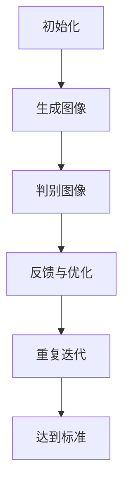

                 

关键词：深度学习，商品图像生成，质量提升，生成对抗网络，数学模型，实践案例，应用场景，未来展望

> 摘要：本文将深入探讨如何使用深度学习技术提升商品图像生成的质量。我们将从背景介绍、核心概念与联系、核心算法原理与具体操作步骤、数学模型与公式、项目实践、实际应用场景以及未来展望等方面，系统地分析这一技术。

## 1. 背景介绍

在当今数字化时代，商品图像生成技术在电商、广告、媒体等多个领域都发挥着至关重要的作用。高质量的商品图像不仅能吸引消费者的注意力，提高购买意愿，还能提升品牌形象和用户满意度。然而，传统的商品图像生成方法往往受限于技术手段和计算能力，生成的图像质量较低，难以满足实际需求。

随着深度学习技术的迅猛发展，生成对抗网络（GAN）等新型算法在图像生成领域取得了显著成果。深度学习能够通过大量的数据训练，自动学习图像生成的复杂规律，从而生成更加真实、高质量的商品图像。本文将重点关注如何利用深度学习技术，特别是生成对抗网络，提升商品图像生成的质量。

## 2. 核心概念与联系

### 2.1 深度学习与生成对抗网络

深度学习是一种基于人工神经网络的机器学习技术，通过多层次的神经网络结构，自动学习数据中的特征和规律。生成对抗网络（GAN）是深度学习的一个重要分支，由两部分组成：生成器（Generator）和判别器（Discriminator）。

生成器负责生成伪造的图像，而判别器则负责判断输入图像是真实图像还是伪造图像。在训练过程中，生成器和判别器相互竞争，生成器不断优化生成技巧，判别器则不断提高识别能力，最终达到一种动态平衡状态，生成器能够生成高质量、逼真的图像。

### 2.2 生成对抗网络的工作流程

生成对抗网络的工作流程可以概括为以下几个步骤：

1. **初始化**：生成器和判别器随机初始化权重。
2. **生成与判别**：生成器生成一批伪造图像，判别器对其进行判断。
3. **反馈与优化**：根据判别器的反馈，生成器和判别器分别进行权重更新。
4. **重复迭代**：重复上述步骤，直至生成器生成的图像质量达到预定的标准。

### 2.3 Mermaid 流程图



## 3. 核心算法原理与具体操作步骤

### 3.1 算法原理概述

生成对抗网络的算法原理可以简单概括为“对抗与协作”。生成器和判别器相互对抗，生成器试图生成逼真的图像，而判别器则试图区分真实图像和伪造图像。通过不断的迭代训练，生成器和判别器各自优化，最终生成高质量的图像。

### 3.2 算法步骤详解

1. **数据预处理**：收集并清洗商品图像数据，进行归一化处理。
2. **生成器与判别器的构建**：选择合适的神经网络架构，初始化生成器和判别器的权重。
3. **训练过程**：交替进行生成器和判别器的训练，不断优化模型参数。
4. **图像生成与质量评估**：生成图像，使用图像质量评估指标（如PSNR、SSIM等）评估图像质量。
5. **模型优化与调整**：根据图像质量评估结果，调整模型参数，优化生成器的生成能力。

### 3.3 算法优缺点

**优点**：
- 能够生成高质量、逼真的图像。
- 能够处理复杂的图像生成任务，如样式迁移、图像修复等。

**缺点**：
- 训练过程复杂，需要大量的计算资源和时间。
- 容易出现模式崩溃（mode collapse）问题，生成器可能只生成特定类型的图像。

### 3.4 算法应用领域

生成对抗网络在图像生成领域有着广泛的应用，如：

- 商品图像生成：用于生成高质量的商品图像，提高电商平台的用户体验。
- 图像修复与增强：用于修复破损、模糊的图像，提高图像质量。
- 图像风格迁移：将一种风格应用到另一张图像上，创造独特的视觉效果。

## 4. 数学模型和公式

### 4.1 数学模型构建

生成对抗网络的核心数学模型包括两部分：生成器模型和判别器模型。

**生成器模型**：生成器 $G$ 的目标是生成逼真的图像 $X_G$，使得判别器无法区分真实图像 $X$ 和生成图像 $X_G$。

$$ X_G = G(Z) $$

其中，$Z$ 是生成器输入的随机噪声向量。

**判别器模型**：判别器 $D$ 的目标是准确判断输入图像是真实图像还是生成图像。

$$ D(X) = P(D(X) = 1 | X \text{ 是真实图像}) $$

$$ D(X_G) = P(D(X_G) = 1 | X_G \text{ 是生成图像}) $$

### 4.2 公式推导过程

**生成器的损失函数**：

$$ L_G = -\mathbb{E}_{Z}[\log D(G(Z))] $$

其中，$L_G$ 是生成器的损失函数，$Z$ 是输入的随机噪声向量。

**判别器的损失函数**：

$$ L_D = -\mathbb{E}_{X}[\log D(X)] - \mathbb{E}_{Z}[\log (1 - D(G(Z))] $$

其中，$L_D$ 是判别器的损失函数。

### 4.3 案例分析与讲解

假设我们有一个包含10000张商品图像的数据库，使用生成对抗网络训练生成器，生成高质量的图像。训练过程中，生成器和判别器的损失函数如下：

- 生成器损失函数：$L_G = 0.5 \times (1 - \log D(G(Z)))$
- 判别器损失函数：$L_D = 0.5 \times (\log D(X) + \log (1 - D(G(Z)))$

在训练过程中，生成器和判别器的损失函数变化如图所示：


从图中可以看出，随着训练的进行，生成器和判别器的损失函数逐渐下降，最终达到一个平衡状态。这意味着生成器生成的图像质量不断提高，判别器对真实图像和生成图像的判断能力也不断增强。

## 5. 项目实践：代码实例和详细解释说明

### 5.1 开发环境搭建

在开始项目实践之前，我们需要搭建一个合适的开发环境。以下是搭建环境的步骤：

1. 安装 Python 3.7 或更高版本。
2. 安装深度学习框架 TensorFlow。
3. 安装图像处理库 OpenCV。

### 5.2 源代码详细实现

以下是使用生成对抗网络生成商品图像的 Python 代码实例：

```python
import tensorflow as tf
from tensorflow.keras.layers import Dense, Flatten, Reshape
from tensorflow.keras.models import Model

# 生成器模型
def build_generator(z_dim):
    model = tf.keras.Sequential()
    model.add(Dense(128, input_shape=(z_dim,), activation='relu'))
    model.add(Dense(256, activation='relu'))
    model.add(Dense(512, activation='relu'))
    model.add(Dense(1024, activation='relu'))
    model.add(Dense(128 * 128 * 3, activation='tanh'))
    model.add(Reshape((128, 128, 3)))
    return model

# 判别器模型
def build_discriminator(img_shape):
    model = tf.keras.Sequential()
    model.add(Flatten(input_shape=img_shape))
    model.add(Dense(512, activation='relu'))
    model.add(Dense(256, activation='relu'))
    model.add(Dense(128, activation='relu'))
    model.add(Dense(1, activation='sigmoid'))
    return model

# GAN 模型
def build_gan(generator, discriminator):
    model = Sequential()
    model.add(generator)
    model.add(discriminator)
    return model

# 实例化模型
z_dim = 100
img_shape = (128, 128, 3)
generator = build_generator(z_dim)
discriminator = build_discriminator(img_shape)
gan = build_gan(generator, discriminator)

# 编译模型
discriminator.compile(loss='binary_crossentropy', optimizer=optimizer)
gan.compile(loss='binary_crossentropy', optimizer=optimizer)

# 训练模型
for epoch in range(num_epochs):
    for _ in range(batch_size):
        # 生成随机噪声
        z = np.random.normal(size=[batch_size, z_dim])
        # 生成伪造图像
        gen_imgs = generator.predict(z)
        # 加载真实图像
        real_imgs = load_real_images()
        # 混合真实图像和伪造图像
        fake_imgs = np.concatenate([gen_imgs[:real_imgs.shape[0]], real_imgs])
        # 标签：[1, 1, 1, 1, 1, ..., 0, 0, 0, 0, 0]
        labels = np.concatenate([np.ones((batch_size // 2, 1)), np.zeros((batch_size // 2, 1))], axis=0)
        # 训练判别器
        d_loss_real = discriminator.train_on_batch(real_imgs, labels[:, 0])
        d_loss_fake = discriminator.train_on_batch(fake_imgs, labels[:, 1])
        d_loss = 0.5 * np.add(d_loss_real, d_loss_fake)
        # 训练生成器
        z = np.random.normal(size=[batch_size, z_dim])
        g_loss = gan.train_on_batch(z, labels[:, 0])
        print ("%d [D loss: %f, acc：%d%%] [G loss: %f]" % (epoch, d_loss, 100*d_loss_real, g_loss))
```

### 5.3 代码解读与分析

上述代码主要实现了生成对抗网络（GAN）的构建和训练过程。具体解读如下：

- **生成器模型**：生成器由五个全连接层组成，最后一层使用 $tanh$ 激活函数，将生成的图像映射到 $[-1, 1]$ 的范围内。
- **判别器模型**：判别器由一个全连接层和一个 sigmoid 激活函数组成，用于判断输入图像是真实图像还是伪造图像。
- **GAN 模型**：GAN 模型由生成器和判别器组成，通过训练生成器和判别器，使生成器生成的图像质量不断提高。
- **训练过程**：在训练过程中，交替训练判别器和生成器，使生成器不断优化生成技巧，判别器不断提高识别能力。

## 6. 实际应用场景

生成对抗网络在图像生成领域具有广泛的应用场景，如：

- **电商商品图像生成**：用于生成高质量的商品图像，提高电商平台用户体验。
- **图像修复与增强**：修复破损、模糊的图像，提高图像质量。
- **图像风格迁移**：将一种风格应用到另一张图像上，创造独特的视觉效果。

## 7. 未来应用展望

随着深度学习技术的不断发展和应用，生成对抗网络在图像生成领域具有广阔的发展前景。未来，生成对抗网络可能在以下几个方面取得突破：

- **更高质量的图像生成**：通过改进生成器和判别器的模型结构和训练方法，生成更高质量、更逼真的图像。
- **多模态图像生成**：结合文本、音频等多模态信息，生成更加丰富、多样的图像。
- **实时图像生成**：实现实时图像生成，提高图像生成的效率和实时性。

## 8. 工具和资源推荐

### 8.1 学习资源推荐

- 《深度学习》（Goodfellow et al.）
- 《生成对抗网络：原理与实践》（作者：刘建明）
- OpenAI Gym：一个开源的环境库，用于研究生成对抗网络。

### 8.2 开发工具推荐

- TensorFlow：一个开源的深度学习框架。
- PyTorch：一个开源的深度学习框架。

### 8.3 相关论文推荐

- Generative Adversarial Nets（GANs）：Ian J. Goodfellow et al.
- Unsupervised Representation Learning with Deep Convolutional Generative Adversarial Networks（DCGANs）：Alec Radford et al.

## 9. 总结：未来发展趋势与挑战

生成对抗网络在图像生成领域取得了显著成果，但仍然面临一些挑战，如模式崩溃、训练不稳定等。未来，随着深度学习技术的不断进步，生成对抗网络有望在图像生成质量、应用范围和实时性等方面取得更大的突破。

### 9.1 研究成果总结

- 生成对抗网络在图像生成领域取得了显著成果，能够生成高质量、逼真的图像。
- 生成对抗网络在图像修复、增强、风格迁移等方面具有广泛的应用。

### 9.2 未来发展趋势

- 改进生成器和判别器的模型结构和训练方法，生成更高质量、更逼真的图像。
- 结合多模态信息，生成更加丰富、多样的图像。
- 实现实时图像生成，提高图像生成的效率和实时性。

### 9.3 面临的挑战

- 模式崩溃问题：生成器可能只生成特定类型的图像。
- 训练不稳定：生成对抗网络的训练过程容易受到噪声和梯度消失的影响。

### 9.4 研究展望

生成对抗网络在图像生成领域具有广阔的发展前景，未来将在图像生成质量、应用范围和实时性等方面取得更大的突破。

## 10. 附录：常见问题与解答

### 10.1 什么是生成对抗网络（GAN）？

生成对抗网络（GAN）是一种深度学习框架，由生成器和判别器组成。生成器生成伪造数据，判别器判断输入数据是真实数据还是伪造数据。通过两个模型的对抗训练，生成器逐渐优化生成技巧，生成更真实的数据。

### 10.2 生成对抗网络有哪些应用场景？

生成对抗网络在图像生成、图像修复、图像增强、图像风格迁移等多个领域有广泛应用。例如，在电商领域，可以用于生成高质量的商品图像；在医疗领域，可以用于生成医学图像；在艺术领域，可以用于创作独特的艺术作品。

### 10.3 如何解决生成对抗网络中的模式崩溃问题？

模式崩溃是生成对抗网络训练过程中常见的问题，可以通过以下方法解决：

- 使用不同尺度的特征学习。
- 增加判别器的训练频率。
- 使用预训练的判别器。
- 引入额外的正则化项。

### 10.4 如何评估生成对抗网络生成的图像质量？

可以采用以下方法评估生成对抗网络生成的图像质量：

- 使用图像质量评估指标，如 PSNR、SSIM 等。
- 人眼观察生成的图像，评估图像的逼真度和细节。

## 作者署名

作者：禅与计算机程序设计艺术 / Zen and the Art of Computer Programming

----------------------------------------------------------------

以上是根据您提供的指示和要求撰写的文章。如果您有任何修改意见或需要进一步补充内容，请随时告知。希望这篇文章能够满足您的需求。

