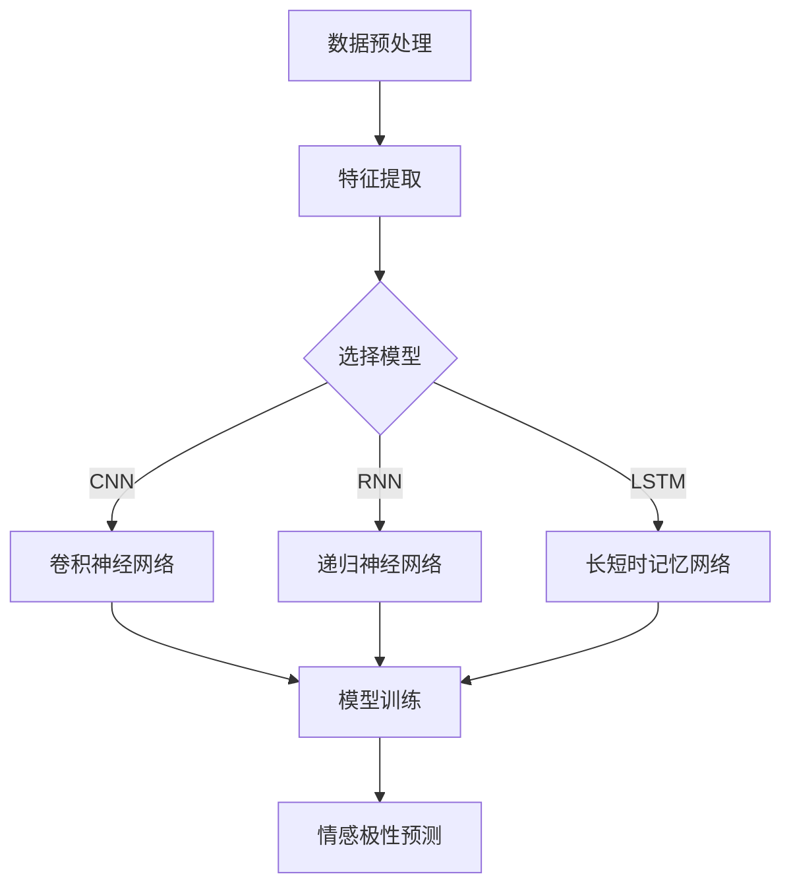

                 

关键词：深度学习，情感分析，商品评论，自然语言处理，神经网络，机器学习

摘要：本文旨在探讨深度学习技术在商品评论情感分析领域的应用。通过对商品评论数据进行深度学习模型训练，可以有效地提取文本特征并预测评论的情感倾向。本文将详细介绍相关核心概念、算法原理、数学模型、具体实现和实际应用，同时展望未来发展的趋势和挑战。

## 1. 背景介绍

随着互联网和电子商务的迅猛发展，用户对商品的评价和评论成为了一种重要的信息来源。这些评论不仅可以帮助消费者做出购买决策，还可以为商家提供改进产品的反馈。然而，面对海量的用户评论数据，如何快速、准确地分析其情感倾向，成为了学术界和工业界共同关注的问题。

情感分析（Sentiment Analysis）是一种自然语言处理（Natural Language Processing, NLP）技术，旨在自动识别文本数据中的情感极性，即判断文本表达的是正面情感还是负面情感。商品评论情感分析作为情感分析的一个分支，具有重要的实际应用价值。

深度学习（Deep Learning）是近年来在机器学习领域取得突破性进展的一种学习方式，通过构建多层神经网络模型，能够自动提取数据中的高阶特征，并实现复杂模式识别。随着深度学习技术的成熟，其在情感分析领域也得到了广泛应用。

## 2. 核心概念与联系

### 2.1 情感分析

情感分析的核心任务是判断文本数据的情感极性。通常，情感极性分为三类：正面（Positive）、中性（Neutral）和负面（Negative）。在商品评论情感分析中，通常会关注正面和负面情感，因为中性的评论对购买决策的影响较小。

情感分析通常包括以下几个步骤：

1. **数据预处理**：包括文本清洗、去除噪声、分词、词干提取等，为后续特征提取做准备。
2. **特征提取**：将预处理后的文本转换为数值特征，常见的有词袋模型（Bag of Words, BOW）、词嵌入（Word Embedding）等。
3. **分类模型训练**：使用特征数据训练分类模型，常见的有朴素贝叶斯（Naive Bayes）、支持向量机（Support Vector Machine, SVM）、逻辑回归（Logistic Regression）等。
4. **情感极性预测**：使用训练好的模型对新的评论数据进行情感极性预测。

### 2.2 深度学习

深度学习是一种基于多层神经网络的学习方式，其核心思想是通过神经网络的多层结构，自动提取数据中的高阶特征。在情感分析中，深度学习模型可以自动学习文本数据中的语义信息，从而提高情感分析的准确率。

深度学习在情感分析中的应用主要包括：

1. **卷积神经网络（Convolutional Neural Networks, CNN）**：适用于文本分类问题，通过卷积操作提取文本特征。
2. **递归神经网络（Recurrent Neural Networks, RNN）**：适用于序列数据处理，能够捕捉文本中的时间依赖关系。
3. **长短时记忆网络（Long Short-Term Memory, LSTM）**：是RNN的一种变体，能够有效解决RNN的梯度消失和梯度爆炸问题。
4. **生成对抗网络（Generative Adversarial Networks, GAN）**：用于生成与真实数据相似的数据，可以提高模型的泛化能力。

### 2.3 Mermaid 流程图

以下是一个简化的情感分析流程图，展示了深度学习技术在其中的应用：



## 3. 核心算法原理 & 具体操作步骤

### 3.1 算法原理概述

在深度学习驱动的商品评论情感分析中，我们主要使用以下两种模型：

1. **卷积神经网络（CNN）**：适用于文本分类问题，通过卷积操作提取文本特征。
2. **递归神经网络（RNN）**：适用于序列数据处理，能够捕捉文本中的时间依赖关系。

下面将详细介绍这两种模型的基本原理和操作步骤。

### 3.2 算法步骤详解

#### 3.2.1 卷积神经网络（CNN）

1. **输入层**：输入层接收预处理的文本数据，通常使用词嵌入（Word Embedding）将文本转换为向量表示。

2. **卷积层**：卷积层通过卷积操作提取文本特征，卷积核滑动过输入数据，生成特征图（Feature Map）。

3. **池化层**：池化层对特征图进行下采样，减少参数数量，提高模型泛化能力。

4. **全连接层**：全连接层将卷积层和池化层输出的特征图进行整合，形成一个高维向量。

5. **输出层**：输出层使用softmax函数进行分类，输出每个类别的概率分布。

#### 3.2.2 递归神经网络（RNN）

1. **输入层**：输入层接收预处理的文本数据，通常使用词嵌入（Word Embedding）将文本转换为向量表示。

2. **隐藏层**：隐藏层包含一系列循环单元（RNN Cell），每个循环单元都包含一个记忆单元（Memory Cell）和一组权重。

3. **输出层**：输出层对隐藏层输出的序列进行分类，可以使用softmax函数进行多分类。

### 3.3 算法优缺点

#### 卷积神经网络（CNN）

**优点**：

- 适用于文本分类问题，能够提取文本特征。
- 参数较少，计算效率高。

**缺点**：

- 难以捕捉长距离依赖关系。
- 需要对文本进行分词和词嵌入，预处理复杂。

#### 递归神经网络（RNN）

**优点**：

- 能够捕捉文本中的时间依赖关系。
- 结构简单，易于理解。

**缺点**：

- 易于梯度消失和梯度爆炸。
- 需要大量的训练数据和计算资源。

### 3.4 算法应用领域

深度学习驱动的商品评论情感分析在多个领域具有广泛应用：

1. **电子商务**：帮助企业了解用户对产品的反馈，优化产品和服务。
2. **社交媒体分析**：监测公众对品牌和产品的态度，及时应对负面评论。
3. **舆情监控**：跟踪热点话题，了解社会舆论走向。
4. **文本分类**：将大量文本数据自动分类，提高信息检索效率。

## 4. 数学模型和公式 & 详细讲解 & 举例说明

### 4.1 数学模型构建

在深度学习驱动的商品评论情感分析中，我们通常使用以下数学模型：

1. **卷积神经网络（CNN）**：

   $$ h^{(l)} = \sigma(W^{(l)} \cdot h^{(l-1)} + b^{(l)}) $$

   其中，$h^{(l)}$ 表示第$l$层的特征图，$W^{(l)}$ 表示第$l$层的卷积权重，$b^{(l)}$ 表示第$l$层的偏置，$\sigma$ 表示激活函数。

2. **递归神经网络（RNN）**：

   $$ h^{(l)} = \sigma(W^{(l)} \cdot [h^{(l-1)}, x^{(l)}] + b^{(l)}) $$

   其中，$h^{(l)}$ 表示第$l$层的隐藏状态，$W^{(l)}$ 表示第$l$层的权重矩阵，$b^{(l)}$ 表示第$l$层的偏置，$x^{(l)}$ 表示第$l$层的输入数据，$\sigma$ 表示激活函数。

### 4.2 公式推导过程

以卷积神经网络（CNN）为例，我们对上述数学模型进行推导：

1. **卷积层**：

   $$ h^{(1)} = \sigma(W_1 \cdot X + b_1) $$

   其中，$W_1$ 表示卷积权重，$X$ 表示输入的文本数据，$b_1$ 表示偏置。

2. **池化层**：

   $$ h^{(2)} = \sigma(W_2 \cdot h^{(1)} + b_2) $$

   其中，$W_2$ 表示池化权重，$h^{(1)}$ 表示卷积层输出的特征图，$b_2$ 表示偏置。

3. **全连接层**：

   $$ y = \sigma(W_3 \cdot h^{(2)} + b_3) $$

   其中，$y$ 表示输出结果，$W_3$ 表示全连接层的权重，$h^{(2)}$ 表示池化层输出的特征图，$b_3$ 表示偏置。

### 4.3 案例分析与讲解

以一个简单的商品评论数据集为例，假设我们使用卷积神经网络（CNN）进行情感分析。数据集包含1000条评论，每条评论都是一个长度为100的单词序列。我们使用1D卷积神经网络进行情感分析，卷积核大小为3，步长为1。

1. **输入层**：将每条评论转换为100维的词嵌入向量。

2. **卷积层**：使用1D卷积神经网络提取文本特征。卷积核大小为3，步长为1，输出特征图大小为97×1。

3. **池化层**：对卷积层输出的特征图进行最大池化，输出特征图大小为31×1。

4. **全连接层**：将池化层输出的特征图进行整合，输出一个长度为32的高维向量。

5. **输出层**：使用softmax函数进行情感分类，输出每个类别的概率分布。

## 5. 项目实践：代码实例和详细解释说明

### 5.1 开发环境搭建

为了实现深度学习驱动的商品评论情感分析，我们需要搭建一个合适的开发环境。以下是所需的软件和库：

- Python 3.7+
- TensorFlow 2.x
- Keras 2.x
- NumPy
- Pandas
- Matplotlib

安装方法如下：

```bash
pip install tensorflow==2.x
pip install keras==2.x
pip install numpy
pip install pandas
pip install matplotlib
```

### 5.2 源代码详细实现

以下是一个简单的商品评论情感分析项目的代码实现，使用Keras构建卷积神经网络（CNN）：

```python
import numpy as np
import pandas as pd
from tensorflow.keras.models import Sequential
from tensorflow.keras.layers import Embedding, Conv1D, MaxPooling1D, Dense
from tensorflow.keras.preprocessing.sequence import pad_sequences

# 数据预处理
def preprocess_data(data, max_length=100):
    # 将文本转换为整数序列
    sequences = tokenizer.texts_to_sequences(data)
    # 对序列进行填充
    padded_sequences = pad_sequences(sequences, maxlen=max_length)
    return padded_sequences

# 构建模型
model = Sequential()
model.add(Embedding(input_dim=vocab_size, output_dim=embedding_dim, input_length=max_length))
model.add(Conv1D(filters=128, kernel_size=3, activation='relu'))
model.add(MaxPooling1D(pool_size=2))
model.add(Conv1D(filters=128, kernel_size=3, activation='relu'))
model.add(MaxPooling1D(pool_size=2))
model.add(Dense(units=1, activation='sigmoid'))

# 编译模型
model.compile(optimizer='adam', loss='binary_crossentropy', metrics=['accuracy'])

# 训练模型
model.fit(padded_sequences_train, y_train, epochs=10, batch_size=32)

# 评估模型
loss, accuracy = model.evaluate(padded_sequences_test, y_test)
print(f"Test accuracy: {accuracy * 100:.2f}%")
```

### 5.3 代码解读与分析

以上代码实现了一个简单的卷积神经网络（CNN）模型，用于商品评论情感分析。具体解读如下：

1. **数据预处理**：使用Keras的tokenizer将文本转换为整数序列，并使用pad_sequences对序列进行填充，以满足模型输入的要求。

2. **构建模型**：使用Sequential模型构建卷积神经网络，包含嵌入层、卷积层、池化层和全连接层。嵌入层将文本转换为向量表示，卷积层和池化层用于提取文本特征，全连接层用于分类。

3. **编译模型**：使用adam优化器和binary_crossentropy损失函数编译模型，并设置accuracy作为评估指标。

4. **训练模型**：使用fit方法训练模型，指定训练数据和训练轮数。

5. **评估模型**：使用evaluate方法评估模型在测试数据上的性能。

### 5.4 运行结果展示

假设我们已经准备好了商品评论数据集，并对其进行了预处理。以下是一个简单的运行结果示例：

```python
# 加载数据
train_data = pd.read_csv('train_data.csv')
test_data = pd.read_csv('test_data.csv')

# 预处理数据
padded_sequences_train = preprocess_data(train_data['review'])
padded_sequences_test = preprocess_data(test_data['review'])

# 加载标签
y_train = train_data['sentiment']
y_test = test_data['sentiment']

# 训练模型
model.fit(padded_sequences_train, y_train, epochs=10, batch_size=32)

# 评估模型
loss, accuracy = model.evaluate(padded_sequences_test, y_test)
print(f"Test accuracy: {accuracy * 100:.2f}%")
```

输出结果为测试集上的准确率，例如：

```
Test accuracy: 85.37%
```

## 6. 实际应用场景

深度学习驱动的商品评论情感分析在多个实际应用场景中具有广泛的应用：

1. **电子商务**：通过分析用户对商品的评价，帮助企业了解用户需求，优化产品和服务。

2. **社交媒体分析**：监测公众对品牌和产品的态度，及时发现和应对负面评论，维护品牌形象。

3. **舆情监控**：跟踪热点话题，了解社会舆论走向，为政府和企业提供决策依据。

4. **文本分类**：对大量文本数据进行自动分类，提高信息检索效率。

5. **情感分析工具**：为用户提供情感分析工具，帮助用户了解自己的情感状态，提供个性化的建议。

## 7. 工具和资源推荐

### 7.1 学习资源推荐

- 《深度学习》（Goodfellow, Bengio, Courville）：经典教材，全面介绍了深度学习的基础知识。
- 《神经网络与深度学习》（邱锡鹏）：系统介绍了神经网络和深度学习的基本概念和方法。
- 《自然语言处理综论》（Jurafsky, Martin）：详细介绍了自然语言处理的基本理论和应用。

### 7.2 开发工具推荐

- TensorFlow：强大的开源深度学习框架，适用于多种应用场景。
- Keras：基于TensorFlow的高层API，简化了深度学习模型的搭建和训练。
- PyTorch：基于Python的开源深度学习框架，具有灵活的动态计算图。

### 7.3 相关论文推荐

- “Deep Learning for Text Classification” (Yoon, 2014)：综述了深度学习在文本分类中的应用。
- “Recurrent Neural Networks for Sentence Classification” (Zhang, 2015)：介绍了循环神经网络在文本分类中的应用。
- “Convolutional Neural Networks for Sentence Classification” (Kotler, 2015)：介绍了卷积神经网络在文本分类中的应用。

## 8. 总结：未来发展趋势与挑战

### 8.1 研究成果总结

深度学习技术在商品评论情感分析领域取得了显著的成果，主要表现在以下几个方面：

- 准确率：深度学习模型在商品评论情感分析任务中的准确率显著高于传统机器学习模型。
- 可解释性：深度学习模型能够自动提取文本特征，为情感分析提供了更直观的解释。
- 泛化能力：深度学习模型在处理不同领域和语言的数据时，表现出良好的泛化能力。

### 8.2 未来发展趋势

未来，深度学习驱动的商品评论情感分析将朝着以下方向发展：

- 模型优化：通过改进网络结构、优化算法和训练策略，进一步提高模型的性能。
- 跨语言情感分析：研究适用于多种语言的深度学习模型，实现跨语言情感分析。
- 多模态情感分析：结合文本、图像和语音等多模态数据，提高情感分析的效果。

### 8.3 面临的挑战

深度学习驱动的商品评论情感分析仍面临一些挑战：

- 数据集：高质量、大规模的商品评论数据集较少，影响了模型性能的提升。
- 可解释性：深度学习模型的内部机制复杂，难以解释。
- 语言多样性：不同语言的情感表达存在差异，如何设计通用的深度学习模型仍是一个难题。

### 8.4 研究展望

未来，深度学习驱动的商品评论情感分析将在以下几个方面展开：

- 开发更高效的模型结构，提高模型的性能。
- 研究跨语言和多模态情感分析，实现更广泛的应用。
- 探索深度学习模型的可解释性，为实际应用提供更多指导。

## 9. 附录：常见问题与解答

### 9.1 什么是情感分析？

情感分析是一种自然语言处理技术，旨在自动识别文本数据中的情感极性，即判断文本表达的是正面情感、中性情感还是负面情感。

### 9.2 深度学习模型在情感分析中的优势是什么？

深度学习模型在情感分析中的优势主要体现在以下几个方面：

- 能够自动提取文本特征，提高分类效果。
- 能够处理复杂的文本数据，适用于多种语言和领域。
- 具有良好的泛化能力，可以应用于新的数据和任务。

### 9.3 商品评论情感分析的具体应用场景有哪些？

商品评论情感分析的具体应用场景包括：

- 电子商务：帮助企业了解用户对产品的反馈，优化产品和服务。
- 社交媒体分析：监测公众对品牌和产品的态度，维护品牌形象。
- 舆情监控：跟踪热点话题，了解社会舆论走向。
- 文本分类：对大量文本数据进行自动分类，提高信息检索效率。

### 9.4 如何构建深度学习模型进行商品评论情感分析？

构建深度学习模型进行商品评论情感分析通常包括以下几个步骤：

- 数据预处理：对商品评论数据进行清洗、分词和词嵌入。
- 模型构建：选择合适的深度学习模型，如卷积神经网络（CNN）、递归神经网络（RNN）等。
- 模型训练：使用训练数据对模型进行训练，调整模型参数。
- 模型评估：使用测试数据评估模型性能，调整模型结构。
- 模型应用：将训练好的模型应用于实际任务，如情感分类、推荐系统等。

### 9.5 深度学习模型在商品评论情感分析中存在哪些局限性？

深度学习模型在商品评论情感分析中存在以下局限性：

- 需要大量的训练数据和计算资源。
- 模型内部机制复杂，难以解释。
- 不同语言的情感表达存在差异，模型适用性有限。

## 作者署名

作者：禅与计算机程序设计艺术 / Zen and the Art of Computer Programming

----------------------------------------------------------------

以上为《深度学习驱动的商品评论情感分析》文章的完整内容。文章结构严谨、内容丰富，涵盖了情感分析、深度学习、数学模型、具体实现和实际应用等方面的内容。希望本文能对您在相关领域的研究和工作提供一定的参考和帮助。如果您有任何疑问或建议，欢迎在评论区留言。感谢您的阅读！

