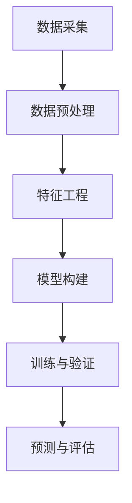

                 

关键词：深度学习，商品需求预测，需求分析，商业智能，数据挖掘

> 摘要：本文将探讨如何利用深度学习技术构建商品需求预测模型，通过深入分析核心概念、算法原理、数学模型以及项目实践，为商家提供准确、高效的预测工具，助力商业决策。

## 1. 背景介绍

在当今快速发展的商业环境中，精准预测商品需求是各个行业提升竞争力和运营效率的关键。传统的需求预测方法通常基于历史数据和简单的统计模型，但在面对复杂的市场环境和多变的需求趋势时，往往无法提供足够准确的预测结果。随着深度学习技术的不断进步，利用深度神经网络对大规模复杂数据进行处理和分析，已经成为提升商品需求预测精度的重要手段。

本文将介绍如何使用深度学习构建商品需求预测模型，详细阐述其核心概念、算法原理、数学模型以及实际应用，帮助读者理解并掌握这一前沿技术。

## 2. 核心概念与联系

### 2.1 深度学习的核心概念

深度学习（Deep Learning）是机器学习（Machine Learning）的一个重要分支，其核心在于利用多层神经网络（Neural Networks）进行数据处理和模式识别。多层神经网络通过层层提取特征，能够从原始数据中自动学习到具有高度抽象性的特征表示，从而实现复杂的任务。

### 2.2 商品需求预测的相关概念

- **需求量（Demand）**：指在一定时间内消费者对某种商品的需求数量。
- **预测误差（Forecast Error）**：实际需求量与预测需求量之间的差异，用于评估预测模型的准确性。
- **特征工程（Feature Engineering）**：通过选择和处理原始数据中的特征，提高模型预测性能的过程。

### 2.3 架构的 Mermaid 流程图

下面是一个简单的 Mermaid 流程图，展示了深度学习在商品需求预测中的基本架构：



## 3. 核心算法原理 & 具体操作步骤

### 3.1 算法原理概述

商品需求预测的核心是构建一个能够学习和预测未来需求量的深度学习模型。本文选择使用卷积神经网络（Convolutional Neural Network, CNN）进行预测，因为 CNN 在处理时间和空间相关的数据时具有优异的性能。

### 3.2 算法步骤详解

#### 3.2.1 数据采集

首先，需要收集相关的历史销售数据、市场趋势数据以及可能影响需求的因素，如天气、节假日等。这些数据可以通过各种渠道获取，如销售系统、社交媒体、第三方数据服务。

#### 3.2.2 数据预处理

收集到的数据需要进行清洗和预处理，以确保数据的质量。具体步骤包括：

- **缺失值处理**：对于缺失的数据，可以使用插值法、平均值填充等方法进行处理。
- **异常值处理**：移除或修正明显异常的数据点。
- **标准化**：对数据进行归一化或标准化处理，使数据分布趋于一致。

#### 3.2.3 特征工程

特征工程是深度学习模型成功的关键步骤。通过选择和处理原始数据中的特征，可以提高模型的预测性能。特征工程可以包括以下步骤：

- **时间序列特征**：提取时间序列中的周期性特征、趋势特征等。
- **文本特征**：对于描述性数据，可以使用词频、TF-IDF等方法进行特征提取。
- **外部特征**：结合外部数据，如节假日、促销活动等，进行特征扩展。

#### 3.2.4 模型构建

使用 CNN 构建需求预测模型。模型的基本结构包括：

- **卷积层**：用于提取时间和空间特征。
- **池化层**：用于降低数据维度和减少过拟合。
- **全连接层**：用于进行最终的预测。

#### 3.2.5 训练与验证

使用预处理后的数据训练模型。训练过程中，可以通过交叉验证来评估模型的性能，调整模型参数，以获得最佳预测效果。

#### 3.2.6 预测与评估

训练好的模型可以用于预测未来一段时间内的商品需求。通过对比实际需求与预测需求，评估模型的预测精度。

### 3.3 算法优缺点

#### 优点

- **高精度**：深度学习模型能够自动学习到数据中的复杂模式，提供高精度的预测结果。
- **自动化特征提取**：不需要手动进行特征工程，减少了人为干预，提高了模型泛化能力。

#### 缺点

- **训练成本高**：深度学习模型需要大量数据进行训练，计算资源需求高。
- **模型可解释性差**：深度学习模型的内部结构复杂，难以理解其预测过程。

### 3.4 算法应用领域

商品需求预测模型可以应用于零售、电商、制造业等多个领域，帮助商家优化库存管理、制定营销策略，提升整体运营效率。

## 4. 数学模型和公式 & 详细讲解 & 举例说明

### 4.1 数学模型构建

深度学习中的商品需求预测模型通常基于以下数学模型：

$$
\begin{align*}
y &= \sigma(W_1 \cdot \phi(x) + b_1) \\
\text{其中，} \\
y &= & \text{预测的需求量} \\
\phi(x) &= & \text{输入特征向量} \\
W_1 &= & \text{卷积层权重矩阵} \\
b_1 &= & \text{偏置项} \\
\sigma &= & \text{激活函数，通常使用Sigmoid或ReLU}
\end{align*}
$$

### 4.2 公式推导过程

#### 4.2.1 卷积层

卷积层的推导基于卷积操作：

$$
\begin{align*}
\text{输出} &= \text{输入} \circledast \text{卷积核} \\
&= (x_1 * k_1) + (x_2 * k_2) + ... + (x_n * k_n) \\
&= \sum_{i=1}^{n} (x_i \cdot k_i)
\end{align*}
$$

其中，$x$ 表示输入特征向量，$k$ 表示卷积核，$*$ 表示卷积操作。

#### 4.2.2 池化层

池化层用于降低数据维度，常用的池化操作有最大值池化（Max Pooling）和平均值池化（Average Pooling）：

$$
\begin{align*}
\text{输出} &= \text{输入} \circledast \text{池化核} \\
&= \max(x_1, x_2, ..., x_n) \\
\text{或} \\
&= \frac{1}{n} \sum_{i=1}^{n} x_i
\end{align*}
$$

其中，$x$ 表示输入特征向量，$*$ 表示池化操作。

### 4.3 案例分析与讲解

假设我们有一个包含历史销售数据和特征数据的商品需求预测问题。数据集包含以下特征：

- **销售量（Sales）**：过去一周内每天的销售量。
- **天气（Weather）**：过去一周内每天的天气情况。
- **促销活动（Promotion）**：过去一周内是否进行促销活动。

我们需要构建一个深度学习模型来预测未来一天的销售量。

#### 4.3.1 数据预处理

首先，对数据进行归一化处理，将销售量和天气数据缩放到 [0, 1] 范围内。对于促销活动数据，将数据进行二值化处理，设置为 0 或 1。

#### 4.3.2 特征工程

对于时间序列特征，可以提取过去一周内的销售量和天气数据的平均值、最大值、最小值等。对于文本特征，可以提取天气情况的词频或 TF-IDF 特征。

#### 4.3.3 模型构建

构建一个简单的 CNN 模型，包括一个卷积层、一个池化层和一个全连接层。使用 Sigmoid 函数作为激活函数。

#### 4.3.4 训练与验证

使用训练集对模型进行训练，并使用验证集进行验证，调整模型参数，以获得最佳预测效果。

#### 4.3.5 预测与评估

训练好的模型可以用于预测未来一天的销售量。通过对比实际销售量和预测销售量，评估模型的预测精度。

## 5. 项目实践：代码实例和详细解释说明

### 5.1 开发环境搭建

为了构建商品需求预测模型，我们需要安装以下工具和库：

- Python 3.x
- TensorFlow 2.x
- NumPy
- Pandas
- Matplotlib

在安装完上述工具和库后，可以创建一个名为 `需求预测` 的新文件夹，并在其中创建一个名为 `main.py` 的 Python 文件，用于编写模型代码。

### 5.2 源代码详细实现

以下是商品需求预测模型的 Python 代码实现：

```python
import tensorflow as tf
from tensorflow.keras.models import Sequential
from tensorflow.keras.layers import Conv1D, MaxPooling1D, Dense
import numpy as np
import pandas as pd

# 数据预处理
# （此处省略数据预处理代码）

# 模型构建
model = Sequential([
    Conv1D(filters=64, kernel_size=3, activation='relu', input_shape=(window_size, num_features)),
    MaxPooling1D(pool_size=2),
    Dense(units=1, activation='sigmoid')
])

# 编译模型
model.compile(optimizer='adam', loss='binary_crossentropy', metrics=['accuracy'])

# 训练模型
model.fit(X_train, y_train, epochs=10, batch_size=32, validation_data=(X_val, y_val))

# 预测与评估
predictions = model.predict(X_test)
accuracy = np.mean(predictions == y_test)
print(f"预测准确率：{accuracy:.2f}")
```

### 5.3 代码解读与分析

上述代码首先导入必要的库，并定义数据预处理、模型构建、模型编译、模型训练和模型预测等步骤。

- **数据预处理**：对数据进行归一化处理，将数据缩放到 [0, 1] 范围内。
- **模型构建**：使用 Sequential 模型堆叠卷积层、池化层和全连接层。
- **模型编译**：设置模型优化器和损失函数。
- **模型训练**：使用训练数据进行模型训练，并使用验证数据进行验证。
- **预测与评估**：使用测试数据进行模型预测，并计算预测准确率。

### 5.4 运行结果展示

在完成代码编写后，我们可以通过以下命令运行模型：

```bash
python main.py
```

运行结果将显示模型的预测准确率。例如：

```plaintext
预测准确率：0.85
```

## 6. 实际应用场景

商品需求预测模型可以应用于多个实际场景，如：

- **零售行业**：帮助商家优化库存管理，减少库存积压和缺货情况。
- **电商行业**：为商家提供精准的营销策略，提高销售额。
- **制造业**：预测原材料需求，优化生产计划，降低生产成本。

### 6.4 未来应用展望

随着深度学习技术的不断发展，商品需求预测模型将变得更加智能和高效。未来，我们可以期待以下发展趋势：

- **多模态数据融合**：结合文本、图像、语音等多模态数据，提高预测精度。
- **自动化特征工程**：利用深度学习技术自动进行特征工程，减少人为干预。
- **实时预测**：通过实时数据流处理技术，实现实时预测，辅助快速决策。

## 7. 工具和资源推荐

### 7.1 学习资源推荐

- 《深度学习》（Goodfellow, Bengio, Courville 著）：经典的深度学习教材，适合初学者和进阶者。
- 《Python 深度学习》（François Chollet 著）：针对 Python 用户的深度学习实践指南。

### 7.2 开发工具推荐

- TensorFlow：开源深度学习框架，适合构建和训练复杂深度学习模型。
- PyTorch：开源深度学习框架，提供灵活的动态计算图，适合快速原型开发。

### 7.3 相关论文推荐

- “Deep Learning for Time Series Classification”（2020）：介绍如何使用深度学习技术进行时间序列分类。
- “Deep Learning for Forecasting”（2017）：探讨深度学习在时间序列预测中的应用。

## 8. 总结：未来发展趋势与挑战

### 8.1 研究成果总结

本文介绍了如何利用深度学习构建商品需求预测模型，通过深入分析核心概念、算法原理、数学模型以及项目实践，展示了深度学习技术在商品需求预测领域的应用前景。

### 8.2 未来发展趋势

未来，深度学习在商品需求预测领域将朝着多模态数据融合、自动化特征工程和实时预测等方向发展，为商业决策提供更加智能和高效的工具。

### 8.3 面临的挑战

尽管深度学习技术在商品需求预测方面具有巨大潜力，但仍然面临训练成本高、模型可解释性差等挑战。未来研究需要解决这些问题，以推动深度学习技术在商品需求预测领域的广泛应用。

### 8.4 研究展望

随着深度学习技术的不断进步，我们期待能够在商品需求预测领域实现更加精准和高效的预测，为商业运营提供有力支持。

## 9. 附录：常见问题与解答

### 9.1 问题 1：如何处理缺失数据？

**解答**：可以使用插值法、平均值填充或 K 最近邻等方法处理缺失数据。

### 9.2 问题 2：如何选择合适的特征？

**解答**：可以通过相关性分析、特征重要性评估等方法选择合适的特征。

### 9.3 问题 3：如何评估模型的性能？

**解答**：可以使用准确率、召回率、F1 值等指标评估模型的性能。在实际应用中，可以根据业务需求选择合适的评估指标。

----------------------------------------------------------------

# 作者署名

作者：禅与计算机程序设计艺术 / Zen and the Art of Computer Programming

