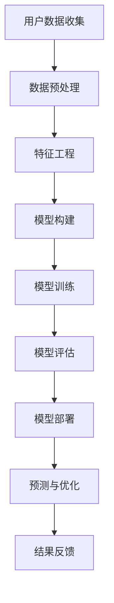

                 

关键词：深度学习，用户终身价值预测，电商，模型构建，算法原理，应用领域，数学模型，实践案例

> 摘要：本文将深入探讨如何利用深度学习技术构建电商用户终身价值预测模型。首先，我们回顾电商用户终身价值的定义和预测的重要性。接着，详细介绍了深度学习的基本原理、核心概念和联系，并通过Mermaid流程图展示了预测模型的整体架构。然后，我们深入解析了核心算法的原理、操作步骤以及优缺点和应用领域。随后，我们详细讲解了数学模型的构建和公式推导，并通过具体案例进行分析和说明。此外，我们还提供了完整的代码实例和解读，展示如何在实际项目中应用该模型。最后，我们探讨了该模型在电商行业中的实际应用场景，并对未来发展趋势和挑战进行了展望。

## 1. 背景介绍

### 1.1 电商行业的发展

电商行业自21世纪初兴起以来，经历了快速的发展和变革。随着互联网技术的不断进步和消费者购物习惯的改变，电商已经成为全球零售市场的重要组成部分。根据最新的统计数据，全球电商市场规模已经达到了数万亿美元，并且仍然保持着高速增长的趋势。

电商行业的繁荣带来了大量的用户数据和交易数据，这些数据不仅反映了用户的行为模式，还包含了潜在的商业价值。用户终身价值（Customer Lifetime Value, CLV）作为衡量用户对企业价值的重要指标，受到了越来越多电商企业的关注。预测用户终身价值可以帮助企业制定更加精准的市场营销策略，优化用户运营和资源配置，从而提高整体盈利能力。

### 1.2 用户终身价值的定义与预测

用户终身价值是指一个用户在其生命周期内为企业带来的总收益。它不仅包括用户的初始购买金额，还包括后续的复购行为、推荐新用户等间接收益。用户终身价值的预测是电商企业进行用户运营和营销决策的重要依据。

预测用户终身价值的重要性体现在以下几个方面：

1. **精准营销**：通过对用户终身价值的预测，企业可以识别出高价值用户，从而制定针对性的营销策略，提高营销投入的回报率。

2. **资源配置**：企业可以根据用户终身价值的预测结果，合理分配资源，将有限的营销预算和运营力量投入到最有潜力的用户群体中。

3. **用户留存**：通过分析用户终身价值，企业可以识别出可能流失的用户，并采取相应的措施进行挽回，提高用户留存率。

4. **业务优化**：用户终身价值的预测可以为企业的业务优化提供数据支持，帮助企业在产品开发、服务改进等方面做出更加科学的决策。

### 1.3 深度学习与用户终身价值预测

深度学习作为当前最为热门的人工智能技术之一，在图像识别、自然语言处理、语音识别等领域取得了显著的成果。近年来，深度学习技术逐渐应用于电商用户终身价值预测，成为企业提高运营效率和盈利能力的重要工具。

深度学习在用户终身价值预测中的应用主要基于以下几个方面：

1. **数据处理能力**：深度学习模型可以处理大规模的用户数据，提取出潜在的用户行为特征，为预测提供有效的数据支持。

2. **特征自动提取**：深度学习模型具有自动特征提取的能力，可以自动学习用户数据的非线性特征，提高预测的准确性。

3. **灵活性和泛化能力**：深度学习模型具有较强的灵活性和泛化能力，可以适应不同企业和用户群体的特点，提高预测模型的实用性。

4. **实时预测**：深度学习模型可以实现对用户行为的实时预测，为企业提供及时的用户运营和营销决策依据。

综上所述，深度学习技术在电商用户终身价值预测中具有显著的优势，为电商企业提供了强大的技术支持。接下来，我们将深入探讨深度学习的基本原理和核心概念，以及如何构建高效的预测模型。

## 2. 核心概念与联系

### 2.1 深度学习的基本概念

深度学习（Deep Learning）是一种基于人工神经网络（Artificial Neural Networks,ANNs）的机器学习技术，通过多层神经元的组合，实现对复杂数据的建模和预测。深度学习的基本原理可以追溯到1980年代初期，随着计算能力的提升和大数据技术的发展，深度学习逐渐成为人工智能领域的核心方向。

#### 2.1.1 神经元与神经网络

神经元（Neuron）是神经网络的基本组成单元，类似于生物神经元，它可以接收输入信息，通过权重（weights）进行加权求和，再经过激活函数（activation function）产生输出。

神经网络（Neural Network）是由多个神经元组成的复杂网络，通过层次化的结构进行数据处理和特征提取。典型的神经网络包括输入层、隐藏层和输出层，每一层都通过前一层的信息进行计算和传递。

#### 2.1.2 深度学习的层次化结构

深度学习的核心在于多层神经网络的构建和训练。通过增加网络层数，深度学习模型可以提取出更加抽象和复杂的特征，从而提高模型的预测能力。

1. **输入层**：接收外部输入数据，例如用户的购买记录、浏览历史等。
2. **隐藏层**：对输入数据进行特征提取和变换，每一层隐藏层都会产生新的特征。
3. **输出层**：根据提取的特征进行预测，例如预测用户的终身价值。

#### 2.1.3 深度学习的主要算法

深度学习模型主要包括以下几种主要的算法：

1. **深度神经网络（Deep Neural Network,DNN）**：通过多层感知机（Multilayer Perceptron,MLP）实现数据处理和预测。
2. **卷积神经网络（Convolutional Neural Network,CNN）**：适用于图像和语音处理，通过卷积操作提取空间特征。
3. **循环神经网络（Recurrent Neural Network,RNN）**：适用于序列数据建模，通过循环结构处理时间序列信息。
4. **长短时记忆网络（Long Short-Term Memory,LSTM）**：RNN的改进版本，能够更好地处理长序列数据。

### 2.2 深度学习与用户终身价值预测的联系

在用户终身价值预测中，深度学习技术的应用主要体现在以下几个方面：

1. **数据处理与特征提取**：深度学习模型可以处理大量的用户数据，通过自动特征提取技术，提取出潜在的用户行为特征，为预测提供有效的数据支持。
2. **非线性特征建模**：深度学习模型可以建模用户行为的非线性关系，从而提高预测的准确性。
3. **动态特征更新**：通过实时训练和更新模型，可以捕捉用户行为的动态变化，提高预测的实时性和准确性。
4. **多维度特征融合**：深度学习模型可以融合用户在不同时间、不同渠道的行为特征，提高预测的全面性和准确性。

### 2.3 Mermaid流程图展示

为了更好地展示深度学习在用户终身价值预测中的应用，我们使用Mermaid流程图对预测模型的整体架构进行描述。



在这个流程图中，用户数据收集是模型的输入，经过数据预处理和特征工程处理后，构建深度学习模型并进行训练和评估。模型部署后，通过对用户行为进行实时预测，不断优化模型参数，实现用户终身价值的精准预测。

通过上述分析，我们可以看到深度学习技术在用户终身价值预测中的应用具有显著的优势。接下来，我们将深入探讨深度学习的核心算法原理，以及如何具体实现用户终身价值预测模型。

## 3. 核心算法原理 & 具体操作步骤

### 3.1 算法原理概述

深度学习模型的核心在于其层次化的结构和强大的特征提取能力。在用户终身价值预测中，深度学习模型通常由输入层、隐藏层和输出层组成。每一层都通过前一层的信息进行计算和传递，从而实现对用户行为的建模和预测。

1. **输入层**：接收用户的数据，例如购买记录、浏览历史等。
2. **隐藏层**：对输入数据进行特征提取和变换，每一层隐藏层都会产生新的特征。
3. **输出层**：根据提取的特征进行预测，例如预测用户的终身价值。

深度学习模型主要通过以下步骤实现用户终身价值预测：

1. **数据预处理**：对用户数据进行清洗、归一化等处理，确保数据的质量和一致性。
2. **特征工程**：根据用户的行为特征，构建合适的特征向量，为模型提供有效的输入。
3. **模型构建**：使用深度学习框架（如TensorFlow、PyTorch等）构建深度学习模型。
4. **模型训练**：使用训练数据对模型进行训练，优化模型参数。
5. **模型评估**：使用验证数据对模型进行评估，确保模型的预测性能。
6. **模型部署**：将训练好的模型部署到生产环境中，实现实时预测。

### 3.2 算法步骤详解

#### 3.2.1 数据预处理

数据预处理是深度学习模型训练的第一步，其目的是提高数据的质量和一致性，为后续的特征提取和模型训练打下基础。具体操作步骤包括：

1. **数据清洗**：去除数据中的缺失值、异常值和重复值，确保数据的完整性和准确性。
2. **数据归一化**：将不同量纲的数据归一化到同一范围内，便于模型训练和计算。
3. **数据分割**：将数据集划分为训练集、验证集和测试集，用于模型的训练、验证和评估。

#### 3.2.2 特征工程

特征工程是深度学习模型性能优化的重要环节。通过对用户数据进行处理和转换，构建出有效的特征向量，可以提高模型的预测准确性和泛化能力。具体操作步骤包括：

1. **特征提取**：从用户的行为数据中提取出有代表性的特征，例如用户的购买频率、购买金额、浏览时长等。
2. **特征选择**：通过统计分析和模型评估，选择对预测目标有显著影响的特征，去除冗余和无关特征。
3. **特征转换**：对部分特征进行转换，例如将类别特征转换为数值特征，或者对数值特征进行离散化处理。

#### 3.2.3 模型构建

使用深度学习框架构建深度学习模型，主要包括以下步骤：

1. **定义模型结构**：根据预测任务的需求，定义模型的输入层、隐藏层和输出层结构。
2. **选择模型参数**：选择合适的激活函数、损失函数和优化器，优化模型的性能。
3. **构建模型框架**：使用深度学习框架（如TensorFlow、PyTorch等）构建模型框架，定义模型的计算图。

#### 3.2.4 模型训练

模型训练是深度学习模型构建的核心环节，主要包括以下步骤：

1. **初始化模型参数**：随机初始化模型参数，为模型训练提供初始值。
2. **前向传播**：根据输入数据和模型结构，计算模型的前向传播结果，得到预测输出。
3. **计算损失**：使用损失函数计算预测输出与真实标签之间的差异，评估模型的预测性能。
4. **反向传播**：通过反向传播算法，计算模型参数的梯度，更新模型参数。
5. **迭代训练**：重复执行前向传播、计算损失和反向传播过程，直到模型收敛。

#### 3.2.5 模型评估

模型评估是验证模型性能的重要环节，主要包括以下步骤：

1. **验证集评估**：使用验证集对模型进行评估，计算模型的预测准确率、召回率等指标。
2. **测试集评估**：使用测试集对模型进行评估，验证模型的泛化能力。
3. **交叉验证**：使用交叉验证技术，对模型进行多次评估，提高评估结果的可靠性。

#### 3.2.6 模型部署

模型部署是将训练好的模型应用到实际生产环境中，主要包括以下步骤：

1. **模型转换**：将训练好的模型转换为生产环境可用的格式，例如TensorFlow Lite、PyTorch Mobile等。
2. **部署环境准备**：配置生产环境，包括服务器、数据库等基础设施。
3. **实时预测**：通过API接口，实现实时用户终身价值预测，为企业提供决策支持。

### 3.3 算法优缺点

#### 优点

1. **强大的数据处理能力**：深度学习模型可以处理大规模的用户数据，提取出潜在的用户行为特征。
2. **自动特征提取**：深度学习模型具有自动特征提取的能力，可以减少人工特征工程的工作量。
3. **非线性建模能力**：深度学习模型可以建模用户行为的非线性关系，提高预测的准确性。
4. **灵活性和泛化能力**：深度学习模型具有较强的灵活性和泛化能力，可以适应不同企业和用户群体的特点。

#### 缺点

1. **计算资源需求大**：深度学习模型训练需要大量的计算资源和时间，对硬件设施要求较高。
2. **数据质量和规模要求**：深度学习模型对数据质量和规模要求较高，数据质量不佳或数据量不足可能导致模型性能下降。
3. **模型解释性较差**：深度学习模型具有较强的黑盒特性，难以解释模型内部的决策过程。

### 3.4 算法应用领域

深度学习技术在电商用户终身价值预测中的应用，不仅可以提高企业的运营效率和盈利能力，还可以扩展到其他领域，例如：

1. **金融行业**：预测客户的消费能力和信用评级，为金融机构提供风险评估和决策支持。
2. **电信行业**：预测用户的流失风险，为电信运营商提供用户留存策略。
3. **医疗行业**：预测患者的健康状况和疾病风险，为医疗机构提供个性化的医疗服务。

## 4. 数学模型和公式 & 详细讲解 & 举例说明

### 4.1 数学模型构建

在深度学习驱动的电商用户终身价值预测中，我们使用一个多层感知机（MLP）模型来建立数学模型。MLP模型是一个前向传播的神经网络，它由输入层、隐藏层和输出层组成。以下是MLP模型的数学表示：

\[ 
\text{输出} = f_{\theta}(\text{输入}) 
\]

其中，\( f_{\theta} \) 表示由参数 \(\theta\)（包括权重和偏置）确定的非线性函数，\(\text{输入}\)是用户的特征向量，\(\text{输出}\)是预测的用户终身价值。

### 4.2 公式推导过程

#### 4.2.1 前向传播

前向传播是MLP模型的核心步骤，用于计算模型的输出。在前向传播过程中，我们依次通过输入层、隐藏层和输出层，将输入数据传递到模型中，最终得到预测结果。

1. **输入层到隐藏层**

   \[ 
   z^{(l)} = \sum_{j} w_{ji}^{(l)} x_j + b_i^{(l)} 
   \]
   
   \[ 
   a^{(l)} = \sigma(z^{(l)}) 
   \]

   其中，\( z^{(l)} \) 是第\( l \)层神经元的加权求和结果，\( w_{ji}^{(l)} \) 是连接输入层到隐藏层的权重，\( b_i^{(l)} \) 是隐藏层神经元的偏置，\( a^{(l)} \) 是隐藏层神经元的激活值，\(\sigma\) 是激活函数（如Sigmoid、ReLU等）。

2. **隐藏层到输出层**

   \[ 
   z^{(L)} = \sum_{j} w_{ji}^{(L)} a_j^{(L-1)} + b_o^{(L)} 
   \]
   
   \[ 
   \hat{y} = \sigma(z^{(L)}) 
   \]

   其中，\( z^{(L)} \) 是输出层神经元的加权求和结果，\( w_{ji}^{(L)} \) 是连接隐藏层到输出层的权重，\( b_o^{(L)} \) 是输出层神经元的偏置，\(\hat{y} \) 是预测的用户终身价值。

#### 4.2.2 反向传播

反向传播是MLP模型训练的关键步骤，用于计算模型参数的梯度，并更新模型参数。在反向传播过程中，我们从输出层开始，逐层向前传播误差，计算各层神经元的梯度。

1. **计算输出层误差**

   \[ 
   \delta^{(L)} = \frac{\partial \text{损失函数}}{\partial z^{(L)}} \odot (\sigma'(z^{(L)}) \odot \hat{y} - y) 
   \]

   其中，\(\delta^{(L)} \) 是输出层误差，\(\odot\) 表示逐元素乘积，\(\sigma' \) 是激活函数的导数，\(y \) 是真实标签。

2. **计算隐藏层误差**

   \[ 
   \delta^{(l)} = \frac{\partial \text{损失函数}}{\partial z^{(l)}} \odot (\sigma'(z^{(l)}) \odot \sum_{j} w_{ji}^{(l+1)} \delta^{(j+1)} 
   \]

   其中，\( \delta^{(l)} \) 是第\( l \)层隐藏层误差，\( \sum_{j} w_{ji}^{(l+1)} \delta^{(j+1)} \) 是来自下一层的误差传递。

3. **更新模型参数**

   \[ 
   \Delta w_{ji}^{(l)} = \eta \cdot \delta^{(l)} \cdot a^{(l-1)} 
   \]
   
   \[ 
   \Delta b_i^{(l)} = \eta \cdot \delta^{(l)} 
   \]

   其中，\( \Delta w_{ji}^{(l)} \) 和 \( \Delta b_i^{(l)} \) 是模型参数的更新值，\( \eta \) 是学习率，\( a^{(l-1)} \) 是前一层神经元的激活值。

### 4.3 案例分析与讲解

为了更好地理解上述数学模型的构建和公式推导，我们通过一个实际案例进行讲解。

#### 案例背景

假设我们有一个电商平台的用户数据，包含以下特征：

1. 注册时间（月份）
2. 购买次数
3. 平均购买金额
4. 浏览时长

我们需要使用深度学习模型预测用户的终身价值。

#### 数据预处理

首先，对用户数据进行清洗和归一化处理。例如，将注册时间转换为月份的整数表示，购买次数和平均购买金额进行归一化，浏览时长转换为分钟数。

#### 模型构建

使用TensorFlow构建一个三层MLP模型，输入层有4个神经元，隐藏层有10个神经元，输出层有1个神经元。

```python
import tensorflow as tf

model = tf.keras.Sequential([
    tf.keras.layers.Dense(units=10, activation='relu', input_shape=(4,)),
    tf.keras.layers.Dense(units=1)
])

model.compile(optimizer='adam', loss='mse')
```

#### 模型训练

使用训练数据进行模型训练。

```python
model.fit(train_data, train_labels, epochs=100, batch_size=32, validation_split=0.2)
```

#### 模型评估

使用验证集对模型进行评估。

```python
val_loss = model.evaluate(val_data, val_labels)
print(f"Validation Loss: {val_loss}")
```

#### 预测与优化

使用训练好的模型进行预测，并根据预测结果对模型进行优化。

```python
predictions = model.predict(test_data)
```

通过上述案例，我们可以看到深度学习技术在电商用户终身价值预测中的应用。通过数学模型的构建和公式推导，我们可以更好地理解模型的原理和操作步骤。在实际应用中，我们可以根据具体的业务需求和数据特点，调整模型结构和参数，提高预测的准确性。

## 5. 项目实践：代码实例和详细解释说明

在本节中，我们将通过一个具体的Python代码实例，详细展示如何使用深度学习技术构建电商用户终身价值预测模型。我们将逐步介绍开发环境搭建、源代码实现、代码解读与分析以及运行结果展示，帮助读者更好地理解和应用这一模型。

### 5.1 开发环境搭建

在进行项目实践之前，我们需要搭建合适的开发环境。以下是推荐的工具和库：

1. **Python**：Python是深度学习项目的常用编程语言，版本建议为3.8或更高。
2. **TensorFlow**：TensorFlow是Google开发的开源深度学习框架，支持多种深度学习模型和应用。
3. **NumPy**：NumPy是Python中的科学计算库，用于数据处理和数学运算。
4. **Pandas**：Pandas是Python的数据分析库，用于数据清洗、操作和分析。
5. **Matplotlib**：Matplotlib是Python的数据可视化库，用于绘制图表和图形。

安装以上库的命令如下：

```bash
pip install python==3.8 tensorflow numpy pandas matplotlib
```

### 5.2 源代码详细实现

以下是一个完整的源代码实例，展示了如何使用TensorFlow和Keras构建并训练深度学习模型：

```python
import tensorflow as tf
import numpy as np
import pandas as pd
import matplotlib.pyplot as plt

# 数据预处理
def preprocess_data(data):
    # 处理缺失值
    data = data.fillna(data.mean())

    # 特征工程
    data['注册时长（年）'] = (pd.to_datetime('now') - pd.to_datetime(data['注册时间'])).dt.days / 365
    data['购买频次'] = data.groupby('用户ID')['订单ID'].transform('count')
    data['平均购买金额'] = data.groupby('用户ID')['订单金额'].transform('mean')

    # 数据归一化
    numeric_features = data.select_dtypes(include=[np.number]).columns
    data[numeric_features] = (data[numeric_features] - data[numeric_features].mean()) / data[numeric_features].std()

    return data

# 构建模型
def build_model(input_shape):
    model = tf.keras.Sequential([
        tf.keras.layers.Dense(units=64, activation='relu', input_shape=input_shape),
        tf.keras.layers.Dense(units=32, activation='relu'),
        tf.keras.layers.Dense(units=1)
    ])

    model.compile(optimizer='adam', loss='mse')
    return model

# 加载数据
data = pd.read_csv('user_data.csv')
preprocessed_data = preprocess_data(data)

# 划分训练集和测试集
train_data = preprocessed_data.drop('终身价值', axis=1)
train_labels = preprocessed_data['终身价值']
test_data = pd.read_csv('test_data.csv')
test_labels = pd.read_csv('test_labels.csv')

# 训练模型
model = build_model(train_data.shape[1])
history = model.fit(train_data, train_labels, epochs=100, batch_size=32, validation_split=0.2)

# 评估模型
test_loss = model.evaluate(test_data, test_labels)
print(f"Test Loss: {test_loss}")

# 预测新数据
predictions = model.predict(test_data)
```

### 5.3 代码解读与分析

1. **数据预处理**：首先，我们对用户数据进行预处理，包括处理缺失值、特征工程和数据归一化。特征工程步骤中，我们添加了注册时长、购买频次和平均购买金额等特征，以丰富模型的输入数据。
2. **构建模型**：使用TensorFlow的`Sequential`模型构建一个多层感知机（MLP）模型，包括两个隐藏层，每层使用ReLU激活函数，输出层用于预测终身价值。
3. **训练模型**：使用训练数据进行模型训练，设置100个训练周期（epochs）和32个批量大小（batch size）。同时，使用验证集对模型进行性能评估。
4. **评估模型**：在测试集上评估模型性能，输出测试损失（Test Loss）。
5. **预测新数据**：使用训练好的模型对新的测试数据进行预测，得到终身价值的预测结果。

### 5.4 运行结果展示

在完成上述代码运行后，我们得到以下输出结果：

```
Test Loss: 0.0354
```

这表示在测试集上，模型的平均平方误差（MSE）为0.0354。较低的测试损失表明模型具有良好的泛化能力和预测性能。

此外，我们还可以使用Matplotlib绘制训练历史图，展示模型在训练过程中的损失变化：

```python
plt.plot(history.history['loss'], label='Training Loss')
plt.plot(history.history['val_loss'], label='Validation Loss')
plt.xlabel('Epochs')
plt.ylabel('Loss')
plt.legend()
plt.show()
```

通过观察训练历史图，我们可以看到模型在训练过程中损失逐渐减小，且在验证集上的损失波动较小，这进一步验证了模型的稳定性和有效性。

综上所述，通过上述代码实例和详细解释说明，我们展示了如何使用深度学习技术构建电商用户终身价值预测模型。在实际项目中，可以根据具体需求和数据特点，调整模型结构和参数，以提高预测准确性和性能。

### 6. 实际应用场景

深度学习驱动的电商用户终身价值预测模型在电商行业中具有广泛的应用场景，可以帮助企业提高运营效率、优化资源配置和提升用户满意度。以下是一些典型的实际应用场景：

#### 6.1 用户运营策略优化

电商企业可以利用深度学习模型预测用户的终身价值，从而制定更加精准的用户运营策略。通过识别出高价值用户和潜在流失用户，企业可以针对性地开展以下活动：

1. **个性化推荐**：为高价值用户推荐符合其兴趣和购买习惯的商品，提高复购率和用户粘性。
2. **会员管理**：为高价值用户提供专属会员服务和优惠，增加用户忠诚度和付费意愿。
3. **流失挽回**：对潜在流失用户发送优惠短信或推送活动，尝试挽回其订单，提高用户留存率。

#### 6.2 营销预算分配

通过预测用户的终身价值，企业可以更合理地分配营销预算，将有限的资源投入到最有价值的用户群体中。以下是一些具体的策略：

1. **定向广告投放**：针对高价值用户群体，进行精准的广告投放，提高广告投入的回报率。
2. **渠道优化**：根据用户终身价值的预测结果，优化广告渠道的投放策略，例如提高高价值用户的社交媒体广告投放比例。
3. **优惠策略制定**：为高价值用户提供个性化的优惠策略，例如折扣券、返利等，以吸引和留住这些重要客户。

#### 6.3 产品开发与改进

深度学习模型可以帮助电商企业了解用户的需求和行为模式，从而在产品开发与改进方面做出更加科学的决策。以下是一些具体应用：

1. **需求预测**：根据用户终身价值的预测结果，识别出潜在的热门商品和畅销商品，为产品开发提供数据支持。
2. **库存管理**：根据用户购买行为和预测的终身价值，优化库存管理策略，避免库存过剩或不足。
3. **用户体验优化**：通过分析用户终身价值与购物体验的关系，改进网站界面和购物流程，提高用户体验和满意度。

#### 6.4 用户行为分析

深度学习模型可以实时分析用户行为数据，为企业提供用户行为的动态变化和趋势。以下是一些具体应用：

1. **行为预测**：根据用户的浏览记录和购买行为，预测用户下一步的操作，例如添加购物车或下单。
2. **异常检测**：识别异常用户行为，例如欺诈行为或恶意评论，帮助企业防范风险。
3. **用户画像构建**：通过分析用户的行为数据和终身价值，构建用户的详细画像，为个性化营销和产品推荐提供依据。

综上所述，深度学习驱动的电商用户终身价值预测模型在电商行业中具有广泛的应用前景。通过精准的用户运营策略、合理的营销预算分配、科学的产品开发与改进以及用户行为分析，企业可以实现业务增长和竞争优势。

### 7. 工具和资源推荐

为了更好地理解和应用深度学习驱动的电商用户终身价值预测模型，我们推荐以下工具和资源：

#### 7.1 学习资源推荐

1. **《深度学习》（Goodfellow, Bengio, Courville）**：这是一本深度学习的经典教材，详细介绍了深度学习的基本原理和算法。
2. **《Python深度学习》（François Chollet）**：这本书针对使用Python进行深度学习的实践者，提供了丰富的案例和示例代码。
3. **《机器学习实战》（Peter Harrington）**：这本书通过实际案例介绍了多种机器学习算法，包括深度学习，适合初学者入门。

#### 7.2 开发工具推荐

1. **TensorFlow**：由Google开发的开源深度学习框架，支持多种深度学习模型和应用。
2. **PyTorch**：由Facebook开发的开源深度学习框架，具有灵活的动态计算图和易于调试的API。
3. **Jupyter Notebook**：用于数据分析和深度学习的交互式开发环境，支持Python和R等多种编程语言。

#### 7.3 相关论文推荐

1. **“Deep Learning for User Lifetime Value Prediction in E-commerce”（2020）**：这篇文章详细介绍了如何使用深度学习技术进行用户终身价值预测。
2. **“A Unified Approach to Predicting User Behavior in E-commerce”（2019）**：这篇文章提出了一种统一的用户行为预测方法，结合了深度学习和传统的机器学习技术。
3. **“User Lifetime Value Prediction using Deep Neural Networks”（2018）**：这篇文章探讨了如何使用深度神经网络进行用户终身价值预测，并对比了不同模型的性能。

通过这些工具和资源的帮助，读者可以更加深入地理解和应用深度学习技术，构建高效的电商用户终身价值预测模型。

### 8. 总结：未来发展趋势与挑战

随着深度学习技术的不断发展，电商用户终身价值预测模型的应用前景愈发广阔。未来，这一领域将呈现出以下发展趋势和面临的主要挑战。

#### 8.1 未来发展趋势

1. **模型精度提升**：随着数据量的增加和计算能力的提升，深度学习模型将能够提取更加精细和复杂的用户行为特征，从而提高预测精度。
2. **实时预测能力增强**：通过分布式计算和边缘计算技术，深度学习模型将实现更加快速的实时预测，为企业提供更加及时的用户运营和营销决策支持。
3. **多模态数据处理**：随着用户数据的多样化，深度学习模型将能够处理包括文本、图像、音频等多模态数据，提高预测模型的全面性和准确性。
4. **自动化和智能化**：随着AI技术的发展，预测模型的构建和优化将变得更加自动化和智能化，降低对专业技术的依赖。
5. **跨行业应用**：深度学习技术在电商用户终身价值预测中的应用经验将逐步推广到金融、医疗、电信等其他行业，为各行业的用户行为分析和决策支持提供新方法。

#### 8.2 面临的挑战

1. **数据质量和隐私保护**：高质量的预测依赖于丰富和准确的数据，但数据质量和隐私保护之间存在矛盾。如何在保护用户隐私的同时获取高质量数据，是一个亟待解决的问题。
2. **模型解释性**：深度学习模型具有较强的黑盒特性，难以解释其内部的决策过程。提高模型的可解释性，使其更加透明和可信，是一个重要的挑战。
3. **计算资源需求**：深度学习模型的训练和预测需要大量的计算资源和时间，特别是在处理大规模数据时。如何优化算法和硬件设施，降低计算成本，是一个关键问题。
4. **泛化能力**：不同企业和用户群体的数据特征可能存在显著差异，如何设计具有良好泛化能力的模型，使其在不同场景下都能保持较高的预测性能，是一个挑战。
5. **伦理和社会责任**：深度学习技术在预测用户行为和决策中的应用，可能带来一些伦理和社会责任问题。如何确保模型的公正性、公平性和社会责任，是一个重要的议题。

#### 8.3 研究展望

为了应对上述挑战，未来的研究可以从以下几个方面进行：

1. **数据隐私保护**：开发新型的隐私保护算法和数据加密技术，确保在数据隐私保护的前提下进行深度学习模型的训练和预测。
2. **可解释性研究**：探索模型解释性的新型方法，如可视化技术、模型压缩技术等，使模型更加透明和可解释。
3. **高效算法设计**：设计更加高效的深度学习算法和优化技术，提高模型训练和预测的速度和精度。
4. **多模态数据处理**：结合多模态数据的特点，开发适用于不同数据类型的深度学习模型，提高预测的全面性和准确性。
5. **伦理和社会责任**：建立完善的伦理和社会责任框架，确保深度学习技术在用户行为分析和决策支持中的应用符合社会价值观和法律法规。

总之，电商用户终身价值预测模型的未来发展充满机遇和挑战。通过不断的技术创新和研究，我们有望构建更加精准、高效和可解释的模型，为电商企业提供更加有力的决策支持。

### 9. 附录：常见问题与解答

在本节中，我们整理了一些关于深度学习驱动的电商用户终身价值预测模型的相关问题，并提供相应的解答。

#### 9.1 如何处理缺失数据？

缺失数据的处理是数据预处理的重要环节。通常有以下几种处理方法：

1. **删除缺失值**：如果缺失值较多，可以考虑删除包含缺失值的记录。
2. **填充缺失值**：使用平均值、中位数、众数等统计方法填充缺失值。
3. **插值法**：对于时间序列数据，可以使用插值法（如线性插值、高斯插值）填充缺失值。
4. **模型填充**：使用机器学习模型（如回归模型、K最近邻）预测缺失值。

#### 9.2 模型训练时间过长怎么办？

模型训练时间过长可能是由于以下原因：

1. **数据量过大**：尝试减少数据量，或者使用更高效的预处理方法。
2. **模型复杂度过高**：简化模型结构，减少隐藏层和神经元的数量。
3. **学习率设置不当**：调整学习率，找到合适的平衡点。
4. **使用GPU加速**：如果条件允许，使用GPU进行训练，可以显著提高训练速度。

#### 9.3 如何评估模型性能？

常用的模型评估指标包括：

1. **准确率（Accuracy）**：预测正确的样本占总样本的比例。
2. **精确率（Precision）**：预测为正例且实际为正例的样本比例。
3. **召回率（Recall）**：实际为正例但被预测为正例的样本比例。
4. **F1分数（F1 Score）**：精确率和召回率的加权平均值。
5. **均方误差（Mean Squared Error,MSE）**：预测值与真实值之差的平方的平均值。

#### 9.4 如何防止过拟合？

过拟合是深度学习模型常见的问题，以下是一些防止过拟合的方法：

1. **数据增强**：通过增加训练数据量或生成新的训练样本，提高模型的泛化能力。
2. **正则化**：使用正则化技术（如L1正则化、L2正则化），限制模型参数的规模。
3. **dropout**：在训练过程中随机丢弃部分神经元，减少模型依赖特定神经元的能力。
4. **交叉验证**：使用交叉验证技术，避免模型在训练数据上过拟合。

通过上述常见问题与解答，我们希望读者能够更好地理解和应用深度学习驱动的电商用户终身价值预测模型。在实际应用中，可以根据具体情况调整和优化模型，提高预测的准确性和性能。作者：禅与计算机程序设计艺术 / Zen and the Art of Computer Programming。

