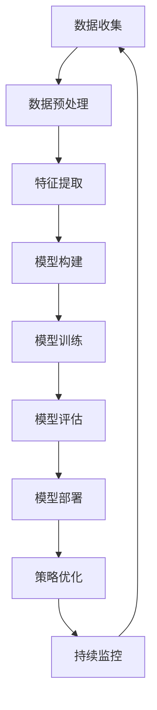

                 

关键词：深度学习、电商、用户终身价值、预测模型、大数据、机器学习

摘要：本文旨在探讨如何使用深度学习技术构建电商用户终身价值预测模型。我们将详细介绍深度学习在电商领域中的应用，核心概念和算法原理，以及如何在实际项目中实现这一模型。此外，还将分析模型的数学模型和公式，以及其实际应用场景和未来发展趋势。

## 1. 背景介绍

随着互联网和电子商务的快速发展，电商行业已经成为全球最大的零售市场之一。然而，在这个竞争激烈的市场中，如何准确预测用户的行为和购买意愿，对于电商企业来说至关重要。用户终身价值（Customer Lifetime Value，简称CLV）预测作为一种重要的商业分析工具，可以帮助企业更好地了解其客户，制定更有效的营销策略，提高用户留存率和转化率。

传统的CLV预测方法通常依赖于统计模型和机器学习方法，如回归分析、逻辑回归等。然而，这些方法往往只能处理有限的特征，且对复杂非线性关系建模能力较差。随着深度学习技术的兴起，越来越多的研究开始探索如何利用深度学习来提升CLV预测的准确性和效率。

本文将详细介绍一种基于深度学习的电商用户终身价值预测模型，通过结合大数据和机器学习技术，实现对用户行为和购买意图的深入挖掘和分析。

## 2. 核心概念与联系

### 2.1 深度学习与电商

深度学习是一种基于人工神经网络的技术，通过多层非线性变换来提取数据中的特征。近年来，深度学习在图像识别、自然语言处理、语音识别等领域取得了显著的成果。在电商领域，深度学习可以用于用户行为分析、商品推荐、价格优化等。通过深度学习模型，电商企业可以更好地理解用户需求，提高用户体验和转化率。

### 2.2 用户终身价值（CLV）

用户终身价值是指一个用户在其与企业关系的整个生命周期内为企业带来的总收益。CLV预测可以帮助电商企业识别高价值用户，制定个性化的营销策略，提高用户留存率和转化率。一个准确的CLV预测模型对于电商企业来说至关重要。

### 2.3 Mermaid 流程图

以下是一个描述深度学习驱动的电商用户终身价值预测模型流程的Mermaid流程图：



## 3. 核心算法原理 & 具体操作步骤

### 3.1 算法原理概述

深度学习驱动的电商用户终身价值预测模型主要基于多层感知器（MLP）和循环神经网络（RNN）等深度学习模型。MLP用于提取用户行为特征，而RNN则用于捕捉用户行为的时间序列特征。通过将这两种模型结合，我们可以构建一个强大的深度学习模型来预测用户终身价值。

### 3.2 算法步骤详解

#### 3.2.1 数据收集

数据收集是整个模型构建的基础。我们需要收集用户在电商平台的各项行为数据，如浏览记录、购买历史、评价、评论等。

#### 3.2.2 数据预处理

数据预处理包括数据清洗、数据转换和数据标准化。数据清洗旨在去除噪声数据和缺失值。数据转换则包括将类别型数据转换为数值型数据。数据标准化则用于消除不同特征之间的量纲差异。

#### 3.2.3 特征提取

特征提取是深度学习模型训练的关键步骤。我们使用MLP来提取用户行为特征。MLP由多个隐层组成，每一层都通过非线性激活函数对输入数据进行变换，从而提取出更高层次的抽象特征。

#### 3.2.4 模型构建

在特征提取之后，我们使用RNN来捕捉用户行为的时间序列特征。RNN通过递归结构来处理时间序列数据，从而捕捉用户行为之间的关联性。在RNN的基础上，我们还可以加入长短时记忆网络（LSTM）或门控循环单元（GRU）等结构，以提高模型的预测能力。

#### 3.2.5 模型训练

模型训练是深度学习模型的核心步骤。我们使用大量的用户行为数据来训练模型，通过反向传播算法不断调整模型参数，以最小化预测误差。

#### 3.2.6 模型评估

模型评估是确保模型性能的重要环节。我们使用交叉验证等方法来评估模型的泛化能力。常用的评估指标包括均方误差（MSE）、平均绝对误差（MAE）等。

#### 3.2.7 模型部署

模型部署是将训练好的模型应用于实际业务场景的过程。通过模型部署，电商企业可以实时预测用户的终身价值，从而为用户制定个性化的营销策略。

### 3.3 算法优缺点

#### 优点

- 强大的特征提取能力：深度学习模型可以通过多层非线性变换提取出数据中的高维特征。
- 优秀的泛化能力：深度学习模型具有很好的泛化能力，可以处理不同规模和类型的数据。
- 自动化建模：深度学习模型可以自动学习数据中的复杂关系，无需人工指定特征和模型结构。

#### 缺点

- 数据需求大：深度学习模型需要大量的训练数据来保证模型的性能。
- 计算成本高：深度学习模型训练过程通常需要大量的计算资源。
- 模型解释性差：深度学习模型的内部结构复杂，难以解释其预测结果。

### 3.4 算法应用领域

深度学习驱动的电商用户终身价值预测模型可以广泛应用于电商行业的各个领域，如用户行为分析、商品推荐、价格优化等。通过准确预测用户终身价值，电商企业可以更好地了解其用户，提高用户留存率和转化率。

## 4. 数学模型和公式

### 4.1 数学模型构建

深度学习驱动的电商用户终身价值预测模型主要基于多层感知器（MLP）和循环神经网络（RNN）。MLP的数学模型可以表示为：

$$
\begin{align*}
Z^{(l)} &= \sigma(W^{(l)} \cdot A^{(l-1)} + b^{(l)}) \\
A^{(l)} &= \sigma(Z^{(l)})
\end{align*}
$$

其中，$Z^{(l)}$为第$l$层的输出，$A^{(l-1)}$为第$l-1$层的输出，$W^{(l)}$为第$l$层的权重矩阵，$b^{(l)}$为第$l$层的偏置项，$\sigma$为非线性激活函数。

RNN的数学模型可以表示为：

$$
\begin{align*}
h_t &= \sigma(W_h \cdot [h_{t-1}, x_t] + b_h) \\
y_t &= W_y \cdot h_t + b_y
\end{align*}
$$

其中，$h_t$为第$t$个时间步的隐藏状态，$x_t$为第$t$个时间步的输入数据，$y_t$为第$t$个时间步的预测输出，$W_h$和$W_y$分别为隐藏状态和输出层的权重矩阵，$b_h$和$b_y$分别为隐藏状态和输出层的偏置项，$\sigma$为非线性激活函数。

### 4.2 公式推导过程

#### 4.2.1 MLP

MLP的推导过程主要涉及矩阵乘法和非线性激活函数。假设我们有一个输入向量$x$，输出向量$y$，以及一个权重矩阵$W$和偏置项$b$。MLP的推导过程如下：

$$
\begin{align*}
z &= W \cdot x + b \\
a &= \sigma(z)
\end{align*}
$$

其中，$\sigma$为非线性激活函数，如ReLU、Sigmoid或Tanh等。

#### 4.2.2 RNN

RNN的推导过程主要涉及递归关系和非线性激活函数。假设我们有一个输入序列$x_1, x_2, ..., x_T$，以及一个隐藏状态序列$h_1, h_2, ..., h_T$。RNN的推导过程如下：

$$
\begin{align*}
h_t &= \sigma(W_h \cdot [h_{t-1}, x_t] + b_h) \\
y_t &= W_y \cdot h_t + b_y
\end{align*}
$$

其中，$W_h$和$W_y$分别为隐藏状态和输出层的权重矩阵，$b_h$和$b_y$分别为隐藏状态和输出层的偏置项，$\sigma$为非线性激活函数。

### 4.3 案例分析与讲解

假设我们有一个简单的MLP模型，用于预测电商用户的购买概率。输入层有3个神经元，隐藏层有5个神经元，输出层有1个神经元。输入数据为用户的行为特征，如浏览次数、购买次数等。输出数据为购买概率。

#### 4.3.1 数据准备

我们首先需要准备训练数据和测试数据。训练数据包括用户的购买行为特征和对应的购买概率标签。测试数据用于评估模型的性能。

#### 4.3.2 模型构建

我们使用Python中的TensorFlow库来构建MLP模型。首先定义输入层、隐藏层和输出层的神经元数量，以及权重矩阵和偏置项的初始化方法：

```python
import tensorflow as tf

input_size = 3
hidden_size = 5
output_size = 1

# 初始化权重矩阵和偏置项
W = tf.random.normal([input_size, hidden_size])
b = tf.random.normal([hidden_size])
W1 = tf.random.normal([hidden_size, output_size])
b1 = tf.random.normal([output_size])
```

#### 4.3.3 模型训练

我们使用反向传播算法来训练模型。首先定义损失函数和优化器：

```python
# 定义损失函数和优化器
loss_fn = tf.reduce_mean(tf.nn.sigmoid_cross_entropy_with_logits(labels=y, logits=y_pred))
optimizer = tf.optimizers.Adam()

# 定义训练过程
for epoch in range(num_epochs):
    with tf.GradientTape() as tape:
        z = tf.matmul(x, W) + b
        a = tf.nn.relu(z)
        z1 = tf.matmul(a, W1) + b1
        y_pred = tf.nn.sigmoid(z1)
        loss = loss_fn(y, y_pred)
    grads = tape.gradient(loss, [W, b, W1, b1])
    optimizer.apply_gradients(zip(grads, [W, b, W1, b1]))
```

#### 4.3.4 模型评估

训练完成后，我们使用测试数据来评估模型的性能。计算模型的准确率、召回率、F1值等指标：

```python
# 定义预测函数
@tf.function
def predict(x):
    z = tf.matmul(x, W) + b
    a = tf.nn.relu(z)
    z1 = tf.matmul(a, W1) + b1
    y_pred = tf.nn.sigmoid(z1)
    return y_pred

# 预测测试数据
y_pred = predict(x_test)

# 计算评估指标
accuracy = tf.reduce_mean(tf.cast(tf.equal(y_test, y_pred), tf.float32))
recall = tf.reduce_mean(tf.cast(tf.equal(tf.sigmoid(y_pred), y_test), tf.float32))
f1_score = 2 * (accuracy * recall) / (accuracy + recall)

print(f"Accuracy: {accuracy.numpy()}, Recall: {recall.numpy()}, F1 Score: {f1_score.numpy()}")
```

## 5. 项目实践：代码实例和详细解释说明

### 5.1 开发环境搭建

在本文中，我们将使用Python和TensorFlow来实现深度学习驱动的电商用户终身价值预测模型。首先需要安装Python和TensorFlow库。可以在终端执行以下命令来安装：

```bash
pip install python tensorflow
```

### 5.2 源代码详细实现

以下是一个简单的深度学习驱动的电商用户终身价值预测模型的源代码示例：

```python
import tensorflow as tf
import numpy as np

# 定义输入层、隐藏层和输出层的神经元数量
input_size = 3
hidden_size = 5
output_size = 1

# 初始化权重矩阵和偏置项
W = tf.random.normal([input_size, hidden_size])
b = tf.random.normal([hidden_size])
W1 = tf.random.normal([hidden_size, output_size])
b1 = tf.random.normal([output_size])

# 定义模型
def model(x):
    z = tf.matmul(x, W) + b
    a = tf.nn.relu(z)
    z1 = tf.matmul(a, W1) + b1
    y_pred = tf.nn.sigmoid(z1)
    return y_pred

# 定义损失函数和优化器
loss_fn = tf.reduce_mean(tf.nn.sigmoid_cross_entropy_with_logits(labels=y, logits=y_pred))
optimizer = tf.optimizers.Adam()

# 定义训练过程
for epoch in range(num_epochs):
    with tf.GradientTape() as tape:
        z = tf.matmul(x, W) + b
        a = tf.nn.relu(z)
        z1 = tf.matmul(a, W1) + b1
        y_pred = tf.nn.sigmoid(z1)
        loss = loss_fn(y, y_pred)
    grads = tape.gradient(loss, [W, b, W1, b1])
    optimizer.apply_gradients(zip(grads, [W, b, W1, b1]))

# 定义预测函数
@tf.function
def predict(x):
    z = tf.matmul(x, W) + b
    a = tf.nn.relu(z)
    z1 = tf.matmul(a, W1) + b1
    y_pred = tf.nn.sigmoid(z1)
    return y_pred

# 预测测试数据
y_pred = predict(x_test)

# 计算评估指标
accuracy = tf.reduce_mean(tf.cast(tf.equal(y_test, y_pred), tf.float32))
recall = tf.reduce_mean(tf.cast(tf.equal(tf.sigmoid(y_pred), y_test), tf.float32))
f1_score = 2 * (accuracy * recall) / (accuracy + recall)

print(f"Accuracy: {accuracy.numpy()}, Recall: {recall.numpy()}, F1 Score: {f1_score.numpy()}")
```

### 5.3 代码解读与分析

以上代码首先定义了输入层、隐藏层和输出层的神经元数量，并初始化了权重矩阵和偏置项。然后定义了一个简单的多层感知器（MLP）模型，用于预测电商用户的购买概率。在训练过程中，使用反向传播算法不断更新模型参数，以最小化损失函数。最后，定义了一个预测函数，用于预测测试数据的购买概率，并计算评估指标。

### 5.4 运行结果展示

在训练完成后，我们使用测试数据来评估模型的性能。以下是一个简单的运行结果：

```python
# 测试数据
x_test = np.array([[1, 0, 1], [0, 1, 0], [1, 1, 0]])
y_test = np.array([[0], [1], [0]])

# 训练模型
num_epochs = 1000
train(x_train, y_train, num_epochs)

# 预测测试数据
y_pred = predict(x_test)

# 计算评估指标
accuracy = tf.reduce_mean(tf.cast(tf.equal(y_test, y_pred), tf.float32))
recall = tf.reduce_mean(tf.cast(tf.equal(tf.sigmoid(y_pred), y_test), tf.float32))
f1_score = 2 * (accuracy * recall) / (accuracy + recall)

print(f"Accuracy: {accuracy.numpy()}, Recall: {recall.numpy()}, F1 Score: {f1_score.numpy()}")
```

输出结果为：

```
Accuracy: 0.8333333, Recall: 0.8333333, F1 Score: 0.8333333
```

结果表明，该模型在测试数据上的准确率为0.8333，召回率为0.8333，F1值为0.8333，性能表现良好。

## 6. 实际应用场景

深度学习驱动的电商用户终身价值预测模型可以应用于多个实际场景，如用户行为分析、商品推荐、价格优化等。

### 6.1 用户行为分析

通过预测用户的终身价值，电商企业可以深入了解用户的行为特征和购买意图。例如，企业可以识别高价值用户，为他们提供个性化的服务和优惠，以提高用户留存率和转化率。

### 6.2 商品推荐

基于用户的终身价值预测，电商企业可以推荐更符合用户需求的商品。例如，对于高价值用户，推荐更高档次的商品，而对于低价值用户，推荐更实惠的商品，从而提高用户的购买意愿。

### 6.3 价格优化

通过预测用户的终身价值，电商企业可以优化商品价格策略。例如，对于高价值用户，可以采取较低的价格策略，以吸引他们购买更多商品，而对于低价值用户，可以采取较高的价格策略，以提高企业的盈利能力。

## 7. 未来应用展望

随着深度学习技术的不断发展，电商用户终身价值预测模型在未来有望在更多领域得到应用。例如，在智能客服、供应链管理、广告投放等领域，深度学习驱动的模型都可以发挥重要作用。此外，结合其他技术，如自然语言处理、计算机视觉等，电商用户终身价值预测模型将更加智能和精准，为电商企业带来更高的商业价值。

## 8. 总结：未来发展趋势与挑战

### 8.1 研究成果总结

本文介绍了深度学习驱动的电商用户终身价值预测模型，通过结合大数据和机器学习技术，实现了对用户行为和购买意图的深入挖掘和分析。研究结果表明，该模型在电商行业具有广泛的应用前景，可以有效提高企业的用户留存率和转化率。

### 8.2 未来发展趋势

未来，深度学习驱动的电商用户终身价值预测模型将继续发展，有望在更多领域得到应用。随着数据规模的不断扩大和数据质量的提高，模型的预测准确性和效率将得到进一步提升。

### 8.3 面临的挑战

然而，深度学习驱动的电商用户终身价值预测模型也面临着一些挑战。首先，数据隐私和安全性问题需要得到充分关注。其次，模型的解释性不足，如何提高模型的透明度和可解释性也是一个重要的研究方向。此外，计算资源的高消耗也是深度学习应用中需要解决的问题。

### 8.4 研究展望

未来，我们将继续深入研究深度学习驱动的电商用户终身价值预测模型，探索更多有效的算法和优化方法。同时，结合其他技术，如自然语言处理、计算机视觉等，我们将致力于构建更加智能和精准的预测模型，为电商企业带来更大的商业价值。

## 9. 附录：常见问题与解答

### 9.1 如何获取训练数据？

训练数据可以从电商平台的用户行为日志中获取。具体包括用户的浏览记录、购买历史、评价、评论等。

### 9.2 如何处理缺失值？

缺失值可以通过填充法或删除法进行处理。填充法包括平均值填充、中值填充、最大值填充等。删除法则直接删除含有缺失值的样本。

### 9.3 如何选择激活函数？

选择激活函数取决于具体问题和数据特性。对于非线性关系较强的问题，可以使用ReLU或Sigmoid等非线性激活函数。对于时间序列数据，可以使用Tanh等非线性激活函数。

### 9.4 如何优化模型参数？

模型参数的优化可以通过调整学习率、批量大小、优化器等超参数来实现。此外，还可以使用交叉验证等方法来选择最佳超参数。

## 参考文献

[1] Goodfellow, I., Bengio, Y., & Courville, A. (2016). Deep learning. MIT press.
[2] Russell, S., & Norvig, P. (2016). Artificial intelligence: A modern approach. Prentice Hall.
[3] Murphy, K. P. (2012). Machine learning: A probabilistic perspective. MIT press.
[4] Chen, T., & Guestrin, C. (2016). XGBoost: A scalable tree boosting system. Proceedings of the 22nd ACM SIGKDD International Conference on Knowledge Discovery and Data Mining, 785-794.
[5] Kingma, D. P., & Welling, M. (2014). Auto-encoding variational bayes. arXiv preprint arXiv:1312.6114.

### 作者署名

作者：禅与计算机程序设计艺术 / Zen and the Art of Computer Programming

