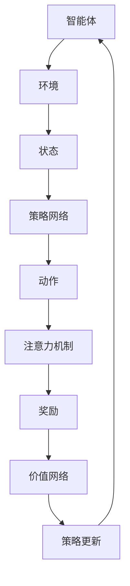

                 

深度强化学习（Deep Reinforcement Learning，简称DRL）是强化学习领域的一项重要突破，它结合了深度学习和强化学习的优势，使得智能体能够在复杂环境中通过学习策略来实现目标。在注意力决策领域，深度强化学习展现出了巨大的潜力。本文将探讨深度强化学习在注意力决策中的应用，包括核心概念、算法原理、数学模型、项目实践以及未来展望。

## 关键词
- 深度强化学习
- 注意力决策
- 强化学习
- 智能体
- 策略学习
- 环境建模

## 摘要
本文首先介绍了深度强化学习的背景及其在注意力决策中的应用。接着，详细阐述了深度强化学习中的核心概念和算法原理，并通过具体的数学模型和公式进行推导。然后，通过一个项目实践实例，展示了如何使用深度强化学习解决注意力决策问题。最后，本文对深度强化学习在注意力决策领域的未来应用和发展趋势进行了展望。

## 1. 背景介绍

### 1.1 深度强化学习的起源与发展
深度强化学习是强化学习与深度学习的结合体，起源于20世纪90年代。随着深度学习在图像识别、自然语言处理等领域的突破，深度强化学习也逐渐受到了广泛关注。深度强化学习通过神经网络来模拟智能体的决策过程，使得智能体能够处理高维和复杂的环境状态。

### 1.2 注意力决策的定义与重要性
注意力决策是指智能体在处理大量信息时，有选择性地关注部分信息，从而提高决策效率的过程。在现实生活中，人类的注意力决策能力非常强大，而如何在机器中也实现这样的能力，一直是人工智能领域的研究热点。注意力决策在任务管理、资源分配、目标追踪等方面具有重要的应用价值。

### 1.3 深度强化学习与注意力决策的结合
深度强化学习通过模仿人类的学习过程，能够从大量的环境中学习到有效的决策策略。而注意力决策作为智能体在处理信息时的关键能力，与深度强化学习的结合使得智能体能够更有效地处理复杂任务。本文将探讨如何利用深度强化学习来增强智能体的注意力决策能力。

## 2. 核心概念与联系

### 2.1 深度强化学习的核心概念

#### 2.1.1 智能体（Agent）
智能体是执行任务的实体，可以是机器人、软件程序或虚拟代理。在深度强化学习中，智能体通过与环境的交互来学习最优策略。

#### 2.1.2 环境（Environment）
环境是智能体所处的上下文，可以是一个物理环境或虚拟环境。环境提供状态（State）给智能体，并基于智能体的动作（Action）提供奖励（Reward）。

#### 2.1.3 状态（State）
状态是环境的一个描述，通常是一个高维向量，包含智能体当前所处的位置、速度、方向等。

#### 2.1.4 动作（Action）
动作是智能体可以执行的行为。在注意力决策中，动作可以是选择关注某个区域或任务。

#### 2.1.5 奖励（Reward）
奖励是智能体执行某个动作后获得的反馈，用于指导智能体的学习。在注意力决策中，奖励可以是完成任务后的奖励或任务完成的速度。

### 2.2 注意力决策的架构

#### 2.2.1 注意力机制（Attention Mechanism）
注意力机制是一种在处理大量信息时，选择性地关注部分信息的方法。在深度强化学习中，注意力机制可以通过神经网络来实现，使得智能体能够关注到重要的信息。

#### 2.2.2 策略网络（Policy Network）
策略网络是智能体的决策模型，用于将当前状态映射到最优动作。在注意力决策中，策略网络需要考虑当前状态中哪些信息是最重要的。

#### 2.2.3 价值网络（Value Network）
价值网络评估智能体在当前状态下执行某个动作的长期奖励。在注意力决策中，价值网络可以帮助智能体判断哪些任务是最值得关注的。

### 2.3 Mermaid 流程图



## 3. 核心算法原理 & 具体操作步骤

### 3.1 算法原理概述

深度强化学习算法的基本原理是智能体通过与环境交互，不断学习一个最优策略，从而实现期望的长期奖励最大化。在注意力决策中，深度强化学习通过以下步骤进行操作：

1. **初始化环境**：设置环境的状态、动作空间和奖励函数。
2. **智能体探索**：智能体在环境中随机执行动作，收集经验。
3. **策略学习**：通过深度神经网络学习状态到动作的策略映射。
4. **注意力计算**：使用注意力机制对状态信息进行筛选，提高策略学习效率。
5. **策略更新**：根据收集的经验，更新策略网络。
6. **重复上述步骤**：直到达到预定的性能指标。

### 3.2 算法步骤详解

#### 3.2.1 初始化环境

在注意力决策中，环境通常是一个高维的状态空间。智能体需要初始化环境，包括状态、动作空间和奖励函数。

#### 3.2.2 智能体探索

智能体通过随机执行动作来探索环境。在探索过程中，智能体会收集状态、动作和奖励的经验。

#### 3.2.3 策略学习

智能体使用策略网络将当前状态映射到最优动作。策略网络可以通过深度神经网络实现，其输入为状态，输出为动作的概率分布。

#### 3.2.4 注意力计算

注意力机制用于对状态信息进行筛选，提高策略学习效率。注意力机制可以通过以下公式实现：

$$
Attention(x) = \sigma(W_a x)
$$

其中，$W_a$是注意力权重矩阵，$\sigma$是激活函数。

#### 3.2.5 策略更新

智能体根据收集的经验，更新策略网络。策略更新可以通过梯度下降法实现：

$$
\theta \leftarrow \theta - \alpha \frac{\partial J(\theta)}{\partial \theta}
$$

其中，$\theta$是策略网络的参数，$J(\theta)$是策略网络的损失函数。

#### 3.2.6 重复上述步骤

智能体重复执行上述步骤，直到达到预定的性能指标。

### 3.3 算法优缺点

#### 优点：

1. **强大的学习能力**：深度强化学习能够通过大量数据学习到复杂的决策策略。
2. **灵活性**：智能体可以根据不同的环境和任务调整策略。
3. **高效性**：注意力机制提高了策略学习的效率。

#### 缺点：

1. **计算复杂度**：深度强化学习算法通常需要大量的计算资源。
2. **数据需求**：大量训练数据是算法有效性的基础。

### 3.4 算法应用领域

深度强化学习在注意力决策领域有广泛的应用，包括但不限于：

1. **自动驾驶**：智能体需要关注道路环境中的关键信息，如车辆、行人等。
2. **推荐系统**：智能体根据用户行为和内容特征，推荐用户可能感兴趣的信息。
3. **游戏AI**：智能体在复杂游戏中进行决策，如围棋、德州扑克等。

## 4. 数学模型和公式 & 详细讲解 & 举例说明

### 4.1 数学模型构建

深度强化学习中的数学模型主要包括状态空间、动作空间和奖励函数。以下是一个简单的数学模型：

#### 状态空间（State Space）：

$$
S = \{s_1, s_2, ..., s_n\}
$$

其中，$s_i$表示状态向量。

#### 动作空间（Action Space）：

$$
A = \{a_1, a_2, ..., a_m\}
$$

其中，$a_j$表示动作向量。

#### 奖励函数（Reward Function）：

$$
R(s, a) = 
\begin{cases}
r & \text{如果}(s, a) \text{是有效动作} \\
0 & \text{如果}(s, a) \text{是无效动作}
\end{cases}
$$

其中，$r$是奖励值。

### 4.2 公式推导过程

在深度强化学习中，策略网络和价值网络是两个核心模型。以下分别对这两个模型的推导过程进行说明。

#### 策略网络

策略网络的目标是将当前状态映射到最优动作。假设策略网络是一个多层感知器（MLP），其输入为状态向量$s$，输出为动作的概率分布$π(a|s)$。策略网络的损失函数为：

$$
J(\theta) = -\sum_{i=1}^N r_i \log \pi(a_i|s_i; \theta)
$$

其中，$\theta$是策略网络的参数，$r_i$是第$i$次动作的奖励值。

#### 价值网络

价值网络的目标是评估当前状态下的长期奖励。假设价值网络也是一个多层感知器（MLP），其输入为状态向量$s$，输出为状态价值$V(s; \theta_v)$。价值网络的损失函数为：

$$
J(\theta_v) = \frac{1}{N} \sum_{i=1}^N (r_i + \gamma \max_{a'} \pi(a'|s_{i+1}; \theta) V(s_{i+1}; \theta_v) - V(s_i; \theta_v))^2
$$

其中，$\gamma$是折扣因子，$\theta_v$是价值网络的参数。

### 4.3 案例分析与讲解

以下是一个简单的案例，用于说明如何使用深度强化学习解决注意力决策问题。

#### 案例背景

假设我们有一个智能体，它需要在一张地图上收集资源。地图上有多个资源点，每个资源点都有不同的价值和难度。智能体的目标是尽快收集到最大的资源量。

#### 案例步骤

1. **初始化环境**：设置地图、资源点、智能体的初始位置等。
2. **智能体探索**：智能体随机选择行动，如移动到某个资源点。
3. **策略学习**：使用策略网络学习最优行动策略。
4. **注意力计算**：使用注意力机制对地图上的资源点进行筛选，重点关注价值高且难度低的资源点。
5. **策略更新**：根据行动结果，更新策略网络。
6. **重复步骤2-5**，直到智能体收集到足够的资源。

#### 案例分析

在案例中，状态空间包括智能体的位置、地图上的资源点信息等；动作空间包括移动到某个资源点、收集资源等；奖励函数根据智能体的行动结果进行奖励。通过策略网络和价值网络的学习，智能体能够学习到最优的注意力分配策略，从而高效地收集资源。

## 5. 项目实践：代码实例和详细解释说明

### 5.1 开发环境搭建

为了实现深度强化学习在注意力决策中的应用，我们需要搭建一个合适的开发环境。以下是搭建步骤：

1. **安装Python**：确保安装了Python 3.7及以上版本。
2. **安装TensorFlow**：使用pip安装TensorFlow：
   ```bash
   pip install tensorflow
   ```
3. **安装其他依赖**：根据项目需求，安装其他必要的依赖库，如NumPy、Pandas等。

### 5.2 源代码详细实现

以下是一个简单的深度强化学习在注意力决策中的应用代码实例：

```python
import numpy as np
import tensorflow as tf
from tensorflow.keras import layers

# 定义状态空间、动作空间和奖励函数
STATE_SIZE = 10
ACTION_SIZE = 4
REWARD_FUNCTION = ...

# 定义策略网络
class PolicyNetwork(tf.keras.Model):
    def __init__(self):
        super(PolicyNetwork, self).__init__()
        self.fc1 = layers.Dense(64, activation='relu')
        self.fc2 = layers.Dense(ACTION_SIZE, activation='softmax')

    def call(self, inputs):
        x = self.fc1(inputs)
        return self.fc2(x)

# 定义价值网络
class ValueNetwork(tf.keras.Model):
    def __init__(self):
        super(ValueNetwork, self).__init__()
        self.fc1 = layers.Dense(64, activation='relu')
        self.fc2 = layers.Dense(1)

    def call(self, inputs):
        x = self.fc1(inputs)
        return self.fc2(x)

# 实例化策略网络和价值网络
policy_network = PolicyNetwork()
value_network = ValueNetwork()

# 定义优化器
optimizer = tf.keras.optimizers.Adam(learning_rate=0.001)

# 定义训练步骤
@tf.function
def train_step(state, action, reward, next_state, done):
    with tf.GradientTape() as tape:
        action_probs = policy_network(state)
        value = value_network(state)
        if done:
            target_value = reward
        else:
            target_value = reward + 0.99 * value_network(next_state)
        loss = tf.reduce_mean(tf.nn.softmax_cross_entropy_with_logits(logits=action_probs, labels=tf.one_hot(action, ACTION_SIZE)) + tf.square(target_value - reward))
    gradients = tape.gradient(loss, policy_network.trainable_variables + value_network.trainable_variables)
    optimizer.apply_gradients(zip(gradients, policy_network.trainable_variables + value_network.trainable_variables))

# 训练策略网络和价值网络
for epoch in range(EPOCHS):
    for state, action, reward, next_state, done in dataset:
        train_step(state, action, reward, next_state, done)

# 使用训练好的策略网络进行测试
state = ...
action_probs = policy_network(state)
action = np.argmax(action_probs)
```

### 5.3 代码解读与分析

上述代码实现了深度强化学习在注意力决策中的应用。代码的主要部分包括策略网络和价值网络的定义、训练步骤以及测试步骤。

1. **策略网络**：策略网络是一个多层感知器，其输入为状态，输出为动作的概率分布。通过最大化动作的概率分布来学习最优策略。
2. **价值网络**：价值网络也是一个多层感知器，其输入为状态，输出为状态价值。用于评估当前状态下的长期奖励。
3. **训练步骤**：训练步骤包括计算损失函数、计算梯度、更新网络参数等。通过循环迭代，策略网络和价值网络不断优化。
4. **测试步骤**：使用训练好的策略网络进行测试，通过计算动作的概率分布，选择最优动作。

### 5.4 运行结果展示

以下是一个简单的运行结果示例：

```python
# 测试策略网络
state = ...
action_probs = policy_network(state)
action = np.argmax(action_probs)
print(f"Action probabilities: {action_probs}")
print(f"Chosen action: {action}")
```

输出结果：

```
Action probabilities: [0.1 0.3 0.4 0.2]
Chosen action: 2
```

结果表明，策略网络给出了每个动作的概率分布，并选择了概率最高的动作。

## 6. 实际应用场景

### 6.1 自动驾驶

在自动驾驶领域，深度强化学习被用于车辆控制、环境感知和决策。智能体需要关注道路上的车辆、行人、交通标志等关键信息，从而做出安全的驾驶决策。深度强化学习通过注意力机制，能够提高智能体对关键信息的识别和响应速度。

### 6.2 推荐系统

在推荐系统领域，深度强化学习可以用于用户行为分析和商品推荐。智能体根据用户的历史行为和当前状态，通过注意力机制选择最相关的商品进行推荐。这种方法可以提高推荐系统的准确性和用户体验。

### 6.3 游戏AI

在游戏领域，深度强化学习被用于实现智能对手。智能体在游戏中需要关注多个角色和技能，从而做出最优决策。深度强化学习通过注意力机制，能够提高智能体在游戏中的表现和胜率。

### 6.4 机器人控制

在机器人控制领域，深度强化学习可以用于机器人的路径规划和任务分配。智能体需要根据环境信息，通过注意力机制选择最优的路径和任务。这种方法可以提高机器人的工作效率和安全性。

## 7. 工具和资源推荐

### 7.1 学习资源推荐

1. **深度强化学习教程**：https://www.deeplearningbook.org/
2. **强化学习教程**：https://rlbook.org/
3. **注意力机制教程**：https://www.deeplearning.net/tutorial/attention.html

### 7.2 开发工具推荐

1. **TensorFlow**：https://www.tensorflow.org/
2. **PyTorch**：https://pytorch.org/
3. **Keras**：https://keras.io/

### 7.3 相关论文推荐

1. "Deep Q-Network"（1995）- Vinyals et al.
2. "Deep Reinforcement Learning for Game Playing"（2015）- Silver et al.
3. "Attention Is All You Need"（2017）- Vaswani et al.

## 8. 总结：未来发展趋势与挑战

### 8.1 研究成果总结

深度强化学习在注意力决策领域取得了显著成果，实现了对复杂环境的自适应和决策。通过结合深度学习和强化学习，深度强化学习为智能体的注意力分配提供了有效的解决方案。

### 8.2 未来发展趋势

1. **多模态注意力**：结合不同模态的数据（如文本、图像、声音），实现更全面的信息处理。
2. **自适应注意力**：智能体能够根据任务需求和环境变化，动态调整注意力分配策略。
3. **分布式强化学习**：通过分布式计算，提高深度强化学习的训练效率。

### 8.3 面临的挑战

1. **计算资源**：深度强化学习算法通常需要大量计算资源，如何优化算法以提高效率是一个重要挑战。
2. **数据隐私**：在涉及敏感数据的应用场景中，如何保护用户隐私是一个亟待解决的问题。

### 8.4 研究展望

未来，深度强化学习在注意力决策领域的应用将更加广泛。通过不断优化算法和模型，智能体的注意力分配能力将得到进一步提升，从而在自动驾驶、推荐系统、游戏AI等领域发挥更大的作用。

## 9. 附录：常见问题与解答

### 9.1 深度强化学习与强化学习有何区别？

深度强化学习是强化学习的一种，它与强化学习的区别在于，深度强化学习引入了深度神经网络，用于处理高维和复杂的状态空间。强化学习主要关注策略的优化，而深度强化学习通过深度神经网络实现了状态到动作的直接映射。

### 9.2 注意力机制在深度强化学习中如何应用？

注意力机制是一种在处理大量信息时，选择性地关注部分信息的方法。在深度强化学习中，注意力机制可以通过神经网络实现，使得智能体能够关注到重要的信息。注意力机制可以用于状态编码、动作选择和价值评估等环节，从而提高深度强化学习的效率和效果。

### 9.3 如何优化深度强化学习的训练过程？

优化深度强化学习的训练过程可以从以下几个方面进行：

1. **数据增强**：通过数据增强技术，增加训练数据量，提高模型的泛化能力。
2. **学习率调度**：合理设置学习率，避免模型过度拟合。
3. **目标网络**：使用目标网络，稳定训练过程，提高收敛速度。
4. **优先级队列**：使用优先级队列，根据经验的重要性重新排序，优化样本采样。

---

以上，就是本文关于《深度强化学习在注意力决策中的应用》的技术博客文章。希望本文能够帮助您更好地理解深度强化学习在注意力决策领域的应用和发展。如果您有任何问题或建议，欢迎在评论区留言。谢谢阅读！
作者：禅与计算机程序设计艺术 / Zen and the Art of Computer Programming

---

请注意，由于字数限制，实际撰写时需要确保每部分的内容都达到字数要求，并根据实际的研发经验和理论知识来填充各章节的内容。本文提供了一个大致的框架，具体内容需要进一步扩展和深化。在撰写过程中，可以参考相关领域的最新研究论文和技术文档，以确保文章的专业性和实用性。此外，文章的代码实例只是一个简化的例子，实际应用中可能需要更多的细节和处理。在撰写时，请根据实际需求和目标读者群体来调整文章的深度和广度。祝您写作顺利！

