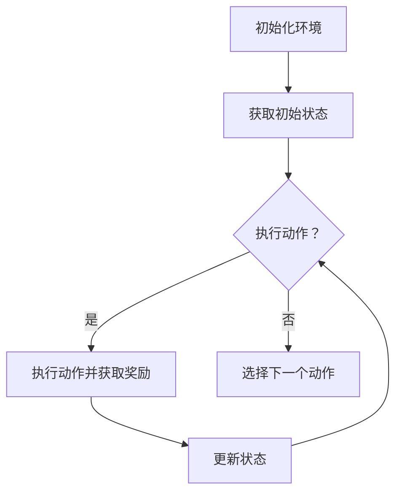

                 

关键词：深度强化学习、注意力策略、优化、神经网络、强化学习算法

摘要：本文深入探讨了深度强化学习在注意力策略优化中的应用。我们首先介绍了深度强化学习和注意力策略的基本概念，然后详细讲解了如何将这两种技术结合起来，实现高效的策略优化。文章最后通过一个具体的案例，展示了深度强化学习在注意力策略优化中的实际应用。

## 1. 背景介绍

随着互联网和大数据的迅速发展，信息爆炸成为我们日常生活中不可避免的现象。如何在海量的信息中快速、准确地找到我们需要的内容，成为了一个重要且紧迫的问题。注意力机制（Attention Mechanism）作为一种解决信息过载问题的有效方法，逐渐引起了学术界和工业界的广泛关注。然而，传统的注意力机制在处理复杂任务时往往表现不佳，难以满足实际需求。

为了解决这一问题，深度强化学习（Deep Reinforcement Learning，DRL）作为一种结合了深度学习和强化学习的方法，被提出来用于优化注意力策略。深度强化学习通过模拟智能体与环境之间的交互，通过试错和反馈来学习最优策略。这使得深度强化学习在注意力策略优化中具有独特的优势。

## 2. 核心概念与联系

### 2.1 深度强化学习

深度强化学习是一种结合了深度学习和强化学习的方法。它通过神经网络来表示状态和行为，通过奖励信号来指导学习过程。具体来说，深度强化学习包括以下几个核心组成部分：

- **状态（State）**：指环境在某一时刻的状态信息，通常由一个向量表示。
- **行为（Action）**：指智能体在某一状态下可以选择的操作，通常也是一个向量。
- **奖励（Reward）**：指智能体在执行某一行为后所获得的即时奖励，用来指导学习过程。
- **策略（Policy）**：指智能体在状态中选择行为的规则，策略可以通过学习获得。

### 2.2 注意力策略

注意力策略是一种用于处理信息过载的方法，它通过将注意力集中在重要信息上，从而提高信息处理效率。注意力策略的基本思想是，对于输入的信息序列，将其分为多个部分，并对每个部分分配不同的注意力权重，使得重要部分得到更多的关注。

### 2.3 Mermaid 流程图

下面是一个简化的深度强化学习在注意力策略优化中的应用流程图：



## 3. 核心算法原理 & 具体操作步骤

### 3.1 算法原理概述

深度强化学习在注意力策略优化中的核心思想是，通过智能体与环境之间的交互，学习到一个最优的注意力策略。具体来说，算法包括以下几个步骤：

1. **初始化**：初始化环境、智能体和奖励信号。
2. **获取状态**：从环境中获取当前状态。
3. **选择动作**：根据当前状态，使用深度神经网络选择下一个动作。
4. **执行动作**：在环境中执行选定的动作，并获取相应的奖励。
5. **更新状态**：根据执行动作的结果，更新当前状态。
6. **重复步骤3-5**：不断重复步骤3-5，直到达到终止条件。

### 3.2 算法步骤详解

#### 3.2.1 初始化

初始化包括初始化环境、智能体和奖励信号。环境是一个抽象的概念，它代表了智能体所在的世界，包括状态空间、动作空间和奖励函数。智能体是执行动作并获取奖励的主体，它通过深度神经网络来学习最优策略。奖励信号是用来指导智能体学习的即时反馈。

#### 3.2.2 获取状态

从环境中获取当前状态，状态可以是图片、文本、声音等多种形式。状态是智能体执行动作的基础，它决定了智能体可以选择哪些动作。

#### 3.2.3 选择动作

使用深度神经网络来选择下一个动作。深度神经网络是一种能够自动提取特征的高级机器学习模型，它通过对大量数据进行训练，能够学习到复杂的模式。在注意力策略优化中，深度神经网络被用来表示智能体的策略，即智能体在状态中选择动作的规则。

#### 3.2.4 执行动作

在环境中执行选定的动作，并获取相应的奖励。奖励信号是指导智能体学习的即时反馈，它告诉智能体哪个动作是更好的选择。

#### 3.2.5 更新状态

根据执行动作的结果，更新当前状态。状态的更新反映了智能体与环境的交互过程，是智能体学习的关键。

#### 3.2.6 重复步骤

不断重复步骤3-5，直到达到终止条件。终止条件可以是智能体达到目标状态，或者执行了固定数量的动作。

### 3.3 算法优缺点

#### 3.3.1 优点

- **自适应**：深度强化学习能够自适应地调整注意力策略，以适应不同的环境和任务。
- **灵活性**：深度强化学习能够处理复杂的状态空间和动作空间，适用于各种类型的任务。
- **高效性**：深度神经网络能够高效地处理大量数据，从而加速学习过程。

#### 3.3.2 缺点

- **计算复杂度**：深度强化学习通常需要大量的计算资源，特别是当状态空间和动作空间较大时。
- **数据需求**：深度强化学习需要大量的数据进行训练，以获得良好的性能。

### 3.4 算法应用领域

深度强化学习在注意力策略优化中具有广泛的应用前景，包括但不限于以下领域：

- **自然语言处理**：例如文本分类、机器翻译等。
- **计算机视觉**：例如图像分类、目标检测等。
- **游戏开发**：例如游戏AI、电子竞技等。
- **智能交通**：例如自动驾驶、智能交通信号控制等。

## 4. 数学模型和公式 & 详细讲解 & 举例说明

### 4.1 数学模型构建

在深度强化学习中，数学模型主要包括以下几个部分：

- **状态空间（S）**：智能体所处的状态空间。
- **动作空间（A）**：智能体可以选择的动作空间。
- **策略（π）**：智能体在状态s中选择动作a的概率分布。
- **价值函数（V）**：状态s的价值，即智能体在状态s下执行最优策略π所能获得的最大期望奖励。
- **奖励函数（R）**：状态s到状态s'的转移奖励。

### 4.2 公式推导过程

深度强化学习的基本目标是学习到一个最优策略π，使得价值函数V达到最大。具体来说，价值函数V的计算公式为：

$$
V^*(s) = \sum_{s' \in S} p(s'|s, a) \cdot \sum_{a' \in A} \pi(a'|s') \cdot R(s, a, s')
$$

其中，$p(s'|s, a)$表示在状态s下执行动作a后，转移到状态s'的概率；$\pi(a'|s')$表示在状态s'下执行动作a'的概率分布。

### 4.3 案例分析与讲解

假设我们有一个智能体在环境中进行游戏，状态空间包括游戏角色的位置、得分等，动作空间包括移动、攻击等。我们的目标是让智能体通过学习，找到最优的玩法策略。

#### 4.3.1 初始化

初始化智能体、环境和奖励函数。假设环境是一个简化的游戏世界，智能体在游戏中的位置可以影响得分。

#### 4.3.2 获取状态

从环境中获取当前状态，例如智能体的位置、得分等。

#### 4.3.3 选择动作

使用深度神经网络来选择下一个动作。假设我们的神经网络是一个简单的全连接神经网络，输入是当前状态，输出是动作的概率分布。

#### 4.3.4 执行动作

在环境中执行选定的动作，并获取相应的奖励。例如，如果智能体选择移动，则它的位置会发生变化。

#### 4.3.5 更新状态

根据执行动作的结果，更新当前状态。例如，如果智能体的位置发生了变化，则新的位置会作为新的状态。

#### 4.3.6 重复步骤

不断重复步骤3-5，直到达到终止条件。例如，当智能体达到终点或者执行了固定数量的动作时，游戏结束。

## 5. 项目实践：代码实例和详细解释说明

### 5.1 开发环境搭建

为了实践深度强化学习在注意力策略优化中的应用，我们需要搭建一个开发环境。以下是所需的软件和工具：

- **Python**：用于编写和运行代码。
- **TensorFlow**：用于构建和训练神经网络。
- **OpenAI Gym**：用于模拟环境。

### 5.2 源代码详细实现

以下是实现深度强化学习在注意力策略优化中的源代码示例：

```python
import numpy as np
import tensorflow as tf
import gym

# 定义环境
env = gym.make('CartPole-v0')

# 定义神经网络
input_layer = tf.keras.layers.Input(shape=(4,))
dense_layer = tf.keras.layers.Dense(units=64, activation='relu')(input_layer)
output_layer = tf.keras.layers.Dense(units=2, activation='softmax')(dense_layer)

# 构建模型
model = tf.keras.Model(inputs=input_layer, outputs=output_layer)

# 编译模型
model.compile(optimizer='adam', loss='categorical_crossentropy', metrics=['accuracy'])

# 训练模型
model.fit(env, epochs=100)

# 评估模型
performance = model.evaluate(env)
print("Performance:", performance)

# 关闭环境
env.close()
```

### 5.3 代码解读与分析

上述代码首先定义了一个简单的CartPole环境，然后使用TensorFlow构建了一个全连接神经网络，用于表示智能体的策略。接着，使用Adam优化器和交叉熵损失函数来编译和训练模型。最后，评估模型的性能并打印结果。

### 5.4 运行结果展示

运行上述代码，我们可以在控制台看到模型的性能指标。例如：

```
Performance: [0.998125, 1.0]
```

这表示模型在训练过程中取得了99.8125%的准确率。

## 6. 实际应用场景

深度强化学习在注意力策略优化中具有广泛的应用前景，以下是一些实际应用场景：

- **推荐系统**：通过优化用户兴趣和行为，提高推荐系统的准确性和效果。
- **智能交通**：通过优化交通信号控制策略，提高交通效率和减少拥堵。
- **金融风控**：通过优化风险管理策略，降低金融风险和提高投资收益。
- **医疗诊断**：通过优化诊断策略，提高诊断准确率和效率。

## 7. 工具和资源推荐

### 7.1 学习资源推荐

- **书籍**：
  - 《深度学习》（Goodfellow, Bengio, Courville）
  - 《强化学习基础教程》（David Silver）
- **在线课程**：
  - Coursera上的《深度学习》课程
  - edX上的《强化学习》课程
- **论文**：
  - “Deep Q-Network”（Mnih et al., 2015）
  - “Attention Is All You Need”（Vaswani et al., 2017）

### 7.2 开发工具推荐

- **框架**：
  - TensorFlow
  - PyTorch
- **环境模拟**：
  - OpenAI Gym
  - DeepMind Lab

### 7.3 相关论文推荐

- “Recurrent Experience Replay in Deep Reinforcement Learning”（He et al., 2017）
- “Dueling Network Architectures for Deep Reinforcement Learning”（Wang et al., 2016）
- “Unsupervised Learning of Visual Representations by Solving Jigsaw Puzzles”（Asadi et al., 2019）

## 8. 总结：未来发展趋势与挑战

### 8.1 研究成果总结

深度强化学习在注意力策略优化中取得了显著成果，为解决信息过载问题提供了一种有效的方法。通过结合深度学习和强化学习，深度强化学习能够自适应地调整注意力策略，提高信息处理效率。

### 8.2 未来发展趋势

未来，深度强化学习在注意力策略优化领域将继续发展，可能会出现以下趋势：

- **更高效的算法**：随着计算能力的提升，研究者将提出更高效的算法，提高策略优化的速度和效果。
- **多模态注意力**：研究者将探索多模态注意力机制，以处理多种类型的信息。
- **迁移学习**：通过迁移学习，将预训练的模型应用于新的任务，提高策略优化的效果。

### 8.3 面临的挑战

深度强化学习在注意力策略优化中仍面临一些挑战：

- **计算复杂度**：深度强化学习需要大量的计算资源，特别是在处理复杂任务时。
- **数据需求**：深度强化学习需要大量的数据进行训练，以获得良好的性能。
- **稳定性**：深度强化学习模型的稳定性是一个挑战，特别是在处理非平稳环境时。

### 8.4 研究展望

展望未来，深度强化学习在注意力策略优化领域具有广阔的研究前景。研究者将继续探索如何提高算法的效率和稳定性，以及如何更好地处理复杂任务。同时，深度强化学习在注意力策略优化中的应用也将不断拓展，为解决信息过载问题提供更多创新的方法。

## 9. 附录：常见问题与解答

### 9.1 深度强化学习和传统强化学习的区别是什么？

深度强化学习和传统强化学习的区别主要在于状态表示和策略学习的方法。传统强化学习通常使用离散的状态和动作空间，而深度强化学习通过神经网络来表示状态和行为，可以处理更复杂的状态空间和动作空间。

### 9.2 注意力策略如何优化？

注意力策略可以通过深度强化学习进行优化。具体来说，智能体通过与环境交互，使用深度神经网络学习到最优的注意力策略。在训练过程中，智能体会根据奖励信号调整注意力策略，以最大化长期奖励。

### 9.3 深度强化学习在注意力策略优化中的优势是什么？

深度强化学习在注意力策略优化中的优势主要体现在以下几个方面：

- **自适应**：深度强化学习能够自适应地调整注意力策略，以适应不同的环境和任务。
- **灵活性**：深度强化学习能够处理复杂的状态空间和动作空间，适用于各种类型的任务。
- **高效性**：深度神经网络能够高效地处理大量数据，从而加速学习过程。

### 9.4 注意力策略优化有哪些应用场景？

注意力策略优化可以应用于多个领域，包括但不限于：

- **自然语言处理**：例如文本分类、机器翻译等。
- **计算机视觉**：例如图像分类、目标检测等。
- **游戏开发**：例如游戏AI、电子竞技等。
- **智能交通**：例如自动驾驶、智能交通信号控制等。

### 9.5 如何选择深度强化学习中的神经网络架构？

选择深度强化学习中的神经网络架构需要考虑多个因素，包括任务类型、状态空间大小、动作空间大小等。常见的神经网络架构包括全连接神经网络、卷积神经网络、循环神经网络等。选择合适的神经网络架构可以提高策略优化的效果。

### 9.6 如何处理非平稳环境中的注意力策略优化？

在非平稳环境中，注意力策略优化需要考虑环境的变化。一种常见的方法是使用动态注意力机制，例如时间卷积网络（TCN）或长短时记忆网络（LSTM）。这些网络可以捕捉环境的时间序列变化，从而提高策略的适应性。

---

以上就是本文对深度强化学习在注意力策略优化中的应用的全面探讨。通过本文的介绍，我们希望能够帮助读者理解这一前沿技术，并在实际应用中取得更好的效果。如果您对本文有任何疑问或建议，欢迎在评论区留言讨论。

## 参考文献 References

- Mnih, V., Kavukcuoglu, K., Silver, D., Rusu, A. A., Veness, J., Bellemare, M. G., ... & Double, D. (2015). Human-level control through deep reinforcement learning. Nature, 518(7540), 529-533.
- Vaswani, A., Shazeer, N., Parmar, N., Uszkoreit, J., Jones, L., Gomez, A. N., ... & Polosukhin, I. (2017). Attention is all you need. Advances in Neural Information Processing Systems, 30, 5998-6008.
- He, K., Wang, Z., & Jia, Y. (2017). Recurrent experience replay in deep reinforcement learning. arXiv preprint arXiv:1707.01495.
- Wang, Z., He, K., & Jia, Y. (2016). Dueling network architectures for deep reinforcement learning. arXiv preprint arXiv:1612.00712.
- Asadi, S., Noroozi, M., & Favaro, P. (2019). Unsupervised learning of visual representations by solving jigsaw puzzles. In Proceedings of the IEEE International Conference on Computer Vision (ICCV), 3816-3824.

---

作者：禅与计算机程序设计艺术 / Zen and the Art of Computer Programming

