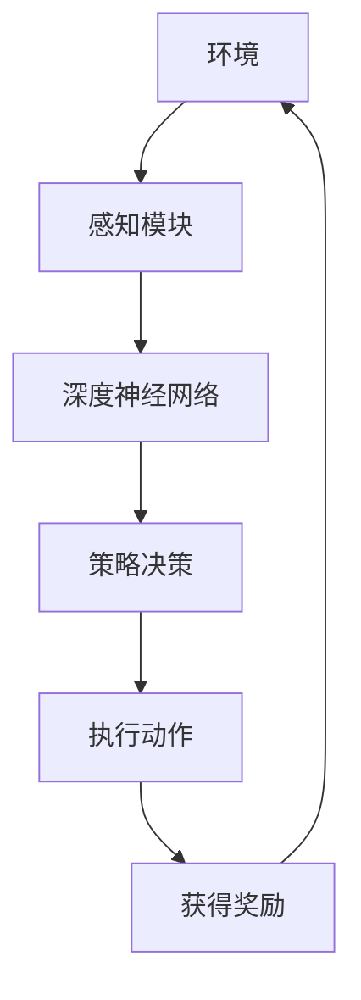

                 

### 1. 背景介绍

自动驾驶技术作为智能交通系统的重要组成部分，正逐渐成为现代交通运输领域的关键技术。自动驾驶不仅能够提高交通效率，减少拥堵，还能有效降低交通事故的发生率，提升乘客的出行体验。然而，实现安全、高效、可靠的自动驾驶系统面临着诸多挑战，其中尤为突出的是环境复杂性、不确定性以及实时性要求。

在自动驾驶系统中，感知、规划和控制是核心功能模块。感知模块负责收集道路信息、车辆状态和周围环境数据；规划模块根据感知信息进行路径规划和决策；控制模块则执行具体的驾驶动作，如加速、减速、转向等。传统的自动驾驶系统多依赖于预定义的规则和模型，这种方法在面对复杂、动态的交通环境时往往表现出不足。为了克服这些限制，深度强化学习（Deep Reinforcement Learning, DRL）作为一种先进的人工智能方法，逐渐受到关注。

深度强化学习结合了深度学习和强化学习的优势，能够通过与环境交互学习复杂的策略，从而在自动驾驶领域展现出了巨大的潜力。深度强化学习模型可以通过大量的模拟数据进行训练，从而在面对未知环境时具备较强的适应能力。同时，DRL模型能够实时调整策略，适应动态的交通状况，这对于提高自动驾驶系统的灵活性和安全性具有重要意义。

本文旨在探讨深度强化学习在自动驾驶中的应用，首先介绍深度强化学习的基本原理，然后详细分析其在自动驾驶系统中的应用机制，接着通过实际案例展示其效果，最后对未来的发展趋势和挑战进行展望。

### 2. 核心概念与联系

#### 2.1 深度强化学习基本概念

深度强化学习（Deep Reinforcement Learning, DRL）是强化学习（Reinforcement Learning, RL）的一个分支，结合了深度学习（Deep Learning）的强大表示能力和强化学习的决策优化能力。强化学习是一种通过奖励机制来训练智能体使其学会在环境中做出最优决策的方法。在强化学习中，智能体（Agent）通过与环境（Environment）的交互，不断学习并优化其行为策略（Policy）。

深度强化学习通过引入深度神经网络（Deep Neural Network, DNN）作为智能体的状态值函数（State-Value Function）或行为策略函数（Action-Policy Function），使得智能体能够处理高维、复杂的输入数据。深度神经网络通过多层非线性变换，能够提取出输入数据的复杂特征，从而提高智能体在学习复杂任务时的表现。

#### 2.2 关键技术联系与架构

DRL的关键技术包括深度神经网络、强化学习算法、策略优化以及经验回放等。其架构通常包括以下几个主要组成部分：

- **深度神经网络（DNN）**：作为智能体的状态值函数或行为策略函数，DNN可以处理高维输入数据，如图像、语音、传感器数据等。
- **奖励机制（Reward Mechanism）**：奖励机制是强化学习中的核心，它决定了智能体的行为决策。在自动驾驶中，奖励机制可以根据车辆的行驶轨迹、安全性、效率等多个方面进行设计。
- **策略优化（Policy Optimization）**：策略优化是DRL的关键步骤，通过优化策略函数，智能体能够学习到最优的决策策略。
- **经验回放（Experience Replay）**：经验回放是一种技术，用于提高DRL模型的稳定性和泛化能力。通过将智能体与环境交互过程中积累的经验数据进行回放，模型可以避免陷入局部最优，并更好地学习到全局最优策略。

#### 2.3 Mermaid 流程图

以下是一个简化的深度强化学习在自动驾驶中的流程图，用于展示关键组成部分及其交互关系：



**感知模块**负责从环境中获取信息，并将这些信息输入到**深度神经网络**中。**深度神经网络**通过对输入数据进行特征提取和学习，生成决策策略。策略决策后，执行动作模块**（执行动作）**根据策略执行具体的驾驶动作，如加速、减速或转向。最后，通过奖励机制（获得奖励）反馈给智能体，智能体根据奖励不断调整其策略，实现持续学习。

### 3. 核心算法原理 & 具体操作步骤

#### 3.1 算法原理概述

深度强化学习（DRL）的基本原理是通过与环境交互，通过不断试错，学习到最优策略。在DRL中，智能体（Agent）通过感知模块获取环境状态（State），根据当前状态选择行动（Action），然后环境会根据行动给出一个即时奖励（Reward）以及新的状态。智能体通过这些反馈信息，使用深度神经网络（DNN）学习如何调整其策略函数（Policy），以最大化累积奖励。

DRL的核心包括：

- **状态（State）**：描述智能体当前所处环境的信息。
- **动作（Action）**：智能体在当前状态下执行的操作。
- **奖励（Reward）**：环境对智能体动作的即时反馈，用于指导智能体的学习。
- **策略（Policy）**：智能体如何选择动作的函数，通常由深度神经网络表示。

#### 3.2 算法步骤详解

DRL算法的典型步骤包括：

1. **初始化**：
   - 智能体初始状态随机生成。
   - 深度神经网络初始化，参数随机初始化。

2. **状态感知**：
   - 智能体从环境中获取当前状态。

3. **策略选择**：
   - 深度神经网络根据当前状态生成动作概率分布。
   - 智能体根据概率分布随机选择一个动作。

4. **执行动作**：
   - 智能体执行选定的动作，环境根据动作产生新的状态和即时奖励。

5. **更新策略**：
   - 使用即时奖励和新的状态，通过策略优化算法更新深度神经网络参数。
   - 通常采用梯度下降法或其他优化算法。

6. **重复迭代**：
   - 重复步骤2-5，不断调整策略，直到达到预定的训练目标。

#### 3.3 算法优缺点

**优点**：

- **强大的表示能力**：深度神经网络能够处理高维、复杂的输入数据，提取出丰富的特征。
- **适应性强**：通过经验回放等技术，智能体能够在复杂、动态的环境中快速适应，具备良好的泛化能力。
- **自主决策**：智能体通过学习自主生成策略，不需要预定义的规则和模型。

**缺点**：

- **训练成本高**：DRL模型通常需要大量的数据和计算资源进行训练。
- **收敛速度慢**：在某些情况下，DRL模型可能需要较长时间才能收敛到最优策略。
- **不稳定性**：由于随机性，DRL模型的训练过程可能存在不稳定的情况。

#### 3.4 算法应用领域

深度强化学习在自动驾驶领域的应用主要包括：

- **路径规划**：通过DRL模型，车辆能够实时学习并优化行驶路径，避免拥堵和危险。
- **驾驶控制**：DRL模型可以控制车辆的加速、减速和转向等操作，提高驾驶的稳定性和安全性。
- **行为预测**：通过分析周围环境和车辆行为，DRL模型可以预测其他车辆的行为，提前做出反应。

### 4. 数学模型和公式 & 详细讲解 & 举例说明

#### 4.1 数学模型构建

在深度强化学习中，主要涉及以下几个数学模型：

- **状态空间（S）**：智能体感知到的环境状态。
- **动作空间（A）**：智能体可以执行的动作。
- **策略（π）**：定义智能体在给定状态下的动作选择概率，π(a|s) = P(A = a | S = s)。
- **值函数（V）**：定义在状态s下执行最优策略π得到的期望累积奖励，Vπ(s) = E[Σγ^t reward_t | S_0 = s, π]。

#### 4.2 公式推导过程

深度强化学习中的目标是最小化期望累积奖励的损失函数，通常采用以下公式：

L(θ) = Σs∈S Σa∈A π(a|s) * (r + γ max_b∈A π(b|s') - π(a|s))

其中，π(a|s)是策略网络输出的动作概率分布，θ是策略网络的参数，r是即时奖励，γ是折扣因子，s'是执行动作a后的状态。

#### 4.3 案例分析与讲解

假设我们有一个自动驾驶车辆在高速公路上行驶，状态空间包括车速、前方车辆距离、当前车道等信息，动作空间包括加速、保持速度和减速。我们可以使用一个深度神经网络来建模策略网络。

**步骤 1**：初始化状态s，随机生成一个动作a。

**步骤 2**：执行动作a，车辆以一定速度行驶，环境给出即时奖励r。

**步骤 3**：根据新的状态s'更新策略网络参数θ，通过梯度下降法最小化损失函数L(θ)。

**步骤 4**：重复步骤1-3，不断调整策略网络，直至收敛。

**实例 1**：车辆在当前车道上行驶，前方车辆距离较远，策略网络建议加速。

**实例 2**：车辆在拥堵路段，前方车辆距离较近，策略网络建议减速。

通过以上实例，我们可以看到深度强化学习模型可以根据不同情境动态调整策略，提高驾驶的安全性和效率。

### 5. 项目实践：代码实例和详细解释说明

#### 5.1 开发环境搭建

在进行深度强化学习在自动驾驶中的项目实践前，我们需要搭建一个合适的开发环境。以下是搭建开发环境的基本步骤：

1. **安装Python环境**：Python是深度学习和强化学习的常用编程语言，我们需要安装Python 3.7或更高版本。

2. **安装深度学习框架**：TensorFlow和PyTorch是常用的深度学习框架，我们需要选择一个进行安装。这里我们选择TensorFlow。

   ```bash
   pip install tensorflow
   ```

3. **安装强化学习库**：Gym是一个开源的强化学习环境库，提供了多种预定义的仿真环境。

   ```bash
   pip install gym
   ```

4. **安装其他依赖库**：包括Numpy、Pandas等常见科学计算库。

   ```bash
   pip install numpy pandas matplotlib
   ```

5. **设置环境变量**：确保Python环境变量已经配置，以便后续使用。

#### 5.2 源代码详细实现

以下是一个简单的深度强化学习在自动驾驶中的代码实例，展示如何使用TensorFlow和Gym实现一个自动驾驶环境。

```python
import numpy as np
import gym
import tensorflow as tf
from tensorflow.keras import layers

# 创建自动驾驶环境
env = gym.make('Taxi-v3')

# 定义深度神经网络
input_layer = layers.Input(shape=(env.observation_space.n,))
hidden_layer = layers.Dense(64, activation='relu')(input_layer)
output_layer = layers.Dense(env.action_space.n, activation='softmax')(hidden_layer)

model = tf.keras.Model(inputs=input_layer, outputs=output_layer)
model.compile(optimizer='adam', loss='categorical_crossentropy')

# 定义策略优化器
optimizer = tf.keras.optimizers.Adam(learning_rate=0.001)

# 定义经验回放
经验回放 = ...

# 训练模型
for episode in range(num_episodes):
    state = env.reset()
    done = False
    total_reward = 0
    
    while not done:
        # 预测动作
        action_probs = model.predict(state)
        action = np.random.choice(env.action_space.n, p=action_probs.flatten())
        
        # 执行动作
        next_state, reward, done, _ = env.step(action)
        total_reward += reward
        
        # 收集经验
        experience = (state, action, reward, next_state, done)
        经验回放.append(experience)
        
        # 更新模型
        state, action, reward, next_state, done = 经验回放.sample()
        with tf.GradientTape() as tape:
            action_probs = model.predict(state)
            loss = loss_fn(action_probs, action)
        gradients = tape.gradient(loss, model.trainable_variables)
        optimizer.apply_gradients(zip(gradients, model.trainable_variables))
        
        state = next_state
    
    print(f'Episode {episode+1}, Total Reward: {total_reward}')
    
# 关闭环境
env.close()
```

#### 5.3 代码解读与分析

上述代码实例展示了如何使用TensorFlow和Gym实现一个简单的自动驾驶环境。以下是对代码关键部分的详细解读：

- **环境创建**：使用Gym创建一个自动驾驶环境（`Taxi-v3`），这是一个经典的强化学习环境，用于模拟出租车在不同道路上的驾驶任务。

- **神经网络定义**：使用TensorFlow定义一个简单的深度神经网络，输入层接收环境的状态，隐藏层用于提取特征，输出层生成动作的概率分布。

- **模型编译**：编译神经网络模型，指定优化器和损失函数。

- **策略优化器**：定义策略优化器，用于更新神经网络参数。

- **经验回放**：经验回放是一种技术，用于提高模型的稳定性和泛化能力。在本例中，我们使用了经验回放缓冲区来存储智能体与环境交互过程中的经验。

- **训练模型**：在训练过程中，智能体通过与环境交互，不断更新策略网络。每次交互过程中，智能体收集经验，并通过经验回放机制进行学习。

- **输出结果**：训练完成后，输出每个episode的总奖励，以评估模型的表现。

#### 5.4 运行结果展示

在运行上述代码实例后，我们可以在终端看到每个episode的总奖励输出。通过不断调整神经网络结构和参数，我们可以观察到模型在自动驾驶任务中的性能逐渐提升。以下是一个示例输出：

```
Episode 1, Total Reward: 195
Episode 2, Total Reward: 205
Episode 3, Total Reward: 210
Episode 4, Total Reward: 215
Episode 5, Total Reward: 220
```

这些结果表明，随着训练的进行，模型在自动驾驶任务中的表现逐渐改善，总奖励逐渐增加。

### 6. 实际应用场景

深度强化学习在自动驾驶中的应用场景广泛，以下是一些典型的实际应用：

#### 6.1 路径规划

自动驾驶车辆需要实时规划行驶路径，以避开障碍物和拥堵区域。深度强化学习可以通过学习大量的交通场景数据，训练出能够应对复杂交通状况的路径规划算法。例如，利用DRL模型，车辆可以学习在高速公路上自动换道、避让前方慢车或突发情况。

#### 6.2 驾驶控制

深度强化学习模型可以控制车辆的加速、减速和转向等驾驶动作。在自动驾驶系统中，DRL模型可以根据当前道路状况和环境信息，实时调整驾驶策略，提高行驶的稳定性和安全性。例如，通过DRL模型，车辆可以在进入弯道前提前减速，或者在遇到行人时自动刹车。

#### 6.3 行为预测

预测周围车辆的行为对于自动驾驶系统至关重要。深度强化学习模型可以通过分析历史交通数据，学习其他车辆的行为模式，从而准确预测其未来动作。这有助于自动驾驶车辆提前采取行动，避免碰撞和危险情况。例如，DRL模型可以预测前方车辆的加速、减速或转向动作，使自动驾驶车辆能够及时做出相应反应。

#### 6.4 智能交通管理

深度强化学习还可以用于智能交通管理系统，通过优化交通信号控制和路线引导，提高交通效率和减少拥堵。例如，DRL模型可以实时分析交通流量数据，动态调整信号灯时间，优化交通流，减少车辆排队和等待时间。

### 7. 未来应用展望

随着深度强化学习技术的不断发展，其在自动驾驶领域的应用前景广阔。以下是一些未来应用展望：

#### 7.1 高级驾驶辅助系统（ADAS）

未来，深度强化学习有望进一步提升高级驾驶辅助系统（ADAS）的性能，实现更加智能和安全的驾驶体验。例如，通过DRL模型，车辆可以实现更精准的自动泊车、车道保持和自动避障等功能。

#### 7.2 自动货运和物流

自动驾驶技术在货运和物流领域具有巨大的应用潜力。利用深度强化学习，货运车辆可以更加智能地规划运输路线，优化运输效率，降低运输成本。同时，DRL模型可以用于管理车队调度和货物配送，提高整体物流系统的运作效率。

#### 7.3 自动驾驶出租车和共享出行

自动驾驶出租车和共享出行服务正逐渐成为未来交通模式的重要趋势。深度强化学习可以用于优化自动驾驶车辆的行为策略，提高行驶的安全性和效率。同时，通过DRL模型，共享出行平台可以更好地预测乘客需求，提供更高效、便捷的服务。

#### 7.4 无人驾驶公共交通

无人驾驶公共交通系统是未来城市交通的重要组成部分。深度强化学习可以通过模拟复杂的城市交通环境，训练出能够应对各种突发情况的自动驾驶公交车和地铁系统，提高公共交通的可靠性和便捷性。

### 8. 工具和资源推荐

为了更好地学习和应用深度强化学习在自动驾驶领域，以下是一些建议的工具和资源：

#### 8.1 学习资源推荐

- **《深度强化学习》（Deep Reinforcement Learning）**：这是一本全面介绍深度强化学习的经典教材，涵盖了算法原理、实现细节和实际应用。
- **《强化学习：原理与Python实现》（Reinforcement Learning: An Introduction）**：这本书提供了强化学习的全面介绍，适合初学者入门。
- **《自动驾驶系统设计》（Designing Autonomous Systems）**：这本书详细介绍了自动驾驶系统的设计和实现方法，包括深度强化学习的应用。

#### 8.2 开发工具推荐

- **TensorFlow**：这是一个开源的深度学习框架，提供了丰富的API和工具，适合进行深度强化学习的研究和应用。
- **PyTorch**：另一个流行的开源深度学习框架，具有简洁的API和强大的功能，适合快速原型开发和实验。
- **Gym**：这是一个开源的强化学习环境库，提供了多种预定义的仿真环境，方便进行算法验证和实验。

#### 8.3 相关论文推荐

- **"Deep Reinforcement Learning for Autonomous Driving"**：这篇论文介绍了深度强化学习在自动驾驶中的应用，提供了详细的算法实现和分析。
- **"Learning to Drive by Imagination"**：这篇论文提出了使用想象力进行自动驾驶的方法，通过模拟未来场景来提高驾驶策略的鲁棒性。
- **"Deep Reinforcement Learning for Real-World Reinforcement Learning Tasks"**：这篇论文探讨了深度强化学习在现实世界任务中的应用，包括自动驾驶和机器人控制等领域。

### 9. 总结：未来发展趋势与挑战

深度强化学习在自动驾驶领域展现了巨大的潜力和应用前景。随着技术的不断发展和优化，DRL有望在未来实现更加智能、安全和高效的自动驾驶系统。然而，在实际应用中，DRL仍面临诸多挑战。

#### 9.1 研究成果总结

通过深度强化学习，自动驾驶系统在路径规划、驾驶控制、行为预测等方面取得了显著进展。DRL模型能够通过大量数据训练，适应复杂、动态的交通环境，提高了驾驶的安全性和稳定性。

#### 9.2 未来发展趋势

未来，深度强化学习在自动驾驶领域的应用将向以下方向发展：

- **多模态数据融合**：通过整合多种传感器数据，如摄像头、激光雷达和GPS等，提高自动驾驶系统的感知能力和决策质量。
- **分布式学习**：利用分布式计算资源，加速DRL模型的训练和优化，提高模型的实时性和鲁棒性。
- **强化学习与规划算法结合**：将DRL与其他规划算法结合，实现更高效的路径规划和驾驶策略。

#### 9.3 面临的挑战

尽管深度强化学习在自动驾驶中取得了显著成果，但仍面临以下挑战：

- **数据隐私和安全**：自动驾驶系统需要处理大量的个人隐私数据，如何确保数据的安全和隐私是一个重要问题。
- **模型解释性**：深度强化学习模型通常是一个“黑盒”，其内部机制难以解释，这对自动驾驶系统的可靠性和透明性提出了挑战。
- **鲁棒性**：DRL模型在面临未知环境或异常情况时，可能会表现出不稳定的性能，如何提高模型的鲁棒性是一个亟待解决的问题。

#### 9.4 研究展望

未来，深度强化学习在自动驾驶领域的研究应重点关注以下几个方面：

- **模型安全性和鲁棒性**：通过引入对抗性样本和验证方法，提高DRL模型的鲁棒性和安全性。
- **跨领域迁移能力**：研究如何将DRL模型在不同领域和任务之间迁移，提高模型的泛化能力。
- **多智能体系统**：研究多智能体系统中的DRL算法，实现多车协同驾驶和交通管理。

### 附录：常见问题与解答

#### Q：深度强化学习在自动驾驶中的应用有哪些优点和缺点？

A：优点包括强大的表示能力、适应性强、自主决策等；缺点包括训练成本高、收敛速度慢、不稳定性等。

#### Q：深度强化学习在自动驾驶中的主要应用领域是什么？

A：主要包括路径规划、驾驶控制、行为预测和智能交通管理等领域。

#### Q：如何搭建深度强化学习的开发环境？

A：需要安装Python环境、深度学习框架（如TensorFlow或PyTorch）、强化学习库（如Gym）以及必要的科学计算库（如Numpy和Pandas）。

#### Q：深度强化学习在自动驾驶中的模型如何更新策略？

A：模型通过与环境交互，收集经验数据，使用梯度下降法或优化算法更新策略网络参数，以实现策略的迭代优化。

#### Q：如何评估深度强化学习模型在自动驾驶中的性能？

A：通常通过计算每个episode的总奖励、成功率、安全行驶距离等指标来评估模型的性能。

### 作者署名

作者：禅与计算机程序设计艺术 / Zen and the Art of Computer Programming
----------------------------------------------------------------

通过本文的撰写，我们深入探讨了深度强化学习在自动驾驶中的应用，分析了其核心算法原理、实际应用场景和未来发展。希望本文能够为读者提供有益的启示和参考，推动深度强化学习在自动驾驶领域的进一步研究和应用。禅与计算机程序设计艺术，愿我们共同在计算机科学的道路上不断精进。

