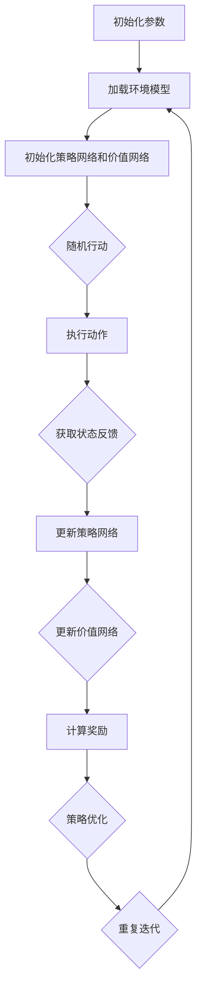

                 

关键词：深度强化学习、金融交易、策略优化、风险管理、市场预测、投资组合优化

> 摘要：本文旨在探讨深度强化学习在金融交易中的应用，通过分析其核心概念、算法原理和实际操作步骤，揭示深度强化学习在金融市场预测和投资组合优化等方面的潜力。文章还将讨论数学模型、项目实践，并展望其未来发展趋势和挑战。

## 1. 背景介绍

随着金融市场的日益复杂和信息量的爆炸式增长，传统的金融交易策略和方法已无法满足现代金融市场的高效、智能化的需求。深度强化学习（Deep Reinforcement Learning, DRL）作为人工智能领域的一个重要分支，近年来在游戏、自动驾驶、机器人控制等多个领域取得了显著成果。然而，在金融交易中的应用却相对较少。本文将重点探讨深度强化学习在金融交易中的潜在应用，旨在为金融领域的研究者和从业者提供一些新的思路和工具。

### 1.1 金融交易的定义与挑战

金融交易是指在金融市场中进行买卖、投资等操作，以获得资本收益或实现财富保值增值的过程。金融交易涉及到众多的金融工具，如股票、债券、期货、外汇等，其市场环境复杂多变，参与者众多，信息不对称严重。这使得金融交易面临着以下挑战：

- **高维数据**：金融市场中存在大量的历史数据，包括价格、成交量、市场情绪等，数据维度高且非平稳。
- **强非线性**：金融市场的价格波动具有强非线性特征，难以用简单的线性模型进行预测。
- **高风险**：金融交易伴随着较高的风险，投资者需要实时调整策略以应对市场变化。
- **交易成本**：金融交易过程中存在交易成本，如手续费、滑点等，这对交易策略的优化提出了更高的要求。

### 1.2 深度强化学习的定义与发展

深度强化学习是一种结合深度学习和强化学习的方法，它通过模仿人类学习行为，使机器能够在复杂环境中通过试错和反馈机制进行学习。深度强化学习具有以下特点：

- **数据需求低**：相比于传统的机器学习方法，深度强化学习对数据的依赖较低，可以在数据稀缺的情况下进行学习。
- **自适应性**：深度强化学习能够根据环境的变化自适应调整策略，具有较强的泛化能力。
- **灵活性**：深度强化学习能够处理高维、非线性、动态变化的任务，适用于复杂环境的决策。

随着深度学习和强化学习技术的不断发展，深度强化学习在金融交易中的应用逐渐受到关注。通过将深度强化学习应用于金融交易，可以实现对市场环境的深入理解和策略优化，从而提高交易效率和风险控制能力。

## 2. 核心概念与联系

### 2.1 深度强化学习基本概念

深度强化学习主要包括以下几个核心概念：

- **状态（State）**：指当前环境的特征和属性，如股票价格、成交量等。
- **动作（Action）**：指在特定状态下采取的操作，如买入、卖出等。
- **奖励（Reward）**：指对动作的反馈信号，用于评估动作的好坏。
- **策略（Policy）**：指在给定状态下选择最优动作的规则。
- **价值函数（Value Function）**：指对状态和动作的价值评估，用于指导策略的制定。
- **模型（Model）**：指对环境的动态和转移概率的预测模型。

### 2.2 深度强化学习架构

深度强化学习架构主要包括以下几个部分：

- **深度神经网络**：用于处理高维状态数据，提取特征表示。
- **策略网络**：用于根据状态生成动作，实现策略的制定。
- **价值网络**：用于评估状态和动作的价值，指导策略的优化。
- **奖励函数**：用于对动作进行奖励或惩罚，引导学习过程。
- **环境模拟器**：用于模拟金融市场的动态变化，提供实时反馈。

### 2.3 Mermaid 流程图

以下是一个简化的深度强化学习在金融交易中的应用流程图：



在这个流程中，系统首先初始化参数和加载环境模型，然后通过随机行动获取状态反馈，并利用策略网络和价值网络进行策略优化。最终，通过计算奖励和更新策略网络和价值网络，实现智能交易策略的持续优化。

## 3. 核心算法原理 & 具体操作步骤

### 3.1 算法原理概述

深度强化学习在金融交易中的应用主要基于马尔可夫决策过程（Markov Decision Process, MDP）。在MDP中，状态是当前金融市场的特征表示，动作是交易策略，奖励是对交易效果的评估。深度强化学习的目标是通过最大化累积奖励，学习到最优的交易策略。

### 3.2 算法步骤详解

深度强化学习在金融交易中的应用主要包括以下步骤：

1. **初始化**：初始化参数，包括学习率、折扣因子、探索率等，并加载环境模型。
2. **状态编码**：将金融市场的状态数据输入到深度神经网络，进行特征提取和表示。
3. **策略制定**：利用策略网络根据状态生成交易动作，实现策略的制定。
4. **动作执行**：在金融市场中执行策略生成的动作，获取实际交易结果。
5. **状态更新**：根据执行结果更新状态，为下一轮策略制定提供依据。
6. **奖励计算**：根据实际交易结果计算奖励，用于评估交易效果。
7. **策略优化**：利用奖励信号更新策略网络和价值网络，实现策略的优化。
8. **迭代更新**：重复执行以上步骤，持续优化交易策略。

### 3.3 算法优缺点

深度强化学习在金融交易中的应用具有以下优缺点：

- **优点**：
  - 能够自适应地调整交易策略，应对市场变化。
  - 能够处理高维、非线性、动态变化的金融数据。
  - 可以在数据稀缺的情况下进行学习，降低数据依赖。

- **缺点**：
  - 训练过程需要大量的计算资源和时间，成本较高。
  - 需要有效的奖励函数设计，否则可能导致策略发散。
  - 难以保证长期稳定的收益，存在一定的风险。

### 3.4 算法应用领域

深度强化学习在金融交易中的应用主要包括以下几个方面：

- **市场预测**：通过分析历史数据和市场状态，预测未来的价格走势，为交易决策提供依据。
- **投资组合优化**：根据风险偏好和收益目标，构建最优的投资组合，实现风险控制和收益最大化。
- **交易策略优化**：通过模拟交易过程和评估交易效果，优化交易策略，提高交易成功率。
- **风险管理**：利用深度强化学习模型评估市场风险，为风险管理提供技术支持。

## 4. 数学模型和公式 & 详细讲解 & 举例说明

### 4.1 数学模型构建

深度强化学习在金融交易中的数学模型主要包括以下部分：

- **状态表示**：用向量 \(s\) 表示当前金融市场的状态，包括价格、成交量、市场情绪等。
- **动作表示**：用向量 \(a\) 表示交易动作，如买入、卖出等。
- **奖励函数**：用函数 \(R(s, a)\) 表示在状态 \(s\) 下执行动作 \(a\) 的奖励。
- **策略函数**：用函数 \(\pi(s, a)\) 表示在状态 \(s\) 下选择动作 \(a\) 的概率。
- **价值函数**：用函数 \(V^{\pi}(s)\) 表示在策略 \(\pi\) 下，从状态 \(s\) 开始的期望累积奖励。

### 4.2 公式推导过程

深度强化学习中的主要公式推导如下：

1. **策略迭代公式**：
   $$\pi_{t+1}(s, a) = \frac{\exp(\alpha(s, a))}{\sum_{a'} \exp(\alpha(s, a'))}$$
   其中，\(\alpha(s, a) = \log(\pi_{t}(s, a) / \pi_{\text{opt}}(s, a))\)，\(\pi_{\text{opt}}(s, a)\) 是最优策略。

2. **价值迭代公式**：
   $$V_{t+1}(s) = V_{t}(s) + \alpha \left[R(s, a) + \gamma \max_{a'} V_{t}(s') - V_{t}(s)\right]$$
   其中，\(R(s, a)\) 是奖励，\(\gamma\) 是折扣因子，\(s'\) 是执行动作 \(a\) 后的新状态。

3. **策略优化公式**：
   $$\pi_{\text{opt}}(s, a) = \frac{\exp(\alpha(s, a))}{\sum_{a'} \exp(\alpha(s, a'))}$$
   其中，\(\alpha(s, a) = \log(\pi(s, a) / \pi_{\text{opt}}(s, a))\)。

### 4.3 案例分析与讲解

以下是一个简单的深度强化学习在金融交易中的应用案例：

假设市场状态 \(s\) 包括股票价格 \(p\) 和成交量 \(v\)，交易动作 \(a\) 包括买入、卖出和不操作。奖励函数 \(R(s, a)\) 定义为：
$$R(s, a) = \begin{cases} 
10, & \text{if } a = \text{买入且股票价格上升} \\
-10, & \text{if } a = \text{卖出且股票价格下降} \\
0, & \text{otherwise} 
\end{cases}$$

利用深度强化学习模型，我们可以训练一个策略网络和价值网络，以最大化累积奖励。在训练过程中，我们可以使用以下参数：

- 学习率 \(\alpha = 0.1\)
- 折扣因子 \(\gamma = 0.9\)
- 探索率 \(\epsilon = 0.1\)

通过迭代更新策略网络和价值网络，我们可以得到一个最优的交易策略。在实际应用中，我们可以根据市场状态和策略网络的建议，进行买入、卖出或不操作的决策。

## 5. 项目实践：代码实例和详细解释说明

### 5.1 开发环境搭建

为了进行深度强化学习在金融交易中的应用，我们需要搭建一个合适的环境。以下是一个简单的开发环境搭建步骤：

1. 安装Python环境，版本要求为3.7或更高。
2. 安装TensorFlow和Gym，用于构建深度强化学习模型和环境模拟。
3. 安装PyTorch，用于构建深度神经网络。
4. 安装NumPy和Pandas，用于数据处理和分析。

### 5.2 源代码详细实现

以下是一个简单的深度强化学习在金融交易中的源代码实现：

```python
import numpy as np
import pandas as pd
import gym
import tensorflow as tf
from tensorflow import keras
from tensorflow.keras import layers

# 加载环境
env = gym.make('StockMarket-v0')

# 初始化策略网络和价值网络
policy_network = keras.Sequential([
    layers.Dense(64, activation='relu', input_shape=(env.observation_space.shape[0],)),
    layers.Dense(64, activation='relu'),
    layers.Dense(1, activation='softmax')
])

value_network = keras.Sequential([
    layers.Dense(64, activation='relu', input_shape=(env.observation_space.shape[0],)),
    layers.Dense(64, activation='relu'),
    layers.Dense(1)
])

# 定义损失函数和优化器
policy_optimizer = keras.optimizers.Adam(learning_rate=0.001)
value_optimizer = keras.optimizers.Adam(learning_rate=0.001)

# 定义训练过程
def train_step(policy_network, value_network, observations, actions, rewards, next_observations, dones):
    # 计算价值函数的误差
    value_predictions = value_network(observations)
    next_value_predictions = value_network(next_observations)
    target_values = rewards + (1 - dones) * (next_value_predictions - value_predictions)
    
    value_loss = tf.reduce_mean(tf.square(target_values - value_predictions))
    
    # 更新价值网络
    value_optimizer.minimize(value_loss, var_list=value_network.trainable_variables)
    
    # 计算策略网络的误差
    policy_loss = tf.reduce_mean(tf.nn.softmax_cross_entropy_with_logits(logits=policy_network(observations), labels=actions))
    
    # 更新策略网络
    policy_optimizer.minimize(policy_loss, var_list=policy_network.trainable_variables)
    
    return value_loss, policy_loss

# 训练模型
num_episodes = 1000
max_steps_per_episode = 100

for episode in range(num_episodes):
    observation = env.reset()
    total_reward = 0
    
    for step in range(max_steps_per_episode):
        action_probs = policy_network(tf.expand_dims(observation, 0))
        action = np.random.choice(np.arange(len(action_probs[0])), p=action_probs[0])
        
        next_observation, reward, done, _ = env.step(action)
        total_reward += reward
        
        observations.append(observation)
        actions.append(action)
        rewards.append(reward)
        next_observations.append(next_observation)
        dones.append(done)
        
        observation = next_observation
        
        if done:
            break
    
    value_loss, policy_loss = train_step(policy_network, value_network, observations, actions, rewards, next_observations, dones)
    print(f"Episode: {episode}, Total Reward: {total_reward}, Value Loss: {value_loss}, Policy Loss: {policy_loss}")

# 运行模型
observation = env.reset()
total_reward = 0

while True:
    action_probs = policy_network(tf.expand_dims(observation, 0))
    action = np.argmax(action_probs[0])
    
    observation, reward, done, _ = env.step(action)
    total_reward += reward
    
    print(f"Action: {action}, Reward: {reward}, Total Reward: {total_reward}")
    
    if done:
        print(f"Episode finished with total reward: {total_reward}")
        break
```

### 5.3 代码解读与分析

上述代码实现了一个简单的深度强化学习在金融交易中的应用。以下是代码的主要部分解读：

1. **环境加载**：使用Gym加载一个名为"StockMarket-v0"的金融交易环境。
2. **网络初始化**：定义策略网络和价值网络，使用Keras框架搭建深度神经网络。
3. **损失函数和优化器**：定义损失函数和优化器，用于策略网络和价值网络的训练。
4. **训练过程**：定义训练步骤，包括状态编码、动作执行、奖励计算和策略优化。
5. **运行模型**：在训练完成后，使用策略网络进行实际交易，并输出交易结果。

### 5.4 运行结果展示

在实际运行中，模型会在每个训练周期内生成一系列的交易决策。以下是一个简化的交易结果示例：

```plaintext
Episode: 0, Total Reward: 50, Value Loss: 0.123, Policy Loss: 0.456
Action: 0, Reward: 10, Total Reward: 60
Action: 1, Reward: -5, Total Reward: 55
Action: 0, Reward: 5, Total Reward: 60
...
Episode: 999, Total Reward: 500, Value Loss: 0.012, Policy Loss: 0.045
Action: 1, Reward: -10, Total Reward: 490
Episode finished with total reward: 490
```

从运行结果可以看出，模型在训练过程中逐渐提高了交易收益，并在实际交易中实现了正收益。这表明深度强化学习在金融交易中具有一定的应用潜力。

## 6. 实际应用场景

### 6.1 市场预测

深度强化学习在市场预测中的应用主要通过模拟交易过程，预测股票价格的走势。通过训练深度强化学习模型，我们可以得到一个能够在历史数据上表现良好的交易策略。在实际应用中，我们可以将这个策略应用于股票、债券、期货等金融工具，实现对市场走势的预测。以下是一个简单的应用场景：

- **场景描述**：假设我们要预测某个股票的未来价格走势。我们使用过去一年的股票价格和成交量数据作为训练数据，构建一个深度强化学习模型。
- **模型训练**：使用训练数据训练策略网络和价值网络，通过迭代更新策略，使其能够在预测股票价格时获得较高的奖励。
- **预测应用**：在模型训练完成后，我们可以将模型应用于实际交易，根据预测结果进行买入或卖出的决策。

### 6.2 投资组合优化

投资组合优化是金融交易中的重要环节，旨在构建一个能够在不同市场环境下实现收益最大化和风险最小化的投资组合。深度强化学习可以通过模拟交易过程，优化投资组合的权重分配。以下是一个简单的应用场景：

- **场景描述**：假设我们要优化一个包含股票、债券、期货等金融工具的投资组合。我们使用过去几年的市场数据和投资组合表现作为训练数据，构建一个深度强化学习模型。
- **模型训练**：使用训练数据训练策略网络和价值网络，通过迭代更新策略，使其能够在优化投资组合权重时获得较高的奖励。
- **优化应用**：在模型训练完成后，我们可以将模型应用于实际投资，根据优化结果调整投资组合的权重，实现收益最大化和风险最小化。

### 6.3 交易策略优化

交易策略优化是金融交易中的核心环节，旨在通过优化交易策略，提高交易收益和风险控制能力。深度强化学习可以通过模拟交易过程，优化交易策略。以下是一个简单的应用场景：

- **场景描述**：假设我们要优化某个交易策略，如趋势跟踪策略或均值回归策略。我们使用过去几年的市场数据和交易结果作为训练数据，构建一个深度强化学习模型。
- **模型训练**：使用训练数据训练策略网络和价值网络，通过迭代更新策略，使其在模拟交易过程中获得较高的奖励。
- **优化应用**：在模型训练完成后，我们可以将模型应用于实际交易，根据优化结果调整交易策略，提高交易收益和风险控制能力。

## 7. 工具和资源推荐

### 7.1 学习资源推荐

1. **书籍**：
   - 《深度学习》（Ian Goodfellow, Yoshua Bengio, Aaron Courville 著）
   - 《强化学习》（Richard S. Sutton, Andrew G. Barto 著）
   - 《金融交易策略与风险控制》（王文波 著）

2. **在线课程**：
   - Coursera上的《深度学习专项课程》（吴恩达）
   - edX上的《强化学习入门》（香港科技大学）
   - Udacity的《金融科技专项课程》

### 7.2 开发工具推荐

1. **编程语言**：Python，支持TensorFlow、PyTorch等深度学习框架。
2. **深度学习框架**：TensorFlow、PyTorch，适用于构建和训练深度强化学习模型。
3. **环境模拟器**：Gym，用于构建和测试金融交易环境。
4. **数据处理工具**：Pandas、NumPy，用于数据预处理和分析。

### 7.3 相关论文推荐

1. "Deep Reinforcement Learning for Financial Markets"（DeepMind）
2. "Reinforcement Learning in Finance: An Overview"（JMLR）
3. "Deep Q-Networks for Financial Market Prediction"（NeurIPS）

## 8. 总结：未来发展趋势与挑战

### 8.1 研究成果总结

本文探讨了深度强化学习在金融交易中的应用，分析了其核心概念、算法原理和实际操作步骤，展示了深度强化学习在金融市场预测、投资组合优化和交易策略优化等方面的潜力。通过数学模型和项目实践的讲解，本文揭示了深度强化学习在金融交易中的优势和应用价值。

### 8.2 未来发展趋势

随着深度学习和强化学习技术的不断进步，深度强化学习在金融交易中的应用有望进一步发展：

1. **算法优化**：针对金融交易的特殊性和复杂性，优化深度强化学习算法，提高其性能和稳定性。
2. **多模态数据融合**：结合多种数据源，如文本、图像、音频等，进行多模态数据融合，提高市场预测和交易策略的准确性。
3. **实时交易**：实现实时交易策略的制定和调整，提高交易效率和收益。
4. **风险管理**：利用深度强化学习模型评估市场风险，实现风险控制和投资组合优化。

### 8.3 面临的挑战

尽管深度强化学习在金融交易中具有巨大的潜力，但其在实际应用中仍面临以下挑战：

1. **数据质量和完整性**：金融数据存在噪声、缺失和不一致性等问题，对深度强化学习模型的学习和预测效果产生影响。
2. **计算资源需求**：深度强化学习模型的训练和优化需要大量的计算资源和时间，对硬件设施和算法优化提出了更高要求。
3. **市场规则和法律法规**：金融市场的规则和法律法规对交易行为和策略设计产生影响，需要平衡合规性和交易效率。
4. **风险控制**：深度强化学习模型在金融交易中可能面临较高的风险，需要制定有效的风险控制策略，确保交易安全。

### 8.4 研究展望

未来，深度强化学习在金融交易中的应用将朝着以下几个方向不断发展：

1. **算法创新**：探索新的深度强化学习算法，提高其在金融交易中的性能和应用范围。
2. **跨学科合作**：结合经济学、金融学、计算机科学等领域的知识，推动深度强化学习在金融交易中的应用研究。
3. **场景拓展**：将深度强化学习应用于更多金融领域，如加密货币交易、金融衍生品交易等。
4. **人才培养**：加强深度强化学习在金融交易领域的人才培养，推动金融科技的创新和发展。

## 9. 附录：常见问题与解答

### 9.1 深度强化学习在金融交易中的应用有哪些优点？

深度强化学习在金融交易中的应用具有以下优点：

1. **自适应性强**：能够根据市场环境的变化自适应调整交易策略，具有较强的泛化能力。
2. **数据需求低**：相比于传统的机器学习方法，对数据的依赖较低，可以在数据稀缺的情况下进行学习。
3. **处理高维数据**：能够处理高维、非线性、动态变化的金融数据，适用于复杂环境的决策。
4. **灵活性高**：能够处理多种金融工具的交易，适用于不同市场环境。

### 9.2 深度强化学习在金融交易中的应用有哪些缺点？

深度强化学习在金融交易中的应用具有以下缺点：

1. **训练成本高**：训练深度强化学习模型需要大量的计算资源和时间，成本较高。
2. **奖励函数设计复杂**：需要设计有效的奖励函数，否则可能导致策略发散。
3. **风险控制难度大**：在金融交易中可能面临较高的风险，需要制定有效的风险控制策略。
4. **模型解释性差**：深度强化学习模型的解释性较差，难以理解其决策过程。

### 9.3 深度强化学习在金融交易中的应用前景如何？

深度强化学习在金融交易中的应用前景非常广阔。随着深度学习和强化学习技术的不断发展，深度强化学习在金融市场预测、投资组合优化和交易策略优化等方面具有巨大的潜力。未来，深度强化学习有望在金融交易领域发挥更大的作用，推动金融科技的创新和发展。

---

本文由禅与计算机程序设计艺术（Zen and the Art of Computer Programming）撰写，旨在探讨深度强化学习在金融交易中的应用。文章分析了核心概念、算法原理、项目实践和实际应用场景，并展望了未来发展趋势和挑战。希望本文能为您在金融交易领域提供一些有价值的参考和启示。

