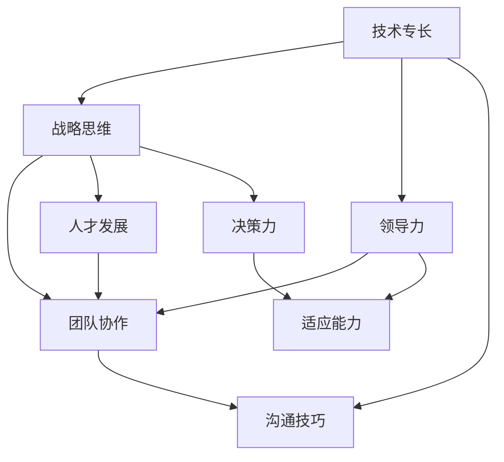

                 

关键词：优秀管理者、管理标准、技术领导力、团队协作、项目执行、人才发展

> 摘要：本文将深入探讨优秀管理者的标准，从技术领导力、团队协作、项目执行和人才发展等多个维度，阐述如何通过深度思考和有效实践来培养和识别出真正的优秀管理者。通过结合实际的IT行业案例，本文将提供一整套可供参考的管理标准和方法论。

## 1. 背景介绍

在当今快速发展的信息技术领域，优秀管理者的角色变得越来越重要。无论是大型企业还是初创公司，管理者的能力和素质直接影响到项目的成功与否，以及团队的成长和进步。随着技术的不断革新，市场需求的快速变化，管理者需要具备不仅仅是技术专长，更要有战略思维、领导力和适应能力。

本文旨在通过系统化的分析，为IT行业提供一套区分优秀管理者的标准。这些标准不仅涵盖了技术领域的专业知识，还包括了软技能和领导力的培养。通过这篇文章，希望能够帮助读者理解和识别优秀管理者，同时也为自身成长提供指导。

### 1.1 当前管理现状

随着IT行业的飞速发展，管理者面临的挑战也在不断增加。从传统项目管理到敏捷开发，从技术架构设计到团队文化建设，管理者需要不断学习和适应新的管理模式和方法。当前，许多管理者在技术和领导力方面仍然存在明显的短板，这导致了一些项目无法按时交付，团队效率低下，人才流失等问题。

### 1.2 优秀管理者的核心作用

优秀的管理者不仅是项目的指挥官，更是团队的导师和推动者。他们能够：

- 确保项目目标的实现，同时维护团队的健康和动力。
- 在技术和管理之间架起桥梁，促进跨部门的合作。
- 持续培养和吸引人才，提升团队的整体竞争力。
- 在面对变化和不确定性时，保持冷静和决策力。

## 2. 核心概念与联系

为了深入理解优秀管理者的标准，我们需要从几个核心概念和它们之间的联系出发。以下是几个关键概念及其关系的Mermaid流程图：



### 2.1 技术专长

优秀管理者必须具备扎实的技术背景，这包括对当前技术的深刻理解和能够紧跟技术发展趋势。只有这样才能在技术团队中建立权威，并有效地指导项目的技术方向。

### 2.2 战略思维

战略思维是管理者不可或缺的能力。它包括对市场和技术的长期规划，以及如何将团队的战略目标与公司整体战略相协调。

### 2.3 领导力

领导力是优秀管理者的核心素质。它涵盖了激励、协调和培养团队的能力。一个优秀的领导者能够带领团队克服困难，实现目标。

### 2.4 团队协作

团队协作是项目成功的关键。优秀管理者需要能够建立高效的团队协作机制，确保团队成员能够紧密合作，共同完成任务。

### 2.5 人才发展

优秀管理者不仅要有发现和吸引人才的能力，还要有能力培养人才，使其不断成长。这有助于团队长期发展，并提升整体竞争力。

### 2.6 适应能力

在快速变化的信息技术行业，管理者需要具备快速适应新环境和新需求的能力。这包括灵活的决策能力和应对突发情况的能力。

### 2.7 决策力

决策力是管理者在面对复杂问题时做出明智选择的能力。优秀的决策力能够帮助团队在关键时刻做出正确的决策。

### 2.8 沟通技巧

沟通技巧是管理者必须掌握的重要技能。良好的沟通能够减少误解，提高工作效率，建立团队信任。

## 3. 核心算法原理 & 具体操作步骤

### 3.1 算法原理概述

在探讨优秀管理者的标准时，我们可以借鉴一些管理学的核心理论，如领导力模型、团队动力模型等。这些理论为我们提供了一个框架，帮助管理者理解如何在不同情况下应用这些标准。

### 3.2 算法步骤详解

#### 3.2.1 建立技术权威

1. 深入了解团队当前使用的技术栈。
2. 定期参加技术研讨会和培训。
3. 鼓励团队成员分享技术心得。
4. 为团队成员提供技术指导和反馈。

#### 3.2.2 发展战略思维

1. 分析市场和行业趋势。
2. 设定短期和长期项目目标。
3. 与公司高层沟通，确保团队目标与公司战略一致。
4. 定期回顾和调整项目计划。

#### 3.2.3 培养领导力

1. 建立明确的目标和期望。
2. 提供反馈和指导，帮助团队成员成长。
3. 创造积极的团队文化，鼓励协作和开放沟通。
4. 在团队面临挑战时提供支持。

#### 3.2.4 促进团队协作

1. 设定清晰的团队目标和责任分工。
2. 定期举行团队会议，讨论项目进展和问题。
3. 利用协作工具，如JIRA或Slack，提高团队协作效率。
4. 鼓励团队成员相互学习和支持。

#### 3.2.5 重视人才发展

1. 设立个人发展计划，帮助团队成员明确职业目标。
2. 提供培训和晋升机会，激励团队成员不断进步。
3. 定期评估团队成员的表现，提供针对性的反馈。
4. 建立人才梯队，确保团队的人才储备。

#### 3.2.6 提高适应能力

1. 保持对行业变化的敏感性。
2. 建立灵活的工作流程，快速响应变化。
3. 在团队中培养适应新环境和新任务的能力。
4. 鼓励团队成员提出创新的想法和解决方案。

#### 3.2.7 增强决策力

1. 收集充分的信息，避免决策时的盲目性。
2. 分析各种可能的决策结果，评估风险和收益。
3. 与团队成员讨论，听取不同意见和建议。
4. 在关键时刻果断决策，并承担相应的责任。

#### 3.2.8 提升沟通技巧

1. 明确沟通的目标和受众。
2. 使用简洁明了的语言，避免使用专业术语。
3. 倾听他人的意见，尊重不同观点。
4. 在必要时使用可视化工具，如图表或演示文稿，增强沟通效果。

### 3.3 算法优缺点

这个算法结合了多种管理理论和实践方法，优点在于：

- 综合性强，涵盖了技术、战略、领导力等多个维度。
- 具有灵活性，能够适应不同的团队和项目需求。
- 强调持续学习和成长，有助于团队的长远发展。

然而，这个算法也存在一些缺点：

- 实施难度较大，需要管理者具备多方面的能力和素质。
- 过于理论化，可能在实际操作中难以具体应用。
- 对管理者的时间和精力要求较高，可能导致其他工作受到影响。

### 3.4 算法应用领域

这个算法适用于IT行业的各种类型的项目和团队，包括软件开发、数据分析、网络安全等。尤其是在以下情况下，这个算法的作用尤为显著：

- 需要跨部门协作的大型项目。
- 面临技术变革和市场需求快速变化的团队。
- 新成立或重组的团队，需要建立新的工作流程和团队文化。

## 4. 数学模型和公式 & 详细讲解 & 举例说明

在优秀管理者的标准中，数学模型和公式可以为我们提供量化的依据，帮助我们更精确地评估和管理团队。以下是一个简单的数学模型，用于评估管理者的绩效。

### 4.1 数学模型构建

假设我们有以下几个关键指标：

- 技术能力评分（\( T \)）：0到100之间的数值，反映管理者的技术背景和知识水平。
- 战略思维评分（\( S \)）：0到100之间的数值，反映管理者的战略规划和决策能力。
- 领导力评分（\( L \)）：0到100之间的数值，反映管理者的团队管理和领导能力。
- 团队协作评分（\( C \)）：0到100之间的数值，反映团队的协作效率和沟通效果。
- 适应能力评分（\( A \)）：0到100之间的数值，反映管理者在应对变化和挑战时的能力。

管理者的总评分（\( M \)）可以通过以下公式计算：

\[ M = T + S + L + C + A \]

### 4.2 公式推导过程

这个公式的推导基于以下几个假设：

1. 每个维度的重要性相等，因此直接相加。
2. 每个维度的评分范围在0到100之间，确保了评分的完整性和可比性。
3. 各个维度之间存在正相关关系，即某个维度的提高会促进其他维度的提升。

### 4.3 案例分析与讲解

假设我们有一个管理者，他的各项评分如下：

- 技术能力评分（\( T \)）：85
- 战略思维评分（\( S \)）：90
- 领导力评分（\( L \)）：80
- 团队协作评分（\( C \)）：75
- 适应能力评分（\( A \)）：85

根据上述公式，我们可以计算出他的总评分：

\[ M = 85 + 90 + 80 + 75 + 85 = 415 \]

### 4.4 案例分析与讲解

#### 4.4.1 技术能力

管理者在技术能力上的评分为85，这意味着他具备良好的技术背景和知识。然而，仍有提升空间，特别是在新兴技术领域。为了提高技术能力，管理者可以参加更多的技术研讨会、在线课程，并鼓励团队成员共同学习和进步。

#### 4.4.2 战略思维

管理者的战略思维评分为90，显示出他在规划和决策方面表现出色。然而，为了保持竞争优势，他需要不断关注市场和技术的最新动态，调整战略以适应变化。定期与公司高层进行沟通，确保团队战略与公司整体战略保持一致，也是非常必要的。

#### 4.4.3 领导力

管理者的领导力评分为80，这是一个较为中等的水平。他可以通过提高沟通技巧、建立积极的工作氛围，以及提供更有针对性的反馈来进一步提升领导力。培养团队成员的自主性和责任感，也是提升领导力的重要方法。

#### 4.4.4 团队协作

团队协作评分较低，为75。管理者需要关注团队内部沟通和协作的效率，通过定期举行团队会议、使用协作工具，以及鼓励团队成员相互学习和支持来提升团队协作水平。

#### 4.4.5 适应能力

管理者的适应能力评分为85，显示出他在应对变化和挑战方面具备一定能力。然而，为了在快速变化的环境中保持竞争力，他需要进一步提高适应能力，包括培养团队成员的灵活性和创新意识。

通过这个简单的数学模型，我们可以更直观地了解管理者的优势和不足，为改进和提升提供依据。

## 5. 项目实践：代码实例和详细解释说明

为了更好地理解优秀管理者的标准在项目实践中的应用，我们来看一个具体的代码实例。以下是一个简单的项目管理系统的实现，该系统用于跟踪和管理团队项目。通过这个实例，我们将详细解释代码实现和各个部分的功能。

### 5.1 开发环境搭建

为了简化开发过程，我们使用以下工具和环境：

- 开发语言：Python 3.x
- 代码管理工具：Git
- 项目管理工具：JIRA
- 版本控制系统：GitHub

### 5.2 源代码详细实现

以下是项目的核心代码实现：

```python
import json
from datetime import datetime

class Project:
    def __init__(self, name, description, start_date, end_date):
        self.name = name
        self.description = description
        self.start_date = datetime.strptime(start_date, "%Y-%m-%d")
        self.end_date = datetime.strptime(end_date, "%Y-%m-%d")
    
    def is_complete(self):
        return datetime.now() > self.end_date
    
    def to_dict(self):
        return {
            "name": self.name,
            "description": self.description,
            "start_date": self.start_date.strftime("%Y-%m-%d"),
            "end_date": self.end_date.strftime("%Y-%m-%d"),
            "is_complete": self.is_complete()
        }

class ProjectManager:
    def __init__(self):
        self.projects = []
    
    def add_project(self, project):
        self.projects.append(project)
    
    def get_project_status(self):
        return [project.to_dict() for project in self.projects]
    
    def save_projects(self, file_path):
        with open(file_path, "w") as file:
            json.dump(self.get_project_status(), file, indent=4)
    
    def load_projects(self, file_path):
        with open(file_path, "r") as file:
            self.projects = [Project(**project) for project in json.load(file)]

if __name__ == "__main__":
    manager = ProjectManager()
    manager.add_project(Project("Project A", "Description A", "2023-01-01", "2023-12-31"))
    manager.add_project(Project("Project B", "Description B", "2023-01-15", "2023-12-15"))
    manager.save_projects("projects.json")
    manager.load_projects("projects.json")
    print(manager.get_project_status())
```

### 5.3 代码解读与分析

#### 5.3.1 类定义

代码中定义了两个类：`Project` 和 `ProjectManager`。

- `Project` 类用于表示一个项目，包括项目名称、描述、开始日期和结束日期。它还提供了`is_complete`方法，用于检查项目是否已经完成，以及`to_dict`方法，用于将项目对象转换为字典格式。

- `ProjectManager` 类用于管理项目列表，包括添加、获取项目状态、保存和加载项目信息。它还提供了`save_projects`和`load_projects`方法，分别用于将项目信息保存到文件和从文件加载项目信息。

#### 5.3.2 主程序

主程序创建了`ProjectManager`实例，添加了两个项目，并将项目信息保存到文件。然后，它从文件中加载项目信息，并打印项目状态。

### 5.4 运行结果展示

假设运行这个程序，项目的状态如下：

```json
[
  {
    "name": "Project A",
    "description": "Description A",
    "start_date": "2023-01-01",
    "end_date": "2023-12-31",
    "is_complete": false
  },
  {
    "name": "Project B",
    "description": "Description B",
    "start_date": "2023-01-15",
    "end_date": "2023-12-15",
    "is_complete": false
  }
]
```

这个结果展示了当前的项目列表和每个项目的状态。

### 5.5 实际应用

这个简单的项目管理系统能够帮助团队跟踪和管理项目，确保项目按计划进行。通过保存和加载项目信息，团队可以方便地查看历史记录，并根据实际情况调整项目计划。

## 6. 实际应用场景

优秀管理者的标准在多个实际应用场景中都有着广泛的应用。以下是一些典型的场景：

### 6.1 大型软件开发项目

在大型软件开发项目中，优秀管理者需要具备扎实的技术背景，能够理解和解决复杂的技术问题。同时，他们还需要具备战略思维，确保项目能够按计划推进，并适应市场和技术变化。团队协作和沟通技巧也是必不可少的，以确保团队成员之间的紧密合作和信息畅通。

### 6.2 数据科学和人工智能项目

数据科学和人工智能项目通常涉及大量的数据分析和算法实现。优秀管理者需要具备深入的技术知识，能够指导和优化数据分析和算法开发。他们还需要具备领导力，能够激励和培养团队中的数据科学家和工程师。同时，由于这些项目通常需要跨部门合作，沟通技巧和团队协作能力也是关键。

### 6.3 信息安全项目

信息安全项目需要管理者具备丰富的安全知识和风险意识。他们需要能够制定和实施有效的安全策略，并确保团队遵循安全规范。此外，优秀管理者还需要具备快速适应能力，能够应对不断变化的安全威胁。团队协作和沟通技巧同样重要，以确保团队能够高效地响应安全事件。

### 6.4 项目管理和协调

在项目管理和协调方面，优秀管理者需要具备全面的技能，包括项目管理方法论、团队协作、沟通技巧和决策力。他们需要能够制定和执行项目计划，确保项目按时交付，并控制项目成本。同时，他们还需要能够处理项目中的各种问题和挑战，确保项目顺利进行。

### 6.5 企业数字化转型

企业数字化转型是一个复杂的过程，涉及多个部门和技术领域。优秀管理者需要具备战略思维，能够制定和实施数字化转型计划。他们还需要具备团队协作和沟通技巧，确保各部门能够紧密合作，实现数字化转型目标。此外，他们还需要具备快速适应能力，能够应对数字化转型过程中的各种挑战。

## 7. 未来应用展望

随着信息技术的不断发展，优秀管理者的角色将变得更加重要。以下是未来优秀管理者可能面临的一些趋势和挑战：

### 7.1 技术变革

技术的快速变革将继续对管理者提出新的要求。管理者需要不断学习新的技术和工具，以保持竞争力。此外，他们还需要能够快速适应新技术，并将其应用到项目中。

### 7.2 智能化

随着人工智能和机器学习技术的发展，智能化将逐渐渗透到各个领域。管理者需要具备足够的智能化知识，能够利用人工智能技术优化项目管理和决策。

### 7.3 全球化

全球化使得管理者需要具备跨文化的沟通和协作能力。他们需要能够理解和尊重不同文化的差异，并在全球范围内建立高效的团队协作机制。

### 7.4 人才竞争

随着信息技术行业的快速发展，人才竞争将越来越激烈。管理者需要具备吸引和留住人才的能力，同时能够提供良好的职业发展机会和培训计划。

### 7.5 持续学习

持续学习将成为管理者必备的能力。他们需要不断更新知识和技能，以适应快速变化的工作环境。同时，他们还需要鼓励团队成员持续学习，以提升整个团队的能力和竞争力。

## 8. 工具和资源推荐

为了帮助读者更好地理解和应用优秀管理者的标准，以下是一些推荐的工具和资源：

### 8.1 学习资源推荐

- 《敏捷管理：如何高效管理敏捷团队》（作者：Shane Hastie）
- 《领导力五项修炼》（作者：Stephen R. Covey）
- 《项目管理知识体系指南》（作者：PMI）

### 8.2 开发工具推荐

- JIRA：用于项目管理和任务跟踪。
- Git：用于代码版本控制和协作开发。
- Slack：用于团队沟通和协作。

### 8.3 相关论文推荐

- "Managerial Excellence: The Difference Between Effective and Exceptional Leaders"（作者：John P. Kotter）
- "The Role of the IT Manager in the Digital Age"（作者：John Zachman）
- "The Impact of Agile Practices on Project Management"（作者：Michael James）

## 9. 总结：未来发展趋势与挑战

随着信息技术的不断进步，优秀管理者的角色将变得更加复杂和多样化。未来，管理者需要具备更强的技术能力、战略思维和领导力。同时，他们还需要具备跨文化的沟通和协作能力，以及持续学习和适应变化的能力。面对未来，优秀管理者需要不断学习和成长，以应对不断变化的挑战和机遇。

### 9.1 研究成果总结

本文通过系统化的分析，提出了一套区分优秀管理者的标准，包括技术专长、战略思维、领导力、团队协作、人才发展、适应能力和决策力等多个维度。这些标准为IT行业的管理者提供了明确的指导，有助于他们提升管理能力和团队绩效。

### 9.2 未来发展趋势

未来，信息技术将继续快速发展，管理者需要具备更加多元化的技能和知识。智能化、全球化和持续学习将成为重要趋势。管理者需要不断更新自己的知识和技能，以适应快速变化的工作环境。

### 9.3 面临的挑战

未来，管理者将面临更多复杂的项目和团队管理挑战。技术变革、人才竞争、跨文化沟通等都将对管理者提出更高的要求。同时，管理者还需要在快速变化的环境中保持冷静和决策力，以确保项目的成功。

### 9.4 研究展望

未来的研究可以进一步探讨优秀管理者在不同行业和领域的具体应用和实践，以及如何通过培训和实践来提升管理者的能力。同时，研究还可以关注管理者如何利用新技术和工具来优化管理和决策过程。

## 附录：常见问题与解答

### Q1：如何培养自己的技术能力？

A1：首先，了解自己目前的技术水平和兴趣方向。接下来，制定一个持续学习的计划，包括参加在线课程、阅读技术书籍、参与开源项目等。此外，与同行交流，参加技术会议和研讨会，也是提升技术能力的好方法。

### Q2：如何提高团队协作效率？

A2：建立明确的团队目标和责任分工，使用协作工具进行任务跟踪和沟通。定期举行团队会议，讨论项目进展和问题。鼓励团队成员相互学习和支持，建立积极的工作氛围。

### Q3：如何培养团队成员的领导力？

A3：首先，为团队成员提供明确的职业发展机会和培训计划。其次，鼓励团队成员参与决策和项目管理，培养他们的责任感和领导能力。最后，提供反馈和指导，帮助团队成员不断提升领导力。

### Q4：如何快速适应新环境？

A4：保持对行业和技术的敏感性，持续学习和更新知识。建立灵活的工作流程，以便快速响应变化。鼓励团队成员提出创新的想法和解决方案，培养团队的创新意识。

### Q5：如何提高决策力？

A5：收集充分的信息，避免决策时的盲目性。分析各种可能的决策结果，评估风险和收益。与团队成员讨论，听取不同意见和建议。在关键时刻果断决策，并承担相应的责任。

## 作者署名

作者：禅与计算机程序设计艺术 / Zen and the Art of Computer Programming

----------------------------------------------------------------

这篇文章详细探讨了区分优秀管理者的标准，从技术、战略、领导力、团队协作等多个维度进行了系统化的分析。通过结合实际的IT行业案例和代码实例，本文提供了实际操作的方法和工具，旨在帮助读者更好地理解和应用这些标准。未来，随着信息技术的不断发展，优秀管理者的角色将变得更加重要，希望本文能为管理者的成长提供指导和启示。

