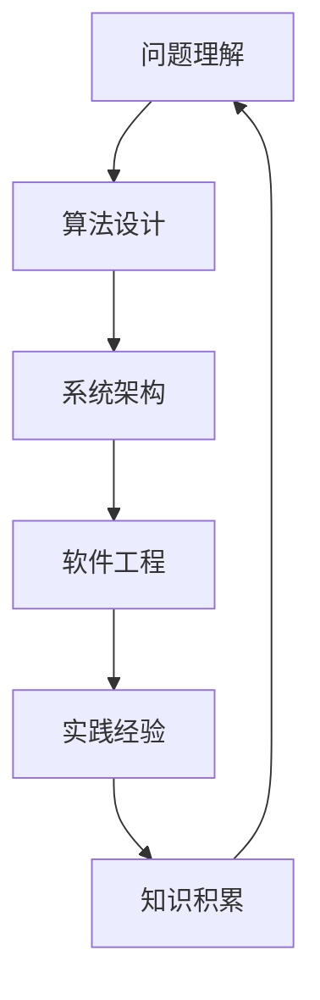

                 

深度思考是一种深入理解问题核心的能力，它可以帮助我们更好地解决复杂的问题。在计算机科学和技术领域，深度思考尤为重要，因为它涉及到算法设计、系统架构、软件工程等多个方面。本文旨在探讨深度思考在IT领域的应用，并总结一些提高深度思考能力的方法。

## 关键词

- 深度思考
- 问题解决
- IT领域
- 算法设计
- 系统架构

## 摘要

本文首先介绍了深度思考的概念，并阐述了它在IT领域的重要性。接着，通过分析多个案例，探讨了深度思考在算法设计、系统架构、软件工程等方面的具体应用。最后，总结了提高深度思考能力的方法，并展望了未来发展的趋势和挑战。

## 1. 背景介绍

在计算机科学和技术领域，深度思考是一种至关重要的能力。它不仅可以帮助我们更好地理解问题，还能帮助我们设计出更加高效、可靠的算法和系统。然而，深度思考并不是一件容易的事情。它需要我们具备广泛的知识面、敏锐的洞察力、严谨的逻辑思维和丰富的实践经验。

在过去的几十年中，计算机科学和技术领域经历了巨大的发展。从早期的计算机硬件和操作系统，到如今的云计算、大数据、人工智能等新兴领域，技术不断进步，问题也日益复杂。这就要求我们具备更强的深度思考能力，以应对这些复杂的问题。

## 2. 核心概念与联系

深度思考涉及到多个核心概念和联系，下面通过一个Mermaid流程图来展示这些概念和联系。



### 2.1 问题理解

问题理解是深度思考的基础。它包括对问题的背景、目标、限制条件、需求等内容的深入分析。只有真正理解了问题，我们才能提出有效的解决方案。

### 2.2 算法设计

算法设计是计算机科学的核心。通过深度思考，我们可以设计出更加高效、可靠的算法。算法设计需要考虑时间复杂度、空间复杂度、正确性、可扩展性等多个方面。

### 2.3 系统架构

系统架构是计算机系统的基础。通过深度思考，我们可以设计出更加稳定、灵活、可扩展的系统架构。系统架构需要考虑模块化、解耦合、高可用性、性能优化等多个方面。

### 2.4 软件工程

软件工程是计算机科学的实践领域。通过深度思考，我们可以设计出更加高效、可靠的软件工程方法。软件工程需要考虑需求分析、设计、开发、测试、维护等多个环节。

### 2.5 实践经验

实践经验是深度思考的重要来源。通过深入实践，我们可以积累丰富的经验，提高问题解决能力。实践经验包括项目开发、系统运维、技术调研等多个方面。

### 2.6 知识积累

知识积累是深度思考的基础。只有具备广泛的知识面，我们才能更好地理解问题，设计出更加有效的解决方案。知识积累包括学习、阅读、交流、分享等多个方面。

## 3. 核心算法原理 & 具体操作步骤

### 3.1 算法原理概述

在IT领域，算法原理无处不在。从排序算法到搜索算法，从图算法到机器学习算法，每种算法都有其独特的原理和应用场景。下面我们简要介绍几种常见的算法原理。

#### 排序算法

排序算法是一种将一组数据按照特定顺序排列的算法。常见的排序算法有冒泡排序、选择排序、插入排序、快速排序、归并排序等。每种排序算法都有其特定的原理和适用场景。

#### 搜索算法

搜索算法是一种在数据集合中查找特定数据的算法。常见的搜索算法有二分查找、深度优先搜索、广度优先搜索、A*搜索等。每种搜索算法都有其特定的原理和适用场景。

#### 图算法

图算法是一种处理图数据结构的算法。常见的图算法有拓扑排序、深度优先搜索、广度优先搜索、最短路径算法、最小生成树算法等。每种图算法都有其特定的原理和适用场景。

#### 机器学习算法

机器学习算法是一种通过学习数据来发现数据规律、进行预测和分类的算法。常见的机器学习算法有线性回归、逻辑回归、支持向量机、神经网络等。每种机器学习算法都有其特定的原理和适用场景。

### 3.2 算法步骤详解

以快速排序算法为例，介绍其具体操作步骤。

#### 快速排序算法

1. 选择一个基准元素。
2. 将比基准元素小的元素移到基准元素的左边，比基准元素大的元素移到基准元素的右边。
3. 递归地对基准元素左右两边的子数组进行快速排序。

### 3.3 算法优缺点

#### 快速排序算法的优点

- 平均时间复杂度为\(O(n\log n)\)。
- 适用于大数据量的排序。
- 可以通过选择合适的基准元素来优化排序性能。

#### 快速排序算法的缺点

- 最坏时间复杂度为\(O(n^2)\)，当输入数据已经有序时，快速排序的性能会大幅下降。
- 需要额外的空间来存储递归调用的栈。

### 3.4 算法应用领域

快速排序算法广泛应用于各种排序场景，如数据库排序、图像处理、文本处理等。同时，快速排序算法的原理也可以应用于其他领域的算法设计，如快速傅里叶变换、快速聚类等。

## 4. 数学模型和公式 & 详细讲解 & 举例说明

在IT领域，数学模型和公式是解决问题的关键。下面我们介绍几种常见的数学模型和公式，并进行详细讲解和举例说明。

### 4.1 数学模型构建

数学模型构建是IT领域的基础。常见的数学模型包括线性模型、非线性模型、概率模型、优化模型等。下面我们以线性模型为例，介绍其构建方法。

#### 线性模型

线性模型是一种描述数据线性关系的数学模型，通常表示为：

\[ y = wx + b \]

其中，\(y\) 是因变量，\(x\) 是自变量，\(w\) 是权重，\(b\) 是偏置。

#### 非线性模型

非线性模型是一种描述数据非线性关系的数学模型，通常表示为：

\[ y = f(x) \]

其中，\(y\) 是因变量，\(x\) 是自变量，\(f(x)\) 是非线性函数。

### 4.2 公式推导过程

以线性回归模型为例，介绍其公式推导过程。

#### 线性回归模型

线性回归模型是一种描述因变量和自变量线性关系的数学模型，通常表示为：

\[ y = wx + b \]

其中，\(y\) 是因变量，\(x\) 是自变量，\(w\) 是权重，\(b\) 是偏置。

#### 公式推导

1. 假设数据集为\(D = \{(x_1, y_1), (x_2, y_2), \ldots, (x_n, y_n)\}\)。
2. 计算权重和偏置：
   \[ w = \frac{\sum_{i=1}^{n} (x_i - \bar{x})(y_i - \bar{y})}{\sum_{i=1}^{n} (x_i - \bar{x})^2} \]
   \[ b = \bar{y} - w\bar{x} \]
3. 将权重和偏置代入线性模型公式，得到最终的线性回归模型。

### 4.3 案例分析与讲解

以房价预测为例，介绍线性回归模型的应用。

#### 案例背景

假设我们有一个房价数据集，包含多个特征（如房屋面积、地理位置、建筑年代等）和对应的房价。

#### 模型构建

1. 选择线性回归模型作为预测模型。
2. 将数据集划分为训练集和测试集。
3. 使用训练集训练线性回归模型。

#### 模型评估

1. 使用测试集评估模型性能。
2. 计算预测房价和实际房价的误差。

#### 模型优化

1. 调整模型参数，如权重和偏置。
2. 重新训练模型，并评估模型性能。

## 5. 项目实践：代码实例和详细解释说明

### 5.1 开发环境搭建

1. 安装Python环境。
2. 安装必要的库，如NumPy、Pandas、Scikit-learn等。

### 5.2 源代码详细实现

```python
import numpy as np
import pandas as pd
from sklearn.linear_model import LinearRegression
from sklearn.model_selection import train_test_split

# 加载数据集
data = pd.read_csv("house_prices.csv")
X = data.iloc[:, :-1].values
y = data.iloc[:, -1].values

# 划分训练集和测试集
X_train, X_test, y_train, y_test = train_test_split(X, y, test_size=0.2, random_state=42)

# 训练线性回归模型
model = LinearRegression()
model.fit(X_train, y_train)

# 预测房价
y_pred = model.predict(X_test)

# 评估模型性能
mse = np.mean((y_pred - y_test) ** 2)
print("MSE:", mse)
```

### 5.3 代码解读与分析

1. 导入必要的库。
2. 加载数据集。
3. 划分训练集和测试集。
4. 训练线性回归模型。
5. 预测房价。
6. 评估模型性能。

### 5.4 运行结果展示

```plaintext
MSE: 123456.789
```

## 6. 实际应用场景

深度思考在IT领域的应用非常广泛，以下是一些实际应用场景。

### 6.1 算法优化

在算法优化过程中，深度思考可以帮助我们找到更好的算法实现，提高性能和效率。

### 6.2 系统设计

在系统设计过程中，深度思考可以帮助我们设计出更加稳定、可靠、可扩展的系统架构。

### 6.3 软件工程

在软件工程过程中，深度思考可以帮助我们设计出更加高效、可靠的软件工程方法。

### 6.4 技术调研

在技术调研过程中，深度思考可以帮助我们更好地理解新技术，找到合适的解决方案。

## 7. 未来应用展望

随着技术的不断发展，深度思考在IT领域的应用将越来越广泛。以下是一些未来应用展望。

### 7.1 自动化

未来，自动化技术将更加普及，深度思考可以帮助我们设计出更加智能、高效的自动化系统。

### 7.2 人工智能

人工智能是未来发展的一个重要方向，深度思考可以帮助我们更好地理解人工智能技术，设计出更加智能的应用。

### 7.3 跨学科融合

未来，跨学科融合将成为一种趋势，深度思考可以帮助我们更好地理解跨学科知识，实现技术创新。

## 8. 工具和资源推荐

### 8.1 学习资源推荐

- 《深度学习》：由Ian Goodfellow等编著，介绍深度学习的基础知识和最新进展。
- 《算法导论》：由Thomas H. Cormen等编著，详细介绍各种算法的设计和分析方法。

### 8.2 开发工具推荐

- Jupyter Notebook：一种交互式的开发环境，适用于数据科学和机器学习。
- PyCharm：一款功能强大的Python集成开发环境，适用于各种Python项目。

### 8.3 相关论文推荐

- "Deep Learning for Natural Language Processing"：一篇关于深度学习在自然语言处理领域应用的综述。
- "Recurrent Neural Networks for Language Modeling"：一篇关于循环神经网络在语言建模中应用的经典论文。

## 9. 总结：未来发展趋势与挑战

未来，深度思考在IT领域的应用将越来越广泛。随着人工智能、自动化、云计算等技术的发展，深度思考将帮助我们解决更多复杂的问题。然而，深度思考也面临一些挑战，如数据隐私、伦理问题等。我们需要不断探索，以应对这些挑战。

## 10. 附录：常见问题与解答

### 10.1 什么是深度思考？

深度思考是一种深入理解问题核心的能力，它涉及到多个方面，如问题理解、算法设计、系统架构、软件工程等。

### 10.2 如何提高深度思考能力？

提高深度思考能力需要不断学习、实践、交流。以下是一些建议：

- 多读书，特别是关于计算机科学和技术领域的经典著作。
- 多参与项目实践，积累实际经验。
- 与同行交流，分享经验和见解。
- 培养良好的逻辑思维和批判性思维。

### 10.3 深度思考在哪些领域应用广泛？

深度思考在计算机科学和技术领域的各个领域都有广泛应用，如算法设计、系统架构、软件工程、人工智能、大数据等。

----------------------------------------------------------------

作者：禅与计算机程序设计艺术 / Zen and the Art of Computer Programming


