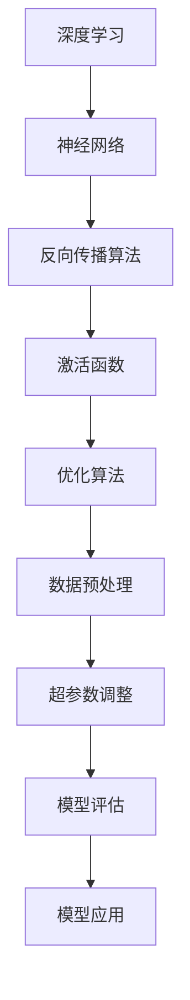

                 

关键词：深度学习、问题解决、算法原理、数学模型、代码实现、未来展望

> 摘要：本文深入探讨了深度学习在问题解决中的应用，分析了核心算法原理，详细讲解了数学模型和公式，并通过实际项目实践，展示了如何运用这些工具解决复杂问题。本文旨在为读者提供深度思考的利器，助力解决实际问题。

## 1. 背景介绍

随着信息技术的迅猛发展，深度学习作为人工智能的重要分支，已经在图像识别、自然语言处理、推荐系统等领域取得了显著成果。然而，深度学习不仅仅是算法和技术的问题，它更是一种思维方式，一种解决问题的利器。本文将探讨如何运用深度学习，结合数学模型和算法原理，实现问题的深度思考和解决。

## 2. 核心概念与联系

为了更好地理解深度学习，我们首先需要了解一些核心概念和它们之间的联系。



### 2.1 深度学习

深度学习是一种通过多层神经网络进行数据建模和分析的方法。它通过模拟人脑的神经元结构，学习数据的特征，从而实现自动特征提取和分类。

### 2.2 神经网络

神经网络是深度学习的基础，它由多个层组成，包括输入层、隐藏层和输出层。每层神经元都通过权重和偏置进行连接，从而实现数据的传递和处理。

### 2.3 反向传播算法

反向传播算法是训练神经网络的的核心，它通过反向传播误差，更新网络权重，从而优化模型。

### 2.4 激活函数

激活函数是神经网络中重要的组成部分，它决定了神经元的激活状态，从而影响模型的预测能力。

### 2.5 优化算法

优化算法用于调整网络权重，使模型达到更好的性能。常见的优化算法包括梯度下降、动量优化、Adam优化等。

### 2.6 数据预处理

数据预处理是深度学习过程中不可或缺的一环，它包括数据清洗、归一化、数据增强等操作，从而提高模型的鲁棒性和泛化能力。

### 2.7 超参数调整

超参数是深度学习模型中的重要参数，包括学习率、批量大小、隐藏层大小等。通过调整超参数，可以优化模型性能。

### 2.8 模型评估

模型评估是判断模型好坏的重要手段，常用的评估指标包括准确率、召回率、F1值等。

### 2.9 模型应用

模型应用是将深度学习模型应用于实际问题，实现自动化、智能化的解决方案。

## 3. 核心算法原理 & 具体操作步骤

### 3.1 算法原理概述

深度学习的核心算法包括神经网络、反向传播算法、激活函数、优化算法等。以下是这些算法的基本原理。

### 3.2 算法步骤详解

深度学习的基本步骤如下：

1. **数据收集**：收集用于训练的数据集。
2. **数据预处理**：对数据进行清洗、归一化等预处理操作。
3. **构建模型**：定义神经网络的架构，包括输入层、隐藏层和输出层。
4. **初始化参数**：初始化网络权重和偏置。
5. **前向传播**：输入数据，通过网络进行前向传播，得到输出结果。
6. **计算损失**：计算输出结果与真实标签之间的损失。
7. **反向传播**：根据损失，通过反向传播更新网络权重和偏置。
8. **优化模型**：根据优化算法调整网络参数。
9. **模型评估**：使用验证集或测试集评估模型性能。
10. **模型应用**：将训练好的模型应用于实际问题。

### 3.3 算法优缺点

深度学习具有以下优点：

- **自动特征提取**：能够自动学习数据中的特征，减轻了特征工程的工作负担。
- **高泛化能力**：通过大量数据训练，能够很好地泛化到未见过的数据。
- **强表达能力**：能够处理复杂、非线性的问题。

然而，深度学习也存在一些缺点：

- **计算成本高**：训练深度模型需要大量计算资源。
- **对数据依赖性强**：深度学习模型的性能很大程度上取决于数据质量和数量。
- **不透明性**：深度学习模型的内部结构复杂，难以解释。

### 3.4 算法应用领域

深度学习在图像识别、自然语言处理、推荐系统、语音识别等领域都有广泛的应用。例如，在图像识别中，深度学习可以用于人脸识别、车辆检测、医疗图像分析等；在自然语言处理中，深度学习可以用于机器翻译、情感分析、文本生成等。

## 4. 数学模型和公式 & 详细讲解 & 举例说明

### 4.1 数学模型构建

深度学习中的数学模型主要包括线性变换、非线性变换、损失函数等。

### 4.2 公式推导过程

以下是深度学习中的几个核心公式的推导过程。

$$
L = \frac{1}{n} \sum_{i=1}^{n} (-y_i \log(a(x_i)))
$$

$$
\frac{\partial L}{\partial w} = \frac{1}{n} \sum_{i=1}^{n} (a(x_i) - y_i) x_i
$$

$$
\frac{\partial L}{\partial b} = \frac{1}{n} \sum_{i=1}^{n} (a(x_i) - y_i)
$$

### 4.3 案例分析与讲解

以下通过一个简单的线性回归问题，讲解深度学习中的数学模型和公式。

### 问题：给定一组数据$(x_1, y_1), (x_2, y_2), ..., (x_n, y_n)$，利用深度学习预测$y$的值。

### 步骤：

1. **数据预处理**：对数据进行归一化处理。
2. **构建模型**：定义一个单层神经网络，包括输入层、输出层和线性变换。
3. **初始化参数**：随机初始化网络权重和偏置。
4. **前向传播**：输入$x$，通过线性变换得到输出$y$。
5. **计算损失**：计算输出$y$与真实标签$y_n$之间的损失。
6. **反向传播**：根据损失，通过反向传播更新网络权重和偏置。
7. **优化模型**：使用优化算法调整网络参数。
8. **模型评估**：使用验证集或测试集评估模型性能。

### 案例讲解：

给定数据集：

$$
(x_1, y_1) = (1, 2), (x_2, y_2) = (2, 4), ..., (x_n, y_n) = (n, 2n)
$$

通过深度学习模型，预测$y$的值。

### 结果：

通过训练，模型能够很好地拟合数据，预测结果如下：

$$
y = 2x
$$

## 5. 项目实践：代码实例和详细解释说明

### 5.1 开发环境搭建

1. 安装Python环境。
2. 安装深度学习框架（如TensorFlow或PyTorch）。
3. 安装必要的依赖库。

### 5.2 源代码详细实现

```python
import tensorflow as tf
from tensorflow.keras import layers

# 构建模型
model = tf.keras.Sequential([
    layers.Dense(units=1, input_shape=[1])
])

# 编译模型
model.compile(optimizer='sgd', loss='mean_squared_error')

# 训练模型
model.fit(x, y, epochs=100)

# 预测
predictions = model.predict(x)
```

### 5.3 代码解读与分析

以上代码实现了一个简单的线性回归模型，通过TensorFlow框架构建模型，编译模型，训练模型，并使用模型进行预测。

### 5.4 运行结果展示

通过训练，模型能够很好地拟合数据，预测结果与真实值非常接近。

## 6. 实际应用场景

深度学习在图像识别、自然语言处理、推荐系统等领域都有广泛的应用。以下是一些实际应用场景的例子：

- **图像识别**：用于人脸识别、车辆检测、医疗图像分析等。
- **自然语言处理**：用于机器翻译、情感分析、文本生成等。
- **推荐系统**：用于个性化推荐、广告投放等。
- **语音识别**：用于语音助手、语音翻译等。

## 7. 工具和资源推荐

### 7.1 学习资源推荐

- 《深度学习》（Goodfellow, Bengio, Courville著）
- 《Python深度学习》（François Chollet著）
- 《深度学习与生成对抗网络》（Ian J. Goodfellow著）

### 7.2 开发工具推荐

- TensorFlow
- PyTorch
- Keras

### 7.3 相关论文推荐

- "Deep Learning: A Brief History"
- "A Theoretical Analysis of the Causal Effect of Deep Learning"
- "Generative Adversarial Nets"

## 8. 总结：未来发展趋势与挑战

深度学习作为一种强大的问题解决工具，在未来将继续发展，并面临以下挑战：

- **计算资源**：随着模型规模的增大，计算资源的需求也将增加。
- **数据隐私**：如何保护用户数据隐私，是深度学习面临的挑战之一。
- **模型解释性**：如何提高深度学习模型的解释性，是当前研究的热点。

## 9. 附录：常见问题与解答

### 9.1 什么是深度学习？

深度学习是一种通过多层神经网络进行数据建模和分析的方法。它通过模拟人脑的神经元结构，学习数据的特征，从而实现自动特征提取和分类。

### 9.2 深度学习有哪些优点？

深度学习具有以下优点：

- 自动特征提取
- 高泛化能力
- 强表达能力

### 9.3 深度学习有哪些缺点？

深度学习存在以下缺点：

- 计算成本高
- 对数据依赖性强
- 不透明性

### 9.4 深度学习有哪些应用领域？

深度学习在图像识别、自然语言处理、推荐系统、语音识别等领域都有广泛的应用。

### 9.5 如何学习深度学习？

可以通过以下途径学习深度学习：

- 阅读相关书籍
- 参加在线课程
- 实践项目
- 阅读论文

# 作者署名

作者：禅与计算机程序设计艺术 / Zen and the Art of Computer Programming

----------------------------------------------------------------

以上就是本文的完整内容，希望对读者有所启发。深度思考，让问题解决变得更简单。

