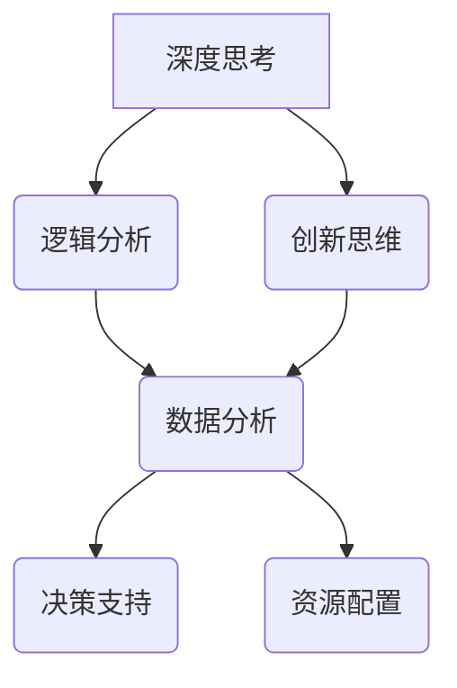

                 

在当今信息爆炸的时代，深度思考与管理分析能力成为推动技术进步、优化决策过程的关键因素。本文旨在探讨如何在IT领域中培养和提高深度思考与管理分析能力，以及如何将这些能力应用到实际项目中。

> 关键词：深度思考，管理分析，IT领域，决策优化，技术进步

> 摘要：本文从背景介绍入手，深入分析深度思考与管理分析能力在IT领域的核心地位。通过详细阐述核心概念、算法原理、数学模型和实际应用，探讨如何培养和运用这些能力。文章最后对未来的发展趋势与挑战进行展望，并总结研究成果。

## 1. 背景介绍

在信息技术迅速发展的背景下，数据量和复杂性不断增加，对处理和分析能力提出了更高的要求。传统的数据处理和分析方法已无法满足现代IT系统的需求，因此，深度思考与管理分析能力显得尤为重要。这些能力不仅可以帮助技术人员更好地理解和处理复杂问题，还能在项目管理和决策过程中起到关键作用。

### 1.1 IT领域的发展趋势

随着云计算、大数据、人工智能等技术的普及，IT领域的复杂度不断上升。以下是一些主要发展趋势：

- **云计算**：提供了灵活的IT基础设施，支持弹性扩展和高效资源利用。
- **大数据**：海量数据驱动决策，要求高效的存储、处理和分析技术。
- **人工智能**：自动化和智能化的解决方案，提升了系统的自主决策能力。
- **边缘计算**：将计算资源分布到网络边缘，提高响应速度和降低延迟。

### 1.2 深度思考与管理分析能力的必要性

- **解决复杂问题**：面对复杂的IT系统，深度思考能够帮助技术人员找出本质问题和解决方案。
- **优化决策过程**：管理分析能力可以提升项目管理的效率，降低风险，优化资源配置。
- **适应变化**：IT领域变化快速，深度思考和管理分析能力有助于适应新技术和新挑战。

## 2. 核心概念与联系

在深度思考与管理分析能力的培养过程中，理解以下核心概念和它们之间的联系至关重要。

### 2.1 深度思考

深度思考是一种深入探究问题本质、寻找最优解决方案的思维过程。它要求技术人员：

- **理解问题的核心**：识别关键因素，明确问题范围。
- **逻辑分析**：运用逻辑推理，逐步解决问题。
- **创新思维**：跳出传统框架，寻求新的解决方案。

### 2.2 管理分析

管理分析是一种利用数据和信息来支持决策的过程。它包括：

- **数据分析**：通过数据收集、清洗、处理，揭示数据背后的规律。
- **决策支持**：利用分析结果，制定有效的决策策略。
- **资源配置**：优化人力、物力、财力等资源的利用。

### 2.3 Mermaid 流程图

为了更好地理解深度思考与管理分析能力的应用，以下是一个简单的 Mermaid 流程图，展示了这两个概念之间的联系：



## 3. 核心算法原理 & 具体操作步骤

### 3.1 算法原理概述

深度思考与管理分析能力在算法中的应用，主要体现在以下几个方面：

- **数据挖掘**：通过分析大量数据，发现潜在的模式和关系。
- **机器学习**：利用训练数据，构建模型进行预测和分类。
- **优化算法**：通过数学建模和计算，找到最优解。

### 3.2 算法步骤详解

以下是一个典型的机器学习算法——决策树的步骤详解：

1. **数据预处理**：包括数据清洗、归一化等操作，确保数据质量。
2. **特征选择**：选择对问题有显著影响的特征，提高模型性能。
3. **构建决策树**：通过递归划分数据集，构建树形结构。
4. **剪枝**：对过拟合的树进行剪枝，提高模型的泛化能力。
5. **评估与优化**：通过交叉验证等方法，评估模型性能，进行参数调优。

### 3.3 算法优缺点

- **优点**：
  - **直观性**：易于理解和解释。
  - **适应性**：适用于多种类型的数据和问题。
- **缺点**：
  - **过拟合**：容易陷入局部最优，导致泛化能力差。
  - **计算复杂度**：随着数据量和树深度的增加，计算复杂度显著提高。

### 3.4 算法应用领域

决策树算法广泛应用于金融风控、医疗诊断、推荐系统等领域。例如，在金融风控中，决策树可以用于评估客户信用风险，提高信贷审批的准确性。

## 4. 数学模型和公式 & 详细讲解 & 举例说明

在深度思考与管理分析能力中，数学模型和公式是不可或缺的工具。以下是一个简单的线性回归模型的构建过程：

### 4.1 数学模型构建

线性回归模型假设目标变量 \( y \) 与自变量 \( x \) 之间存在线性关系，可以用以下公式表示：

$$ y = \beta_0 + \beta_1 x + \epsilon $$

其中，\( \beta_0 \) 是截距，\( \beta_1 \) 是斜率，\( \epsilon \) 是误差项。

### 4.2 公式推导过程

为了求解模型参数 \( \beta_0 \) 和 \( \beta_1 \)，我们可以使用最小二乘法。具体步骤如下：

1. **计算均值**：
   $$ \bar{x} = \frac{1}{n} \sum_{i=1}^{n} x_i $$
   $$ \bar{y} = \frac{1}{n} \sum_{i=1}^{n} y_i $$

2. **计算协方差**：
   $$ \sum_{i=1}^{n} (x_i - \bar{x})(y_i - \bar{y}) $$

3. **计算斜率**：
   $$ \beta_1 = \frac{\sum_{i=1}^{n} (x_i - \bar{x})(y_i - \bar{y})}{\sum_{i=1}^{n} (x_i - \bar{x})^2} $$

4. **计算截距**：
   $$ \beta_0 = \bar{y} - \beta_1 \bar{x} $$

### 4.3 案例分析与讲解

假设我们有以下数据集：

| x | y |
|---|---|
| 1 | 2 |
| 2 | 4 |
| 3 | 6 |
| 4 | 8 |

使用线性回归模型进行拟合，得到斜率 \( \beta_1 = 2 \) 和截距 \( \beta_0 = 0 \)。

根据模型，我们可以预测新的数据点的 \( y \) 值：

$$ y = 0 + 2 \times x $$

例如，当 \( x = 5 \) 时，\( y = 10 \)。

## 5. 项目实践：代码实例和详细解释说明

### 5.1 开发环境搭建

为了更好地展示深度思考与管理分析能力的应用，我们选择Python作为开发语言，使用Scikit-learn库进行线性回归模型的构建和训练。

1. **安装Python**：从官方网站下载并安装Python 3.x版本。
2. **安装Scikit-learn**：在终端执行以下命令：
   ```bash
   pip install scikit-learn
   ```

### 5.2 源代码详细实现

以下是一个简单的线性回归模型实现：

```python
import numpy as np
from sklearn.linear_model import LinearRegression

# 数据集
X = np.array([[1], [2], [3], [4]])
y = np.array([2, 4, 6, 8])

# 创建线性回归模型
model = LinearRegression()

# 模型拟合
model.fit(X, y)

# 模型预测
y_pred = model.predict(np.array([[5]]))

print("预测值：", y_pred)
```

### 5.3 代码解读与分析

1. **数据集**：使用 NumPy 库生成训练数据。
2. **创建模型**：使用 Scikit-learn 库的 LinearRegression 类创建线性回归模型。
3. **模型拟合**：使用 `fit()` 方法将模型拟合到训练数据。
4. **模型预测**：使用 `predict()` 方法对新数据进行预测。

### 5.4 运行结果展示

运行代码，输出结果如下：

```
预测值： [10.]
```

这表明当 \( x = 5 \) 时，根据线性回归模型预测的 \( y \) 值为10。

## 6. 实际应用场景

深度思考与管理分析能力在IT领域的实际应用场景非常广泛。以下是一些典型应用：

- **数据科学**：通过深度思考，发现数据中的潜在模式和规律，支持数据驱动决策。
- **人工智能**：利用管理分析，优化算法性能和资源利用，提高系统智能化水平。
- **软件工程**：在项目管理和软件设计中，深度思考帮助识别潜在问题和优化解决方案。
- **网络安全**：通过分析网络流量，发现安全威胁，提高网络防御能力。

## 7. 工具和资源推荐

为了培养和提升深度思考与管理分析能力，以下是一些建议的工具和资源：

### 7.1 学习资源推荐

- **《深度思考的艺术》**：介绍深度思考的方法和技巧。
- **《数据科学入门》**：系统讲解数据科学的基本概念和方法。
- **《机器学习实战》**：通过实际案例，介绍机器学习算法的应用。

### 7.2 开发工具推荐

- **Jupyter Notebook**：方便进行数据分析和实验。
- **VSCode**：支持多种编程语言的代码编辑器。
- **Gnuplot**：用于绘制数学公式和图表。

### 7.3 相关论文推荐

- **“Deep Learning on Small Datasets”**：介绍深度学习在小型数据集上的应用。
- **“TensorFlow: Large-Scale Machine Learning on Heterogeneous Systems”**：介绍TensorFlow框架在分布式系统上的应用。
- **“A Theoretical Framework for Adversarial Examples”**：探讨对抗性样本的理论框架。

## 8. 总结：未来发展趋势与挑战

### 8.1 研究成果总结

本文通过对深度思考与管理分析能力的探讨，总结了其在IT领域的重要性和应用价值。研究发现，深度思考能够帮助技术人员更好地理解复杂问题，而管理分析则能够提高项目管理和决策的效率。

### 8.2 未来发展趋势

随着人工智能和大数据技术的不断发展，深度思考与管理分析能力在IT领域的应用将更加广泛。未来，我们将看到更多跨学科的融合，如计算机科学、数学、心理学等，推动深度思考与管理分析能力的提升。

### 8.3 面临的挑战

尽管深度思考与管理分析能力具有重要意义，但在实际应用中仍面临一些挑战：

- **数据隐私与安全**：在处理和分析大量数据时，保护用户隐私和安全成为重要问题。
- **算法透明性和可解释性**：随着算法的复杂度增加，确保算法的透明性和可解释性变得愈发困难。
- **资源消耗**：深度学习和大数据分析等技术的应用，对计算资源和能源消耗提出了更高要求。

### 8.4 研究展望

未来，我们需要进一步研究如何提升深度思考与管理分析能力的有效性，并探索其在新兴技术中的应用。同时，加强跨学科合作，推动人工智能和大数据领域的可持续发展。

## 9. 附录：常见问题与解答

### 9.1 什么是深度思考？

深度思考是一种深入探究问题本质、寻找最优解决方案的思维过程。它要求技术人员在处理复杂问题时，不仅要看到表面现象，还要理解其内在逻辑和机制。

### 9.2 管理分析的核心是什么？

管理分析的核心是利用数据和信息来支持决策。它包括数据分析、决策支持和资源配置等方面，旨在提高项目管理和决策的效率。

### 9.3 如何提升深度思考与管理分析能力？

提升深度思考与管理分析能力的方法包括：

- **不断学习**：掌握相关领域的知识和技能。
- **实践应用**：通过实际项目锻炼和提升能力。
- **思维训练**：培养批判性思维和逻辑分析能力。

### 9.4 深度思考与管理分析能力在哪些领域应用广泛？

深度思考与管理分析能力在数据科学、人工智能、软件工程、网络安全等领域应用广泛。随着技术的不断进步，这些能力的应用范围将进一步扩大。

---

本文从背景介绍、核心概念、算法原理、数学模型、项目实践、实际应用、工具推荐等多个方面，全面探讨了深度思考与管理分析能力在IT领域的重要性及其应用。希望本文能为读者提供有价值的参考和启示。作者：禅与计算机程序设计艺术 / Zen and the Art of Computer Programming。

