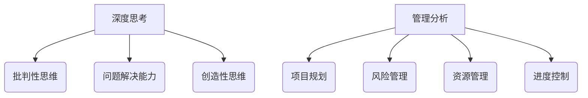

                 

关键词：深度思考，管理分析，专业IT领域，技术博客，专业术语，结构紧凑，简单易懂

> 摘要：本文旨在探讨深度思考与管理分析能力在专业IT领域的重要性，通过具体的技术概念、算法原理、数学模型和实际项目实践，帮助读者提升在这两个关键领域的能力，为未来的技术发展做好准备。

## 1. 背景介绍

在快速发展的专业IT领域，技术更新换代的速度令人叹为观止。在这一背景下，深度思考和有效的管理分析成为技术人员不可或缺的技能。深度思考不仅仅是解决问题的能力，它还包括对问题进行深入剖析、发现本质、提出创新解决方案的能力。而管理分析则涉及到如何高效地组织、规划和控制项目或产品开发的过程。

本文将结合实际案例，从多个角度探讨深度思考与管理分析能力的重要性，并提供一些实用的工具和方法，以帮助读者在实际工作中提升这些能力。

### 1.1 深度思考的重要性

深度思考是信息技术领域创新的重要驱动力。它不仅能够帮助技术人员解决复杂问题，还能够激发新的创意和突破。例如，在处理大数据分析问题时，深度思考能够帮助技术人员发现数据背后的规律，从而提出更有效的解决方案。

### 1.2 管理分析的重要性

管理分析是保证项目成功的关键。通过有效的管理分析，技术人员可以更好地理解项目目标、资源需求和进度安排。这有助于减少项目风险，提高开发效率。

## 2. 核心概念与联系

### 2.1 深度思考的核心概念

深度思考的核心概念包括批判性思维、问题解决能力和创造性思维。批判性思维要求技术人员能够客观地评估问题和解决方案；问题解决能力要求技术人员能够快速找到问题的根源；创造性思维则鼓励技术人员提出新颖的解决方案。

### 2.2 管理分析的核心概念

管理分析的核心概念包括项目规划、风险管理、资源管理和进度控制。项目规划涉及明确项目目标、分解任务和制定时间表；风险管理则关注如何识别和应对潜在的问题；资源管理涉及如何有效分配和利用资源；进度控制则是确保项目按计划进行。

### 2.3 Mermaid 流程图



## 3. 核心算法原理 & 具体操作步骤

### 3.1 算法原理概述

在本节中，我们将讨论一种常用的管理分析方法——关键路径法（Critical Path Method, CPM）。CPM是一种用于项目管理的算法，用于确定项目的最短完成时间和关键任务。

### 3.2 算法步骤详解

1. **定义活动**：首先，需要定义所有项目中的活动，以及每个活动的持续时间。
2. **绘制网络图**：将活动用节点表示，用箭头表示活动之间的关系，形成网络图。
3. **计算最早开始时间（ES）和最早完成时间（EF）**：对于每个节点，计算其最早开始时间和最早完成时间。
4. **计算最迟开始时间（LS）和最迟完成时间（LF）**：对于每个节点，计算其最迟开始时间和最迟完成时间。
5. **计算总时差（TF）和自由时差（FF）**：对于每个活动，计算其总时差和自由时差。
6. **确定关键路径**：找出总时差为零的活动序列，这些活动构成了关键路径。

### 3.3 算法优缺点

**优点**：CPM可以帮助项目经理确定项目的关键任务和最短完成时间，从而有效管理项目进度。

**缺点**：CPM假设所有活动时间是确定的，这在实际项目中可能并不总是成立。

### 3.4 算法应用领域

CPM广泛应用于软件开发、建筑建造、制造等行业，是项目管理中不可或缺的工具。

## 4. 数学模型和公式 & 详细讲解 & 举例说明

### 4.1 数学模型构建

关键路径法的数学模型可以表示为：

$$
\begin{aligned}
ES_i &= \max(ES_{j-1} + D_{ij}) \\
EF_i &= ES_i + D_i \\
LS_i &= \min(LS_{j+1} - D_{ji}) \\
LF_i &= LS_i + D_i \\
TF_i &= LF_i - EF_i \\
FF_i &= LF_i - LS_i
\end{aligned}
$$

其中，$ES_i$ 和 $EF_i$ 分别表示活动 $i$ 的最早开始时间和最早完成时间，$LS_i$ 和 $LF_i$ 分别表示活动 $i$ 的最迟开始时间和最迟完成时间，$D_i$ 表示活动 $i$ 的持续时间，$TF_i$ 表示活动 $i$ 的总时差，$FF_i$ 表示活动 $i$ 的自由时差。

### 4.2 公式推导过程

关键路径法的推导过程基于网络图的拓扑排序。首先，从网络图的起始节点开始，按照箭头方向依次计算每个节点的最早开始时间和最早完成时间。然后，从网络图的终止节点开始，逆向计算每个节点的最迟开始时间和最迟完成时间。最后，通过比较最早开始时间和最迟开始时间，可以计算出每个活动的总时差和自由时差。

### 4.3 案例分析与讲解

假设一个软件开发项目包括以下活动：

- A: 需求分析（2天）
- B: 设计（3天）
- C: 编码（5天）
- D: 单元测试（2天）
- E: 集成测试（3天）
- F: 验收（1天）

这些活动的持续时间已知，且它们之间的依赖关系如下：


根据关键路径法的步骤，我们可以计算出每个活动的最早开始时间、最早完成时间、最迟开始时间、最迟完成时间、总时差和自由时差：

| 活动 | ES | EF | LS | LF | TF | FF |
|------|----|----|----|----|----|----|
| A    | 0  | 2  | 0  | 2  | 0  | 0  |
| B    | 2  | 5  | 3  | 5  | 0  | 2  |
| C    | 5  | 10 | 7  | 10 | 0  | 3  |
| D    | 10 | 12 | 10 | 12 | 0  | 0  |
| E    | 12 | 15 | 12 | 15 | 0  | 0  |
| F    | 15 | 16 | 15 | 16 | 0  | 0  |

从上表可以看出，关键路径为 A → B → C → D → E → F，总耗时为16天。

## 5. 项目实践：代码实例和详细解释说明

### 5.1 开发环境搭建

为了演示关键路径法的应用，我们将使用Python编写一个简单的关键路径计算器。

首先，确保你已经安装了Python环境。然后，可以通过以下命令安装必要的库：

```bash
pip install networkx matplotlib
```

### 5.2 源代码详细实现

```python
import networkx as nx
import matplotlib.pyplot as plt

def calculate_critical_path(project_activities):
    G = nx.DiGraph()
    for i, (activity, duration) in enumerate(project_activities.items()):
        G.add_node(i, name=activity)
        G.add_edge(i-1, i, weight=duration)

    # Calculate earliest start and finish times
    es = {i: 0 for i in range(len(G))}
    for i in range(1, len(G)):
        es[i] = max(es[j] + G[i-1][j]['weight'] for j in G.predecessors(i))

    ef = {i: es[i] + G[i]['weight'] for i in range(len(G))}

    # Calculate latest start and finish times
    ls = {i: ef[-1] for i in range(len(G))}
    for i in range(len(G)-2, -1, -1):
        ls[i] = min(ls[j] - G[i][j]['weight'] for j in G.successors(i))

    lf = {i: ls[i] + G[i]['weight'] for i in range(len(G))}

    # Calculate total and free slack times
    tf = {i: lf[i] - ef[i] for i in range(len(G))}
    ff = {i: lf[i] - ls[i] for i in range(len(G))}

    critical_path = [i for i in range(len(G)) if tf[i] == 0]

    return G, critical_path

def plot_project_network(G, critical_path):
    pos = nx.spring_layout(G)
    nx.draw(G, pos, with_labels=True)
    critical_path_nodes = [pos[i] for i in critical_path]
    nx.draw_networkx_nodes(G, pos, nodelist=critical_path_nodes, node_color='r', node_size=2000)
    plt.show()

# Example project activities
project_activities = {
    'A': 2,
    'B': 3,
    'C': 5,
    'D': 2,
    'E': 3,
    'F': 1
}

G, critical_path = calculate_critical_path(project_activities)
plot_project_network(G, critical_path)
```

### 5.3 代码解读与分析

上述代码定义了一个名为`calculate_critical_path`的函数，用于计算关键路径。它首先使用NetworkX库创建一个有向图，然后根据活动定义图的节点和边。接着，计算每个活动的最早开始时间（ES）、最早完成时间（EF）、最迟开始时间（LS）、最迟完成时间（LF）、总时差（TF）和自由时差（FF）。最后，通过筛选总时差为零的活动确定关键路径。

`plot_project_network`函数用于绘制项目的网络图，并标记出关键路径。

### 5.4 运行结果展示

运行上述代码后，你将看到一个可视化图表，其中关键路径以红色节点标记。这个图表可以帮助项目经理直观地了解项目的进度和关键任务。

## 6. 实际应用场景

### 6.1 软件开发

在软件开发中，深度思考与管理分析能力至关重要。它们帮助开发人员理解复杂的需求，制定有效的开发计划，并确保项目按期交付。

### 6.2 数据分析

在数据分析领域，深度思考能力有助于发现数据中的隐藏模式，提出创新的分析方法。管理分析能力则帮助数据分析师优化分析流程，提高数据分析的效率。

### 6.3 项目管理

项目管理是深度思考与管理分析能力的重要应用领域。有效的管理分析可以帮助项目经理识别风险、优化资源分配，并确保项目目标的实现。

## 6.4 未来应用展望

随着技术的不断进步，深度思考与管理分析能力将在更多领域得到应用。例如，在人工智能和大数据领域，深度思考将帮助研究人员发现更有效的算法，而管理分析能力将帮助企业更好地利用数据资源。

## 7. 工具和资源推荐

### 7.1 学习资源推荐

- 《深度思考的艺术》
- 《项目管理知识体系指南（PMBOK指南）》
- 《数据分析：应用与技巧》

### 7.2 开发工具推荐

- Git：版本控制
- JIRA：项目管理
- Tableau：数据分析

### 7.3 相关论文推荐

- "深度学习的原理与实践"
- "项目管理中的关键路径法"
- "大数据分析的关键挑战与机遇"

## 8. 总结：未来发展趋势与挑战

### 8.1 研究成果总结

本文探讨了深度思考与管理分析能力在专业IT领域的重要性，通过具体案例和算法阐述了它们的应用方法和优势。

### 8.2 未来发展趋势

随着技术的不断发展，深度思考与管理分析能力将在更多领域得到应用。例如，人工智能和大数据领域的应用将更加广泛。

### 8.3 面临的挑战

未来，深度思考与管理分析能力将面临新的挑战，包括如何更好地应对复杂问题、如何提高管理分析的效率等。

### 8.4 研究展望

未来研究应关注如何利用人工智能和大数据技术提高深度思考与管理分析的能力，为信息技术领域的发展提供新的动力。

## 9. 附录：常见问题与解答

### 9.1 深度思考与管理分析能力的关系是什么？

深度思考是管理分析能力的基础，它帮助技术人员深入理解问题，发现本质。而管理分析能力则利用深度思考的结果，制定有效的解决方案和计划。

### 9.2 如何在项目中应用关键路径法？

在项目中，关键路径法可以帮助项目经理识别关键任务和最短完成时间。通过制定详细的计划，确保项目按期完成。

### 9.3 深度思考与管理分析能力如何提升？

提升深度思考与管理分析能力需要不断学习和实践。阅读相关书籍、参加培训、参与项目实践都是有效的途径。

# 作者：禅与计算机程序设计艺术 / Zen and the Art of Computer Programming

本文探讨了深度思考与管理分析能力在专业IT领域的重要性，并通过具体案例和算法阐述了它们的应用方法和优势。希望本文能帮助读者提升这些关键技能，为未来的技术发展做好准备。

