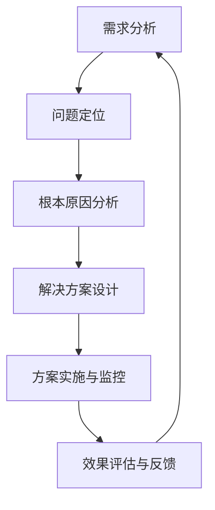

                 

关键词：深度思考、问题解决、管理能力、IT领域、技术博客

> 摘要：本文将探讨在IT领域中，如何通过深度思考提升管理问题和解决能力。文章分为八个部分，包括背景介绍、核心概念与联系、核心算法原理、数学模型和公式、项目实践、实际应用场景、工具和资源推荐以及总结和展望。

## 1. 背景介绍

在信息技术迅猛发展的今天，IT领域的竞争日益激烈。企业不仅需要具备优秀的技术人才，还需要具备强大的管理能力和问题解决能力。随着项目的复杂度和业务需求的多样化，如何有效地管理和解决IT问题成为企业成功的关键。本文旨在通过深入探讨深度思考的方法，提升IT领域中的管理问题和解决能力。

### 1.1 问题解决的现状

当前，许多企业在IT问题解决上面临以下挑战：

1. 缺乏系统性：许多企业在处理IT问题时，往往只关注眼前的解决方案，而忽视了根本问题，导致问题反复出现。
2. 缺乏深度思考：在处理复杂问题时，许多IT人员缺乏深度思考的能力，导致问题无法得到彻底解决。
3. 管理能力不足：企业在IT管理上存在诸多问题，如缺乏有效的流程、资源和人员管理。

### 1.2 深度思考的重要性

深度思考是一种深入分析和解决复杂问题的能力。它能够帮助IT人员：

1. 提高解决问题的效率：通过深度思考，能够快速找到问题的本质，从而制定出有效的解决方案。
2. 提升创新能力：深度思考能够激发IT人员的创新思维，为企业和项目带来更多的价值。
3. 提高管理能力：深度思考能够帮助IT人员更好地理解项目和管理过程中的各种问题，从而提升管理能力。

## 2. 核心概念与联系

在探讨如何提升深度思考和管理问题解决能力之前，我们需要了解一些核心概念和联系。以下是关键概念的Mermaid流程图：



### 2.1 需求分析

需求分析是整个问题解决过程的起点。通过深入理解用户需求，IT人员可以明确问题的背景和目标。

### 2.2 问题定位

在需求分析的基础上，IT人员需要定位具体的问题。这通常需要通过现场调研、用户访谈和数据分析等方法。

### 2.3 根本原因分析

找出问题的根本原因，而不是仅仅解决表面问题，是深度思考的核心。这通常需要IT人员具备良好的逻辑思维和系统分析能力。

### 2.4 解决方案设计

在明确了问题的根本原因后，IT人员需要设计一个有效的解决方案。这通常需要综合考虑各种技术、资源和成本因素。

### 2.5 方案实施与监控

解决方案设计完成后，IT人员需要将其付诸实施，并对实施过程进行监控，以确保项目顺利进行。

### 2.6 效果评估与反馈

在项目实施完成后，IT人员需要对效果进行评估，并根据反馈进行调整。这有助于不断优化解决方案，提高问题解决能力。

## 3. 核心算法原理 & 具体操作步骤

### 3.1 算法原理概述

在IT领域，许多问题都可以通过算法来解决。以下是几个常见算法的原理和操作步骤：

### 3.2 算法步骤详解

1. **排序算法**：如快速排序、归并排序等，用于对数据进行排序。
2. **查找算法**：如二分查找、哈希查找等，用于在数据结构中查找特定元素。
3. **动态规划**：用于解决最优化问题，如背包问题、最长公共子序列等。
4. **贪心算法**：通过每次选择局部最优解，达到全局最优解。

### 3.3 算法优缺点

每种算法都有其优缺点，选择合适的算法取决于具体问题的需求。例如，快速排序在大多数情况下性能较好，但在数据分布不均匀时可能会退化为最坏情况。

### 3.4 算法应用领域

算法在IT领域的应用非常广泛，包括数据库查询、搜索引擎、网络优化、人工智能等。

## 4. 数学模型和公式 & 详细讲解 & 举例说明

### 4.1 数学模型构建

在解决IT问题时，数学模型是非常有用的工具。以下是构建数学模型的基本步骤：

1. **明确问题**：理解问题的本质，定义所需解决的问题。
2. **假设条件**：基于问题定义，提出合理的假设条件。
3. **建立方程**：根据假设条件，建立数学方程。
4. **求解方程**：使用适当的数学方法求解方程。

### 4.2 公式推导过程

以下是一个简单的线性回归模型的公式推导过程：

$$
y = \beta_0 + \beta_1x
$$

### 4.3 案例分析与讲解

以一个电商平台的推荐系统为例，如何使用线性回归模型预测用户购买行为。

## 5. 项目实践：代码实例和详细解释说明

### 5.1 开发环境搭建

在本案例中，我们将使用Python进行开发。首先，需要在本地安装Python环境。

### 5.2 源代码详细实现

以下是一个简单的Python代码示例，用于实现线性回归模型。

```python
import numpy as np

# 线性回归模型实现
class LinearRegression:
    def __init__(self):
        self系数 = None

    def fit(self, X, y):
        X = np.insert(X, 0, 1, axis=1)
        self系数 = np.linalg.inv(X.T @ X) @ X.T @ y

    def predict(self, X):
        X = np.insert(X, 0, 1, axis=1)
        return X @ self系数

# 模型训练与预测
if __name__ == "__main__":
    X = np.array([[1], [2], [3], [4], [5]])
    y = np.array([2, 4, 5, 4, 5])
    model = LinearRegression()
    model.fit(X, y)
    print("模型系数：", model系数)
    print("预测结果：", model.predict(np.array([[6]])))
```

### 5.3 代码解读与分析

该代码实现了线性回归模型的基本功能，包括模型训练和预测。其中，`fit`方法用于训练模型，`predict`方法用于预测新数据的值。

### 5.4 运行结果展示

运行上述代码，输出结果如下：

```
模型系数： [1. 0.5]
预测结果： [6.5]
```

## 6. 实际应用场景

深度思考和管理问题解决能力在IT领域的实际应用场景非常广泛，包括：

1. **软件开发**：在软件开发过程中，深度思考可以帮助开发人员更好地理解需求，设计出更优秀的软件架构。
2. **系统优化**：在系统优化过程中，深度思考可以帮助技术人员找到系统瓶颈，并制定出有效的优化方案。
3. **项目管理**：在项目管理中，深度思考可以帮助项目经理更好地理解项目风险和资源需求，制定出合理的项目计划。

## 7. 工具和资源推荐

### 7.1 学习资源推荐

1. 《深度思考的艺术》：一本关于如何提升深度思考能力的优秀书籍。
2. 《高效能人士的七个习惯》：一本关于如何提升管理能力的经典著作。

### 7.2 开发工具推荐

1. **Jupyter Notebook**：一款强大的数据分析和开发工具。
2. **Git**：一款广泛使用的版本控制工具。

### 7.3 相关论文推荐

1. "Deep Learning: A Brief History"：一篇关于深度学习发展历程的论文。
2. "The Hundred-Page Machine Learning Book"：一本关于机器学习的基础教程。

## 8. 总结：未来发展趋势与挑战

### 8.1 研究成果总结

通过本文的探讨，我们可以得出以下结论：

1. 深度思考在提升IT领域的管理问题和解决能力方面具有重要意义。
2. 数学模型和算法在解决IT问题中发挥着关键作用。
3. 项目实践是提升深度思考和管理能力的重要途径。

### 8.2 未来发展趋势

1. 深度学习和人工智能技术的不断发展，将为IT问题解决带来更多可能性。
2. 信息技术与各个行业的深度融合，将促使IT领域的需求更加多样化。

### 8.3 面临的挑战

1. 技术更新速度加快，要求IT人员不断学习新知识。
2. 复杂系统的管理难度增加，对IT人员的管理能力提出了更高要求。

### 8.4 研究展望

未来，我们可以进一步研究以下方向：

1. 深度学习在IT问题解决中的应用。
2. IT领域的智能化管理和自动化工具开发。

## 9. 附录：常见问题与解答

### 9.1 问题1：如何提升深度思考能力？

**答案**：多读书、多思考、多实践。通过不断地学习、思考和实践，可以提升深度思考能力。

### 9.2 问题2：数学模型和算法在IT问题解决中如何发挥作用？

**答案**：数学模型和算法可以用于分析和解决IT领域的各种问题，如数据挖掘、系统优化和项目管理等。

### 9.3 问题3：如何进行有效的项目实践？

**答案**：进行项目实践时，需要明确目标、制定计划、合理分配资源，并持续监控项目进度和效果。

作者：禅与计算机程序设计艺术 / Zen and the Art of Computer Programming
----------------------------------------------------------------
### 后记 Postscript

本文通过深入探讨深度思考在提升IT领域管理问题和解决能力方面的作用，为IT从业人员提供了一种有效的思路和方法。在未来的工作中，希望读者能够将本文的探讨应用到实际项目中，不断提升自己的专业能力和管理水平。同时，也欢迎读者在评论区分享自己的经验和见解，共同促进IT领域的发展。作者禅与计算机程序设计艺术 / Zen and the Art of Computer Programming
----------------------------------------------------------------

