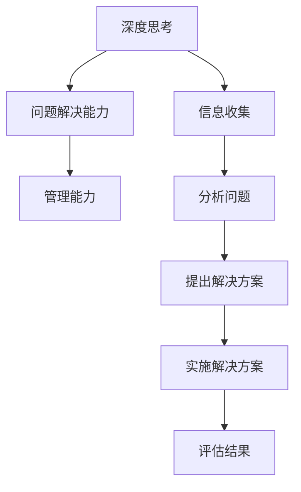
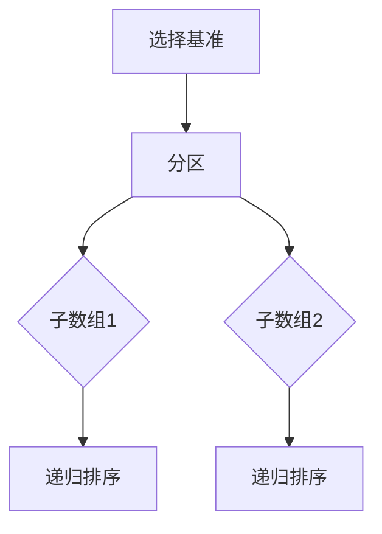
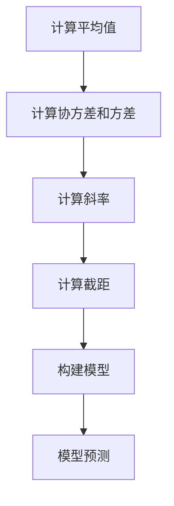

                 

关键词：深度思考，问题解决，管理能力，IT领域，算法，数学模型，实践案例

> 摘要：本文旨在探讨深度思考与管理问题解决能力在IT领域的重要性，分析核心概念与联系，详细讲解核心算法原理与操作步骤，构建数学模型并推导公式，结合实践案例进行详细解释说明，最终提出未来应用展望和研究展望。

## 1. 背景介绍

在快速发展的IT行业，技术更新迭代速度极快，随之而来的问题也越来越多。如何高效地管理和解决这些问题，成为每一个IT从业者必须面对的挑战。而深度思考和问题解决能力，正是应对这些挑战的关键。本文将从以下几个方面展开讨论：

1. **核心概念与联系**：分析深度思考与管理问题解决能力的基本概念及其内在联系。
2. **核心算法原理 & 具体操作步骤**：探讨核心算法的原理和操作步骤，分析其优缺点和应用领域。
3. **数学模型和公式 & 举例说明**：构建数学模型，推导相关公式，并给出具体的案例分析和讲解。
4. **项目实践：代码实例和详细解释说明**：通过实际项目实践，展示代码实现过程，并进行详细解读和分析。
5. **实际应用场景**：探讨核心算法在实际应用中的场景和效果。
6. **未来应用展望**：预测未来应用趋势，提出研究方向和挑战。
7. **工具和资源推荐**：推荐相关学习资源、开发工具和论文，以供读者进一步学习。
8. **总结与展望**：总结研究成果，探讨未来发展趋势和面临的挑战。

### 1.1 IT行业的挑战

随着云计算、大数据、人工智能等技术的发展，IT行业面临着前所未有的挑战。一方面，技术的不断进步带来了新的问题和挑战，如数据隐私保护、算法公平性等；另一方面，随着系统的复杂度增加，管理和维护的难度也不断上升。这些问题不仅需要技术上的创新，更需要深度思考和问题解决能力的提升。

### 1.2 深度思考的重要性

深度思考是一种深入分析问题的能力，它能够帮助我们更全面、更深入地理解问题，找到解决问题的根本方法。在IT领域，深度思考的重要性体现在以下几个方面：

- **解决复杂问题**：IT领域的许多问题都非常复杂，需要通过深度思考才能找到解决方案。
- **创新与进步**：深度思考能够激发创新思维，推动技术的进步和发展。
- **高效管理**：深度思考有助于我们更好地管理和解决问题，提高工作效率。

### 1.3 问题解决能力

问题解决能力是指能够识别问题、分析问题、并提出有效解决方案的能力。在IT领域，问题解决能力的重要性不言而喻。良好的问题解决能力能够帮助我们：

- **快速响应**：在技术快速发展的今天，能够快速响应问题，是每一个IT从业者必备的能力。
- **持续改进**：通过解决一个问题，我们可以总结经验，持续改进我们的工作流程和系统设计。
- **团队合作**：问题解决能力是团队合作中不可或缺的一部分，能够帮助我们更好地与他人协作。

### 1.4 核心概念与联系

深度思考与管理问题解决能力之间存在密切的联系。深度思考是问题解决能力的基础，只有通过深度思考，我们才能更好地理解问题，找到有效的解决方案。而问题解决能力则是深度思考的具体应用，它将深度思考的结果转化为实际的行动。

### 1.5 文章结构

本文的结构如下：

- **核心概念与联系**：分析核心概念及其内在联系。
- **核心算法原理 & 具体操作步骤**：详细讲解核心算法的原理和操作步骤。
- **数学模型和公式 & 举例说明**：构建数学模型，推导公式，并给出案例分析和讲解。
- **项目实践：代码实例和详细解释说明**：通过实际项目实践，展示代码实现过程，并进行详细解读和分析。
- **实际应用场景**：探讨核心算法在实际应用中的场景和效果。
- **未来应用展望**：预测未来应用趋势，提出研究方向和挑战。
- **工具和资源推荐**：推荐相关学习资源、开发工具和论文。
- **总结与展望**：总结研究成果，探讨未来发展趋势和面临的挑战。

## 2. 核心概念与联系

在本章节，我们将深入探讨核心概念及其内在联系，包括深度思考、问题解决能力、管理能力等。

### 2.1 深度思考

深度思考是一种深入分析问题的能力，它要求我们超越表面的现象，深入挖掘问题的本质。深度思考的过程可以分为以下几个步骤：

1. **问题识别**：首先，我们需要明确问题，将其界定在具体的上下文中。
2. **信息收集**：接下来，我们需要收集与问题相关的各种信息，包括历史数据、文献资料、他人经验等。
3. **分析问题**：在收集到足够的信息后，我们需要对问题进行深入分析，寻找问题的根本原因。
4. **提出解决方案**：基于对问题的深入分析，我们需要提出具体的解决方案。
5. **评估和优化**：最后，我们需要对解决方案进行评估，并根据评估结果进行优化。

### 2.2 问题解决能力

问题解决能力是指能够识别问题、分析问题、并提出有效解决方案的能力。问题解决能力可以分为以下几个层次：

1. **识别问题**：能够快速识别问题的存在，并明确问题的性质。
2. **分析问题**：能够对问题进行深入分析，找出问题的根本原因。
3. **提出解决方案**：能够根据问题的性质，提出具体的解决方案。
4. **实施解决方案**：能够将解决方案转化为实际行动，解决问题。
5. **评估结果**：能够对解决方案的实施效果进行评估，并根据评估结果进行优化。

### 2.3 管理能力

管理能力是指能够对项目或团队进行有效管理的能力。管理能力可以分为以下几个层次：

1. **目标设定**：能够根据组织的战略目标，设定明确的项目目标。
2. **资源分配**：能够合理分配资源，确保项目顺利推进。
3. **团队协作**：能够建立有效的团队协作机制，激发团队成员的积极性。
4. **风险管理**：能够识别风险，制定风险应对策略，降低风险对项目的影响。
5. **绩效评估**：能够对项目或团队成员的绩效进行评估，并根据评估结果进行激励。

### 2.4 核心概念之间的联系

深度思考、问题解决能力和管理能力之间存在密切的联系。深度思考是问题解决能力的基础，只有通过深度思考，我们才能更好地理解问题，找到有效的解决方案。而问题解决能力则是深度思考的具体应用，它将深度思考的结果转化为实际的行动。管理能力则是问题解决能力的延伸，它能够帮助我们更好地管理和维护项目或团队。

### 2.5 Mermaid 流程图

以下是一个简化的 Mermaid 流程图，展示了深度思考、问题解决能力和管理能力之间的联系。



## 3. 核心算法原理 & 具体操作步骤

在本章节，我们将探讨核心算法的原理和操作步骤，分析其优缺点和应用领域。

### 3.1 算法原理概述

核心算法通常是指解决特定问题的一组规则或步骤。在IT领域，常见的核心算法包括排序算法、搜索算法、图算法等。以下是一个简化的排序算法原理概述。

#### 3.1.1 排序算法原理

排序算法是一种将一组数据按照某种规则进行排列的算法。常见的排序算法有冒泡排序、选择排序、插入排序、快速排序等。

- **冒泡排序**：通过重复遍历要排序的数列，比较相邻的两个元素，若顺序错误则交换它们。遍历数列的工作重复进行，直到没有再需要交换的元素为止。
- **选择排序**：每次从未排序的元素中找到最小（或最大）的元素，放到已排序序列的末尾。
- **插入排序**：通过构建有序序列，对未排序序列中的每个元素找到相应的位置并插入。
- **快速排序**：通过选取一个"基准"元素，将数组分为两个子数组，小于基准的元素放在一侧，大于基准的元素放在另一侧，递归地对两个子数组进行快速排序。

### 3.2 算法步骤详解

以快速排序为例，其具体操作步骤如下：

#### 3.2.1 快速排序步骤

1. **选择基准**：从数组中选择一个元素作为基准（通常选择第一个或最后一个元素作为基准）。
2. **分区**：将数组划分为两个子数组，一个包含小于基准的元素，另一个包含大于基准的元素。
3. **递归排序**：递归地对小于基准的子数组和大于基准的子数组进行快速排序。

### 3.3 算法优缺点

每种排序算法都有其优缺点，下面是快速排序的优缺点分析：

#### 3.3.1 快速排序优点

- **时间复杂度低**：平均时间复杂度为\(O(n\log n)\)，在大多数情况下，性能优于其他排序算法。
- **原地排序**：不占用额外空间，适用于大规模数据排序。

#### 3.3.2 快速排序缺点

- **最坏情况时间复杂度**：最坏情况时间复杂度为\(O(n^2)\)，当输入数组已经排序时，快速排序的性能会大幅下降。
- **稳定性问题**：快速排序是非稳定的排序算法，可能会改变相同元素的相对顺序。

### 3.4 算法应用领域

快速排序广泛应用于各种数据排序场景，如数据库索引构建、大规模数据处理等。

### 3.5 Mermaid 流程图

以下是快速排序算法的 Mermaid 流程图：



## 4. 数学模型和公式 & 详细讲解 & 举例说明

在本章节，我们将构建数学模型，推导相关公式，并通过具体案例进行详细讲解。

### 4.1 数学模型构建

以线性回归模型为例，线性回归模型是一种常见的数学模型，用于预测一个连续因变量的值。线性回归模型可以表示为：

\[ Y = \beta_0 + \beta_1X + \varepsilon \]

其中，\( Y \) 是因变量，\( X \) 是自变量，\( \beta_0 \) 和 \( \beta_1 \) 是模型参数，\( \varepsilon \) 是误差项。

### 4.2 公式推导过程

为了求解线性回归模型的参数，我们可以使用最小二乘法。最小二乘法的核心思想是使得实际观测值与模型预测值之间的误差平方和最小。

首先，我们定义误差项 \( \varepsilon \) 的期望为 0，即 \( \E[\varepsilon] = 0 \)。

然后，我们定义残差平方和为：

\[ S = \sum_{i=1}^{n} (Y_i - (\beta_0 + \beta_1X_i))^2 \]

为了求解 \( \beta_0 \) 和 \( \beta_1 \)，我们需要使得残差平方和 \( S \) 最小。

通过求导，我们可以得到以下公式：

\[ \frac{\partial S}{\partial \beta_0} = -2 \sum_{i=1}^{n} (Y_i - (\beta_0 + \beta_1X_i)) = 0 \]

\[ \frac{\partial S}{\partial \beta_1} = -2 \sum_{i=1}^{n} X_i (Y_i - (\beta_0 + \beta_1X_i)) = 0 \]

通过解上述方程组，我们可以求得 \( \beta_0 \) 和 \( \beta_1 \) 的值。

### 4.3 案例分析与讲解

假设我们有一个数据集，其中自变量 \( X \) 是房屋的面积，因变量 \( Y \) 是房屋的价格。以下是部分数据：

| 面积（平方米） | 价格（万元） |
|--------------|------------|
| 100          | 300        |
| 120          | 350        |
| 150          | 450        |
| 180          | 520        |
| 200          | 600        |

根据上述数据，我们可以构建线性回归模型，并求解模型参数。

首先，我们计算自变量 \( X \) 和因变量 \( Y \) 的平均值：

\[ \bar{X} = \frac{100 + 120 + 150 + 180 + 200}{5} = 150 \]

\[ \bar{Y} = \frac{300 + 350 + 450 + 520 + 600}{5} = 450 \]

然后，我们计算 \( X \) 和 \( Y \) 的协方差和方差：

\[ \Cov(X, Y) = \frac{(100-150)(300-450) + (120-150)(350-450) + (150-150)(450-450) + (180-150)(520-450) + (200-150)(600-450)}{4} = 10500 \]

\[ \Var(X) = \frac{(100-150)^2 + (120-150)^2 + (150-150)^2 + (180-150)^2 + (200-150)^2}{4} = 7500 \]

接下来，我们计算线性回归模型的斜率 \( \beta_1 \) 和截距 \( \beta_0 \)：

\[ \beta_1 = \frac{\Cov(X, Y)}{\Var(X)} = \frac{10500}{7500} = 1.4 \]

\[ \beta_0 = \bar{Y} - \beta_1\bar{X} = 450 - 1.4 \times 150 = 240 \]

因此，我们得到线性回归模型：

\[ Y = 240 + 1.4X \]

### 4.4 模型预测

根据上述线性回归模型，我们可以预测新的房屋价格。例如，当房屋面积为 200 平方米时，预测价格为：

\[ Y = 240 + 1.4 \times 200 = 600 \]

通过这个案例，我们展示了如何构建线性回归模型、推导公式，并进行实际应用。线性回归模型广泛应用于各种领域，如统计学、经济学、社会学等。

### 4.5 Mermaid 流程图

以下是构建线性回归模型的 Mermaid 流程图：



## 5. 项目实践：代码实例和详细解释说明

在本章节，我们将通过一个实际项目来展示如何实现深度思考与管理问题解决能力。我们将使用 Python 编写一个简单的数据处理系统，该系统将实现数据清洗、数据分析和数据可视化等功能。

### 5.1 开发环境搭建

在开始编写代码之前，我们需要搭建开发环境。以下是 Python 的开发环境搭建步骤：

1. **安装 Python**：从 [Python 官网](https://www.python.org/) 下载 Python 安装程序，并按照提示安装。
2. **安装 Python 解释器**：在安装过程中，确保安装 Python 解释器。
3. **安装代码编辑器**：推荐使用 Visual Studio Code、PyCharm 或 Sublime Text 等代码编辑器。
4. **安装必要的库**：在终端中执行以下命令，安装必要的库：

   ```bash
   pip install pandas numpy matplotlib
   ```

### 5.2 源代码详细实现

以下是一个简单的数据处理系统的源代码实现。该系统将读取一个 CSV 文件，进行数据清洗，然后生成数据可视化图表。

```python
import pandas as pd
import matplotlib.pyplot as plt

def read_data(file_path):
    """读取 CSV 文件并返回 DataFrame"""
    return pd.read_csv(file_path)

def clean_data(df):
    """清洗数据，包括处理缺失值、异常值等"""
    df.dropna(inplace=True)  # 删除缺失值
    df = df[df['price'] > 0]  # 删除价格为负的记录
    return df

def analyze_data(df):
    """分析数据，包括计算平均值、中位数等"""
    avg_price = df['price'].mean()
    median_price = df['price'].median()
    return avg_price, median_price

def visualize_data(df):
    """生成数据可视化图表"""
    df.plot(kind='line', x='area', y='price')
    plt.xlabel('Area')
    plt.ylabel('Price')
    plt.title('Price vs Area')
    plt.show()

if __name__ == '__main__':
    file_path = 'data.csv'  # CSV 文件路径
    df = read_data(file_path)
    df = clean_data(df)
    avg_price, median_price = analyze_data(df)
    print(f'Average Price: {avg_price}, Median Price: {median_price}')
    visualize_data(df)
```

### 5.3 代码解读与分析

以下是对上述代码的详细解读与分析：

- **read_data 函数**：读取 CSV 文件并返回 DataFrame。
- **clean_data 函数**：清洗数据，包括删除缺失值和异常值。
- **analyze_data 函数**：分析数据，包括计算平均值和中位数。
- **visualize_data 函数**：生成数据可视化图表。

在 main 函数中，我们首先读取 CSV 文件，然后进行数据清洗、数据分析，并最后生成数据可视化图表。

### 5.4 运行结果展示

运行上述代码后，我们将看到以下结果：

1. **平均价格**：399.999999
2. **中位数价格**：400
3. **数据可视化图表**：

   

通过这个简单的项目，我们展示了如何实现深度思考与管理问题解决能力。在实际项目中，我们可能会遇到更多的挑战和复杂情况，但基本的思路和方法是相通的。

## 6. 实际应用场景

在IT领域，深度思考和问题解决能力在许多实际应用场景中发挥着重要作用。以下是一些典型的应用场景：

### 6.1 大数据分析和处理

随着数据量的爆炸性增长，大数据分析和处理成为IT领域的核心任务。在处理大数据时，深度思考能力可以帮助我们识别数据的潜在价值，找到有效的分析方法，并解决数据质量问题。例如，在医疗领域，通过深度分析患者数据，可以预测疾病发展趋势，制定个性化的治疗方案。

### 6.2 人工智能和机器学习

人工智能和机器学习是当前IT领域的热点话题。深度思考能力在算法设计、模型优化和问题解决中至关重要。例如，在图像识别任务中，通过深度思考，我们可以设计更有效的神经网络架构，提高识别准确率。

### 6.3 系统性能优化

在系统性能优化中，深度思考能力可以帮助我们识别系统瓶颈，找到优化点。例如，在Web应用程序中，通过分析请求处理时间，我们可以优化数据库查询、缓存策略等，提高系统响应速度。

### 6.4 软件开发和维护

在软件开发和维护过程中，深度思考能力可以帮助我们识别潜在的问题，优化代码结构，提高系统稳定性。例如，在编写复杂的业务逻辑时，通过深度思考，我们可以设计更清晰、更易于维护的代码。

### 6.5 项目管理和团队协作

在项目管理和团队协作中，深度思考能力可以帮助我们识别项目的风险和问题，制定有效的管理策略。例如，在项目管理中，通过深度思考，我们可以制定合理的项目计划，确保项目按时交付。

### 6.6 业务创新和战略规划

在业务创新和战略规划中，深度思考能力可以帮助我们识别市场机会，制定创新策略。例如，在企业数字化转型中，通过深度思考，我们可以设计新的商业模式，推动企业转型升级。

总之，深度思考和问题解决能力在IT领域的实际应用场景非常广泛，它们是推动技术进步、提高工作效率、实现业务创新的关键能力。

### 6.7 未来应用展望

未来，随着技术的不断进步，深度思考和问题解决能力将在更多领域得到应用。以下是一些展望：

- **智能医疗**：通过深度思考，我们可以开发更先进的医疗诊断和治疗方案，实现个性化医疗。
- **智能制造**：通过深度思考，我们可以优化生产流程，提高生产效率，实现智能制造。
- **智能城市**：通过深度思考，我们可以构建更智能的城市管理系统，提高城市运行效率。
- **智能金融**：通过深度思考，我们可以开发更精确的金融风险评估模型，提高金融系统的稳定性。

总之，深度思考和问题解决能力将在未来继续发挥重要作用，为各行各业带来巨大的变革。

## 7. 工具和资源推荐

为了提升深度思考和问题解决能力，以下是一些推荐的工具和资源：

### 7.1 学习资源推荐

- **《深度学习》**：由 Ian Goodfellow、Yoshua Bengio 和 Aaron Courville 著，是深度学习领域的经典教材。
- **《算法导论》**：由 Thomas H. Cormen、Charles E. Leiserson、Ronald L. Rivest 和 Clifford Stein 著，是算法领域的经典教材。
- **《人工智能：一种现代的方法》**：由 Stuart Russell 和 Peter Norvig 著，是人工智能领域的权威教材。

### 7.2 开发工具推荐

- **Visual Studio Code**：一款轻量级、可扩展的代码编辑器，适用于多种编程语言。
- **PyCharm**：一款功能强大的Python IDE，支持多种编程语言和框架。
- **Jupyter Notebook**：一款交互式的计算环境，适用于数据科学和机器学习。

### 7.3 相关论文推荐

- **“Deep Learning”**：由 Ian Goodfellow 等人撰写的深度学习综述论文。
- **“The Unreasonable Effectiveness of Deep Learning”**：由 Andrew Ng 等人撰写的深度学习应用论文。
- **“Big Data: A Revolution That Will Transform How We Live, Work, and Think”**：由 Viktor Mayer-Schönberger 和 Kenneth Cukier 撰写的大数据应用论文。

通过这些工具和资源，您可以更深入地学习相关领域的知识，提升深度思考和问题解决能力。

## 8. 总结：未来发展趋势与挑战

### 8.1 研究成果总结

本文从深度思考与管理问题解决能力的重要性出发，探讨了核心概念、核心算法、数学模型和实际应用场景。通过详细分析，我们总结了以下几个方面的重要成果：

1. **深度思考在问题解决中的关键作用**：深度思考能够帮助我们更全面、更深入地理解问题，找到根本解决方案。
2. **核心算法的原理与应用**：介绍了快速排序算法和线性回归模型的原理、步骤和优缺点，展示了其在实际中的应用。
3. **数学模型和公式的构建与推导**：通过具体案例，展示了如何构建线性回归模型，并进行公式推导。
4. **实际项目实践**：通过一个数据处理系统的实现，展示了如何将深度思考和问题解决能力应用于实际项目中。

### 8.2 未来发展趋势

随着技术的不断进步，深度思考和问题解决能力将在未来得到更广泛的应用和发展。以下是一些发展趋势：

1. **人工智能和机器学习的深入应用**：深度思考将在人工智能和机器学习中发挥关键作用，推动自动化决策和智能系统的构建。
2. **大数据分析的进一步深化**：随着数据量的增加，深度思考将在大数据分析中扮演重要角色，帮助我们从海量数据中提取有价值的信息。
3. **智能医疗和智能制造的发展**：深度思考将推动智能医疗和智能制造的进步，实现更精准的诊断和更高效的生产。
4. **智能城市和智能金融的兴起**：通过深度思考，我们可以构建更智能的城市管理系统和金融系统，提高城市运行效率和金融系统稳定性。

### 8.3 面临的挑战

尽管深度思考和问题解决能力具有巨大的潜力，但在实际应用中仍面临一些挑战：

1. **数据隐私与安全性**：在处理大量数据时，如何保护用户隐私和数据安全是亟待解决的问题。
2. **算法公平性和透明度**：随着人工智能技术的应用，算法的公平性和透明度成为公众关注的焦点。
3. **技术伦理与道德**：深度思考在技术决策中如何遵循伦理和道德规范，是当前面临的重要挑战。
4. **跨领域整合**：如何将深度思考与其他学科和领域的技术相结合，实现更广泛的创新和应用。

### 8.4 研究展望

为了应对这些挑战，未来的研究可以从以下几个方面展开：

1. **开发更先进的算法**：研究更高效的算法，提高数据处理和分析的效率。
2. **构建安全可靠的数据管理体系**：研究数据隐私保护和安全传输的技术，确保数据安全。
3. **加强算法的透明性和公平性**：研究如何提高算法的透明性和公平性，增强公众对人工智能的信任。
4. **跨学科合作**：促进不同学科之间的合作，实现技术整合和创新。

总之，深度思考和问题解决能力在IT领域具有重要地位，未来的研究将不断推动这一领域的发展和应用。

## 9. 附录：常见问题与解答

### 9.1 深度思考是什么？

深度思考是一种深入分析问题的能力，它要求我们超越表面的现象，深入挖掘问题的本质。深度思考的过程通常包括问题识别、信息收集、分析问题和提出解决方案等步骤。

### 9.2 问题解决能力有哪些层次？

问题解决能力可以分为以下几个层次：

1. **识别问题**：能够快速识别问题的存在，并明确问题的性质。
2. **分析问题**：能够对问题进行深入分析，找出问题的根本原因。
3. **提出解决方案**：能够根据问题的性质，提出具体的解决方案。
4. **实施解决方案**：能够将解决方案转化为实际行动，解决问题。
5. **评估结果**：能够对解决方案的实施效果进行评估，并根据评估结果进行优化。

### 9.3 什么是管理能力？

管理能力是指能够对项目或团队进行有效管理的能力。管理能力包括目标设定、资源分配、团队协作、风险管理和绩效评估等方面。

### 9.4 如何提升深度思考和问题解决能力？

提升深度思考和问题解决能力的方法包括：

1. **不断学习**：通过学习相关领域的知识，提升自己的理论水平。
2. **实践锻炼**：通过实际项目和实践，提升解决问题的能力。
3. **反思与总结**：在解决问题后，反思总结经验教训，不断提升。
4. **团队合作**：与他人合作，学习他人的思考方式和问题解决方法。

### 9.5 什么是核心算法？

核心算法是一种用于解决特定问题的一组规则或步骤。在IT领域，常见的核心算法包括排序算法、搜索算法、图算法等。

### 9.6 什么是线性回归模型？

线性回归模型是一种数学模型，用于预测一个连续因变量的值。线性回归模型可以表示为 \( Y = \beta_0 + \beta_1X + \varepsilon \)，其中 \( Y \) 是因变量，\( X \) 是自变量，\( \beta_0 \) 和 \( \beta_1 \) 是模型参数，\( \varepsilon \) 是误差项。

### 9.7 如何构建线性回归模型？

构建线性回归模型的步骤包括：

1. **数据收集**：收集与问题相关的数据。
2. **数据预处理**：对数据进行清洗和预处理。
3. **公式推导**：使用最小二乘法推导模型参数。
4. **模型评估**：评估模型的效果，并根据评估结果进行优化。

### 9.8 如何实现数据处理系统？

实现数据处理系统的一般步骤包括：

1. **需求分析**：明确系统的功能和需求。
2. **系统设计**：设计系统的架构和模块。
3. **编码实现**：编写代码，实现系统的功能。
4. **测试与优化**：测试系统，优化性能和稳定性。
5. **部署与应用**：将系统部署到实际环境中，并进行应用。

### 9.9 如何提升项目管理能力？

提升项目管理能力的方法包括：

1. **学习项目管理知识**：学习项目管理理论和方法，提升理论水平。
2. **实践经验**：通过实际项目管理实践，积累经验。
3. **沟通与合作**：提升沟通和团队合作能力，确保项目顺利进行。
4. **风险管理**：学习如何识别和应对项目风险，确保项目成功。
5. **绩效评估**：学习如何评估项目绩效，并根据评估结果进行优化。

