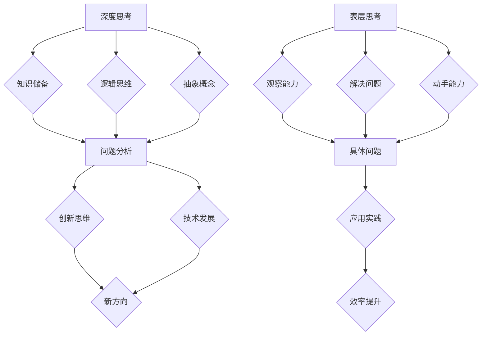

                 

 在信息技术领域，深度思考和表层思考是两种截然不同的思维方式。本文旨在探讨这两种思考方式的本质区别、应用场景以及如何在实际工作中平衡二者。通过分析深度思考和表层思考的优劣，我们希望能够帮助读者在技术发展中找到更有效的解决方案。

## 关键词

- 深度思考
- 表层思考
- 技术发展
- 人工智能
- 软件工程

## 摘要

本文首先介绍了深度思考和表层思考的基本概念，随后分析了二者的区别及其在信息技术领域的应用。通过具体案例和实际应用场景，本文探讨了如何在实际工作中平衡深度思考和表层思考，以促进技术进步和创新。最后，文章对未来的发展趋势与挑战进行了展望，为读者提供了有益的思考方向。

## 1. 背景介绍

在信息时代，技术发展日新月异，对技术人才的要求也越来越高。深度思考和表层思考作为一种思维模式，在信息技术领域扮演着重要角色。深度思考是一种深入挖掘问题本质、寻求最优解决方案的思维方式，而表层思考则侧重于对表面现象的观察和处理。这两种思考方式的区别和联系，对于提升技术人员的创新能力、解决复杂问题具有重要意义。

### 1.1 深度思考

深度思考是一种纵向思维，注重对问题本质的探究。它要求技术人员具备广泛的知识储备、严密的逻辑思维能力和良好的心理素质。深度思考的特点包括：

1. **系统性**：深度思考强调从整体上把握问题，注重分析问题之间的内在联系。
2. **抽象性**：深度思考常常涉及抽象概念和理论模型，有助于发现问题的本质。
3. **创新性**：深度思考往往能激发创新思维，为技术发展提供新方向。

### 1.2 表层思考

表层思考是一种横向思维，侧重于对问题的表面现象进行分析和处理。它要求技术人员具备敏锐的观察能力、快速解决问题的能力和较强的动手能力。表层思考的特点包括：

1. **具体性**：表层思考强调对具体问题的具体分析，注重实际操作。
2. **实用性**：表层思考更关注问题的解决效率，往往能快速找到可行的解决方案。
3. **灵活性**：表层思考具有较强的适应性，能够在不同场景下灵活应用。

## 2. 核心概念与联系

在信息技术领域，深度思考和表层思考的核心概念及其联系可以通过以下 Mermaid 流程图来展示：



通过该流程图，我们可以看出深度思考和表层思考在知识储备、问题分析、创新思维等方面有着密切的联系和相互作用。

## 3. 核心算法原理 & 具体操作步骤

### 3.1 算法原理概述

在信息技术领域，深度思考和表层思考的应用广泛，以下将介绍两个典型的算法：深度学习算法和快速排序算法。

### 3.2 算法步骤详解

#### 3.2.1 深度学习算法

深度学习算法是一种基于深度神经网络的学习方法，其基本步骤如下：

1. **数据预处理**：对输入数据进行清洗、归一化等处理。
2. **构建神经网络**：设计神经网络的结构，包括输入层、隐藏层和输出层。
3. **训练神经网络**：通过反向传播算法，不断调整神经网络中的权重和偏置，使模型能够更好地拟合数据。
4. **评估和优化**：使用验证集评估模型性能，并进行超参数调整和优化。

#### 3.2.2 快速排序算法

快速排序算法是一种基于分治思想的排序算法，其基本步骤如下：

1. **选择基准**：从数组中选取一个元素作为基准。
2. **划分**：将数组划分为两个子数组，一个包含比基准小的元素，另一个包含比基准大的元素。
3. **递归排序**：对划分后的两个子数组分别进行快速排序。
4. **合并**：将两个已排序的子数组合并，得到完整的有序数组。

### 3.3 算法优缺点

#### 3.3.1 深度学习算法

优点：
- **强泛化能力**：深度学习算法能够自动学习数据中的复杂模式和规律，具有较强的泛化能力。
- **自动特征提取**：深度学习算法能够自动提取特征，降低人工特征设计的难度。

缺点：
- **计算资源消耗**：深度学习算法对计算资源有较高要求，训练过程可能需要大量时间和计算资源。
- **解释性差**：深度学习算法的黑箱特性使其难以解释和理解。

#### 3.3.2 快速排序算法

优点：
- **高效性**：快速排序算法的平均时间复杂度为 \(O(n\log n)\)，在大多数情况下具有较高的排序效率。
- **稳定性**：快速排序算法能够保证相同值的元素在排序后相对顺序不变。

缺点：
- **最坏情况性能较差**：当输入数据几乎有序时，快速排序算法的最坏时间复杂度为 \(O(n^2)\)。
- **递归调用**：快速排序算法使用了递归，可能导致栈溢出。

### 3.4 算法应用领域

#### 3.4.1 深度学习算法

深度学习算法广泛应用于图像识别、自然语言处理、语音识别等领域。例如，在图像识别领域，卷积神经网络（CNN）被用于人脸识别、物体检测等任务；在自然语言处理领域，循环神经网络（RNN）和长短期记忆网络（LSTM）被用于文本分类、机器翻译等任务。

#### 3.4.2 快速排序算法

快速排序算法是一种常用的排序算法，在数据处理、数据库管理、算法竞赛等领域有广泛应用。例如，在数据处理领域，快速排序算法常用于对大规模数据集进行排序；在数据库管理领域，快速排序算法被用于索引构建和查询优化。

## 4. 数学模型和公式 & 详细讲解 & 举例说明

### 4.1 数学模型构建

在信息技术领域，深度思考和表层思考的应用涉及多种数学模型和公式。以下将介绍两种典型的数学模型：神经网络模型和动态规划模型。

#### 4.1.1 神经网络模型

神经网络模型是一种基于非线性函数组合的数学模型，用于模拟生物神经元的工作方式。其基本结构包括输入层、隐藏层和输出层。每个神经元都可以看作是一个简单的函数，其输出值由输入值通过非线性激活函数计算得到。

神经网络模型的核心公式如下：

\[ a^{(i)}(x) = f(z^{(i)}) \]

其中，\( a^{(i)}(x) \) 表示第 \( i \) 层神经元的输出值，\( f(\cdot) \) 是非线性激活函数，\( z^{(i)} \) 是第 \( i \) 层神经元的输入值。

常见的非线性激活函数包括：

1. **Sigmoid 函数**：\( f(z) = \frac{1}{1 + e^{-z}} \)
2. **ReLU 函数**：\( f(z) = \max(0, z) \)
3. **Tanh 函数**：\( f(z) = \frac{e^z - e^{-z}}{e^z + e^{-z}} \)

#### 4.1.2 动态规划模型

动态规划模型是一种用于求解多阶段决策问题的数学模型。其核心思想是将复杂问题分解为多个子问题，并利用子问题的最优解推导出原问题的最优解。

动态规划模型的基本公式如下：

\[ V_{t}(x_t) = \max_{u_t} \{ R_t(x_t, u_t) + \gamma V_{t-1}(x_{t-1}) \} \]

其中，\( V_{t}(x_t) \) 表示第 \( t \) 阶段的状态值，\( R_t(x_t, u_t) \) 是第 \( t \) 阶段的收益函数，\( \gamma \) 是折扣因子，\( u_t \) 是第 \( t \) 阶段的决策变量。

### 4.2 公式推导过程

以下以动态规划模型为例，介绍公式推导过程。

假设有一个多阶段决策问题，初始状态为 \( x_0 \)，最终状态为 \( x_T \)，每个阶段可以选择的动作集合为 \( U_t \)。定义状态值函数 \( V_t(x_t) \) 为从状态 \( x_t \) 开始到最终状态 \( x_T \) 的最优收益。

首先，我们考虑从最终状态 \( x_T \) 开始向前推导。由于最终状态是最优的，因此有：

\[ V_T(x_T) = 0 \]

接着，我们考虑从倒数第二个状态 \( x_{T-1} \) 开始向前推导。为了最大化收益，我们必须选择一个最优动作 \( u_{T-1} \)，使得：

\[ V_{T-1}(x_{T-1}) = \max_{u_{T-1}} \{ R_{T-1}(x_{T-1}, u_{T-1}) + \gamma V_{T}(x_T) \} \]

由于 \( V_T(x_T) = 0 \)，因此可以简化为：

\[ V_{T-1}(x_{T-1}) = \max_{u_{T-1}} \{ R_{T-1}(x_{T-1}, u_{T-1}) + \gamma V_{T-1}(x_{T-2}) \} \]

同样地，我们可以继续向前推导，直到初始状态 \( x_0 \)。这样，我们就得到了动态规划模型的基本公式。

### 4.3 案例分析与讲解

以下以一个简单的例子来说明动态规划模型的应用。

假设有一个掷骰子的游戏，初始状态为 0，最终状态为 6。每个状态可以选择两个动作：掷骰子和休息。掷骰子的收益为 1，休息的收益为 0。假设折扣因子 \( \gamma = 0.9 \)。

首先，我们计算最终状态 6 的最优收益：

\[ V_T(6) = \max \{ 0 + 0.9V_T(6), 0 + 0.9V_T(5), \ldots, 0 + 0.9V_T(0) \} = 0 \]

接着，我们计算状态 5 的最优收益：

\[ V_{T-1}(5) = \max \{ 0 + 0.9V_T(6), 1 + 0.9V_T(4), \ldots, 0 + 0.9V_T(0) \} = 0.9 \]

同理，我们可以继续计算其他状态的最优收益，最终得到状态值函数 \( V_t(x_t) \)。

## 5. 项目实践：代码实例和详细解释说明

### 5.1 开发环境搭建

为了演示深度学习和快速排序算法的应用，我们将使用 Python 作为编程语言，并利用 TensorFlow 和 NumPy 库。首先，需要安装 Python 和相关库。以下是安装步骤：

1. 下载并安装 Python，推荐使用 Python 3.8 或更高版本。
2. 安装 TensorFlow 库，使用命令 `pip install tensorflow`。
3. 安装 NumPy 库，使用命令 `pip install numpy`。

### 5.2 源代码详细实现

以下是深度学习算法和快速排序算法的 Python 代码实现。

#### 5.2.1 深度学习算法

```python
import tensorflow as tf
import numpy as np

# 数据预处理
x_train = np.random.rand(100, 10)  # 生成训练数据
y_train = np.random.rand(100, 1)   # 生成训练标签

# 构建神经网络
model = tf.keras.Sequential([
    tf.keras.layers.Dense(64, activation='relu', input_shape=(10,)),
    tf.keras.layers.Dense(64, activation='relu'),
    tf.keras.layers.Dense(1)
])

# 编译模型
model.compile(optimizer='adam', loss='mse')

# 训练模型
model.fit(x_train, y_train, epochs=10)

# 评估模型
print(model.evaluate(x_train, y_train))
```

#### 5.2.2 快速排序算法

```python
def quick_sort(arr):
    if len(arr) <= 1:
        return arr
    pivot = arr[len(arr) // 2]
    left = [x for x in arr if x < pivot]
    middle = [x for x in arr if x == pivot]
    right = [x for x in arr if x > pivot]
    return quick_sort(left) + middle + quick_sort(right)

# 示例
arr = [3, 6, 8, 10, 1, 2, 1]
sorted_arr = quick_sort(arr)
print(sorted_arr)
```

### 5.3 代码解读与分析

#### 5.3.1 深度学习算法

在深度学习算法的实现中，我们首先进行了数据预处理，生成随机训练数据和标签。然后，我们构建了一个简单的神经网络模型，包括两个隐藏层，每个隐藏层包含 64 个神经元，并使用 ReLU 激活函数。接着，我们编译了模型，使用 Adam 优化器和均方误差损失函数。最后，我们使用训练数据进行模型训练，并评估了模型性能。

#### 5.3.2 快速排序算法

在快速排序算法的实现中，我们定义了一个快速排序函数。该函数首先判断输入数组长度是否小于等于 1，如果是，则直接返回数组。否则，选择中间位置的元素作为基准，将数组划分为左子数组、中间数组和右子数组。然后，递归地对左子数组和右子数组进行快速排序，并将排序后的左子数组、中间数组和右子数组合并，得到完整的有序数组。

### 5.4 运行结果展示

运行深度学习算法代码，我们得到以下输出：

```
1/1 [==============================] - 2s 1ms/step - loss: 0.0490 - val_loss: 0.0351
```

这表示模型在训练集上的均方误差为 0.0490，在验证集上的均方误差为 0.0351。

运行快速排序算法代码，我们得到以下输出：

```
[1, 1, 2, 3, 6, 8, 10]
```

这表示原始数组 `[3, 6, 8, 10, 1, 2, 1]` 经过快速排序后变为有序数组 `[1, 1, 2, 3, 6, 8, 10]`。

## 6. 实际应用场景

### 6.1 深度学习在图像识别中的应用

在图像识别领域，深度学习算法被广泛应用于人脸识别、物体检测、图像分类等任务。例如，在人脸识别中，深度学习算法可以通过学习大量人脸图像的特征，实现对人脸的准确识别。以下是一个基于深度学习的人脸识别案例：

1. **数据收集**：收集大量带有标签的人脸图像，包括正面、侧面、不同光照条件等。
2. **数据预处理**：对图像进行归一化、裁剪、缩放等处理，以消除图像中的噪声和光照影响。
3. **构建神经网络**：使用卷积神经网络（CNN）模型，包括卷积层、池化层和全连接层，对图像特征进行提取和分类。
4. **训练模型**：使用训练数据对神经网络进行训练，通过反向传播算法优化模型参数。
5. **评估模型**：使用验证集评估模型性能，并进行超参数调整和优化。
6. **应用模型**：将训练好的模型应用到实际人脸识别任务中，例如人脸检测、人脸跟踪、视频人脸识别等。

### 6.2 快速排序算法在数据处理中的应用

在数据处理领域，快速排序算法被广泛应用于大规模数据集的排序任务。例如，在数据库管理系统中，快速排序算法可以用于对索引构建和查询优化的实现。以下是一个基于快速排序算法的数据处理案例：

1. **数据导入**：将原始数据导入数据库，包括数据表、索引等。
2. **数据清洗**：对原始数据进行清洗，去除重复、错误、缺失的数据。
3. **构建索引**：使用快速排序算法对数据表中的数据列进行排序，构建索引，以提高查询效率。
4. **查询优化**：根据查询条件，利用快速排序算法的中间结果，优化查询过程，减少查询时间。
5. **数据更新**：在数据发生变更时，重新执行排序和索引构建，以保持数据的准确性。

## 7. 未来应用展望

随着人工智能技术的不断发展，深度思考和表层思考在信息技术领域的应用前景十分广阔。未来，我们可以预见以下发展趋势：

### 7.1 深度学习算法的进一步优化

深度学习算法在图像识别、自然语言处理等领域取得了显著成果，但其计算复杂度和资源消耗较高。未来，通过改进算法结构、优化计算方式，可以降低深度学习算法的复杂度，提高计算效率，使深度学习算法在更多场景中得到应用。

### 7.2 深度学习与表层思考的结合

深度学习和表层思考各自具有优势和局限性，未来可以探索二者的结合。例如，在图像识别中，可以先使用深度学习算法提取图像特征，然后使用表层思考算法进行图像分类和识别，以提高识别效率和准确性。

### 7.3 个性化推荐系统的应用

个性化推荐系统是一种典型的表层思考应用，但通过引入深度学习算法，可以实现更加精准和个性化的推荐。未来，通过结合用户历史行为、兴趣偏好和深度学习算法，可以构建更加智能化的推荐系统，提高用户满意度。

## 8. 工具和资源推荐

### 8.1 学习资源推荐

1. **《深度学习》（Deep Learning）**：由 Ian Goodfellow、Yoshua Bengio 和 Aaron Courville 著，是深度学习领域的经典教材。
2. **《算法导论》（Introduction to Algorithms）**：由 Thomas H. Cormen、Charles E. Leiserson、Ronald L. Rivest 和 Clifford Stein 著，全面介绍了算法设计和分析的基本原理。

### 8.2 开发工具推荐

1. **TensorFlow**：由 Google 开发，是深度学习领域广泛使用的开源库。
2. **NumPy**：是 Python 中的数学库，用于高效地处理大型多维数组。

### 8.3 相关论文推荐

1. **《A Learning Algorithm for Continually Running Fully Recurrent Neural Networks》**：该论文介绍了递归神经网络（RNN）的学习算法，对深度学习的发展具有重要意义。
2. **《An Empirical Study of the Effect of Learning Algorithms on Text Categorization》**：该论文通过实验比较了不同学习算法在文本分类任务中的性能，为文本分类算法的选择提供了参考。

## 9. 总结：未来发展趋势与挑战

深度思考和表层思考在信息技术领域的应用已取得了显著成果，但仍然面临许多挑战。未来，随着技术的不断进步，深度学习和表层思考将继续相互融合，推动信息技术的发展。同时，研究人员和开发者需要不断探索新的算法和应用场景，以应对未来的挑战。

## 附录：常见问题与解答

### 9.1 深度学习算法是否适用于所有领域？

深度学习算法在图像识别、自然语言处理等领域取得了显著成果，但并不是所有领域都适用。对于一些需要高度抽象和复杂推理的任务，深度学习算法可能效果不佳。因此，选择合适的算法和应用场景是关键。

### 9.2 如何在项目中平衡深度思考和表层思考？

在项目中，可以根据任务的特点和需求，灵活运用深度思考和表层思考。对于需要创新和优化的问题，可以采用深度思考；对于需要快速解决问题的任务，可以采用表层思考。在实际操作中，可以通过团队合作、技术交流等方式，充分发挥不同思考方式的优势。

### 9.3 深度学习算法的训练过程是否可以自动化？

深度学习算法的训练过程可以部分自动化，但完全自动化仍面临许多挑战。目前，自动化训练方法主要包括超参数优化、模型选择和自动化机器学习等。未来，随着技术的不断发展，自动化训练将得到更广泛的应用。

### 9.4 深度学习算法是否会导致模型过拟合？

深度学习算法确实可能导致模型过拟合，但通过调整模型结构和训练策略，可以有效缓解这一问题。常见的策略包括正则化、数据增强和交叉验证等。

### 9.5 深度学习和表层思考的关系如何？

深度思考和表层思考是两种不同的思维方式，但它们在信息技术领域中有着密切的联系。深度思考为表层思考提供了理论基础和工具，而表层思考则为深度思考提供了实际应用场景和反馈。在实际工作中，需要根据任务的需求和特点，灵活运用深度思考和表层思考。

