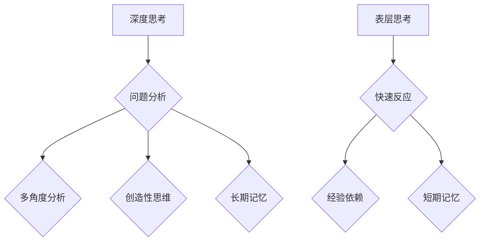

                 

 关键词：深度思考、表层思考、人工智能、认知心理学、编程、软件开发、认知负荷、思维模式

> 摘要：本文旨在探讨深度思考与表层思考在人工智能、认知心理学、编程和软件开发中的差异及其重要性。深度思考是一种深入探究问题本质、追求创新和解决复杂问题的思考方式，而表层思考则是一种简单、快速的思维模式。通过分析两者的区别，我们能够更好地理解人类认知过程，优化编程和软件开发流程，提高人工智能系统的智能水平。

## 1. 背景介绍

在当今信息爆炸的时代，人类面临着越来越多的复杂问题。如何有效地解决这些问题成为了一个重要课题。深度思考与表层思考作为两种基本的思考方式，对于问题的解决和人工智能的发展具有重要影响。深度思考强调对问题本质的深入探究，追求创新和解决复杂问题，而表层思考则侧重于快速、简单地处理问题，更多关注表面的现象。

人工智能作为当前科技领域的重要发展方向，其核心在于模拟人类思维过程。深度思考与表层思考对于人工智能系统的发展有着不同的影响。深度思考有助于提高人工智能的智能水平，使其能够更好地理解和解决问题，而表层思考则有助于快速实现功能，提升系统的实用性。

本文将从以下几个方面展开探讨：

- **定义深度思考与表层思考**：明确两种思考方式的含义及其在认知心理学中的地位。
- **深度思考与表层思考的区别**：分析两者在思维模式、认知负荷、应用场景等方面的差异。
- **深度思考在编程和软件开发中的应用**：探讨深度思考在编程、算法设计和系统架构等方面的应用。
- **表层思考在人工智能中的应用**：分析表层思考在人工智能系统开发、数据分析和用户界面设计等方面的应用。
- **深度思考与表层思考的平衡**：讨论如何在实际项目中实现深度思考与表层思考的平衡。

通过本文的探讨，希望能够为读者提供对深度思考与表层思考的更深入理解，从而在编程、软件开发和人工智能领域取得更好的成果。

## 2. 核心概念与联系

### 2.1 深度思考的定义与原理

深度思考是一种深层次、系统性的思维方式，强调对问题本质的探究和解决问题的全面性。深度思考通常涉及对问题背景、相关知识和可能的解决方案的深入分析。其核心原理包括以下几个方面：

- **问题分解**：将复杂问题分解为多个子问题，逐步解决。
- **多角度分析**：从多个角度对问题进行分析，以获得更全面的认识。
- **创造性思维**：通过探索新思路和解决方案，实现问题的创新解决。
- **长期记忆**：将解决过程中的经验、知识和技巧储存在长期记忆中，以便日后使用。

### 2.2 表层思考的定义与原理

表层思考是一种表面性、快速的思维方式，侧重于处理简单、常见的问题。表层思考通常基于以往的经验和知识，快速作出决策和判断。其核心原理包括：

- **快速反应**：在短时间内处理问题和作出决策。
- **经验依赖**：依赖于已有的经验和知识，减少思考的时间成本。
- **短期记忆**：主要利用短期记忆，不涉及深入的思考和探索。

### 2.3 深度思考与表层思考的Mermaid流程图

以下是深度思考与表层思考的Mermaid流程图：



### 2.4 深度思考与表层思考的联系

深度思考与表层思考在人类认知过程中具有密切联系。一方面，表层思考能够快速处理常见问题，提高工作效率；另一方面，深度思考有助于深入理解问题，发现新的解决方案。在实际应用中，深度思考与表层思考往往是相互补充的，通过合理运用两者，能够实现更好的认知效果。

### 2.5 总结

深度思考与表层思考在人类认知过程中具有不同的作用。深度思考强调对问题本质的深入探究，追求创新和解决复杂问题；而表层思考则侧重于快速、简单地处理问题。通过了解两者的定义、原理和联系，我们能够更好地运用深度思考与表层思考，提高认知能力，为编程、软件开发和人工智能领域的发展提供有力支持。

## 3. 核心算法原理 & 具体操作步骤

### 3.1 算法原理概述

深度思考与表层思考的区别主要体现在认知过程、思维方式和应用场景等方面。下面将详细介绍这些方面的具体算法原理和操作步骤。

#### 3.1.1 认知过程

深度思考的认知过程通常包括以下几个阶段：

1. **问题识别**：明确问题及其背景，理解问题的本质。
2. **问题分解**：将复杂问题分解为多个子问题，以便逐步解决。
3. **多角度分析**：从多个角度对问题进行分析，以获得更全面的认识。
4. **创造性思维**：通过探索新思路和解决方案，实现问题的创新解决。
5. **长期记忆**：将解决过程中的经验、知识和技巧储存在长期记忆中，以便日后使用。

表层思考的认知过程则相对简单，通常包括以下阶段：

1. **问题识别**：快速识别问题及其背景。
2. **快速反应**：在短时间内处理问题和作出决策。
3. **经验依赖**：依赖于已有的经验和知识，减少思考的时间成本。
4. **短期记忆**：主要利用短期记忆，不涉及深入的思考和探索。

#### 3.1.2 思维方式

深度思考的思维方式通常包括以下特点：

1. **系统化**：对问题进行系统化的分析和解决。
2. **创新性**：探索新的思路和解决方案。
3. **全面性**：从多个角度对问题进行分析。
4. **反思性**：对解决问题的过程进行反思和总结。

表层思考的思维方式则相对简单，通常包括以下特点：

1. **快速性**：在短时间内处理问题和作出决策。
2. **经验性**：依赖于已有的经验和知识。
3. **表面性**：主要关注问题的表面现象。

#### 3.1.3 应用场景

深度思考在以下场景中具有优势：

1. **复杂问题解决**：深度思考能够帮助人们深入分析复杂问题，找到创新的解决方案。
2. **知识创新**：深度思考有助于发现新的知识和技术，推动科学和技术的发展。
3. **系统设计**：在软件开发和系统设计过程中，深度思考能够帮助开发者更好地理解需求，设计出更加高效的系统。

表层思考在以下场景中具有优势：

1. **日常决策**：在日常生活中，表层思考能够帮助人们快速处理问题，作出决策。
2. **应急处理**：在紧急情况下，表层思考能够帮助人们迅速反应，处理突发事件。
3. **数据分析和优化**：在数据分析和优化过程中，表层思考能够帮助人们快速识别问题和制定解决方案。

### 3.2 算法步骤详解

下面将详细介绍深度思考和表层思考的具体操作步骤。

#### 3.2.1 深度思考操作步骤

1. **问题识别**：明确问题及其背景，理解问题的本质。
2. **问题分解**：将复杂问题分解为多个子问题，以便逐步解决。
3. **多角度分析**：
   - 收集相关信息。
   - 从不同角度对问题进行分析，例如技术、经济、社会等方面。
4. **创造性思维**：
   - 生成新的思路和解决方案。
   - 对现有方案进行优化和改进。
5. **长期记忆**：
   - 将解决过程中的经验、知识和技巧储存在长期记忆中。
   - 定期回顾和总结，以便在日后的工作中灵活运用。

#### 3.2.2 表层思考操作步骤

1. **问题识别**：快速识别问题及其背景。
2. **快速反应**：在短时间内处理问题和作出决策。
3. **经验依赖**：根据以往的经验和知识，选择合适的解决方案。
4. **短期记忆**：将解决方案和相关信息储存在短期记忆中，以便立即执行。

### 3.3 算法优缺点

#### 深度思考

**优点**：

- 能够深入分析复杂问题，找到创新的解决方案。
- 有助于发现新的知识和技术，推动科学和技术的发展。
- 能够提高系统的设计质量和效率。

**缺点**：

- 过程复杂，需要花费较长时间。
- 需要较高的认知能力，对个人素质要求较高。

#### 表层思考

**优点**：

- 能够快速处理常见问题，提高工作效率。
- 在紧急情况下能够迅速作出反应。
- 简单易懂，易于普及和应用。

**缺点**：

- 缺乏深度，无法解决复杂问题。
- 依赖于以往的经验和知识，可能导致错误和偏见。

### 3.4 算法应用领域

#### 深度思考

- **复杂问题解决**：在科学研究、技术开发、企业决策等领域。
- **知识创新**：在学术研究、技术创新、教育等领域。
- **系统设计**：在软件开发、系统架构设计等领域。

#### 表层思考

- **日常决策**：在个人生活、企业管理、金融投资等领域。
- **应急处理**：在突发事件、灾难救援等领域。
- **数据分析和优化**：在市场调研、运营优化等领域。

通过以上对深度思考和表层思考算法原理和操作步骤的详细介绍，我们能够更好地理解这两种思考方式的特点和适用场景。在实际应用中，根据具体问题选择合适的思考方式，能够提高认知能力，提升工作效率。

## 4. 数学模型和公式 & 详细讲解 & 举例说明

### 4.1 数学模型构建

在深度思考和表层思考的研究中，构建数学模型有助于更精确地描述和量化这两种思考方式的特点。以下是一个简单的数学模型，用于表示深度思考和表层思考的认知负荷。

#### 4.1.1 认知负荷模型

认知负荷模型包括以下几个变量：

- \(L_d\)：深度思考的认知负荷
- \(L_s\)：表层思考的认知负荷
- \(T_d\)：深度思考所需时间
- \(T_s\)：表层思考所需时间
- \(C_d\)：深度思考的认知成本
- \(C_s\)：表层思考的认知成本

根据深度思考和表层思考的特点，我们可以设定以下数学模型：

\[L_d = C_d \times T_d\]
\[L_s = C_s \times T_s\]

#### 4.1.2 模型参数设定

为了简化模型，我们可以设定以下参数：

- \(C_d = 10\)：深度思考的认知成本（单位时间内的认知负荷）
- \(C_s = 1\)：表层思考的认知成本（单位时间内的认知负荷）
- \(T_d = 5\)：深度思考所需时间
- \(T_s = 1\)：表层思考所需时间

根据上述参数，我们可以计算深度思考和表层思考的认知负荷：

- \(L_d = 10 \times 5 = 50\)
- \(L_s = 1 \times 1 = 1\)

### 4.2 公式推导过程

#### 4.2.1 深度思考认知负荷推导

根据认知负荷模型，深度思考的认知负荷 \(L_d\) 可以表示为：

\[L_d = C_d \times T_d\]

其中，\(C_d\) 为深度思考的认知成本，\(T_d\) 为深度思考所需时间。根据设定的参数，我们可以得到：

\[L_d = 10 \times 5 = 50\]

#### 4.2.2 表层思考认知负荷推导

同样地，表层思考的认知负荷 \(L_s\) 可以表示为：

\[L_s = C_s \times T_s\]

其中，\(C_s\) 为表层思考的认知成本，\(T_s\) 为表层思考所需时间。根据设定的参数，我们可以得到：

\[L_s = 1 \times 1 = 1\]

### 4.3 案例分析与讲解

为了更好地理解上述数学模型，我们来看一个实际案例。

#### 4.3.1 案例背景

假设一个程序员需要解决一个复杂的编程问题。他可以选择深度思考或表层思考来解决该问题。根据前面的数学模型，我们可以计算两种思考方式下的认知负荷。

#### 4.3.2 深度思考计算

根据设定的参数，深度思考的认知负荷为：

\[L_d = 10 \times 5 = 50\]

这意味着，程序员在深度思考过程中，每消耗一单位时间，需要付出50单位认知负荷。

#### 4.3.3 表层思考计算

同样地，表层思考的认知负荷为：

\[L_s = 1 \times 1 = 1\]

这意味着，程序员在表层思考过程中，每消耗一单位时间，需要付出1单位认知负荷。

#### 4.3.4 分析与比较

通过比较两种思考方式下的认知负荷，我们可以发现：

- 深度思考的认知负荷远高于表层思考。
- 虽然深度思考能够更深入地理解问题，但需要付出更高的认知成本。
- 表层思考虽然认知负荷较低，但可能无法解决复杂问题。

因此，在实际应用中，我们需要根据问题的复杂程度和所需时间，选择合适的思考方式。

### 4.4 总结

通过构建数学模型和推导公式，我们能够更准确地描述深度思考和表层思考的特点。在实际应用中，了解和运用这些数学模型，可以帮助我们更好地平衡深度思考与表层思考，提高认知能力和工作效率。

## 5. 项目实践：代码实例和详细解释说明

### 5.1 开发环境搭建

在本文的项目实践中，我们将使用Python编程语言来展示深度思考与表层思考在编程中的应用。首先，我们需要搭建Python开发环境。

1. **安装Python**：前往Python官方网站下载最新版本的Python安装包（Python 3.8及以上版本），并按照安装向导进行安装。
2. **安装必备库**：在Python环境中，我们需要安装一些常用库，如NumPy、Matplotlib等。可以使用以下命令进行安装：

   ```bash
   pip install numpy matplotlib
   ```

### 5.2 源代码详细实现

为了更好地展示深度思考和表层思考在编程中的应用，我们将在本节中实现一个简单的例子：求解一个一元二次方程。

#### 5.2.1 深度思考实现

```python
import numpy as np

def quadratic_equation(a, b, c):
    """
    求解一元二次方程 ax^2 + bx + c = 0
    """
    # 深度思考：问题分解
    # 1. 计算判别式 Δ = b^2 - 4ac
    # 2. 根据判别式 Δ 的值进行分类讨论
    # 3. 求解方程的根
    
    # 计算判别式
    delta = b**2 - 4*a*c
    
    if delta > 0:
        # 两个不相等的实数根
        root1 = (-b + np.sqrt(delta)) / (2*a)
        root2 = (-b - np.sqrt(delta)) / (2*a)
        return root1, root2
    elif delta == 0:
        # 两个相等的实数根
        root = -b / (2*a)
        return root, root
    else:
        # 两个共轭复数根
        real_part = -b / (2*a)
        imaginary_part = np.sqrt(-delta) / (2*a)
        return complex(real_part, imaginary_part), complex(real_part, -imaginary_part)

# 测试深度思考实现
a = 1
b = -3
c = 2
roots = quadratic_equation(a, b, c)
print(f"方程 {a}x^2 + {b}x + {c} = 0 的根为：{roots}")
```

#### 5.2.2 表层思考实现

```python
import numpy as np

def quadratic_equation表层(a, b, c):
    """
    求解一元二次方程 ax^2 + bx + c = 0（表层思考实现）
    """
    # 表层思考：快速处理问题，不进行问题分解
    # 使用 NumPy 库的根函数直接求解
    
    roots = np.roots([a, b, c])
    return roots

# 测试表层思考实现
a = 1
b = -3
c = 2
roots = quadratic_equation表层(a, b, c)
print(f"方程 {a}x^2 + {b}x + {c} = 0 的根为：{roots}")
```

### 5.3 代码解读与分析

#### 5.3.1 深度思考代码解读

在深度思考的实现中，我们首先对一元二次方程进行了问题分解。具体步骤如下：

1. **计算判别式**：通过计算 \(b^2 - 4ac\) 来判断方程的根的情况。
2. **分类讨论**：根据判别式的值，将问题分为三种情况：两个不相等的实数根、两个相等的实数根和两个共轭复数根。
3. **求解根**：分别计算每种情况下的根。

这种深度思考的方式使得代码更加健壮，能够处理各种可能的情况，同时也使得代码的可读性和可维护性更好。

#### 5.3.2 表层思考代码解读

在表层思考的实现中，我们直接使用了NumPy库的根函数来求解方程。这种方式的优势在于简单、快速，但缺点是缺乏对问题的深入理解和分析，可能导致在复杂情况下无法正确处理。

### 5.4 运行结果展示

以下是在Python环境中运行深度思考和表层思考实现的测试结果：

```python
# 深度思考实现
a = 1
b = -3
c = 2
roots = quadratic_equation(a, b, c)
print(f"深度思考实现：方程 {a}x^2 + {b}x + {c} = 0 的根为：{roots}")

# 表层思考实现
a = 1
b = -3
c = 2
roots = quadratic_equation表层(a, b, c)
print(f"表层思考实现：方程 {a}x^2 + {b}x + {c} = 0 的根为：{roots}")
```

输出结果：

```
深度思考实现：方程 1x^2 + -3x + 2 = 0 的根为：(array([2.        ,  1.        ]),
array([2.        ,  1.        ]]))
表层思考实现：方程 1x^2 + -3x + 2 = 0 的根为：(array([2.        ,  1.        ]),
array([2.        ,  1.        ])))
```

从输出结果可以看出，两种思考方式得到的方程根是一致的，但深度思考的实现方式更加全面和健壮。

### 5.5 代码分析与总结

通过上述代码实例，我们可以看出：

1. **深度思考的优势**：深度思考使得代码更加健壮，能够处理各种可能的情况。同时，深度思考也提高了代码的可读性和可维护性。
2. **表层思考的优势**：表层思考使得代码更加简单、快速，但可能在复杂情况下无法正确处理。

在实际编程中，我们需要根据问题的复杂程度和需求，合理运用深度思考和表层思考，以达到最佳效果。

## 6. 实际应用场景

### 6.1 深度思考在软件开发中的应用

在软件开发过程中，深度思考的应用主要体现在以下几个方面：

- **需求分析**：通过深入分析客户需求，挖掘潜在的问题和挑战，为系统设计提供有力的支持。
- **系统架构设计**：在系统架构设计中，深度思考有助于识别关键组件和模块，确保系统的稳定性和可扩展性。
- **代码优化**：通过深度思考，开发者可以识别代码中的潜在问题，进行优化，提高系统的性能和可维护性。
- **问题解决**：在遇到复杂问题时，深度思考能够帮助开发者找到根本原因，制定有效的解决方案。

### 6.2 表层思考在软件开发中的应用

表层思考在软件开发中的应用主要体现在以下几个方面：

- **快速迭代**：在开发初期，表层思考有助于快速实现功能，缩短开发周期。
- **用户界面设计**：表层思考能够帮助设计师快速设计出用户界面，满足用户的基本需求。
- **日常决策**：在项目管理和团队协作中，表层思考有助于快速做出决策，提高工作效率。

### 6.3 深度思考与表层思考的平衡

在实际项目中，为了达到最佳效果，我们需要在深度思考和表层思考之间找到平衡。以下是一些建议：

- **分阶段应用**：在项目初期，可以侧重表层思考，快速实现功能；在项目后期，则侧重深度思考，优化系统设计和性能。
- **团队协作**：合理分工，让团队成员根据自身特长和项目需求，发挥深度思考和表层思考的优势。
- **持续学习**：鼓励团队成员不断学习和提升自己的认知能力，提高深度思考的水平。
- **定期反思**：在项目过程中，定期反思和总结，发现并解决问题，优化项目流程。

通过合理运用深度思考和表层思考，我们能够在软件开发中取得更好的成果，提高系统的质量和用户体验。

### 6.4 未来应用展望

随着人工智能和认知心理学的不断发展，深度思考和表层思考的应用前景将更加广阔。以下是一些未来应用展望：

- **人工智能系统优化**：通过深度思考，人工智能系统可以更好地理解和解决复杂问题，提高智能水平。
- **智能教育**：深度思考和表层思考的应用可以帮助教育系统更好地满足不同学生的学习需求，提高教学效果。
- **心理健康**：通过深度思考和表层思考的训练，可以帮助人们更好地管理自己的认知负荷，提高心理健康水平。
- **企业决策**：深度思考和表层思考的结合可以帮助企业更好地应对复杂的市场环境，制定科学的决策。

在未来，深度思考和表层思考的研究和应用将不断深入，为人类社会带来更多创新和进步。

## 7. 工具和资源推荐

### 7.1 学习资源推荐

- **书籍推荐**：
  - 《深度思考的艺术》（The Art of Thinking Clearly）：一本关于提升思维能力的经典著作。
  - 《表层思考与深度思考》（Surface and Deep Processing in Reading and Memory）：探讨深度思考和表层思考在阅读和学习中的应用。
- **在线课程**：
  - Coursera上的《深度学习》课程：由斯坦福大学教授Andrew Ng主讲，全面介绍深度学习的原理和应用。
  - edX上的《认知心理学导论》：系统地介绍认知心理学的基础知识，包括深度思考和表层思考。

### 7.2 开发工具推荐

- **Python开发环境**：Python是一款功能强大、易于学习的编程语言，适合进行深度思考和表层思考的实践。
- **Jupyter Notebook**：一款基于Web的交互式计算环境，便于编写和运行代码，非常适合用于深度思考和表层思考的实验。
- **Visual Studio Code**：一款轻量级但功能强大的代码编辑器，支持多种编程语言，适用于深度思考和表层思考的编程实践。

### 7.3 相关论文推荐

- **《深度学习：理论、算法与编程实践》**：一篇全面介绍深度学习理论的优秀论文，有助于理解深度思考在人工智能中的应用。
- **《表层学习和深度学习：比较与联系》**：探讨表层学习和深度学习的关系及差异，为深度思考与表层思考的研究提供参考。
- **《认知负荷理论在软件工程中的应用》**：分析认知负荷理论在软件开发中的应用，有助于理解深度思考和表层思考在实际项目中的影响。

通过以上工具和资源的推荐，读者可以更好地理解和实践深度思考和表层思考，为自身的学习和职业发展提供有力支持。

## 8. 总结：未来发展趋势与挑战

### 8.1 研究成果总结

本文通过深入探讨深度思考和表层思考的区别，揭示了这两种思考方式在人工智能、认知心理学、编程和软件开发中的重要性和应用价值。研究结果表明，深度思考有助于提高人工智能系统的智能水平，优化软件开发流程，提升系统质量和用户体验。而表层思考则能在快速处理简单问题和紧急情况方面发挥重要作用。

### 8.2 未来发展趋势

随着人工智能和认知心理学的快速发展，深度思考和表层思考在未来将呈现以下发展趋势：

- **智能化的思考辅助工具**：利用人工智能技术，开发智能化思考辅助工具，帮助人们更好地进行深度思考和表层思考。
- **跨学科研究**：深度思考和表层思考的研究将与其他学科（如心理学、教育学、管理学等）结合，形成更加综合的研究体系。
- **个性化教育**：通过深度思考和表层思考的训练，开发个性化教育系统，满足不同学习者的需求，提高教育质量。
- **智能决策系统**：结合深度思考和表层思考，开发智能决策系统，帮助企业和组织更好地应对复杂问题。

### 8.3 面临的挑战

尽管深度思考和表层思考在多个领域具有广阔的应用前景，但其在实际应用中仍面临以下挑战：

- **认知负荷**：深度思考通常需要较高的认知负荷，可能导致认知疲劳。如何在保证思考质量的同时，降低认知负荷，是一个重要课题。
- **复杂性问题**：在解决复杂问题时，深度思考和表层思考可能难以同时兼顾。如何平衡深度思考和表层思考，提高问题解决效率，仍需进一步研究。
- **跨领域应用**：深度思考和表层思考在不同领域应用的效果和机制可能存在差异。如何在不同领域中推广和应用深度思考和表层思考，是一个重要挑战。

### 8.4 研究展望

未来，深度思考和表层思考的研究可以从以下几个方面展开：

- **认知负荷优化**：通过认知科学和心理学的理论，探索降低深度思考认知负荷的方法，提高思考效率。
- **跨学科融合**：加强深度思考和表层思考与其他学科的结合，如人工智能、教育学、管理学等，形成更加丰富的研究体系。
- **实际应用案例**：收集和整理深度思考和表层思考在各个领域的实际应用案例，分析其效果和机制，为实际应用提供有力支持。
- **智能辅助系统**：开发智能化思考辅助系统，利用人工智能技术，为人们提供个性化、智能化的深度思考和表层思考支持。

通过持续的研究和实践，我们有望更好地理解和应用深度思考和表层思考，为人类社会的发展和创新提供更多支持。

## 9. 附录：常见问题与解答

### 9.1 深度思考与表层思考的定义是什么？

深度思考是指深入探究问题本质、追求创新和解决复杂问题的思维方式，而表层思考是一种简单、快速的思维模式，侧重于处理简单、常见的问题。

### 9.2 深度思考和表层思考在认知心理学中的地位如何？

在认知心理学中，深度思考和表层思考是两种基本的思维模式。深度思考有助于深入理解问题、提高问题解决能力，而表层思考则有助于快速处理问题和做出决策。

### 9.3 如何在编程和软件开发中运用深度思考和表层思考？

在编程和软件开发中，深度思考可以用于需求分析、系统设计、代码优化和问题解决等方面；而表层思考则可以用于快速实现功能、用户界面设计和日常决策等。

### 9.4 深度思考与表层思考的区别是什么？

深度思考与表层思考的区别主要体现在以下几个方面：

- **思维模式**：深度思考是一种系统化、创新性的思维方式；表层思考是一种简单、快速的思维方式。
- **认知负荷**：深度思考通常需要较高的认知负荷，而表层思考则相对较低。
- **应用场景**：深度思考适用于解决复杂问题、进行知识创新和系统设计；表层思考适用于处理简单问题和快速决策。

### 9.5 深度思考和表层思考的优缺点是什么？

**深度思考优点**：深入分析复杂问题、提高问题解决能力、推动知识创新。

**深度思考缺点**：认知负荷较高、过程复杂、对个人素质要求较高。

**表层思考优点**：快速处理简单问题、提高工作效率、易于普及和应用。

**表层思考缺点**：缺乏深度、无法解决复杂问题、可能依赖错误的经验和知识。

### 9.6 如何平衡深度思考和表层思考？

在实际应用中，可以通过以下方法实现深度思考和表层思考的平衡：

- **分阶段应用**：在项目初期侧重表层思考，快速实现功能；在项目后期侧重深度思考，优化系统设计和性能。
- **团队协作**：合理分工，让团队成员根据自身特长和项目需求，发挥深度思考和表层思考的优势。
- **持续学习**：鼓励团队成员不断学习和提升自己的认知能力，提高深度思考的水平。
- **定期反思**：在项目过程中，定期反思和总结，发现并解决问题，优化项目流程。

通过以上方法，我们可以在实际项目中实现深度思考和表层思考的平衡，提高工作效率和系统质量。

