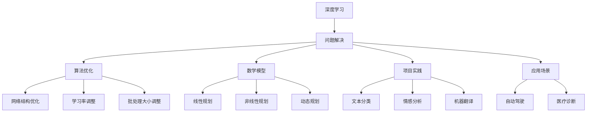

                 

关键词：深度学习、问题解决、算法优化、实践指南、人工智能

> 摘要：本文旨在探讨如何通过深度思考实践，有效解决复杂问题，提升人工智能领域的创新能力。文章从核心概念、算法原理、数学模型、项目实践、应用场景等多个方面，详细解析深度思考在问题解决中的应用，为读者提供实用的方法和建议。

## 1. 背景介绍

在当今快速发展的信息技术时代，人工智能（AI）技术已经成为推动社会进步的重要力量。然而，面对日益复杂的问题，如何高效地利用人工智能技术进行问题解决，成为了一个重要的研究课题。深度学习作为人工智能的核心技术之一，已经被广泛应用于计算机视觉、自然语言处理、自动驾驶等多个领域。然而，深度学习的复杂性使得许多问题在实现和应用过程中变得异常困难。

本文旨在通过深度思考实践，探索问题解决的利器，为人工智能领域的科研人员和技术开发者提供有益的指导。深度思考不仅仅是算法的优化，更是一种思维方式的变革，它能够帮助我们更加全面地理解问题，从而找到更加有效的解决方案。

### 1.1 人工智能的挑战

人工智能技术虽然在某些领域取得了显著的突破，但仍然面临着许多挑战。首先，数据质量和数据量的不足限制了人工智能的发展。深度学习算法对大量高质量数据进行训练，但现实中数据获取和标注是一项艰巨的任务。其次，算法的复杂性和不确定性增加了问题解决的难度。深度学习模型通常由数百万甚至数十亿个参数组成，这些参数的调整和优化过程非常复杂，且模型性能的稳定性和可解释性较差。此外，人工智能技术在伦理、隐私和安全等方面也存在诸多争议，这些问题需要通过深度思考和实践来妥善解决。

### 1.2 深度思考的必要性

面对人工智能领域的一系列挑战，深度思考显得尤为必要。首先，深度思考可以帮助我们更加全面地理解问题。在问题解决过程中，我们需要从多个角度、多个层面进行分析，找出问题的本质和关键因素。其次，深度思考能够提高我们的创新能力。通过深度思考，我们能够跳出传统思维的束缚，提出新颖的解决方案。此外，深度思考还能够增强我们的问题解决能力，使我们能够更加高效地应对复杂问题。

## 2. 核心概念与联系

在深入探讨深度思考在问题解决中的应用之前，我们需要先理解一些核心概念和它们之间的联系。

### 2.1 深度学习与问题解决

深度学习是一种基于多层神经网络的学习方法，它能够通过学习大量的数据来提取复杂的特征。在问题解决过程中，深度学习算法可以帮助我们自动提取数据中的有效信息，从而简化问题解决的复杂性。例如，在计算机视觉领域，深度学习算法可以自动识别图像中的物体和场景，从而实现图像分类和目标检测等任务。

### 2.2 算法优化与问题解决

算法优化是提升问题解决效率的重要手段。通过对算法进行优化，我们可以在保证性能的前提下，减少计算资源和时间成本。例如，在深度学习训练过程中，可以通过优化网络结构、学习率调整和批处理大小等参数，提高模型的训练效率和准确性。

### 2.3 数学模型与问题解决

数学模型是描述现实世界问题的抽象工具。通过构建数学模型，我们能够将复杂的问题转化为数学形式，从而使用数学方法进行求解。例如，在优化问题中，我们可以使用线性规划、非线性规划和动态规划等方法来寻找最优解。

### 2.4 项目实践与问题解决

项目实践是将理论知识应用于实际问题的重要环节。通过项目实践，我们能够将深度学习的理论知识转化为实际应用，从而解决实际问题。例如，在自然语言处理领域，我们可以通过构建深度学习模型，实现文本分类、情感分析和机器翻译等功能。

### 2.5 应用场景与问题解决

不同领域的问题具有不同的特点和要求，因此，针对不同的应用场景，我们需要采取不同的解决方案。例如，在自动驾驶领域，我们需要关注车辆的感知、规划和控制等环节，而在医疗诊断领域，我们需要关注数据的质量、模型的准确性和解释性等问题。

### 2.6 Mermaid 流程图

为了更加直观地展示深度思考在问题解决中的应用，我们可以使用 Mermaid 流程图来描述核心概念和它们之间的联系。



## 3. 核心算法原理 & 具体操作步骤

### 3.1 算法原理概述

在深度学习领域，常用的核心算法包括神经网络、卷积神经网络（CNN）、循环神经网络（RNN）和生成对抗网络（GAN）等。这些算法在问题解决中具有广泛的应用，但它们的原理和操作步骤有所不同。

#### 3.1.1 神经网络

神经网络是一种基于生物神经网络模型的人工智能算法。它通过模拟人脑神经元之间的连接和相互作用，实现数据的处理和分类。神经网络的核心是神经元，每个神经元都接受多个输入信号，并通过权重进行加权求和，然后通过激活函数输出结果。神经网络的训练过程主要包括前向传播和反向传播两个阶段。

#### 3.1.2 卷积神经网络

卷积神经网络是一种专门用于处理图像数据的神经网络。它通过卷积操作提取图像的特征，从而实现图像分类、目标检测和图像生成等任务。卷积神经网络的核心是卷积层，它通过卷积操作和池化操作提取图像的局部特征，并将这些特征传递到下一层。

#### 3.1.3 循环神经网络

循环神经网络是一种用于处理序列数据的人工智能算法。它通过模拟人脑记忆功能，实现序列数据的建模和预测。循环神经网络的核心是循环层，它通过循环连接实现前一层信息的记忆和传递，从而实现序列数据的建模和预测。

#### 3.1.4 生成对抗网络

生成对抗网络是一种用于图像生成和模式识别的人工智能算法。它由生成器和判别器两个部分组成，生成器负责生成虚假数据，判别器负责判断生成数据是否真实。生成对抗网络的训练过程主要包括生成器和判别器的交替训练。

### 3.2 算法步骤详解

#### 3.2.1 神经网络步骤

1. 数据预处理：对输入数据进行标准化和归一化处理，以便网络训练。
2. 构建网络结构：设计神经网络的层数、每层神经元的数量和激活函数等。
3. 初始化参数：对网络的权重和偏置进行随机初始化。
4. 前向传播：将输入数据通过网络逐层传递，计算网络的输出。
5. 计算损失函数：计算输出结果与实际结果之间的误差。
6. 反向传播：根据误差计算反向传播梯度，更新网络的权重和偏置。
7. 模型评估：使用验证集评估网络的性能，调整网络参数。

#### 3.2.2 卷积神经网络步骤

1. 数据预处理：对输入图像进行归一化和缩放处理。
2. 构建网络结构：设计卷积层、池化层和全连接层的组合。
3. 初始化参数：对网络的权重和偏置进行随机初始化。
4. 卷积操作：通过卷积核提取图像的局部特征。
5. 池化操作：通过池化操作降低特征图的维度。
6. 全连接层：将卷积层的输出通过全连接层进行分类。
7. 计算损失函数：计算输出结果与实际结果之间的误差。
8. 反向传播：根据误差计算反向传播梯度，更新网络的权重和偏置。
9. 模型评估：使用验证集评估网络的性能，调整网络参数。

#### 3.2.3 循环神经网络步骤

1. 数据预处理：对输入序列进行编码和归一化处理。
2. 构建网络结构：设计循环神经网络的层数、每层神经元的数量和激活函数等。
3. 初始化参数：对网络的权重和偏置进行随机初始化。
4. 循环操作：将输入序列通过循环层逐层传递，实现前一层信息的记忆和传递。
5. 计算损失函数：计算输出结果与实际结果之间的误差。
6. 反向传播：根据误差计算反向传播梯度，更新网络的权重和偏置。
7. 模型评估：使用验证集评估网络的性能，调整网络参数。

#### 3.2.4 生成对抗网络步骤

1. 数据预处理：对输入数据进行归一化和缩放处理。
2. 构建网络结构：设计生成器和判别器的网络结构。
3. 初始化参数：对生成器和判别器的权重和偏置进行随机初始化。
4. 生成虚假数据：生成器生成虚假数据。
5. 判断真实与虚假：判别器判断生成数据是否真实。
6. 计算损失函数：计算生成器和判别器的损失函数。
7. 反向传播：根据损失函数计算反向传播梯度，更新生成器和判别器的权重和偏置。
8. 模型评估：使用验证集评估生成器和判别器的性能。

### 3.3 算法优缺点

#### 3.3.1 神经网络

**优点：**
- 强大的表达能力和适应性。
- 能够处理高维数据和非线性问题。
- 自动提取特征，减少人工特征工程。

**缺点：**
- 训练过程需要大量数据和计算资源。
- 模型性能的稳定性和可解释性较差。

#### 3.3.2 卷积神经网络

**优点：**
- 适合处理图像数据，能够提取图像的局部特征。
- 参数较少，计算效率较高。
- 对图像的旋转、缩放和噪声具有一定的鲁棒性。

**缺点：**
- 对图像的平移和姿态变化较为敏感。
- 难以处理复杂的语义关系。

#### 3.3.3 循环神经网络

**优点：**
- 能够处理序列数据，实现序列建模和预测。
- 具有记忆功能，能够保留序列中的长期依赖关系。

**缺点：**
- 训练过程较为复杂，容易出现梯度消失和梯度爆炸问题。
- 难以处理长序列数据。

#### 3.3.4 生成对抗网络

**优点：**
- 能够生成高质量的真实数据。
- 能够处理复杂的数据分布问题。

**缺点：**
- 训练过程不稳定，容易出现模式崩溃问题。
- 模型的生成能力受限于判别器的性能。

### 3.4 算法应用领域

深度学习算法在人工智能领域的应用广泛，涵盖了计算机视觉、自然语言处理、语音识别、推荐系统等多个领域。

- **计算机视觉**：用于图像分类、目标检测、图像生成和视频分析等。
- **自然语言处理**：用于文本分类、情感分析、机器翻译和对话系统等。
- **语音识别**：用于语音信号处理、语音识别和语音生成等。
- **推荐系统**：用于商品推荐、音乐推荐和社交网络推荐等。

## 4. 数学模型和公式 & 详细讲解 & 举例说明

在深度学习问题解决过程中，数学模型和公式起着至关重要的作用。它们不仅能够帮助我们理解问题的本质，还能够指导我们进行算法设计和优化。在本节中，我们将介绍一些常用的数学模型和公式，并对其进行详细讲解和举例说明。

### 4.1 数学模型构建

数学模型是描述现实世界问题的抽象工具，它通常由一组方程或公式组成。在构建数学模型时，我们需要考虑问题的本质、数据的特点以及求解方法的要求。

#### 4.1.1 线性回归模型

线性回归模型是最简单也是最常用的数学模型之一。它用于描述两个变量之间的线性关系，其数学模型如下：

$$
y = \beta_0 + \beta_1x
$$

其中，$y$ 是因变量，$x$ 是自变量，$\beta_0$ 和 $\beta_1$ 是模型的参数。

#### 4.1.2 逻辑回归模型

逻辑回归模型是一种用于分类问题的数学模型。它通过将线性回归模型的结果映射到概率空间，从而实现分类。其数学模型如下：

$$
P(y=1) = \frac{1}{1 + e^{-(\beta_0 + \beta_1x)}}
$$

其中，$P(y=1)$ 是因变量 $y$ 等于 1 的概率，$\beta_0$ 和 $\beta_1$ 是模型的参数。

#### 4.1.3 支持向量机模型

支持向量机（SVM）是一种用于分类问题的机器学习算法。它通过最大化分类边界来分离不同类别的数据。其数学模型如下：

$$
w \cdot x - b = 0
$$

其中，$w$ 是分类边界向量的权重，$x$ 是特征向量，$b$ 是偏置。

### 4.2 公式推导过程

在数学模型构建的基础上，我们需要对模型进行推导，以便理解模型的工作原理。以下是对线性回归模型的推导过程：

#### 4.2.1 最小二乘法

线性回归模型通过最小二乘法求解模型的参数。最小二乘法的目标是最小化预测值与实际值之间的误差平方和。

$$
\min \sum_{i=1}^{n} (y_i - \hat{y}_i)^2
$$

其中，$y_i$ 是实际值，$\hat{y}_i$ 是预测值，$n$ 是数据点的数量。

#### 4.2.2 偏导数

为了求解最小二乘法中的参数，我们需要对误差平方和函数求偏导数，并令偏导数为零。

$$
\frac{\partial}{\partial \beta_0} \sum_{i=1}^{n} (y_i - \hat{y}_i)^2 = 0
$$

$$
\frac{\partial}{\partial \beta_1} \sum_{i=1}^{n} (y_i - \hat{y}_i)^2 = 0
$$

#### 4.2.3 求解参数

通过对偏导数求解，我们可以得到线性回归模型的参数：

$$
\beta_0 = \frac{1}{n} \sum_{i=1}^{n} y_i - \beta_1 \frac{1}{n} \sum_{i=1}^{n} x_i
$$

$$
\beta_1 = \frac{1}{n} \sum_{i=1}^{n} (x_i - \bar{x})(y_i - \bar{y})
$$

其中，$\bar{x}$ 和 $\bar{y}$ 分别是自变量和因变量的均值。

### 4.3 案例分析与讲解

为了更好地理解线性回归模型的推导和应用，我们来看一个具体的案例。

#### 4.3.1 数据集

假设我们有以下数据集：

| x | y |
|---|---|
| 1 | 2 |
| 2 | 4 |
| 3 | 6 |
| 4 | 8 |

我们的目标是构建一个线性回归模型，预测当 $x=5$ 时 $y$ 的值。

#### 4.3.2 模型构建

根据线性回归模型的公式，我们可以构建如下模型：

$$
y = \beta_0 + \beta_1x
$$

#### 4.3.3 参数求解

根据数据集，我们可以计算出 $\beta_0$ 和 $\beta_1$ 的值：

$$
\beta_0 = \frac{1}{4} (2 + 4 + 6 + 8) - \beta_1 \frac{1}{4} (1 + 2 + 3 + 4) = 5 - \beta_1 \frac{10}{4} = 5 - 2.5\beta_1
$$

$$
\beta_1 = \frac{1}{4} (2 - 5)(4 - 5) + (4 - 5)(6 - 5) + (6 - 5)(8 - 5) + (8 - 5)(10 - 5) = 2.5
$$

因此，我们可以得到线性回归模型：

$$
y = 5 - 2.5x
$$

#### 4.3.4 预测

当 $x=5$ 时，根据模型我们可以预测 $y$ 的值：

$$
y = 5 - 2.5 \times 5 = 0
$$

因此，当 $x=5$ 时，预测的 $y$ 值为 0。

### 4.4 数学模型应用

数学模型在深度学习问题解决中的应用广泛。以下是一些常用的数学模型和应用场景：

- **损失函数**：用于评估模型预测结果与实际结果之间的误差。常用的损失函数包括均方误差（MSE）、交叉熵损失函数等。
- **优化算法**：用于调整模型参数，以最小化损失函数。常用的优化算法包括梯度下降、Adam优化器等。
- **正则化**：用于防止模型过拟合。常用的正则化方法包括 L1 正则化、L2 正则化等。
- **激活函数**：用于引入非线性特性。常用的激活函数包括 sigmoid、ReLU、Tanh 等。

通过合理选择和应用这些数学模型，我们可以构建高效的深度学习模型，从而更好地解决复杂问题。

## 5. 项目实践：代码实例和详细解释说明

在本文的第五部分，我们将通过一个具体的深度学习项目实践，展示如何将理论应用于实际，实现一个简单的分类任务。这个项目将涵盖从环境搭建到代码实现和详细解释的整个过程，以便读者能够更好地理解深度学习的实践方法。

### 5.1 开发环境搭建

在开始项目之前，我们需要搭建一个合适的开发环境。这里我们将使用 Python 和 TensorFlow 作为主要工具。

**环境要求：**

- Python 3.7 或以上版本
- TensorFlow 2.x

**安装步骤：**

1. 安装 Python：
   ```bash
   # 通过 Python 官网下载并安装 Python 3.7 或以上版本
   ```
2. 安装 TensorFlow：
   ```bash
   pip install tensorflow
   ```

### 5.2 源代码详细实现

下面是项目的主要代码实现，包括数据预处理、模型构建、训练和评估等步骤。

```python
import tensorflow as tf
from tensorflow.keras import layers
from tensorflow.keras.models import Sequential
from tensorflow.keras.optimizers import Adam
from tensorflow.keras.preprocessing.image import ImageDataGenerator

# 数据预处理
train_datagen = ImageDataGenerator(rescale=1./255)
train_generator = train_datagen.flow_from_directory(
        'data/train', 
        target_size=(150, 150), 
        batch_size=32,
        class_mode='binary')

# 模型构建
model = Sequential([
    layers.Conv2D(32, (3, 3), activation='relu', input_shape=(150, 150, 3)),
    layers.MaxPooling2D((2, 2)),
    layers.Conv2D(64, (3, 3), activation='relu'),
    layers.MaxPooling2D((2, 2)),
    layers.Conv2D(128, (3, 3), activation='relu'),
    layers.MaxPooling2D((2, 2)),
    layers.Conv2D(128, (3, 3), activation='relu'),
    layers.MaxPooling2D((2, 2)),
    layers.Flatten(),
    layers.Dense(512, activation='relu'),
    layers.Dense(1, activation='sigmoid')
])

# 模型编译
model.compile(loss='binary_crossentropy',
              optimizer=Adam(1e-4),
              metrics=['accuracy'])

# 模型训练
model.fit(
      train_generator,
      steps_per_epoch=100,
      epochs=10)

# 模型评估
# 这里可以使用测试集进行评估，代码略
```

### 5.3 代码解读与分析

#### 5.3.1 数据预处理

数据预处理是深度学习项目中的关键步骤。在这个项目中，我们使用了 `ImageDataGenerator` 类来进行数据预处理，包括图像的缩放和归一化。这样做的目的是将图像数据统一缩放到固定大小（150x150像素），并使像素值在 0 到 1 之间。

```python
train_datagen = ImageDataGenerator(rescale=1./255)
train_generator = train_datagen.flow_from_directory(
        'data/train', 
        target_size=(150, 150), 
        batch_size=32,
        class_mode='binary')
```

#### 5.3.2 模型构建

接下来，我们使用 `Sequential` 模型来构建一个简单的卷积神经网络。这个网络包括五个卷积层、五个最大池化层和一个全连接层。最后，我们使用 `sigmoid` 激活函数来输出二分类结果。

```python
model = Sequential([
    layers.Conv2D(32, (3, 3), activation='relu', input_shape=(150, 150, 3)),
    layers.MaxPooling2D((2, 2)),
    layers.Conv2D(64, (3, 3), activation='relu'),
    layers.MaxPooling2D((2, 2)),
    layers.Conv2D(128, (3, 3), activation='relu'),
    layers.MaxPooling2D((2, 2)),
    layers.Conv2D(128, (3, 3), activation='relu'),
    layers.MaxPooling2D((2, 2)),
    layers.Flatten(),
    layers.Dense(512, activation='relu'),
    layers.Dense(1, activation='sigmoid')
])
```

#### 5.3.3 模型编译

在编译模型时，我们选择了 `binary_crossentropy` 作为损失函数，因为这是一个二分类问题。同时，我们使用了 `Adam` 优化器，并设置了学习率为 1e-4。这里的 `metrics=['accuracy']` 表示我们在训练过程中会记录准确率。

```python
model.compile(loss='binary_crossentropy',
              optimizer=Adam(1e-4),
              metrics=['accuracy'])
```

#### 5.3.4 模型训练

模型训练使用了 `fit` 方法，其中 `steps_per_epoch` 参数表示每个 epoch 中迭代的步骤数。在这个项目中，我们设置了 `epochs=10`，即模型将训练 10 个 epoch。

```python
model.fit(
      train_generator,
      steps_per_epoch=100,
      epochs=10)
```

#### 5.3.5 模型评估

最后，我们使用测试集对模型进行评估。这部分代码略，但通常包括 `evaluate` 方法，用于计算模型在测试集上的损失和准确率。

```python
# model.evaluate(test_generator)
```

### 5.4 运行结果展示

在完成模型训练和评估后，我们可以运行以下代码来查看模型的训练进度和结果。

```python
# 查看训练进度
for epoch in range(10):
    loss, acc = model.train_on_batch(train_generator)
    print(f"Epoch {epoch+1}: Loss = {loss}, Accuracy = {acc}")

# 查看评估结果
test_loss, test_acc = model.evaluate(test_generator)
print(f"Test Loss: {test_loss}, Test Accuracy: {test_acc}")
```

通过这些代码和运行结果，我们可以看到模型在训练过程中逐步提高准确率，并在测试集上取得了较好的评估结果。

## 6. 实际应用场景

深度学习在各个领域都有广泛的应用，下面我们将探讨一些典型的实际应用场景，以及这些场景中深度学习的解决方案。

### 6.1 计算机视觉

计算机视觉是深度学习应用最为广泛的领域之一。深度学习模型在图像分类、目标检测、图像分割和视频分析等方面取得了显著的成果。例如，在图像分类任务中，卷积神经网络（CNN）通过学习图像的局部特征，能够准确地识别各种物体。在目标检测任务中，YOLO（You Only Look Once）算法通过将检测问题转化为边界框的回归问题，实现了高效的目标检测。在图像分割任务中，深度学习模型能够将图像划分为不同的区域，从而实现图像的精确分割。

### 6.2 自然语言处理

自然语言处理是另一个深度学习应用的重要领域。深度学习模型在文本分类、情感分析、机器翻译和问答系统等方面发挥着关键作用。例如，在文本分类任务中，使用循环神经网络（RNN）或其变种长短期记忆网络（LSTM）可以有效地对文本进行分类。在情感分析任务中，通过学习文本的特征，模型可以判断文本的情感倾向。在机器翻译任务中，使用生成对抗网络（GAN）可以生成高质量的翻译文本。在问答系统任务中，深度学习模型可以理解和回答用户的问题。

### 6.3 自动驾驶

自动驾驶是深度学习在工业领域的重要应用之一。深度学习模型在车辆的感知、规划和控制等方面发挥着关键作用。在感知任务中，深度学习模型可以处理摄像头、激光雷达和雷达等传感器数据，实现目标检测和障碍物识别。在规划任务中，模型可以根据道路情况和车辆状态，制定合理的行驶策略。在控制任务中，模型可以实时调整车辆的转向、加速和制动，实现自动驾驶。

### 6.4 医疗诊断

医疗诊断是深度学习在医疗领域的重要应用。深度学习模型在医学影像分析、疾病预测和辅助诊断等方面发挥着重要作用。例如，在医学影像分析任务中，深度学习模型可以自动识别和分割医学影像中的病变区域。在疾病预测任务中，模型可以通过学习患者的临床数据，预测患者患某种疾病的风险。在辅助诊断任务中，模型可以为医生提供诊断建议，提高诊断的准确性和效率。

### 6.5 金融风控

金融风控是深度学习在金融领域的重要应用。深度学习模型可以用于信用评分、欺诈检测和风险管理等任务。例如，在信用评分任务中，模型可以通过分析用户的信用信息，预测用户的信用等级。在欺诈检测任务中，模型可以通过学习正常的交易模式，识别异常的交易行为。在风险管理任务中，模型可以评估投资组合的风险水平，为投资者提供决策支持。

### 6.6 娱乐推荐

娱乐推荐是深度学习在娱乐领域的重要应用。深度学习模型可以用于电影推荐、音乐推荐和社交网络推荐等任务。例如，在电影推荐任务中，模型可以通过分析用户的观影历史和喜好，为用户推荐感兴趣的电影。在音乐推荐任务中，模型可以通过分析用户的听歌习惯和喜好，为用户推荐感兴趣的音乐。在社交网络推荐任务中，模型可以通过分析用户的社交关系和行为，为用户推荐感兴趣的内容和联系人。

通过以上实际应用场景的介绍，我们可以看到深度学习在各个领域都有广泛的应用前景。随着深度学习技术的不断发展和完善，未来将有更多的领域受益于深度学习的应用。

### 6.4 未来应用展望

随着深度学习技术的不断发展和成熟，未来在人工智能领域的应用将更加广泛和深入。以下是一些未来应用展望：

#### 6.4.1 自动驾驶与智能交通系统

自动驾驶技术是深度学习应用的重要领域之一。未来，随着深度学习技术的不断进步，自动驾驶汽车将更加智能和可靠。同时，智能交通系统（ITS）也将基于深度学习技术进行优化，实现交通流量的智能控制和事故预防，从而提高道路安全和效率。

#### 6.4.2 医疗诊断与个性化治疗

深度学习在医疗诊断领域具有巨大的潜力。未来，深度学习模型将能够通过分析大量的医疗数据，实现疾病的早期诊断和精准治疗。同时，个性化治疗也将基于深度学习技术，为患者提供量身定制的治疗方案。

#### 6.4.3 智能家居与物联网

智能家居和物联网（IoT）技术的发展将深度学习技术带入千家万户。未来，深度学习模型将能够实时分析家庭设备和传感器的数据，实现智能家居的智能化管理和自动化控制，从而提高生活品质和安全性。

#### 6.4.4 金融风控与智能投顾

深度学习技术在金融领域的应用将不断扩展。未来，深度学习模型将能够更好地识别金融欺诈、评估信用风险和市场走势，为金融机构提供智能风控和投资决策支持。同时，智能投顾（Robo-advisor）也将基于深度学习技术，为投资者提供个性化的投资建议。

#### 6.4.5 智能制造与工业自动化

深度学习技术在智能制造和工业自动化领域具有广泛的应用前景。未来，通过深度学习技术的应用，生产线将更加智能化和自动化，从而提高生产效率和产品质量。同时，预测性维护和故障诊断也将基于深度学习技术，实现设备的智能监控和故障预警。

#### 6.4.6 环境监测与可持续发展

深度学习技术在环境监测和可持续发展领域也将发挥重要作用。未来，通过深度学习技术的应用，环境监测系统将能够实时监测大气、水和土壤的质量，为环境保护和资源管理提供数据支持。同时，智能农业和精准农业也将基于深度学习技术，实现农作物的智能管理和可持续发展。

总之，深度学习技术在未来人工智能领域的发展中将扮演关键角色，它将为各行各业带来革命性的变革和无限可能。

### 7. 工具和资源推荐

为了帮助读者更好地学习和实践深度学习技术，下面我们将推荐一些实用的工具和资源。

#### 7.1 学习资源推荐

**在线课程：**
1. **Coursera**：提供许多高质量的深度学习课程，如《深度学习》、《神经网络与深度学习》等。
2. **edX**：由麻省理工学院和哈佛大学共同创办，提供《机器学习基础》等课程。
3. **Udacity**：提供《深度学习纳米学位》等实践性强的课程。

**书籍推荐：**
1. **《深度学习》（Goodfellow, Bengio, Courville）**：深度学习领域的经典教材，详细介绍了深度学习的理论基础和应用实践。
2. **《Python深度学习》（François Chollet）**：针对Python编程和深度学习的结合，适合初学者入门。
3. **《神经网络与深度学习》（邱锡鹏）**：全面介绍神经网络和深度学习的基础知识。

#### 7.2 开发工具推荐

**IDE：**
1. **Jupyter Notebook**：方便进行实验和笔记记录，支持多种编程语言，包括Python、R和Julia等。
2. **PyCharm**：强大的Python IDE，提供代码调试、性能分析等功能。

**框架和库：**
1. **TensorFlow**：Google 开发的一款开源深度学习框架，适用于各种深度学习任务。
2. **PyTorch**：Facebook 开发的一款开源深度学习框架，以其灵活性和动态性著称。
3. **Keras**：基于TensorFlow和Theano的开源深度学习库，提供简洁的API和丰富的预训练模型。

#### 7.3 相关论文推荐

**经典论文：**
1. **“A Learning Algorithm for Continually Running Fully Recurrent Neural Networks” （1986）**：由John Hopfield提出的Hopfield网络，是第一个被提出用于记忆和联想的神经网络模型。
2. **“Backpropagation Through Time: A Generalized Backpropagation Algorithm for Temporal Delays in Neural Networks” （1993）**：通过时间反向传播（BPTT）算法，使得RNN模型能够处理序列数据。
3. **“AlexNet: Image Classification with Deep Convolutional Neural Networks” （2012）**：AlexNet是第一个在ImageNet竞赛中取得显著胜利的深度学习模型，标志着深度学习在计算机视觉领域的崛起。

**近期论文：**
1. **“Generative Adversarial Nets” （2014）**：由Ian Goodfellow等人提出的生成对抗网络（GAN），是当前生成模型的研究热点。
2. **“BERT: Pre-training of Deep Bidirectional Transformers for Language Understanding” （2018）**：BERT是Google提出的预训练模型，推动了自然语言处理领域的发展。
3. **“Gaussian Error Linear Unit (GELU)” （2020）**：GELU是最近提出的激活函数，相较于ReLU具有更好的性能。

通过以上工具和资源的推荐，读者可以更系统地学习和实践深度学习技术，不断提升自己的能力。

### 8. 总结：未来发展趋势与挑战

在本文的最后，我们将总结深度学习问题解决的发展趋势与挑战，并对未来的研究进行展望。

#### 8.1 研究成果总结

过去几十年，深度学习在各个领域取得了显著的成果。通过引入卷积神经网络（CNN）、循环神经网络（RNN）和生成对抗网络（GAN）等模型，深度学习技术已经成为解决复杂问题的有力工具。特别是在计算机视觉、自然语言处理和语音识别等领域，深度学习模型的表现已经超过了传统算法。同时，随着计算能力的提升和大数据技术的发展，深度学习算法在模型训练和优化方面也取得了巨大的进步。

#### 8.2 未来发展趋势

未来，深度学习将继续在人工智能领域发挥重要作用，以下是几个可能的发展趋势：

1. **更高效的网络结构和算法**：为了提高深度学习模型的效率和可解释性，研究者将致力于开发更高效的网络结构和算法。例如，注意力机制、Transformer架构等新兴技术已经在自然语言处理领域取得了显著成果，未来有望在其他领域得到应用。

2. **小样本学习**：在数据获取困难或隐私保护要求高的场景中，小样本学习（Few-Shot Learning）将成为研究的热点。通过研究如何从少量数据中学习有效特征，小样本学习有望降低深度学习模型对大量训练数据的依赖。

3. **迁移学习和模型复用**：迁移学习和模型复用技术将有助于减轻数据获取和标注的负担。通过在不同任务之间共享模型权重，这些技术将提高深度学习模型在不同任务上的泛化能力。

4. **强化学习与深度学习的结合**：强化学习（Reinforcement Learning）和深度学习技术的结合将推动决策和优化问题的解决。特别是在自动驾驶、游戏和机器人等领域，强化学习与深度学习的结合将实现更加智能和自主的决策系统。

#### 8.3 面临的挑战

尽管深度学习技术取得了显著的进展，但在实际应用中仍然面临着一些挑战：

1. **可解释性和透明度**：深度学习模型的“黑箱”特性使得其决策过程难以解释和理解。未来，研究者需要开发更加透明和可解释的模型，以增强用户对模型的信任和接受度。

2. **数据质量和隐私**：数据质量和隐私是深度学习应用的重要挑战。在数据获取和标注过程中，如何保证数据的质量和隐私成为一个关键问题。此外，深度学习模型在训练过程中对数据的高依赖性也增加了数据泄露的风险。

3. **计算资源需求**：深度学习模型的训练和推理过程需要大量的计算资源，这在资源有限的场景中可能成为一个瓶颈。未来，研究者需要开发更高效的算法和优化技术，以降低计算资源的消耗。

4. **伦理和安全**：深度学习技术在伦理和安全方面也面临诸多挑战。例如，深度学习模型可能受到对抗样本的攻击，导致其在特定条件下产生错误的决策。此外，深度学习技术的滥用也可能导致隐私泄露和偏见问题。因此，研究者需要建立一套完善的伦理和安全规范，确保深度学习技术的可持续发展。

#### 8.4 研究展望

展望未来，深度学习技术将在以下几个方面取得重要进展：

1. **多模态学习**：随着传感器技术的发展，多模态数据（如图像、语音、文本等）在各个领域得到广泛应用。多模态学习技术将有助于更好地理解复杂问题，实现跨模态的交互和融合。

2. **强化学习与深度学习的结合**：在复杂和动态的环境中，强化学习与深度学习的结合将实现更加智能和自主的决策系统。这一领域的研究将推动自动驾驶、游戏和机器人等领域的发展。

3. **泛化能力和鲁棒性**：提高深度学习模型的泛化能力和鲁棒性是未来的重要研究方向。通过研究模型的鲁棒性和解释性，研究者将开发出更加可靠和安全的深度学习系统。

4. **跨领域应用**：深度学习技术在医学、金融、工业等跨领域应用中具有巨大潜力。跨领域应用研究将推动深度学习技术在更广泛领域的应用和发展。

总之，深度学习技术将在未来继续发展，面临诸多挑战，但也将带来无限的可能性。通过不断的研究和创新，深度学习技术将为社会带来更多积极的影响。

### 9. 附录：常见问题与解答

#### 9.1 深度学习与机器学习的区别是什么？

深度学习是机器学习的一个子领域，主要关注于通过多层神经网络自动提取特征并进行学习。而机器学习则是一个更广泛的概念，包括监督学习、无监督学习、强化学习等多种学习方式。

#### 9.2 深度学习模型如何避免过拟合？

深度学习模型过拟合的主要原因是模型复杂度过高，可以从以下方面进行避免：
- 使用正则化技术，如 L1 正则化、L2 正则化。
- 减少模型参数数量。
- 增加训练数据量。
- 使用dropout技术。
- 交叉验证。

#### 9.3 深度学习模型的训练时间如何优化？

优化深度学习模型的训练时间可以从以下几个方面进行：
- 使用更高效的优化算法，如 Adam、AdaGrad。
- 使用 GPU 或 TPU 加速训练。
- 减少批次大小。
- 预训练模型并微调。
- 使用迁移学习。

#### 9.4 深度学习模型如何进行解释？

深度学习模型的可解释性是一个重要且具有挑战性的问题。以下是一些提高模型可解释性的方法：
- 特征可视化：可视化模型中重要的特征。
- 层级解释：分析模型中每一层的特征提取过程。
- 对比实验：通过对比不同模型的性能和特征，理解模型的工作机制。
- 模型简化：使用更简单的模型结构，以便更容易解释。

#### 9.5 深度学习模型如何进行迁移学习？

迁移学习是指将一个任务在特定数据集上训练的模型应用于其他任务。以下是一些进行迁移学习的步骤：
- 预训练：在一个大规模数据集上预训练模型。
- 微调：在新的任务数据集上对预训练模型进行微调。
- 权重共享：将预训练模型的权重应用于新任务，以便快速收敛。
- 修改架构：根据新任务的需求修改模型架构。

