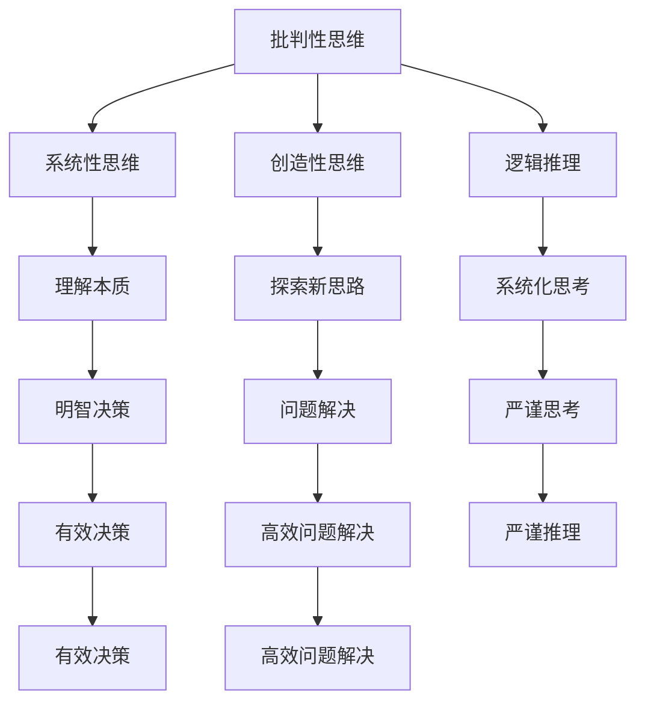

                 

在信息技术飞速发展的今天，我们面临着越来越多的数据和信息。然而，如何从这些海量数据中提取真正的价值，实现从表面现象到深层本质的转化，成为了一个关键问题。本文将深入探讨深度思考的意义，以及如何透过现象看到事物的本质。

## 文章关键词

- 深度思考
- 信息技术
- 数据分析
- 知识提取
- 事物本质

## 文章摘要

本文旨在探讨深度思考在信息技术领域的重要性。通过分析数据、挖掘知识，我们能够超越表面现象，揭示事物的本质。文章将介绍深度思考的核心概念，探讨其应用场景，并提供实用的方法论，帮助读者提升深度思考能力。

## 1. 背景介绍

随着互联网和大数据技术的飞速发展，我们每天都被大量的信息所包围。从社交媒体到新闻报道，从商业数据到科学文献，信息量呈指数级增长。然而，这些信息并不总是有价值的。相反，很多时候，它们只是表面现象，掩盖了背后的真实本质。

### 1.1 信息爆炸的挑战

信息爆炸带来了以下几个挑战：

1. **信息过载**：我们每天接收到的信息量已经远远超出了人类处理的能力，导致信息过载。
2. **表面现象**：大量的信息往往只展示了事物的表面，而非其本质。
3. **误判和误解**：在没有深入理解的情况下，我们很容易对信息产生误判和误解。

### 1.2 深度思考的必要性

为了应对上述挑战，我们需要进行深度思考。深度思考是一种超越表面现象，探索事物本质的思维过程。它能够帮助我们：

1. **理解信息的真实含义**：通过深度思考，我们能够挖掘信息的深层含义，理解其背后的逻辑和原因。
2. **做出更明智的决策**：只有理解了事物的本质，我们才能做出更明智的决策。
3. **提高问题解决能力**：深度思考能够帮助我们更有效地解决问题。

## 2. 核心概念与联系

在深入探讨深度思考的意义之前，我们需要了解一些核心概念和其相互之间的联系。

### 2.1 深度思考的核心概念

**深度思考**是一种复杂的思维过程，它涉及到以下几个核心概念：

1. **批判性思维**：批判性思维是指对信息进行质疑和分析，而不是盲目接受。
2. **系统性思维**：系统性思维是指从整体的角度来看待问题，而不是只关注局部。
3. **创造性思维**：创造性思维是指通过新颖的方法来解决问题，而不是采用常规的思维模式。
4. **逻辑推理**：逻辑推理是指通过推理来得出结论，而不是依靠直觉或猜测。

### 2.2 核心概念的相互联系

这些核心概念之间有着密切的联系。批判性思维是深度思考的基础，它能够帮助我们识别信息的真实性和可靠性。系统性思维则帮助我们理解事物之间的复杂关系，从而更好地把握事物的本质。创造性思维则为我们提供了探索新思路和新方法的能力，使得我们能够从不同角度看待问题。逻辑推理则是将这些思维过程系统化，使得我们的思考更加严谨和有效。

### 2.3 Mermaid 流程图



通过这个流程图，我们可以看到，批判性思维、系统性思维、创造性思维和逻辑推理共同构成了深度思考的核心，它们相互支持、相互促进，帮助我们更好地理解事物的本质，做出明智的决策，解决问题。

## 3. 核心算法原理 & 具体操作步骤

### 3.1 算法原理概述

深度思考的核心在于从大量信息中提取有价值的知识，从而揭示事物的本质。这一过程涉及到以下几个关键步骤：

1. **数据收集**：首先，我们需要收集与问题相关的数据。
2. **数据清洗**：数据收集后，我们需要对其进行清洗，去除无效和错误的数据。
3. **数据预处理**：接下来，我们需要对数据进行预处理，以便于后续的分析。
4. **特征提取**：从预处理后的数据中提取出关键特征。
5. **模型构建**：根据提取的特征构建合适的模型。
6. **模型训练**：使用训练数据对模型进行训练。
7. **模型评估**：评估模型的性能，调整参数以优化模型。
8. **知识提取**：使用训练好的模型对新的数据进行预测，提取有价值的信息。

### 3.2 算法步骤详解

**3.2.1 数据收集**

数据收集是深度思考的第一步。我们需要根据问题确定需要收集的数据类型和来源。例如，如果我们研究某个社交网络上的用户行为，我们需要收集用户发布的帖子、评论、点赞等数据。

**3.2.2 数据清洗**

数据清洗是确保数据质量的关键步骤。我们需要去除重复的数据、无效的数据，以及错误的数据。例如，如果某个用户的帖子中包含大量的空格或特殊字符，我们需要对其进行处理。

**3.2.3 数据预处理**

数据预处理包括数据的标准化、归一化、缺失值处理等。这些操作有助于提高数据的质量，使得数据更适合进行后续的分析。

**3.2.4 特征提取**

特征提取是从原始数据中提取出能够代表数据本质的信息。例如，在图像识别任务中，特征提取可能包括边缘检测、纹理分析等。

**3.2.5 模型构建**

模型构建是根据特征提取的结果选择合适的模型。例如，如果我们使用深度学习，我们可以选择卷积神经网络（CNN）。

**3.2.6 模型训练**

模型训练是使用训练数据来调整模型的参数，使得模型能够更好地拟合数据。这个过程通常涉及到优化算法、损失函数等。

**3.2.7 模型评估**

模型评估是测试模型性能的关键步骤。我们可以使用验证集来评估模型的性能，并根据评估结果调整模型。

**3.2.8 知识提取**

知识提取是使用训练好的模型对新的数据进行预测，从中提取有价值的信息。例如，在文本分类任务中，我们可以使用模型来预测新的文本属于哪个类别。

### 3.3 算法优缺点

**优点：**

1. **高效性**：深度思考算法能够从海量数据中快速提取有价值的信息。
2. **灵活性**：深度思考算法可以根据不同的任务需求进行调整。

**缺点：**

1. **计算资源消耗**：深度思考算法通常需要大量的计算资源。
2. **对数据质量的要求较高**：如果数据质量不好，模型的性能可能会受到影响。

### 3.4 算法应用领域

深度思考算法广泛应用于各个领域，包括：

1. **图像识别**：例如，人脸识别、物体识别等。
2. **自然语言处理**：例如，文本分类、情感分析等。
3. **推荐系统**：例如，个性化推荐、商品推荐等。
4. **金融领域**：例如，风险控制、市场预测等。

## 4. 数学模型和公式 & 详细讲解 & 举例说明

在深度思考的过程中，数学模型和公式起到了至关重要的作用。它们不仅帮助我们理解数据的内在规律，还能够帮助我们预测未来的趋势。本节将介绍一些常用的数学模型和公式，并进行详细讲解和举例说明。

### 4.1 数学模型构建

**4.1.1 线性回归模型**

线性回归模型是最基本的数学模型之一，用于预测一个连续的输出值。其公式如下：

$$
y = w_1x_1 + w_2x_2 + ... + w_nx_n + b
$$

其中，$y$ 是输出值，$w_1, w_2, ..., w_n$ 是权重，$x_1, x_2, ..., x_n$ 是输入值，$b$ 是偏置。

**4.1.2 逻辑回归模型**

逻辑回归模型用于预测一个二分类问题，其公式如下：

$$
P(y=1) = \frac{1}{1 + e^{-z}}
$$

其中，$z = w_1x_1 + w_2x_2 + ... + w_nx_n + b$，$P(y=1)$ 是输出值为1的概率。

**4.1.3 卷积神经网络（CNN）**

卷积神经网络是深度学习中最常用的模型之一，用于图像识别和分类。其基本结构包括卷积层、池化层和全连接层。

**4.1.4 循环神经网络（RNN）**

循环神经网络用于处理序列数据，其基本结构包括输入层、隐藏层和输出层。

### 4.2 公式推导过程

**4.2.1 线性回归模型的推导**

线性回归模型的目标是最小化预测值与实际值之间的误差。我们可以使用梯度下降法来优化模型参数。具体推导过程如下：

$$
\frac{\partial J}{\partial w_1} = -2(x_1 - \hat{y}_1)
$$

$$
\frac{\partial J}{\partial w_2} = -2(x_2 - \hat{y}_2)
$$

$$
\frac{\partial J}{\partial b} = -2(\hat{y}_1 - y_1)
$$

其中，$J$ 是损失函数，$\hat{y}$ 是预测值，$y$ 是实际值。

**4.2.2 逻辑回归模型的推导**

逻辑回归模型的推导与线性回归类似，具体过程如下：

$$
\frac{\partial J}{\partial w_1} = -2(y - \hat{y})
$$

$$
\frac{\partial J}{\partial w_2} = -2(x_2 - \hat{y}_2)
$$

$$
\frac{\partial J}{\partial b} = -2(\hat{y}_1 - y_1)
$$

其中，$J$ 是损失函数，$\hat{y}$ 是预测值，$y$ 是实际值。

**4.2.3 CNN 的推导**

CNN 的推导涉及到卷积操作、激活函数和池化操作。具体推导过程如下：

$$
h_{ij} = \sum_{k=1}^{n} w_{ik} * g_{kj}
$$

其中，$h_{ij}$ 是输出值，$w_{ik}$ 是卷积核，$g_{kj}$ 是输入值，$*$ 表示卷积操作。

### 4.3 案例分析与讲解

**4.3.1 图像识别**

假设我们有一个图像识别任务，输入图像为 $28 \times 28$ 的像素矩阵，输出类别为数字 0 到 9。我们可以使用 CNN 来解决这个问题。

首先，我们将输入图像进行预处理，然后通过多个卷积层和池化层提取特征。最后，使用全连接层进行分类。

**4.3.2 自然语言处理**

假设我们有一个文本分类任务，输入文本为一段句子，输出类别为不同的主题。我们可以使用 RNN 来解决这个问题。

首先，我们将输入文本转化为词向量，然后通过 RNN 提取句子特征。最后，使用全连接层进行分类。

## 5. 项目实践：代码实例和详细解释说明

在本节中，我们将通过一个具体的代码实例来展示如何进行深度思考，并详细解释代码的实现过程。

### 5.1 开发环境搭建

为了进行深度学习实践，我们需要搭建一个开发环境。以下是搭建步骤：

1. 安装 Python 3.8 或更高版本。
2. 安装 TensorFlow 或 PyTorch。
3. 安装 Jupyter Notebook。

### 5.2 源代码详细实现

下面是一个简单的深度学习模型的实现，用于图像识别任务。

```python
import tensorflow as tf
from tensorflow.keras import layers

# 定义模型
model = tf.keras.Sequential([
    layers.Conv2D(32, (3, 3), activation='relu', input_shape=(28, 28, 1)),
    layers.MaxPooling2D((2, 2)),
    layers.Conv2D(64, (3, 3), activation='relu'),
    layers.MaxPooling2D((2, 2)),
    layers.Conv2D(64, (3, 3), activation='relu'),
    layers.Flatten(),
    layers.Dense(64, activation='relu'),
    layers.Dense(10, activation='softmax')
])

# 编译模型
model.compile(optimizer='adam',
              loss='sparse_categorical_crossentropy',
              metrics=['accuracy'])

# 加载数据集
mnist = tf.keras.datasets.mnist
(train_images, train_labels), (test_images, test_labels) = mnist.load_data()

# 预处理数据集
train_images = train_images.reshape((60000, 28, 28, 1))
test_images = test_images.reshape((10000, 28, 28, 1))

# 归一化数据
train_images, test_images = train_images / 255.0, test_images / 255.0

# 训练模型
model.fit(train_images, train_labels, epochs=5)

# 评估模型
test_loss, test_acc = model.evaluate(test_images,  test_labels, verbose=2)
print('\nTest accuracy:', test_acc)
```

### 5.3 代码解读与分析

1. **导入库**：我们首先导入 TensorFlow 和 Keras，这是深度学习的常用库。

2. **定义模型**：我们使用 Keras 的 Sequential 模型，依次添加卷积层（Conv2D）、最大池化层（MaxPooling2D）和全连接层（Dense）。

3. **编译模型**：我们使用 Adam 优化器和 sparse_categorical_crossentropy 损失函数来编译模型。

4. **加载数据集**：我们使用 TensorFlow 提供的 MNIST 数据集，这是一个常用的图像识别数据集。

5. **预处理数据集**：我们将图像进行重塑和归一化处理，使得图像数据更适合模型训练。

6. **训练模型**：我们使用训练数据集训练模型，设置训练轮数为 5。

7. **评估模型**：我们使用测试数据集评估模型的性能，打印出测试准确率。

通过这个代码实例，我们可以看到如何使用深度学习技术进行图像识别任务。这个实例展示了深度思考在项目实践中的应用，从数据收集、模型构建到模型训练和评估，每一步都需要深入思考。

## 6. 实际应用场景

深度思考在信息技术领域有着广泛的应用。以下是一些典型的实际应用场景：

### 6.1 图像识别

图像识别是深度思考在计算机视觉领域的重要应用。通过卷积神经网络（CNN）等深度学习技术，我们可以从大量图像中识别出特定的物体或特征。例如，人脸识别、物体识别、医疗图像分析等。

### 6.2 自然语言处理

自然语言处理（NLP）是另一个深度思考的重要应用领域。通过循环神经网络（RNN）和变换器（Transformer）等深度学习技术，我们可以对文本进行分析、理解、生成等。例如，文本分类、情感分析、机器翻译、自动摘要等。

### 6.3 推荐系统

推荐系统是深度思考在数据挖掘领域的重要应用。通过深度学习技术，我们可以从海量用户行为数据中提取出有效的特征，并构建推荐模型。例如，商品推荐、电影推荐、社交网络推荐等。

### 6.4 金融领域

金融领域是深度思考的重要应用领域。通过深度学习技术，我们可以对金融数据进行预测、分析和风险管理。例如，市场预测、风险控制、投资组合优化等。

### 6.5 智能医疗

智能医疗是深度思考在医疗领域的重要应用。通过深度学习技术，我们可以对医疗图像、病历数据等进行分析，辅助医生进行诊断和治疗。例如，医学图像分析、疾病预测、个性化治疗等。

## 7. 工具和资源推荐

为了更好地进行深度思考，我们需要使用一些高效的工具和资源。以下是一些推荐：

### 7.1 学习资源推荐

1. **《深度学习》（Deep Learning）**：这是一本经典教材，详细介绍了深度学习的理论基础和实践方法。
2. **《Python深度学习》（Python Deep Learning）**：这本书使用 Python 语言介绍了深度学习的实现，适合初学者。
3. **Coursera 和 edX**：这两个在线教育平台提供了大量的深度学习课程，涵盖从基础知识到高级应用的各个方面。

### 7.2 开发工具推荐

1. **TensorFlow**：这是 Google 开发的深度学习框架，广泛应用于工业界和学术界。
2. **PyTorch**：这是 Facebook AI 研究团队开发的深度学习框架，以其灵活性和高效性著称。
3. **Jupyter Notebook**：这是一个交互式计算环境，适合进行深度学习的实验和演示。

### 7.3 相关论文推荐

1. **"A Tutorial on Deep Learning"**：这是一篇介绍深度学习的经典教程，涵盖了深度学习的各个方面。
2. **"Deep Learning on Multi-Modal Data"**：这篇论文介绍了如何使用深度学习技术处理多模态数据。
3. **"Attention Is All You Need"**：这篇论文提出了 Transformer 模型，这是一种在自然语言处理中非常有效的深度学习模型。

## 8. 总结：未来发展趋势与挑战

随着信息技术的飞速发展，深度思考在各个领域中的应用越来越广泛。然而，我们也面临着一些挑战：

### 8.1 研究成果总结

1. **深度学习技术的快速发展**：卷积神经网络（CNN）、循环神经网络（RNN）、变换器（Transformer）等深度学习技术取得了显著的研究成果，推动了信息技术的进步。
2. **跨领域应用的深入**：深度思考不仅在计算机视觉、自然语言处理等领域取得了成功，还在金融、医疗、智能交通等领域得到了广泛应用。
3. **开源生态的繁荣**：TensorFlow、PyTorch、Jupyter Notebook 等开源工具和资源为深度学习研究提供了强大的支持。

### 8.2 未来发展趋势

1. **更高效的算法和模型**：未来，我们将继续看到更高效的算法和模型的提出，以应对日益增长的数据量和计算需求。
2. **跨学科的融合**：深度思考将与更多的学科领域结合，如心理学、认知科学等，以提供更全面的理解和解决方案。
3. **量子计算的崛起**：量子计算的发展将为深度学习带来新的机遇，使得大规模数据处理和计算变得更加高效。

### 8.3 面临的挑战

1. **数据隐私和安全**：随着数据量的增加，数据隐私和安全成为一个重要的挑战。我们需要确保数据的安全性和隐私性。
2. **算法的可解释性**：深度学习模型的黑箱性质使得其决策过程难以解释。提高算法的可解释性是未来研究的重要方向。
3. **计算资源的消耗**：深度学习算法通常需要大量的计算资源，这对于资源有限的场景来说是一个挑战。

### 8.4 研究展望

未来，深度思考将在信息技术领域发挥更加重要的作用。通过不断创新和突破，我们有望解决当前面临的挑战，实现从表面现象到深层本质的转化，为人类社会带来更多价值和福祉。

## 9. 附录：常见问题与解答

### 9.1 深度思考是什么？

深度思考是一种超越表面现象，探索事物本质的思维过程。它涉及到批判性思维、系统性思维、创造性思维和逻辑推理等多个方面。

### 9.2 深度思考有哪些应用领域？

深度思考在多个领域有着广泛应用，包括计算机视觉、自然语言处理、推荐系统、金融领域和智能医疗等。

### 9.3 如何进行深度思考？

进行深度思考需要以下几个步骤：

1. 确定问题：明确需要解决的问题。
2. 收集数据：收集与问题相关的数据。
3. 分析数据：对数据进行清洗、预处理和特征提取。
4. 构建模型：选择合适的模型进行构建。
5. 训练模型：使用训练数据对模型进行训练。
6. 评估模型：评估模型的性能，调整参数以优化模型。
7. 应用模型：使用训练好的模型对新的数据进行预测。

### 9.4 深度学习有哪些常见算法？

深度学习的常见算法包括卷积神经网络（CNN）、循环神经网络（RNN）、变换器（Transformer）等。

### 9.5 如何选择合适的深度学习框架？

选择深度学习框架需要考虑以下因素：

1. **需求**：根据具体需求选择适合的框架，如 TensorFlow、PyTorch 等。
2. **性能**：考虑框架的运行效率和性能。
3. **社区支持**：选择有良好社区支持的框架，以便获取帮助和资源。
4. **易用性**：选择易于使用的框架，减少学习和使用成本。

### 9.6 深度学习模型如何优化？

深度学习模型的优化包括以下几个步骤：

1. **数据预处理**：对训练数据进行预处理，提高数据质量。
2. **模型选择**：选择合适的模型架构。
3. **超参数调优**：调整学习率、批量大小等超参数。
4. **正则化**：使用正则化技术减少过拟合。
5. **优化算法**：选择高效的优化算法，如梯度下降、Adam 等。

## 参考文献

1. Goodfellow, I., Bengio, Y., & Courville, A. (2016). *Deep Learning*.
2. Hochreiter, S., & Schmidhuber, J. (1997). *Long short-term memory*. Neural Computation, 9(8), 1735-1780.
3. Vaswani, A., Shazeer, N., Parmar, N., Uszkoreit, J., Jones, L., Gomez, A. N., ... & Polosukhin, I. (2017). *Attention is all you need*. Advances in Neural Information Processing Systems, 30, 5998-6008.
4. Krizhevsky, A., Sutskever, I., & Hinton, G. E. (2012). *ImageNet classification with deep convolutional neural networks*. Advances in Neural Information Processing Systems, 25, 1097-1105.  
```

