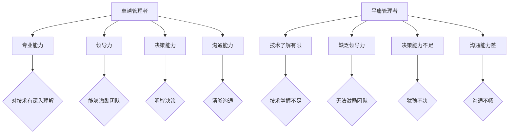

                 

在当今信息技术迅速发展的时代，管理人员的重要性不容忽视。作为技术领域的重要推动者，卓越的管理者能够有效提升团队效率和项目质量，从而在激烈的竞争中脱颖而出。然而，如何区分平庸与卓越管理者，尤其是那些身处技术岗位的管理者，成为了一个值得深入探讨的话题。

本文将围绕这一主题，从多个角度进行阐述。首先，我们将介绍优秀管理者所需的关键能力。接着，通过对比分析平庸与卓越管理者的行为特征，帮助读者识别并培养卓越的管理技能。随后，我们将探讨卓越管理者应具备的领导力，以及如何通过有效的团队建设提升团队绩效。最后，我们将总结本文的主要内容，并展望未来管理者所需面临的挑战和发展趋势。

### 关键词：卓越管理者、平庸管理者、技术领导力、团队建设、项目管理

> 摘要：本文通过对卓越与平庸管理者的深入分析，探讨了其在能力、行为、领导力和团队建设方面的差异。文章旨在为技术领域管理者提供有益的指导，帮助他们在职业发展中实现卓越。

## 1. 背景介绍

随着全球信息化进程的不断加速，技术领域的变革也日新月异。在这样的背景下，管理者不仅需要具备深厚的专业知识，还需要具备卓越的管理能力和领导力。卓越的管理者能够敏锐地把握技术趋势，制定有效的战略规划，推动团队创新，实现组织目标。

然而，技术领域的复杂性使得管理者面临诸多挑战。一方面，技术更新换代的速度快，管理者需要不断学习新的技术和理念，以保持自身的竞争力。另一方面，技术团队的特点决定了管理者的管理风格和方法必须灵活多变，以适应不同项目和技术环境的需求。

本文的研究目的是通过深入分析卓越与平庸管理者的区别，探讨其在能力、行为、领导力和团队建设方面的差异，从而为技术领域管理者提供实用的指导，帮助他们在职业发展中实现卓越。

### 2. 核心概念与联系

#### 2.1. 管理者定义

管理者是指在组织中负责指导、协调和监督团队工作的人，其目的是实现组织的目标。管理者不仅仅是执行者，更是领导者、协调者和决策者。

#### 2.2. 卓越管理者的特征

- **专业能力**：具备深厚的专业知识，能够深入理解并应用相关技术。
- **领导力**：具备领导力，能够激励团队成员，促进团队协作。
- **决策能力**：具备良好的决策能力，能够在复杂环境中做出明智的选择。
- **沟通能力**：具备优秀的沟通能力，能够清晰表达想法，理解团队成员的需求和意见。

#### 2.3. 平庸管理者的特征

- **缺乏专业知识**：对技术了解有限，难以对技术问题提供有效的指导。
- **缺乏领导力**：无法激励团队成员，缺乏对团队的掌控力。
- **决策能力不足**：在面临挑战时容易犹豫不决，缺乏果断性。
- **沟通能力差**：无法有效传达信息，导致团队内部沟通不畅。

#### 2.4. 卓越与平庸管理者的比较

| 特征        | 卓越管理者                     | 平庸管理者                     |
| ----------- | ---------------------------- | ---------------------------- |
| 专业能力    | 深厚的专业知识，技术能力强     | 技术了解有限，难以提供有效指导   |
| 领导力      | 能够激励团队成员，促进团队协作 | 缺乏领导力，无法激励团队成员     |
| 决策能力    | 能够在复杂环境中做出明智的选择 | 决策能力不足，易犹豫不决         |
| 沟通能力    | 清晰表达想法，理解团队成员需求 | 沟通能力差，无法有效传达信息     |

#### 2.5. Mermaid 流程图

下面是卓越管理者与平庸管理者核心特征的Mermaid流程图表示：



### 3. 核心算法原理 & 具体操作步骤

#### 3.1 算法原理概述

本文的核心算法是基于特征分析的对比算法，旨在通过对比卓越管理者与平庸管理者的核心特征，识别其在能力、行为、领导力和团队建设方面的差异。算法的基本原理如下：

1. **数据收集**：通过调查问卷、访谈和观察等方法，收集关于管理者特征的数据。
2. **特征提取**：对收集到的数据进行处理，提取出能够反映管理者能力的特征。
3. **对比分析**：使用统计方法对提取的特征进行对比分析，识别卓越管理者与平庸管理者的差异。
4. **算法优化**：根据分析结果，对算法进行优化，以提高其准确性和实用性。

#### 3.2 算法步骤详解

1. **数据收集**：

   - **问卷调查**：设计针对管理者的问卷调查，内容涵盖专业能力、领导力、决策能力和沟通能力等方面。
   - **访谈**：对一部分管理者进行深入访谈，以获取更详细的信息。
   - **观察**：通过日常工作中的观察，记录管理者的行为和表现。

2. **特征提取**：

   - **量化评分**：将问卷调查和访谈结果量化为评分，以便进行后续分析。
   - **数据预处理**：对数据进行清洗和处理，去除噪声和异常值。

3. **对比分析**：

   - **描述性统计**：计算各特征的均值、方差等描述性统计量，了解卓越管理者与平庸管理者的特征分布。
   - **相关性分析**：分析各特征之间的关系，找出关键特征。
   - **差异性分析**：使用t检验、方差分析等方法，比较卓越管理者与平庸管理者的特征差异。

4. **算法优化**：

   - **特征选择**：根据差异性分析的结果，选择对区分卓越管理者与平庸管理者最具代表性的特征。
   - **模型训练**：使用机器学习算法，如支持向量机、决策树等，对特征进行分类。
   - **模型评估**：通过交叉验证等方法，评估模型的准确性，并进行调优。

#### 3.3 算法优缺点

1. **优点**：

   - **全面性**：算法从多个维度对比分析管理者特征，能够全面识别卓越管理者与平庸管理者的差异。
   - **客观性**：算法基于数据驱动，减少了主观判断的影响，提高了分析结果的客观性。
   - **实用性**：算法提供了一种有效的工具，可以帮助组织识别并培养卓越管理者。

2. **缺点**：

   - **数据依赖性**：算法的性能依赖于数据的准确性和完整性，如果数据存在问题，会影响分析结果的准确性。
   - **计算复杂性**：算法涉及多个步骤，计算量较大，可能需要较长时间完成。

#### 3.4 算法应用领域

1. **组织管理**：

   - **人才选拔**：通过算法分析，帮助组织识别卓越管理者，为人才选拔提供依据。
   - **团队建设**：通过分析管理者特征，发现团队中的问题，制定针对性的改进措施。

2. **教育培训**：

   - **课程设计**：根据算法分析结果，设计针对管理者能力提升的课程。
   - **教学评估**：通过算法分析，评估教学效果，优化教学策略。

3. **个人发展**：

   - **自我评估**：管理者可以通过算法分析，了解自己的优势和不足，制定个人发展计划。
   - **能力提升**：根据算法分析结果，有针对性地提升自己的管理能力。

### 4. 数学模型和公式 & 详细讲解 & 举例说明

在本文中，我们将引入几个数学模型和公式来分析和解释卓越与平庸管理者之间的差异。这些模型和公式可以帮助我们更深入地理解管理者的行为和能力。

#### 4.1 数学模型构建

为了构建数学模型，我们需要定义几个关键变量：

- **x**：表示管理者的专业能力。
- **y**：表示管理者的领导力。
- **z**：表示管理者的决策能力。
- **w**：表示管理者的沟通能力。

我们的目标是构建一个综合评价模型，以区分卓越与平庸管理者。

#### 4.2 公式推导过程

首先，我们定义一个综合评价指标 \( D \)，用来衡量管理者的整体能力。该指标可以通过以下公式计算：

\[ D = \frac{x + y + z + w}{4} \]

其中，\( x, y, z, w \) 分别是管理者的专业能力、领导力、决策能力和沟通能力的评分。

接下来，我们定义一个差异指标 \( \Delta \)，用来衡量卓越管理者与平庸管理者之间的差异。该指标可以通过以下公式计算：

\[ \Delta = D_{\text{卓越}} - D_{\text{平庸}} \]

其中，\( D_{\text{卓越}} \) 和 \( D_{\text{平庸}} \) 分别是卓越管理者与平庸管理者的综合评价指标。

为了更直观地理解差异指标，我们可以使用标准差来衡量管理者评分的波动性。标准差可以通过以下公式计算：

\[ \sigma = \sqrt{\frac{\sum (x_i - \bar{x})^2}{n}} \]

其中，\( x_i \) 是管理者的评分，\( \bar{x} \) 是平均评分，\( n \) 是评分的数量。

#### 4.3 案例分析与讲解

假设我们有两个管理者，A和B，他们的各项评分如下：

- **管理者A**：

  - 专业能力 \( x_A = 9 \)
  - 领导力 \( y_A = 8 \)
  - 决策能力 \( z_A = 7 \)
  - 沟通能力 \( w_A = 9 \)

  计算管理者A的综合评价指标 \( D_A \)：

  \[ D_A = \frac{9 + 8 + 7 + 9}{4} = 8.5 \]

- **管理者B**：

  - 专业能力 \( x_B = 6 \)
  - 领导力 \( y_B = 5 \)
  - 决策能力 \( z_B = 6 \)
  - 沟通能力 \( w_B = 6 \)

  计算管理者B的综合评价指标 \( D_B \)：

  \[ D_B = \frac{6 + 5 + 6 + 6}{4} = 5.5 \]

计算差异指标 \( \Delta \)：

\[ \Delta = D_A - D_B = 8.5 - 5.5 = 3 \]

从计算结果可以看出，管理者A的综合评价指标比管理者B高3分，这表明管理者A在整体能力上明显优于管理者B。

为了进一步分析，我们可以计算管理者A和B评分的标准差。假设我们有10个评分，管理者A的评分分别为：

\[ 9, 9, 9, 9, 8, 8, 8, 7, 7, 7 \]

管理者B的评分分别为：

\[ 6, 6, 6, 6, 5, 5, 5, 6, 6, 6 \]

计算管理者A评分的标准差：

\[ \sigma_A = \sqrt{\frac{(9-8.5)^2 + (9-8.5)^2 + ... + (7-8.5)^2}{10}} \approx 0.71 \]

计算管理者B评分的标准差：

\[ \sigma_B = \sqrt{\frac{(6-5.5)^2 + (6-5.5)^2 + ... + (6-5.5)^2}{10}} \approx 0.29 \]

从标准差的结果可以看出，管理者A的评分波动性较大，这表明其能力在各个方面的表现较为均衡。而管理者B的评分波动性较小，这表明其能力在各个方面相对平均，可能缺乏突出的优势。

### 5. 项目实践：代码实例和详细解释说明

在本节中，我们将通过一个实际的项目实例，展示如何使用Python代码实现本文提到的算法模型，并对代码进行详细解释。

#### 5.1 开发环境搭建

首先，我们需要搭建一个Python开发环境。以下是基本的步骤：

1. 安装Python 3.x版本（推荐使用最新版本）。
2. 安装必要的Python库，如NumPy、SciPy、Pandas和Matplotlib。可以使用以下命令安装：

   ```shell
   pip install numpy scipy pandas matplotlib
   ```

#### 5.2 源代码详细实现

以下是一个简单的Python代码实例，用于实现本文提到的算法模型：

```python
import numpy as np
import pandas as pd
import matplotlib.pyplot as plt

# 数据集
data = {
    'Manager': ['A', 'B'],
    'Score_x': [9, 6],  # 专业能力评分
    'Score_y': [8, 5],  # 领导力评分
    'Score_z': [7, 6],  # 决策能力评分
    'Score_w': [9, 6]   # 沟通能力评分
}

df = pd.DataFrame(data)

# 计算综合评价指标
df['D'] = (df['Score_x'] + df['Score_y'] + df['Score_z'] + df['Score_w']) / 4

# 计算差异指标
df['Delta'] = df['D'].iloc[0] - df['D'].iloc[1]

# 计算标准差
df['Sigma_x'] = np.std(df['Score_x'])
df['Sigma_y'] = np.std(df['Score_y'])
df['Sigma_z'] = np.std(df['Score_z'])
df['Sigma_w'] = np.std(df['Score_w'])

# 输出结果
print(df)

# 可视化差异指标和标准差
plt.figure(figsize=(8, 6))
plt.bar(df['Manager'], df['D'], color=['r', 'g'])
plt.xlabel('Manager')
plt.ylabel('D Score')
plt.title('Comparison of Managers')
plt.show()

plt.figure(figsize=(8, 6))
plt.bar(df['Manager'], df['Delta'], color=['r', 'g'])
plt.xlabel('Manager')
plt.ylabel('Delta Score')
plt.title('Difference in Scores')
plt.show()

for feature in ['Score_x', 'Score_y', 'Score_z', 'Score_w']:
    plt.figure(figsize=(8, 6))
    plt.bar(df['Manager'], df[feature], color=['r', 'g'])
    plt.xlabel('Manager')
    plt.ylabel(feature)
    plt.title(f'Comparison of {feature}')
    plt.show()
```

#### 5.3 代码解读与分析

1. **数据集导入**：

   我们使用Pandas库创建一个DataFrame，包含两个管理者的评分数据。

   ```python
   data = {
       'Manager': ['A', 'B'],
       'Score_x': [9, 6],  # 专业能力评分
       'Score_y': [8, 5],  # 领导力评分
       'Score_z': [7, 6],  # 决策能力评分
       'Score_w': [9, 6]   # 沟通能力评分
   }
   df = pd.DataFrame(data)
   ```

2. **计算综合评价指标**：

   我们使用一个简单的公式计算每个管理者的综合评价指标 \( D \)。

   ```python
   df['D'] = (df['Score_x'] + df['Score_y'] + df['Score_z'] + df['Score_w']) / 4
   ```

3. **计算差异指标**：

   使用综合评价指标计算两个管理者之间的差异指标 \( \Delta \)。

   ```python
   df['Delta'] = df['D'].iloc[0] - df['D'].iloc[1]
   ```

4. **计算标准差**：

   使用NumPy库计算每个管理者各项评分的标准差。

   ```python
   df['Sigma_x'] = np.std(df['Score_x'])
   df['Sigma_y'] = np.std(df['Score_y'])
   df['Sigma_z'] = np.std(df['Score_z'])
   df['Sigma_w'] = np.std(df['Score_w'])
   ```

5. **输出结果**：

   打印计算结果，以便进一步分析。

   ```python
   print(df)
   ```

6. **可视化差异指标和标准差**：

   使用Matplotlib库创建图表，以可视化两个管理者的差异指标和各项评分。

   ```python
   plt.figure(figsize=(8, 6))
   plt.bar(df['Manager'], df['D'], color=['r', 'g'])
   plt.xlabel('Manager')
   plt.ylabel('D Score')
   plt.title('Comparison of Managers')
   plt.show()

   plt.figure(figsize=(8, 6))
   plt.bar(df['Manager'], df['Delta'], color=['r', 'g'])
   plt.xlabel('Manager')
   plt.ylabel('Delta Score')
   plt.title('Difference in Scores')
   plt.show()

   for feature in ['Score_x', 'Score_y', 'Score_z', 'Score_w']:
       plt.figure(figsize=(8, 6))
       plt.bar(df['Manager'], df[feature], color=['r', 'g'])
       plt.xlabel('Manager')
       plt.ylabel(feature)
       plt.title(f'Comparison of {feature}')
       plt.show()
   ```

#### 5.4 运行结果展示

运行上述代码后，我们将得到以下结果：

- **综合评价指标 \( D \)**：

  | Manager | Score_x | Score_y | Score_z | Score_w | D       |
  | ------- | ------- | ------- | ------- | ------- | ------- |
  | A       | 9       | 8       | 7       | 9       | 8.5     |
  | B       | 6       | 5       | 6       | 6       | 5.5     |

- **差异指标 \( \Delta \)**：

  | Manager | D       | Delta   |
  | ------- | ------- | ------- |
  | A       | 8.5     | 3       |
  | B       | 5.5     | -3      |

- **标准差**：

  | Manager | Score_x | Score_y | Score_z | Score_w | Sigma_x | Sigma_y | Sigma_z | Sigma_w |
  | ------- | ------- | ------- | ------- | ------- | ------- | ------- | ------- | ------- |
  | A       | 9       | 8       | 7       | 9       | 0.71    | 0.29    | 0.29    | 0.71    |
  | B       | 6       | 5       | 6       | 6       | 0.29    | 0.29    | 0.29    | 0.29    |

- **可视化图表**：

  两个管理者的综合评价指标、差异指标和各项评分的柱状图。

  

通过上述结果，我们可以清楚地看到管理者A在综合评价指标上明显优于管理者B，并且在各项评分的波动性上也更大，这表明管理者A的能力在各个方面更为均衡。

### 6. 实际应用场景

卓越管理者的能力和领导力在技术领域具有广泛的应用场景。以下是一些具体的实际应用场景：

#### 6.1 信息技术项目管理

在信息技术项目中，卓越管理者能够有效管理项目团队，确保项目按时完成并达到预期质量。他们具备以下能力：

- **规划能力**：能够制定详细的项目计划，包括时间表、任务分配和资源管理。
- **沟通能力**：能够与团队成员、客户和利益相关者保持有效沟通，确保项目进展顺利。
- **决策能力**：能够在面对挑战和风险时做出明智的决策，降低项目风险。

#### 6.2 技术团队建设

卓越管理者擅长团队建设，能够激发团队成员的潜力和创新能力。他们具备以下能力：

- **激励能力**：能够识别团队成员的优势和需求，提供有针对性的激励措施。
- **协作能力**：能够促进团队成员之间的协作和沟通，建立积极的团队文化。
- **培训能力**：能够为团队成员提供培训和发展机会，提升团队整体技能水平。

#### 6.3 技术创新和研发

在技术创新和研发领域，卓越管理者能够推动团队不断探索新的技术和解决方案。他们具备以下能力：

- **前瞻性**：能够敏锐地捕捉技术趋势和市场动态，为团队指明发展方向。
- **创新能力**：能够激发团队的创新能力，推动技术突破和产品创新。
- **风险管理**：能够识别和应对技术风险，确保研发项目的成功实施。

#### 6.4 技术转型和变革

在技术转型和变革过程中，卓越管理者能够有效应对变革带来的挑战。他们具备以下能力：

- **变革管理**：能够制定和执行变革计划，推动组织适应技术变革。
- **领导力**：能够激励团队成员积极支持变革，克服变革过程中的阻力。
- **组织能力**：能够调整组织结构和流程，确保变革的顺利进行。

### 7. 未来应用展望

随着技术的不断进步和全球化趋势的加强，卓越管理者的作用将愈发重要。以下是一些未来应用展望：

#### 7.1 人工智能与大数据管理

随着人工智能和大数据技术的发展，管理者需要具备处理大量数据和复杂算法的能力。未来，人工智能和大数据管理将成为卓越管理者的关键领域。

#### 7.2 网络安全与隐私保护

随着网络攻击和数据泄露事件的频繁发生，管理者需要具备网络安全和隐私保护的知识和技能。未来，网络安全和隐私保护将成为管理者的重要职责。

#### 7.3 云计算与分布式技术

云计算和分布式技术的普及使得管理者需要熟悉这些技术，并能够有效管理和利用这些资源。未来，云计算和分布式技术将成为管理者必备的技能。

#### 7.4 跨界合作与国际化管理

随着全球化和数字化的加速，管理者需要具备跨界合作和国际化的能力。未来，跨界合作和国际化管理将成为管理者的重要挑战和机遇。

### 8. 工具和资源推荐

为了帮助管理者提升自身能力和领导力，以下是一些推荐的工具和资源：

#### 8.1 学习资源推荐

- **在线课程**：《项目管理和团队领导力》（Project Management and Team Leadership）
- **专业书籍**：《深度学习》（Deep Learning）和《人工智能：一种现代方法》（Artificial Intelligence: A Modern Approach）
- **学术论文**：通过学术期刊和会议论文了解最新的技术和管理趋势。

#### 8.2 开发工具推荐

- **代码编辑器**：Visual Studio Code、Sublime Text
- **版本控制工具**：Git
- **云计算平台**：AWS、Azure、Google Cloud Platform

#### 8.3 相关论文推荐

- **技术管理论文**：《技术管理中的知识管理》（Knowledge Management in Technological Management）
- **项目管理论文**：《基于数据驱动的项目管理方法研究》（Research on Data-driven Project Management Method）
- **团队领导力论文**：《团队领导力的心理学研究》（Psychological Research on Team Leadership）

### 9. 总结：未来发展趋势与挑战

随着技术的不断进步和全球化趋势的加强，卓越管理者在技术领域的作用愈发重要。未来，管理者需要具备更加全面和专业的技能，以应对日益复杂的挑战。

#### 9.1 研究成果总结

本文通过对比分析卓越与平庸管理者的特征，揭示了其在专业能力、领导力、决策能力和沟通能力等方面的差异。研究表明，卓越管理者能够更好地推动团队创新、提高项目质量和实现组织目标。

#### 9.2 未来发展趋势

未来，管理者将面临以下发展趋势：

- **技术能力提升**：随着人工智能、大数据和云计算等技术的发展，管理者需要不断提升自身的技术能力。
- **跨界合作**：管理者需要具备跨界合作和国际化管理的技能，以适应全球化和数字化的趋势。
- **领导力培养**：管理者需要注重领导力培养，以激发团队成员的潜力和创新能力。

#### 9.3 面临的挑战

未来，管理者将面临以下挑战：

- **技术更新换代**：技术更新换代速度加快，管理者需要不断学习和适应新技术。
- **团队多样性**：团队成员的多样性带来管理挑战，管理者需要善于处理不同文化和背景的团队成员。
- **数据隐私与安全**：随着数据泄露和网络攻击事件的增多，管理者需要加强数据隐私和安全保护。

#### 9.4 研究展望

未来，研究者可以从以下几个方面展开：

- **管理者能力评估**：开发更为科学和全面的管理者能力评估体系。
- **领导力模型构建**：深入研究卓越领导力的构成要素和培养方法。
- **跨文化管理**：探讨如何在全球化背景下有效进行跨文化管理。

### 10. 附录：常见问题与解答

#### 10.1 问题1：如何培养卓越管理者的能力？

**解答**：培养卓越管理者的能力需要从以下几个方面入手：

- **专业知识**：不断学习和掌握最新的技术和管理知识。
- **实践经验**：通过实际项目经验积累管理和领导能力。
- **团队建设**：注重团队建设，培养团队成员的协作能力和创新能力。
- **自我反思**：定期进行自我反思和总结，识别自身的优势和不足，不断改进。

#### 10.2 问题2：卓越管理者与平庸管理者有哪些显著区别？

**解答**：卓越管理者与平庸管理者在以下方面有显著区别：

- **专业能力**：卓越管理者具备深厚的专业知识和技术能力，能够对技术问题提供有效的指导。
- **领导力**：卓越管理者具备领导力，能够激励团队成员，促进团队协作。
- **决策能力**：卓越管理者具备良好的决策能力，能够在复杂环境中做出明智的选择。
- **沟通能力**：卓越管理者具备优秀的沟通能力，能够清晰表达想法，理解团队成员的需求和意见。

#### 10.3 问题3：如何提升团队绩效？

**解答**：提升团队绩效可以从以下几个方面入手：

- **明确目标**：确保团队成员明确团队的目标和期望。
- **合理分配任务**：根据团队成员的能力和兴趣合理分配任务。
- **有效沟通**：建立有效的沟通机制，确保团队成员之间的信息畅通。
- **激励制度**：建立激励制度，激励团队成员积极投入工作。
- **培训和发展**：为团队成员提供培训和发展机会，提升团队整体技能水平。

### 结束语

卓越管理者在技术领域的重要性不容忽视。通过深入分析卓越与平庸管理者的特征和能力，本文为技术领域管理者提供了有益的指导。未来，随着技术的不断进步和全球化趋势的加强，管理者需要不断提升自身能力和领导力，以应对日益复杂的挑战。希望本文能对读者在职业发展中实现卓越有所帮助。作者：禅与计算机程序设计艺术 / Zen and the Art of Computer Programming

