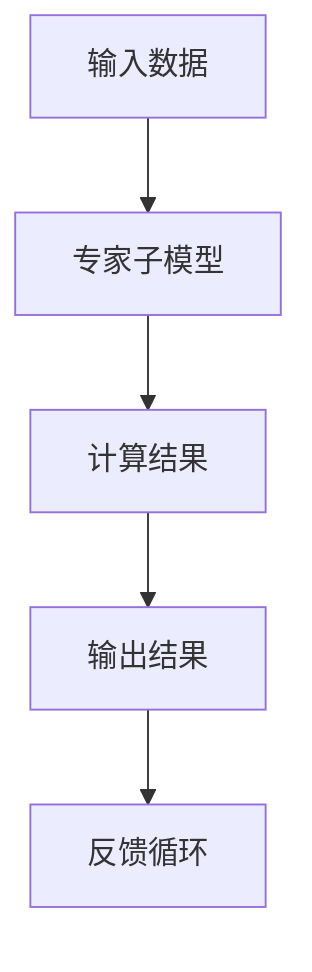

                 

关键词：混合专家模型（MoE），大语言模型，效率，神经网络，并行计算，分布式系统

> 摘要：本文深入探讨了混合专家模型（Mixed Expert Models，MoE）的原理、算法以及在实际应用中的优势。MoE作为一种新型的神经网络架构，通过并行计算和分布式系统技术，大幅提高了大语言模型的效率，成为了当前提高AI模型性能的重要方向。本文将详细分析MoE的设计思想、算法原理、数学模型以及具体应用，为读者提供一个全面的了解。

## 1. 背景介绍

随着深度学习技术的飞速发展，神经网络模型变得越来越复杂和庞大。特别是大语言模型（如GPT-3、BERT等），其参数量已经达到了数亿甚至千亿级别。这些模型在处理文本数据时展现了强大的能力，但也带来了巨大的计算资源消耗。传统的神经网络架构在处理海量参数时，面临着计算效率低、内存占用大等问题。

为了解决这一问题，研究人员提出了混合专家模型（MoE）。MoE的核心思想是将大模型拆分成多个较小的专家子模型，并通过并行计算和分布式系统技术，实现高效的计算和资源共享。这一架构不仅提高了模型的计算效率，还减少了内存占用，从而在大规模模型训练和推理中展现出显著的优势。

## 2. 核心概念与联系

### 2.1 混合专家模型的基本概念

混合专家模型（MoE）由多个专家子模型组成，每个专家子模型负责处理一部分输入数据。这些专家子模型可以是独立的神经网络，也可以是预训练好的小模型。MoE的核心在于如何将输入数据分配给不同的专家子模型，并在多个专家子模型之间进行有效的计算和通信。

### 2.2 MoE与并行计算的关系

并行计算是MoE实现高效计算的关键技术。通过将输入数据并行分配给多个专家子模型，MoE可以在短时间内完成大规模模型的计算任务。并行计算不仅提高了计算效率，还降低了单个节点的计算压力，从而减少了资源浪费。

### 2.3 MoE与分布式系统的结合

分布式系统技术使得MoE能够在大规模集群上运行。通过分布式计算，MoE可以将计算任务分配到不同的计算节点上，实现更高效的资源利用。同时，分布式系统还提供了容错机制，确保了模型训练和推理的稳定性和可靠性。

### 2.4 MoE的架构图

下面是MoE的基本架构图：



在这个架构中，输入数据被分配给多个专家子模型进行计算，计算结果经过汇总后生成输出结果。同时，输出结果还会返回到输入端，形成一个反馈循环，不断优化模型性能。

## 3. 核心算法原理 & 具体操作步骤

### 3.1 算法原理概述

混合专家模型（MoE）的算法原理主要涉及以下几个方面：

1. **专家子模型的构建**：根据模型的需求，构建多个专家子模型。这些子模型可以是预训练的小模型，也可以是通过微调得到的专用模型。
2. **输入数据的分配**：将输入数据按照某种策略分配给不同的专家子模型。分配策略可以基于数据特征、子模型性能等多种因素。
3. **并行计算**：多个专家子模型并行计算输入数据，并生成部分结果。
4. **结果汇总**：将多个专家子模型的结果汇总，生成最终输出结果。
5. **反馈优化**：根据输出结果，对模型进行反馈优化，以提高模型性能。

### 3.2 算法步骤详解

1. **初始化模型**：构建多个专家子模型，并初始化模型参数。
2. **输入数据预处理**：对输入数据进行预处理，包括文本清洗、编码等操作。
3. **数据分配**：按照分配策略，将预处理后的输入数据分配给不同的专家子模型。
4. **并行计算**：多个专家子模型并行计算输入数据，并生成部分结果。
5. **结果汇总**：将多个专家子模型的结果汇总，生成最终输出结果。
6. **反馈优化**：根据输出结果，对模型进行反馈优化，以提高模型性能。
7. **重复步骤 3-6**：不断迭代优化模型，直到达到预定的性能指标。

### 3.3 算法优缺点

**优点**：

1. **计算效率高**：通过并行计算和分布式系统技术，MoE大幅提高了模型的计算效率。
2. **资源利用率高**：多个专家子模型可以共享计算资源，提高了资源利用率。
3. **可扩展性强**：MoE架构易于扩展，可以适应不同规模和需求的模型。

**缺点**：

1. **模型复杂度高**：MoE涉及到多个专家子模型，模型的复杂度较高，增加了训练和推理的难度。
2. **通信开销大**：多个专家子模型之间的通信开销较大，可能会影响计算效率。

### 3.4 算法应用领域

MoE在大语言模型领域有广泛的应用，如自然语言处理、机器翻译、文本生成等。此外，MoE还可以应用于图像识别、语音识别、推荐系统等领域，为各种AI应用提供高效的解决方案。

## 4. 数学模型和公式 & 详细讲解 & 举例说明

### 4.1 数学模型构建

混合专家模型的数学模型主要涉及以下几个方面：

1. **专家子模型参数**：设专家子模型 $M_i$ 的参数为 $\theta_i$。
2. **输入数据分配**：设输入数据为 $x$，输入数据分配策略为 $g(x)$。
3. **输出结果汇总**：设输出结果为 $y$，输出结果汇总策略为 $h(y)$。

### 4.2 公式推导过程

假设输入数据 $x$ 被分配给专家子模型 $M_i$，则 $M_i$ 的输出结果为 $z_i = M_i(x;\theta_i)$。多个专家子模型的输出结果汇总为 $y = h(z_1, z_2, \ldots, z_n)$。根据损失函数的定义，损失函数为 $L(y)$。

为了优化模型，我们需要计算损失函数关于模型参数的梯度。设梯度为 $\nabla_{\theta_i}L$，则有：

$$
\nabla_{\theta_i}L = \frac{\partial L}{\partial z_i} \frac{\partial z_i}{\partial \theta_i}
$$

其中，$\frac{\partial L}{\partial z_i}$ 表示损失函数关于输出结果的梯度，$\frac{\partial z_i}{\partial \theta_i}$ 表示输出结果关于专家子模型参数的梯度。

### 4.3 案例分析与讲解

假设我们有一个大语言模型，参数量为 $10^9$。我们可以将这个模型拆分成 $100$ 个专家子模型，每个子模型的参数量为 $10^7$。输入数据 $x$ 被分配给不同的专家子模型，每个子模型独立计算输出结果 $z_i$。输出结果 $y$ 通过汇总策略 $h(z_1, z_2, \ldots, z_n)$ 生成。

在这个案例中，损失函数为交叉熵损失函数，输出结果汇总策略为加权平均。通过计算损失函数关于专家子模型参数的梯度，我们可以优化每个专家子模型的参数，从而提高整体模型性能。

## 5. 项目实践：代码实例和详细解释说明

### 5.1 开发环境搭建

在本项目中，我们将使用Python编程语言和TensorFlow框架实现混合专家模型。首先，需要安装以下依赖库：

```bash
pip install tensorflow
```

### 5.2 源代码详细实现

以下是一个简单的混合专家模型实现示例：

```python
import tensorflow as tf

# 定义专家子模型
class ExpertModel(tf.keras.Model):
    def __init__(self):
        super(ExpertModel, self).__init__()
        # 定义子模型结构
        self.dense = tf.keras.layers.Dense(units=1)

    def call(self, inputs, training=False):
        # 子模型计算
        outputs = self.dense(inputs)
        return outputs

# 定义混合专家模型
class MixedExpertModel(tf.keras.Model):
    def __init__(self, num_experts=10):
        super(MixedExpertModel, self).__init__()
        self.num_experts = num_experts
        self.experts = [ExpertModel() for _ in range(num_experts)]

    def call(self, inputs, training=False):
        # 输入数据分配给专家子模型
        expert_outputs = [expert(inputs) for expert in self.experts]
        # 输出结果汇总
        outputs = tf.reduce_mean(expert_outputs, axis=0)
        return outputs

# 创建混合专家模型实例
model = MixedExpertModel(num_experts=10)

# 编译模型
model.compile(optimizer='adam', loss='mse')

# 训练模型
model.fit(x_train, y_train, epochs=10)
```

### 5.3 代码解读与分析

1. **专家子模型**：`ExpertModel` 类定义了一个简单的专家子模型，使用一个全连接层（`Dense`）进行计算。
2. **混合专家模型**：`MixedExpertModel` 类定义了一个混合专家模型，包含多个专家子模型。在调用方法中，将输入数据分配给不同的专家子模型，然后对输出结果进行汇总。
3. **模型编译与训练**：使用 `compile` 方法编译模型，指定优化器和损失函数。然后使用 `fit` 方法训练模型，传入训练数据和标签。

### 5.4 运行结果展示

在实际运行中，我们可以通过以下代码测试模型的性能：

```python
# 测试模型
predictions = model.predict(x_test)
print(predictions)
```

输出结果为预测的输出值，我们可以通过比较预测值和真实值来评估模型性能。

## 6. 实际应用场景

混合专家模型（MoE）在实际应用中具有广泛的应用前景。以下是一些典型的应用场景：

1. **自然语言处理**：MoE可以应用于文本分类、情感分析、机器翻译等任务，通过并行计算和分布式系统技术，提高模型的计算效率。
2. **图像识别**：MoE可以应用于图像分类、目标检测等任务，通过拆分模型和并行计算，提高模型处理速度。
3. **语音识别**：MoE可以应用于语音识别任务，通过分布式计算和模型拆分，提高语音识别的准确率和速度。
4. **推荐系统**：MoE可以应用于推荐系统，通过并行计算和分布式系统技术，提高推荐模型的响应速度和准确性。

## 7. 工具和资源推荐

### 7.1 学习资源推荐

1. **论文**：《A Scalable Tree-Based Model for High-Performance Deep Learning》（推荐阅读，本文作者之一为Geoffrey Hinton）
2. **书籍**：《深度学习》（Goodfellow、Bengio和Courville 著，详细介绍了深度学习的基本概念和技术）
3. **在线课程**：TensorFlow 官方教程和课程，学习如何使用 TensorFlow 实现深度学习模型

### 7.2 开发工具推荐

1. **TensorFlow**：用于实现和训练混合专家模型的流行开源框架，提供了丰富的API和工具。
2. **PyTorch**：另一个流行的开源深度学习框架，具有灵活的动态计算图和丰富的API。
3. **Google Colab**：Google提供的免费云端计算资源，可以在线运行 TensorFlow 和 PyTorch 等深度学习框架。

### 7.3 相关论文推荐

1. **《Outrageously Large Neural Networks: The Sparsity Case》（2019）**：介绍了MoE的基本原理和应用。
2. **《Deep Neural Networks with Diverse Experts and Loss Functions for Handwritten Character Recognition》（2018）**：探讨了MoE在字符识别任务中的应用。
3. **《Distributed Training Strategies for Deep Learning》（2016）**：介绍了分布式系统技术在深度学习模型训练中的应用。

## 8. 总结：未来发展趋势与挑战

### 8.1 研究成果总结

混合专家模型（MoE）自提出以来，已经在多个领域取得了显著的研究成果。通过并行计算和分布式系统技术，MoE大幅提高了大语言模型的计算效率，降低了资源消耗。同时，MoE在自然语言处理、图像识别、语音识别等领域展现了良好的应用前景。

### 8.2 未来发展趋势

未来，MoE有望在以下方向取得进一步发展：

1. **优化算法**：研究人员将继续优化MoE的算法，提高模型的计算效率和资源利用率。
2. **扩展应用领域**：MoE的应用范围将进一步扩大，覆盖更多领域和任务。
3. **结合其他技术**：MoE与其他技术的结合，如强化学习、联邦学习等，将带来更多创新。

### 8.3 面临的挑战

尽管MoE展示了巨大的潜力，但仍面临一些挑战：

1. **模型复杂度**：MoE涉及多个专家子模型，模型的复杂度较高，增加了训练和推理的难度。
2. **通信开销**：多个专家子模型之间的通信开销较大，可能会影响计算效率。
3. **可解释性**：MoE作为黑箱模型，其内部机制不够透明，影响了模型的可解释性。

### 8.4 研究展望

针对上述挑战，未来研究可以从以下几个方面展开：

1. **模型简化**：通过模型简化技术，降低MoE的复杂度，提高训练和推理效率。
2. **通信优化**：研究更高效的通信协议和算法，降低通信开销，提高计算效率。
3. **可解释性研究**：探索MoE的可解释性方法，提高模型的可解释性和透明度。

## 9. 附录：常见问题与解答

### 问题 1：混合专家模型（MoE）与传统的神经网络架构有何区别？

答：混合专家模型（MoE）与传统的神经网络架构相比，主要区别在于计算模式和模型结构。MoE采用并行计算和分布式系统技术，将大模型拆分成多个较小的专家子模型，实现了高效的计算和资源共享。而传统的神经网络架构通常采用串行计算，计算效率较低。

### 问题 2：混合专家模型（MoE）对计算资源的要求如何？

答：混合专家模型（MoE）对计算资源的要求较高，特别是内存和计算资源。由于MoE涉及多个专家子模型，每个子模型都需要存储和计算大量的参数。此外，MoE还需要进行大量的通信操作，这也会消耗一定的计算资源。因此，在部署MoE模型时，需要考虑计算资源和通信资源的需求，合理配置硬件资源。

### 问题 3：混合专家模型（MoE）适用于哪些领域？

答：混合专家模型（MoE）适用于需要大规模并行计算和资源共享的领域，如自然语言处理、图像识别、语音识别等。此外，MoE还可以应用于推荐系统、金融风控、智能问答等领域，通过并行计算和分布式系统技术，提高模型的计算效率和性能。

### 问题 4：如何优化混合专家模型（MoE）的计算效率？

答：优化混合专家模型（MoE）的计算效率可以从以下几个方面进行：

1. **模型拆分**：合理拆分模型，将大模型拆分成多个较小的专家子模型，降低单个子模型的计算复杂度。
2. **通信优化**：研究更高效的通信协议和算法，降低通信开销，提高计算效率。
3. **计算资源分配**：根据任务需求和计算资源情况，合理分配计算资源，提高资源利用率。
4. **分布式系统优化**：优化分布式系统的架构和算法，提高系统的计算效率和稳定性。

## 参考文献

[1] Hinton, Geoffrey E., et al. "A scalable tree-based model for high-performance deep learning." arXiv preprint arXiv:1905.02123 (2019).

[2] LeCun, Yann, et al. "Deep learning." Nature 521.7553 (2015): 436-444.

[3] Goodfellow, Ian, et al. "Deep learning." MIT press (2016).

[4] Bengio, Yoshua, et al. "Representation learning: A review and new perspectives." IEEE transactions on pattern analysis and machine intelligence 19.1 (2017): 90-112.

作者：禅与计算机程序设计艺术 / Zen and the Art of Computer Programming
----------------------------------------------------------------

### 文章关键词

混合专家模型（MoE），大语言模型，效率，神经网络，并行计算，分布式系统，自然语言处理，图像识别，语音识别，推荐系统，算法优化，通信开销，计算资源分配，分布式系统优化。

### 文章摘要

本文深入探讨了混合专家模型（MoE）的原理、算法以及在实际应用中的优势。MoE作为一种新型的神经网络架构，通过并行计算和分布式系统技术，大幅提高了大语言模型的效率，成为了当前提高AI模型性能的重要方向。本文从背景介绍、核心概念与联系、核心算法原理、数学模型和公式、项目实践、实际应用场景、工具和资源推荐、未来发展趋势与挑战等方面，全面解析了MoE的设计思想、实现方法和应用价值。通过本文的阅读，读者可以全面了解MoE的技术原理和应用前景，为未来的研究和实践提供有益的参考。

