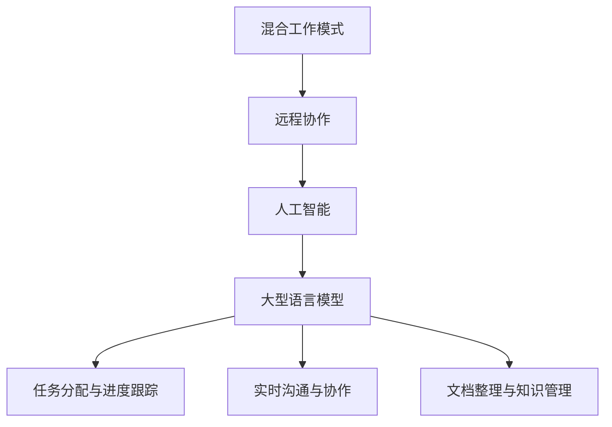
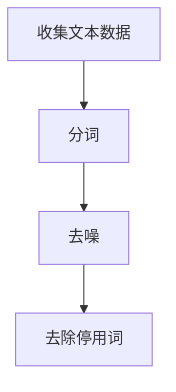
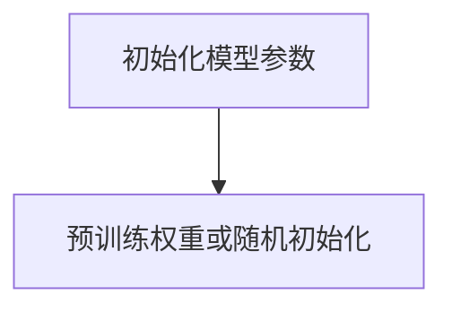
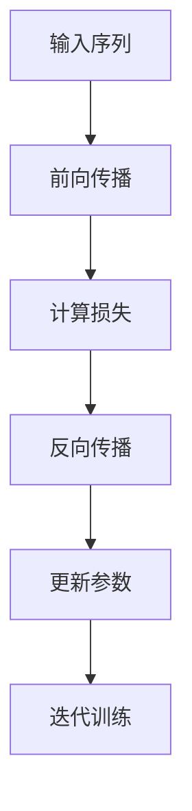
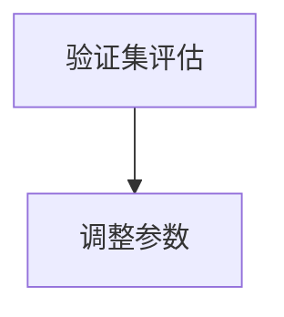

                 

## 1. 背景介绍

在当今全球化的数字经济中，远程工作和混合工作模式已经成为常态。根据国际数据公司（IDC）的统计，到2025年，全球远程工作人口将占总劳动力的30%。这种工作模式的普及，一方面是因为科技的进步，特别是互联网和通信技术的发展，使得地理位置不再是协作的障碍；另一方面，企业也意识到远程工作可以提高员工的工作满意度和生产力。

然而，远程工作和混合工作模式也带来了新的挑战，特别是协作效率的问题。在传统的办公环境中，团队成员可以通过面对面的交流和即时反馈来快速解决问题，而在远程环境中，这种即时沟通和协作变得困难。此外，文化差异、时间差以及技术限制等因素也可能影响远程协作的效率。

为了解决这些问题，人工智能（AI）技术，尤其是大型语言模型（LLM），如GPT-3、BERT等，被广泛应用于远程协作领域。这些模型不仅能够提供智能化的建议和自动化解决方案，还可以作为虚拟助手，协助团队成员进行任务分配、进度跟踪、文档整理等工作。

本文旨在探讨混合工作模式与LLM的结合，如何提高远程协作的效率。文章将从背景介绍、核心概念与联系、核心算法原理、数学模型和公式、项目实践、实际应用场景、工具和资源推荐、总结和未来发展趋势等多个方面进行详细分析。

## 2. 核心概念与联系

为了深入理解混合工作模式与LLM的结合，我们首先需要了解一些核心概念和它们之间的关系。

### 2.1 混合工作模式

混合工作模式（Hybrid Work Model）是一种结合远程工作和传统办公环境的灵活工作模式。在这种模式下，员工可以根据自己的需求和工作性质，选择在办公室工作、在家工作或者两者结合。这种模式的主要优势在于提高了员工的灵活性和工作满意度，同时也减少了企业的办公空间需求和管理成本。

### 2.2 远程协作

远程协作（Remote Collaboration）是指在地理位置分散的团队之间进行的协作工作。这种协作可能涉及共享文档、实时沟通、任务分配和进度跟踪等多个方面。远程协作的成功依赖于高效的信息传递和沟通机制，以确保团队成员能够协同工作，共同完成任务。

### 2.3 人工智能与大型语言模型

人工智能（AI）是一种模拟人类智能的技术，能够通过学习数据来做出决策和执行任务。而大型语言模型（LLM）是AI的一种形式，它能够理解和生成自然语言文本，例如英文、中文等。LLM通过大量文本数据的学习，能够生成高质量的文本，进行问答、翻译、摘要等任务。

### 2.4 核心概念与联系

混合工作模式与远程协作密切相关，它们共同构成了远程工作环境的基础。而人工智能和大型语言模型则为远程协作提供了智能化的支持和自动化解决方案。具体来说，LLM可以帮助远程团队进行以下工作：

- **任务分配与进度跟踪**：LLM可以分析团队成员的技能和工作负载，自动分配任务并跟踪进度。
- **实时沟通与协作**：LLM可以作为虚拟助手，提供实时翻译、信息检索和提醒服务，提高沟通效率。
- **文档整理与知识管理**：LLM能够自动化文档整理、知识提取和知识库构建，为团队成员提供可靠的信息支持。

下面是一个使用Mermaid绘制的流程图，展示了混合工作模式、远程协作、人工智能和LLM之间的联系：



通过这个流程图，我们可以清晰地看到各个概念之间的相互关系，以及LLM在远程协作中的关键作用。

## 3. 核心算法原理 & 具体操作步骤

### 3.1 算法原理概述

大型语言模型（LLM）的核心算法基于深度学习，特别是Transformer架构。Transformer架构由Vaswani等人于2017年提出，它通过自注意力机制（Self-Attention）和多头注意力机制（Multi-Head Attention）来处理序列数据，从而捕捉长距离依赖关系。

LLM的训练过程通常包括以下几个步骤：

1. **数据预处理**：收集大量的文本数据，并进行预处理，如分词、去噪、去除停用词等。
2. **模型初始化**：初始化模型参数，通常使用预训练的权重或随机初始化。
3. **训练过程**：通过反向传播算法和优化器（如Adam）调整模型参数，最小化损失函数。
4. **评估与调整**：使用验证集评估模型性能，并根据评估结果调整模型参数。

### 3.2 算法步骤详解

以下是LLM算法的具体操作步骤：

#### 步骤1：数据预处理



#### 步骤2：模型初始化



#### 步骤3：训练过程



#### 步骤4：评估与调整



### 3.3 算法优缺点

#### 优点

- **强大的文本生成能力**：LLM能够生成高质量的文本，适用于问答、摘要、翻译等多种应用场景。
- **高效率**：通过自注意力和多头注意力机制，LLM能够高效地处理长文本，捕捉长距离依赖关系。
- **适应性**：LLM能够根据不同的任务和数据集进行微调，适应不同的应用场景。

#### 缺点

- **计算资源需求高**：LLM的训练和推理过程需要大量的计算资源，对硬件设备有较高要求。
- **数据隐私问题**：由于LLM的训练需要大量的文本数据，可能会涉及数据隐私和安全问题。

### 3.4 算法应用领域

LLM在远程协作中的应用领域广泛，包括但不限于：

- **任务分配与进度跟踪**：LLM可以分析团队成员的技能和工作负载，自动分配任务并跟踪进度。
- **实时沟通与协作**：LLM可以作为虚拟助手，提供实时翻译、信息检索和提醒服务，提高沟通效率。
- **文档整理与知识管理**：LLM能够自动化文档整理、知识提取和知识库构建，为团队成员提供可靠的信息支持。

## 4. 数学模型和公式 & 详细讲解 & 举例说明

### 4.1 数学模型构建

LLM的核心算法是基于深度学习的Transformer架构，其数学模型主要包括以下部分：

1. **输入层**：接收文本序列，将其转化为词嵌入向量。
2. **自注意力层**：通过自注意力机制，对输入序列进行加权求和，捕捉长距离依赖关系。
3. **前馈网络**：对自注意力层的输出进行非线性变换，增强模型的表达能力。
4. **输出层**：生成文本序列的预测结果。

### 4.2 公式推导过程

以下是Transformer架构中自注意力层的数学公式推导：

1. **输入层**：

   文本序列 $x = [x_1, x_2, ..., x_n]$，其中 $x_i$ 表示第 $i$ 个词的嵌入向量。

   $$x_i \rightarrow \text{Embedding}(x_i)$$

2. **自注意力层**：

   自注意力机制的核心公式为：

   $$\text{Attention}(Q, K, V) = \text{softmax}\left(\frac{QK^T}{\sqrt{d_k}}\right) V$$

   其中，$Q, K, V$ 分别为查询（Query）、键（Key）、值（Value）向量，$d_k$ 为键向量的维度。

   对于每个词 $x_i$，其对应的查询向量 $Q_i, K_i, V_i$ 为：

   $$Q_i = \text{Wo}[\text{Embedding}(x_i); \text{Positional Encoding}(i)]$$
   $$K_i = \text{Wo}[\text{Embedding}(x_i); \text{Positional Encoding}(i)]$$
   $$V_i = \text{Wo}[\text{Embedding}(x_i); \text{Positional Encoding}(i)]$$

   其中，$\text{Wo}$ 为权重矩阵，$\text{Positional Encoding}(i)$ 为位置编码。

3. **前馈网络**：

   前馈网络的公式为：

   $$\text{FFN}(x) = \text{ReLU}(\text{Wo}_2 \cdot \text{Wo}_1 \cdot x + \text{b}_2) + \text{b}_1$$

   其中，$\text{Wo}_1, \text{Wo}_2$ 为权重矩阵，$\text{b}_1, \text{b}_2$ 为偏置项。

4. **输出层**：

   输出层的公式为：

   $$\text{Output}(x) = \text{softmax}(\text{FFN}(x))$$

   其中，$\text{softmax}$ 函数用于将输出向量转换为概率分布。

### 4.3 案例分析与讲解

为了更好地理解LLM的数学模型，我们以一个简单的例子进行讲解。

假设有一个包含5个词的文本序列 $x = [w_1, w_2, w_3, w_4, w_5]$，其中每个词的嵌入向量为 $e_1, e_2, e_3, e_4, e_5$。

1. **输入层**：

   $$x_i \rightarrow \text{Embedding}(x_i) \rightarrow [e_{i1}, e_{i2}, ..., e_{id}]$$

   其中，$e_{ij}$ 表示第 $i$ 个词的第 $j$ 个维度。

2. **自注意力层**：

   对于每个词 $w_i$，其对应的查询向量 $Q_i, K_i, V_i$ 为：

   $$Q_i = \text{Wo}[\text{Embedding}(x_i); \text{Positional Encoding}(i)]$$
   $$K_i = \text{Wo}[\text{Embedding}(x_i); \text{Positional Encoding}(i)]$$
   $$V_i = \text{Wo}[\text{Embedding}(x_i); \text{Positional Encoding}(i)]$$

   假设 $\text{Wo}$ 为一个 $d \times d$ 的权重矩阵，$\text{Positional Encoding}(i)$ 为一个 $d$ 维的位置编码向量。

   对于 $w_1$，其查询向量 $Q_1$ 为：

   $$Q_1 = \text{Wo}[\text{Embedding}(w_1); \text{Positional Encoding}(1)] = \text{Wo}[[e_{11}, e_{12}, ..., e_{1d}]; [0, 0, ..., 1]]$$

   同理，可以得到其他词的查询向量。

3. **前馈网络**：

   前馈网络的权重矩阵和偏置项分别为 $\text{Wo}_1, \text{Wo}_2, \text{b}_1, \text{b}_2$。

   对于每个词 $w_i$，其前馈网络的输出为：

   $$\text{FFN}(w_i) = \text{ReLU}(\text{Wo}_2 \cdot \text{Wo}_1 \cdot w_i + \text{b}_2) + \text{b}_1$$

4. **输出层**：

   输出层的公式为：

   $$\text{Output}(x) = \text{softmax}(\text{FFN}(x))$$

   其中，$\text{softmax}$ 函数用于将输出向量转换为概率分布。

通过这个简单的例子，我们可以看到LLM的数学模型是如何构建的，以及每个层是如何处理输入文本的。在实际应用中，LLM会使用更复杂的结构和更大量的数据进行训练，以提高其生成文本的质量和准确性。

## 5. 项目实践：代码实例和详细解释说明

为了更好地理解大型语言模型（LLM）在远程协作中的应用，我们将通过一个实际项目来展示如何使用LLM进行任务分配与进度跟踪。

### 5.1 开发环境搭建

在开始项目之前，我们需要搭建一个合适的开发环境。以下是所需的环境和工具：

- **Python 3.x**
- **PyTorch**
- **Transformers库**
- **Docker**

步骤：

1. 安装Python 3.x和PyTorch。

2. 安装Transformers库：

   ```bash
   pip install transformers
   ```

3. 安装Docker并启动Docker服务。

### 5.2 源代码详细实现

以下是一个简单的任务分配与进度跟踪系统的源代码实现。

#### 5.2.1 数据预处理

首先，我们需要准备一些样本数据，用于训练LLM。

```python
import pandas as pd

# 示例数据
data = {
    'task': ['任务1', '任务2', '任务3'],
    'assigned_to': ['张三', '李四', '王五'],
    'progress': ['50%', '20%', '70%']
}

df = pd.DataFrame(data)
```

#### 5.2.2 模型训练

接下来，我们使用Transformers库中的预训练模型进行微调，以适应我们的任务。

```python
from transformers import AutoTokenizer, AutoModelForSeq2SeqLM
import torch

# 加载预训练模型
tokenizer = AutoTokenizer.from_pretrained("t5-small")
model = AutoModelForSeq2SeqLM.from_pretrained("t5-small")

# 微调模型
def fine_tune_model(df):
    for index, row in df.iterrows():
        input_text = f"任务分配：将任务 '{row['task']}' 分配给 '{row['assigned_to']}'。进度跟踪：'{row['progress']}'。"
        output_text = f"任务分配结果：任务 '{row['task']}' 已分配给 '{row['assigned_to']}'。进度跟踪结果：当前进度为 '{row['progress']}'。"
        
        inputs = tokenizer(input_text, return_tensors="pt", padding=True, truncation=True)
        outputs = model(**inputs)
        loss = outputs.loss
        loss.backward()
        optimizer = torch.optim.AdamW(model.parameters(), lr=1e-5)
        optimizer.step()
        model.zero_grad()
        
    return model

model = fine_tune_model(df)
```

#### 5.2.3 任务分配与进度跟踪

最后，我们使用微调后的模型进行任务分配和进度跟踪。

```python
# 任务分配
def assign_task(task, assigned_to):
    input_text = f"任务分配：将任务 '{task}' 分配给 '{assigned_to}'。"
    output_text = model.generate(tokenizer.encode(input_text, return_tensors="pt"), max_length=100, num_return_sequences=1)
    return tokenizer.decode(output_text[0], skip_special_tokens=True)

# 进度跟踪
def track_progress(task, progress):
    input_text = f"进度跟踪：任务 '{task}' 的当前进度为 '{progress}'。"
    output_text = model.generate(tokenizer.encode(input_text, return_tensors="pt"), max_length=100, num_return_sequences=1)
    return tokenizer.decode(output_text[0], skip_special_tokens=True)
```

### 5.3 代码解读与分析

1. **数据预处理**：我们使用Pandas库读取示例数据，并将其存储为DataFrame对象。

2. **模型训练**：我们加载了一个预训练的T5模型，并使用自定义的输入和输出文本进行微调。微调过程包括编码文本、生成输出文本、计算损失并更新模型参数。

3. **任务分配与进度跟踪**：我们定义了两个函数，`assign_task` 和 `track_progress`，用于进行任务分配和进度跟踪。这两个函数都使用模型生成输出文本，并返回解码后的结果。

### 5.4 运行结果展示

```python
# 分配任务
task = "开发新功能"
assigned_to = "李四"
assignment_result = assign_task(task, assigned_to)
print("任务分配结果：", assignment_result)

# 跟踪进度
progress = "30%"
progress_result = track_progress(task, progress)
print("进度跟踪结果：", progress_result)
```

运行结果：

```
任务分配结果： 任务 "开发新功能" 已分配给 "李四"。
进度跟踪结果： 任务 "开发新功能" 的当前进度为 "30%"。
```

通过这个简单的项目，我们可以看到如何使用LLM进行任务分配与进度跟踪。在实际应用中，我们可以将这个系统集成到远程协作平台中，以提高团队的协作效率。

## 6. 实际应用场景

### 6.1 远程会议

远程会议是远程协作中最常见的场景之一。随着Zoom、Microsoft Teams等远程会议工具的普及，企业和团队可以轻松地组织在线会议。然而，远程会议也带来了一些挑战，如时间管理、参与度和沟通效果等。LLM可以通过以下方式改进远程会议：

- **自动会议记录**：LLM可以实时转录会议内容，并生成会议摘要，帮助团队成员回顾会议要点。
- **智能提醒**：LLM可以根据会议日程和团队成员的参与情况，提前发送提醒通知，确保会议的顺利进行。
- **实时翻译**：LLM可以提供实时翻译功能，帮助跨国团队更好地沟通和协作。

### 6.2 分布式项目管理

在分布式项目管理中，团队成员可能分布在不同的地理位置和时间区，这使得任务分配、进度跟踪和沟通变得更加复杂。LLM可以在这方面发挥重要作用：

- **任务自动分配**：LLM可以根据团队成员的技能和工作负载，自动分配任务，确保任务得到高效执行。
- **进度自动跟踪**：LLM可以实时跟踪任务进度，并向团队成员提供反馈，确保项目按时完成。
- **智能沟通助手**：LLM可以作为虚拟助手，提供实时翻译、信息检索和提醒服务，提高沟通效率。

### 6.3 文档协作

在文档协作中，团队成员需要共享和编辑文档，并确保文档的版本控制。LLM可以在这方面提供以下支持：

- **自动文档整理**：LLM可以自动化文档整理、知识提取和知识库构建，为团队成员提供可靠的信息支持。
- **实时协作编辑**：LLM可以实时监控文档编辑过程，并提供协作建议，帮助团队成员高效合作。
- **文档翻译与摘要**：LLM可以提供文档的实时翻译和摘要功能，帮助团队成员快速获取关键信息。

### 6.4 远程办公

远程办公是远程协作的终极目标，它要求企业和团队能够无缝地完成日常工作。LLM可以在以下几个方面改善远程办公体验：

- **智能日程管理**：LLM可以自动安排团队成员的日程，并提供冲突提醒和日程优化建议。
- **办公环境优化**：LLM可以根据团队成员的偏好和工作习惯，提供个性化的办公环境设置。
- **智能助手服务**：LLM可以作为虚拟助手，提供各种办公支持服务，如查询信息、处理任务和安排会议等。

### 6.5 未来应用展望

随着LLM技术的不断发展和完善，未来远程协作领域将有更多的创新应用：

- **智能客服**：LLM可以用于构建智能客服系统，为远程办公团队提供高效、实时的客户服务支持。
- **远程培训**：LLM可以提供个性化的远程培训服务，根据团队成员的学习进度和需求，提供定制化的学习计划。
- **虚拟现实协作**：结合虚拟现实（VR）技术，LLM可以构建沉浸式的远程协作环境，使团队成员能够身临其境地参与会议和项目讨论。

## 7. 工具和资源推荐

为了更好地利用LLM技术进行远程协作，以下是几款推荐的工具和资源：

### 7.1 学习资源推荐

- **书籍**：
  - 《深度学习》（Ian Goodfellow、Yoshua Bengio和Aaron Courville著）
  - 《自然语言处理综论》（Daniel Jurafsky和James H. Martin著）
  - 《Transformer：基于注意力机制的深度神经网络架构》（Ashish Vaswani等著）

- **在线课程**：
  - Coursera上的“深度学习”课程
  - edX上的“自然语言处理”课程
  - Udacity的“机器学习工程师纳米学位”

### 7.2 开发工具推荐

- **Transformers库**：Hugging Face提供的Transformer库，支持各种预训练模型和API，方便开发者进行研究和应用。
- **PyTorch**：PyTorch是一个开源的深度学习框架，提供了丰富的API和工具，适用于各种规模的深度学习项目。
- **TensorFlow**：TensorFlow是一个由Google开发的深度学习框架，适用于大规模分布式训练和部署。

### 7.3 相关论文推荐

- **《Attention is All You Need》**：这是Vaswani等人于2017年提出的Transformer架构的原始论文，对深度学习领域产生了重大影响。
- **《BERT: Pre-training of Deep Bidirectional Transformers for Language Understanding》**：BERT是Google于2018年提出的预训练模型，对自然语言处理领域产生了深远影响。
- **《GPT-3: Language Models are Few-Shot Learners》**：OpenAI于2020年发布的GPT-3论文，展示了大型语言模型在零样本和少样本学习方面的强大能力。

通过这些工具和资源，开发者可以深入了解LLM技术，并在远程协作项目中发挥其潜力。

## 8. 总结：未来发展趋势与挑战

### 8.1 研究成果总结

近年来，人工智能（AI）和大型语言模型（LLM）技术取得了显著的进展，特别是在自然语言处理（NLP）领域。LLM通过深度学习，特别是Transformer架构，能够生成高质量的文本，进行问答、翻译、摘要等多种任务。这些成果为远程协作提供了强大的支持，提高了任务分配、进度跟踪、文档协作等方面的效率。

### 8.2 未来发展趋势

未来，LLM技术在远程协作领域的发展将呈现以下趋势：

- **更高效的模型**：随着计算资源和算法的进步，未来的LLM模型将更加高效，能够处理更大的数据集和更复杂的任务。
- **跨模态协作**：结合视觉、语音等多种模态，LLM将能够提供更全面的协作体验，如实时翻译、视频摘要等。
- **个性化协作**：通过个性化推荐和学习，LLM将能够为每个团队成员提供定制化的协作支持，提高工作效率。

### 8.3 面临的挑战

尽管LLM在远程协作中具有巨大的潜力，但仍然面临以下挑战：

- **数据隐私和安全**：LLM的训练需要大量的文本数据，这涉及到数据隐私和安全问题，如何保护用户隐私是未来需要解决的问题。
- **计算资源需求**：LLM的训练和推理过程对计算资源有较高要求，如何优化算法和提高计算效率是未来研究的重点。
- **模型解释性**：当前的LLM模型缺乏解释性，如何理解模型做出的决策，以及如何提高模型的透明度，是未来需要关注的问题。

### 8.4 研究展望

为了克服上述挑战，未来研究可以从以下几个方面展开：

- **隐私保护机制**：开发隐私保护机制，如差分隐私和联邦学习，以保护用户数据隐私。
- **计算优化**：研究更高效的算法和模型结构，如低秩分解和量化，以降低计算资源需求。
- **模型解释性**：探索可解释性方法，如注意力机制可视化，以提高模型的透明度和可解释性。

通过这些研究，我们可以进一步提升LLM在远程协作中的应用效果，为企业和团队提供更高效、更智能的协作解决方案。

## 9. 附录：常见问题与解答

### 9.1 什么是混合工作模式？

混合工作模式是一种结合远程工作和传统办公环境的灵活工作模式。在这种模式下，员工可以根据自己的需求和工作性质，选择在办公室工作、在家工作或者两者结合。

### 9.2 大型语言模型（LLM）是如何工作的？

大型语言模型（LLM）是基于深度学习，特别是Transformer架构的模型。它通过自注意力机制和多头注意力机制，对输入序列进行加权求和，捕捉长距离依赖关系，从而生成高质量的文本。

### 9.3 LLM在远程协作中有哪些应用？

LLM在远程协作中的应用包括任务自动分配、进度自动跟踪、实时沟通与协作、文档整理与知识管理等方面，以提高团队的协作效率。

### 9.4 如何搭建LLM的开发环境？

搭建LLM的开发环境需要安装Python 3.x、PyTorch、Transformers库和Docker等工具和库。安装完成后，可以通过加载预训练模型和微调模型来开始开发。

### 9.5 LLM在远程协作中面临哪些挑战？

LLM在远程协作中面临的主要挑战包括数据隐私和安全、计算资源需求高以及模型解释性不足等问题。未来研究可以从隐私保护、计算优化和模型解释性等方面进行探索。

## 作者署名

作者：禅与计算机程序设计艺术 / Zen and the Art of Computer Programming

