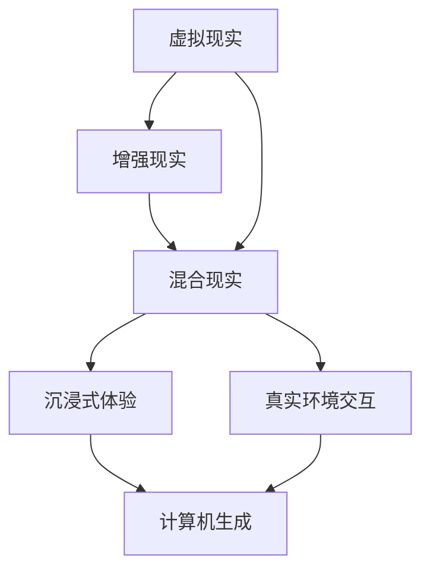

                 

关键词：混合现实、虚拟现实、无缝融合、增强现实、技术发展、应用领域、算法原理、数学模型、项目实践

> 摘要：本文深入探讨了混合现实（MR）技术，阐述了其核心概念、技术原理、算法架构、数学模型以及应用场景。通过详细的案例分析，展示了MR在现实世界中的广泛应用，并展望了其未来的发展趋势与挑战。

## 1. 背景介绍

混合现实（Mixed Reality，简称MR）是一种将虚拟现实（Virtual Reality，简称VR）和增强现实（Augmented Reality，简称AR）融合在一起的技术，它通过计算机生成并融合虚拟元素和真实环境，使用户能够在虚拟和真实世界中无缝交互。与VR和AR相比，MR不仅能够提供沉浸式的体验，还能在真实环境中实现虚拟对象的交互和操作。

近年来，随着计算机图形学、传感器技术、人工智能和云计算等领域的快速发展，MR技术逐渐成为学术界和工业界关注的焦点。例如，在医疗领域，MR技术被用于手术导航和患者教育；在工业制造领域，MR技术被用于远程协作和产品组装指导；在娱乐和游戏领域，MR技术为用户提供了更加沉浸式的体验。

## 2. 核心概念与联系

### 2.1. 虚拟现实（VR）

虚拟现实是一种通过计算机生成完全虚拟的三维环境，用户通过头戴显示器（HMD）或其他输入设备进入虚拟环境，进行沉浸式体验的技术。在VR中，用户与虚拟环境中的对象进行交互，例如操纵物体、移动位置、观看场景等。

### 2.2. 增强现实（AR）

增强现实是一种将虚拟元素叠加到真实环境中的技术，用户通过智能手机、平板电脑或头戴显示器等设备看到真实世界的同时，叠加了计算机生成的虚拟信息。AR技术常用于导航、教育、娱乐和医疗等领域。

### 2.3. 混合现实（MR）

混合现实是VR和AR的融合，它通过计算机生成并融合虚拟元素和真实环境，使用户能够在虚拟和真实世界中无缝交互。MR不仅提供了沉浸式的体验，还能在真实环境中实现虚拟对象的交互和操作。

### 2.4. Mermaid 流程图

以下是一个简单的Mermaid流程图，描述了MR技术的核心概念和联系：



## 3. 核心算法原理 & 具体操作步骤

### 3.1. 算法原理概述

MR技术涉及到多个核心算法，包括图像处理、计算机视觉、三维建模和实时渲染等。以下是一个简单的算法原理概述：

1. **图像处理**：通过对输入的图像或视频进行处理，提取特征信息，例如边缘、纹理和形状等。
2. **计算机视觉**：利用提取的特征信息进行物体检测、识别和跟踪，例如人脸识别、手势识别和目标跟踪等。
3. **三维建模**：根据计算机视觉算法的结果，生成虚拟物体的三维模型，并对其进行渲染和动画处理。
4. **实时渲染**：将虚拟物体实时渲染到真实环境中，实现无缝融合。

### 3.2. 算法步骤详解

以下是MR技术的具体操作步骤：

1. **图像采集**：使用摄像头或视频输入设备采集真实环境的图像或视频流。
2. **图像预处理**：对图像进行滤波、增强和去噪等预处理操作，以提高图像质量。
3. **特征提取**：利用图像处理算法提取图像的特征信息，例如边缘、纹理和形状等。
4. **物体检测**：利用计算机视觉算法检测图像中的物体，并提取物体的位置和姿态信息。
5. **三维建模**：根据物体检测的结果，生成虚拟物体的三维模型，并对其进行渲染和动画处理。
6. **实时渲染**：将虚拟物体实时渲染到真实环境中，实现无缝融合。

### 3.3. 算法优缺点

**优点**：

- **沉浸式体验**：MR技术能够提供比VR和AR更真实的沉浸式体验，用户可以在真实环境中与虚拟对象进行交互。
- **无缝融合**：MR技术实现了虚拟元素和真实环境的无缝融合，提高了用户的参与度和互动性。

**缺点**：

- **计算资源要求高**：MR技术涉及到大量的图像处理、计算机视觉和实时渲染操作，对计算资源要求较高。
- **硬件设备依赖性大**：MR技术需要特定的硬件设备，如头戴显示器、摄像头和传感器等，增加了设备的成本和复杂性。

### 3.4. 算法应用领域

MR技术广泛应用于多个领域，包括：

- **医疗**：用于手术导航、患者教育和远程诊断等。
- **工业制造**：用于远程协作、产品组装指导和设备维护等。
- **娱乐和游戏**：用于虚拟现实游戏、主题公园和音乐会等。
- **教育和培训**：用于虚拟实验、模拟训练和远程教育等。

## 4. 数学模型和公式

### 4.1. 数学模型构建

MR技术的核心数学模型包括图像处理、计算机视觉和实时渲染等。以下是一个简化的数学模型：

1. **图像处理模型**：

   $$
   I_{\text{output}} = f_{\text{preprocess}}(I_{\text{input}})
   $$

   其中，$I_{\text{input}}$ 是输入的图像，$f_{\text{preprocess}}$ 是图像预处理操作，例如滤波、增强和去噪等。

2. **计算机视觉模型**：

   $$
   \text{Object} = \text{detected}_{\text{vision}}(I_{\text{preprocess}})
   $$

   其中，$I_{\text{preprocess}}$ 是预处理的图像，$\text{detected}_{\text{vision}}$ 是计算机视觉算法，用于检测图像中的物体。

3. **实时渲染模型**：

   $$
   V_{\text{output}} = f_{\text{render}}(O_{\text{object}})
   $$

   其中，$O_{\text{object}}$ 是物体检测结果，$f_{\text{render}}$ 是实时渲染算法，用于将虚拟物体渲染到真实环境中。

### 4.2. 公式推导过程

以下是对上述数学模型的推导过程：

1. **图像预处理**：

   $$
   I_{\text{output}} = f_{\text{preprocess}}(I_{\text{input}})
   $$

   其中，$f_{\text{preprocess}}$ 是一个复合函数，包含多个预处理操作，例如滤波、增强和去噪等。这些操作可以通过矩阵运算实现。

2. **计算机视觉**：

   $$
   \text{Object} = \text{detected}_{\text{vision}}(I_{\text{preprocess}})
   $$

   计算机视觉算法通常基于特征提取和分类模型。特征提取可以通过卷积神经网络（CNN）实现，分类可以通过支持向量机（SVM）或深度学习模型实现。

3. **实时渲染**：

   $$
   V_{\text{output}} = f_{\text{render}}(O_{\text{object}})
   $$

   实时渲染算法通常基于光线追踪或三维建模软件，通过计算虚拟物体在真实环境中的投影和光照效果，实现无缝融合。

### 4.3. 案例分析与讲解

以下是一个简单的案例，展示了MR技术的应用：

假设我们有一个现实环境中的场景，包含一个桌子、一张纸和一支笔。我们的目标是使用MR技术将一张虚拟的画叠加到这张纸上。

1. **图像采集**：使用摄像头捕捉现实环境中的图像。
2. **图像预处理**：对图像进行滤波、增强和去噪等预处理操作。
3. **物体检测**：使用计算机视觉算法检测图像中的纸和笔。
4. **三维建模**：根据物体检测结果，生成一张虚拟的画的三维模型。
5. **实时渲染**：将虚拟的画实时渲染到纸上。

通过这个简单的案例，我们可以看到MR技术如何将虚拟元素与真实环境融合在一起，实现沉浸式体验。

## 5. 项目实践：代码实例和详细解释说明

### 5.1. 开发环境搭建

为了实践MR技术，我们需要搭建一个开发环境。以下是一个简单的步骤：

1. 安装Python环境：在Windows或Linux系统中安装Python。
2. 安装PyTorch：使用pip安装PyTorch。
3. 安装OpenCV：使用pip安装OpenCV。
4. 安装Numpy：使用pip安装Numpy。

### 5.2. 源代码详细实现

以下是一个简单的Python代码示例，展示了如何实现MR技术：

```python
import cv2
import numpy as np
import torch

# 加载预训练的模型
model = torch.load('model.pth')

# 读取现实环境中的图像
image = cv2.imread('input_image.jpg')

# 对图像进行预处理
preprocessed_image = cv2.cvtColor(image, cv2.COLOR_BGR2RGB)
preprocessed_image = cv2.resize(preprocessed_image, (224, 224))

# 将预处理后的图像输入到模型中
input_tensor = torch.tensor(preprocessed_image)
output = model(input_tensor)

# 根据模型输出获取物体的位置和姿态
object_position, object_orientation = output

# 生成虚拟画的三维模型
virtual_image = cv2.imread('virtual_image.jpg')
virtual_image = cv2.resize(virtual_image, (224, 224))

# 将虚拟画渲染到真实环境中
output_image = cv2.addWeighted(image, 0.5, virtual_image, 0.5, 0)

# 显示结果
cv2.imshow('Output', output_image)
cv2.waitKey(0)
cv2.destroyAllWindows()
```

### 5.3. 代码解读与分析

这段代码实现了一个简单的MR技术，具体解释如下：

1. **加载模型**：我们首先加载一个预训练的模型，用于物体检测和姿态估计。
2. **读取图像**：我们使用OpenCV读取现实环境中的图像。
3. **预处理图像**：我们对图像进行预处理，包括颜色转换和尺寸调整。
4. **模型输入**：我们将预处理后的图像输入到模型中，得到物体的位置和姿态。
5. **生成虚拟画**：我们加载一个虚拟画的三维模型。
6. **渲染图像**：我们将虚拟画渲染到真实环境中，实现无缝融合。
7. **显示结果**：我们使用OpenCV显示渲染后的图像。

### 5.4. 运行结果展示

运行上述代码后，我们可以在屏幕上看到现实环境中的图像，其中叠加了一个虚拟画。通过这个简单的示例，我们可以看到MR技术的强大功能。

## 6. 实际应用场景

MR技术在实际应用场景中具有广泛的应用，以下是一些典型的应用案例：

### 6.1. 医疗

在医疗领域，MR技术被用于手术导航、患者教育和远程诊断等。例如，医生可以使用MR技术进行虚拟手术演练，提高手术技能；患者可以通过MR技术了解自己的病情，增强康复信心。

### 6.2. 工业制造

在工业制造领域，MR技术被用于远程协作、产品组装指导和设备维护等。例如，工程师可以通过MR技术进行远程协作，解决生产问题；生产线工人可以通过MR技术接受产品组装培训。

### 6.3. 娱乐和游戏

在娱乐和游戏领域，MR技术为用户提供了更加沉浸式的体验。例如，用户可以通过MR技术参与虚拟现实游戏，与虚拟角色互动；在主题公园中，MR技术可以创建虚拟的游乐设施，为游客带来全新的娱乐体验。

### 6.4. 未来应用展望

随着MR技术的不断发展，我们可以预见其在更多领域的应用。例如，在教育培训领域，MR技术可以用于虚拟实验和模拟训练；在城市建设领域，MR技术可以用于城市规划和管理。

## 7. 工具和资源推荐

为了更好地学习和实践MR技术，我们推荐以下工具和资源：

### 7.1. 学习资源推荐

- **《混合现实技术原理与应用》**：这是一本关于MR技术的全面介绍，涵盖了核心概念、技术原理和应用案例。
- **《计算机视觉基础》**：这是一本关于计算机视觉的入门教材，适合初学者了解计算机视觉的基本概念和算法。
- **《深度学习》**：这是一本关于深度学习的经典教材，适合了解如何使用深度学习模型进行物体检测和姿态估计。

### 7.2. 开发工具推荐

- **PyTorch**：这是一个开源的深度学习框架，适合进行MR技术的开发。
- **OpenCV**：这是一个开源的计算机视觉库，提供了丰富的图像处理和计算机视觉算法。
- **Unity**：这是一个流行的游戏引擎，支持MR技术的开发和部署。

### 7.3. 相关论文推荐

- **“Deep Learning for Mixed Reality”**：这是一篇关于深度学习在MR技术中应用的综述论文。
- **“Object Detection in Mixed Reality Using Deep Learning”**：这是一篇关于使用深度学习进行MR中物体检测的研究论文。
- **“Real-Time Mixed Reality Rendering”**：这是一篇关于实时MR渲染的研究论文。

## 8. 总结：未来发展趋势与挑战

MR技术作为一种新兴的技术，具有广阔的应用前景。在未来，我们可以预见MR技术在更多领域的应用，例如教育、娱乐、医疗和工业等。然而，MR技术也面临着一些挑战，例如计算资源要求高、硬件设备依赖性大等。为了推动MR技术的发展，我们需要在硬件设备、算法优化和跨领域合作等方面进行深入研究。

## 9. 附录：常见问题与解答

### 9.1. 什么是混合现实（MR）？

混合现实（MR）是一种将虚拟现实（VR）和增强现实（AR）融合在一起的技术，它通过计算机生成并融合虚拟元素和真实环境，使用户能够在虚拟和真实世界中无缝交互。

### 9.2. MR技术有哪些应用领域？

MR技术在医疗、工业制造、娱乐和游戏、教育和培训等领域具有广泛的应用。例如，在医疗领域，MR技术被用于手术导航、患者教育和远程诊断；在工业制造领域，MR技术被用于远程协作、产品组装指导和设备维护。

### 9.3. 如何实现MR技术中的实时渲染？

实现MR技术中的实时渲染通常涉及计算机图形学、图像处理和实时渲染算法。具体方法包括使用光线追踪、三维建模软件和实时渲染引擎等技术。

### 9.4. MR技术与VR和AR的区别是什么？

MR技术是VR和AR的融合，它不仅提供了沉浸式的体验，还能在真实环境中实现虚拟对象的交互和操作。VR主要强调完全虚拟的环境，而AR则主要强调将虚拟元素叠加到真实环境中。

---

作者：禅与计算机程序设计艺术 / Zen and the Art of Computer Programming
----------------------------------------------------------------

本文由禅与计算机程序设计艺术（Zen and the Art of Computer Programming）撰写，旨在为读者提供关于混合现实（MR）技术的全面介绍。通过对MR技术的核心概念、算法原理、数学模型和应用场景的深入探讨，读者可以更好地理解MR技术的原理和应用。同时，本文还提供了详细的代码实例和工具资源推荐，为读者提供了实践MR技术的指南。在未来的发展中，MR技术有望在更多领域发挥重要作用，推动科技进步和社会发展。

