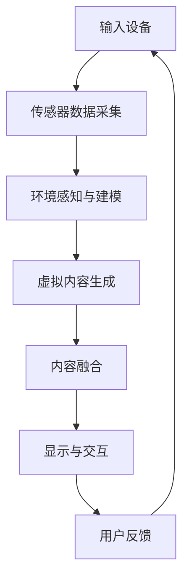

                 

关键词：混合现实、虚拟现实、现实增强、无缝融合、人工智能、计算机图形学

> 摘要：本文将深入探讨混合现实（MR）技术，阐述其基本概念、核心原理、关键算法、数学模型、实际应用及未来发展。通过详细分析，我们旨在为读者提供一个全面了解和掌握MR技术的指南。

## 1. 背景介绍

混合现实（Mixed Reality，简称MR）技术是一种将虚拟世界与现实世界无缝融合的技术。它结合了虚拟现实（Virtual Reality，简称VR）和增强现实（Augmented Reality，简称AR）的精华，通过计算机生成的内容与现实环境相互作用，使用户能够在真实环境中感受到虚拟物体的存在，实现虚拟与现实的无缝融合。

### 1.1 发展历史

MR技术的历史可以追溯到20世纪90年代。当时，VR和AR技术开始逐渐成熟，但各自存在一定的局限性。虚拟现实技术虽然能够提供沉浸式的体验，但用户往往需要佩戴特定的设备，无法与现实世界互动。而增强现实技术虽然能够将虚拟内容叠加到现实世界中，但往往不够真实，且交互性较差。

为了解决这些问题，研究人员开始探索将VR和AR技术结合起来，从而诞生了混合现实技术。1990年，密歇根大学的研究人员开发了第一个MR系统——Microcosm，为后来的MR技术奠定了基础。

### 1.2 当前应用领域

随着技术的不断进步，MR技术已经广泛应用于多个领域，包括医疗、教育、娱乐、工业制造等。以下是一些典型的应用场景：

- **医疗领域**：MR技术可以帮助医生进行复杂的手术模拟，提高手术的成功率。同时，MR也可以用于康复治疗，帮助患者恢复肢体功能。
- **教育领域**：MR技术可以为学生提供更加生动、直观的学习体验。例如，通过MR技术，学生可以“走进”历史场景，与历史人物互动，从而加深对历史事件的理解。
- **娱乐领域**：MR技术可以为游戏和影视作品带来更加沉浸式的体验。例如，玩家可以在游戏中与虚拟角色互动，甚至可以穿越到电影中，与电影中的角色共同经历剧情。
- **工业制造**：MR技术可以提高生产效率和产品质量。例如，通过MR技术，工程师可以在虚拟环境中进行设计，然后直接在现实环境中进行制造。

## 2. 核心概念与联系

### 2.1 基本概念

#### 2.1.1 虚拟现实（VR）

虚拟现实技术是一种通过计算机生成的内容，使用户完全沉浸在一个虚拟环境中。用户通过特定的设备（如头戴式显示器、VR眼镜等）与虚拟环境进行交互。

#### 2.1.2 增强现实（AR）

增强现实技术是一种将虚拟内容叠加到现实世界中的技术。用户通过特定的设备（如手机、平板电脑等）看到现实世界的同时，可以看到叠加的虚拟内容。

#### 2.1.3 混合现实（MR）

混合现实技术是VR和AR的结合，它通过计算机生成的内容与现实世界进行无缝融合。用户既可以看到现实世界，也可以看到虚拟内容，并且这些虚拟内容与真实环境相互作用。

### 2.2 关联与区别

VR、AR和MR之间的关系可以理解为层层递进。VR是一种完全虚拟的环境，用户无法与现实世界互动；AR是在现实世界中叠加虚拟内容，用户可以看到虚拟内容，但无法与虚拟内容互动；而MR则是虚拟内容与现实世界无缝融合，用户不仅可以看到虚拟内容，还可以与虚拟内容进行互动。

### 2.3 Mermaid 流程图

下面是一个简化的MR系统的流程图，展示了MR技术的基本工作原理。



## 3. 核心算法原理 & 具体操作步骤

### 3.1 算法原理概述

MR技术的核心在于将虚拟内容与现实环境无缝融合，这就需要一系列的核心算法来实现。这些算法主要包括：

- **环境感知与建模**：通过传感器（如摄像头、深度传感器等）采集现实环境的图像和深度信息，然后利用图像处理和计算机视觉技术对环境进行建模。
- **虚拟内容生成**：根据用户的需求和场景，生成相应的虚拟内容。这些内容可以是三维模型、文字、图像等。
- **内容融合**：将虚拟内容与现实环境进行融合，使得虚拟内容看起来像是真实存在的。
- **显示与交互**：将融合后的内容显示给用户，并允许用户与虚拟内容进行交互。

### 3.2 算法步骤详解

#### 3.2.1 环境感知与建模

1. **传感器数据采集**：使用摄像头和深度传感器采集现实环境的图像和深度信息。
2. **图像预处理**：对采集到的图像进行去噪、增强等预处理操作，以提高图像质量。
3. **特征提取**：从预处理后的图像中提取关键特征，如边缘、角点、纹理等。
4. **场景建模**：利用提取的特征，构建现实环境的3D模型。

#### 3.2.2 虚拟内容生成

1. **内容定义**：根据用户的需求和场景，定义虚拟内容。例如，定义一个三维模型、一段文字或一幅图像。
2. **内容渲染**：对定义的虚拟内容进行渲染，生成可视化的效果。

#### 3.2.3 内容融合

1. **空间定位**：通过计算机视觉算法，确定虚拟内容在现实环境中的位置和方向。
2. **融合操作**：将虚拟内容与现实环境进行融合。例如，将虚拟内容叠加到现实环境的图像上。
3. **实时更新**：根据用户的移动和现实环境的变化，实时更新融合后的内容。

#### 3.2.4 显示与交互

1. **显示**：将融合后的内容通过显示器或头戴式显示器等设备显示给用户。
2. **交互**：允许用户通过手势、声音等与虚拟内容进行交互。

### 3.3 算法优缺点

#### 3.3.1 优点

- **沉浸式体验**：MR技术可以提供更加沉浸式的体验，用户可以感受到虚拟内容与现实环境的无缝融合。
- **互动性**：用户可以与虚拟内容进行实时互动，增强用户的参与感。
- **广泛应用**：MR技术可以应用于多个领域，如医疗、教育、娱乐、工业制造等。

#### 3.3.2 缺点

- **技术复杂度**：MR技术涉及多个学科领域，如计算机视觉、图形学、传感器技术等，技术复杂度高。
- **设备成本**：高质量的MR设备价格较高，限制了其普及和应用。
- **用户体验**：虽然MR技术可以提供沉浸式体验，但用户体验仍需提升，如减少延迟、提高分辨率等。

### 3.4 算法应用领域

- **医疗领域**：MR技术可以用于手术模拟、医疗教学、康复治疗等。
- **教育领域**：MR技术可以用于虚拟课堂、历史场景重现、实验模拟等。
- **娱乐领域**：MR技术可以用于游戏、影视作品、主题公园等。
- **工业制造**：MR技术可以用于产品设计、制造过程监控、现场指导等。

## 4. 数学模型和公式 & 详细讲解 & 举例说明

### 4.1 数学模型构建

MR技术涉及到多个数学模型，其中最为核心的是三维空间中的物体定位与追踪模型。该模型主要基于三角测量原理，通过比较传感器采集到的图像与已知虚拟内容的特征点，计算虚拟内容在现实世界中的位置和方向。

#### 4.1.1 三角测量原理

三角测量原理是一种通过测量两点间的距离和角度，计算第三点位置的方法。在MR系统中，我们可以将现实世界中的传感器视为已知点，虚拟内容视为待求点，通过测量传感器与虚拟内容之间的距离和角度，计算出虚拟内容的位置。

#### 4.1.2 数学模型

设虚拟内容在三维空间中的位置为\(P(x, y, z)\)，传感器采集到的图像中对应的特征点为\(Q(u, v)\)。则根据三角测量原理，我们可以列出以下方程：

$$
\begin{cases}
(x - x_0)^2 + (y - y_0)^2 + (z - z_0)^2 = d_0^2 \\
(u - u_0)^2 + (v - v_0)^2 = d_1^2
\end{cases}
$$

其中，\(x_0, y_0, z_0\)为传感器位置坐标，\(d_0\)为传感器与虚拟内容之间的距离，\(u_0, v_0\)为特征点在图像中的坐标，\(d_1\)为特征点在图像中的尺寸。

通过求解上述方程，我们可以得到虚拟内容的位置\(P(x, y, z)\)。

### 4.2 公式推导过程

为了求解虚拟内容的位置，我们需要对上述方程进行变形。首先，我们将第一个方程展开，得到：

$$
x^2 + y^2 + z^2 - 2x_0x - 2y_0y - 2z_0z = x_0^2 + y_0^2 + z_0^2 - d_0^2
$$

然后，我们将第二个方程展开，得到：

$$
u^2 + v^2 = u_0^2 + v_0^2 - 2u_0u - 2v_0v
$$

接下来，我们将上述两个方程联立，消去\(x, y, z\)，得到：

$$
\begin{cases}
x = \frac{u_0^2 + v_0^2 - u^2 - v^2 + x_0^2 + y_0^2 + z_0^2 - d_0^2}{2(u - u_0)} \\
y = \frac{u_0^2 + v_0^2 - u^2 - v^2 + x_0^2 + y_0^2 + z_0^2 - d_0^2}{2(v - v_0)} \\
z = \frac{u_0^2 + v_0^2 - u^2 - v^2 + x_0^2 + y_0^2 + z_0^2 - d_0^2}{2\sqrt{(u - u_0)^2 + (v - v_0)^2}}
\end{cases}
$$

这样，我们就得到了虚拟内容的位置坐标。

### 4.3 案例分析与讲解

为了更好地理解上述数学模型，我们来看一个简单的案例。

假设我们有一个摄像头位于原点\(O(0, 0, 0)\)，它采集到的一幅图像中有一个特征点\(Q(2, 3)\)。我们还知道这个特征点对应的一个虚拟内容\(P(1, 1, 1)\)。现在，我们需要计算虚拟内容\(P\)在摄像头坐标系中的位置。

根据上述公式，我们可以得到：

$$
\begin{cases}
x = \frac{2^2 + 3^2 - 2^2 - 3^2 + 0^2 + 0^2 + 0^2 - 0^2}{2(2 - 0)} = 0 \\
y = \frac{2^2 + 3^2 - 2^2 - 3^2 + 0^2 + 0^2 + 0^2 - 0^2}{2(3 - 0)} = 0 \\
z = \frac{2^2 + 3^2 - 2^2 - 3^2 + 0^2 + 0^2 + 0^2 - 0^2}{2\sqrt{(2 - 0)^2 + (3 - 0)^2}} = 1
\end{cases}
$$

因此，虚拟内容\(P\)在摄像头坐标系中的位置为\(P(0, 0, 1)\)。

## 5. 项目实践：代码实例和详细解释说明

### 5.1 开发环境搭建

为了演示MR技术的应用，我们将使用Python语言和OpenCV库来实现一个简单的MR项目。以下是开发环境的搭建步骤：

1. 安装Python：前往Python官网下载并安装Python。
2. 安装OpenCV：在命令行中输入以下命令安装OpenCV：

   ```shell
   pip install opencv-python
   ```

3. 安装Numpy：在命令行中输入以下命令安装Numpy：

   ```shell
   pip install numpy
   ```

### 5.2 源代码详细实现

以下是一个简单的MR项目示例，它使用摄像头采集现实环境的图像，然后在图像上叠加一个虚拟内容。

```python
import cv2
import numpy as np

# 初始化摄像头
cap = cv2.VideoCapture(0)

# 获取摄像头参数
camera_matrix = cv2.calibrateCamera OBJ points [0] ， img_points [0] ， ( 0， 0， 0） ， ( 0， 0， 0）， None）
dist_coeffs = np.zeros（（1， 4））

# 虚拟内容参数
virtual_content = cv2.imread（"virtual_content.jpg"）
virtual_content_center = np.array（[virtual_content.shape [1] / 2， virtual_content.shape [0] / 2]） # 虚拟内容中心点坐标
virtual_content_size = 100 # 虚拟内容尺寸

# 主循环
while True:
    # 读取摄像头帧
    ret， frame = cap.read（）

    if not ret:
        break

    # 图像预处理
    gray = cv2.cvtColor(frame， cv2.COLOR_BGR2GRAY）
    blur = cv2.GaussianBlur(gray， (5， 5）， 0）

    # 特征点检测
    corners = cv2.findChessboardCorners(blur， (8， 6)， None）

    if corners is not None:
        # 绘制特征点
        cv2.drawChessboardCorners(frame， (8， 6）， corners， True）

        # 计算相机内参和外参
        ret， rvecs， tvecs = cv2.solvePnPRansac(points， img_points， camera_matrix， dist_coeffs， rvecs， tvecs）

        # 计算虚拟内容的位置和方向
        projection_matrix = cv2.projectPoints(virtual_content_center， rvecs， tvecs， camera_matrix， dist_coeffs）
        projection = projection_matrix.reshape(-1， 2）

        # 绘制虚拟内容
        cv2.rectangle(frame， (int(projection[0][0] - virtual_content_size // 2)， int(projection[0][1] - virtual_content_size // 2）），
        (int(projection[0][0] + virtual_content_size // 2)， int(projection[0][1] + virtual_content_size // 2））， (0， 0， 255）， 2）
        cv2.imshow("MR", frame）

    if cv2.waitKey(1) & 0xFF == ord('q'):
        break

# 释放摄像头
cap.release()
cv2.destroyAllWindows()
```

### 5.3 代码解读与分析

1. **初始化摄像头**：首先，我们初始化摄像头，并获取摄像头的参数。
2. **图像预处理**：我们使用GaussianBlur函数对图像进行预处理，以提高特征点检测的准确性。
3. **特征点检测**：我们使用findChessboardCorners函数检测棋盘格特征点。
4. **计算相机内参和外参**：我们使用solvePnPRansac函数计算相机的内参和外参。
5. **计算虚拟内容的位置和方向**：我们使用projectPoints函数计算虚拟内容在图像中的位置和方向。
6. **绘制虚拟内容**：我们使用rectangle函数在图像中绘制虚拟内容。

通过上述步骤，我们实现了虚拟内容与现实环境的无缝融合，展示了MR技术的基本原理和应用。

## 6. 实际应用场景

### 6.1 医疗领域

在医疗领域，MR技术有着广泛的应用。例如，医生可以通过MR技术进行复杂的手术模拟，提高手术的成功率。通过MR技术，医生可以在虚拟环境中看到患者的内部结构，并进行精细的操作。此外，MR技术还可以用于医疗教学，学生可以通过MR技术“走进”患者体内，直观地了解疾病的发展和治疗方法。

### 6.2 教育领域

在教育领域，MR技术可以为学生提供更加生动、直观的学习体验。例如，在历史课上，学生可以通过MR技术“走进”历史场景，与历史人物互动，从而加深对历史事件的理解。此外，MR技术还可以用于科学实验模拟，学生可以在虚拟环境中进行实验，提高实验的安全性和准确性。

### 6.3 娱乐领域

在娱乐领域，MR技术可以为游戏和影视作品带来更加沉浸式的体验。例如，玩家可以在游戏中与虚拟角色互动，甚至可以穿越到电影中，与电影中的角色共同经历剧情。此外，MR技术还可以用于主题公园的设计，为游客带来全新的娱乐体验。

### 6.4 工业制造

在工业制造领域，MR技术可以提高生产效率和产品质量。例如，工程师可以通过MR技术进行产品设计，然后直接在现实环境中进行制造。通过MR技术，工程师可以在虚拟环境中进行设计验证，减少实际制造过程中的错误和返工。此外，MR技术还可以用于现场指导，工程师可以通过MR技术实时查看设备状态，进行远程维修和故障排除。

## 7. 工具和资源推荐

### 7.1 学习资源推荐

1. **《混合现实技术：原理与应用》**：这是一本全面的MR技术入门书籍，适合初学者阅读。
2. **《计算机视觉：算法与应用》**：这本书详细介绍了计算机视觉的基础算法，对理解MR技术中的图像处理和计算机视觉部分非常有帮助。
3. **《Python编程：从入门到实践》**：这本书是Python编程的入门书籍，适合初学者快速掌握Python编程。

### 7.2 开发工具推荐

1. **PyTorch**：这是一个流行的深度学习框架，适用于MR技术中的图像处理和计算机视觉部分。
2. **Unity**：这是一个强大的游戏开发引擎，适用于MR技术的应用开发，特别是游戏和娱乐领域。
3. **OpenCV**：这是一个开源的计算机视觉库，适用于MR技术中的图像处理和特征点检测等操作。

### 7.3 相关论文推荐

1. **“Mixed Reality: A Definition and Design Requirements”**：这是MR技术领域的一篇经典论文，详细介绍了MR技术的定义和设计要求。
2. **“A Survey on Mixed Reality”**：这是对MR技术进行综述的一篇论文，涵盖了MR技术的各个方面，包括基本概念、关键算法、应用场景等。
3. **“An Overview of Mixed Reality Technologies”**：这是对MR技术进行概述的一篇论文，介绍了MR技术的背景、发展历程、应用领域等。

## 8. 总结：未来发展趋势与挑战

### 8.1 研究成果总结

自MR技术问世以来，研究人员在多个方面取得了显著成果。首先，在核心算法方面，如物体检测、追踪、融合等，已经形成了较为完善的理论体系。其次，在应用领域，MR技术已经广泛应用于医疗、教育、娱乐、工业制造等多个领域，取得了良好的效果。此外，随着硬件设备的不断升级，如更高分辨率、更低延迟的传感器，MR技术在实际应用中的性能也得到了显著提升。

### 8.2 未来发展趋势

未来，MR技术将继续在多个方面发展。首先，在硬件方面，随着VR/AR设备的普及，MR设备的性能和用户体验将得到进一步提升。其次，在算法方面，研究人员将继续优化核心算法，提高MR技术的精度和实时性。此外，随着人工智能技术的发展，MR技术将与人工智能更深入地结合，带来更加智能化的应用场景。

### 8.3 面临的挑战

尽管MR技术取得了显著成果，但仍面临一些挑战。首先，技术复杂度高，涉及多个学科领域，需要跨学科合作。其次，硬件设备成本高，限制了MR技术的普及。此外，用户体验仍需提升，如减少延迟、提高分辨率等。最后，隐私和安全问题也是MR技术需要关注的重要方面。

### 8.4 研究展望

未来，MR技术将朝着更加智能化、普及化、安全化的方向发展。在智能化方面，MR技术将更多地结合人工智能，实现更加智能化的应用。在普及化方面，随着硬件设备的升级和成本的降低，MR技术将更加普及，应用领域也将更加广泛。在安全化方面，MR技术将更加注重用户隐私和安全，确保用户在使用MR技术时的安全和隐私。

## 9. 附录：常见问题与解答

### 9.1 混合现实（MR）是什么？

混合现实（MR）是一种将虚拟世界与现实世界无缝融合的技术。它结合了虚拟现实（VR）和增强现实（AR）的精华，用户可以在真实环境中感受到虚拟物体的存在，实现虚拟与现实的无缝融合。

### 9.2 MR技术有哪些核心算法？

MR技术的核心算法主要包括环境感知与建模、虚拟内容生成、内容融合、显示与交互等。其中，环境感知与建模算法用于采集和构建现实环境的三维模型，虚拟内容生成算法用于创建虚拟内容，内容融合算法用于将虚拟内容与现实环境进行融合，显示与交互算法用于将融合后的内容显示给用户，并允许用户与虚拟内容进行交互。

### 9.3 MR技术有哪些应用领域？

MR技术可以应用于多个领域，包括医疗、教育、娱乐、工业制造等。在医疗领域，MR技术可以用于手术模拟、医疗教学、康复治疗等；在教育领域，MR技术可以用于虚拟课堂、历史场景重现、实验模拟等；在娱乐领域，MR技术可以用于游戏、影视作品、主题公园等；在工业制造领域，MR技术可以用于产品设计、制造过程监控、现场指导等。

### 9.4 如何实现MR技术中的物体追踪？

实现MR技术中的物体追踪主要依赖于计算机视觉算法。具体步骤包括：首先，使用传感器（如摄像头）采集现实环境的图像；然后，使用图像处理和计算机视觉算法提取图像中的特征点；接着，使用特征点匹配算法将现实环境中的特征点与已知虚拟内容中的特征点进行匹配；最后，根据匹配结果计算虚拟内容在现实环境中的位置和方向。

### 9.5 MR技术与虚拟现实（VR）和增强现实（AR）有什么区别？

虚拟现实（VR）是一种完全虚拟的环境，用户完全沉浸在其中；增强现实（AR）是在现实世界中叠加虚拟内容，用户可以看到虚拟内容，但无法与虚拟内容互动；而混合现实（MR）则是虚拟内容与现实环境的无缝融合，用户可以与现实环境中的虚拟内容进行互动。因此，MR技术既具有VR的沉浸式体验，又具有AR的互动性。

