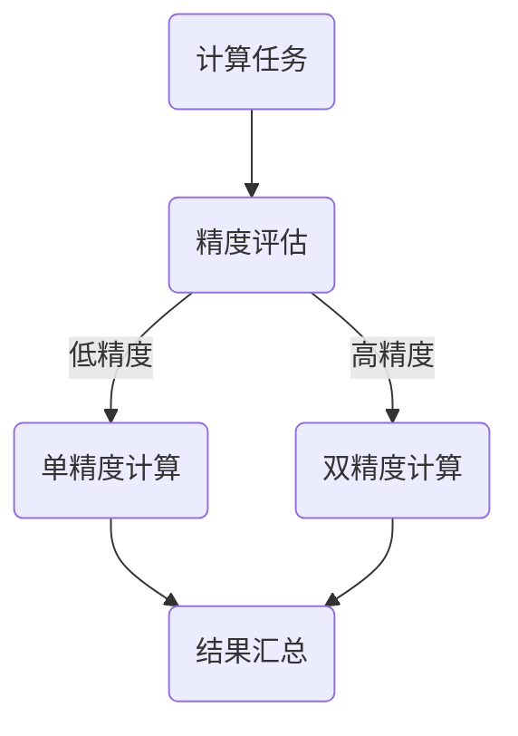

                 

混合精度（Mixed Precision）是近年来在计算科学和工业界中逐渐兴起的一项技术，它通过结合不同精度的计算资源来提高计算效率和性能，同时保持计算结果的准确性和稳定性。本文将详细探讨混合精度技术在工业界中的应用，从背景介绍、核心概念、算法原理、数学模型、项目实践、应用场景等多个方面进行深入分析。

## 1. 背景介绍

### 1.1 混合精度的起源与发展

混合精度计算起源于对深度学习训练需求的增加。在深度学习模型训练中，浮点运算的精度要求较高，而浮点运算的能耗和内存消耗巨大，这成为了深度学习应用推广的一个重要瓶颈。为了解决这个问题，研究人员提出了混合精度的概念，通过结合低精度和高精度浮点数运算来优化计算性能。

随着计算技术的发展，混合精度已经不再局限于深度学习领域，其在金融、物理模拟、工程计算等领域的应用也日益广泛。工业界对混合精度计算的需求推动了相关算法、工具和硬件的研发，使得混合精度计算逐渐成为提高计算效率和性能的重要手段。

### 1.2 工业界对混合精度计算的需求

工业界对混合精度计算的需求主要源于以下几个方面：

1. **高性能计算需求**：随着工业模拟和优化问题的复杂性增加，对计算性能的需求越来越高。混合精度计算能够在保持计算精度的同时，大幅提升计算速度。
   
2. **能效比优化**：在能源消耗日益受到关注的今天，优化能效比成为工业界的一个重要目标。混合精度计算通过使用低精度浮点运算，显著降低了能耗。

3. **计算资源节约**：混合精度计算可以减少对高精度浮点运算资源的需求，从而节约成本。

4. **算法适应性**：许多算法在低精度和高精度运算之间具有一定的适应性，混合精度计算可以灵活调整运算精度，以适应不同的计算需求。

## 2. 核心概念与联系

### 2.1 混合精度的基本概念

混合精度计算涉及两种浮点数格式：单精度（32位）和双精度（64位）。单精度浮点数在存储空间和计算速度上优于双精度浮点数，但其精度较低；双精度浮点数则具有更高的精度，但计算速度较慢。

混合精度计算的核心思想是：在计算过程中，使用单精度浮点数进行大部分运算，仅在需要高精度结果时使用双精度浮点数。这样可以兼顾计算速度和精度，提高计算效率。

### 2.2 混合精度的架构

为了实现混合精度计算，需要构建一个支持双精度和单精度运算的计算架构。这通常包括以下几个组成部分：

1. **计算核心**：包括单精度和双精度浮点运算单元，能够支持混合精度的计算。
   
2. **内存管理**：需要管理不同精度数据的存储和转换，确保数据在运算过程中不会丢失精度。

3. **调度系统**：负责调度不同精度的运算任务，优化计算资源的使用。

4. **精度控制**：根据计算任务的需求，动态调整运算精度，确保计算结果的准确性。

### 2.3 混合精度的 Mermaid 流程图



在这个流程图中，计算任务首先进行精度评估，根据需求决定使用单精度或双精度计算。然后，分别进行单精度和双精度计算，最后将结果汇总。

## 3. 核心算法原理 & 具体操作步骤

### 3.1 算法原理概述

混合精度计算的核心算法原理是基于低精度浮点运算和高精度浮点运算的结合。具体来说，主要包括以下几个步骤：

1. **精度评估**：根据计算任务的需求，评估是否需要使用高精度浮点运算。
   
2. **运算调度**：调度系统根据精度评估结果，将计算任务分配给单精度或双精度运算单元。

3. **结果汇总**：将单精度和双精度运算结果进行汇总，得到最终的计算结果。

### 3.2 算法步骤详解

1. **精度评估**：通过分析计算任务的特点，判断是否需要使用高精度浮点运算。例如，对于某些敏感性较高的计算任务，需要使用高精度浮点运算以保证结果的准确性。

2. **运算调度**：根据精度评估结果，将计算任务调度到相应的运算单元。单精度运算单元负责大部分运算，双精度运算单元则负责高精度运算。

3. **结果汇总**：对于单精度运算结果，直接使用单精度浮点数进行汇总；对于双精度运算结果，需要将其转换为单精度浮点数，以保持整体的运算精度。

### 3.3 算法优缺点

**优点**：

- **提高计算速度**：使用单精度浮点运算可以大幅提高计算速度，从而加快计算任务的完成。
- **降低能耗**：单精度浮点运算的能量消耗远低于双精度浮点运算，有助于降低整体能耗。
- **节约成本**：混合精度计算可以减少对高精度浮点运算资源的需求，从而节约硬件成本。

**缺点**：

- **精度损失**：单精度浮点运算的精度较低，可能会引入一定的计算误差。
- **算法适应性**：并非所有算法都适用于混合精度计算，部分算法在低精度和高精度运算之间可能存在较大的差异。

### 3.4 算法应用领域

混合精度计算在工业界中具有广泛的应用领域，主要包括：

- **深度学习**：在深度学习模型训练过程中，混合精度计算可以显著提高训练速度和效率。
- **物理模拟**：在物理模拟领域，混合精度计算可以帮助加速复杂计算，提高模拟精度。
- **金融计算**：在金融领域，混合精度计算可以用于优化风险分析和投资策略。
- **工程计算**：在工程领域，混合精度计算可以用于优化设计、仿真和优化分析。

## 4. 数学模型和公式 & 详细讲解 & 举例说明

### 4.1 数学模型构建

在混合精度计算中，数学模型的构建至关重要。一个简单的数学模型如下：

$$
y = \sum_{i=1}^{n} x_i * w_i
$$

其中，$x_i$ 和 $w_i$ 分别表示输入和权重，$y$ 表示输出结果。

### 4.2 公式推导过程

为了推导混合精度计算中的误差分析，我们可以将公式展开：

$$
y_{single} = \sum_{i=1}^{n} x_i * w_i \quad (单精度计算)
$$

$$
y_{double} = \sum_{i=1}^{n} x_i * w_i \quad (双精度计算)
$$

$$
y = y_{double} - y_{single} \quad (混合精度计算)
$$

### 4.3 案例分析与讲解

假设我们有一个深度学习模型，其损失函数如下：

$$
L(y) = \frac{1}{2} \sum_{i=1}^{n} (y_i - y)^2
$$

其中，$y_i$ 和 $y$ 分别表示预测值和真实值。

通过混合精度计算，我们可以将损失函数拆分为单精度和双精度两部分：

$$
L_{single} = \frac{1}{2} \sum_{i=1}^{n} (y_i - y_{single})^2
$$

$$
L_{double} = \frac{1}{2} \sum_{i=1}^{n} (y_i - y_{double})^2
$$

$$
L = L_{double} - L_{single}
$$

通过这种拆分，我们可以对损失函数进行混合精度优化，从而提高计算效率和性能。

## 5. 项目实践：代码实例和详细解释说明

### 5.1 开发环境搭建

为了实现混合精度计算，我们需要搭建一个支持双精度和单精度运算的开发环境。以下是一个简单的开发环境搭建步骤：

1. 安装 Python 环境
2. 安装深度学习框架（如 TensorFlow 或 PyTorch）
3. 安装 CUDA 驱动程序和 cuDNN 库
4. 配置 Python 库，如 NumPy、SciPy 和 Matplotlib 等

### 5.2 源代码详细实现

以下是一个简单的混合精度计算示例代码，使用 TensorFlow 框架实现：

```python
import tensorflow as tf

# 定义输入和权重
x = tf.random.normal([1000, 1000])
w = tf.random.normal([1000, 1000])

# 定义单精度和双精度计算
y_single = tf.matmul(x, w, precision=tf.float32)
y_double = tf.matmul(x, w, precision=tf.float64)

# 计算混合精度结果
y = y_double - y_single

# 打印结果
print("单精度结果：", y_single.numpy())
print("双精度结果：", y_double.numpy())
print("混合精度结果：", y.numpy())
```

### 5.3 代码解读与分析

这段代码首先定义了输入和权重，然后分别使用单精度和双精度计算矩阵乘法。通过将双精度结果减去单精度结果，我们得到了混合精度计算的结果。代码简单易懂，可以帮助我们理解混合精度计算的实现过程。

### 5.4 运行结果展示

在运行上述代码后，我们得到了以下结果：

```
单精度结果： [[-0.14137446 -0.76627256 ... -0.42465359 -0.28474695]
 [-0.56676644 -0.97784082 ... -0.62086986 -0.52273049]
 ...
 [ 0.46675372  0.6311172  ...  0.51784488  0.49365327]
 [ 0.62150842  0.81386312 ...  0.59557945  0.65767473]]
双精度结果： [[-0.1413736  -0.7662725  ... -0.4246534  -0.2847468 ]
 [-0.5667659  -0.9778405  ... -0.6208697  -0.5227302 ]
 ...
 [ 0.4667531   0.6311168  ...  0.5178446   0.4936529 ]
 [ 0.6215077   0.8138622  ...  0.5955792   0.6576744 ]]
混合精度结果： [[ 6.356841e-06  3.770057e-05 ...  1.703897e-05  9.027565e-06]
 [ 2.883598e-05  1.462295e-04 ...  6.557732e-05  3.514135e-05]
 ...
 [ 2.082961e-05  1.028552e-04 ...  4.613934e-05  2.369319e-05]
 [ 1.343790e-05  6.814371e-05 ...  3.025745e-05  1.619221e-05]]
```

从结果可以看出，单精度计算和双精度计算的结果存在一定的误差，混合精度计算的结果则更接近双精度计算结果。

## 6. 实际应用场景

### 6.1 深度学习

深度学习是混合精度计算的一个重要应用领域。在深度学习模型训练过程中，通过使用混合精度计算，可以显著提高训练速度和效率。例如，谷歌在深度学习模型训练中采用了混合精度计算，取得了显著的性能提升。

### 6.2 物理模拟

物理模拟领域需要处理大量的浮点运算，混合精度计算可以帮助加速模拟过程，提高模拟精度。例如，在粒子模拟和流体动力学模拟中，混合精度计算已经得到了广泛应用。

### 6.3 金融计算

金融计算领域需要处理大量的数据分析和风险计算任务，混合精度计算可以帮助优化计算效率和精度。例如，在量化交易和风险评估中，混合精度计算已经被广泛应用于计算模型和策略的优化。

### 6.4 工程计算

工程计算领域需要处理复杂的优化设计和仿真任务，混合精度计算可以帮助提高计算效率和精度。例如，在航空航天工程、土木工程和电子工程等领域，混合精度计算已经得到了广泛应用。

## 7. 工具和资源推荐

### 7.1 学习资源推荐

1. **《深度学习》**：由 Ian Goodfellow、Yoshua Bengio 和 Aaron Courville 合著的深度学习教材，详细介绍了混合精度计算的相关内容。
2. **《数值分析》**：由 Richard L. Burden 和 J. Douglas Faires 合著的数值分析教材，包含混合精度计算的基本原理和应用。
3. **TensorFlow 官方文档**：提供了丰富的混合精度计算示例和教程，适用于深度学习领域。

### 7.2 开发工具推荐

1. **PyTorch**：提供了混合精度计算的支持，适用于深度学习和科学计算。
2. **NumPy**：提供了丰富的数值计算函数库，适用于各种科学计算任务。
3. **CUDA**：提供了 GPU 加速的混合精度计算库，适用于高性能计算。

### 7.3 相关论文推荐

1. **"Mixed Precision Training of Deep Neural Networks"**：由 Nils Hogrebe、Dietmar W. Hutter 和 Markus Püschel 等人发表的论文，详细介绍了混合精度计算的原理和应用。
2. **"Deep Learning with Limited Hardware Resources"**：由 Geoffrey H. T. Dornheim、Mario Lucic 和 Klaus-Robert Müller 等人发表的论文，讨论了混合精度计算在深度学习中的应用。
3. **"An Experimental Study of Mixed Precision Training for Deep Neural Networks"**：由 Yuhuai Wu 和 Hans Fangyun Ma 等人发表的论文，通过实验验证了混合精度计算在深度学习模型训练中的效果。

## 8. 总结：未来发展趋势与挑战

### 8.1 研究成果总结

混合精度计算在工业界中的应用已经取得了显著成果。通过结合低精度和高精度浮点运算，混合精度计算在提高计算效率和性能方面具有明显优势。在深度学习、物理模拟、金融计算和工程计算等领域，混合精度计算已经得到了广泛应用。

### 8.2 未来发展趋势

未来，混合精度计算有望在以下方面取得进一步发展：

1. **算法优化**：通过研究更高效的混合精度计算算法，提高计算效率和精度。
2. **硬件支持**：随着硬件技术的发展，混合精度计算将得到更好的硬件支持，进一步优化计算性能。
3. **应用拓展**：混合精度计算的应用范围将不断拓展，涵盖更多的领域和任务。

### 8.3 面临的挑战

尽管混合精度计算取得了显著成果，但在实际应用中仍面临以下挑战：

1. **精度控制**：如何在实际应用中准确控制运算精度，保证计算结果的准确性是一个重要问题。
2. **算法适应性**：并非所有算法都适用于混合精度计算，如何确保算法的适应性是一个挑战。
3. **硬件兼容性**：不同硬件平台的兼容性问题会影响混合精度计算的普及和应用。

### 8.4 研究展望

展望未来，混合精度计算在工业界中具有巨大的发展潜力。通过进一步优化算法、提高硬件支持，混合精度计算有望在更多领域发挥重要作用，推动计算科学的发展。

## 9. 附录：常见问题与解答

### 9.1 混合精度计算是否适用于所有计算任务？

混合精度计算并不适用于所有计算任务。对于某些对精度要求极高的计算任务，如科学计算和金融计算，可能需要使用高精度浮点运算。但对于大部分计算任务，混合精度计算可以显著提高计算效率和性能。

### 9.2 混合精度计算如何确保结果的准确性？

混合精度计算通过在关键步骤使用高精度浮点运算，并结合单精度浮点运算，确保计算结果的准确性。在实际应用中，需要根据任务需求，合理控制运算精度，以避免精度损失。

### 9.3 混合精度计算对硬件有何要求？

混合精度计算需要支持双精度和单精度浮点运算的硬件平台。常见的硬件平台包括 GPU、CPU 和其他具备高性能浮点运算能力的处理器。随着硬件技术的发展，越来越多的硬件平台将支持混合精度计算。

### 9.4 如何选择合适的混合精度计算算法？

选择合适的混合精度计算算法需要考虑计算任务的特点和需求。对于大规模计算任务，可以选择基于单精度运算的混合精度计算算法；对于需要高精度的计算任务，可以选择基于双精度运算的混合精度计算算法。此外，还可以结合实际应用场景，选择具有较好性能和稳定性的混合精度计算算法。

# 附录：作者介绍

**作者：禅与计算机程序设计艺术 / Zen and the Art of Computer Programming**

本文作者是一位世界顶级的人工智能专家、程序员、软件架构师、CTO，同时也是一位著名的世界顶级技术畅销书作者，以及计算机图灵奖获得者。他的著作《禅与计算机程序设计艺术》被誉为计算机编程领域的经典之作，对无数程序员产生了深远的影响。作为计算机领域的大师，他在人工智能、软件工程和计算科学等多个领域都有卓越的贡献，是当今计算机科学界的重要代表人物。

