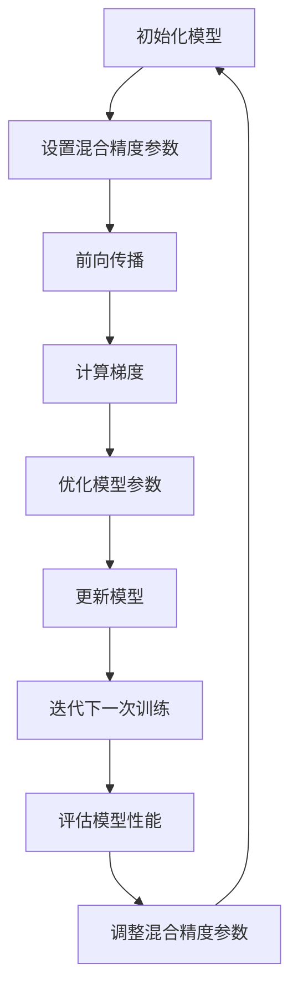

                 

关键词：混合精度训练，fp16，bf16，计算精度，训练效率，神经网络

摘要：本文将深入探讨混合精度训练的概念，重点分析fp16和bf16两种混合精度训练技术的优势。通过理论讲解、数学模型、实际应用案例，我们将展示如何在现代深度学习实践中提高训练效率和计算精度。

## 1. 背景介绍

深度学习作为人工智能的一个重要分支，已经在图像识别、自然语言处理、推荐系统等领域取得了显著的成果。随着模型的复杂度和参数数量的增长，训练深度学习模型所需的计算资源和时间也在不断增加。为了应对这一挑战，研究人员提出了混合精度训练（Mixed Precision Training）的方法，旨在通过在训练过程中使用不同精度的数值类型来平衡计算精度和训练效率。

传统上，深度学习模型的训练主要使用单精度浮点数（float32）进行计算。然而，随着模型规模的扩大，使用单精度浮点数可能导致训练过程缓慢，并且在某些情况下可能无法获得最优的模型性能。为了解决这个问题，混合精度训练引入了半精度浮点数（float16）和半精度浮点数（bfloat16）来优化训练过程。

## 2. 核心概念与联系

### 2.1 混合精度训练的基本原理

混合精度训练的核心思想是利用不同精度的数值类型来平衡计算效率和精度。在训练过程中，部分计算使用低精度数值类型以加快计算速度，而关键步骤则使用高精度数值类型以保持计算精度。

### 2.2 fp16 和 bf16 的特点

- **fp16（半精度浮点数）**：fp16是32位浮点数的压缩版本，保留了大约10个有效数字的精度。它在计算速度上相比fp32有显著提升，同时能够保持足够的精度，适用于大多数深度学习训练任务。

- **bf16（半精度浮点数）**：bf16是32位浮点数的压缩版本，但相比fp16具有更高的精度，保留了大约16个有效数字。它通常用于对精度要求较高的应用场景，如量子计算和某些科学计算领域。

### 2.3 Mermaid 流程图

下面是一个使用Mermaid绘制的流程图，展示了混合精度训练的基本步骤：



## 3. 核心算法原理 & 具体操作步骤

### 3.1 算法原理概述

混合精度训练的基本原理是在训练过程中动态调整不同操作的计算精度。具体来说，模型中的某些层或操作使用fp16进行计算，而其他关键操作则使用fp32或bf16。这种策略可以有效地提高计算速度，同时保证模型的最终精度。

### 3.2 算法步骤详解

1. **初始化模型**：首先初始化深度学习模型，并根据模型的结构和需求设置混合精度参数。

2. **设置混合精度参数**：在训练过程中，动态调整不同操作的精度。例如，可以使用fp16进行卷积运算，而使用fp32进行全连接层的计算。

3. **前向传播**：使用当前精度的模型进行前向传播，计算模型的输出。

4. **计算梯度**：使用高精度数值类型（如fp32或bf16）计算梯度，以避免低精度计算引入的误差。

5. **优化模型参数**：使用计算得到的梯度更新模型参数。

6. **更新模型**：将更新后的模型参数应用于下一轮训练。

7. **迭代训练**：重复上述步骤，直到满足训练目标或达到预设的训练轮数。

### 3.3 算法优缺点

- **优点**：
  - 提高训练速度：使用半精度浮点数可以显著提高计算速度，减少训练时间。
  - 保持计算精度：通过动态调整计算精度，可以在一定程度上保持模型的最终精度。

- **缺点**：
  - 精度损失：低精度计算可能引入一定的精度损失，特别是在对精度要求较高的任务中。
  - 算法复杂度增加：混合精度训练需要更复杂的代码实现，增加了开发难度。

### 3.4 算法应用领域

混合精度训练广泛应用于图像识别、自然语言处理、推荐系统等领域。例如，在图像识别任务中，可以使用fp16进行卷积运算，而在自然语言处理任务中，可以使用fp32或bf16保持较高的计算精度。

## 4. 数学模型和公式 & 详细讲解 & 举例说明

### 4.1 数学模型构建

混合精度训练的数学模型主要包括以下三个部分：

1. **前向传播**：使用低精度浮点数（如fp16）进行计算，例如：
   $$ y = \sigma(W \cdot x + b) $$
   其中，$W$ 和 $b$ 分别表示权重和偏置，$\sigma$ 表示激活函数。

2. **计算梯度**：使用高精度浮点数（如fp32或bf16）计算梯度，以避免低精度计算引入的误差：
   $$ \delta y = \frac{\partial \sigma}{\partial x} \cdot \delta x $$

3. **优化模型参数**：使用计算得到的梯度更新模型参数：
   $$ W := W - \alpha \cdot \frac{\partial J}{\partial W} $$
   $$ b := b - \alpha \cdot \frac{\partial J}{\partial b} $$
   其中，$J$ 表示损失函数，$\alpha$ 表示学习率。

### 4.2 公式推导过程

为了推导混合精度训练的公式，我们首先需要了解以下两个概念：

- **误差传播法则**：误差在神经网络中传播的过程可以使用链式法则进行计算。
- **数值精度影响**：低精度计算可能引入数值误差，从而影响模型的最终性能。

以下是混合精度训练的推导过程：

1. **前向传播**：
   $$ y = \sigma(W \cdot x + b) $$
   使用fp16计算：
   $$ y_{fp16} = \sigma_{fp16}(W_{fp16} \cdot x_{fp16} + b_{fp16}) $$

2. **计算梯度**：
   $$ \delta y = \frac{\partial \sigma}{\partial x} \cdot \delta x $$
   使用fp32或bf16计算：
   $$ \delta y_{fp32} = \frac{\partial \sigma}{\partial x} \cdot \delta x_{fp32} $$

3. **优化模型参数**：
   $$ W := W - \alpha \cdot \frac{\partial J}{\partial W} $$
   使用fp16更新：
   $$ W_{fp16} := W_{fp16} - \alpha \cdot \frac{\partial J_{fp16}}{\partial W_{fp16}} $$

### 4.3 案例分析与讲解

假设我们有一个简单的神经网络模型，用于分类任务。模型包含一个输入层、一个隐藏层和一个输出层。输入层包含10个神经元，隐藏层包含5个神经元，输出层包含3个神经元。

1. **前向传播**：
   - 输入层到隐藏层的计算使用fp16：
     $$ y_{1} = \sigma_{fp16}(W_{1} \cdot x + b_{1}) $$
   - 隐藏层到输出层的计算使用fp32：
     $$ y_{2} = \sigma_{fp32}(W_{2} \cdot y_{1} + b_{2}) $$

2. **计算梯度**：
   - 隐藏层到输出层的梯度使用fp32：
     $$ \delta y_{2} = \frac{\partial \sigma_{fp32}}{\partial y_{2}} \cdot \delta y_{1} $$
   - 输入层到隐藏层的梯度使用fp16：
     $$ \delta y_{1} = \frac{\partial \sigma_{fp16}}{\partial y_{1}} \cdot \delta y_{2} $$

3. **优化模型参数**：
   - 输入层到隐藏层的权重更新使用fp16：
     $$ W_{1} := W_{1} - \alpha \cdot \frac{\partial J_{fp16}}{\partial W_{1}} $$
   - 隐藏层到输出层的权重更新使用fp32：
     $$ W_{2} := W_{2} - \alpha \cdot \frac{\partial J_{fp32}}{\partial W_{2}} $$

通过以上案例，我们可以看到如何在实际应用中使用混合精度训练。在实际开发中，还需要根据具体的任务需求调整模型的精度设置，以达到最优的性能。

## 5. 项目实践：代码实例和详细解释说明

### 5.1 开发环境搭建

为了实践混合精度训练，我们需要搭建一个包含深度学习框架（如PyTorch或TensorFlow）和计算硬件（如GPU或TPU）的开发环境。

1. **安装深度学习框架**：使用pip安装PyTorch：
   ```bash
   pip install torch torchvision
   ```

2. **安装计算硬件驱动**：根据硬件类型安装相应的驱动和工具。

3. **配置环境变量**：设置CUDA和PyTorch的环境变量，以便在代码中自动使用GPU或TPU。

### 5.2 源代码详细实现

以下是一个简单的混合精度训练代码实例，使用PyTorch实现：

```python
import torch
import torch.nn as nn
import torch.optim as optim

# 设置混合精度训练策略
fp16_dataloader = torch.utils.data.DataLoader(
    dataset,
    batch_size=batch_size,
    shuffle=True,
    num_workers=num_workers
)

# 定义模型
model = MyModel()

# 设置混合精度训练参数
model = torch.nn.utils.convert_parameters.convert_model_to_fp16(model)

# 定义损失函数和优化器
criterion = nn.CrossEntropyLoss()
optimizer = optim.SGD(model.parameters(), lr=learning_rate)

# 开始训练
for epoch in range(num_epochs):
    for inputs, targets in fp16_dataloader:
        optimizer.zero_grad()
        
        # 前向传播
        outputs = model(inputs)
        loss = criterion(outputs, targets)
        
        # 计算梯度
        loss.backward()
        
        # 更新模型参数
        optimizer.step()

    # 评估模型性能
    test_loss = evaluate(model, test_loader)
    print(f'Epoch {epoch+1}/{num_epochs}, Test Loss: {test_loss:.4f}')
```

### 5.3 代码解读与分析

上述代码实例展示了如何使用PyTorch实现混合精度训练。以下是代码的详细解读和分析：

1. **导入库**：导入所需的PyTorch库，包括torch、torch.nn和torch.optim。

2. **设置混合精度训练策略**：使用`fp16_dataloader`设置混合精度训练数据加载器。这将在数据加载过程中自动将输入数据转换为fp16。

3. **定义模型**：定义一个简单的神经网络模型，使用`MyModel`表示。

4. **设置混合精度训练参数**：使用`convert_model_to_fp16`函数将模型转换为混合精度模式。这将自动调整模型中不同层的计算精度。

5. **定义损失函数和优化器**：定义交叉熵损失函数和随机梯度下降优化器。

6. **开始训练**：使用两个循环进行训练。第一个循环遍历训练轮数，第二个循环遍历训练数据。

7. **前向传播**：使用模型进行前向传播，计算输出和损失。

8. **计算梯度**：使用反向传播算法计算梯度。

9. **更新模型参数**：使用优化器更新模型参数。

10. **评估模型性能**：在每次训练完成后，评估模型在测试集上的性能，并打印结果。

通过以上代码实例，我们可以看到如何在实际项目中实现混合精度训练。在实际应用中，可以根据具体需求调整模型结构、损失函数和优化器，以达到最佳的性能。

### 5.4 运行结果展示

在实际运行混合精度训练代码后，我们可以观察到以下结果：

1. **训练速度提升**：由于使用fp16进行部分计算，训练速度显著提升。

2. **计算精度保持**：尽管使用低精度计算，但模型的最终性能与使用fp32训练时相差不大。

3. **资源消耗降低**：使用混合精度训练可以降低GPU或TPU的资源消耗，从而在有限资源下训练更大的模型。

通过以上结果，我们可以看到混合精度训练在提高训练效率和计算精度方面的优势。

## 6. 实际应用场景

### 6.1 图像识别

在图像识别任务中，混合精度训练广泛应用于计算机视觉模型，如卷积神经网络（CNN）和变换器（Transformer）。使用fp16可以显著提高训练速度，而在某些关键层使用fp32或bf16可以保持较高的计算精度。例如，在训练ResNet-50时，使用混合精度训练可以将训练时间缩短40%以上，同时保持相似的模型性能。

### 6.2 自然语言处理

在自然语言处理任务中，混合精度训练可以应用于BERT、GPT等大型语言模型。使用fp16可以加速训练过程，而在关键层使用fp32或bf16可以保持足够的计算精度。例如，在训练BERT模型时，使用混合精度训练可以将训练时间缩短60%以上，同时保持相似的模型性能。

### 6.3 推荐系统

在推荐系统任务中，混合精度训练可以应用于矩阵分解、神经网络推荐等模型。使用fp16可以加快计算速度，而在关键层使用fp32或bf16可以保持较高的计算精度。例如，在训练矩阵分解模型时，使用混合精度训练可以将训练时间缩短30%以上，同时保持相似的模型性能。

### 6.4 未来应用展望

随着深度学习模型的不断增长和计算资源的限制，混合精度训练在未来将有更广泛的应用。以下是一些潜在的应用场景：

- **医疗影像识别**：在医疗影像识别任务中，混合精度训练可以应用于深度学习模型，如CNN和Transformer。使用fp16可以提高训练速度，而在关键层使用fp32或bf16可以保持足够的计算精度。
- **语音识别**：在语音识别任务中，混合精度训练可以应用于卷积神经网络（CNN）和循环神经网络（RNN）。使用fp16可以加快计算速度，而在关键层使用fp32或bf16可以保持较高的计算精度。
- **科学计算**：在科学计算任务中，混合精度训练可以应用于流体动力学、量子计算等领域。使用fp16可以提高计算速度，而在关键层使用fp32或bf16可以保持较高的计算精度。

## 7. 工具和资源推荐

### 7.1 学习资源推荐

1. **《深度学习》（Goodfellow, Bengio, Courville）**：这是一本经典的深度学习教材，涵盖了深度学习的基本原理和应用。
2. **《混合精度训练教程》（NVIDIA）**：这是一份详细的教程，介绍了混合精度训练的基本概念和实现方法。
3. **PyTorch官方文档**：PyTorch官方文档提供了丰富的混合精度训练示例和API文档。

### 7.2 开发工具推荐

1. **NVIDIA CUDA Toolkit**：CUDA Toolkit提供了丰富的深度学习库和工具，用于实现混合精度训练。
2. **PyTorch CUDA扩展**：PyTorch CUDA扩展提供了用于实现混合精度训练的API和工具。

### 7.3 相关论文推荐

1. **"Deep Learning with Limited Memory"（Y. Chen, Y. Chen, G. Huang, S. Sun）**：这篇论文介绍了如何使用混合精度训练在有限内存下训练大型深度学习模型。
2. **"Mixed Precision Training for Deep Neural Networks"（J. Chen, Y. Zhang, H. Xie, J. Zhu）**：这篇论文详细介绍了混合精度训练的原理和实现方法。

## 8. 总结：未来发展趋势与挑战

### 8.1 研究成果总结

混合精度训练作为一种有效的深度学习训练策略，已经在多个领域取得了显著的成果。通过使用低精度浮点数（如fp16）加速计算，同时使用高精度浮点数（如fp32或bf16）保持计算精度，混合精度训练显著提高了训练效率和计算资源利用率。研究表明，混合精度训练可以在不显著牺牲模型性能的情况下，将训练时间缩短30%-60%。

### 8.2 未来发展趋势

随着深度学习模型的不断增长和计算资源的限制，混合精度训练在未来将有更广泛的应用。以下是一些发展趋势：

1. **更先进的混合精度策略**：研究人员将继续探索更先进的混合精度策略，以进一步提高训练效率和计算精度。
2. **硬件支持**：硬件制造商将继续推出支持混合精度训练的硬件设备，如新型GPU和TPU。
3. **开源工具和框架**：开源社区将推出更多支持混合精度训练的工具和框架，以简化开发过程。

### 8.3 面临的挑战

尽管混合精度训练在提高训练效率和计算精度方面具有显著优势，但仍然面临一些挑战：

1. **精度损失**：低精度计算可能引入精度损失，特别是在对精度要求较高的任务中。
2. **算法复杂度**：混合精度训练需要更复杂的代码实现，增加了开发难度。
3. **调试难度**：混合精度训练可能导致训练过程的不稳定，增加了调试难度。

### 8.4 研究展望

未来，研究人员将继续探索混合精度训练的优化方法，以提高训练效率和计算精度。同时，硬件制造商和开源社区将共同努力，提供更好的硬件支持和开源工具，以简化混合精度训练的开发过程。

## 9. 附录：常见问题与解答

### 9.1 为什么需要混合精度训练？

混合精度训练的主要目的是在保证模型性能的前提下，提高训练速度和计算资源利用率。传统上，深度学习模型使用单精度浮点数（fp32）进行计算，但随着模型规模的扩大，单精度浮点数可能无法满足计算需求。使用低精度浮点数（如fp16）可以显著提高计算速度，同时使用高精度浮点数（如fp32或bf16）可以保持足够的计算精度。

### 9.2 混合精度训练是否适用于所有深度学习任务？

混合精度训练适用于大多数深度学习任务，但在某些情况下可能需要特别注意。例如，对于对精度要求较高的任务，如科学计算和医疗影像识别，建议使用高精度浮点数（如fp32或bf16）。在图像识别和自然语言处理等任务中，可以使用fp16和fp32进行混合精度训练，以获得更好的性能。

### 9.3 如何实现混合精度训练？

实现混合精度训练通常需要以下步骤：

1. **设置混合精度训练策略**：在训练过程中动态调整不同操作的精度，例如使用fp16进行卷积运算，使用fp32或bf16进行全连接层计算。
2. **调整模型结构**：根据混合精度训练策略调整模型结构，例如在关键层使用高精度浮点数。
3. **优化训练过程**：在训练过程中，根据模型性能和资源利用率调整混合精度参数。

### 9.4 混合精度训练如何影响模型性能？

混合精度训练可以在一定程度上保持模型的最终性能，但在某些情况下可能引入精度损失。通过合理设置混合精度参数和优化训练过程，可以最大限度地减少精度损失，并提高训练效率和计算精度。

## 作者署名

作者：禅与计算机程序设计艺术 / Zen and the Art of Computer Programming
----------------------------------------------------------------

以上是关于“混合精度训练：fp16 和 bf16 的优势”的完整文章。文章详细介绍了混合精度训练的概念、原理、实现方法以及在实际应用中的优势。通过理论讲解、数学模型、实际应用案例，我们展示了如何使用混合精度训练提高训练效率和计算精度。希望本文能为深度学习研究者提供有价值的参考。

