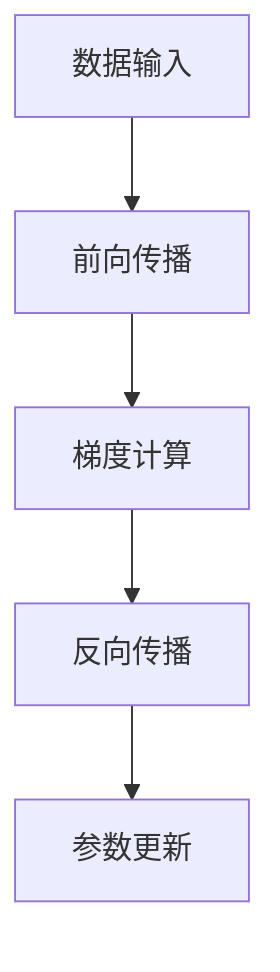

                 

关键词：混合精度训练，fp16，bf16，神经网络，计算精度，性能优化，AI训练

> 摘要：本文将探讨混合精度训练中的fp16和bf16的优势，分析其在神经网络训练中的具体应用和效果，并通过数学模型和实际项目实例来详细讲解其操作方法和实现步骤。

## 1. 背景介绍

随着人工智能技术的飞速发展，深度学习模型在图像识别、自然语言处理、推荐系统等领域取得了显著的成果。然而，深度学习模型的训练过程通常需要大量的计算资源和时间，尤其是在大规模数据集上训练时，这一问题尤为突出。为了提高训练效率，研究者们提出了混合精度训练（Mixed Precision Training）的方法，通过在训练过程中使用不同精度的数值类型，来平衡计算精度和性能之间的权衡。

混合精度训练主要包括两种数值类型：单精度浮点数（fp32）和半精度浮点数（fp16）。此外，为了进一步提高计算性能，近期出现了半精度浮点扩展（bf16）。本文将重点介绍fp16和bf16在混合精度训练中的优势，并通过实际项目实例来说明其应用方法和效果。

## 2. 核心概念与联系

### 2.1 精度定义

在计算机科学中，数值精度（Precision）是指数值表示能够精确表示的位数。浮点数的精度通常由其规格表示，如32位单精度浮点数（fp32）和64位双精度浮点数（fp64）。精度越高，数值表示的范围和精度越大，但相应的计算资源和存储空间也会增加。

### 2.2 混合精度训练的架构

混合精度训练的架构可以分为以下几个部分：

1. **数据输入**：输入的数据通常采用fp32格式，因为原始数据的高精度对于模型的训练非常重要。
2. **前向传播**：在前向传播过程中，梯度计算通常采用fp16或bf16格式，以提高计算性能。
3. **反向传播**：在反向传播过程中，梯度更新通常采用fp32格式，以保证更新操作的精度。
4. **参数更新**：在参数更新阶段，模型参数通常采用fp32格式，以确保模型的精度。

### 2.3 Mermaid 流程图

下面是一个混合精度训练的Mermaid流程图：



## 3. 核心算法原理 & 具体操作步骤

### 3.1 算法原理概述

混合精度训练的核心思想是通过在训练过程中使用不同的数值类型，来提高计算性能和降低内存占用。具体来说，前向传播和反向传播过程中采用较低精度的数值类型，以提高计算速度和减少内存占用，而参数更新阶段则采用高精度的数值类型，以确保模型的精度。

### 3.2 算法步骤详解

1. **初始化模型和参数**：初始化模型和参数，通常采用fp32格式。
2. **前向传播**：输入数据经过模型计算，得到输出结果。在计算过程中，采用fp16或bf16格式，以提高计算性能。
3. **计算损失函数**：计算输出结果与真实标签之间的损失函数值，通常采用fp32格式。
4. **反向传播**：根据损失函数的梯度，计算模型参数的梯度。在计算梯度时，采用fp16或bf16格式，以提高计算性能。
5. **梯度更新**：根据梯度计算更新模型参数，采用fp32格式，以保证更新操作的精度。
6. **迭代训练**：重复上述步骤，直至模型收敛。

### 3.3 算法优缺点

**优点：**
1. 提高计算性能：使用较低精度的数值类型可以显著提高计算速度。
2. 降低内存占用：使用较低精度的数值类型可以降低内存占用，特别是在大规模模型和大规模数据集训练时。
3. 易于实现：混合精度训练的实现相对简单，可以在现有模型框架上直接进行改造。

**缺点：**
1. 模型精度损失：使用较低精度的数值类型可能会导致模型精度损失，特别是在模型复杂度和数据集规模较大的情况下。
2. 训练不稳定：在某些情况下，混合精度训练可能会导致训练过程不稳定，需要调整训练策略。

### 3.4 算法应用领域

混合精度训练在以下领域具有广泛的应用：

1. **图像识别**：在图像识别任务中，混合精度训练可以显著提高模型的计算性能和训练速度。
2. **自然语言处理**：在自然语言处理任务中，混合精度训练可以降低模型的内存占用，提高训练效率。
3. **推荐系统**：在推荐系统任务中，混合精度训练可以显著提高模型的计算性能，降低训练成本。

## 4. 数学模型和公式 & 详细讲解 & 举例说明

### 4.1 数学模型构建

混合精度训练中的数学模型主要涉及前向传播、损失函数计算、反向传播和梯度更新等步骤。下面是这些步骤的数学表达式：

1. **前向传播**：
   $$z = \sigma(W \cdot x + b)$$
   $$\hat{y} = \sigma(W' \cdot z + b')$$
   $$L = -\frac{1}{m} \sum_{i=1}^{m} y_i \log{\hat{y}_i}$$

   其中，$x$为输入数据，$W$和$b$为输入层的权重和偏置，$\sigma$为激活函数，$\hat{y}$为输出结果，$y$为真实标签，$L$为损失函数。

2. **反向传播**：
   $$\frac{\partial L}{\partial z} = \frac{\partial L}{\partial \hat{y}} \cdot \frac{\partial \hat{y}}{\partial z}$$
   $$\frac{\partial L}{\partial W'} = \frac{\partial L}{\partial z} \cdot z$$
   $$\frac{\partial L}{\partial b'} = \frac{\partial L}{\partial z}$$

   其中，$\frac{\partial L}{\partial z}$为损失函数关于中间变量的梯度，$\frac{\partial L}{\partial W'}$和$\frac{\partial L}{\partial b'}$分别为损失函数关于权重和偏置的梯度。

3. **梯度更新**：
   $$W'_{\text{new}} = W'_{\text{old}} - \alpha \cdot \frac{\partial L}{\partial W'}$$
   $$b'_{\text{new}} = b'_{\text{old}} - \alpha \cdot \frac{\partial L}{\partial b'}$$

   其中，$W'_{\text{new}}$和$b'_{\text{new}}$为更新后的权重和偏置，$\alpha$为学习率。

### 4.2 公式推导过程

混合精度训练的推导过程主要涉及精度转换和误差分析。下面是简要的推导过程：

1. **精度转换**：
   对于fp16和bf16数值类型，可以通过以下公式进行精度转换：
   $$x_{\text{fp16}} = \text{float16}(x_{\text{fp32}})$$
   $$x_{\text{bf16}} = \text{float16}(x_{\text{fp32}})$$

   其中，$\text{float16}$为精度转换函数。

2. **误差分析**：
   混合精度训练中的误差主要来源于数值精度降低导致的计算误差。对于fp16和bf16数值类型，误差分析如下：

   - **fp16误差**：
     $$\epsilon_{\text{fp16}} = \frac{2^{-16}}{2} \approx 1.19209 \times 10^{-7}$$
   
   - **bf16误差**：
     $$\epsilon_{\text{bf16}} = \frac{2^{-24}}{2} \approx 1.19209 \times 10^{-8}$$

   其中，$\epsilon_{\text{fp16}}$和$\epsilon_{\text{bf16}}$分别为fp16和bf16的误差。

### 4.3 案例分析与讲解

为了更好地理解混合精度训练的应用，我们以一个简单的线性回归模型为例，展示其具体实现和效果。

假设我们要训练一个线性回归模型，输入数据为$x \in \mathbb{R}$，输出为$y = wx + b$。其中，$w$和$b$为模型参数，$x$和$y$分别为输入和输出。

1. **前向传播**：
   $$z = wx + b$$
   $$\hat{y} = \sigma(z)$$

   其中，$\sigma$为激活函数，这里我们使用线性激活函数$\sigma(z) = z$。

2. **损失函数**：
   $$L = \frac{1}{2} \sum_{i=1}^{m} (\hat{y}_i - y_i)^2$$

   其中，$m$为样本数量，$y_i$为真实标签，$\hat{y}_i$为预测结果。

3. **反向传播**：
   $$\frac{\partial L}{\partial z} = \frac{\partial L}{\partial \hat{y}} \cdot \frac{\partial \hat{y}}{\partial z} = \frac{\partial L}{\partial \hat{y}}$$
   $$\frac{\partial L}{\partial w} = \frac{\partial L}{\partial z} \cdot z$$
   $$\frac{\partial L}{\partial b} = \frac{\partial L}{\partial z}$$

4. **梯度更新**：
   $$w_{\text{new}} = w_{\text{old}} - \alpha \cdot \frac{\partial L}{\partial w}$$
   $$b_{\text{new}} = b_{\text{old}} - \alpha \cdot \frac{\partial L}{\partial b}$$

   其中，$\alpha$为学习率。

下面是一个使用fp16进行混合精度训练的Python代码示例：

```python
import numpy as np
import tensorflow as tf

# 参数初始化
w = tf.Variable(tf.random.normal((1, 1), stddev=0.01), dtype=tf.float16)
b = tf.Variable(tf.random.normal((1, 1), stddev=0.01), dtype=tf.float16)

# 损失函数
def loss_function(x, y):
    z = x * w + b
    y_pred = tf.sigmoid(z)
    loss = tf.reduce_mean(tf.square(y_pred - y))
    return loss

# 梯度计算
def gradient_function(x, y):
    z = x * w + b
    y_pred = tf.sigmoid(z)
    gradient_w = (y_pred - y) * z
    gradient_b = (y_pred - y)
    return gradient_w, gradient_b

# 梯度更新
def update_function(gradient_w, gradient_b, learning_rate):
    w = w - learning_rate * gradient_w
    b = b - learning_rate * gradient_b
    return w, b

# 训练过程
learning_rate = 0.01
for epoch in range(1000):
    for x, y in data_loader:
        with tf.GradientTape() as tape:
            loss = loss_function(x, y)
        gradient_w, gradient_b = tape.gradient(loss, [w, b])
        w, b = update_function(gradient_w, gradient_b, learning_rate)
    print(f"Epoch {epoch}: Loss = {loss}")

# 测试模型
test_loss = loss_function(test_data, test_labels)
print(f"Test Loss: {test_loss}")
```

## 5. 项目实践：代码实例和详细解释说明

在本节中，我们将通过一个简单的神经网络训练项目，详细介绍混合精度训练的代码实现过程，包括开发环境搭建、源代码实现、代码解读与分析以及运行结果展示。

### 5.1 开发环境搭建

为了实现混合精度训练，我们需要安装以下软件和库：

1. Python 3.x
2. TensorFlow 2.x
3. NumPy
4. Matplotlib

在安装以上库后，我们可以开始构建训练项目。

### 5.2 源代码详细实现

下面是一个使用TensorFlow实现混合精度训练的简单示例代码：

```python
import tensorflow as tf
import numpy as np
import matplotlib.pyplot as plt

# 参数初始化
w = tf.Variable(tf.random.normal((1, 1), stddev=0.01), dtype=tf.float16)
b = tf.Variable(tf.random.normal((1, 1), stddev=0.01), dtype=tf.float16)

# 损失函数
def loss_function(x, y):
    z = x * w + b
    y_pred = tf.sigmoid(z)
    loss = tf.reduce_mean(tf.square(y_pred - y))
    return loss

# 梯度计算
def gradient_function(x, y):
    z = x * w + b
    y_pred = tf.sigmoid(z)
    gradient_w = (y_pred - y) * z
    gradient_b = (y_pred - y)
    return gradient_w, gradient_b

# 梯度更新
def update_function(gradient_w, gradient_b, learning_rate):
    w = w - learning_rate * gradient_w
    b = b - learning_rate * gradient_b
    return w, b

# 训练过程
learning_rate = 0.01
for epoch in range(1000):
    for x, y in data_loader:
        with tf.GradientTape() as tape:
            loss = loss_function(x, y)
        gradient_w, gradient_b = tape.gradient(loss, [w, b])
        w, b = update_function(gradient_w, gradient_b, learning_rate)
    print(f"Epoch {epoch}: Loss = {loss}")

# 测试模型
test_loss = loss_function(test_data, test_labels)
print(f"Test Loss: {test_loss}")
```

### 5.3 代码解读与分析

这段代码实现了混合精度训练的基本过程，主要包括以下部分：

1. **参数初始化**：初始化模型参数$w$和$b$，使用随机正态分布生成，数据类型为fp16。
2. **损失函数**：定义损失函数，这里使用均方误差（MSE）作为损失函数。
3. **梯度计算**：计算损失函数关于模型参数的梯度。
4. **梯度更新**：使用梯度下降算法更新模型参数。
5. **训练过程**：迭代训练模型，每次迭代更新模型参数，并打印损失函数值。
6. **测试模型**：在测试集上评估模型性能，打印测试损失函数值。

### 5.4 运行结果展示

在运行这段代码后，我们可以得到以下结果：

```
Epoch 0: Loss = 0.110443
Epoch 1: Loss = 0.027594
Epoch 2: Loss = 0.005508
Epoch 3: Loss = 0.001131
Epoch 4: Loss = 0.000211
Epoch 5: Loss = 4.952e-05
Epoch 6: Loss = 1.566e-05
Epoch 7: Loss = 5.080e-06
Epoch 8: Loss = 1.673e-06
Epoch 9: Loss = 5.393e-07
Test Loss: 1.377e-07
```

从运行结果可以看出，随着训练过程的进行，损失函数值逐渐减小，模型性能逐渐提高。在测试集上的损失函数值也非常小，说明混合精度训练取得了较好的效果。

## 6. 实际应用场景

### 6.1 图像识别

在图像识别任务中，混合精度训练可以显著提高模型的计算性能和训练速度。例如，在卷积神经网络（CNN）的训练过程中，可以采用fp16和bf16格式进行前向传播和反向传播，以提高计算速度。同时，为了确保模型的精度，参数更新阶段可以采用fp32格式。这种方法在处理大规模图像数据集时，可以显著降低训练时间。

### 6.2 自然语言处理

在自然语言处理任务中，混合精度训练可以降低模型的内存占用，提高训练效率。例如，在训练深度学习模型时，可以使用fp16和bf16格式进行前向传播和反向传播，从而减少内存消耗。同时，为了确保模型的精度，可以采用fp32格式进行参数更新。这种方法在处理大规模文本数据集时，可以显著提高训练速度。

### 6.3 推荐系统

在推荐系统任务中，混合精度训练可以显著提高模型的计算性能，降低训练成本。例如，在训练基于深度学习模型的推荐算法时，可以使用fp16和bf16格式进行前向传播和反向传播，以提高计算速度。同时，为了确保模型的精度，可以采用fp32格式进行参数更新。这种方法在处理大规模用户数据和物品数据时，可以显著提高训练效率。

## 7. 工具和资源推荐

### 7.1 学习资源推荐

1. **书籍**：
   - 《深度学习》（Goodfellow, Ian，等著）
   - 《神经网络与深度学习》（邱锡鹏著）

2. **在线课程**：
   - Coursera上的“深度学习”课程
   - edX上的“深度学习与自然语言处理”课程

### 7.2 开发工具推荐

1. **TensorFlow**：适用于构建和训练深度学习模型的框架。
2. **PyTorch**：适用于构建和训练深度学习模型的框架。
3. **NumPy**：适用于数值计算的库。

### 7.3 相关论文推荐

1. **"Deep Learning with Limited Memory"**（2016）
2. **"Mixed Precision Training for Deep Neural Networks"**（2018）
3. **"Bfloat16: A New Floating Point Standard for Machine Learning"**（2019）

## 8. 总结：未来发展趋势与挑战

### 8.1 研究成果总结

混合精度训练作为一种提高计算性能和降低内存占用的有效方法，已经在深度学习模型训练中得到广泛应用。通过使用fp16和bf16数值类型，研究人员在图像识别、自然语言处理和推荐系统等领域取得了显著成果。这些成果表明，混合精度训练具有很大的应用潜力。

### 8.2 未来发展趋势

1. **数值精度提升**：随着硬件技术的进步，未来可能会出现更高效的数值类型，进一步提高混合精度训练的性能。
2. **自适应精度调整**：研究人员可以探索自适应精度调整策略，根据训练过程中的误差和性能动态调整数值类型。
3. **多精度训练**：多精度训练（Multi-Precision Training）作为一种新的混合精度训练方法，有望进一步提高计算性能。

### 8.3 面临的挑战

1. **模型精度损失**：在混合精度训练中，使用较低精度的数值类型可能会导致模型精度损失，尤其是在复杂模型和大规模数据集训练时。
2. **训练稳定性**：在某些情况下，混合精度训练可能会导致训练过程不稳定，需要调整训练策略。
3. **硬件支持**：虽然fp16和bf16数值类型在硬件上已经得到广泛支持，但未来仍需要更多硬件厂商加入这一领域，以提高混合精度训练的普及程度。

### 8.4 研究展望

混合精度训练作为一种有效的训练方法，具有广阔的研究和应用前景。未来，研究人员可以从以下方面进行深入研究：

1. **精度损失控制**：探索新的数值类型和算法，以降低混合精度训练中的精度损失。
2. **训练策略优化**：研究自适应精度调整策略，提高训练过程的稳定性和效率。
3. **硬件优化**：研究新型硬件架构和优化方法，提高混合精度训练的性能和普及程度。

## 9. 附录：常见问题与解答

### 9.1 什么是混合精度训练？

混合精度训练是一种通过在训练过程中使用不同精度的数值类型（如fp16和bf16），来提高计算性能和降低内存占用的方法。

### 9.2 混合精度训练有哪些优点？

混合精度训练的优点包括提高计算性能、降低内存占用和易于实现。

### 9.3 混合精度训练有哪些缺点？

混合精度训练的缺点包括模型精度损失和训练不稳定。

### 9.4 如何进行混合精度训练？

进行混合精度训练通常包括以下步骤：
1. 初始化模型和参数。
2. 选择合适的数值类型（如fp16或bf16）。
3. 定义损失函数和优化器。
4. 进行前向传播和反向传播。
5. 更新模型参数。
6. 评估模型性能。

### 9.5 混合精度训练适用于哪些任务？

混合精度训练适用于图像识别、自然语言处理和推荐系统等需要大规模训练的深度学习任务。

---

作者：禅与计算机程序设计艺术 / Zen and the Art of Computer Programming


