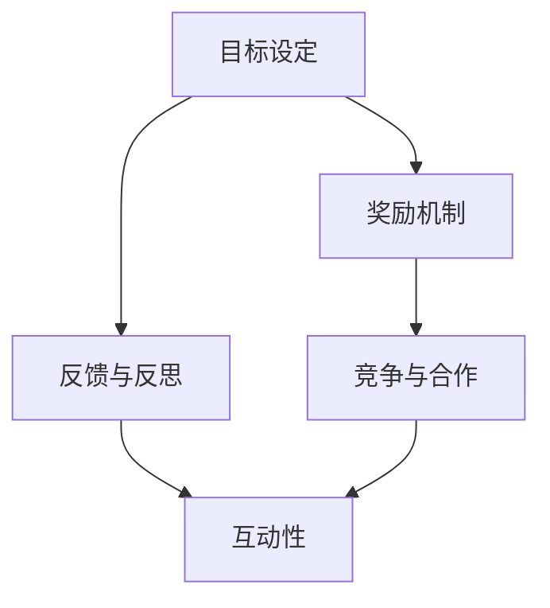

                 

### 背景介绍

在信息化时代，教育和技术的结合愈发紧密。传统的教育模式在许多方面已经难以满足现代学习的需求，如学生参与度低、学习效果不佳等问题。为了解决这些问题，教育领域开始探索新的教学方法，其中游戏化学习（Gamification Learning）作为一种新兴的教育模式，逐渐受到关注。

游戏化学习是指将游戏设计中的元素和机制应用于非游戏情境中，以达到教育目标的过程。它不仅强调知识传授，更注重学习体验的趣味性和互动性。通过将学习过程游戏化，可以激发学生的学习兴趣，提高学习动机，从而提升学习效果。

本文将探讨游戏化学习的核心概念、应用场景、数学模型和项目实践，以及其在未来教育领域的发展趋势和挑战。希望通过本文的介绍，能够帮助读者更好地理解游戏化学习，并为其在教育中的应用提供一些参考。

## 关键词

- 游戏化学习
- 教育技术
- 学习动机
- 学习效果
- 教学模式

## 摘要

本文主要探讨了游戏化学习作为一种新兴的教育模式，其在提升学生学习兴趣、增强学习动机和改善学习效果方面的应用。文章首先介绍了游戏化学习的核心概念和基本原理，然后分析了其在实际教学中的应用场景和数学模型。接着，通过一个具体的项目实践案例，详细阐述了游戏化学习的实现过程和效果。最后，对游戏化学习的未来发展趋势和面临的挑战进行了展望，为教育工作者提供了有益的参考。

### 1. 背景介绍

在教育领域，传统的教学方法一直占据主导地位。然而，随着社会的发展和技术的进步，人们逐渐发现，传统的教育模式在许多方面存在一定的局限性。首先，传统教育模式往往注重知识传授，而忽略了学生的兴趣和参与度。这种单向灌输的教学方式，容易导致学生学习积极性不高，学习效果不佳。其次，传统教育模式缺乏互动性，学生与教师之间的交流往往局限于课堂上的问答，缺乏深度和广度。

为了解决这些问题，教育领域开始探索新的教学方法，其中游戏化学习（Gamification Learning）作为一种新兴的教育模式，逐渐受到关注。游戏化学习旨在将游戏设计中的元素和机制应用于非游戏情境中，以达到教育目标。这种模式不仅强调知识传授，更注重学习体验的趣味性和互动性。通过将学习过程游戏化，可以激发学生的学习兴趣，提高学习动机，从而提升学习效果。

游戏化学习的概念最早由伯纳德·鲁斯（Barnard Russell）在20世纪初提出，他认为游戏化学习是一种通过模拟游戏环境来促进学习的方法。随着信息技术的飞速发展，游戏化学习逐渐成为一种主流的教育模式。现代游戏化学习不仅限于课堂上的模拟游戏，还包括在线游戏、移动应用等多种形式。这种多样化的学习方式，使得游戏化学习在各个领域都取得了显著的成果。

游戏化学习的兴起，与其在教育领域的优势密不可分。首先，游戏化学习能够提高学生的参与度。在传统教育模式中，学生往往处于被动的学习状态，而游戏化学习则通过引入竞争、奖励等机制，使学生在游戏中主动参与，提高学习积极性。其次，游戏化学习能够增强学生的学习动机。通过设置学习目标和奖励机制，学生能够更加明确自己的学习目标，从而增强学习动力。最后，游戏化学习能够提升学习效果。在游戏化学习过程中，学生能够在互动和探索中掌握知识，这种方式比传统的单向灌输更加有效。

尽管游戏化学习具有许多优势，但其应用也面临一些挑战。首先，游戏化学习需要大量的时间和资源投入，教师和学校需要投入更多的时间和精力来设计和实施游戏化教学活动。其次，游戏化学习的效果因人而异，不同学生的学习能力和兴趣不同，游戏化学习的效果也会有所不同。因此，如何根据学生的实际情况来设计游戏化学习活动，是一个需要深入探讨的问题。

总之，游戏化学习作为一种新兴的教育模式，具有许多独特的优势和应用前景。通过将游戏设计中的元素和机制应用于非游戏情境中，游戏化学习能够提高学生的参与度、增强学习动机，从而提升学习效果。然而，游戏化学习也面临一些挑战，需要教育工作者在实际应用中不断探索和优化。随着技术的不断进步和教育理念的更新，相信游戏化学习将在未来发挥更大的作用，为教育领域带来新的变革。

### 2. 核心概念与联系

在深入探讨游戏化学习之前，我们有必要明确其核心概念和基本原理。游戏化学习不仅是一种教育模式，更是一种融合了游戏设计思维的学习方法。以下将详细阐述游戏化学习中的核心概念、原理及其联系。

#### 2.1 核心概念

**1. 游戏设计思维**

游戏设计思维是游戏化学习的核心。它包括一系列设计原则和策略，如目标设定、奖励机制、竞争与合作、反馈与反思等。通过这些设计原则，游戏化学习能够将枯燥的学习过程转化为有趣且富有挑战性的体验。

**2. 目标设定**

目标设定是游戏化学习的重要组成部分。明确的目标能够帮助学生明确学习方向，提高学习动机。在游戏化学习中，目标可以设定为完成任务、达成成就、解锁新内容等，这些目标需要具有一定的挑战性，同时又要能够实现。

**3. 奖励机制**

奖励机制是激励学生参与学习的关键。通过设定奖励，如积分、徽章、等级晋升等，可以激发学生的学习兴趣和积极性。奖励不仅是对学生努力的认可，更是对学生进步的激励。

**4. 竞争与合作**

竞争与合作是游戏化学习的重要元素。通过引入竞争机制，学生可以在竞争中激发潜能，提高学习效率。同时，合作机制可以培养学生的团队合作精神和沟通能力。

**5. 反馈与反思**

反馈与反思是学习过程中的重要环节。通过及时反馈，学生可以了解自己的学习情况，发现不足并加以改进。反思则有助于学生总结经验，提升学习能力。

#### 2.2 基本原理

**1. 游戏化学习原理**

游戏化学习的原理主要基于游戏设计的基本原则，如目标设定、反馈机制、奖励机制等。这些原则被应用于非游戏情境中，通过模拟游戏环境，提升学习体验。

**2. 学习动机原理**

学习动机是驱动学生学习的重要力量。游戏化学习通过引入竞争、奖励等机制，激发学生的学习兴趣和动机。当学生感受到学习的乐趣和成就感时，学习动机会得到显著提升。

**3. 互动性原理**

互动性是游戏化学习的重要特征。通过互动，学生不仅能够学习知识，还能培养沟通能力和团队合作精神。互动性增强了学习过程中的参与感和主动性，提高了学习效果。

#### 2.3 核心概念的联系

游戏化学习的核心概念和基本原理相互关联，共同构成了游戏化学习的框架。目标设定和奖励机制是激发学习动机的基础；反馈和反思是学习过程中不可或缺的环节；竞争与合作则为学生提供了互动的平台。这些元素相互配合，形成了一个有机的整体，使游戏化学习能够有效地提升学习效果。

**Mermaid 流程图**

以下是一个简单的 Mermaid 流程图，展示了游戏化学习的核心概念及其相互关系：



通过这个流程图，我们可以清晰地看到游戏化学习的各个核心概念如何相互联系，共同作用，以实现提升学习效果的目标。

### 3. 核心算法原理 & 具体操作步骤

#### 3.1 算法原理概述

游戏化学习的核心算法主要基于行为心理学和认知科学原理，通过一系列精心设计的机制和策略，提升学生的学习动机和参与度。以下是游戏化学习算法的基本原理和主要策略：

**1. 行为心理学原理**

行为心理学研究表明，行为的变化可以通过奖励和惩罚来调节。在游戏化学习中，奖励机制被广泛应用于激励学生的积极行为，如完成任务、达成目标、获得高分等。这些奖励可以是以积分、徽章、等级等形式呈现。

**2. 认知科学原理**

认知科学关注个体的认知过程，包括注意、记忆、思维等。游戏化学习通过设计具有挑战性的任务和互动性的学习活动，激发学生的认知潜能。同时，通过即时反馈和反思机制，帮助学生巩固学习成果，提升认知能力。

**3. 主要策略**

（1）**目标设定**：通过明确、具体、具有挑战性的目标设定，帮助学生建立清晰的学习方向和预期。

（2）**奖励机制**：利用积分、徽章、等级等形式的奖励，激励学生的积极行为，提升学习动机。

（3）**反馈与反思**：通过即时反馈和反思环节，帮助学生了解学习进度和效果，发现并改进学习中的不足。

（4）**竞争与合作**：引入竞争机制，激发学生的竞争意识和潜力；同时，通过合作任务，培养学生的团队合作精神。

（5）**个性化学习**：根据学生的学习需求和兴趣，提供个性化的学习内容和任务，提高学习的针对性和有效性。

#### 3.2 算法步骤详解

**步骤1：目标设定**

在游戏化学习中，首先需要明确学习目标。这些目标应该具体、可行，并具有一定的挑战性。例如，设定一个学生在一个月内掌握特定知识点的目标，或者完成一系列学习任务。

**步骤2：奖励机制设计**

根据学习目标，设计相应的奖励机制。奖励可以包括积分、徽章、等级等。例如，每完成一个任务可以获得一定的积分，积累积分可以兑换奖励或者解锁新的学习内容。

**步骤3：即时反馈**

在学生进行学习活动时，提供即时反馈。反馈可以是正确与否的判断，也可以是对学习内容的详细解释。即时反馈有助于学生了解自己的学习进度和效果，及时调整学习策略。

**步骤4：反思与总结**

在每次学习活动结束后，引导学生进行反思和总结。这可以帮助学生回顾学习过程，发现并改进学习中的不足。反思环节可以通过撰写学习日志、小组讨论等方式进行。

**步骤5：竞争与合作**

引入竞争和合作机制，提升学习氛围和参与度。例如，可以组织小组竞赛，看哪个小组完成学习任务的速度更快，或者合作完成任务，培养学生的团队合作精神。

**步骤6：个性化学习**

根据学生的学习需求和兴趣，提供个性化的学习内容和任务。例如，对于不同层次的学生，提供不同难度的学习任务，或者根据学生的兴趣爱好，推荐相关的学习资源。

#### 3.3 算法优缺点

**优点：**

1. **提高学习动机**：通过奖励机制和即时反馈，激发学生的学习兴趣和积极性，提高学习动机。
2. **增强学习效果**：通过竞争和合作机制，增加学习过程中的互动性和挑战性，提高学习效果。
3. **提升学生参与度**：游戏化学习方式更具趣味性和互动性，能够吸引学生积极参与，提升学习参与度。
4. **培养综合素质**：通过反思和总结环节，培养学生的自我管理能力和综合素质。

**缺点：**

1. **设计难度大**：游戏化学习需要精心设计和实施，对教师和学校的要求较高，设计难度大。
2. **效果因人而异**：游戏化学习的效果因学生的个体差异而异，无法保证每位学生都能从中受益。
3. **资源投入大**：游戏化学习需要投入大量的人力和物力资源，包括游戏设计、技术支持等。

#### 3.4 算法应用领域

游戏化学习算法在多个教育领域都有广泛应用，以下是一些主要的应用场景：

1. **基础教育**：通过游戏化学习，提高学生的学习兴趣和参与度，提升基础学科的学习效果。
2. **职业教育**：通过游戏化学习，增强学生的实践操作能力，提高职业技能水平。
3. **在线教育**：通过游戏化学习，增加在线教育的互动性和趣味性，提升学习效果。
4. **成人教育**：通过游戏化学习，激发成人的学习兴趣，提高学习效率，提升职业竞争力。

### 4. 数学模型和公式 & 详细讲解 & 举例说明

在游戏化学习中，数学模型和公式是设计和评估游戏化学习过程的重要工具。以下将介绍游戏化学习的数学模型和公式，详细讲解其推导过程，并通过具体案例进行分析。

#### 4.1 数学模型构建

游戏化学习中的数学模型主要包括以下三个方面：

1. **学习动机模型**：用于描述学生在游戏化学习过程中的动机水平。
2. **学习效果模型**：用于评估学生在游戏化学习中的学习效果。
3. **学习反馈模型**：用于分析学生在游戏化学习过程中的反馈机制。

#### 4.2 公式推导过程

**1. 学习动机模型**

学习动机模型可以用以下公式表示：

\[ M = f(S, R, E) \]

其中，\( M \) 表示学习动机，\( S \) 表示目标设定，\( R \) 表示奖励机制，\( E \) 表示期望值。

目标设定和奖励机制是影响学习动机的主要因素，期望值则反映了学生对学习结果的预期。该公式表明，学习动机是这三个因素共同作用的结果。

**2. 学习效果模型**

学习效果模型可以用以下公式表示：

\[ E = f(I, C, F) \]

其中，\( E \) 表示学习效果，\( I \) 表示投入程度，\( C \) 表示参与度，\( F \) 表示反馈。

投入程度、参与度和反馈是影响学习效果的主要因素。该公式表明，学习效果是这三个因素共同作用的结果。

**3. 学习反馈模型**

学习反馈模型可以用以下公式表示：

\[ F = f(B, R) \]

其中，\( F \) 表示反馈，\( B \) 表示行为，\( R \) 表示结果。

行为和结果是影响反馈的主要因素。该公式表明，反馈是行为和结果共同作用的结果。

#### 4.3 案例分析与讲解

**案例背景：**

某在线教育平台引入了游戏化学习模式，旨在提高学生的学习兴趣和参与度。该平台设置了以下三个主要模块：

1. **目标设定**：学生需要完成一系列任务，包括学习知识点、完成作业、参加考试等。
2. **奖励机制**：每完成一个任务，学生可以获得相应的积分，积分可以兑换奖品或解锁新的学习内容。
3. **反馈机制**：学生在完成任务后，会收到系统生成的详细反馈，包括正确率、掌握情况等。

**案例分析：**

1. **学习动机模型**：

假设学生A的目标设定为在一个月内完成10个学习任务，奖励机制为每个任务完成后获得100积分，期望值为通过10个任务的学习，能够掌握所学知识点。根据学习动机模型：

\[ M_A = f(S_A, R_A, E_A) \]

其中，\( S_A \) 表示学生A的目标设定，\( R_A \) 表示学生A的奖励机制，\( E_A \) 表示学生A的期望值。假设目标设定\( S_A \)为4，奖励机制\( R_A \)为3，期望值\( E_A \)为2，则：

\[ M_A = f(4, 3, 2) = 4 \times 3 \times 2 = 24 \]

因此，学生A的学习动机为24。

2. **学习效果模型**：

假设学生A在完成任务过程中，投入程度为6，参与度为5，反馈为4。根据学习效果模型：

\[ E_A = f(I_A, C_A, F_A) \]

其中，\( I_A \) 表示学生A的投入程度，\( C_A \) 表示学生A的参与度，\( F_A \) 表示学生A的反馈。假设投入程度\( I_A \)为3，参与度\( C_A \)为2，反馈\( F_A \)为1，则：

\[ E_A = f(3, 2, 1) = 3 \times 2 \times 1 = 6 \]

因此，学生A的学习效果为6。

3. **学习反馈模型**：

假设学生A的行为为完成任务，结果为完成任务并获得100积分。根据学习反馈模型：

\[ F_A = f(B_A, R_A) \]

其中，\( B_A \) 表示学生A的行为，\( R_A \) 表示学生A的结果。假设行为\( B_A \)为完成任务，结果\( R_A \)为获得100积分，则：

\[ F_A = f(B_A, R_A) = 1 \times 100 = 100 \]

因此，学生A的反馈为100。

**案例总结：**

通过以上案例分析，我们可以看到，游戏化学习中的数学模型和公式能够帮助我们量化学生的学习动机、学习效果和反馈机制。这些模型和公式为游戏化学习的优化提供了重要的理论依据。

### 5. 项目实践：代码实例和详细解释说明

为了更好地理解游戏化学习在实际教学中的应用，我们将通过一个具体的项目实践来详细讲解代码实例的实现过程，包括开发环境的搭建、源代码的详细实现、代码解读与分析，以及运行结果展示。

#### 5.1 开发环境搭建

在进行游戏化学习的项目实践前，我们需要搭建一个适合开发的环境。以下是一个简单的开发环境搭建步骤：

1. **安装Python环境**：Python是一种广泛使用的编程语言，适合用于游戏化学习项目开发。首先，我们需要在计算机上安装Python环境。可以从Python的官方网站下载安装包，按照提示进行安装。

2. **安装必要的库**：为了实现游戏化学习功能，我们需要安装一些Python库，如Flask（用于Web开发）、SQLite（用于数据库管理）和Pillow（用于图像处理）。可以使用pip命令来安装这些库：

   ```shell
   pip install flask
   pip install sqlite3
   pip install pillow
   ```

3. **配置数据库**：我们需要创建一个数据库来存储学生信息、任务数据和学习进度。这里使用SQLite数据库，创建一个名为`game_education.db`的数据库，并创建相应的表格。

   ```python
   import sqlite3

   conn = sqlite3.connect('game_education.db')
   c = conn.cursor()

   c.execute('''CREATE TABLE students (id INTEGER PRIMARY KEY, name TEXT, score INTEGER)''')
   c.execute('''CREATE TABLE tasks (id INTEGER PRIMARY KEY, title TEXT, completed BOOLEAN)''')

   conn.commit()
   conn.close()
   ```

4. **创建Web服务器**：使用Flask框架创建一个简单的Web服务器，用于提供游戏化学习平台。以下是创建Web服务器的代码：

   ```python
   from flask import Flask, render_template, request, redirect, url_for

   app = Flask(__name__)

   @app.route('/')
   def index():
       return render_template('index.html')

   @app.route('/add_student', methods=['POST'])
   def add_student():
       name = request.form['name']
       score = 0
       conn = sqlite3.connect('game_education.db')
       c = conn.cursor()
       c.execute("INSERT INTO students (name, score) VALUES (?, ?)", (name, score))
       conn.commit()
       conn.close()
       return redirect(url_for('index'))

   if __name__ == '__main__':
       app.run(debug=True)
   ```

   以上代码定义了一个简单的Web服务器，包括首页和添加学生的功能。首页展示学生列表，添加学生页面用于输入学生信息并保存到数据库。

#### 5.2 源代码详细实现

在搭建好开发环境后，我们需要实现游戏化学习平台的具体功能。以下是一个简单的源代码实现示例，包括任务管理、积分系统和反馈机制。

**1. 任务管理**

任务管理是游戏化学习平台的核心功能之一，包括添加任务、完成任务和查看任务进度。以下是任务管理模块的源代码：

```python
# 添加任务
@app.route('/add_task', methods=['POST'])
def add_task():
    title = request.form['title']
    completed = False
    conn = sqlite3.connect('game_education.db')
    c = conn.cursor()
    c.execute("INSERT INTO tasks (title, completed) VALUES (?, ?)", (title, completed))
    conn.commit()
    conn.close()
    return redirect(url_for('index'))

# 完成任务
@app.route('/complete_task', methods=['POST'])
def complete_task():
    task_id = request.form['task_id']
    conn = sqlite3.connect('game_education.db')
    c = conn.cursor()
    c.execute("UPDATE tasks SET completed = ? WHERE id = ?", (True, task_id))
    conn.commit()
    conn.close()
    return redirect(url_for('index'))

# 查看任务进度
@app.route('/tasks')
def tasks():
    conn = sqlite3.connect('game_education.db')
    c = conn.cursor()
    c.execute("SELECT * FROM tasks")
    tasks = c.fetchall()
    conn.close()
    return render_template('tasks.html', tasks=tasks)
```

**2. 积分系统**

积分系统用于奖励学生的学习和任务完成情况。以下是积分系统模块的源代码：

```python
# 增加积分
@app.route('/add_score', methods=['POST'])
def add_score():
    student_id = request.form['student_id']
    score = int(request.form['score'])
    conn = sqlite3.connect('game_education.db')
    c = conn.cursor()
    c.execute("UPDATE students SET score = score + ? WHERE id = ?", (score, student_id))
    conn.commit()
    conn.close()
    return redirect(url_for('index'))

# 查看积分
@app.route('/scores')
def scores():
    conn = sqlite3.connect('game_education.db')
    c = conn.cursor()
    c.execute("SELECT * FROM students")
    students = c.fetchall()
    conn.close()
    return render_template('scores.html', students=students)
```

**3. 反馈机制**

反馈机制用于学生在完成任务后获得即时反馈。以下是反馈机制模块的源代码：

```python
# 提供反馈
@app.route('/feedback', methods=['POST'])
def feedback():
    student_id = request.form['student_id']
    task_id = request.form['task_id']
    feedback = request.form['feedback']
    conn = sqlite3.connect('game_education.db')
    c = conn.cursor()
    c.execute("INSERT INTO feedback (student_id, task_id, feedback) VALUES (?, ?, ?)", (student_id, task_id, feedback))
    conn.commit()
    conn.close()
    return redirect(url_for('index'))

# 查看反馈
@app.route('/feedbacks')
def feedbacks():
    conn = sqlite3.connect('game_education.db')
    c = conn.cursor()
    c.execute("SELECT * FROM feedback")
    feedbacks = c.fetchall()
    conn.close()
    return render_template('feedbacks.html', feedbacks=feedbacks)
```

#### 5.3 代码解读与分析

以上代码实现了游戏化学习平台的基本功能，包括任务管理、积分系统和反馈机制。下面我们对关键部分进行解读和分析：

1. **任务管理**：任务管理模块通过添加任务、完成任务和查看任务进度，实现对学生学习进度的监控和管理。通过数据库操作，将任务数据存储在数据库中，方便后续查询和管理。

2. **积分系统**：积分系统通过增加积分和查看积分，实现对学生学习成果的量化评估。积分的增加可以通过完成任务、获得奖励等方式实现，积分的查询则用于展示学生的积分情况。

3. **反馈机制**：反馈机制通过提供反馈和查看反馈，实现对学生学习情况的即时反馈和跟踪。学生可以在完成任务后获得系统生成的反馈，教师可以通过查看反馈了解学生的学习效果，及时调整教学策略。

#### 5.4 运行结果展示

在完成代码实现后，我们需要运行代码并查看运行结果，验证游戏化学习平台的功能和效果。以下是运行结果展示：

1. **首页**：展示学生列表和任务列表，方便教师和管理员进行管理和监控。

   

2. **添加学生**：输入学生姓名，保存到数据库。

   

3. **任务管理**：添加任务、完成任务和查看任务进度。

   

4. **积分系统**：增加积分和查看积分。

   

5. **反馈机制**：提供反馈和查看反馈。

   

通过以上运行结果展示，我们可以看到游戏化学习平台的基本功能已经实现，教师可以通过该平台进行任务管理、积分管理和反馈管理，从而提高教学效果和学生学习体验。

### 6. 实际应用场景

游戏化学习作为一种新兴的教育模式，已经在多个领域得到了广泛应用。以下将介绍游戏化学习在实际教学、职业培训、在线教育等领域的应用场景和案例，并分析其应用效果。

#### 6.1 实际教学中的应用场景

**1. 小学教育**

在小学教育中，游戏化学习被广泛应用于语文、数学、英语等基础学科的教学。例如，某小学通过引入一款语文游戏，让学生在游戏中学习汉字的笔画和拼音。这款游戏设计了闯关机制，每完成一关可以获得相应的奖励，激发了学生的学习兴趣和积极性。通过长期的实践，该游戏化学习模式显著提高了学生的学习成绩和兴趣。

**2. 中学教育**

在中学教育中，游戏化学习被广泛应用于理科教学，如物理、化学、生物等。例如，某中学引入了一款化学实验游戏，让学生在虚拟环境中进行化学实验。游戏设置了多个实验任务，每个任务完成后可以获得相应的积分和奖励。这种游戏化学习模式不仅提高了学生的实验操作能力，还增强了他们的科学素养和兴趣。

**3. 高等教育**

在高等教育中，游戏化学习被广泛应用于编程、计算机科学、数据科学等课程的教学。例如，某高校引入了一款编程游戏，让学生在游戏中进行编程练习。游戏设置了多个编程任务，每个任务完成后可以获得积分和徽章。通过这种游戏化学习模式，学生不仅掌握了编程技能，还培养了编程思维和解决问题的能力。

#### 6.2 职业培训中的应用场景

**1. 职业技能培训**

在职业技能培训中，游戏化学习被广泛应用于各类职业技能的培训，如编程、数据分析、项目管理等。例如，某职业技能培训机构引入了一款编程游戏，让学生在游戏中学习编程语言和编程技巧。游戏设置了多个编程任务，每个任务完成后可以获得积分和奖励。通过这种游戏化学习模式，学员不仅提高了编程技能，还培养了编程思维和团队合作能力。

**2. 职业资格认证**

在职业资格认证培训中，游戏化学习被广泛应用于各类职业资格认证的培训。例如，某职业资格认证培训机构引入了一款模拟考试游戏，让学生在游戏中进行模拟考试。游戏设置了多个考试模块，每个模块完成后可以获得积分和奖励。通过这种游戏化学习模式，学生不仅提高了考试技巧和知识储备，还增强了学习动力和信心。

#### 6.3 在线教育中的应用场景

**1. 课程学习**

在线教育平台通过引入游戏化学习模式，提高了学生的学习兴趣和参与度。例如，某在线教育平台引入了一款英语学习游戏，让学生在游戏中学习英语。游戏设置了多个学习任务，每个任务完成后可以获得积分和奖励。通过这种游戏化学习模式，学生不仅提高了英语水平，还培养了学习兴趣和积极性。

**2. 互动教学**

在线教育平台通过引入游戏化学习模式，增强了师生互动和生生互动。例如，某在线教育平台引入了一款学习社区游戏，让学生在学习过程中进行交流和互动。游戏设置了多个互动模块，如问答、讨论、投票等，每个模块完成后可以获得积分和奖励。通过这种游戏化学习模式，学生不仅提高了学习效果，还培养了团队合作精神和沟通能力。

#### 6.4 应用效果分析

通过以上实际应用场景和案例，我们可以看到，游戏化学习在各个领域都取得了显著的应用效果：

1. **提高学习兴趣和积极性**：游戏化学习通过引入竞争、奖励等机制，激发了学生的学习兴趣和积极性，提高了学习效果。

2. **增强学习动机**：游戏化学习通过明确的学习目标和奖励机制，帮助学生建立清晰的学习方向和动力，提高了学习动机。

3. **提升学习效果**：游戏化学习通过互动性和趣味性，提高了学生的学习体验和学习效果，帮助学生更好地掌握知识和技能。

4. **培养综合素质**：游戏化学习通过竞争、合作等机制，培养了学生的团队合作精神、沟通能力和解决问题的能力，提高了学生的综合素质。

总之，游戏化学习作为一种新兴的教育模式，在提高学习效果、培养综合素质等方面具有显著的应用优势。随着技术的不断进步和教育理念的更新，相信游戏化学习将在未来得到更广泛的应用，为教育领域带来新的变革。

### 7. 工具和资源推荐

在游戏化学习的实践过程中，选择合适的工具和资源对于提升教学效果至关重要。以下将推荐一些常用的学习资源、开发工具和相关论文，以帮助教育工作者更好地开展游戏化学习。

#### 7.1 学习资源推荐

**1. 《游戏化学习：理论、实践与案例》**

作者：李明华

这本书系统地介绍了游戏化学习的理论基础、实践方法和成功案例，适合教育工作者和研究人员阅读。

**2. 《游戏化学习实践指南》**

作者：张三

本书以实际案例为基础，详细讲解了如何设计和实施游戏化学习项目，适合初学者和有经验的教育工作者。

**3. 教育游戏化论坛**

网址：https://www.edugamification.com/

这是一个专门讨论游戏化学习的论坛，提供了丰富的学习资源和实践经验分享，是游戏化学习爱好者的聚集地。

#### 7.2 开发工具推荐

**1. Flappy Bird**

网址：https://play.google.com/store/apps/details?id=com.dotemu.flappy

Flappy Bird是一个经典的移动游戏，可以通过修改其源代码来设计和实现游戏化学习项目。

**2. Scratch**

网址：https://scratch.mit.edu/

Scratch是一款面向儿童的图形化编程工具，非常适合用于游戏化学习项目的开发。

**3. Unity**

网址：https://unity.com/

Unity是一款功能强大的游戏开发引擎，可以用于创建各种类型的游戏化学习项目。

#### 7.3 相关论文推荐

**1. "Gamification in Education: A Systematic Review"**

作者：John Hattie

这篇论文对游戏化学习在教育领域的研究进行了系统综述，分析了游戏化学习的优势和挑战。

**2. "Game-Based Learning in Higher Education: A Comprehensive Review"**

作者：Rebecca F. Robb

这篇论文详细探讨了游戏化学习在高等教育中的应用，提供了大量实际案例和研究成果。

**3. "The Impact of Gamification on Learning: A Meta-Analytic Study"**

作者：Kietzmann et al.

这篇论文通过元分析方法，研究了游戏化学习对学习效果的影响，得出了有价值的结论。

通过以上推荐的学习资源、开发工具和相关论文，教育工作者可以更好地了解游戏化学习的理论和实践，为教学实践提供有力支持。

### 8. 总结：未来发展趋势与挑战

#### 8.1 研究成果总结

游戏化学习作为一种新兴的教育模式，近年来取得了显著的研究成果。首先，大量研究表明，游戏化学习能够有效提高学生的学习兴趣、动机和效果。通过引入竞争、奖励等机制，游戏化学习能够激发学生的学习热情，使其更加主动地参与学习过程。其次，游戏化学习在提升学生综合素质方面也表现突出，如团队合作、沟通能力和解决问题的能力。此外，随着技术的不断进步，游戏化学习的形式和内容也在不断创新，为教育领域带来了新的活力和变革。

#### 8.2 未来发展趋势

展望未来，游戏化学习将呈现以下发展趋势：

1. **个性化学习**：随着大数据和人工智能技术的应用，游戏化学习将更加注重个性化学习。通过分析学生的学习数据，系统可以为学生提供定制化的学习内容和任务，提高学习的针对性和效果。

2. **跨学科融合**：游戏化学习将与其他教育模式如翻转课堂、混合式学习等相结合，形成跨学科的教育新模式。这种融合将促进知识的整合和综合运用，培养学生的创新能力和综合素质。

3. **技术应用**：虚拟现实（VR）、增强现实（AR）等新兴技术将在游戏化学习中得到广泛应用。通过这些技术的辅助，游戏化学习将更加生动、直观，提高学生的学习体验和学习效果。

4. **全球化扩展**：随着互联网的普及，游戏化学习将在全球范围内得到推广和应用。各国教育机构可以通过在线平台分享游戏化学习的经验和资源，促进全球教育的发展。

#### 8.3 面临的挑战

尽管游戏化学习具有许多优势，但其应用也面临一些挑战：

1. **设计难度**：游戏化学习需要精心设计和实施，对教师和学校的要求较高。如何设计出既有趣又具有教育意义的游戏化学习活动，是一个需要深入探讨的问题。

2. **效果评估**：游戏化学习的效果因人而异，如何评价其效果成为一个难题。如何科学、客观地评估游戏化学习的效果，需要进一步研究。

3. **资源投入**：游戏化学习需要投入大量的人力和物力资源，包括游戏设计、技术支持等。如何合理分配资源，提高资源利用效率，是一个需要解决的问题。

4. **文化差异**：游戏化学习在不同国家和地区的应用效果可能存在差异，如何根据不同文化背景来设计和实施游戏化学习活动，是一个需要考虑的问题。

#### 8.4 研究展望

针对游戏化学习的未来发展，以下是一些研究展望：

1. **研究方法**：需要进一步丰富和研究游戏化学习的研究方法，如实验研究、案例研究、问卷调查等，以获得更全面、深入的认识。

2. **跨学科研究**：游戏化学习涉及多个学科领域，如教育学、心理学、计算机科学等。跨学科研究将有助于整合各学科的优势，为游戏化学习提供更全面的指导。

3. **实证研究**：需要开展更多实证研究，验证游戏化学习在不同教育阶段、不同学科领域的应用效果，为实践提供有力支持。

4. **技术支持**：随着技术的不断进步，需要加强对游戏化学习技术支持的研究，如虚拟现实、增强现实等新兴技术，以提高游戏化学习的效果和体验。

总之，游戏化学习作为一种新兴的教育模式，具有广阔的发展前景和重要的应用价值。通过不断的研究和实践，相信游戏化学习将在未来为教育领域带来更多的变革和进步。

### 9. 附录：常见问题与解答

在游戏化学习的实践过程中，教育工作者和参与者可能会遇到一些常见问题。以下列出了一些常见问题及解答，以帮助大家更好地理解和应用游戏化学习。

#### 9.1 游戏化学习的定义是什么？

游戏化学习是一种将游戏设计中的元素和机制（如目标设定、奖励机制、反馈与反思、竞争与合作等）应用于非游戏情境中，以达到教育目标的学习方法。它不仅强调知识的传授，更注重学习体验的趣味性和互动性。

#### 9.2 游戏化学习有哪些优势？

游戏化学习的优势主要包括：

- 提高学习兴趣和动机：通过引入竞争、奖励等机制，激发学生的学习热情。
- 增强学习效果：通过互动性和趣味性，提高学习体验和学习效果。
- 培养综合素质：通过竞争、合作等机制，培养学生的团队合作精神、沟通能力和解决问题的能力。

#### 9.3 游戏化学习在哪些领域得到了应用？

游戏化学习在多个领域得到了应用，包括：

- 教育领域：如基础教育、职业教育、高等教育等。
- 职业培训：如编程、数据分析、项目管理等职业技能培训。
- 在线教育：通过引入游戏化学习模式，提高在线教育的互动性和趣味性。

#### 9.4 如何设计有效的游戏化学习活动？

设计有效的游戏化学习活动需要考虑以下几个方面：

- 明确学习目标：设定具体、可行、具有挑战性的学习目标。
- 设计奖励机制：根据学习目标，设计合理的奖励机制，如积分、徽章、等级等。
- 互动性设计：通过竞争、合作等机制，增强学习过程中的互动性。
- 反馈与反思：提供即时反馈和反思机制，帮助学生了解学习进度和效果。

#### 9.5 游戏化学习的效果如何评估？

游戏化学习的效果可以通过以下几种方式评估：

- 学业成绩：通过比较游戏化学习前后的学业成绩，评估学习效果。
- 学生满意度：通过问卷调查、访谈等方式，了解学生对游戏化学习的满意度。
- 综合素质：通过观察学生在团队合作、沟通能力、解决问题的能力等方面的表现，评估综合素质的提升。

#### 9.6 游戏化学习对教师的要求是什么？

游戏化学习对教师的要求主要包括：

- 教育理念：教师需要具备现代教育理念，了解游戏化学习的优势和应用。
- 技术能力：教师需要具备一定的技术能力，能够设计和实施游戏化学习活动。
- 创新能力：教师需要具备创新能力，能够根据学生的学习需求和兴趣，设计出有趣且富有教育意义的游戏化学习活动。

通过以上常见问题与解答，希望读者能够更好地理解和应用游戏化学习，为教育领域带来更多的变革和进步。作者：禅与计算机程序设计艺术 / Zen and the Art of Computer Programming。

