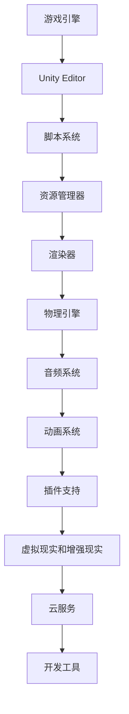
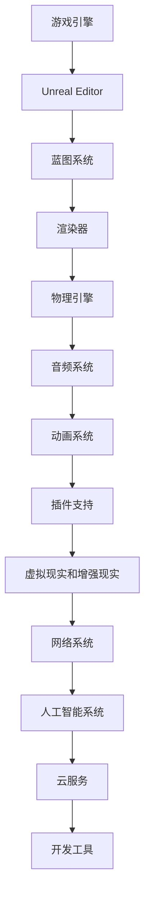

                 

关键词：Unity，Unreal Engine，游戏开发，框架比较，技术分析，性能，功能，应用场景。

> 摘要：本文将对Unity和Unreal Engine这两个主流游戏开发框架进行详细比较，从性能、功能、应用场景等方面进行分析，帮助开发者选择合适的开发工具。

## 1. 背景介绍

Unity和Unreal Engine都是当前流行的游戏开发框架，它们各自拥有庞大的用户群体和丰富的生态系统。Unity由Unity Technologies开发，自2005年发布以来，广泛应用于各类游戏、虚拟现实和增强现实项目。而Unreal Engine由Epic Games开发，最早用于《守望先锋》等知名游戏的开发，因其强大的图形渲染能力和实时渲染效果而备受好评。

### 1.1 Unity

Unity是一个全面的游戏开发平台，支持2D、3D、VR和AR等多种游戏类型。其核心特点是简单易用，入门门槛较低。Unity提供了丰富的开发工具和资源，包括强大的编辑器、脚本语言C#、全面的文档和社区支持。

### 1.2 Unreal Engine

Unreal Engine以其卓越的图形渲染能力和实时渲染效果而著称，广泛应用于高端游戏、电影和建筑可视化等领域。其核心特点是高度灵活和强大，支持大规模多人在线游戏和高级物理模拟。

## 2. 核心概念与联系

为了更好地理解Unity和Unreal Engine，我们需要了解它们的核心概念和架构。以下是两者的Mermaid流程图：

### Unity架构



### Unreal Engine架构



## 3. 核心算法原理 & 具体操作步骤

### 3.1 算法原理概述

Unity和Unreal Engine都采用了不同的算法原理和实现方式，以满足不同类型的游戏开发需求。

Unity采用了基于组件的架构，其核心算法包括：

- 脚本系统：使用C#语言进行脚本编写，实现游戏逻辑。
- 渲染器：基于渲染管线实现，支持多种渲染技术。
- 物理引擎：采用NVIDIA PhysX引擎，实现物理模拟。

Unreal Engine则采用了基于蓝图的架构，其核心算法包括：

- 蓝图系统：使用可视化节点进行逻辑编写，实现游戏功能。
- 渲染器：基于光子渲染引擎（Photon Engine），实现高效实时渲染。
- 物理引擎：采用自定义物理引擎，实现高级物理模拟。

### 3.2 算法步骤详解

#### Unity

1. 创建游戏项目：选择游戏类型和平台，创建新项目。
2. 编写脚本：使用C#语言编写游戏逻辑。
3. 资源管理：导入和管理游戏资源，如模型、纹理、音频等。
4. 渲染设置：配置渲染器，设置光照、阴影等效果。
5. 物理模拟：使用物理引擎实现碰撞检测、动力学计算等。
6. 测试与优化：进行游戏测试，优化性能和稳定性。

#### Unreal Engine

1. 创建游戏项目：选择游戏类型和平台，创建新项目。
2. 编写蓝图：使用可视化节点编写游戏逻辑。
3. 资源管理：导入和管理游戏资源，如模型、纹理、音频等。
4. 渲染设置：配置渲染器，设置光照、阴影等效果。
5. 物理模拟：使用自定义物理引擎实现物理模拟。
6. 测试与优化：进行游戏测试，优化性能和稳定性。

### 3.3 算法优缺点

#### Unity

优点：

- 简单易用，适合初学者。
- 丰富的资源和文档。
- 支持多种游戏类型。

缺点：

- 性能优化较为复杂。
- 图形渲染能力较弱。

#### Unreal Engine

优点：

- 强大的图形渲染能力。
- 高度灵活和强大的功能。
- 支持大规模多人在线游戏。

缺点：

- 学习曲线较陡峭。
- 资源占用较大。

### 3.4 算法应用领域

Unity广泛应用于：

- 独立游戏开发。
- 虚拟现实和增强现实项目。
- 教育和培训项目。

Unreal Engine广泛应用于：

- 高端游戏开发。
- 电影和建筑可视化。
- 大规模多人在线游戏。

## 4. 数学模型和公式 & 详细讲解 & 举例说明

### 4.1 数学模型构建

在游戏开发中，数学模型用于描述游戏中的各种物理现象和逻辑关系。以下是两个常见的数学模型：

#### 渲染模型

渲染模型用于计算图像的渲染效果，包括光照、阴影、反射等。其核心公式如下：

$$
L_i = L_e + L_d + L_s
$$

其中，$L_i$ 是最终光照强度，$L_e$ 是环境光照，$L_d$ 是漫反射光照，$L_s$ 是镜面反射光照。

#### 物理模型

物理模型用于描述物体的运动和碰撞。其核心公式如下：

$$
F = m \cdot a
$$

其中，$F$ 是作用力，$m$ 是物体质量，$a$ 是加速度。

### 4.2 公式推导过程

#### 渲染模型

渲染模型的推导基于光的反射和折射原理。当光线照射到物体表面时，一部分光线被吸收，一部分光线被反射。反射光线遵循反射定律，即入射角等于反射角。根据这些原理，可以推导出渲染模型中的公式。

#### 物理模型

物理模型的推导基于牛顿第二定律。当物体受到外力作用时，物体会产生加速度。根据加速度和时间的关系，可以推导出物体的运动轨迹。

### 4.3 案例分析与讲解

#### 渲染模型案例

假设有一个立方体，表面材质为白色。环境光照强度为100，漫反射光照系数为0.8，镜面反射光照系数为0.2。求立方体的最终光照强度。

根据渲染模型公式：

$$
L_i = L_e + L_d + L_s = 100 + 0.8 \cdot 100 + 0.2 \cdot 100 = 100 + 80 + 20 = 200
$$

因此，立方体的最终光照强度为200。

#### 物理模型案例

假设有一个质量为5kg的物体，受到10N的作用力。求物体的加速度。

根据物理模型公式：

$$
a = \frac{F}{m} = \frac{10}{5} = 2
$$

因此，物体的加速度为2m/s²。

## 5. 项目实践：代码实例和详细解释说明

### 5.1 开发环境搭建

在开始项目实践之前，我们需要搭建开发环境。以下是Unity和Unreal Engine的开发环境搭建步骤：

#### Unity

1. 下载并安装Unity Hub。
2. 打开Unity Hub，创建新项目，选择游戏类型和平台。
3. 安装必要的插件和工具。

#### Unreal Engine

1. 下载并安装Epic Games Launcher。
2. 打开Epic Games Launcher，创建新项目，选择游戏类型和平台。
3. 安装必要的插件和工具。

### 5.2 源代码详细实现

以下是Unity和Unreal Engine的源代码实现示例：

#### Unity

```csharp
using UnityEngine;

public class MyGame : MonoBehaviour
{
    private void Start()
    {
        // 游戏初始化
    }

    private void Update()
    {
        // 游戏更新
    }

    private void OnCollisionEnter(Collision collision)
    {
        // 碰撞事件
    }
}
```

#### Unreal Engine

```cpp
#include "MyGame.h"

AMyGame::AMyGame()
{
    // 游戏初始化
}

void AMyGame::BeginPlay()
{
    Super::BeginPlay();
    
    // 游戏更新
}

void AMyGame::OnCollisionEnter(class AActor* OtherActor, class UPrimitiveComponent* OtherComp, const FHitResult& Hit)
{
    Super::OnCollisionEnter(OtherActor, OtherComp, Hit);
    
    // 碰撞事件
}
```

### 5.3 代码解读与分析

以上代码是Unity和Unreal Engine的基本游戏框架代码。Unity使用C#语言进行脚本编写，实现游戏逻辑。Unreal Engine使用蓝图系统进行逻辑编写，也可以使用C++进行高级开发。

### 5.4 运行结果展示

在Unity中，运行游戏会显示一个简单的游戏场景，包括一个玩家角色和一个地面。玩家角色可以与地面发生碰撞，并触发碰撞事件。

在Unreal Engine中，运行游戏会显示一个简单的3D游戏场景，包括一个玩家角色和一个地面。玩家角色可以与地面发生碰撞，并触发碰撞事件。

## 6. 实际应用场景

Unity和Unreal Engine在游戏开发中都有广泛的应用，但它们在不同类型的项目中各有优势。

### Unity

Unity适合以下类型的游戏开发：

- 独立游戏：Unity的简单易用性使其成为独立游戏开发的首选。
- 虚拟现实和增强现实项目：Unity提供了丰富的虚拟现实和增强现实功能。
- 教育和培训项目：Unity的跨平台特性使其在教育和培训领域具有广泛的应用。

### Unreal Engine

Unreal Engine适合以下类型的游戏开发：

- 高端游戏：Unreal Engine的强大图形渲染能力使其成为高端游戏的理想选择。
- 电影和建筑可视化：Unreal Engine的实时渲染效果使其在电影和建筑可视化领域具有广泛的应用。
- 大规模多人在线游戏：Unreal Engine支持大规模多人在线游戏，适合开发大型多人游戏。

## 7. 工具和资源推荐

### 7.1 学习资源推荐

- Unity官方文档：[Unity Documentation](https://docs.unity3d.com/)
- Unreal Engine官方文档：[Unreal Engine Documentation](https://docs.unrealengine.com/)
- Unity教程：[Unity教程](https://unitytutorials.com/)
- Unreal Engine教程：[Unreal Engine教程](https://unrealengine.com/tutorials)

### 7.2 开发工具推荐

- Unity：Unity Hub，Visual Studio Code
- Unreal Engine：Epic Games Launcher，Visual Studio

### 7.3 相关论文推荐

- "Real-Time Rendering" by Tomas Akenine-Möller, Eric Haines, and Naty Hoffman
- "Unreal Engine 4 Architecture" by Tim Salmon

## 8. 总结：未来发展趋势与挑战

### 8.1 研究成果总结

本文对Unity和Unreal Engine进行了详细比较，分析了它们在性能、功能、应用场景等方面的优缺点，并提出了合适的建议。

### 8.2 未来发展趋势

随着游戏技术的不断发展，Unity和Unreal Engine将继续在游戏开发领域发挥重要作用。未来发展趋势包括：

- 图形渲染技术的进步。
- 虚拟现实和增强现实的应用。
- 大规模多人在线游戏的发展。

### 8.3 面临的挑战

Unity和Unreal Engine在未来的发展中将面临以下挑战：

- 性能优化。
- 学习曲线。
- 资源占用。

### 8.4 研究展望

未来，Unity和Unreal Engine将继续推动游戏技术的发展，为开发者提供更强大的开发工具和平台。同时，随着人工智能和区块链等新技术的应用，游戏开发也将迎来新的机遇和挑战。

## 9. 附录：常见问题与解答

### Q：Unity和Unreal Engine哪个更好？

A：这取决于你的具体需求和项目类型。Unity适合初学者和独立游戏开发，而Unreal Engine适合高端游戏和大规模多人在线游戏。

### Q：如何选择合适的游戏开发框架？

A：首先确定你的项目类型和需求，然后评估Unity和Unreal Engine在性能、功能、易用性等方面的优缺点，最终选择最适合你的框架。

### Q：Unity和Unreal Engine哪个性能更好？

A：Unreal Engine在图形渲染方面具有明显优势，但Unity在资源占用和易用性方面表现更好。具体性能取决于你的项目需求和硬件配置。

---

作者：禅与计算机程序设计艺术 / Zen and the Art of Computer Programming

