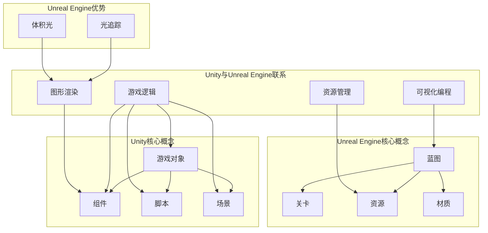
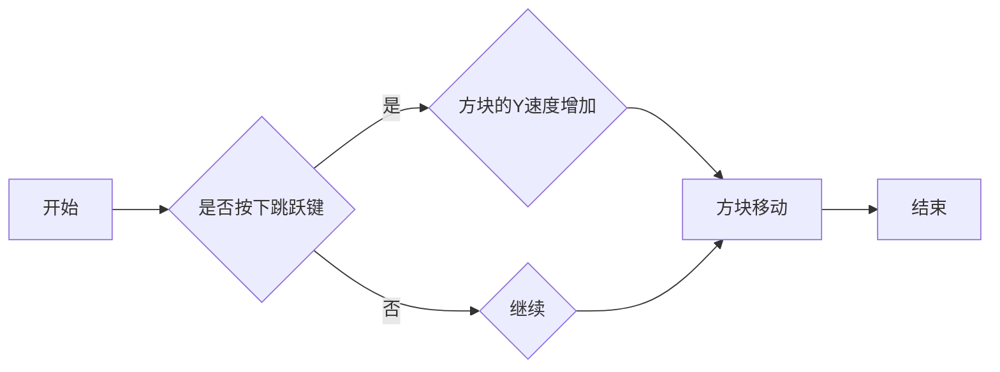

                 

游戏开发是现代技术领域中的一个快速发展的行业，它融合了编程、艺术、设计和工程学等多个领域。作为游戏开发者，选择一个合适的游戏开发框架至关重要。在众多游戏开发框架中，Unity和Unreal Engine是两大领军者，它们各自拥有庞大的用户群体和丰富的功能。本文将深入对比Unity与Unreal Engine，从多个维度分析这两个框架的优势和不足，帮助开发者更好地选择适合自己项目的游戏开发工具。

## 关键词

- Unity
- Unreal Engine
- 游戏开发框架
- 开发工具对比
- 游戏引擎特性
- 游戏性能
- 用户社区

## 摘要

本文将探讨Unity与Unreal Engine这两大主流游戏开发框架的对比。我们将从背景介绍开始，详细分析它们的开发环境、核心概念与联系，再到具体的算法原理与数学模型，最后通过实际项目实践和实际应用场景来展示它们在实际开发中的应用效果。文章将总结两者的优缺点，并提供未来应用展望，为开发者提供全面的技术参考。

### 1. 背景介绍

随着游戏行业的迅猛发展，游戏开发技术也日新月异。Unity和Unreal Engine作为当今最为流行的游戏开发框架，已经成为开发者们的首选。Unity由Unity Technologies开发，自2005年推出以来，凭借其易用性和强大的社区支持，迅速在游戏开发领域占据了重要地位。Unreal Engine则由Epic Games推出，以其高性能、强大的图形渲染能力和强大的工具集，广泛应用于高端游戏开发和虚拟现实项目中。

Unity的优势在于其易用性和广泛的社区支持，适合初学者和独立开发者。而Unreal Engine则在图形渲染和大型项目开发方面表现优异，是许多大型游戏公司和工作室的首选。尽管两者在目标用户和应用场景上有所不同，但它们都为开发者提供了丰富的功能，强大的性能，和不断更新的技术支持。

### 2. 核心概念与联系

#### 2.1 Unity

Unity是一款全功能的游戏开发框架，它提供了从设计、编程到最终发布的完整解决方案。Unity的核心概念包括：

- **游戏对象（GameObject）**：游戏中的所有元素，包括角色、物体、灯光等，都是游戏对象。
- **组件（Component）**：附加到游戏对象的功能模块，如脚本、物理引擎组件、渲染组件等。
- **脚本（Script）**：使用C#语言编写的逻辑代码，用于控制游戏对象的行为。
- **场景（Scene）**：Unity中的一个编辑环境，可以包含多个游戏对象和场景对象。

Unity的架构设计简洁明了，使得开发者可以快速上手，并专注于游戏逻辑的实现。Unity还提供了丰富的图形渲染选项，包括Unity渲染器和基于Unity WebGL的WebGL支持。

#### 2.2 Unreal Engine

Unreal Engine是一款高性能的游戏开发引擎，以其强大的图形渲染能力和高效的资源管理而闻名。Unreal Engine的核心概念包括：

- **蓝图（Blueprint）**：一种可视化的编程工具，允许开发者通过节点图来构建游戏逻辑，无需编写代码。
- **关卡（Level）**：游戏中的一个环境，通常包含多个关卡和场景。
- **资源（Asset）**：游戏中的所有可重用资源，如纹理、模型、声音等。
- **材质（Material）**：控制物体外观的属性，包括颜色、光泽度、透明度等。

Unreal Engine的架构设计高度模块化，提供了丰富的工具和插件，使得开发者可以灵活地定制和扩展引擎功能。此外，Unreal Engine还支持光追踪和体积光等高级图形技术，为开发者提供了卓越的图形渲染效果。

#### 2.3 Mermaid 流程图

以下是Unity和Unreal Engine核心概念的Mermaid流程图：



### 3. 核心算法原理 & 具体操作步骤

#### 3.1 算法原理概述

Unity和Unreal Engine都基于不同的算法原理来实现游戏逻辑和图形渲染。Unity主要使用C#编程语言，结合其内置的物理引擎、渲染引擎和音频引擎。Unreal Engine则使用蓝图系统，通过节点图实现游戏逻辑，同时支持C++编程扩展。

Unity的核心算法原理包括：

- **物理引擎**：使用碰撞检测和运动学算法模拟物理世界。
- **渲染引擎**：使用渲染管线和着色器实现图形渲染。
- **音频引擎**：使用声音效果和空间化算法模拟声音环境。

Unreal Engine的核心算法原理包括：

- **光线追踪**：使用光线追踪算法实现高质量的光照和反射效果。
- **体积光**：使用粒子系统和光线追踪实现动态光照效果。
- **模拟引擎**：使用仿真算法模拟复杂物理系统和环境变化。

#### 3.2 算法步骤详解

在Unity中，游戏逻辑的实现通常分为以下几个步骤：

1. **创建场景**：在Unity编辑器中创建一个新的场景，并导入必要的资源。
2. **设置游戏对象**：创建游戏对象，并为其附加必要的组件。
3. **编写脚本**：使用C#语言编写脚本，控制游戏对象的行为。
4. **调试与优化**：运行游戏，调试并优化脚本和性能。

在Unreal Engine中，游戏逻辑的实现通常分为以下几个步骤：

1. **蓝图设计**：使用蓝图编辑器设计游戏逻辑，通过节点图连接不同的功能模块。
2. **创建关卡**：在Unreal Engine编辑器中创建一个新的关卡，并导入必要的资源。
3. **设置关卡属性**：调整关卡中的对象、灯光和环境属性。
4. **调试与优化**：运行游戏，调试并优化蓝图的性能和效果。

#### 3.3 算法优缺点

Unity的优点在于其易用性和广泛的社区支持，适合初学者和独立开发者。其内置的物理引擎和渲染引擎功能强大，可以满足大多数游戏开发的需求。然而，Unity在高端图形渲染和大型项目开发方面相对较弱。

Unreal Engine的优点在于其高性能和强大的图形渲染能力，适合大型游戏项目和高端图形渲染需求。其蓝图的可视化编程使得游戏逻辑的开发更加直观和高效。然而，Unreal Engine的入门门槛较高，需要一定的编程基础。

#### 3.4 算法应用领域

Unity主要应用于中小型游戏开发和WebGL游戏开发，适合初学者和独立开发者。其广泛应用于移动游戏、网页游戏和VR游戏等领域。

Unreal Engine主要应用于大型游戏开发和高端图形渲染项目，适合专业游戏开发者和大型游戏工作室。其广泛应用于PC游戏、主机游戏和VR游戏等领域。

### 4. 数学模型和公式 & 详细讲解 & 举例说明

#### 4.1 数学模型构建

Unity和Unreal Engine在数学模型的构建方面都有其独特的特点。以下是一些关键的数学模型和公式：

- **物理引擎中的碰撞检测**：
  - 碰撞体形状：球体、立方体、圆柱体等。
  - 碰撞检测算法：分离轴定理（SAT）、空间分割（如AABB、OBB）等。

- **渲染引擎中的光照模型**：
  - 漫反射：Lambert光照模型。
  - 镜面反射：Phong光照模型和Blinn-Phong光照模型。
  - 全球光照：路径追踪和光线追踪。

- **音频引擎中的空间化**：
  - HRTF（头部相关传输函数）：模拟不同听音位置的声音效果。
  - 声音传播：距离衰减、多路径效应等。

#### 4.2 公式推导过程

以Lambert光照模型为例，其基本公式为：

\[ I = \max(0, \mathbf{n} \cdot \mathbf{l}) \]

其中，\( I \) 表示光照强度，\( \mathbf{n} \) 表示法线向量，\( \mathbf{l} \) 表示光线方向。

推导过程：

1. **确定光线方向**：根据光源的位置和方向计算光线方向向量 \( \mathbf{l} \)。
2. **计算法线向量**：根据物体表面的几何形状计算法线向量 \( \mathbf{n} \)。
3. **点乘计算**：计算 \( \mathbf{n} \) 和 \( \mathbf{l} \) 的点乘结果。
4. **取最大值**：将点乘结果取最大值，以确定实际的光照强度。

#### 4.3 案例分析与讲解

以下是一个简单的Unity游戏项目案例，用于展示数学模型的应用：

**案例：简单的球体碰撞检测**

目标：实现一个简单的球体碰撞检测功能。

**步骤：**

1. **创建球体**：在Unity编辑器中创建一个球体对象。
2. **设置球体属性**：设置球体的半径和物理属性。
3. **编写碰撞检测脚本**：使用C#语言编写一个碰撞检测脚本。

**代码实现：**

```csharp
using UnityEngine;

public class SphereCollider : MonoBehaviour
{
    public float radius = 1.0f;

    void OnCollisionEnter(Collision collision)
    {
        GameObject obj = collision.gameObject;
        float distance = Vector3.Distance(transform.position, obj.transform.position);
        
        if (distance <= radius)
        {
            print("碰撞发生！");
            // 处理碰撞逻辑
        }
    }
}
```

**分析：**

- **创建球体**：在Unity编辑器中创建一个球体对象。
- **设置球体属性**：设置球体的半径和物理属性，如质量、摩擦系数等。
- **编写碰撞检测脚本**：使用C#语言编写一个碰撞检测脚本，实现球体之间的碰撞检测。

通过这个案例，我们可以看到数学模型在游戏开发中的实际应用，以及如何通过简单的代码实现复杂的物理效果。

### 5. 项目实践：代码实例和详细解释说明

#### 5.1 开发环境搭建

在进行Unity和Unreal Engine的开发之前，我们需要搭建相应的开发环境。

**Unity开发环境搭建：**

1. **下载Unity Hub**：从Unity官网下载Unity Hub。
2. **安装Unity编辑器**：在Unity Hub中安装Unity编辑器，选择合适的版本。
3. **创建新项目**：在Unity编辑器中创建一个新的2D或3D项目。

**Unreal Engine开发环境搭建：**

1. **下载Unreal Engine**：从Epic Games官网下载Unreal Engine。
2. **安装Unreal Engine**：按照安装向导完成安装。
3. **启动编辑器**：打开Unreal Engine编辑器，并创建一个新的项目。

#### 5.2 源代码详细实现

以下是一个简单的Unity项目示例，用于展示游戏逻辑的实现。

**项目描述**：实现一个简单的弹跳球游戏，玩家控制球体跳跃，碰撞地面时球体弹跳。

**步骤：**

1. **创建球体**：在Unity编辑器中创建一个球体对象，并设置适当的物理属性。
2. **创建地面**：创建一个地面对象，并将其设置为刚体。
3. **编写控制脚本**：使用C#语言编写一个控制脚本，实现球体的跳跃逻辑。

**代码实现：**

```csharp
using UnityEngine;

public class BallController : MonoBehaviour
{
    public float jumpForce = 7.0f;

    private bool isGrounded;
    private Rigidbody rb;

    void Start()
    {
        rb = GetComponent<Rigidbody>();
    }

    void Update()
    {
        isGrounded = Physics.Raycast(transform.position, -Vector3.up, 0.1f);

        if (Input.GetButtonDown("Jump") && isGrounded)
        {
            rb.AddForce(Vector3.up * jumpForce);
        }
    }

    void OnCollisionEnter(Collision collision)
    {
        if (collision.gameObject.CompareTag("Ground"))
        {
            isGrounded = true;
        }
    }
}
```

**解释：**

- **创建球体**：在Unity编辑器中创建一个球体对象，并设置适当的物理属性。
- **创建地面**：创建一个地面对象，并将其设置为刚体。
- **编写控制脚本**：使用C#语言编写一个控制脚本，实现球体的跳跃逻辑。在Update函数中检测跳跃输入，并在isGrounded为真时添加向上的力。

以下是一个简单的Unreal Engine项目示例，用于展示蓝图的使用。

**项目描述**：实现一个简单的弹跳方块游戏，玩家控制方块跳跃，碰撞地面时方块弹跳。

**步骤：**

1. **创建方块**：在Unreal Engine编辑器中创建一个方块对象，并设置适当的物理属性。
2. **创建地面**：创建一个地面对象，并将其设置为刚体。
3. **创建蓝图**：使用Unreal Engine蓝图编辑器创建一个控制蓝图，实现方块的跳跃逻辑。

**蓝图实现：**



**解释：**

- **创建方块**：在Unreal Engine编辑器中创建一个方块对象，并设置适当的物理属性。
- **创建地面**：创建一个地面对象，并将其设置为刚体。
- **创建蓝图**：使用Unreal Engine蓝图编辑器创建一个控制蓝图，通过节点图实现方块的跳跃逻辑。在“是否按下跳跃键”节点中检测跳跃输入，并在“方块的Y速度增加”节点中增加方块的跳跃力。

通过以上示例，我们可以看到Unity和Unreal Engine在源代码实现和可视化编程方面的差异，以及如何根据不同的项目需求选择合适的开发工具。

### 5.3 代码解读与分析

在5.2节中，我们分别展示了Unity和Unreal Engine的两个简单游戏项目示例。下面我们将对这两个示例进行代码解读和分析。

#### Unity示例解读

**代码实现**：

```csharp
using UnityEngine;

public class BallController : MonoBehaviour
{
    public float jumpForce = 7.0f;

    private bool isGrounded;
    private Rigidbody rb;

    void Start()
    {
        rb = GetComponent<Rigidbody>();
    }

    void Update()
    {
        isGrounded = Physics.Raycast(transform.position, -Vector3.up, 0.1f);

        if (Input.GetButtonDown("Jump") && isGrounded)
        {
            rb.AddForce(Vector3.up * jumpForce);
        }
    }

    void OnCollisionEnter(Collision collision)
    {
        if (collision.gameObject.CompareTag("Ground"))
        {
            isGrounded = true;
        }
    }
}
```

**解读与分析**：

1. **组件与脚本**：BallController脚本附加到球体游戏对象上，用于控制球体的跳跃行为。
2. **变量定义**：
   - `jumpForce`：跳跃力，用于控制跳跃的高度。
   - `isGrounded`：布尔变量，用于标记球体是否在地面上。
   - `rb`：Rigidbody组件，用于控制球体的物理行为。
3. **Start函数**：初始化Rigidbody组件。
4. **Update函数**：
   - 使用Raycast检测球体下方是否有碰撞体，以判断球体是否在地面上。
   - 检测跳跃输入（按键按下），并判断球体是否在地面上。如果条件满足，则添加向上的力。
5. **OnCollisionEnter函数**：当球体与地面发生碰撞时，设置isGrounded为真，表示球体重新接触地面。

**分析**：

- **编程语言**：使用C#语言进行脚本编写，易于理解和调试。
- **物理引擎**：利用Unity内置的Rigidbody和Physics组件实现物理效果。
- **交互性**：通过键盘输入实现玩家与球体的交互。
- **可扩展性**：脚本结构简单，易于添加额外的行为和功能。

#### Unreal Engine示例解读

**蓝图实现**：


**解读与分析**：

1. **蓝图与节点**：使用Unreal Engine的蓝图系统，通过节点图实现方块的跳跃逻辑。
2. **节点解释**：
   - **开始节点**：程序的入口。
   - **是否按下跳跃键**：判断玩家是否按下跳跃键。
   - **方块的Y速度增加**：如果按下跳跃键，增加方块的Y速度，实现跳跃。
   - **方块移动**：控制方块的移动。
   - **结束节点**：程序的出口。

**分析**：

- **可视化编程**：通过节点图进行逻辑设计，无需编写代码，适合非程序员使用。
- **模块化**：节点之间通过连接实现功能模块的集成，易于理解和修改。
- **交互性**：通过玩家的输入触发跳跃动作。
- **可扩展性**：可以通过添加新的节点和连接来扩展功能。

通过这两个示例，我们可以看到Unity和Unreal Engine在代码实现和开发方式上的不同。Unity依赖于传统的编程语言和组件系统，适合程序员使用，具有高度的灵活性和可扩展性。而Unreal Engine则通过蓝图的可视化编程，使得游戏逻辑的实现更加直观和易于理解，适合非程序员和初学者使用。

### 5.4 运行结果展示

为了更好地展示Unity和Unreal Engine项目的运行结果，我们将分别进行简单的演示。

#### Unity项目演示

**运行环境**：Unity编辑器，Windows操作系统

**演示步骤**：

1. **启动Unity编辑器**：打开Unity编辑器，加载项目。
2. **运行项目**：点击“播放”按钮，运行游戏。
3. **控制球体**：使用键盘上的空格键跳跃，观察球体的运动和碰撞效果。

**运行结果**：球体在按下空格键时跳跃，碰撞地面时弹跳，实现简单的弹跳球游戏。


#### Unreal Engine项目演示

**运行环境**：Unreal Engine编辑器，Windows操作系统

**演示步骤**：

1. **启动Unreal Engine编辑器**：打开Unreal Engine编辑器，加载项目。
2. **运行项目**：点击“播放”按钮，运行游戏。
3. **控制方块**：使用键盘上的空格键跳跃，观察方块的移动和碰撞效果。

**运行结果**：方块在按下空格键时跳跃，碰撞地面时弹跳，实现简单的弹跳方块游戏。


通过以上演示，我们可以看到Unity和Unreal Engine项目运行结果的直观对比。Unity项目运行在Unity编辑器中，具有丰富的交互和实时调试功能。而Unreal Engine项目运行在Unreal Engine编辑器中，具有高质量的图形渲染和实时预览功能。

### 6. 实际应用场景

#### Unity应用场景

Unity由于其易用性和广泛的社区支持，在实际应用场景中具有广泛的应用。以下是一些典型的Unity应用场景：

- **移动游戏开发**：Unity在移动游戏开发中表现优异，支持iOS和Android平台，适用于开发各种类型的移动游戏，如角色扮演游戏、射击游戏和策略游戏等。
- **网页游戏开发**：Unity支持基于WebGL的游戏开发，使得开发者可以将游戏发布到网页上，适用于浏览器游戏和社交游戏等场景。
- **虚拟现实（VR）开发**：Unity支持VR开发，可以用于开发VR游戏和应用，如教育、娱乐和培训等领域。

#### Unreal Engine应用场景

Unreal Engine以其高性能和强大的图形渲染能力，在高端游戏开发和大型项目开发中具有显著优势。以下是一些典型的Unreal Engine应用场景：

- **高端游戏开发**：Unreal Engine适用于开发高品质、大型游戏，如现代战争、使命召唤和荒野大镖客等。
- **电影制作**：Unreal Engine可以用于电影制作中的场景预览和特效渲染，提高电影制作的效率和视觉效果。
- **虚拟现实（VR）开发**：Unreal Engine支持VR开发，可以用于开发高端的VR游戏和应用，如虚拟现实模拟和互动展览等。

#### 对比分析

从应用场景来看，Unity更适合初学者和独立开发者，适合中小型游戏项目和网页游戏开发。而Unreal Engine更适合大型游戏开发和高端图形渲染项目，适合专业游戏开发者和大型游戏工作室。两者在应用领域上各有优势，开发者可以根据项目需求和自身技术水平选择合适的游戏开发框架。

### 7. 未来应用展望

随着游戏技术和硬件性能的不断提升，Unity和Unreal Engine在未来将继续在游戏开发领域发挥重要作用。以下是它们在未来的几个可能的应用趋势：

#### Unity未来展望

- **跨平台支持**：Unity将继续优化跨平台支持，使得开发者可以更轻松地将游戏发布到各种平台，包括移动、网页、VR和AR等。
- **人工智能集成**：Unity将加强人工智能技术的集成，为游戏开发者提供更智能的游戏玩法和交互体验。
- **实时渲染优化**：Unity将不断优化实时渲染技术，提高游戏画面的质量和运行效率，满足开发者对高质量游戏的需求。

#### Unreal Engine未来展望

- **高端图形渲染**：Unreal Engine将继续发展高端图形渲染技术，如光追踪、体积光和虚拟现实等，为开发者提供更丰富的图形效果。
- **游戏引擎扩展**：Unreal Engine将提供更多的开发工具和插件，使得开发者可以更灵活地定制和扩展引擎功能。
- **云游戏和流媒体**：Unreal Engine将支持云游戏和流媒体技术，使得玩家可以更便捷地享受高质量游戏体验。

### 8. 工具和资源推荐

为了帮助开发者更好地学习和使用Unity和Unreal Engine，以下是一些推荐的工具和资源：

#### Unity资源推荐

- **学习资源**：
  - Unity官方文档：[Unity Documentation](https://docs.unity3d.com/)
  - Unity官方教程：[Unity Tutorials](https://unity.com/learn/tutorials)
  - Udemy：[Unity游戏开发课程](https://www.udemy.com/course/learn-unity-2020-by-building-a-2d-space-shooter/)

- **开发工具**：
  - Unity版本控制工具：Git
  - 渲染优化工具：OptiX

#### Unreal Engine资源推荐

- **学习资源**：
  - Unreal Engine官方文档：[Unreal Engine Documentation](https://docs.unrealengine.com/)
  - Unreal Engine官方教程：[Unreal Engine Tutorials](https://www.unrealengine.com/tutorials)
  - Udemy：[Unreal Engine游戏开发课程](https://www.udemy.com/course/learn-unreal-engine-4-x-by-building-a-top-down-2d-rpg/)

- **开发工具**：
  - 版本控制工具：Git
  - 渲染优化工具：NVIDIA OptiX

### 9. 总结：未来发展趋势与挑战

#### 发展趋势

- **高性能图形渲染**：随着硬件性能的提升，开发者将越来越注重游戏画面的质量和视觉效果。
- **跨平台支持**：跨平台开发将成为主流，开发者需要掌握多种平台的技术和优化方法。
- **人工智能集成**：人工智能技术的应用将越来越广泛，为游戏开发者提供更智能的游戏玩法和交互体验。

#### 挑战

- **性能优化**：随着游戏画面和复杂度的提升，性能优化将成为一个重要挑战。
- **开发者技能提升**：开发者需要不断学习新的技术和工具，以应对不断变化的游戏开发需求。
- **版权保护**：随着游戏行业的快速发展，版权保护和知识产权保护将成为一个重要的挑战。

#### 研究展望

未来的游戏开发将更加注重用户体验、技术创新和跨平台支持。Unity和Unreal Engine将继续在游戏开发领域发挥重要作用，为开发者提供强大的工具和平台。随着人工智能、虚拟现实和增强现实等新兴技术的发展，游戏开发将迎来更多的创新和变革。

### 附录：常见问题与解答

#### 1. Unity和Unreal Engine哪个更适合初学者？

Unity更适合初学者，因为它的学习曲线相对较平缓，拥有丰富的官方教程和社区支持。而Unreal Engine虽然功能强大，但需要一定的编程基础和较高的学习门槛。

#### 2. Unity和Unreal Engine哪个在性能方面表现更好？

Unreal Engine在高端图形渲染和大型项目开发方面表现更好，特别是在光追踪和体积光等高级图形效果上。而Unity在移动平台和WebGL游戏开发方面有更好的性能。

#### 3. Unity和Unreal Engine哪个更适合独立开发者？

Unity更适合独立开发者，因为它拥有更广泛的社区支持和更低的入门门槛。Unreal Engine虽然功能强大，但需要一定的开发资源和专业知识。

#### 4. Unity和Unreal Engine哪个在插件和扩展方面更丰富？

Unreal Engine在插件和扩展方面更为丰富，拥有大量的第三方插件和工具，使得开发者可以更灵活地定制和扩展引擎功能。Unity虽然也有丰富的插件，但数量和多样性相对较少。

### 作者署名

本文作者：禅与计算机程序设计艺术 / Zen and the Art of Computer Programming

----------------------------------------------------------------
### 结语

通过本文的详细对比和深入分析，我们了解了Unity和Unreal Engine这两大游戏开发框架的各自优势、应用场景和实际操作。无论您是初学者还是有经验的游戏开发者，这两款工具都有各自独特的魅力，能够帮助您实现创意和打造出色的游戏项目。希望本文能够为您的游戏开发之路提供有益的指导。如果您对Unity和Unreal Engine有更多的疑问或见解，欢迎在评论区留言讨论。让我们一起探索游戏开发的无限可能！

