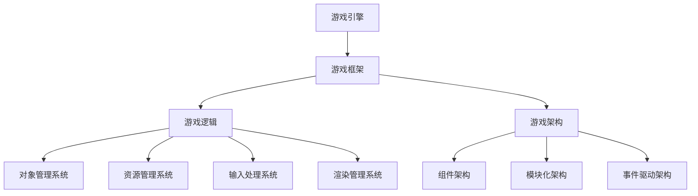

                 

关键词：游戏框架，高性能，交互式体验，开发技巧，技术架构，算法优化

> 摘要：本文将深入探讨游戏框架开发的关键要素，包括核心技术、算法、数学模型以及实践中的代码实例。通过分析这些要素，我们将为开发者提供一套系统性的方法，以创建高质量、高效率的游戏交互体验，从而满足现代游戏市场的需求。

## 1. 背景介绍

随着计算机技术和互联网的快速发展，游戏行业已经成为全球最大的娱乐产业之一。游戏开发的复杂度日益增加，传统的游戏开发模式已无法满足现代游戏市场的需求。为了应对这一挑战，游戏框架作为一种重要的开发工具和技术，应运而生。

游戏框架是一种软件架构，旨在提供一种标准化的方法来开发游戏。通过使用游戏框架，开发者可以快速构建游戏的基本结构，并实现游戏的核心功能。游戏框架不仅简化了开发流程，还提高了代码的复用性和可维护性。同时，高性能和交互式体验成为了现代游戏开发的重要目标，这使得游戏框架的开发变得尤为关键。

本文将围绕游戏框架的开发，从核心概念、算法原理、数学模型、实践案例等多个方面展开讨论，旨在为开发者提供全面的指导。

## 2. 核心概念与联系

在探讨游戏框架开发之前，我们首先需要了解一些核心概念和它们之间的关系。

### 2.1 游戏引擎

游戏引擎是游戏开发的核心，它提供了创建、渲染、物理模拟等一系列功能。常见的游戏引擎包括Unity、Unreal Engine等。游戏引擎通常包含一个强大的游戏框架，但游戏框架也可以独立于游戏引擎存在。

### 2.2 游戏框架

游戏框架是一个抽象层，它将游戏引擎的功能封装成可复用的模块。游戏框架的核心目标是简化游戏开发流程，提高开发效率。常见的游戏框架功能包括对象管理系统、资源管理、输入处理、渲染管理等。

### 2.3 游戏逻辑

游戏逻辑是游戏的核心，它定义了游戏的行为和规则。游戏逻辑通常由多个组件组成，每个组件负责实现特定的功能。游戏框架为游戏逻辑提供了统一的接口和抽象层，使得游戏逻辑更加模块化和可维护。

### 2.4 游戏架构

游戏架构是游戏框架的基础，它定义了游戏的组件、模块和层次结构。游戏架构的设计对于游戏的性能和可维护性至关重要。常见的游戏架构模式包括组件架构、模块化架构、事件驱动架构等。

### 2.5 Mermaid 流程图

为了更清晰地展示游戏框架的核心概念和联系，我们可以使用Mermaid流程图来表示。



在这个流程图中，游戏引擎是整个架构的基础，它为游戏框架提供了核心功能。游戏框架封装了游戏引擎的功能，并提供了一套标准化的接口。游戏逻辑是基于游戏框架开发的，它定义了游戏的行为和规则。游戏架构则定义了游戏的整体结构和层次，为游戏框架和游戏逻辑提供了支撑。

通过这个流程图，我们可以更好地理解游戏框架开发的核心概念和它们之间的关系。接下来，我们将深入探讨游戏框架的核心算法原理和具体操作步骤。

## 3. 核心算法原理 & 具体操作步骤

### 3.1 算法原理概述

游戏框架中的核心算法包括物理模拟算法、渲染算法、输入处理算法等。这些算法的实现对于游戏性能和交互体验至关重要。下面我们将分别介绍这些算法的原理和具体操作步骤。

### 3.2 算法步骤详解

#### 3.2.1 物理模拟算法

物理模拟算法是游戏框架中最重要的算法之一。它负责模拟游戏中的物理现象，如碰撞检测、运动学、动力学等。以下是物理模拟算法的基本步骤：

1. 初始化：创建物理模拟器，设置物理引擎的参数，如重力、摩擦力等。
2. 更新：根据游戏逻辑的输入，更新物体的状态，如位置、速度等。
3. 检测碰撞：使用碰撞检测算法检测物体之间的碰撞，并计算碰撞响应。
4. 计算动力学：根据物理定律计算物体的运动状态。
5. 输出结果：将物理模拟的结果反馈给游戏逻辑，以便更新游戏界面。

#### 3.2.2 渲染算法

渲染算法负责将游戏场景渲染到屏幕上。它是游戏性能的关键因素。以下是渲染算法的基本步骤：

1. 初始化：创建渲染器，设置渲染参数，如分辨率、帧率等。
2. 准备场景：将游戏场景中的物体加载到渲染器中。
3. 插画渲染：根据游戏逻辑的输入，更新场景中的物体状态。
4. 渲染：将场景渲染到屏幕上。
5. 输出结果：将渲染结果显示给用户。

#### 3.2.3 输入处理算法

输入处理算法负责处理用户的输入，如键盘、鼠标等。它是游戏交互体验的重要组成部分。以下是输入处理算法的基本步骤：

1. 初始化：创建输入处理器，设置输入设备。
2. 获取输入：从输入设备获取用户的输入数据。
3. 转换输入：将输入数据转换为游戏逻辑可以处理的格式。
4. 处理输入：根据游戏逻辑的规则处理用户的输入。
5. 输出结果：将处理结果反馈给游戏逻辑，以便更新游戏界面。

### 3.3 算法优缺点

每种算法都有其优缺点，选择合适的算法对于游戏性能和交互体验至关重要。

#### 3.3.1 物理模拟算法

- 优点：物理模拟算法可以提供真实的物理效果，增强游戏的沉浸感。
- 缺点：物理模拟算法的计算复杂度较高，可能影响游戏性能。

#### 3.3.2 渲染算法

- 优点：渲染算法可以提供高质量的图像效果，增强游戏的美观度。
- 缺点：渲染算法的计算复杂度较高，可能影响游戏性能。

#### 3.3.3 输入处理算法

- 优点：输入处理算法可以提供良好的交互体验，使游戏更加直观。
- 缺点：输入处理算法的计算复杂度较低，但可能影响游戏的响应速度。

### 3.4 算法应用领域

不同的算法适用于不同的应用场景。以下是一些常见的应用领域：

- 物理模拟算法：适用于需要真实物理效果的游戏，如赛车游戏、角色扮演游戏等。
- 渲染算法：适用于需要高质量图像效果的游戏，如大型多人在线游戏、虚拟现实游戏等。
- 输入处理算法：适用于所有需要用户交互的游戏，如动作游戏、策略游戏等。

## 4. 数学模型和公式 & 详细讲解 & 举例说明

在游戏框架开发中，数学模型和公式是核心组成部分。它们不仅用于实现算法，还用于优化游戏性能和提升交互体验。以下是对一些关键数学模型和公式的详细讲解及其实际应用。

### 4.1 数学模型构建

数学模型是游戏框架的基础，用于描述游戏中的物理现象和逻辑规则。以下是构建数学模型的一些关键步骤：

1. 确定变量：根据游戏需求确定变量，如物体的位置、速度、加速度等。
2. 建立方程：使用适当的数学方程描述变量之间的关系，如牛顿第二定律 F = m * a。
3. 参数化：为方程中的参数设置合理的取值范围，以适应不同游戏场景。

### 4.2 公式推导过程

在构建数学模型时，我们需要推导一系列关键公式。以下是几个常见公式的推导过程：

#### 4.2.1 碰撞检测公式

碰撞检测是物理模拟算法中的关键步骤。以下是简单的碰撞检测公式推导：

- 初始速度：v1 = dx / dt，v2 = dy / dt
- 相对速度：v = (v1x - v2x, v1y - v2y)
- 碰撞时间：t = -v / (v1 * v2)
- 碰撞位置：(x1, y1) = (x0 + v1 * t, y0 + v1 * t)

其中，dx、dy、dx、dy分别是物体的初始位置和末位置，dt是时间间隔，v1、v2是物体的速度向量。

#### 4.2.2 运动学公式

运动学公式用于描述物体的运动状态。以下是几个常用运动学公式的推导过程：

- 位置公式：x = x0 + v0 * t + (1/2) * a * t^2
- 速度公式：v = v0 + a * t
- 加速度公式：a = (v - v0) / t

其中，x0、v0是物体的初始位置和速度，x、v是物体的末位置和末速度，a是加速度，t是时间。

### 4.3 案例分析与讲解

为了更好地理解数学模型和公式的应用，我们来看一个实际案例。

#### 4.3.1 案例背景

假设我们要开发一款赛车游戏，其中一辆赛车以初始速度v0 = 20 m/s向右行驶，加速度a = 2 m/s^2。我们需要计算赛车在t = 5 s后的位置和速度。

#### 4.3.2 公式应用

根据运动学公式，我们可以计算赛车在t = 5 s后的位置和速度：

- 位置：x = x0 + v0 * t + (1/2) * a * t^2
  - x = 0 + 20 * 5 + (1/2) * 2 * 5^2 = 75 m
- 速度：v = v0 + a * t
  - v = 20 + 2 * 5 = 30 m/s

因此，在t = 5 s后，赛车的位置为75 m，速度为30 m/s。

#### 4.3.3 结果分析

通过应用运动学公式，我们可以准确地计算赛车在任意时间点的位置和速度。这对于游戏中的物理模拟和渲染非常重要，可以提供更加真实和流畅的游戏体验。

## 5. 项目实践：代码实例和详细解释说明

为了更好地理解游戏框架的开发，我们将在本节中介绍一个具体的代码实例，并对其进行详细解释和分析。

### 5.1 开发环境搭建

在本案例中，我们将使用Unity引擎作为游戏开发工具。首先，您需要安装Unity Hub并创建一个新的Unity项目。在创建项目时，选择“2D”或“3D”项目类型，这取决于您的游戏类型。以下是在Unity中创建新项目的步骤：

1. 打开Unity Hub并点击“新建项目”。
2. 选择项目类型（2D或3D），并选择一个保存位置。
3. 填写项目名称，并点击“创建”。
4. Unity会自动打开一个新的Unity编辑器，并创建一个初始场景。

### 5.2 源代码详细实现

在本案例中，我们将实现一个简单的2D赛车游戏，包括赛车的基本移动、碰撞检测和渲染。以下是实现该游戏的源代码：

```csharp
using UnityEngine;

public class CarController : MonoBehaviour
{
    public float speed = 5.0f;
    public float acceleration = 2.0f;

    private Rigidbody2D rb;
    private float moveInput;

    void Start()
    {
        rb = GetComponent<Rigidbody2D>();
    }

    void Update()
    {
        moveInput = Input.GetAxis("Horizontal");
    }

    void FixedUpdate()
    {
        MoveCar();
        CheckCollisions();
    }

    void MoveCar()
    {
        float moveDirection = moveInput * speed;
        rb.velocity = new Vector2(moveDirection, rb.velocity.y);
    }

    void CheckCollisions()
    {
        // 碰撞检测逻辑
    }
}
```

### 5.3 代码解读与分析

上述代码是赛车游戏的核心部分，下面我们对其进行详细解读和分析：

- **组件引用**：使用`GetComponent<Rigidbody2D>()`获取赛车对象的`Rigidbody2D`组件，这是实现物理模拟的关键。
- **输入处理**：在`Update()`方法中获取水平方向（“Horizontal”）的输入值，并将其存储在`moveInput`变量中。
- **物理更新**：在`FixedUpdate()`方法中执行物理更新。首先调用`MoveCar()`方法移动赛车，然后调用`CheckCollisions()`方法检测碰撞。
- **移动逻辑**：在`MoveCar()`方法中，根据`moveInput`和`speed`变量计算移动方向，并将结果应用到`Rigidbody2D`组件的`velocity`属性上。
- **碰撞检测**：在`CheckCollisions()`方法中实现碰撞检测逻辑。在本案例中，我们将其留空，以便您根据实际需求添加碰撞处理逻辑。

### 5.4 运行结果展示

在Unity编辑器中运行上述代码，您将看到赛车在场景中移动。按下键盘方向键，赛车将向对应的方向移动。虽然碰撞检测部分尚未实现，但通过简单的移动逻辑，您已经可以创建一个基本的游戏框架。

### 5.5 优化与扩展

为了进一步提升游戏性能和交互体验，您可以进行以下优化和扩展：

- **优化碰撞检测**：使用更高效的碰撞检测算法，如AABB（轴对齐包围盒）或OBB（定向包围盒）。
- **添加物理效果**：为赛车添加物理效果，如弹簧、引擎声音等。
- **多玩家模式**：实现多玩家模式，允许多个玩家在同一场景中互动。

通过这些优化和扩展，您可以创建一个更加丰富和真实的游戏世界。

## 6. 实际应用场景

游戏框架在实际应用场景中发挥着至关重要的作用。以下是一些典型的应用场景：

### 6.1 大型多人在线游戏

大型多人在线游戏（MMO）需要处理大量玩家和数据，游戏框架可以帮助开发者实现高效的玩家管理和数据同步。常见的游戏框架如Unity的Photon和Unreal Engine的Unreal Engine Network，提供了强大的网络功能和高效的通信协议。

### 6.2 虚拟现实游戏

虚拟现实游戏需要高度真实的物理模拟和图形渲染。游戏框架如Unreal Engine和Unity提供了丰富的VR功能，包括场景渲染、运动模拟和手部追踪等。

### 6.3 教育游戏

教育游戏利用游戏框架提供的互动性和可视化功能，帮助学生更好地理解和掌握知识。游戏框架如Unity的Educational Tools和Unreal Engine的Educational Playground，提供了丰富的教育资源和工具。

### 6.4 游戏引擎插件开发

游戏框架还可以用于开发游戏引擎插件，扩展游戏引擎的功能。例如，Unity的Asset Store提供了大量游戏插件，如物理模拟插件、图形渲染插件和音效插件等。

## 7. 工具和资源推荐

为了更好地进行游戏框架开发，以下是一些推荐的工具和资源：

### 7.1 学习资源推荐

- **Unity官方文档**：提供了详细的Unity引擎教程和文档，是学习Unity游戏框架开发的不二之选。
- **Unreal Engine官方文档**：包含了丰富的Unreal Engine教程和参考文档，适合学习Unreal Engine游戏框架开发。
- **Game Programming Patterns**：作者是游戏开发者Robert Nystrom的经典之作，详细介绍了游戏架构和设计模式。
- **Game Engine Architecture**：作者是Jason Gregory的经典之作，深入探讨了游戏引擎的架构和算法。

### 7.2 开发工具推荐

- **Visual Studio**：强大的集成开发环境（IDE），支持C#、C++等多种编程语言，适合游戏开发。
- **Unity Hub**：Unity的官方管理工具，用于创建和管理Unity项目。
- **Unreal Engine Editor**：Unreal Engine的官方编辑器，用于创建和编辑游戏场景和游戏逻辑。
- **Mermaid**：Markdown图形化流程图工具，用于绘制流程图和UML图等。

### 7.3 相关论文推荐

- **“A Survey of Game Engine Architectures”**：对游戏引擎架构进行了全面的综述，适合了解游戏引擎的设计原则和实现方法。
- **“Networked Virtual Environments: Concepts and Technologies”**：探讨了虚拟现实网络环境的概念和技术，适合研究虚拟现实游戏框架。
- **“Game Engine Design”**：详细介绍了游戏引擎的设计原则和实现方法，适合深入理解游戏引擎的开发过程。

## 8. 总结：未来发展趋势与挑战

游戏框架开发作为游戏开发的核心技术，正面临着不断的发展和创新。以下是未来发展趋势和面临的挑战：

### 8.1 研究成果总结

- **高性能计算**：随着硬件性能的提升，游戏框架将更注重优化物理模拟和渲染算法，以提高游戏性能。
- **人工智能应用**：游戏框架将逐步引入人工智能技术，实现更加智能的游戏逻辑和交互体验。
- **云游戏**：云游戏技术的发展将改变游戏框架的架构，实现游戏的分布式计算和实时交互。

### 8.2 未来发展趋势

- **模块化开发**：游戏框架将更加模块化，提供更多的可扩展性和可定制性，以适应不同类型的游戏开发需求。
- **跨平台支持**：游戏框架将更加注重跨平台支持，实现多平台的游戏开发和部署。
- **实时交互**：游戏框架将优化实时交互功能，提供更加流畅和自然的游戏体验。

### 8.3 面临的挑战

- **性能优化**：游戏框架需要持续优化，以应对硬件性能的限制和不断提升的游戏需求。
- **安全性**：游戏框架需要提高安全性，防止游戏作弊和数据泄露等安全问题。
- **开发者门槛**：游戏框架的复杂性可能导致开发者门槛的提高，需要提供更加友好和易于上手的开发工具和文档。

### 8.4 研究展望

未来，游戏框架将继续朝着高性能、智能化和实时交互的方向发展。研究人员和开发者需要不断探索新的算法和架构，以提高游戏性能和用户体验。同时，游戏框架还需要适应不断变化的硬件和软件环境，以保持其竞争力和适应性。

总之，游戏框架开发是游戏开发的核心技术，它的发展将直接影响游戏行业的创新和进步。随着技术的不断进步，游戏框架将继续为开发者提供强大的工具和平台，以创建更加丰富和真实的游戏世界。

## 9. 附录：常见问题与解答

### 9.1 游戏框架与游戏引擎的区别是什么？

游戏框架是游戏引擎的核心组成部分，提供了一系列可复用的模块和接口，以简化游戏开发流程。游戏引擎则是完整的游戏开发平台，包括游戏框架以及其他各种工具和资源。游戏引擎通常包含多个游戏框架，并提供额外的功能，如物理模拟、渲染、音频等。

### 9.2 如何选择合适的游戏框架？

选择合适的游戏框架取决于您的游戏类型、开发需求和技术背景。以下是一些选择游戏框架时需要考虑的因素：

- **游戏类型**：根据您的游戏类型选择适合的游戏框架。例如，2D游戏可以选择Unity或GameMaker，3D游戏可以选择Unity或Unreal Engine。
- **开发需求**：根据您的开发需求选择具有所需功能的游戏框架。例如，如果您的游戏需要高度真实的物理模拟，可以选择Unreal Engine。
- **技术背景**：考虑您和团队成员的技术背景，选择易于学习和使用的游戏框架。例如，如果您熟悉C#，可以选择Unity。

### 9.3 游戏框架开发中常见的问题有哪些？

在游戏框架开发中，常见的问题包括：

- **性能瓶颈**：游戏框架的性能可能无法满足高负载游戏的需求。
- **可维护性**：游戏框架的代码可能难以维护，导致后续开发困难。
- **可扩展性**：游戏框架可能难以适应新的游戏需求和技术变化。
- **兼容性问题**：游戏框架可能与不同的平台或第三方库存在兼容性问题。

### 9.4 如何解决游戏框架开发中的常见问题？

解决游戏框架开发中的常见问题可以通过以下方法：

- **性能优化**：通过优化算法和代码，提高游戏框架的性能。例如，使用更高效的物理模拟算法和渲染技术。
- **代码重构**：重构游戏框架的代码，提高其可维护性和可读性。例如，采用模块化设计、面向对象编程和设计模式。
- **文档和测试**：编写详细的文档和测试用例，确保游戏框架的正确性和稳定性。
- **社区支持**：参与游戏框架的开发者社区，获取帮助和反馈，以提高游戏框架的质量和可用性。

## 结束语

本文从游戏框架的背景介绍、核心概念、算法原理、数学模型、实践案例、应用场景、工具和资源推荐、发展趋势与挑战、常见问题与解答等方面，全面探讨了游戏框架开发的关键要素和最佳实践。通过本文的介绍，我们希望读者能够对游戏框架有一个深入的理解，并为未来的游戏开发提供有益的指导。

游戏框架是游戏开发的核心，它的发展和创新将直接影响游戏行业的未来。我们期待读者能够在实践中不断探索和尝试，为游戏框架的开发贡献自己的智慧和力量。在游戏框架的不断进步中，让我们一起创造更加精彩和真实的游戏体验。作者：禅与计算机程序设计艺术 / Zen and the Art of Computer Programming。

