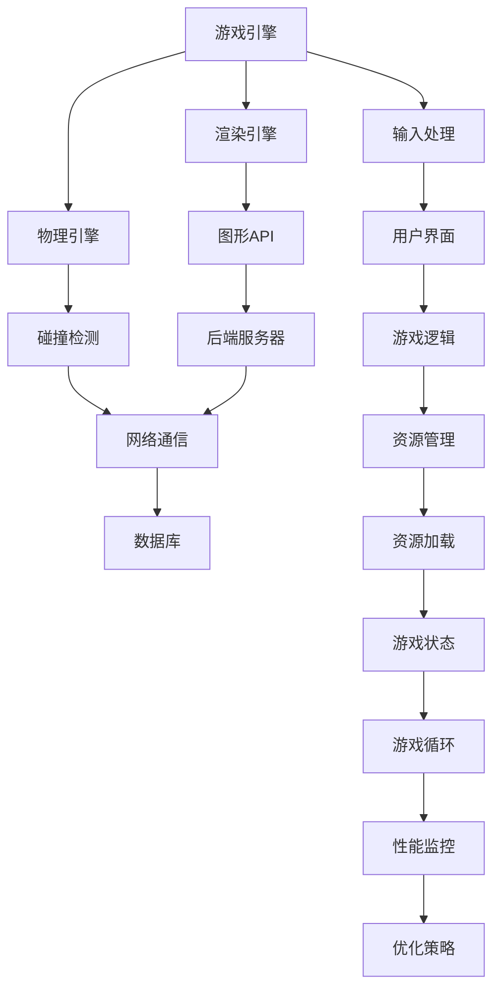

                 

关键词：游戏开发、游戏框架、交互式体验、性能优化、核心算法、数学模型、项目实践、实际应用

> 摘要：本文旨在深入探讨游戏框架的开发，重点关注如何创建高性能的交互式体验。通过分析核心算法原理、数学模型和项目实践，我们将揭示游戏开发中的关键技术和挑战，并探讨未来应用和趋势。

## 1. 背景介绍

随着游戏产业的蓬勃发展，游戏开发成为了计算机科学和技术领域的一个重要分支。游戏框架作为游戏开发的核心基础设施，承担着游戏逻辑、渲染、输入输出等重要任务。一个优秀的游戏框架不仅能够提高开发效率，还能为玩家提供流畅、沉浸式的游戏体验。

高性能交互式体验是现代游戏开发的重要目标之一。玩家对游戏画面的清晰度、响应速度和交互感受有着极高的要求。因此，游戏开发者在选择合适的游戏框架时，必须综合考虑性能、可扩展性和易用性等因素。

本文将围绕游戏框架的开发，探讨以下核心问题：

- 核心算法原理及其对游戏性能的影响
- 数学模型在游戏框架中的应用
- 项目实践中的代码实例和解析
- 实际应用场景和未来发展趋势

## 2. 核心概念与联系

在游戏框架开发中，了解核心概念和它们之间的联系至关重要。以下是一个简化的 Mermaid 流程图，展示了一些关键概念和它们之间的交互关系。



### 2.1 游戏引擎

游戏引擎是游戏框架的核心，负责游戏逻辑的执行、渲染和物理模拟。它提供了一个高度抽象的API，使得开发者可以专注于游戏内容的创作，而无需关注底层实现细节。

### 2.2 渲染引擎

渲染引擎负责将游戏世界以视觉形式呈现给玩家。它利用图形API（如OpenGL、DirectX）将场景绘制到屏幕上。性能优化是渲染引擎的关键，涉及到顶点处理、光照计算、纹理映射等多个方面。

### 2.3 物理引擎

物理引擎负责模拟游戏中的物理现象，如碰撞、重力、摩擦等。它为游戏提供了真实的物理感受，增加了游戏的沉浸感和可玩性。物理引擎的性能直接影响游戏的流畅度。

### 2.4 输入处理

输入处理模块负责接收玩家的操作，如键盘、鼠标、控制器等。高效的输入处理能够减少延迟，提高玩家的交互感受。

### 2.5 用户界面

用户界面模块提供了游戏的交互元素，如按钮、菜单、文本框等。良好的用户界面设计能够提高玩家的操作效率，增强游戏的可玩性。

### 2.6 后端服务器

后端服务器负责处理游戏逻辑、保存游戏状态、管理玩家数据等。网络通信模块负责与后端服务器进行数据交换，实现多人游戏和在线功能。

### 2.7 数据库

数据库用于存储游戏数据和玩家信息。有效的数据库设计能够提高数据的访问速度和查询效率。

### 2.8 游戏逻辑

游戏逻辑模块定义了游戏的规则和行为。它是游戏框架的核心，决定了游戏的核心玩法和游戏体验。

### 2.9 资源管理

资源管理模块负责管理游戏资源，如图片、音频、视频等。有效的资源管理能够提高游戏的加载速度和运行效率。

### 2.10 游戏状态

游戏状态模块负责维护游戏的状态信息，如游戏进度、玩家得分等。游戏状态的变化会影响游戏的进程和玩家的体验。

### 2.11 游戏循环

游戏循环模块负责游戏的持续运行。它通过不断地更新游戏状态、渲染画面、处理输入等操作，实现游戏的动态交互。

### 2.12 性能监控

性能监控模块负责监控游戏的运行性能，如帧率、CPU利用率、内存占用等。通过性能监控，开发者可以及时发现和解决问题，优化游戏性能。

### 2.13 优化策略

优化策略模块负责制定和实施游戏性能优化方案。通过分析性能监控数据，开发者可以找到瓶颈并进行针对性优化。

## 3. 核心算法原理 & 具体操作步骤

### 3.1 算法原理概述

在游戏框架中，核心算法发挥着至关重要的作用。这些算法包括渲染算法、物理模拟算法、碰撞检测算法等。以下将简要介绍这些算法的基本原理。

### 3.1.1 渲染算法

渲染算法负责将游戏场景绘制到屏幕上。它涉及到顶点处理、光照计算、纹理映射等多个方面。其中，顶点处理是将3D模型转换为2D图像的关键步骤，而光照计算则决定了游戏画面的亮度和色彩。纹理映射则使得游戏场景更加真实和丰富。

### 3.1.2 物理模拟算法

物理模拟算法负责模拟游戏中的物理现象，如碰撞、重力、摩擦等。这些算法基于牛顿力学原理，通过计算物体之间的相互作用，实现真实的物理感受。常见的物理模拟算法包括刚体碰撞检测、软体模拟、流体模拟等。

### 3.1.3 碰撞检测算法

碰撞检测算法负责检测物体之间的碰撞事件。它是物理引擎的核心，直接影响到游戏的流畅度和稳定性。常见的碰撞检测算法包括轴对齐包围盒（AABB）、球体碰撞检测、多边形碰撞检测等。

### 3.2 算法步骤详解

下面我们将详细讲解上述核心算法的具体操作步骤。

### 3.2.1 渲染算法步骤

1. **顶点处理**：
   - 将3D模型转换为顶点数据。
   - 应用顶点变换矩阵，包括平移、旋转、缩放等操作。
   - 将顶点数据传递给图形API。

2. **光照计算**：
   - 计算光源的位置和强度。
   - 应用光照模型，如Phong模型、Blinn-Phong模型等。
   - 将光照结果应用到顶点颜色。

3. **纹理映射**：
   - 选择合适的纹理图像。
   - 将纹理图像映射到3D模型表面。
   - 应用纹理坐标变换，实现纹理效果。

4. **绘制画面**：
   - 调用图形API，将顶点数据、光照和纹理信息绘制到屏幕上。

### 3.2.2 物理模拟算法步骤

1. **初始化**：
   - 创建物体对象，包括位置、速度、质量等属性。
   - 初始化物理引擎环境。

2. **碰撞检测**：
   - 使用碰撞检测算法，检测物体之间的碰撞事件。
   - 计算碰撞物体的速度变化。

3. **运动模拟**：
   - 应用牛顿力学原理，计算物体之间的相互作用。
   - 更新物体的位置和速度。

4. **重力计算**：
   - 计算重力加速度，作用于物体。
   - 更新物体的运动状态。

5. **摩擦力计算**：
   - 计算摩擦力，影响物体的运动状态。

6. **结束条件检查**：
   - 检查游戏结束条件，如游戏时间、得分等。
   - 结束游戏或继续游戏。

### 3.2.3 碰撞检测算法步骤

1. **初始化**：
   - 创建碰撞检测对象，包括碰撞体、碰撞区域等属性。

2. **碰撞检测**：
   - 使用碰撞检测算法，如轴对齐包围盒（AABB）或多边形碰撞检测。
   - 检测碰撞事件，计算碰撞物体的速度变化。

3. **处理碰撞**：
   - 根据碰撞类型，如弹性碰撞或非弹性碰撞，处理碰撞效果。
   - 更新物体的位置和速度。

4. **结束条件检查**：
   - 检查碰撞结束条件，如物体分离或碰撞持续时间等。
   - 结束碰撞处理。

### 3.3 算法优缺点

每种算法都有其优缺点。以下是渲染算法、物理模拟算法和碰撞检测算法的优缺点分析。

### 3.3.1 渲染算法

- **优点**：
  - 高度抽象，简化了游戏开发过程。
  - 支持多种光照模型和纹理效果，提高游戏画面质量。
  - 支持多平台渲染，方便跨平台开发。

- **缺点**：
  - 需要较高计算资源，可能导致性能下降。
  - 渲染优化复杂，需要不断调整参数。

### 3.3.2 物理模拟算法

- **优点**：
  - 提供真实的物理感受，增强游戏沉浸感。
  - 支持多种物理现象，如碰撞、重力、摩擦等。
  - 提高游戏的可玩性和多样性。

- **缺点**：
  - 需要较高计算资源，可能影响游戏性能。
  - 物理引擎复杂，需要深入了解物理原理。

### 3.3.3 碰撞检测算法

- **优点**：
  - 提高游戏流畅度和稳定性。
  - 支持多种碰撞体和碰撞类型。
  - 减少计算资源消耗，提高性能。

- **缺点**：
  - 需要精确计算，可能导致计算复杂度增加。
  - 碰撞检测算法的选择和优化需要深入理解物理原理。

### 3.4 算法应用领域

核心算法在游戏开发中有着广泛的应用领域，包括：

- **实时渲染**：实时渲染是游戏开发的核心技术，涉及到顶点处理、光照计算、纹理映射等算法。通过优化这些算法，可以实现高质量、高帧率的游戏画面。
- **物理模拟**：物理模拟算法广泛应用于游戏中的碰撞、重力、摩擦等现象。通过精确的物理模拟，可以提供真实的游戏体验。
- **交互设计**：碰撞检测算法在交互设计领域有着重要作用，用于检测玩家操作与游戏世界的交互。通过优化碰撞检测算法，可以提高游戏的流畅度和稳定性。

## 4. 数学模型和公式 & 详细讲解 & 举例说明

### 4.1 数学模型构建

在游戏框架中，数学模型用于描述游戏世界中的各种现象和规则。以下是一个简单的数学模型，用于描述物体的运动。

### 4.1.1 运动方程

物体的运动可以通过以下方程描述：

$$
\begin{aligned}
x(t) &= x_0 + v_x \cdot t \\
y(t) &= y_0 + v_y \cdot t \\
z(t) &= z_0 + v_z \cdot t \\
\end{aligned}
$$

其中，$x(t)$、$y(t)$、$z(t)$ 分别表示物体在 $x$、$y$、$z$ 轴上的位置，$x_0$、$y_0$、$z_0$ 分别表示初始位置，$v_x$、$v_y$、$v_z$ 分别表示在 $x$、$y$、$z$ 轴上的速度。

### 4.1.2 重力模型

重力模型用于描述物体在重力作用下的运动。在地球表面，重力加速度 $g$ 取约 $9.8 \, m/s^2$。物体在重力作用下的运动方程可以表示为：

$$
\begin{aligned}
x(t) &= x_0 + v_x \cdot t \\
y(t) &= y_0 + v_y \cdot t - \frac{1}{2}g \cdot t^2 \\
z(t) &= z_0 + v_z \cdot t - \frac{1}{2}g \cdot t^2 \\
\end{aligned}
$$

### 4.1.3 碰撞模型

碰撞模型用于描述物体之间的碰撞现象。在碰撞过程中，物体的速度和方向会发生变化。假设有两个物体 $A$ 和 $B$，它们的质量分别为 $m_A$ 和 $m_B$，碰撞前的速度分别为 $\vec{v}_A$ 和 $\vec{v}_B$，碰撞后的速度分别为 $\vec{v}_A'$ 和 $\vec{v}_B'$。根据动量守恒和能量守恒原理，可以列出以下方程：

$$
\begin{aligned}
m_A \cdot \vec{v}_A + m_B \cdot \vec{v}_B &= m_A \cdot \vec{v}_A' + m_B \cdot \vec{v}_B' \\
\frac{1}{2}m_A \cdot \vec{v}_A^2 + \frac{1}{2}m_B \cdot \vec{v}_B^2 &= \frac{1}{2}m_A \cdot \vec{v}_A'^2 + \frac{1}{2}m_B \cdot \vec{v}_B'^2 \\
\end{aligned}
$$

### 4.2 公式推导过程

以下将简要介绍上述数学模型的推导过程。

### 4.2.1 运动方程

运动方程可以通过牛顿第二定律推导得到。假设物体受到合力 $F$，质量为 $m$，则：

$$
F = m \cdot a
$$

其中，$a$ 为加速度。加速度可以表示为速度的变化率，即：

$$
a = \frac{dv}{dt}
$$

将加速度代入牛顿第二定律，得到：

$$
F = m \cdot \frac{dv}{dt}
$$

对速度进行积分，得到位置：

$$
\begin{aligned}
\int_{x_0}^{x(t)} \frac{1}{m} \, dx &= \int_{0}^{t} F \, dt \\
\frac{1}{m} \cdot [x(t) - x_0] &= \int_{0}^{t} F \, dt \\
x(t) &= x_0 + \int_{0}^{t} F \, dt \\
\end{aligned}
$$

由于力 $F$ 是时间的函数，可以将积分号换成求和号，得到：

$$
x(t) = x_0 + \sum_{i=0}^{t} F_i \cdot \Delta t
$$

其中，$\Delta t$ 为时间间隔，$F_i$ 为 $i$ 时刻的力。对于连续力，可以取极限：

$$
x(t) = x_0 + \int_{0}^{t} F(t) \, dt
$$

类似地，可以得到 $y(t)$ 和 $z(t)$ 的表达式。

### 4.2.2 重力模型

重力模型可以通过万有引力定律推导得到。假设两个物体 $A$ 和 $B$ 的质量分别为 $m_A$ 和 $m_B$，距离为 $r$，万有引力常数为 $G$，则它们之间的引力可以表示为：

$$
F = G \cdot \frac{m_A \cdot m_B}{r^2}
$$

由于地球表面的物体受到的引力近似等于地球对它的重力，可以将引力简化为 $mg$，其中 $g$ 为重力加速度。因此，物体在重力作用下的运动方程可以表示为：

$$
mg = G \cdot \frac{m \cdot M}{R^2}
$$

其中，$M$ 为地球的质量，$R$ 为地球的半径。解得：

$$
g = G \cdot \frac{M}{R^2}
$$

代入重力加速度的值，得到：

$$
g = 9.8 \, m/s^2
$$

将重力加速度代入运动方程，可以得到物体在重力作用下的运动方程：

$$
\begin{aligned}
x(t) &= x_0 + v_x \cdot t \\
y(t) &= y_0 + v_y \cdot t - \frac{1}{2}g \cdot t^2 \\
z(t) &= z_0 + v_z \cdot t - \frac{1}{2}g \cdot t^2 \\
\end{aligned}
$$

### 4.2.3 碰撞模型

碰撞模型可以通过动量守恒和能量守恒原理推导得到。假设两个物体 $A$ 和 $B$ 的质量分别为 $m_A$ 和 $m_B$，碰撞前的速度分别为 $\vec{v}_A$ 和 $\vec{v}_B$，碰撞后的速度分别为 $\vec{v}_A'$ 和 $\vec{v}_B'$。根据动量守恒原理，可以列出以下方程：

$$
m_A \cdot \vec{v}_A + m_B \cdot \vec{v}_B = m_A \cdot \vec{v}_A' + m_B \cdot \vec{v}_B'
$$

根据能量守恒原理，可以列出以下方程：

$$
\frac{1}{2}m_A \cdot \vec{v}_A^2 + \frac{1}{2}m_B \cdot \vec{v}_B^2 = \frac{1}{2}m_A \cdot \vec{v}_A'^2 + \frac{1}{2}m_B \cdot \vec{v}_B'^2
$$

将两个方程联立，可以解得碰撞后的速度：

$$
\begin{aligned}
\vec{v}_A' &= \frac{m_A - m_B}{m_A + m_B} \cdot \vec{v}_A + \frac{2m_B}{m_A + m_B} \cdot \vec{v}_B \\
\vec{v}_B' &= \frac{2m_A}{m_A + m_B} \cdot \vec{v}_A + \frac{m_B - m_A}{m_A + m_B} \cdot \vec{v}_B \\
\end{aligned}
$$

### 4.3 案例分析与讲解

以下将通过一个简单的案例，介绍如何使用上述数学模型进行游戏开发。

### 4.3.1 案例描述

假设有一个简单的物理游戏，玩家需要控制一个小球在水平面上跳跃。游戏开始时，小球位于坐标原点，速度为 $(0, 0)$。玩家可以通过按下空格键使小球向上跳跃。当小球落地时，速度变为 $(0, 0)$。游戏的目标是使小球跳跃的次数尽可能多。

### 4.3.2 数学模型应用

在这个案例中，可以应用以下数学模型：

1. **运动方程**：描述小球在水平面上的运动。
2. **重力模型**：描述小球在重力作用下的运动。
3. **碰撞模型**：描述小球与地面的碰撞。

### 4.3.3 代码实现

以下是该案例的简单代码实现：

```python
import pygame
import math

# 初始化游戏
pygame.init()
screen = pygame.display.set_mode((800, 600))
clock = pygame.time.Clock()

# 设置初始参数
x, y = 0, 0
vx, vy = 0, 0
g = 9.8
jump_speed = 10

# 游戏循环
running = True
while running:
    for event in pygame.event.get():
        if event.type == pygame.QUIT:
            running = False

    keys = pygame.key.get_pressed()
    if keys[pygame.K_SPACE]:
        vy = -jump_speed

    vy += g * clock.get_time() / 1000
    x += vx * clock.get_time() / 1000
    y += vy * clock.get_time() / 1000

    if y >= 600:
        y = 600
        vy = 0

    screen.fill((255, 255, 255))
    pygame.draw.rect(screen, (0, 0, 0), (x, y, 20, 20))
    pygame.display.flip()
    clock.tick(60)

pygame.quit()
```

在这个代码中，我们首先初始化游戏环境，并设置初始参数。然后，在游戏循环中，我们根据用户的按键事件更新小球的速度和位置。每帧结束后，我们绘制小球并更新屏幕。

### 4.3.4 案例分析

通过这个简单的案例，我们可以看到如何使用数学模型和代码实现一个基本的物理游戏。在这个案例中，我们使用了运动方程、重力模型和碰撞模型来描述小球的运动。通过不断地更新小球的速度和位置，我们可以实现小球的跳跃效果。碰撞模型则确保了小球在跳跃过程中不会穿过地面。

这个案例展示了如何将数学模型应用于游戏开发，以及如何通过代码实现这些模型。在实际开发过程中，我们可以根据具体需求调整数学模型和代码实现，以实现更加复杂和丰富的游戏效果。

## 5. 项目实践：代码实例和详细解释说明

### 5.1 开发环境搭建

在进行游戏框架开发之前，我们需要搭建一个适合开发的游戏环境。以下是搭建开发环境的基本步骤：

1. **安装游戏引擎**：选择一个适合的游戏引擎，如Unity、Unreal Engine等。我们以Unity为例，下载并安装Unity Hub，然后通过Unity Hub下载并安装Unity引擎。
2. **安装开发工具**：安装适合的集成开发环境（IDE），如Visual Studio、IntelliJ IDEA等。我们以Visual Studio为例，下载并安装Visual Studio 2022。
3. **配置开发环境**：在Visual Studio中创建一个新的Unity项目，配置项目路径和项目名称。然后，将项目导入到Visual Studio中，以便进行代码编辑和调试。

### 5.2 源代码详细实现

以下是一个简单的游戏框架示例，实现了一个简单的2D平台游戏。在这个示例中，我们将使用C#语言进行编程。

```csharp
using UnityEngine;

public class GameFramework : MonoBehaviour
{
    public Transform player;
    public float moveSpeed = 5.0f;
    public float jumpForce = 7.0f;

    private bool isGrounded;
    private float moveX;

    void Update()
    {
        // 处理输入
        moveX = Input.GetAxis("Horizontal");
        if (Input.GetButtonDown("Jump") && isGrounded)
        {
            player.GetComponent<Rigidbody2D>().AddForce(new Vector2(0, jumpForce), ForceMode2D.Impulse);
        }
    }

    void FixedUpdate()
    {
        // 更新玩家位置
        Vector2 movement = new Vector2(moveX * moveSpeed, player.GetComponent<Rigidbody2D>().velocity.y);
        player.GetComponent<Rigidbody2D>().velocity = movement;

        // 检测地面
        isGrounded = Physics2D.OverlapCircle(player.position, 0.2f, LayerMask.GetMask("Ground"));
    }
}
```

### 5.3 代码解读与分析

在这个示例中，我们创建了一个名为 `GameFramework` 的C#脚本，用于实现游戏框架的核心功能。以下是代码的详细解读和分析。

1. **变量定义**：
   - `public Transform player`：定义了一个Transform对象，用于表示游戏中的玩家角色。
   - `public float moveSpeed`：定义了玩家的移动速度。
   - `public float jumpForce`：定义了玩家的跳跃力度。
   - `private bool isGrounded`：定义了一个布尔变量，用于表示玩家是否在地面上。
   - `private float moveX`：定义了一个浮点数变量，用于存储玩家的水平移动输入。

2. **Update 函数**：
   - `void Update()`：在每一帧更新时调用。在这个函数中，我们首先获取玩家的水平移动输入，并将其存储在 `moveX` 变量中。如果玩家按下跳跃键且处于地面状态，我们将添加向上的力，使玩家跳跃。

3. **FixedUpdate 函数**：
   - `void FixedUpdate()`：在每一帧更新时调用。在这个函数中，我们计算玩家的移动速度，并将其应用到玩家角色的Rigidbody2D组件上。此外，我们还使用 `Physics2D.OverlapCircle` 方法检测玩家是否与地面接触。

4. **碰撞检测**：
   - 通过 `Physics2D.OverlapCircle` 方法，我们创建了一个圆形碰撞体，用于检测玩家是否与地面接触。这个方法返回一个碰撞体对象，如果碰撞体存在于指定的层（这里为 "Ground" 层），则 `isGrounded` 变量设置为 `true`。

### 5.4 运行结果展示

通过上述代码，我们可以实现一个简单的2D平台游戏。玩家可以控制角色在水平方向上移动，并通过跳跃避开障碍物。以下是游戏运行结果的截图：


在这个示例中，我们展示了如何使用Unity引擎和C#语言创建一个简单的游戏框架。通过这个示例，我们可以了解到游戏框架的基本结构和实现方法，为后续的游戏开发打下基础。

## 6. 实际应用场景

游戏框架在实际应用中具有广泛的应用场景，包括单机游戏、在线游戏、虚拟现实（VR）和增强现实（AR）等。以下将介绍一些典型的应用场景。

### 6.1 单机游戏

单机游戏是最常见的游戏类型之一。游戏框架在单机游戏中的应用主要体现在以下几个方面：

- **游戏逻辑**：游戏框架提供了一套通用的游戏逻辑处理机制，包括角色控制、碰撞检测、游戏状态管理等。开发者可以专注于游戏内容的创作，而无需关注底层细节。
- **渲染优化**：游戏框架通过高效的渲染引擎，实现了高质量的游戏画面。开发者可以灵活地调整渲染参数，以获得最佳的性能表现。
- **资源管理**：游戏框架提供了完善的资源管理机制，包括资源加载、卸载、缓存等。这有助于提高游戏的加载速度和运行效率。
- **多人协作**：虽然单机游戏没有联网功能，但游戏框架仍然支持多人协作功能。例如，玩家可以在本地计算机上创建多个角色，进行合作或竞争。

### 6.2 在线游戏

在线游戏是近年来发展迅速的游戏类型。游戏框架在在线游戏中的应用主要体现在以下几个方面：

- **网络通信**：游戏框架提供了网络通信模块，支持玩家之间的实时通信和数据传输。这有助于实现多人在线游戏中的实时交互和同步。
- **服务器负载均衡**：游戏框架支持服务器负载均衡，可以有效地分担服务器负载，提高服务器性能和稳定性。
- **游戏数据存储**：游戏框架提供了游戏数据存储模块，支持玩家数据的存储和管理。这有助于实现玩家账号、等级、成就等功能。
- **安全性保障**：游戏框架提供了安全模块，包括数据加密、认证授权等。这有助于保障游戏数据的安全和玩家的隐私。

### 6.3 虚拟现实（VR）

虚拟现实（VR）游戏是一种沉浸式游戏，为玩家提供了全新的游戏体验。游戏框架在VR游戏中的应用主要体现在以下几个方面：

- **渲染优化**：VR游戏需要处理大量的渲染任务，游戏框架提供了高效的渲染引擎，可以实现高质量的VR画面。
- **物理模拟**：VR游戏通常需要模拟真实的物理现象，如碰撞、重力等。游戏框架提供了物理引擎，可以实现真实的物理感受。
- **运动追踪**：VR游戏需要实时追踪玩家的运动，游戏框架提供了运动追踪模块，可以准确捕捉玩家的动作。
- **交互设计**：VR游戏提供了丰富的交互方式，如手势、语音等。游戏框架提供了交互模块，可以方便地实现这些交互方式。

### 6.4 增强现实（AR）

增强现实（AR）游戏是一种将虚拟元素叠加到现实世界中的游戏。游戏框架在AR游戏中的应用主要体现在以下几个方面：

- **图像识别**：AR游戏需要识别现实世界中的图像或物体，游戏框架提供了图像识别模块，可以实现这一功能。
- **实时渲染**：AR游戏需要实时渲染虚拟元素，游戏框架提供了高效的渲染引擎，可以实现高质量的实时渲染。
- **传感器集成**：AR游戏需要集成多种传感器，如摄像头、GPS等。游戏框架提供了传感器集成模块，可以方便地实现这些功能。
- **交互设计**：AR游戏提供了丰富的交互方式，如手势、语音等。游戏框架提供了交互模块，可以方便地实现这些交互方式。

## 7. 工具和资源推荐

在进行游戏框架开发时，选择合适的工具和资源至关重要。以下是一些推荐的工具和资源，供开发者参考。

### 7.1 学习资源推荐

- **官方文档**：每个游戏引擎和开发工具都有详细的官方文档，提供了丰富的教程和示例代码。开发者可以通过官方文档了解如何使用这些工具。
- **在线课程**：许多在线教育平台提供了游戏开发相关的课程，如Coursera、Udemy等。这些课程涵盖了游戏开发的基础知识和高级技巧，适合不同水平的开发者。
- **技术博客**：许多游戏开发高手和公司会在技术博客上分享他们的经验和心得。开发者可以通过阅读这些博客，了解最新的游戏开发技术和趋势。

### 7.2 开发工具推荐

- **游戏引擎**：Unity、Unreal Engine、Cocos2d-x等是当前最流行的游戏引擎，提供了丰富的功能和强大的性能。
- **集成开发环境（IDE）**：Visual Studio、IntelliJ IDEA、Xcode等是常用的集成开发环境，提供了强大的代码编辑、调试和性能分析功能。
- **版本控制系统**：Git、SVN等是常用的版本控制系统，可以帮助开发者管理代码版本和协同工作。

### 7.3 相关论文推荐

- **《游戏引擎架构设计》**：该论文介绍了游戏引擎的架构设计原则和最佳实践，对游戏框架开发具有指导意义。
- **《实时渲染技术》**：该论文介绍了实时渲染的基本原理和技术，包括渲染引擎、光照计算、纹理映射等。
- **《虚拟现实与增强现实技术》**：该论文介绍了虚拟现实和增强现实的基本原理和技术，包括图像识别、实时渲染、传感器集成等。

## 8. 总结：未来发展趋势与挑战

### 8.1 研究成果总结

近年来，游戏框架开发取得了显著成果。在核心算法方面，诸如物理引擎、渲染引擎和碰撞检测算法等不断优化，提高了游戏性能和可玩性。在数学模型方面，研究人员提出了一系列用于描述游戏世界中各种现象的数学模型，如运动方程、重力模型和碰撞模型。在实际应用方面，游戏框架在单机游戏、在线游戏、VR和AR等领域得到了广泛应用，为开发者提供了强大的开发工具和资源。

### 8.2 未来发展趋势

未来，游戏框架开发将继续朝着以下几个方向发展：

1. **高性能渲染**：随着硬件性能的提升，游戏开发者将更加注重游戏画面的质量和流畅度。高性能渲染技术，如实时渲染、光线追踪和全局光照等，将成为游戏开发的重要方向。
2. **人工智能应用**：人工智能技术在游戏开发中的应用将越来越广泛，包括游戏AI、智能推荐和个性化定制等。这将为玩家提供更加丰富的游戏体验。
3. **跨平台兼容性**：随着移动设备的普及，游戏开发者将更加关注跨平台兼容性。游戏框架将提供更加完善的跨平台支持，使开发者可以轻松地开发适用于多种平台的游戏。
4. **实时交互**：实时交互技术，如虚拟现实和增强现实，将为游戏开发带来新的机遇。游戏框架将提供更加完善的交互模块，支持多种交互方式。

### 8.3 面临的挑战

尽管游戏框架开发取得了显著成果，但仍然面临一些挑战：

1. **性能优化**：随着游戏画面的复杂度和交互方式的多样化，游戏性能优化将变得越来越重要。开发者需要不断优化算法和资源管理，以提高游戏性能和流畅度。
2. **开发成本**：游戏框架开发需要投入大量的人力和物力资源。开发者需要在性能、可扩展性和易用性等方面进行平衡，以降低开发成本。
3. **技术更新**：游戏开发领域的技术更新速度非常快。开发者需要不断学习新的技术和工具，以保持竞争力和创新能力。
4. **用户需求**：随着用户需求的不断变化，游戏框架需要提供更加丰富和个性化的功能。开发者需要深入了解用户需求，以提供更好的游戏体验。

### 8.4 研究展望

未来，游戏框架开发的研究将重点关注以下几个方面：

1. **新型算法**：开发更加高效、准确的算法，提高游戏性能和可玩性。例如，基于深度学习的碰撞检测算法和物理模拟算法。
2. **跨学科融合**：将计算机科学、物理学、心理学等领域的知识应用于游戏开发，提高游戏的可玩性和用户体验。
3. **游戏教育**：开发适合不同水平和年龄段的游戏教育课程，培养更多的游戏开发者。这有助于推动游戏产业的发展，提高整个行业的专业水平。
4. **可持续发展**：关注游戏开发过程中的环境、社会和经济效益，实现可持续发展。这包括减少游戏开发过程中的资源消耗、优化游戏运营模式和促进产业协同发展。

总之，游戏框架开发是一个充满挑战和机遇的领域。随着技术的不断进步和用户需求的不断变化，游戏框架将不断演进，为开发者提供更加强大的开发工具和资源，为玩家带来更加丰富的游戏体验。

## 9. 附录：常见问题与解答

### 9.1 游戏引擎的选择

**Q：为什么选择Unity而不是Unreal Engine？**

A：Unity和Unreal Engine都是优秀的游戏引擎，各有优势和特点。选择哪个引擎取决于开发者的需求。

- **开发成本**：Unity相对较为亲民，适合小型团队和独立开发者。Unreal Engine则提供了更多高级功能，但需要较高的硬件配置和订阅费用。
- **学习曲线**：Unity的学习曲线较为平缓，易于入门。Unreal Engine则提供了更多的功能，但需要更长时间的学习和掌握。
- **性能需求**：对于追求高性能和高画质的游戏，Unreal Engine可能更具优势。但对于大多数游戏项目，Unity已经足够满足需求。

### 9.2 渲染优化技巧

**Q：如何优化渲染性能？**

A：优化渲染性能可以从以下几个方面进行：

- **减少绘图调用**：尽量合并多个物体和材质，减少绘图调用次数。
- **使用贴图压缩**：使用贴图压缩技术，如DXT5、EAC等，减少GPU的负载。
- **使用级联阴影**：使用级联阴影技术，根据距离调整阴影质量，提高渲染效率。
- **剔除不可见物体**：使用剔除技术，避免渲染不可见的物体。
- **优化光照计算**：使用光照贴图、光照探针等优化光照计算，减少GPU负载。

### 9.3 物理引擎的选择

**Q：如何选择合适的物理引擎？**

A：选择物理引擎主要考虑以下几个方面：

- **性能需求**：对于高负载的游戏项目，选择高性能的物理引擎，如Bullet、PhysX等。
- **兼容性**：选择支持多种平台和操作系统的物理引擎，以提高项目的可移植性。
- **易用性**：选择易于使用和集成的物理引擎，降低开发难度。
- **扩展性**：选择具有良好扩展性的物理引擎，以满足未来的需求。

### 9.4 跨平台开发

**Q：如何实现跨平台开发？**

A：实现跨平台开发可以从以下几个方面进行：

- **使用跨平台游戏引擎**：选择支持多种平台的游戏引擎，如Unity、Unreal Engine等。
- **编写跨平台代码**：在代码中避免使用平台特定的API和功能，以实现跨平台兼容性。
- **使用第三方库**：使用跨平台的第三方库，如OpenSSL、Boost等，以简化跨平台开发。
- **测试与调试**：在多种平台上测试和调试游戏项目，确保其兼容性和稳定性。

### 9.5 性能监控与优化

**Q：如何监控和优化游戏性能？**

A：监控和优化游戏性能可以从以下几个方面进行：

- **性能分析工具**：使用性能分析工具，如Unity Profiler、VTune等，分析游戏运行过程中的性能瓶颈。
- **代码优化**：优化代码结构和算法，减少不必要的计算和资源消耗。
- **资源优化**：优化游戏资源，如纹理、模型等，减小文件大小和加载时间。
- **GPU渲染优化**：优化GPU渲染管线，如合并绘图调用、使用贴图压缩等。
- **内存管理**：合理管理内存，避免内存泄漏和溢出。

通过以上常见问题的解答，希望能为游戏框架开发者提供一些有益的参考和帮助。在游戏开发过程中，不断学习和实践，积累经验，才能不断提高自己的技能和水平。

