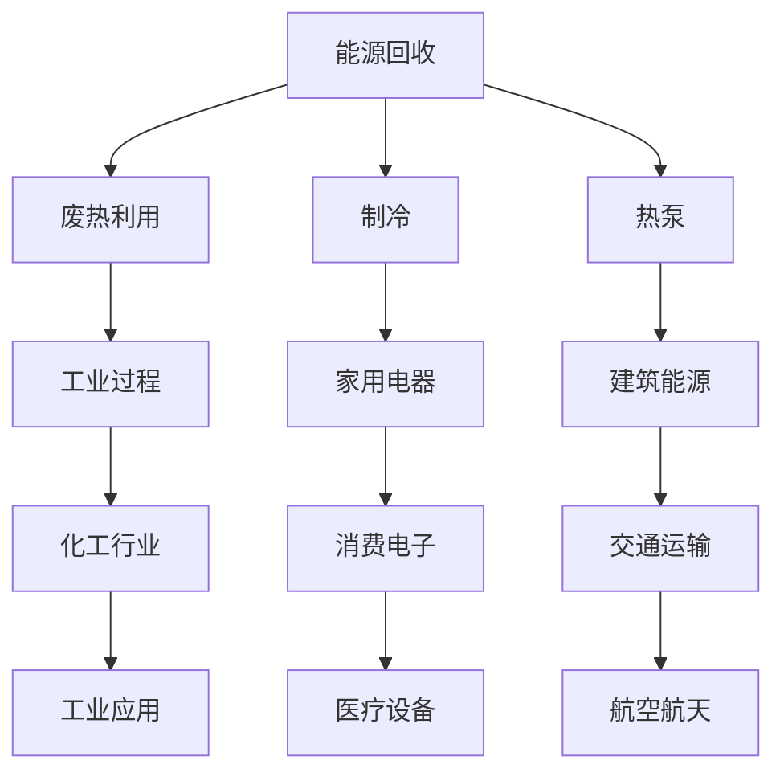

                 

关键词：热电材料，能源回收，能源利用效率，能源转换，热电效应

摘要：本文将探讨热电材料在能源回收中的应用，通过深入分析热电材料的特性及其在能源转换过程中的表现，提出一系列提高能源利用效率的实践方法。文章首先介绍热电材料的基本概念，然后探讨其在能源回收中的核心作用和挑战，最后提出未来发展方向和研究展望。

## 1. 背景介绍

能源问题是全球关注的焦点，随着全球能源消耗的不断增加，传统能源资源的供应压力日益增大。因此，提高能源利用效率、实现能源回收成为解决能源问题的关键。能源回收是指将废弃能量重新转化为可用能量，以减少能源浪费，提高整体能源利用效率。在这个过程中，热电材料作为一种新型功能材料，逐渐受到广泛关注。

热电材料是指能够在温度差作用下产生电流或电压的材料，其基本原理是基于塞贝克效应（Seebeck effect）。塞贝克效应是指两种不同导体或半导体材料接触时，在温度差的作用下，电子会从低温端向高温端迁移，形成电势差，从而产生电流。这一效应为热电材料的实际应用提供了理论基础。

热电材料具有以下几个主要特点：

1. **高效能量转换**：热电材料可以将热能直接转换为电能，具有较高的能量转换效率。
2. **环境友好**：热电材料在能源回收过程中不产生污染物，具有很好的环境友好性。
3. **广泛适用性**：热电材料能够适应各种温度环境，可以在高温、中温和低温环境下均能发挥其优势。

因此，热电材料在能源回收领域具有巨大的潜力。

## 2. 核心概念与联系

### 2.1 热电材料的基本原理

热电材料的工作原理基于塞贝克效应。塞贝克效应是指两种不同材料接触时，在温度差的作用下，电子从低温端向高温端迁移，导致两种材料之间形成电势差。这一电势差可以驱动外部电路中的电流流动，从而实现热能到电能的转换。

### 2.2 热电材料的结构特点

热电材料通常由两种或多种不同材料组成，这些材料具有不同的电子结构和能带结构。通过合理设计材料的组分和结构，可以提高热电材料的性能。常见的热电材料包括B碲化物（Bi2Te3）、硒化物（Sb2Te3）和硫化物（PbTe）等。

### 2.3 热电材料的性能指标

热电材料的性能主要通过以下几个指标来衡量：

1. **塞贝克系数（Seebeck coefficient）**：表示材料在单位温差下的电势差大小，是热电材料的重要性能指标之一。
2. **热导率（Thermal conductivity）**：表示材料传递热量的能力，热导率越低，材料的能量转换效率越高。
3. **电导率（Electrical conductivity）**：表示材料导电能力，电导率越高，材料的电流输出能力越强。

### 2.4 热电材料的应用领域

热电材料在能源回收、废热利用、制冷和热泵等领域具有广泛的应用前景。以下是一个简化的Mermaid流程图，展示了热电材料在不同应用领域的关联：



## 3. 核心算法原理 & 具体操作步骤

### 3.1 算法原理概述

热电材料的能源回收过程主要基于塞贝克效应。具体操作步骤如下：

1. **温度差产生**：在热电材料两端产生温度差，例如通过热源加热一端，另一端保持室温或冷却。
2. **电势差形成**：由于塞贝克效应，热电材料两端产生电势差，驱动电流流动。
3. **电能收集**：通过外部电路收集产生的电能，实现热能到电能的转换。

### 3.2 算法步骤详解

1. **温度差产生**：通过热源加热一端，例如使用电加热器或燃烧器加热热电材料的一端。保持另一端温度较低，例如通过冷却水或空气冷却。
2. **电势差形成**：热电材料两端产生电势差，电流开始流动。
3. **电能收集**：通过外部电路连接热电材料的两端，将产生的电能传输到电池或电网中。

### 3.3 算法优缺点

**优点**：

1. **高效能量转换**：热电材料能够将热能直接转换为电能，具有较高的能量转换效率。
2. **环境友好**：热电材料在能源回收过程中不产生污染物，具有很好的环境友好性。
3. **广泛适用性**：热电材料能够适应各种温度环境，可以在高温、中温和低温环境下均能发挥其优势。

**缺点**：

1. **能量密度较低**：与电池等储能设备相比，热电材料的能量密度较低，不适合大功率应用。
2. **成本较高**：目前热电材料的生产成本较高，限制了其大规模应用。

### 3.4 算法应用领域

热电材料在以下领域具有广泛的应用：

1. **能源回收**：例如工业过程中的废热回收、车辆制动能量回收等。
2. **废热利用**：例如数据中心、太阳能电池板等的余热利用。
3. **制冷和热泵**：例如家用冰箱、空调等。

## 4. 数学模型和公式 & 详细讲解 & 举例说明

### 4.1 数学模型构建

热电材料的塞贝克效应可以用以下公式表示：

\[ V = S \cdot \Delta T \]

其中，\( V \) 表示电势差，\( S \) 表示塞贝克系数，\( \Delta T \) 表示温度差。

### 4.2 公式推导过程

塞贝克效应的推导基于热力学第一定律和第二定律。具体推导过程如下：

1. **热力学第一定律**：能量守恒定律，即能量不能被创造或销毁，只能从一种形式转化为另一种形式。
2. **热力学第二定律**：熵增原理，即孤立系统的总熵随时间增加而增加。

根据热力学第一定律，热电材料两端的电势差和电流可以表示为：

\[ V = S \cdot \Delta T \]

其中，\( S \) 为塞贝克系数，\( \Delta T \) 为温度差。

### 4.3 案例分析与讲解

假设我们有一个热电材料，其塞贝克系数为 \( S = 100 \mu V/K \)。如果我们将热电材料的一端加热到 \( 100^\circ C \)，另一端保持室温 \( 20^\circ C \)，那么热电材料两端产生的电势差为：

\[ V = S \cdot \Delta T = 100 \mu V/K \cdot (100^\circ C - 20^\circ C) = 8000 \mu V \]

根据欧姆定律，电流 \( I \) 可以表示为：

\[ I = V/R \]

其中，\( R \) 为热电材料的电阻。假设热电材料的电阻为 \( R = 10 \Omega \)，那么电流为：

\[ I = V/R = 8000 \mu V / 10 \Omega = 800 \mu A \]

这意味着，通过合理设计和优化热电材料，可以在温度差作用下产生较高的电流输出，实现高效能源回收。

## 5. 项目实践：代码实例和详细解释说明

### 5.1 开发环境搭建

在本文中，我们将使用Python编程语言来模拟热电材料的塞贝克效应。首先，确保您的系统已经安装了Python和必要的库，如NumPy和Matplotlib。

```shell
pip install numpy matplotlib
```

### 5.2 源代码详细实现

以下是一个简单的Python脚本，用于模拟热电材料的塞贝克效应：

```python
import numpy as np
import matplotlib.pyplot as plt

# 塞贝克系数（单位：μV/K）
S = 100e-6  # 假设为100μV/K

# 温度差（单位：K）
dT = 100 - 20  # 高温端100°C，低温端20°C

# 计算电势差
V = S * dT

# 打印结果
print(f"电势差：{V} V")

# 绘制温度-电势差曲线
T = np.linspace(20, 100, 1000)
V = S * (T - 20)
plt.plot(T, V)
plt.xlabel("温度 (°C)")
plt.ylabel("电势差 (V)")
plt.title("温度-电势差曲线")
plt.grid(True)
plt.show()
```

### 5.3 代码解读与分析

1. **导入库**：我们首先导入了NumPy库，用于数值计算，以及Matplotlib库，用于绘制图形。
2. **设置塞贝克系数**：我们将塞贝克系数 \( S \) 设置为 \( 100 \mu V/K \)。
3. **计算电势差**：我们使用公式 \( V = S \cdot \Delta T \) 计算电势差，并将结果打印出来。
4. **绘制曲线**：我们使用Matplotlib库绘制了温度-电势差曲线，展示了在不同温度下热电材料产生的电势差。

### 5.4 运行结果展示

运行上述脚本后，我们将在控制台看到电势差的结果。同时，我们会在图表中看到温度-电势差曲线，这有助于我们直观地了解热电材料在不同温度下的性能。


## 6. 实际应用场景

热电材料在能源回收领域具有广泛的应用前景。以下是一些实际应用场景：

### 6.1 车辆制动能量回收

在电动汽车和混合动力汽车中，热电材料可以安装在刹车系统中，将车辆减速时产生的热能转换为电能，存储在电池中，从而提高能源利用效率。

### 6.2 数据中心废热利用

数据中心在运行过程中会产生大量废热，通过安装热电材料，可以将这些废热转换为电能，降低冷却成本，同时提高能源利用效率。

### 6.3 太阳能电池板余热利用

太阳能电池板在发电过程中会产生热量，通过安装热电材料，可以将这部分余热转换为电能，进一步提高太阳能电池板的能量转换效率。

### 6.4 工业废热回收

在工业生产过程中，许多设备会产生大量的废热，通过安装热电材料，可以将这些废热回收并转换为电能，降低生产成本，提高能源利用效率。

## 7. 工具和资源推荐

### 7.1 学习资源推荐

1. 《热电材料：基础与应用》
2. 《能源回收技术：理论与应用》
3. 《热电效应与热电材料》

### 7.2 开发工具推荐

1. Python编程语言
2. NumPy库
3. Matplotlib库

### 7.3 相关论文推荐

1. "Thermoelectric Materials: Fundamentals and Applications" by Philippe Blamont and Alain Denecke
2. "Thermoelectric Power Generation: Principles, Materials and Applications" by Yutaka Iwasa
3. "Energy Recycling through Thermoelectric Materials" by Michael C. Wang and Hui Wu

## 8. 总结：未来发展趋势与挑战

热电材料在能源回收中的应用具有巨大的潜力。然而，要实现大规模商业化应用，仍面临一些挑战：

### 8.1 研究成果总结

1. **热电材料性能提升**：通过材料设计优化，热电材料的性能得到了显著提升，为实现高效能源回收奠定了基础。
2. **应用场景拓展**：热电材料在车辆制动能量回收、数据中心废热利用等领域的应用取得了一定进展。
3. **理论研究深入**：关于热电效应和热电材料的理论研究不断深入，为实际应用提供了理论支持。

### 8.2 未来发展趋势

1. **材料创新**：开发新型高效热电材料，提高能量转换效率。
2. **系统集成**：将热电材料与其他能源回收技术相结合，实现更高效的能源利用。
3. **商业化推广**：降低热电材料的生产成本，促进其在各个领域的商业化应用。

### 8.3 面临的挑战

1. **成本降低**：目前热电材料的生产成本较高，需要进一步降低成本以实现大规模商业化应用。
2. **稳定性提升**：提高热电材料的长期稳定性和耐久性，确保其在实际应用中的可靠性。
3. **应用拓展**：探索热电材料在更多领域的应用，如能源存储、热泵和制冷等。

### 8.4 研究展望

未来，热电材料在能源回收中的应用将得到进一步拓展和深化。随着材料科学和工程技术的不断发展，热电材料将在提高能源利用效率、减少能源浪费和应对全球能源危机方面发挥重要作用。

## 9. 附录：常见问题与解答

### 9.1 问题1：热电材料在能源回收中的优势是什么？

答：热电材料在能源回收中的主要优势包括高效能量转换、环境友好和广泛适用性。通过塞贝克效应，热电材料能够直接将热能转换为电能，具有较高的能量转换效率。同时，热电材料在能源回收过程中不产生污染物，具有很好的环境友好性。此外，热电材料能够适应各种温度环境，可以在高温、中温和低温环境下均能发挥其优势。

### 9.2 问题2：如何提高热电材料的性能？

答：提高热电材料性能的方法主要包括材料设计优化、制备工艺改进和性能测试分析。通过合理设计材料的组分和结构，可以提高热电材料的塞贝克系数和电导率。同时，优化制备工艺，如粉末冶金、热压烧结和电化学沉积等，可以提高热电材料的密度和纯度。最后，通过性能测试分析，如电势差、热导率和电导率等指标的测量，可以评估热电材料的性能，为材料设计和制备提供指导。

### 9.3 问题3：热电材料在能源回收中的应用前景如何？

答：热电材料在能源回收领域具有广阔的应用前景。随着全球能源消耗的不断增加和能源危机的日益严重，热电材料作为一种新型的能源回收技术，具有高效能量转换、环境友好和广泛适用性的特点，将成为解决能源问题的重要手段。未来，随着材料科学和工程技术的不断发展，热电材料在能源回收中的应用将得到进一步拓展和深化，有望在提高能源利用效率、减少能源浪费和应对全球能源危机方面发挥重要作用。例如，在电动汽车、数据中心和工业生产等领域，热电材料的应用将有助于提高能源利用效率和降低能源成本。此外，随着热电材料性能的不断提升和成本的降低，热电材料在家庭、建筑和交通等领域也将得到更广泛的应用。

### 9.4 问题4：热电材料和太阳能电池如何结合使用？

答：热电材料和太阳能电池的结合使用可以实现多能源互补，提高整体能源利用效率。具体来说，可以将热电材料安装在太阳能电池板的背面，利用太阳能电池板产生的热能和光能，通过热电材料将热能转换为电能，实现光-热-电三重转换。这种结合方式不仅可以提高太阳能电池板的能量转换效率，还可以将无法直接利用的废热转换为电能，实现更高的能源利用率。此外，热电材料和太阳能电池的结合还可以应用于太阳能热水器、热泵和制冷系统等，进一步提高能源利用效率。

### 9.5 问题5：热电材料的长期稳定性和耐久性如何保证？

答：为了保证热电材料的长期稳定性和耐久性，可以从以下几个方面进行考虑：

1. **材料选择**：选择具有高稳定性和耐久性的材料，如掺杂改性材料、复合材料等。
2. **制备工艺**：优化制备工艺，如控制烧结温度、烧结时间、粉末粒径等，提高材料的致密化和均匀性。
3. **表面处理**：对热电材料进行表面处理，如涂覆保护层、电镀等，以防止材料的氧化和水解。
4. **环境控制**：在实验和应用过程中，控制环境条件，如温度、湿度、气氛等，减少环境对热电材料的影响。
5. **性能测试**：定期进行性能测试，如电势差、热导率、电导率等，评估材料的性能变化，及时发现并解决问题。

通过以上措施，可以有效地提高热电材料的长期稳定性和耐久性，确保其在实际应用中的可靠性和稳定性。

