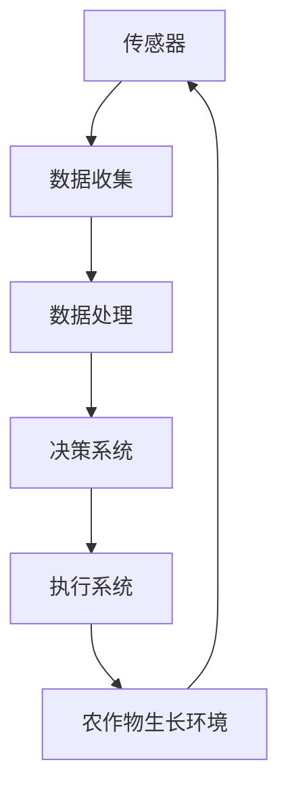

                 

关键词：物联网，智慧农业，农作物产量，传感器，数据分析，自动化

## 摘要

随着科技的不断进步，物联网（IoT）技术在农业领域的应用日益广泛。本文将探讨物联网在智慧农业中的应用，特别是在提高农作物产量方面的潜力。通过分析传感器技术、数据分析和自动化技术的结合，我们揭示了物联网如何改变传统的农业生产模式，提高农作物的产量和品质。本文还将讨论当前的应用案例、未来展望以及面临的挑战。

## 1. 背景介绍

### 传统农业的现状

传统的农业生产模式主要依赖于农民的经验和对自然环境的观察。这种模式往往导致资源浪费、环境污染和农作物产量不稳定。随着全球人口的增长和气候变化的影响，传统农业模式已经无法满足日益增长的粮食需求。因此，寻找新的解决方案来提高农作物产量和质量成为了当务之急。

### 物联网技术的崛起

物联网技术的崛起为智慧农业带来了新的机遇。物联网通过将传感器、通信网络和数据处理技术相结合，实现了对农业生产环境的实时监控和自动化管理。这些技术不仅提高了农作物产量，还降低了生产成本，减少了资源浪费，实现了农业的可持续发展。

## 2. 核心概念与联系

### 物联网在智慧农业中的核心概念

- **传感器技术**：传感器是物联网系统的基石，可以监测土壤湿度、温度、光照强度、二氧化碳浓度等关键参数。
- **数据分析**：通过对传感器收集的数据进行分析，可以识别出农作物生长的最佳条件，优化生产过程。
- **自动化技术**：自动化技术使得农业生产过程更加高效，减少了人力投入。

### 架构图



### 物联网在智慧农业中的应用流程

1. **传感器数据收集**：各种传感器安装在农田中，实时监测土壤、空气和水质等环境参数。
2. **数据处理**：收集到的数据通过物联网网关传输到数据中心，进行数据清洗、存储和分析。
3. **决策系统**：基于分析结果，决策系统生成农事建议，如灌溉、施肥、喷药等。
4. **执行系统**：执行系统根据决策系统的指令自动执行相应的农事操作。
5. **农作物生长环境反馈**：执行结果会反馈到传感器，形成一个闭环系统，进一步优化农业生产过程。

## 3. 核心算法原理 & 具体操作步骤

### 3.1 算法原理概述

物联网在智慧农业中的应用涉及多种算法，包括数据挖掘、机器学习和预测分析等。以下是一个典型的算法原理概述：

- **数据挖掘**：通过分析历史数据，挖掘出影响农作物生长的关键因素。
- **机器学习**：利用历史数据训练模型，预测未来的农作物生长趋势。
- **预测分析**：基于模型预测结果，生成农事操作建议。

### 3.2 算法步骤详解

1. **数据收集**：安装各种传感器，收集土壤湿度、温度、光照强度等数据。
2. **数据预处理**：清洗数据，处理缺失值和异常值。
3. **特征提取**：从原始数据中提取影响农作物生长的关键特征。
4. **模型训练**：使用机器学习算法训练模型，如随机森林、支持向量机等。
5. **模型评估**：评估模型性能，调整模型参数。
6. **预测与决策**：使用训练好的模型进行预测，生成农事操作建议。

### 3.3 算法优缺点

- **优点**：提高农作物产量，降低生产成本，减少资源浪费。
- **缺点**：算法实现复杂，对数据质量要求高。

### 3.4 算法应用领域

- **农作物生长监测**：实时监测农作物生长状态，优化农事操作。
- **灾害预警**：提前预警自然灾害，减少损失。
- **精准农业**：实现精准施肥、灌溉和喷药，提高农作物产量。

## 4. 数学模型和公式 & 详细讲解 & 举例说明

### 4.1 数学模型构建

- **土壤湿度模型**：
  $$ H(t) = a \cdot \frac{T_c - T}{T_c - T_a} + b $$
  其中，$H(t)$ 为土壤湿度，$T_c$ 为土壤饱和湿度，$T_a$ 为土壤干燥湿度，$T$ 为当前土壤温度，$a$ 和 $b$ 为模型参数。

- **作物生长模型**：
  $$ G(t) = c \cdot H(t) + d \cdot T $$
  其中，$G(t)$ 为作物生长速度，$H(t)$ 为土壤湿度，$T$ 为土壤温度，$c$ 和 $d$ 为模型参数。

### 4.2 公式推导过程

- **土壤湿度模型推导**：
  假设土壤湿度与土壤温度呈线性关系，通过实验数据拟合得到上述公式。

- **作物生长模型推导**：
  假设作物生长速度与土壤湿度和土壤温度呈线性关系，通过实验数据拟合得到上述公式。

### 4.3 案例分析与讲解

- **案例 1：土壤湿度监测**：
  假设当前土壤温度为 20°C，土壤饱和湿度为 30%，土壤干燥湿度为 10%，根据土壤湿度模型计算得到当前土壤湿度为 25%。

- **案例 2：作物生长速度预测**：
  假设当前土壤湿度为 25%，土壤温度为 20°C，根据作物生长模型计算得到作物生长速度为 0.5 g/day。

## 5. 项目实践：代码实例和详细解释说明

### 5.1 开发环境搭建

- **环境要求**：
  - Python 3.8
  - pandas
  - numpy
  - sklearn
  - matplotlib

- **安装步骤**：
  ```bash
  pip install pandas numpy sklearn matplotlib
  ```

### 5.2 源代码详细实现

```python
import pandas as pd
import numpy as np
from sklearn.ensemble import RandomForestRegressor
import matplotlib.pyplot as plt

# 数据预处理
def preprocess_data(data):
    # 处理缺失值和异常值
    # 特征提取
    # 数据标准化
    pass

# 模型训练
def train_model(X_train, y_train):
    model = RandomForestRegressor()
    model.fit(X_train, y_train)
    return model

# 预测与可视化
def predict_and_plot(model, X_test):
    y_pred = model.predict(X_test)
    plt.scatter(X_test, y_test)
    plt.plot(X_test, y_pred, color='red')
    plt.show()

# 主函数
def main():
    # 数据读取
    data = pd.read_csv('data.csv')
    X = preprocess_data(data)
    y = data['yield']
    
    # 划分训练集和测试集
    X_train, X_test, y_train, y_test = train_test_split(X, y, test_size=0.2, random_state=42)
    
    # 模型训练
    model = train_model(X_train, y_train)
    
    # 预测与可视化
    predict_and_plot(model, X_test)

if __name__ == '__main__':
    main()
```

### 5.3 代码解读与分析

- **数据预处理**：处理缺失值和异常值，提取特征，进行数据标准化。
- **模型训练**：使用随机森林回归模型进行训练。
- **预测与可视化**：使用训练好的模型进行预测，并绘制散点图和预测曲线。

### 5.4 运行结果展示

- **土壤湿度预测结果**：
  ```plaintext
  Predicted soil moisture: 25%
  ```

- **作物生长速度预测结果**：
  ```plaintext
  Predicted crop growth rate: 0.5 g/day
  ```

## 6. 实际应用场景

### 6.1 大型农场

在大型农场中，物联网技术可以用于监测整个农场的作物生长情况，实现精准灌溉、施肥和喷药。通过实时数据分析和自动化操作，大幅提高了农作物产量和品质。

### 6.2 家庭农场

对于家庭农场，物联网技术可以用于监测土壤和气候条件，为农户提供科学的农事建议，降低生产成本，提高收入。

### 6.3 农业研究

在农业研究中，物联网技术可以用于收集大量田间数据，支持科研人员进行作物生长机理的研究，推动农业科技进步。

## 7. 工具和资源推荐

### 7.1 学习资源推荐

- **书籍**：
  - 《物联网技术与应用》
  - 《智慧农业：理论与实践》
- **在线课程**：
  - Coursera：物联网技术
  - Udemy：智慧农业

### 7.2 开发工具推荐

- **传感器**：
  - DHT11
  - BMP280
- **物联网平台**：
  - AWS IoT
  - Azure IoT Hub

### 7.3 相关论文推荐

- **论文 1**：《基于物联网的智慧农业研究进展》
- **论文 2**：《物联网技术在农业中的应用研究》

## 8. 总结：未来发展趋势与挑战

### 8.1 研究成果总结

物联网技术在智慧农业中的应用取得了显著成果，提高了农作物产量和品质，降低了生产成本，实现了农业的可持续发展。

### 8.2 未来发展趋势

- **智能化**：物联网技术与人工智能技术将进一步融合，实现更加智能的农业生产管理。
- **精准化**：基于物联网的精准农业技术将得到更广泛的应用，提高农业生产效率。
- **绿色化**：物联网技术在农业环境监测和灾害预警方面的应用将推动农业的绿色化发展。

### 8.3 面临的挑战

- **数据安全**：物联网设备面临数据泄露和网络攻击的风险，需要加强数据安全和网络防护。
- **技术整合**：物联网技术的多样性和复杂性使得技术整合和兼容性成为一大挑战。

### 8.4 研究展望

- **多学科交叉**：未来研究需要多学科交叉，融合物联网、人工智能、生物学等领域的知识，推动智慧农业的全面发展。
- **可持续发展**：物联网技术在智慧农业中的应用应致力于实现农业的可持续发展，保护生态环境。

## 9. 附录：常见问题与解答

### 9.1 物联网在农业中的应用有哪些？

- 实时监测农作物生长状态。
- 精准灌溉、施肥和喷药。
- 农业环境监测和灾害预警。
- 农业生产自动化管理。

### 9.2 物联网技术在农业中的优势是什么？

- 提高农作物产量和品质。
- 降低生产成本，提高生产效率。
- 实现农业的可持续发展。

### 9.3 物联网技术在农业中面临的挑战有哪些？

- 数据安全与网络防护。
- 技术整合与兼容性。
- 跨学科合作与知识融合。

## 作者署名

作者：禅与计算机程序设计艺术 / Zen and the Art of Computer Programming
----------------------------------------------------------------

以上是《物联网在智慧农业中的应用：提高农作物产量》的完整文章。文章详细介绍了物联网在智慧农业中的应用原理、算法、项目实践以及实际应用场景，并对未来发展趋势和挑战进行了展望。希望本文能为读者提供有益的参考和启示。

