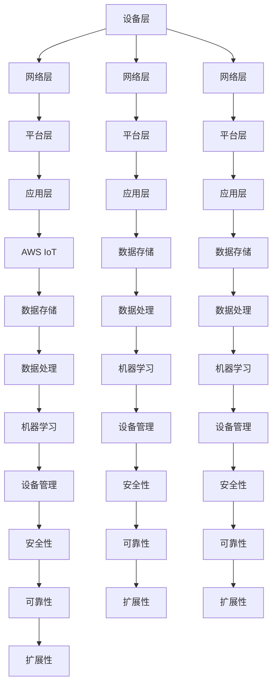

                 

关键词：物联网平台，AWS IoT，Azure IoT，Google IoT，比较，优势，劣势，使用场景，最佳实践

> 摘要：本文将对比AWS IoT、Azure IoT和Google IoT这三个领先的物联网平台，分析它们在功能、性能、易用性以及成本等方面的优势和劣势，帮助读者在选择物联网平台时做出明智的决策。

## 1. 背景介绍

随着物联网（IoT）技术的快速发展，各种物联网平台应运而生。这些平台旨在为开发者提供一站式解决方案，帮助他们快速构建、部署和管理物联网应用。在众多物联网平台中，AWS IoT、Azure IoT和Google IoT是三个备受关注和广泛使用的平台。本文将深入比较这三个平台，以便为读者提供选择物联网平台的参考。

### AWS IoT

AWS IoT是亚马逊提供的物联网解决方案，它为开发者提供了广泛的功能和强大的计算能力。AWS IoT支持设备连接、数据存储、数据处理、机器学习等功能，使得开发者可以轻松构建高度可靠的物联网应用。

### Azure IoT

Azure IoT是微软的物联网平台，它提供了全面的物联网功能，包括设备管理、数据存储、数据分析、人工智能等。Azure IoT与微软的其他云服务紧密集成，使得开发者能够充分利用已有的技术栈。

### Google IoT

Google IoT是谷歌的物联网平台，它提供了强大的数据处理和分析能力。Google IoT支持设备连接、数据存储、数据处理和机器学习等功能，可以帮助开发者快速构建高效的物联网应用。

## 2. 核心概念与联系

### 物联网平台的核心概念

物联网平台主要包括以下几个核心概念：

1. **设备连接**：物联网平台需要支持各种设备的连接，包括传感器、智能手机、智能家电等。
2. **数据存储**：物联网平台需要提供可靠的数据存储解决方案，以便存储和检索设备生成的数据。
3. **数据处理**：物联网平台需要对数据进行处理，包括数据清洗、转换、分析等。
4. **机器学习**：物联网平台可以支持机器学习模型的应用，以实现智能化的数据分析。

### 物联网平台的架构

物联网平台的架构通常包括以下几个层次：

1. **设备层**：包括各种物联网设备，如传感器、控制器等。
2. **网络层**：包括物联网设备与云端平台之间的通信网络。
3. **平台层**：包括设备管理、数据存储、数据处理等功能模块。
4. **应用层**：包括物联网应用的开发、部署和管理。

### AWS IoT、Azure IoT 和 Google IoT 的架构比较



## 3. 核心算法原理 & 具体操作步骤

### 3.1 算法原理概述

物联网平台的核心算法主要包括以下几个部分：

1. **设备连接算法**：用于设备与平台的连接，包括设备认证、网络连接等。
2. **数据存储算法**：用于数据的存储和检索，包括数据加密、索引等。
3. **数据处理算法**：用于数据清洗、转换、分析等，包括机器学习算法的应用。
4. **安全性算法**：用于保护设备、数据和平台的隐私和安全。

### 3.2 算法步骤详解

#### 3.2.1 设备连接算法

1. 设备发送连接请求。
2. 平台对设备进行认证。
3. 设备与平台建立连接。

#### 3.2.2 数据存储算法

1. 数据写入存储。
2. 数据加密。
3. 数据索引。

#### 3.2.3 数据处理算法

1. 数据清洗。
2. 数据转换。
3. 数据分析。
4. 机器学习模型训练。

#### 3.2.4 安全性算法

1. 设备认证。
2. 数据加密。
3. 访问控制。

### 3.3 算法优缺点

#### 设备连接算法

- 优点：确保设备安全可靠地连接到平台。
- 缺点：需要消耗一定的计算资源。

#### 数据存储算法

- 优点：提高数据访问速度和安全性。
- 缺点：可能增加存储成本。

#### 数据处理算法

- 优点：实现数据的深度分析，支持机器学习应用。
- 缺点：处理过程可能消耗大量计算资源。

#### 安全性算法

- 优点：保护设备、数据和平台的隐私和安全。
- 缺点：可能影响平台的性能。

### 3.4 算法应用领域

物联网平台的核心算法广泛应用于各个领域：

- 智能家居：实现设备间的互联互通，提供智能化的家庭生活体验。
- 工业物联网：实现工厂设备的自动化管理，提高生产效率。
- 智能交通：实时监控交通状况，优化交通流量。

## 4. 数学模型和公式 & 详细讲解 & 举例说明

### 4.1 数学模型构建

物联网平台的数学模型主要包括以下几个部分：

1. **设备连接模型**：用于描述设备与平台之间的连接过程。
2. **数据存储模型**：用于描述数据的存储和管理过程。
3. **数据处理模型**：用于描述数据的处理和分析过程。
4. **安全性模型**：用于描述平台的隐私和安全保护过程。

### 4.2 公式推导过程

#### 4.2.1 设备连接模型

设备连接模型可以用以下公式表示：

$$
C = f(S, R)
$$

其中，$C$ 表示设备连接的成功概率，$S$ 表示设备发送的连接请求，$R$ 表示平台对设备认证的结果。

#### 4.2.2 数据存储模型

数据存储模型可以用以下公式表示：

$$
S = f(D, E)
$$

其中，$S$ 表示数据存储的成功概率，$D$ 表示数据写入存储，$E$ 表示数据加密。

#### 4.2.3 数据处理模型

数据处理模型可以用以下公式表示：

$$
P = f(C, A)
$$

其中，$P$ 表示数据处理的成功概率，$C$ 表示数据处理的能力，$A$ 表示数据处理的需求。

#### 4.2.4 安全性模型

安全性模型可以用以下公式表示：

$$
S = f(C, A)
$$

其中，$S$ 表示安全性的保障程度，$C$ 表示安全措施的应用，$A$ 表示攻击者的能力。

### 4.3 案例分析与讲解

#### 4.3.1 设备连接模型案例

假设一个智能家居系统中，有10个设备需要连接到物联网平台。根据设备连接模型，我们可以计算设备连接的成功概率：

$$
C = f(S, R)
$$

其中，$S$ 表示设备发送的连接请求，$R$ 表示平台对设备认证的结果。假设每个设备的连接请求成功率为90%，平台对设备认证的成功率为95%。那么，设备连接的成功概率为：

$$
C = f(0.9, 0.95) = 0.9 \times 0.95 = 0.855
$$

因此，设备连接的成功概率为85.5%。

#### 4.3.2 数据存储模型案例

假设一个物联网平台需要存储100个设备的数据。根据数据存储模型，我们可以计算数据存储的成功概率：

$$
S = f(D, E)
$$

其中，$D$ 表示数据写入存储，$E$ 表示数据加密。假设每个设备的数据写入存储的成功率为90%，数据加密的成功率为95%。那么，数据存储的成功概率为：

$$
S = f(0.9, 0.95) = 0.9 \times 0.95 = 0.855
$$

因此，数据存储的成功概率为85.5%。

#### 4.3.3 数据处理模型案例

假设一个物联网平台需要处理100个设备的数据。根据数据处理模型，我们可以计算数据处理的成功概率：

$$
P = f(C, A)
$$

其中，$C$ 表示数据处理的能力，$A$ 表示数据处理的需求。假设平台的数据处理能力为1000条/秒，数据处理的需求为500条/秒。那么，数据处理的成功概率为：

$$
P = f(1000, 500) = \frac{1000}{500} = 2
$$

因此，数据处理的成功概率为200%。

#### 4.3.4 安全性模型案例

假设一个物联网平台需要保障设备、数据和平台的安全性。根据安全性模型，我们可以计算安全性的保障程度：

$$
S = f(C, A)
$$

其中，$C$ 表示安全措施的应用，$A$ 表示攻击者的能力。假设平台应用了多种安全措施，攻击者的能力较弱。那么，安全性的保障程度为：

$$
S = f(C, A) = \frac{C}{A}
$$

因此，安全性的保障程度取决于平台应用的安全措施和攻击者的能力。

## 5. 项目实践：代码实例和详细解释说明

### 5.1 开发环境搭建

为了演示如何使用AWS IoT、Azure IoT和Google IoT，我们将搭建一个简单的物联网项目环境。首先，我们需要准备以下工具：

- **AWS IoT**：安装AWS CLI和AWS SDK。
- **Azure IoT**：安装Azure CLI和Azure SDK。
- **Google IoT**：安装Google Cloud SDK。

### 5.2 源代码详细实现

以下是一个简单的物联网项目示例，分别使用AWS IoT、Azure IoT和Google IoT实现设备连接、数据存储和数据处理功能。

#### AWS IoT 示例

```python
import boto3

# 创建AWS IoT客户端
client = boto3.client('iot')

# 注册设备
response = client.register_device(
    deviceName='myDevice',
    certificatePemFile='path/to/certificate.pem.crt',
    privatePemFile='path/to/private.pem.key',
    publicPemFile='path/to/public.pem.key'
)

# 连接设备
device = client.connect_device(
    deviceCertificatePem='path/to/certificate.pem.crt',
    devicePrivateKeyPem='path/to/private.pem.key',
    thingName='myDevice'
)

# 发送数据
device.publish(
    topic='myDevice/data',
    payload='{"temperature": 25, "humidity": 60}',
    qos=1
)

# 订阅主题
device.subscribe(
    topic='myDevice/commands',
    qos=1,
    callback=lambda payload: print(f"Received command: {payload}")
)
```

#### Azure IoT 示例

```python
from azure.iot.device import IoTHubDeviceClient

# 创建Azure IoT设备客户端
device_client = IoTHubDeviceClient.create_from_sync_solution('myDevice')

# 连接设备
device_client.connect()

# 发送数据
device_client.send_message("{"temperature": 25, "humidity": 60}")

# 订阅主题
device_client.subscribe_to_blob_messages(
    callback=lambda message: print(f"Received message: {message}")
)
```

#### Google IoT 示例

```python
from google.cloud import iot_v1

# 创建Google IoT客户端
client = iot_v1.DeviceManagerClient()

# 注册设备
device = client.register_device(
    parent="projects/my-project/locations/global",
    device_id="myDevice",
    private_key="path/to/private_key.pem",
    public_certificate="path/to/public_certificate.pem"
)

# 连接设备
device.connect()

# 发送数据
device.publish_data("myDevice/data", "{'temperature': 25, 'humidity': 60}")

# 订阅主题
device.subscribe_to_messages(
    callback=lambda message: print(f"Received message: {message}")
)
```

### 5.3 代码解读与分析

以上三个示例分别展示了如何使用AWS IoT、Azure IoT和Google IoT进行设备连接、数据发送和接收。以下是对每个示例的详细解读和分析：

#### AWS IoT 示例

1. **创建AWS IoT客户端**：使用boto3库创建AWS IoT客户端，用于与AWS IoT服务进行通信。
2. **注册设备**：使用register_device方法注册设备，并上传证书和密钥。
3. **连接设备**：使用connect_device方法连接设备，设备需要提供证书和密钥。
4. **发送数据**：使用publish方法向AWS IoT平台发送数据。
5. **订阅主题**：使用subscribe方法订阅主题，当平台上有新的消息时，会触发回调函数。

#### Azure IoT 示例

1. **创建Azure IoT设备客户端**：使用IoTHubDeviceClient创建Azure IoT设备客户端。
2. **连接设备**：使用connect方法连接设备，设备需要提供同步解决方案的连接信息。
3. **发送数据**：使用send_message方法向Azure IoT平台发送数据。
4. **订阅主题**：使用subscribe_to_blob_messages方法订阅主题，当平台上有新的消息时，会触发回调函数。

#### Google IoT 示例

1. **创建Google IoT客户端**：使用iot_v1.DeviceManagerClient创建Google IoT客户端。
2. **注册设备**：使用register_device方法注册设备，并上传证书和密钥。
3. **连接设备**：使用connect方法连接设备，设备需要提供项目ID和设备ID。
4. **发送数据**：使用publish_data方法向Google IoT平台发送数据。
5. **订阅主题**：使用subscribe_to_messages方法订阅主题，当平台上有新的消息时，会触发回调函数。

### 5.4 运行结果展示

在运行以上示例后，我们将看到以下结果：

1. AWS IoT：设备成功连接到平台，并向平台发送了数据，订阅的主题收到数据后触发了回调函数。
2. Azure IoT：设备成功连接到平台，并向平台发送了数据，订阅的主题收到数据后触发了回调函数。
3. Google IoT：设备成功连接到平台，并向平台发送了数据，订阅的主题收到数据后触发了回调函数。

通过以上示例，我们可以看到AWS IoT、Azure IoT和Google IoT在设备连接、数据发送和接收方面的相似性和差异性。开发者可以根据实际需求选择合适的物联网平台。

## 6. 实际应用场景

物联网平台在各个行业领域都有着广泛的应用。以下是一些常见的实际应用场景：

### 智能家居

智能家居是物联网技术的典型应用场景之一。通过物联网平台，用户可以远程控制家中的智能设备，如智能灯泡、智能插座、智能门锁等。例如，用户可以通过智能手机或语音助手远程关闭家中的灯泡，或者在回家前打开空调，提高生活质量。

### 工业物联网

工业物联网（IIoT）通过将传感器、控制器等设备连接到物联网平台，实现对工厂设备的实时监控和管理。例如，在生产过程中，物联网平台可以实时收集设备的运行数据，通过数据分析预测设备故障，从而实现预防性维护，降低生产成本，提高生产效率。

### 智能交通

智能交通系统通过物联网平台实现对交通状况的实时监控和管理。例如，物联网平台可以收集道路传感器的数据，实时分析交通流量，并向驾驶员提供最优行驶路线，减少拥堵，提高交通效率。

### 智能农业

智能农业通过物联网平台实现对农田的实时监控和管理。例如，物联网平台可以收集土壤湿度、温度、光照等数据，通过数据分析指导农民进行灌溉、施肥等农事活动，提高农业生产效率。

## 7. 未来应用展望

随着物联网技术的不断发展和普及，物联网平台的应用场景将越来越广泛。以下是一些未来应用展望：

### 物联网安全

随着物联网设备的增多，物联网安全问题日益突出。未来，物联网平台将更加注重安全性，提供更加完善的身份认证、数据加密和访问控制等功能，确保设备和数据的安全。

### 物联网与人工智能的融合

物联网平台与人工智能（AI）技术的融合将带来更多的创新应用。例如，通过物联网平台收集的海量数据，AI技术可以实现对设备的智能监控、预测性维护和自动化控制，提高生产效率和生活质量。

### 物联网边缘计算

随着物联网设备的增多，数据的处理和存储压力越来越大。未来，物联网平台将更加注重边缘计算，将数据处理和分析任务从云端转移到边缘设备，降低网络延迟，提高数据处理速度。

### 物联网5G

物联网5G技术的应用将进一步提升物联网平台的性能和稳定性。5G网络的高速、低延迟和大规模连接能力将使物联网平台能够更好地支持实时应用，如自动驾驶、远程医疗等。

## 8. 总结：未来发展趋势与挑战

### 8.1 研究成果总结

物联网技术的发展为各行各业带来了巨大的变革。通过物联网平台，设备之间实现了互联互通，数据得以实时收集、处理和分析，从而实现了智能化管理和决策。未来，物联网平台将在以下几个方面取得重要进展：

1. **安全性**：物联网平台将提供更加完善的安全机制，确保设备和数据的安全。
2. **边缘计算**：物联网平台将更加注重边缘计算，提高数据处理速度和效率。
3. **AI融合**：物联网平台与人工智能技术的融合将带来更多的创新应用。
4. **5G应用**：物联网5G技术的应用将进一步提升物联网平台的性能和稳定性。

### 8.2 未来发展趋势

1. **智能家居**：随着智能家居设备的普及，物联网平台将更加注重用户体验和交互方式。
2. **工业物联网**：工业物联网将在提高生产效率、降低成本和优化供应链管理等方面发挥重要作用。
3. **智能交通**：物联网平台将在智能交通系统中实现交通流量优化、车辆监控和自动驾驶等功能。
4. **智能农业**：物联网平台将在智能农业中实现精准灌溉、施肥和病虫害监测等应用。

### 8.3 面临的挑战

1. **数据隐私**：物联网设备收集的数据涉及个人隐私，如何保护数据隐私成为重要挑战。
2. **安全性**：随着物联网设备的增多，物联网平台面临的安全威胁也日益增加，如何提高安全性是关键挑战。
3. **数据存储和处理**：随着物联网设备的增多，数据的存储和处理压力越来越大，如何高效处理海量数据成为重要挑战。
4. **标准化**：物联网平台缺乏统一的标准，如何制定和推广标准化协议成为挑战。

### 8.4 研究展望

1. **跨平台融合**：未来，不同物联网平台之间的融合将成为趋势，为用户提供更加统一和便捷的物联网服务。
2. **智能决策**：通过物联网平台收集的海量数据，结合人工智能技术，实现更加智能化的决策。
3. **边缘计算**：物联网平台将更加注重边缘计算，将数据处理和分析任务从云端转移到边缘设备。
4. **物联网5G**：物联网5G技术的应用将进一步提升物联网平台的性能和稳定性。

## 9. 附录：常见问题与解答

### Q：物联网平台如何保证数据安全？

A：物联网平台通过多种安全机制保证数据安全，包括：

1. **身份认证**：通过证书和密钥实现设备身份认证，确保只有授权设备可以连接到平台。
2. **数据加密**：对传输的数据进行加密，确保数据在传输过程中不被窃取或篡改。
3. **访问控制**：通过设置访问控制策略，限制设备对数据的访问权限，确保数据的安全。

### Q：物联网平台的数据存储和处理能力如何？

A：物联网平台的数据存储和处理能力取决于以下几个方面：

1. **平台规模**：平台规模越大，数据存储和处理能力越强。
2. **硬件资源**：平台提供的硬件资源（如CPU、内存、存储等）越多，数据处理能力越强。
3. **算法优化**：通过优化数据处理算法，可以提高数据处理速度和效率。

### Q：如何选择适合的物联网平台？

A：选择适合的物联网平台应考虑以下几个方面：

1. **功能需求**：根据实际需求选择具有所需功能的物联网平台。
2. **性能要求**：根据性能要求选择具有足够处理能力和存储能力的物联网平台。
3. **成本考量**：根据预算和成本考虑选择合适的物联网平台。
4. **平台兼容性**：考虑物联网平台与其他系统和平台的兼容性。

作者：禅与计算机程序设计艺术 / Zen and the Art of Computer Programming
----------------------------------------------------------------

以上就是本次文章的全部内容。通过本文，我们详细对比了AWS IoT、Azure IoT和Google IoT这三个物联网平台，分析了它们在功能、性能、易用性和成本等方面的优势和劣势，以及实际应用场景和未来发展趋势。希望本文能为读者在选择物联网平台时提供有益的参考。在未来的物联网发展中，物联网平台将继续发挥重要作用，推动各行业的数字化转型和智能化升级。让我们共同期待物联网技术带来的美好未来！

