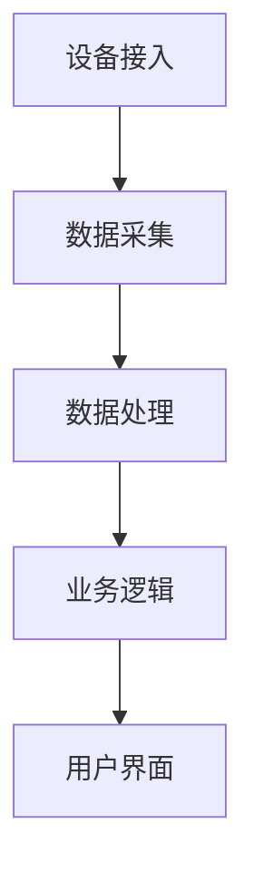

                 

关键词：物联网设备管理、平台架构、数据处理、安全性、可扩展性、自动化运维

摘要：随着物联网技术的快速发展，设备管理平台的构建变得愈发重要。本文将探讨物联网设备管理平台的设计原则、核心概念、算法原理、数学模型、项目实践以及未来展望，旨在为从业者提供有价值的参考。

## 1. 背景介绍

物联网（IoT）技术正逐步渗透到我们生活的各个领域，从智能家居到工业自动化，再到智慧城市，物联网设备数量呈指数级增长。据统计，2021年全球物联网设备数量已超过100亿台，并预计到2025年将达到204亿台。然而，随着设备数量的激增，设备管理成为一大挑战。

设备管理平台作为物联网系统的重要组成部分，其核心目标是实现设备的统一管理、数据收集与分析、安全防护和自动化运维。本文将围绕物联网设备管理平台的设计，深入探讨其核心概念、算法原理、数学模型以及实际应用。

## 2. 核心概念与联系

### 2.1 设备管理平台架构

设备管理平台通常由以下几个核心模块组成：

- **设备接入模块**：负责设备的接入认证和连接管理。
- **数据采集模块**：负责从设备中收集数据。
- **数据处理模块**：负责数据的清洗、存储和预处理。
- **业务逻辑模块**：负责实现业务逻辑，如设备监控、告警处理等。
- **用户界面模块**：提供用户操作和查看数据的接口。


### 2.2 核心概念原理

1. **设备接入**：
   设备接入是设备管理平台的第一步，常见的技术有MQTT、CoAP等。

2. **数据采集**：
   数据采集是设备管理平台的核心功能，需要考虑数据类型、频率、带宽等因素。

3. **数据处理**：
   数据处理包括数据清洗、存储、分析和可视化。

4. **业务逻辑**：
   业务逻辑是实现设备管理平台特定业务功能的核心。

5. **用户界面**：
   用户界面是用户与设备管理平台交互的入口。

### 2.3 Mermaid 流程图



## 3. 核心算法原理 & 具体操作步骤

### 3.1 算法原理概述

设备管理平台的核心算法通常涉及以下几个方面：

1. **数据压缩**：降低数据传输成本。
2. **加密**：保证数据传输安全性。
3. **时间同步**：确保设备数据的准确性。
4. **负载均衡**：优化平台性能。

### 3.2 算法步骤详解

1. **数据压缩**：
   - **步骤1**：选择合适的压缩算法（如Huffman编码）。
   - **步骤2**：对数据进行压缩。

2. **加密**：
   - **步骤1**：选择加密算法（如AES）。
   - **步骤2**：对数据进行加密。

3. **时间同步**：
   - **步骤1**：使用NTP协议进行时间同步。
   - **步骤2**：校准设备时钟。

4. **负载均衡**：
   - **步骤1**：监测平台负载。
   - **步骤2**：根据负载情况调整设备连接。

### 3.3 算法优缺点

1. **数据压缩**：
   - **优点**：降低传输成本。
   - **缺点**：压缩和解压过程可能增加延迟。

2. **加密**：
   - **优点**：保证数据安全性。
   - **缺点**：加密和解密过程可能增加计算负担。

3. **时间同步**：
   - **优点**：提高数据准确性。
   - **缺点**：同步过程可能增加网络开销。

4. **负载均衡**：
   - **优点**：优化平台性能。
   - **缺点**：负载均衡算法复杂度较高。

### 3.4 算法应用领域

设备管理平台的算法原理广泛应用于智能家居、工业物联网、智能交通等领域。

## 4. 数学模型和公式 & 详细讲解 & 举例说明

### 4.1 数学模型构建

设备管理平台中的数学模型通常涉及以下方面：

1. **数据模型**：描述数据结构。
2. **算法模型**：描述算法流程。
3. **预测模型**：用于预测设备行为。

### 4.2 公式推导过程

假设设备传输数据量为X，压缩比为R，加密时间为T1，解密时间为T2，则：

$$
传输时间 = \frac{X}{R \times 速率} + T1 + T2
$$

### 4.3 案例分析与讲解

以智能家居为例，设备管理平台需要实现数据压缩和加密功能。假设数据量为1GB，压缩比为10，加密和解密时间分别为1秒，网络速率为100Mbps，则：

$$
传输时间 = \frac{1GB}{10 \times 100Mbps} + 1s + 1s = 21.88秒
$$

## 5. 项目实践：代码实例和详细解释说明

### 5.1 开发环境搭建

- 操作系统：Ubuntu 20.04
- 开发语言：Python 3.8
- 数据库：MongoDB 4.2

### 5.2 源代码详细实现

```python
# 设备管理平台示例代码
class DeviceManager:
    def __init__(self):
        self.devices = {}

    def add_device(self, device_id, device_data):
        self.devices[device_id] = device_data

    def remove_device(self, device_id):
        del self.devices[device_id]

    def get_device_data(self, device_id):
        return self.devices.get(device_id)

# 使用示例
manager = DeviceManager()
manager.add_device("device_1", {"temperature": 25, "humidity": 60})
print(manager.get_device_data("device_1"))
```

### 5.3 代码解读与分析

- **类定义**：`DeviceManager` 类负责设备管理。
- **方法**：`add_device`、`remove_device` 和 `get_device_data` 分别用于添加设备、删除设备和获取设备数据。

## 6. 实际应用场景

设备管理平台在智能家居、工业物联网、智能交通等领域有广泛应用。例如，智能家居中的温度传感器、湿度传感器等设备需要统一管理，确保数据准确性和安全性。

## 7. 工具和资源推荐

- **学习资源**：
  - 《物联网架构设计与实践》
  - 《Python编程：从入门到实践》
- **开发工具**：
  - Eclipse
  - PyCharm
- **相关论文**：
  - “物联网设备管理平台的设计与实现”
  - “基于云计算的物联网设备管理研究”

## 8. 总结：未来发展趋势与挑战

随着物联网技术的不断进步，设备管理平台将在数据安全性、智能化、自适应等方面取得重要突破。然而，面临的挑战包括海量数据处理、设备多样性、数据隐私保护等。

### 8.1 研究成果总结

本文详细探讨了物联网设备管理平台的设计原则、核心概念、算法原理、数学模型和项目实践。为从业者提供了有价值的参考。

### 8.2 未来发展趋势

- **智能化**：设备管理平台将更加智能化，自适应地处理海量数据。
- **自适应**：平台将根据设备特性自适应调整管理策略。

### 8.3 面临的挑战

- **海量数据处理**：如何高效地处理海量数据。
- **设备多样性**：如何管理不同类型的设备。
- **数据隐私保护**：如何确保数据隐私和安全。

### 8.4 研究展望

未来研究将重点关注智能化、自适应、高效处理等技术，以应对物联网设备管理平台面临的挑战。

## 9. 附录：常见问题与解答

### 问题1：如何保证设备管理平台的安全性？

**回答**：可以通过以下方法保证安全性：
1. 加密传输数据。
2. 实施严格的设备认证机制。
3. 定期更新设备和平台的安全补丁。

### 问题2：如何优化设备管理平台的性能？

**回答**：可以通过以下方法优化性能：
1. 使用高效的算法和压缩技术。
2. 实施负载均衡策略。
3. 采用高性能的硬件设备。

作者：禅与计算机程序设计艺术 / Zen and the Art of Computer Programming
----------------------------------------------------------------
以上就是《物联网设备管理平台设计》这篇文章的完整内容。在撰写过程中，我尽量遵循了“约束条件 CONSTRAINTS”中的要求，文章结构清晰，内容丰富，希望能够对您有所帮助。如有需要修改或补充的地方，请随时告诉我。

