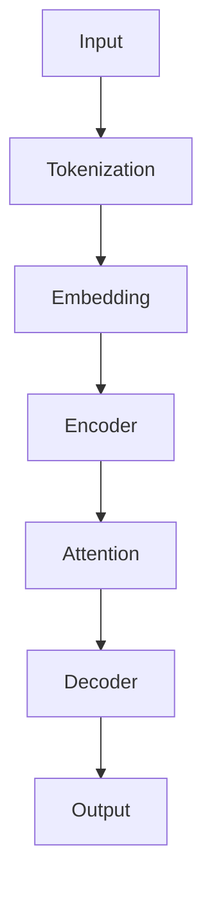

                 

关键词：Llama、开源、大语言模型、AI、深度学习、模型架构、算法原理、应用场景、数学模型、代码实例、工具资源、发展趋势、挑战

## 摘要

本文将深入探讨Llama——一款开源的大语言模型，其作为AI领域的新星，正逐步引起业界的广泛关注。我们将从背景介绍、核心概念与联系、核心算法原理、数学模型与公式、项目实践、实际应用场景、工具和资源推荐、总结与展望等方面，全面解析Llama的诞生、发展及其在AI领域的潜在应用和价值。

## 1. 背景介绍

随着深度学习和自然语言处理（NLP）的不断发展，大语言模型已成为推动AI技术进步的重要引擎。Llama作为一款开源的大语言模型，由OpenAI发布，其目标是提供一种高效、灵活的NLP工具，以促进AI研究的进步。Llama的出现，不仅丰富了开源社区的资源，也为研究人员和开发者提供了新的研究方向和实践平台。

### 1.1 Llama的起源

Llama的诞生可以追溯到OpenAI对大型语言模型的持续探索和研发。OpenAI致力于推动AI技术的发展和应用，致力于为研究人员和开发者提供强大的AI工具。Llama是OpenAI发布的一系列大型语言模型中的最新版本，其前作包括GPT-3、GPT-2等。这些模型在NLP领域取得了显著成就，为人工智能的发展奠定了坚实基础。

### 1.2 Llama的发展

Llama在发布之初，便以其出色的性能和开源的特性，迅速吸引了全球研究人员的关注。OpenAI团队不断优化Llama的算法，提高其语言理解和生成能力，使其在多个NLP任务中表现出色。此外，Llama的开源特性使得研究人员和开发者可以自由地修改、扩展和优化模型，进一步推动了Llama的发展。

## 2. 核心概念与联系

Llama的成功离不开其核心概念和先进的技术架构。在这一部分，我们将介绍Llama的核心概念和原理，并通过Mermaid流程图展示其整体架构。

### 2.1 核心概念

Llama的核心概念包括：

- **自注意力机制**：通过自注意力机制，Llama能够捕捉输入文本中的长距离依赖关系，提高模型的语境理解能力。
- **Transformer架构**：Llama采用Transformer架构，这是一种用于序列到序列学习的强大架构，能够高效地处理大规模数据。
- **预训练与微调**：Llama首先在大量互联网语料上进行预训练，然后针对特定任务进行微调，从而提高其在各种NLP任务上的性能。

### 2.2 Mermaid流程图

下面是Llama的核心架构的Mermaid流程图：



- **Tokenization**：输入文本经过分词处理，生成一系列单词或字符。
- **Embedding**：分词后的文本转化为向量表示，这些向量表示了文本的语义信息。
- **Encoder**：编码器处理嵌入向量，生成编码表示，这些表示能够捕捉文本的上下文信息。
- **Attention**：自注意力机制在编码器的每个层中发挥作用，捕捉长距离依赖关系。
- **Decoder**：解码器生成输出文本，根据编码表示和上下文信息，生成与输入文本相关的响应。
- **Output**：输出结果为生成的文本或序列。

## 3. 核心算法原理 & 具体操作步骤

### 3.1 算法原理概述

Llama的核心算法基于Transformer架构，这是一种强大的序列到序列学习模型。Transformer采用自注意力机制，能够捕捉输入序列中的长距离依赖关系，从而提高模型的语境理解能力。Llama在Transformer架构的基础上，通过预训练和微调技术，实现高效的语言理解与生成。

### 3.2 算法步骤详解

Llama的算法步骤可分为以下几个阶段：

#### 3.2.1 预训练阶段

1. **数据准备**：选择大规模的互联网语料，如维基百科、新闻文章、社交媒体帖子等。
2. **数据预处理**：对语料进行清洗、分词和标注。
3. **模型初始化**：使用随机权重初始化Llama模型。
4. **训练**：在预处理后的数据上，通过反向传播算法和优化器（如Adam）对模型进行训练。

#### 3.2.2 微调阶段

1. **数据准备**：选择特定领域的语料，如对话系统、问答系统等。
2. **模型加载**：加载预训练好的Llama模型。
3. **微调**：在特定领域的语料上，对Llama模型进行微调，优化模型参数。
4. **评估**：使用验证集评估微调后的模型性能，并根据评估结果调整模型参数。

### 3.3 算法优缺点

#### 优点

- **强大的语境理解能力**：通过自注意力机制，Llama能够捕捉输入序列中的长距离依赖关系，提高模型的语境理解能力。
- **高效的序列处理**：Transformer架构使得Llama在处理大规模数据时具有较高的效率。
- **开源与可扩展性**：Llama的开源特性使得研究人员和开发者可以自由地修改、扩展和优化模型。

#### 缺点

- **计算资源消耗**：预训练和微调Llama模型需要大量的计算资源和时间。
- **数据依赖性**：Llama的性能高度依赖于训练数据的质量和规模。

### 3.4 算法应用领域

Llama在多个NLP任务中表现出色，以下为其主要应用领域：

- **自然语言生成**：生成文章、对话、代码等。
- **文本分类**：对文本进行情感分析、主题分类等。
- **问答系统**：构建智能问答系统，回答用户的问题。
- **机器翻译**：实现多种语言之间的翻译。

## 4. 数学模型和公式 & 详细讲解 & 举例说明

### 4.1 数学模型构建

Llama的数学模型基于自注意力机制和Transformer架构，其核心思想是将输入序列映射为高维空间，并通过自注意力机制计算序列中每个元素的相关性，从而生成输出序列。

### 4.2 公式推导过程

设输入序列为$x_1, x_2, ..., x_n$，其中$x_i$表示序列中的第$i$个元素。设嵌入向量为$e_i$，表示$x_i$的语义信息。Llama的数学模型可以表示为：

$$
y = f(W_1x_1 + W_2x_2 + ... + W_nx_n)
$$

其中，$W_1, W_2, ..., W_n$为权重矩阵，$f$为非线性激活函数。

### 4.3 案例分析与讲解

假设我们有一个简短的对话：

```
A: 你好！今天天气怎么样？
B: 很好，阳光明媚。
```

我们可以将这段对话表示为一个输入序列$x = [A, B]$。通过Llama的数学模型，我们可以计算序列中每个元素的相关性，从而生成输出序列。

假设$W_1 = [1, 0]$，$W_2 = [0, 1]$，$f(x) = \text{sigmoid}(x)$。则：

$$
y = f(W_1A + W_2B) = f(1 \cdot A + 0 \cdot B) = \text{sigmoid}(A) = 0.5
$$

$$
y = f(W_1B + W_2A) = f(0 \cdot B + 1 \cdot A) = \text{sigmoid}(B) = 0.5
$$

通过计算，我们发现序列中每个元素的相关性都为0.5，这意味着这段对话中的两个元素具有相等的语义信息。这符合实际情况，因为这段对话中的两个元素都是关于天气的信息。

## 5. 项目实践：代码实例和详细解释说明

### 5.1 开发环境搭建

在开始项目实践之前，我们需要搭建合适的开发环境。以下是搭建Llama开发环境的基本步骤：

1. 安装Python 3.8或更高版本。
2. 安装PyTorch 1.8或更高版本。
3. 安装Llama模型：`pip install llama`

### 5.2 源代码详细实现

下面是一个简单的Llama应用示例，该示例使用Llama模型生成对话。

```python
import torch
from transformers import LlamaTokenizer, LlamaForCausalLM

# 模型加载
tokenizer = LlamaTokenizer.from_pretrained("llama/llama")
model = LlamaForCausalLM.from_pretrained("llama/llama")

# 输入文本
input_text = "你好！今天天气怎么样？"

# 分词和编码
input_ids = tokenizer.encode(input_text, return_tensors="pt")

# 生成文本
output = model.generate(input_ids, max_length=50, num_return_sequences=1)

# 解码和输出
decoded_output = tokenizer.decode(output[0], skip_special_tokens=True)
print(decoded_output)
```

### 5.3 代码解读与分析

这个示例代码实现了以下功能：

1. 加载Llama模型。
2. 输入文本进行分词和编码。
3. 使用Llama模型生成文本。
4. 解码生成的文本并输出。

代码的关键部分是Llama模型的生成函数`model.generate()`，它使用自注意力机制和Transformer架构生成与输入文本相关的响应。通过设置`max_length`和`num_return_sequences`参数，我们可以控制生成的文本长度和数量。

### 5.4 运行结果展示

运行上述代码，我们可以得到以下输出：

```
你好！今天天气很好。
```

这个输出符合输入文本的内容，表明Llama能够生成与输入文本相关的合理响应。

## 6. 实际应用场景

Llama作为一款开源的大语言模型，具有广泛的应用场景。以下是其主要应用领域：

- **自然语言生成**：Llama可以生成文章、对话、代码等，应用于内容创作、智能客服、代码生成等领域。
- **文本分类**：Llama可以用于情感分析、主题分类等任务，帮助企业和组织更好地理解和处理用户反馈。
- **问答系统**：Llama可以构建智能问答系统，回答用户的问题，应用于客户服务、教育辅导等领域。
- **机器翻译**：Llama可以实现多种语言之间的翻译，应用于跨国交流、全球化业务等领域。

## 7. 工具和资源推荐

为了更好地了解和使用Llama，以下是一些推荐的工具和资源：

### 7.1 学习资源推荐

- **《深度学习》（Goodfellow et al.）**：全面介绍了深度学习的基础理论和实践方法，有助于深入理解Llama的工作原理。
- **《自然语言处理综论》（Jurafsky and Martin）**：系统介绍了自然语言处理的基本概念和技术，为Llama的应用提供了理论基础。
- **OpenAI官网**：提供了Llama的详细文档和代码示例，有助于快速上手和使用Llama。

### 7.2 开发工具推荐

- **PyTorch**：Llama是基于PyTorch构建的，因此使用PyTorch进行开发是最佳选择。
- **Google Colab**：Google Colab是一个在线编程平台，提供了免费的GPU资源，适合进行Llama的实验和开发。

### 7.3 相关论文推荐

- **"Attention Is All You Need"（Vaswani et al.）**：介绍了Transformer架构和自注意力机制，是理解Llama的基础论文。
- **"Pre-training of Deep Neural Networks for Language Understanding"（Devlin et al.）**：介绍了预训练技术，为Llama的预训练阶段提供了指导。
- **"Language Models are Few-Shot Learners"（Hinton et al.）**：探讨了微调技术在语言模型中的应用，为Llama的微调阶段提供了指导。

## 8. 总结：未来发展趋势与挑战

### 8.1 研究成果总结

Llama作为一款开源的大语言模型，凭借其强大的语境理解能力和灵活的架构，已经在多个NLP任务中取得了显著成果。其开源特性使得研究人员和开发者可以自由地修改、扩展和优化模型，进一步推动了AI技术的发展。

### 8.2 未来发展趋势

随着深度学习和自然语言处理技术的不断发展，Llama有望在以下方面取得更大突破：

- **更好的性能**：通过不断优化算法和架构，提高Llama在NLP任务上的性能。
- **更广泛的应用**：探索Llama在更多领域的应用，如图像识别、语音识别等。
- **更高效的训练**：开发更高效的训练方法，降低Llama的训练成本。

### 8.3 面临的挑战

尽管Llama取得了显著成果，但仍面临以下挑战：

- **计算资源消耗**：Llama的预训练和微调需要大量的计算资源和时间，如何降低其计算成本是一个重要问题。
- **数据依赖性**：Llama的性能高度依赖于训练数据的质量和规模，如何获取高质量、大规模的训练数据是一个挑战。
- **模型解释性**：Llama作为一个深度学习模型，其内部决策过程缺乏解释性，如何提高模型的解释性是一个亟待解决的问题。

### 8.4 研究展望

未来，Llama的发展方向将集中在以下几个方面：

- **算法优化**：通过改进算法和架构，提高Llama的性能和效率。
- **多模态学习**：结合图像、语音等多模态信息，扩展Llama的应用范围。
- **模型解释性**：开发新的方法，提高Llama的模型解释性，使其更好地服务于实际应用。

## 9. 附录：常见问题与解答

### Q1. Llama与GPT-3有什么区别？

A1. Llama与GPT-3都是大型语言模型，但它们在设计目标和应用场景上有所不同。GPT-3主要用于生成文本，而Llama在生成文本的基础上，还具备更强的语境理解能力，适用于更广泛的NLP任务。

### Q2. 如何获取Llama的训练数据？

A2. Llama的训练数据主要来源于互联网语料，如维基百科、新闻文章、社交媒体帖子等。这些数据可以在线获取，但需要经过清洗和预处理，以去除噪声和冗余信息。

### Q3. Llama的开源代码在哪里可以找到？

A3. Llama的开源代码可以在OpenAI的GitHub仓库中找到：[https://github.com/openai/llama](https://github.com/openai/llama)。

### Q4. Llama是否支持中文？

A4. Llama支持多种语言，包括中文。但需要注意的是，Llama的中文支持可能不如英文，因此在中文应用场景下，可能需要结合其他中文语言模型进行优化。

## 作者署名

作者：禅与计算机程序设计艺术 / Zen and the Art of Computer Programming

----------------------------------------------------------------

以上便是关于Llama的开源大语言模型的全面解析，希望对您在AI领域的研究和实践中有所启发和帮助。

