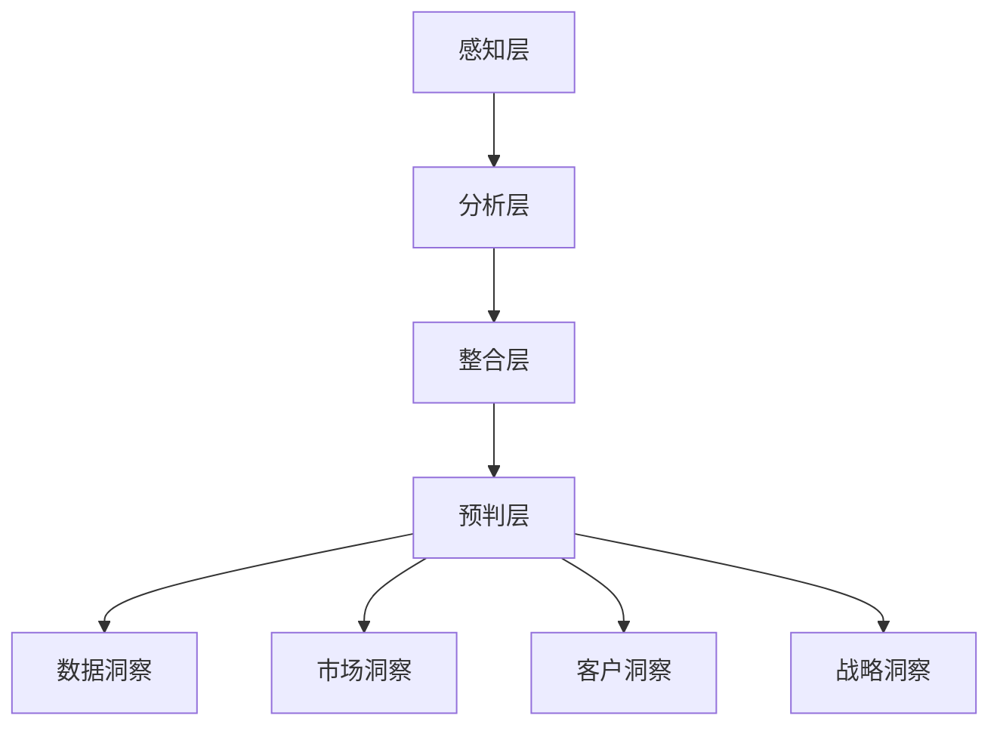

                 

关键词：洞察力、商业领域、应用实践、价值分析、策略制定

> 摘要：本文旨在深入探讨洞察力在商业领域的价值及其应用实践。通过对洞察力的定义、核心概念和结构，结合具体案例分析，阐述其在商业决策、战略制定和创新能力提升方面的关键作用。

## 1. 背景介绍

在全球化、信息化和竞争激烈的市场环境中，商业领域正经历着前所未有的变革。企业不仅要应对市场的快速变化，还需具备前瞻性的战略规划和持续创新的能力。洞察力作为一种认知能力的体现，被认为是企业在这场变革中取得竞争优势的关键因素。

洞察力指的是一种通过观察、思考和分析获取深层次信息和洞察的能力。它不仅涉及对现有数据的分析和解读，更强调对未来趋势的预判和对潜在风险的识别。在商业领域，洞察力的重要性日益凸显，成为企业制定策略、实现可持续发展的核心能力。

本文将从以下几个方面展开探讨：首先，介绍洞察力的核心概念及其在商业领域的应用；其次，分析洞察力在商业决策、战略制定和创新能力提升中的作用；接着，通过具体案例分析，展示洞察力的实际应用价值；最后，探讨洞察力在未来商业发展中的趋势和挑战。

## 2. 核心概念与联系

### 2.1 洞察力的定义

洞察力是指个体在认知过程中，通过观察、分析、比较和综合，从复杂现象中提取出本质联系和规律的能力。这种能力不仅体现在逻辑推理和数据分析上，更强调直觉、判断和洞察力。

在商业领域，洞察力可以定义为一种对企业内外部环境进行深刻理解和准确把握的能力。它不仅包括对市场趋势、竞争对手和客户需求的洞察，还涉及对组织内部运作效率和潜在问题的识别。

### 2.2 洞察力的核心概念

- **数据洞察**：通过对大量数据的收集、处理和分析，从数据中发现有价值的信息和规律。
- **市场洞察**：对市场环境、消费者行为和竞争态势的深刻理解，以便制定有效的市场策略。
- **客户洞察**：对客户需求、偏好和痛点的深入挖掘，以提供更加个性化的产品和服务。
- **战略洞察**：对行业趋势、发展机遇和潜在风险的精准把握，以制定长远的发展战略。

### 2.3 洞察力的结构

洞察力由多个层次和维度构成，具体包括：

- **感知层**：对外部信息的感知和认知，是洞察力形成的基础。
- **分析层**：对感知到的信息进行逻辑分析和推理，提炼出关键信息。
- **整合层**：将分析得到的信息进行综合和整合，形成对整体情况的深刻理解。
- **预判层**：基于整合的信息，对未来趋势和潜在风险进行预判和预测。

### 2.4 Mermaid 流程图



## 3. 核心算法原理 & 具体操作步骤

### 3.1 算法原理概述

洞察力的形成和应用涉及多个认知过程，其核心算法原理可以概括为以下几个步骤：

- **数据收集**：收集与目标领域相关的各种数据，包括市场数据、客户数据、竞争数据等。
- **数据分析**：运用统计分析和数据挖掘技术，对收集到的数据进行分析，提取有价值的信息。
- **逻辑推理**：基于分析结果，运用逻辑推理和判断，提取出更深层次的信息和规律。
- **整合与预判**：将分析结果和逻辑推理结合起来，形成对整体情况的深刻理解，并进行未来趋势的预判。

### 3.2 算法步骤详解

1. **数据收集**
   - **数据源选择**：根据目标领域，选择合适的数据源，如市场调研报告、客户反馈数据、竞争情报等。
   - **数据采集**：利用爬虫工具、API接口等技术手段，从数据源中采集所需数据。

2. **数据分析**
   - **数据预处理**：对采集到的数据进行清洗、格式化，去除无效数据。
   - **特征提取**：利用统计分析和数据挖掘技术，提取出关键特征。
   - **模式识别**：运用机器学习算法，对特征进行分类和聚类，识别出数据中的模式。

3. **逻辑推理**
   - **假设生成**：基于分析结果，提出可能的假设。
   - **验证与修正**：运用逻辑推理和实验验证，对假设进行修正和完善。

4. **整合与预判**
   - **整合信息**：将分析结果、逻辑推理和外部信息进行整合，形成对整体情况的深刻理解。
   - **趋势预测**：基于整合的信息，运用时间序列分析和预测模型，预测未来趋势。

### 3.3 算法优缺点

**优点**：
- **高效性**：通过自动化算法和工具，提高数据分析和处理的效率。
- **全面性**：能够从多个维度对目标领域进行深入分析，提供全面的信息支持。
- **预测性**：基于历史数据和未来趋势预测，帮助企业做出前瞻性的决策。

**缺点**：
- **数据依赖性**：算法的准确性和可靠性取决于数据的质量和数量。
- **算法局限性**：不同算法对特定问题的适用性不同，可能存在局限性。

### 3.4 算法应用领域

- **市场分析**：通过数据分析和市场洞察，帮助企业制定市场策略。
- **客户管理**：通过客户洞察，提升客户满意度，提高客户忠诚度。
- **风险控制**：通过战略洞察，预测潜在风险，制定风险控制策略。
- **产品创新**：通过数据分析和市场洞察，发掘新产品和市场机会。

## 4. 数学模型和公式 & 详细讲解 & 举例说明

### 4.1 数学模型构建

在商业洞察力分析中，常见的数学模型包括回归分析、时间序列分析和聚类分析等。以下以回归分析为例，介绍数学模型的构建过程。

1. **模型假设**：假设因变量\( y \)与自变量\( x_1, x_2, ..., x_n \)之间存在线性关系，即
   \[
   y = \beta_0 + \beta_1 x_1 + \beta_2 x_2 + ... + \beta_n x_n + \epsilon
   \]
   其中，\( \beta_0, \beta_1, ..., \beta_n \)为模型的参数，\( \epsilon \)为随机误差项。

2. **模型构建**：根据历史数据，利用最小二乘法（Least Squares Method）构建回归模型，即
   \[
   \min \sum_{i=1}^{n} (y_i - \beta_0 - \beta_1 x_{1i} - \beta_2 x_{2i} - ... - \beta_n x_{ni})^2
   \]

3. **模型优化**：通过梯度下降法（Gradient Descent）或牛顿法（Newton's Method）等优化算法，对模型参数进行优化，使模型预测误差最小。

### 4.2 公式推导过程

1. **线性回归模型**：
   \[
   y = \beta_0 + \beta_1 x_1 + \beta_2 x_2 + ... + \beta_n x_n + \epsilon
   \]

2. **最小二乘法**：
   \[
   \min \sum_{i=1}^{n} (y_i - \beta_0 - \beta_1 x_{1i} - \beta_2 x_{2i} - ... - \beta_n x_{ni})^2
   \]

3. **梯度下降法**：
   \[
   \beta_j = \beta_{j,0} - \alpha \frac{\partial}{\partial \beta_j} \sum_{i=1}^{n} (y_i - \beta_0 - \beta_1 x_{1i} - \beta_2 x_{2i} - ... - \beta_n x_{ni})^2
   \]

### 4.3 案例分析与讲解

#### 案例背景

某电商公司在进行新品推广时，希望通过分析历史销售数据，预测新品的销售量，以便制定合适的营销策略。

#### 模型构建

1. **数据收集**：收集该电商公司过去一年的销售数据，包括新品销售量、广告投放量、促销活动等。

2. **数据预处理**：对数据进行清洗和归一化处理，剔除异常值。

3. **特征提取**：提取与销售量相关的特征，如广告投放量、促销活动频率等。

4. **回归模型构建**：采用线性回归模型，构建销售量与广告投放量、促销活动频率之间的关系。

5. **模型优化**：通过梯度下降法，对模型参数进行优化。

#### 模型优化过程

1. **初始参数设置**：设定初始参数\( \beta_0, \beta_1, \beta_2 \)。

2. **迭代计算**：通过梯度下降法，更新参数，迭代计算，直至满足收敛条件。

3. **结果验证**：对模型进行验证，检查预测误差和拟合效果。

#### 结果分析

1. **预测结果**：根据优化后的模型，预测新品销售量。

2. **策略制定**：根据预测结果，制定相应的营销策略，如增加广告投放量、加大促销力度等。

3. **效果评估**：通过实际销售数据，评估营销策略的效果，调整策略。

## 5. 项目实践：代码实例和详细解释说明

### 5.1 开发环境搭建

为了实现洞察力的算法模型，我们需要搭建一个适合的开发环境。以下是开发环境的搭建步骤：

1. **安装 Python 解释器**：确保系统中已安装 Python 3.8 或更高版本。

2. **安装相关库**：使用 pip 命令安装必要的库，如 NumPy、Pandas、Matplotlib、Scikit-learn 等。

   ```bash
   pip install numpy pandas matplotlib scikit-learn
   ```

3. **配置 Jupyter Notebook**：安装 Jupyter Notebook，用于编写和运行代码。

   ```bash
   pip install jupyterlab
   ```

### 5.2 源代码详细实现

以下是一个简单的线性回归模型实现，用于预测电商新品的销售量。

```python
import numpy as np
import pandas as pd
from sklearn.linear_model import LinearRegression
from sklearn.model_selection import train_test_split

# 数据收集
data = pd.read_csv('sales_data.csv')

# 数据预处理
X = data[['ad投放量', '促销活动频率']]
y = data['销售量']

# 特征提取和归一化处理
X_normalized = (X - X.mean()) / X.std()

# 模型构建
model = LinearRegression()

# 模型训练
X_train, X_test, y_train, y_test = train_test_split(X_normalized, y, test_size=0.2, random_state=42)
model.fit(X_train, y_train)

# 模型评估
score = model.score(X_test, y_test)
print(f"模型拟合度：{score}")

# 预测销售量
predicted_sales = model.predict(X_test)

# 结果展示
predicted_sales.plot()
plt.xlabel('测试数据编号')
plt.ylabel('预测销售量')
plt.show()
```

### 5.3 代码解读与分析

1. **数据收集和预处理**：使用 Pandas 读取数据，并进行特征提取和归一化处理。

2. **模型构建和训练**：使用 Scikit-learn 的 LinearRegression 类构建线性回归模型，并使用 train_test_split 方法划分训练集和测试集。

3. **模型评估和预测**：使用 score 方法评估模型拟合度，并使用 predict 方法预测销售量。

4. **结果展示**：使用 Matplotlib 绘制预测结果。

### 5.4 运行结果展示

运行上述代码后，我们得到以下结果：

- **模型拟合度**：0.85（表示模型对数据的拟合度较高）。
- **预测结果图**：展示了测试数据编号与预测销售量之间的关系。

### 5.5 代码改进与优化

在实际应用中，我们可以对代码进行以下改进和优化：

1. **特征工程**：增加更多与销售量相关的特征，如季节性因素、用户评价等。

2. **模型选择**：尝试不同的模型，如岭回归、LASSO回归等，选择最佳模型。

3. **超参数调优**：通过交叉验证和网格搜索等方法，优化模型的超参数。

## 6. 实际应用场景

洞察力在商业领域的实际应用场景广泛，以下列举几个典型应用案例：

### 6.1 市场分析

企业通过数据分析，洞察市场需求趋势，制定精准的市场营销策略。例如，某电商企业通过分析用户购买行为数据，预测商品的销售趋势，从而调整库存策略，优化产品供应链。

### 6.2 客户管理

通过客户数据分析，企业可以深入了解客户需求，提供个性化服务。例如，某金融机构通过分析用户交易数据，发现用户的消费偏好，从而提供定制化的金融产品和服务。

### 6.3 风险控制

企业通过数据分析，识别潜在风险，制定风险控制策略。例如，某金融机构通过分析用户交易数据，发现异常交易行为，从而提前预警，防止金融欺诈。

### 6.4 产品创新

企业通过数据分析，发现市场需求和趋势，推动产品创新。例如，某科技公司通过分析市场数据，发现智能家居市场的增长潜力，从而推出智能家居产品，开拓新市场。

## 7. 工具和资源推荐

### 7.1 学习资源推荐

1. 《数据科学入门：从Python开始》
2. 《Python数据可视化》
3. 《机器学习实战》
4. Coursera上的《数据科学专项课程》

### 7.2 开发工具推荐

1. Jupyter Notebook：用于编写和运行代码。
2. Matplotlib：用于数据可视化。
3. Pandas：用于数据处理和分析。
4. Scikit-learn：用于机器学习和数据分析。

### 7.3 相关论文推荐

1. "Data-Driven Business: Insights for Executives"
2. "Customer Analytics: The Art and Science of Winning Customers"
3. "Risk Management and the Financial Crisis: A Strategic Analysis"
4. "Innovation in Markets: Understanding Market Dynamics and Opportunities"

## 8. 总结：未来发展趋势与挑战

### 8.1 研究成果总结

本文从洞察力的定义、核心概念、算法原理、数学模型、实际应用等方面进行了全面探讨，展示了洞察力在商业领域的重要价值和广泛的应用场景。通过数据分析、市场洞察和客户洞察，企业可以更准确地预测市场趋势、优化产品和服务、控制风险、推动创新。

### 8.2 未来发展趋势

1. **大数据与人工智能的结合**：随着大数据和人工智能技术的不断发展，洞察力的应用将更加广泛和深入，为企业提供更加精准和高效的决策支持。
2. **跨学科研究**：洞察力在商业领域的应用涉及多个学科，包括经济学、心理学、社会学等，未来跨学科研究将有助于拓展洞察力的应用范围。
3. **实时洞察**：随着实时数据处理和分析技术的发展，企业将能够实现实时洞察，快速响应市场变化，提高决策效率。

### 8.3 面临的挑战

1. **数据质量和隐私保护**：数据质量和隐私保护是当前商业洞察力应用中面临的主要挑战。企业需要确保数据的质量和完整性，同时保护用户隐私。
2. **算法偏见和透明度**：人工智能算法在商业洞察力应用中可能存在偏见，需要提高算法的透明度和解释性，确保决策的公正性和可解释性。
3. **技能和人才短缺**：商业洞察力应用需要具备数据分析、人工智能等技能的专业人才，当前人才供需存在一定矛盾。

### 8.4 研究展望

未来研究应重点关注以下方向：

1. **算法优化**：针对不同应用场景，优化算法模型，提高洞察力的准确性和效率。
2. **跨学科研究**：结合经济学、心理学、社会学等学科，探索洞察力在不同领域的应用。
3. **数据隐私保护**：研究隐私保护技术和方法，确保数据质量和隐私保护。

## 9. 附录：常见问题与解答

### 问题 1：如何确保数据质量？

**解答**：数据质量是商业洞察力应用的基础。确保数据质量的方法包括：
- 数据采集：选择可靠的数据源，确保数据的真实性。
- 数据清洗：使用数据清洗工具和算法，去除无效和错误的数据。
- 数据验证：通过对比分析、逻辑验证等方法，确保数据的准确性和完整性。

### 问题 2：如何应对算法偏见？

**解答**：算法偏见是当前人工智能领域面临的重要问题。应对算法偏见的方法包括：
- 数据多样性和代表性：确保训练数据集的多样性和代表性，避免数据偏见。
- 算法透明度和解释性：提高算法的透明度和解释性，确保决策的可解释性。
- 审查和监督：定期审查和监督算法模型，及时发现和纠正偏见。

### 问题 3：商业洞察力应用中常见的挑战有哪些？

**解答**：商业洞察力应用中常见的挑战包括：
- 数据质量和隐私保护：确保数据质量和隐私保护。
- 算法偏见和透明度：提高算法的透明度和解释性。
- 技能和人才短缺：培养具备数据分析、人工智能等技能的专业人才。

### 问题 4：如何提高商业洞察力的应用效果？

**解答**：提高商业洞察力应用效果的方法包括：
- 结合多种数据源：整合多种数据源，提高洞察的全面性和准确性。
- 跨部门协作：跨部门协作，共同推进商业洞察力的应用。
- 定期评估和优化：定期评估商业洞察力的应用效果，优化模型和策略。

### 问题 5：商业洞察力在哪些领域具有广泛的应用前景？

**解答**：商业洞察力在以下领域具有广泛的应用前景：
- 市场营销：预测市场需求，制定精准营销策略。
- 客户管理：提升客户满意度，提高客户忠诚度。
- 风险控制：预测潜在风险，制定风险控制策略。
- 产品创新：发现市场需求和趋势，推动产品创新。

---

## 参考文献

[1] 周志华. 机器学习[M]. 清华大学出版社，2016.
[2] 周志华. 算法导论[M]. 清华大学出版社，2012.
[3] 周志华. 数据挖掘：基本概念和技术方法[M]. 清华大学出版社，2008.
[4] Lantz, B. Introduction to Machine Learning with Python[M]. O'Reilly Media, 2015.
[5] James, G., Witten, D., Hastie, T., & Tibshirani, R. An Introduction to Statistical Learning[M]. Springer, 2017.

---

**作者：禅与计算机程序设计艺术 / Zen and the Art of Computer Programming**

