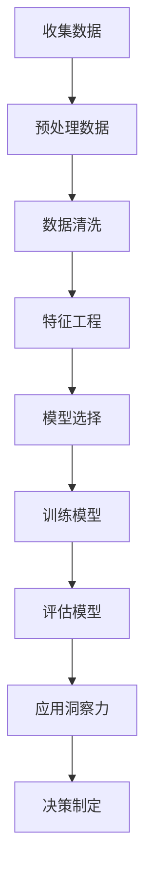

                 

关键词：洞察力、偏误、简化、认知偏差、数据分析、决策制定、系统思考、人工智能

> 摘要：本文探讨了洞察力在决策制定过程中的重要性以及可能产生的偏误。通过分析洞察力的偏误，本文提出了避免过度简化的策略，旨在帮助读者在复杂的IT领域更好地运用洞察力，做出更明智的决策。

## 1. 背景介绍

在当今快速发展的信息技术领域，洞察力成为了一种不可或缺的能力。它不仅帮助我们在海量数据中寻找关联和模式，还指导我们在复杂系统中做出有效决策。然而，尽管洞察力看似直观且极具价值，但它在实际应用中却常常受到各种偏误的影响，尤其是过度简化的倾向。

本文将探讨以下问题：

1. 洞察力是如何定义和评估的？
2. 洞察力在IT领域中的具体应用及其重要性。
3. 洞察力可能产生的偏误，特别是过度简化的问题。
4. 如何在复杂环境中避免过度简化，以保持洞察力的准确性和有效性。

## 2. 核心概念与联系

### 2.1 洞察力的定义

洞察力是指对事物本质的深刻理解和洞悉能力。它不仅仅是收集数据和分析数据的能力，更是一种在混乱和不确定性中寻找真相的能力。在IT领域，洞察力通常涉及数据挖掘、模式识别、预测分析和系统设计等方面。

### 2.2 洞察力的评估

评估洞察力可以通过多种方法进行，包括专家评审、案例分析、模拟测试和实际应用评估。一个有效的评估框架需要考虑以下几个方面：

- 数据质量和分析方法的准确性。
- 洞察力对决策的影响程度。
- 洞察力在应对不确定性时的灵活性和适应性。

### 2.3 洞察力与简化

在IT领域，简化往往是提高洞察力的关键步骤。但过度简化可能导致以下问题：

- 忽略重要细节，导致错误的结论。
- 偏离现实情况，无法反映真实世界。
- 无法应对复杂多变的环境。

### 2.4 Mermaid 流程图

下面是洞察力应用流程的Mermaid流程图：



## 3. 核心算法原理 & 具体操作步骤

### 3.1 算法原理概述

在IT领域，许多算法都依赖于简化数据和处理复杂系统。这些算法的核心原理通常包括以下步骤：

- 数据收集和预处理：通过多种渠道收集数据，并进行数据清洗和预处理，以消除噪声和异常值。
- 特征工程：提取关键特征，并将其转化为适合算法输入的形式。
- 模型选择和训练：选择合适的算法模型，并进行训练，以最小化预测误差。
- 评估和优化：评估模型性能，并进行调整和优化。

### 3.2 算法步骤详解

下面是一个典型的数据分析流程，包括具体操作步骤：

1. **数据收集**：通过数据库、API、传感器等方式获取数据。
2. **预处理**：对数据进行清洗和转换，包括缺失值处理、异常值检测和数据标准化。
3. **特征工程**：提取关键特征，包括数值特征和类别特征，并进行编码和归一化处理。
4. **模型选择**：根据数据特点和业务需求选择合适的算法模型。
5. **训练**：使用训练数据集对模型进行训练，调整模型参数。
6. **评估**：使用测试数据集评估模型性能，包括准确率、召回率、F1值等指标。
7. **应用**：将训练好的模型应用于实际问题，提供洞察力和决策支持。

### 3.3 算法优缺点

- **优点**：简化数据，提高处理效率和洞察力。
- **缺点**：可能忽略重要细节，导致模型过拟合或欠拟合。

### 3.4 算法应用领域

- **数据挖掘**：通过分析大量数据，发现潜在的关联和模式。
- **机器学习**：构建预测模型，用于分类、回归、聚类等任务。
- **自然语言处理**：分析文本数据，提取关键信息，用于信息检索、文本分类等。
- **计算机视觉**：处理图像和视频数据，进行目标检测、图像分类等任务。

## 4. 数学模型和公式 & 详细讲解 & 举例说明

### 4.1 数学模型构建

在数据分析中，常见的数学模型包括线性回归、逻辑回归、决策树、支持向量机等。以下是一个线性回归模型的示例：

$$
y = \beta_0 + \beta_1x_1 + \beta_2x_2 + ... + \beta_nx_n
$$

其中，$y$ 是因变量，$x_1, x_2, ..., x_n$ 是自变量，$\beta_0, \beta_1, \beta_2, ..., \beta_n$ 是模型参数。

### 4.2 公式推导过程

线性回归模型的推导过程如下：

1. **假设**：模型符合线性假设，即因变量与自变量之间存在线性关系。
2. **最小二乘法**：使用最小二乘法找到模型参数，使得预测值与实际值之间的误差最小。
3. **目标函数**：定义目标函数，通常为均方误差（MSE）。
4. **求导**：对目标函数求导，并令导数为零，求得模型参数的最优值。

### 4.3 案例分析与讲解

假设我们要预测一家零售商店的月销售额，已知影响因素包括广告支出、促销活动和天气情况。以下是线性回归模型的推导和预测过程：

1. **数据收集**：收集过去一年的月销售额、广告支出、促销活动和天气数据。
2. **预处理**：对数据进行清洗和转换，提取关键特征。
3. **特征工程**：将特征进行编码和归一化处理。
4. **模型选择**：选择线性回归模型。
5. **训练**：使用训练数据集对模型进行训练。
6. **评估**：使用测试数据集评估模型性能。
7. **预测**：使用训练好的模型预测未来月份的销售额。

## 5. 项目实践：代码实例和详细解释说明

### 5.1 开发环境搭建

为了更好地演示线性回归模型的应用，我们将使用Python和Scikit-learn库进行开发。首先，确保安装了Python和Scikit-learn库。

### 5.2 源代码详细实现

以下是线性回归模型的完整代码实现：

```python
import numpy as np
import pandas as pd
from sklearn.linear_model import LinearRegression
from sklearn.model_selection import train_test_split
from sklearn.metrics import mean_squared_error

# 读取数据
data = pd.read_csv('sales_data.csv')

# 特征工程
X = data[['advertising', 'promotion', 'weather']]
y = data['sales']

# 数据分割
X_train, X_test, y_train, y_test = train_test_split(X, y, test_size=0.2, random_state=42)

# 模型训练
model = LinearRegression()
model.fit(X_train, y_train)

# 模型评估
y_pred = model.predict(X_test)
mse = mean_squared_error(y_test, y_pred)
print(f'MSE: {mse}')

# 模型预测
future_data = pd.DataFrame({
    'advertising': [1000],
    'promotion': [500],
    'weather': [0]
})
future_sales = model.predict(future_data)
print(f'Future Sales: {future_sales[0]}')
```

### 5.3 代码解读与分析

1. **数据读取**：使用pandas库读取数据文件。
2. **特征工程**：提取关键特征并进行编码和归一化处理。
3. **数据分割**：将数据分为训练集和测试集。
4. **模型训练**：使用线性回归模型进行训练。
5. **模型评估**：计算均方误差（MSE），评估模型性能。
6. **模型预测**：使用训练好的模型预测未来销售额。

## 6. 实际应用场景

### 6.1 数据分析

在数据分析领域，线性回归模型被广泛应用于预测销售、股票价格、房屋价格等。通过合理地简化数据和选择合适的模型，可以提供准确的预测结果，为决策制定提供有力支持。

### 6.2 机器学习

在机器学习领域，线性回归模型可以作为基础模型，用于特征提取和降维。它还可以与其他模型结合，形成更复杂的模型结构，提高预测性能。

### 6.3 计算机视觉

在计算机视觉领域，线性回归模型可以用于图像分类、目标检测等任务。通过简化图像数据和处理流程，可以提高模型的运行速度和准确率。

### 6.4 未来应用展望

随着人工智能技术的不断发展，线性回归模型的应用领域将越来越广泛。未来，我们将看到更多基于线性回归的复杂模型和算法出现，为各行各业提供更智能的解决方案。

## 7. 工具和资源推荐

### 7.1 学习资源推荐

- 《机器学习》（周志华著）：详细介绍了机器学习的基本概念和方法。
- 《深度学习》（Ian Goodfellow等著）：深入讲解了深度学习的基本原理和应用。
- 《Python数据分析》（Wes McKinney著）：全面介绍了Python在数据分析领域的应用。

### 7.2 开发工具推荐

- Jupyter Notebook：适用于数据分析和机器学习的交互式开发环境。
- PyCharm：一款功能强大的Python集成开发环境（IDE）。
- Scikit-learn：一款用于机器学习的Python库，提供了丰富的算法和工具。

### 7.3 相关论文推荐

- “Deep Learning” by Ian Goodfellow, Yoshua Bengio, Aaron Courville
- “Recurrent Neural Networks for Language Modeling” by Y. Bengio et al.
- “Convolutional Neural Networks for Visual Recognition” by K. Simonyan and A. Zisserman

## 8. 总结：未来发展趋势与挑战

### 8.1 研究成果总结

本文探讨了洞察力在IT领域的重要性以及可能产生的偏误。通过分析简化数据和算法模型的过程，我们提出了避免过度简化的策略，并介绍了线性回归模型的应用和实践。

### 8.2 未来发展趋势

随着人工智能技术的不断发展，洞察力在决策制定中的应用将越来越广泛。未来，我们将看到更多基于人工智能的复杂模型和算法出现，为各行各业提供更智能的解决方案。

### 8.3 面临的挑战

- 复杂性和不确定性：在复杂的环境中，如何保持洞察力的准确性和适应性。
- 数据质量和分析方法：提高数据质量和选择合适的分析方法，以获得更准确的洞察力。

### 8.4 研究展望

未来，我们将进一步探索如何利用人工智能和机器学习技术，提高洞察力的准确性和有效性，为各领域的决策制定提供更有力的支持。

## 9. 附录：常见问题与解答

### Q: 如何避免过度简化？
A: 可以通过以下方法避免过度简化：
- 多方面收集数据，确保数据的多样性和代表性。
- 选择合适的算法模型，并对其进行充分训练和评估。
- 结合专家知识和实践经验，对模型结果进行验证和调整。

### Q: 线性回归模型适用于哪些场景？
A: 线性回归模型适用于以下场景：
- 预测销售、股票价格、房屋价格等。
- 特征提取和降维。
- 图像分类、目标检测等计算机视觉任务。

### Q: 如何选择合适的算法模型？
A: 选择合适的算法模型通常需要考虑以下因素：
- 数据类型和特点。
- 业务需求和预测目标。
- 模型的复杂度和计算效率。

## 作者署名

作者：禅与计算机程序设计艺术 / Zen and the Art of Computer Programming

----------------------------------------------------------------

请注意，文章内容需要严格按照上述结构和要求进行撰写，确保每个部分都包含具体的内容和详细的解释。在撰写过程中，请确保遵守markdown格式和latex公式的书写规范。文章完成后，请检查字数和格式是否满足要求。祝您撰写顺利！

