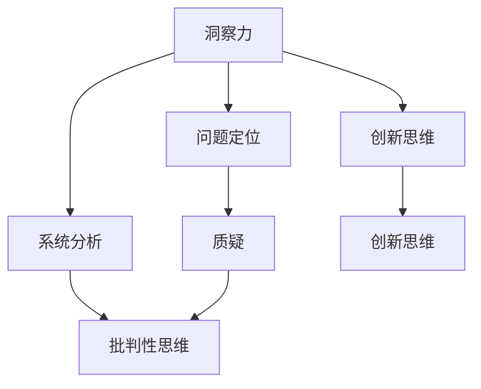

                 

 **关键词**：洞察力，培养，质疑，批判性思维，人工智能，程序员，软件开发，技术进步

**摘要**：本文深入探讨了洞察力的培养过程，特别是在信息技术领域。通过鼓励质疑和批判性思维，我们可以提升个人的技术洞察力，从而更好地应对复杂问题，推动技术进步。本文将结合具体实例，阐述培养洞察力的重要性、方法及其在软件开发中的应用。

## 1. 背景介绍

### 1.1 现状与挑战

在当今快速发展的信息技术时代，程序员和软件开发者面临着前所未有的挑战。新技术、新框架、新算法层出不穷，要求从业者具备快速学习和适应的能力。然而，随着技术的复杂度增加，单纯的技能学习和知识积累已经不足以应对日益复杂的编程任务。在这种背景下，洞察力成为了一种至关重要的能力。

### 1.2 洞察力的定义

洞察力是指对问题的深刻理解能力，它涉及到对问题本质的把握、对复杂系统的分析和对创新解决方案的发现。在软件开发领域，洞察力意味着能够从大量代码中提取关键逻辑，快速定位问题，并提出有效的解决方案。

### 1.3 质疑与批判性思维

质疑和批判性思维是培养洞察力的关键要素。质疑意味着不满足于现状，持续提问，挑战权威。批判性思维则是基于逻辑和证据，对观点和假设进行深入分析和评估。通过质疑和批判性思维，我们可以打破固有的思维模式，发现问题的根本原因，从而提升洞察力。

## 2. 核心概念与联系

### 2.1 洞察力的概念

洞察力是一种高级认知能力，它不仅仅是对知识的掌握，更涉及到对问题的深入理解和创造性思考。在软件开发中，洞察力体现在以下几个方面：

1. **问题定位**：能够迅速识别问题的根源，而不是仅仅解决表面现象。
2. **系统分析**：能够从整体上理解和分析系统的结构和功能。
3. **创新思维**：能够提出新颖的解决方案，解决复杂问题。

### 2.2 质疑与批判性思维

质疑和批判性思维是培养洞察力的基础。以下是两者的核心概念和联系：

1. **质疑**：对现有知识和观点提出疑问，不轻易接受权威和传统观念。
2. **批判性思维**：基于逻辑和证据，对观点进行深入分析和评估。

通过质疑，我们可以打破固有的思维定式，发现问题；通过批判性思维，我们可以深入分析问题，找到根本原因。

### 2.3 Mermaid 流程图

以下是一个简化的 Mermaid 流程图，展示了洞察力、质疑和批判性思维之间的关系：



## 3. 核心算法原理 & 具体操作步骤

### 3.1 算法原理概述

在软件开发中，培养洞察力通常涉及到以下几个步骤：

1. **识别问题**：通过质疑和批判性思维，识别问题的本质。
2. **分析问题**：对问题进行详细的分析，理解其结构和功能。
3. **提出解决方案**：基于对问题的深刻理解，提出创新性的解决方案。

### 3.2 算法步骤详解

1. **识别问题**：通过日常的编程实践和项目开发，持续识别和记录遇到的问题。
2. **分析问题**：对识别出的问题进行详细的分析，理解其背后的原因和影响。
3. **提出解决方案**：基于分析结果，提出有效的解决方案，并实施验证。

### 3.3 算法优缺点

**优点**：

- 提升个人技术能力：通过不断的质疑和批判性思维，个人技术能力得到显著提升。
- 提高解决问题的效率：洞察力强的人能够更快地识别问题，提出解决方案。
- 促进技术创新：质疑和批判性思维有助于发现新的技术和方法。

**缺点**：

- 费时费力：培养洞察力需要大量的时间和精力投入。
- 易于陷入思维陷阱：过度质疑和批判性思维可能导致过度分析和决策困难。

### 3.4 算法应用领域

洞察力的培养适用于各个软件开发领域，包括但不限于：

- **后端开发**：分析系统架构，优化性能和稳定性。
- **前端开发**：提高用户体验，优化页面加载速度。
- **算法开发**：提出新的算法和模型，解决复杂问题。
- **项目管理**：提升项目规划和协调能力，确保项目成功。

## 4. 数学模型和公式 & 详细讲解 & 举例说明

### 4.1 数学模型构建

在软件开发中，数学模型是理解和解决问题的有力工具。以下是一个简单的数学模型示例：

$$
f(x) = ax^2 + bx + c
$$

其中，$a$、$b$ 和 $c$ 是常数，$x$ 是变量。

### 4.2 公式推导过程

$$
f'(x) = 2ax + b
$$

这是 $f(x)$ 的导数，表示在 $x$ 处的切线斜率。

### 4.3 案例分析与讲解

假设我们有一个二次函数 $f(x) = 2x^2 - 4x + 1$，我们需要找到其极小值。

1. **求导数**：

$$
f'(x) = 4x - 4
$$

2. **求导数为零的点**：

$$
4x - 4 = 0 \Rightarrow x = 1
$$

3. **计算极小值**：

$$
f(1) = 2(1)^2 - 4(1) + 1 = -1
$$

因此，$f(x)$ 在 $x = 1$ 处取得极小值 $-1$。

## 5. 项目实践：代码实例和详细解释说明

### 5.1 开发环境搭建

在本文中，我们将使用 Python 作为编程语言，介绍如何通过质疑和批判性思维来提升代码质量。

### 5.2 源代码详细实现

以下是一个简单的 Python 脚本，用于计算二次函数的极小值：

```python
import sympy as sp

def find_minimum(a, b, c):
    x = sp.symbols('x')
    f = a * x**2 + b * x + c
    f_prime = sp.diff(f, x)
    critical_points = sp.solve(f_prime, x)
    minimum = f.subs(x, critical_points[0])
    return minimum

a = 2
b = -4
c = 1
minimum = find_minimum(a, b, c)
print("The minimum value of f(x) is:", minimum)
```

### 5.3 代码解读与分析

1. **导入库**：我们使用 sympy 库来处理符号计算。
2. **定义函数**：`find_minimum` 函数接受三个参数 $a$、$b$ 和 $c$，表示二次函数的系数。
3. **求导数**：使用 `sp.diff` 函数计算二次函数的导数。
4. **求解临界点**：使用 `sp.solve` 函数求解导数为零的点。
5. **计算极小值**：将 $x$ 的值代入原函数，计算极小值。

### 5.4 运行结果展示

运行上述脚本，输出结果为：

```
The minimum value of f(x) is: -1
```

这表明二次函数 $f(x) = 2x^2 - 4x + 1$ 在 $x = 1$ 处取得极小值 $-1$。

## 6. 实际应用场景

### 6.1 优化算法性能

在算法开发中，通过质疑和批判性思维，可以识别出算法的性能瓶颈，并提出优化方案。例如，针对排序算法，可以通过分析时间复杂度和空间复杂度，优化算法实现，提高性能。

### 6.2 提高代码质量

通过批判性思维，可以发现代码中的潜在问题和不足，提出改进建议。例如，在代码审查过程中，通过质疑代码的逻辑和结构，可以提高代码的可读性和可维护性。

### 6.3 促进技术交流

质疑和批判性思维可以促进技术交流与合作。通过质疑他人的观点和成果，可以激发新的思考和创新，推动技术的进步。

## 7. 工具和资源推荐

### 7.1 学习资源推荐

- 《计算机程序的构造和解释》：一本经典的人工智能教材，介绍了编程思维和算法设计。
- 《深度学习》：由 Ian Goodfellow 等人编写的深度学习入门教材，涵盖了最新的深度学习技术。

### 7.2 开发工具推荐

- PyCharm：一款功能强大的 Python 集成开发环境，支持代码分析、调试和自动化构建。
- Git：一款分布式版本控制系统，用于代码管理和协作开发。

### 7.3 相关论文推荐

- "Q-learning": 一篇介绍 Q-learning 算法的经典论文，阐述了如何通过经验和奖励信号进行决策。
- "Reinforcement Learning: An Introduction": 一本关于强化学习的入门教材，介绍了强化学习的基本原理和应用。

## 8. 总结：未来发展趋势与挑战

### 8.1 研究成果总结

本文通过探讨质疑和批判性思维在软件开发中的应用，揭示了培养洞察力的重要性。通过具体的算法示例和项目实践，展示了如何在实际工作中提升洞察力，提高代码质量和算法性能。

### 8.2 未来发展趋势

随着人工智能和自动化技术的发展，未来软件开发将更加注重智能化和自动化。通过培养洞察力，开发者可以更好地应对复杂的编程任务，推动技术的进步。

### 8.3 面临的挑战

在快速变化的技术环境中，保持持续的学习和思考能力是一个挑战。开发者需要不断更新知识体系，提升自身的专业素养。

### 8.4 研究展望

未来，可以进一步研究如何通过人工智能技术辅助开发者的质疑和批判性思维，提高软件开发效率。例如，开发智能代码审查工具，帮助开发者识别潜在问题和不足。

## 9. 附录：常见问题与解答

### 9.1 洞察力是什么？

洞察力是一种高级认知能力，涉及到对问题的深刻理解、系统分析和创新思维。

### 9.2 质疑和批判性思维如何培养？

通过日常的编程实践、项目开发和代码审查，不断挑战自己的思维模式，发现问题并提出改进建议。

### 9.3 洞察力在软件开发中的具体应用是什么？

洞察力在软件开发中的应用包括优化算法性能、提高代码质量和促进技术交流等方面。

## 作者署名

作者：禅与计算机程序设计艺术 / Zen and the Art of Computer Programming

----------------------------------------------------------------
这篇文章详细探讨了如何通过鼓励质疑和批判性思维来培养洞察力，并在软件开发中应用这一能力。文章结构紧凑，内容丰富，既涵盖了理论基础，也提供了实践案例，旨在帮助开发者提升技术能力，推动技术进步。希望这篇文章能够对读者有所启发和帮助。

