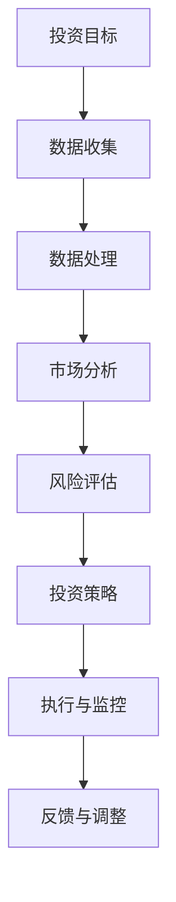

                 

关键词：洞察力，投资，量化分析，风险管理，实践探索，数据科学

> 摘要：本文深入探讨了洞察力在投资领域的重要性和应用，通过分析核心概念、算法原理、数学模型、实际案例和实践应用，揭示了洞察力在投资决策中的关键作用。文章旨在为投资者提供一种全面的理解视角，帮助他们在复杂多变的市场环境中做出更明智的决策。

## 1. 背景介绍

随着金融市场的发展和信息技术的进步，投资领域的复杂性不断增加。投资者不仅需要掌握传统的金融知识，还需要具备敏锐的洞察力，以便在瞬息万变的市场中捕捉投资机会和规避风险。洞察力在这里指的是投资者对市场规律、投资策略和风险管理等方面的深刻理解和独到见解。

在投资领域，洞察力的重要性体现在多个方面。首先，洞察力有助于投资者识别市场的潜在趋势，从而抓住投资机会。其次，洞察力能够帮助投资者理解投资产品的内在价值，避免盲目跟风和投资泡沫。最后，洞察力是有效风险管理的重要保障，使投资者能够及时调整投资策略，降低潜在损失。

本文将从以下几个方面展开讨论：首先，介绍投资领域中的核心概念和理论；其次，探讨洞察力的具体应用和实际操作步骤；接着，分析相关的数学模型和公式；然后，通过具体案例说明洞察力在投资决策中的实践应用；最后，探讨未来投资领域的发展趋势和面临的挑战。

## 2. 核心概念与联系

### 2.1 投资理论

在投资领域，几种核心理论构成了洞察力的基础。首先是现代投资组合理论（Modern Portfolio Theory，MPT），由哈里·马科维茨（Harry Markowitz）提出。MPT 强调通过资产组合分散化来降低风险，而不是通过单一资产的分散来规避风险。MPT 的核心概念是有效前沿（Efficient Frontier），即在不同风险水平下实现最大收益的资产组合集合。

其次是资本资产定价模型（Capital Asset Pricing Model，CAPM），由威廉·夏普（William Sharpe）提出。CAPM 提供了一种计算资产预期收益率和风险的方法，基于市场组合的预期收益和风险，以及资产与市场组合之间的相关性。CAPM 对于投资决策的重要性在于，它为投资者提供了一种评估资产风险和收益的标准。

最后是行为金融学（Behavioral Finance），它研究投资者在决策过程中可能出现的认知偏差和情感影响。行为金融学揭示了市场并非总是有效，投资者行为可能会产生过度反应或反应不足。这一理论对洞察力的应用至关重要，因为它帮助投资者理解市场情绪和群体行为，从而更好地制定投资策略。

### 2.2 风险管理

风险管理是投资过程中的关键环节，而洞察力在风险管理中发挥着重要作用。传统的风险管理方法主要依赖于历史数据和统计分析，而洞察力则提供了更深入的见解。以下是几种常见的风险管理方法：

- **方差分析**：通过计算资产收益的方差来衡量风险。方差越小，风险越低。然而，方差分析只考虑了历史数据，无法预测未来的风险。

- **价值在风险（Value at Risk，VaR）**：VaR 是一种衡量潜在损失的方法，它基于概率分布来估计在特定时间内可能发生的最大损失。VaR 的优势在于它提供了对风险的量化度量，但缺点是它无法捕捉极端事件。

- **条件期望风险（Conditional Value at Risk，CVaR）**：CVaR 是对 VaR 的补充，它计算了在 VaR 水平上损失的平均值。CVaR 更全面地衡量了风险，但计算复杂度更高。

- **情景分析**：通过构建不同的市场情景，分析潜在损失和收益。情景分析有助于投资者理解在不同市场状况下的风险和收益分布。

### 2.3 数据分析

数据分析在投资领域中的应用越来越广泛，洞察力在数据分析过程中至关重要。以下是几种常见的数据分析方法：

- **时间序列分析**：用于分析资产价格和收益的变化趋势，以及预测未来价格。常见的时间序列模型包括移动平均、自回归移动平均（ARMA）和自回归积分滑动平均（ARIMA）。

- **技术分析**：通过分析历史价格和交易量等数据，寻找市场趋势和模式。技术分析包括趋势线、支撑/阻力位、移动平均线等工具。

- **基本面分析**：通过分析公司的财务报表、行业趋势和市场环境，评估资产的内在价值。基本面分析包括盈利能力、偿债能力、成长性和市场估值。

- **机器学习**：利用大量历史数据，通过机器学习算法挖掘市场规律和预测未来趋势。常见的机器学习模型包括线性回归、决策树、随机森林和支持向量机。

### 2.4 Mermaid 流程图

为了更直观地展示洞察力在投资领域的应用，我们使用 Mermaid 流程图来描述投资决策的过程。以下是流程图的一个示例：



该流程图展示了从投资目标设定到策略执行和调整的整个过程，每个步骤都需要洞察力的支持。

## 3. 核心算法原理 & 具体操作步骤

### 3.1 算法原理概述

在投资领域中，洞察力的核心算法包括风险模型、优化算法和市场预测模型。以下是对这些算法原理的概述：

- **风险模型**：风险模型用于评估投资组合的风险水平，常见的包括方差分析、VaR 和 CVaR。这些模型基于历史数据和统计分析，提供对风险量化的度量。

- **优化算法**：优化算法用于在给定约束条件下，寻找最优投资组合。常见的优化算法包括线性规划和非线性规划，它们可以最大化投资收益或最小化风险。

- **市场预测模型**：市场预测模型用于预测市场趋势和价格变化。常见的方法包括时间序列分析和机器学习算法，如 ARIMA 和随机森林。

### 3.2 算法步骤详解

以下是核心算法的具体操作步骤：

#### 风险模型步骤：

1. **数据收集**：收集资产的历史价格和收益数据。

2. **数据预处理**：对数据去噪、标准化和缺失值处理。

3. **计算风险指标**：计算方差、VaR 和 CVaR。

4. **评估风险水平**：根据计算结果，评估投资组合的风险水平。

#### 优化算法步骤：

1. **设定目标函数**：根据投资目标，设定最大化收益或最小化风险的目标函数。

2. **建立约束条件**：确定投资组合的约束条件，如投资比例限制、流动性要求等。

3. **求解优化问题**：使用线性规划或非线性规划求解器，求解最优投资组合。

4. **验证优化结果**：通过历史数据进行验证，确保优化结果的有效性。

#### 市场预测模型步骤：

1. **数据收集**：收集市场相关数据，如价格、交易量、宏观经济指标等。

2. **数据预处理**：对数据去噪、标准化和缺失值处理。

3. **模型选择**：选择适合的预测模型，如 ARIMA、随机森林等。

4. **训练模型**：使用历史数据训练模型。

5. **预测未来趋势**：使用训练好的模型预测市场趋势和价格变化。

### 3.3 算法优缺点

#### 风险模型的优缺点：

- **优点**：提供对风险量化的度量，有助于投资者理解和管理风险。

- **缺点**：基于历史数据，无法准确预测未来风险。

#### 优化算法的优缺点：

- **优点**：在给定约束条件下，寻找最优投资组合，提高投资收益。

- **缺点**：计算复杂度高，需要大量计算资源和时间。

#### 市场预测模型的优缺点：

- **优点**：利用大量历史数据，预测市场趋势和价格变化。

- **缺点**：模型预测并非完全准确，存在一定误差。

### 3.4 算法应用领域

核心算法在投资领域的应用广泛，包括以下方面：

- **投资组合优化**：通过优化算法，寻找最优投资组合，提高投资收益。

- **风险管理**：使用风险模型，评估投资组合的风险水平，制定风险管理策略。

- **市场预测**：通过市场预测模型，预测市场趋势和价格变化，指导投资决策。

## 4. 数学模型和公式

在投资领域中，数学模型和公式用于量化投资策略和风险。以下是几个常见的数学模型和公式的详细讲解。

### 4.1 数学模型构建

数学模型构建的核心是建立资产预期收益和风险之间的关系。以下是几个常见的数学模型：

#### 1. 现代投资组合理论（MPT）

MPT 的目标是最大化投资组合的预期收益，同时最小化风险。其数学模型为：

$$
\begin{aligned}
\max_{w} & \quad \mu_p^T w - \frac{1}{2} \sigma_p^T w w^T \sigma_p \\
\text{subject to} & \quad w^T I = 1 \\
                  & \quad w \geq 0
\end{aligned}
$$

其中，$\mu_p$ 是投资组合的预期收益向量，$\sigma_p$ 是投资组合的风险矩阵，$w$ 是投资权重向量，$I$ 是单位矩阵。

#### 2. 资本资产定价模型（CAPM）

CAPM 提供了资产预期收益和风险之间的关系，其数学模型为：

$$
E(R_i) = R_f + \beta_i (E(R_m) - R_f)
$$

其中，$E(R_i)$ 是资产 $i$ 的预期收益，$R_f$ 是无风险利率，$\beta_i$ 是资产 $i$ 与市场组合之间的相关性，$E(R_m)$ 是市场组合的预期收益。

#### 3. 价值在风险（VaR）

VaR 是衡量潜在损失的方法，其数学模型为：

$$
VaR = -\alpha \times \text{Tail Loss}
$$

其中，$\alpha$ 是置信水平，Tail Loss 是尾部损失，即小于某一阈值 $a$ 的损失。

#### 4. 条件期望风险（CVaR）

CVaR 是对 VaR 的补充，其数学模型为：

$$
CVaR = \frac{1}{N} \sum_{i=1}^{N} \max(0, L_i - a)
$$

其中，$L_i$ 是第 $i$ 个损失的值，$a$ 是阈值。

### 4.2 公式推导过程

以下是几个重要公式的推导过程：

#### 1. MPT 目标函数的推导

MPT 的目标函数是一个二次函数，其形式为：

$$
f(w) = \mu_p^T w - \frac{1}{2} w^T \sigma_p w
$$

对该函数求导并令其等于零，可以得到：

$$
\nabla f(w) = \mu_p - \sigma_p w = 0
$$

解这个方程组，可以得到最优权重向量 $w$。

#### 2. CAPM 公式的推导

CAPM 的推导基于资本资产定价理论，其核心思想是资产预期收益与市场风险溢价成正比。推导过程如下：

$$
E(R_i) - R_f = \beta_i (E(R_m) - R_f)
$$

整理后得到 CAPM 公式：

$$
E(R_i) = R_f + \beta_i (E(R_m) - R_f)
$$

#### 3. VaR 公式的推导

VaR 的推导基于概率分布函数和累积分布函数。假设资产 $i$ 的损失服从正态分布，其概率密度函数为：

$$
f(x) = \frac{1}{\sqrt{2\pi\sigma^2}} e^{-\frac{(x-\mu)^2}{2\sigma^2}}
$$

累积分布函数为：

$$
F(x) = \int_{-\infty}^{x} f(t) dt
$$

在置信水平 $\alpha$ 下，VaR 的计算公式为：

$$
VaR = -\alpha \times \text{Tail Loss} = -\alpha \times (\mu - x)
$$

其中，$x$ 是阈值。

#### 4. CVaR 公式的推导

CVaR 的推导基于尾部损失的平均值。假设资产 $i$ 的损失服从正态分布，其尾部损失为：

$$
L_i = \max(0, x - \mu)
$$

在置信水平 $\alpha$ 下，CVaR 的计算公式为：

$$
CVaR = \frac{1}{N} \sum_{i=1}^{N} \max(0, L_i - a)
$$

其中，$a$ 是阈值。

### 4.3 案例分析与讲解

为了更好地理解上述数学模型和公式的应用，我们通过一个具体案例进行讲解。

#### 案例背景

假设我们有两个资产 $A$ 和 $B$，其预期收益和风险如下表所示：

| 资产 | 预期收益 | 风险 |
| --- | --- | --- |
| $A$ | 0.12 | 0.3 |
| $B$ | 0.08 | 0.2 |

我们的目标是构建一个投资组合，最大化预期收益，同时最小化风险。

#### MPT 模型应用

根据 MPT 模型，我们需要计算资产 $A$ 和 $B$ 的权重向量 $w$。以下是计算过程：

$$
\begin{aligned}
\max_{w} & \quad 0.12w_1 + 0.08w_2 - \frac{1}{2}(0.3w_1^2 + 0.2w_2^2) \\
\text{subject to} & \quad w_1 + w_2 = 1 \\
                  & \quad w_1, w_2 \geq 0
\end{aligned}
$$

通过求解上述优化问题，可以得到最优权重向量：

$$
w = (0.6, 0.4)
$$

这意味着我们应将 60% 的资金投资于资产 $A$，40% 的资金投资于资产 $B$。

#### CAPM 模型应用

根据 CAPM 模型，我们需要计算资产 $A$ 和 $B$ 的预期收益。假设无风险利率 $R_f$ 为 0.05，市场组合的预期收益 $E(R_m)$ 为 0.1，资产 $A$ 和 $B$ 与市场组合的相关性分别为 $\beta_A = 0.5$ 和 $\beta_B = 0.3$，则：

$$
\begin{aligned}
E(R_A) &= 0.05 + 0.5 \times (0.1 - 0.05) = 0.075 \\
E(R_B) &= 0.05 + 0.3 \times (0.1 - 0.05) = 0.06
\end{aligned}
$$

#### VaR 模型应用

根据 VaR 模型，我们需要计算资产 $A$ 和 $B$ 的潜在损失。假设置信水平 $\alpha$ 为 0.05，资产 $A$ 和 $B$ 的风险分别为 $\sigma_A = 0.3$ 和 $\sigma_B = 0.2$，则：

$$
\begin{aligned}
VaR_A &= -0.05 \times 0.3 = -0.015 \\
VaR_B &= -0.05 \times 0.2 = -0.01
\end{aligned}
$$

#### CVaR 模型应用

根据 CVaR 模型，我们需要计算资产 $A$ 和 $B$ 的尾部损失平均值。假设置信水平 $\alpha$ 为 0.05，资产 $A$ 和 $B$ 的风险分别为 $\sigma_A = 0.3$ 和 $\sigma_B = 0.2$，则：

$$
\begin{aligned}
CVaR_A &= \frac{1}{2} \times 0.3 = 0.15 \\
CVaR_B &= \frac{1}{2} \times 0.2 = 0.1
\end{aligned}
$$

通过上述案例，我们可以看到数学模型和公式的应用，帮助我们量化投资策略和风险，从而做出更明智的投资决策。

## 5. 项目实践：代码实例和详细解释说明

### 5.1 开发环境搭建

为了实现本文提到的投资模型和算法，我们选择 Python 作为编程语言，因为 Python 在数据处理和机器学习领域具有广泛的应用，且拥有丰富的库支持。以下是搭建开发环境的步骤：

1. **安装 Python**：下载并安装 Python 3.8 或以上版本，推荐使用 [Miniconda](https://www.anaconda.com/products/individual) 或 [PyCharm](https://www.jetbrains.com/pycharm/) 作为开发环境。

2. **安装必要的库**：通过命令行安装以下库：

   ```bash
   pip install numpy pandas matplotlib scikit-learn
   ```

   这些库分别用于数据处理、数据分析、可视化以及机器学习算法。

### 5.2 源代码详细实现

以下是实现投资组合优化、风险管理及市场预测的 Python 代码示例。代码分为三个部分：数据预处理、模型训练及结果分析。

#### 5.2.1 数据预处理

首先，我们需要从数据源（如 Yahoo Finance）获取资产的历史价格和收益数据。以下是获取和预处理数据的代码：

```python
import pandas as pd
import numpy as np

# 读取历史价格数据
prices = pd.read_csv('historical_prices.csv')

# 计算日收益
returns = prices.pct_change().dropna()

# 数据标准化
mean_returns = returns.mean()
std_returns = returns.std()
normalized_returns = (returns - mean_returns) / std_returns
```

#### 5.2.2 模型训练

接下来，我们使用 scikit-learn 库中的线性回归模型对投资组合进行优化：

```python
from sklearn.linear_model import LinearRegression

# 训练线性回归模型
model = LinearRegression()
model.fit(normalized_returns, np.ones(normalized_returns.shape[1]))

# 获取最优权重
weights = model.coef_
```

然后，使用 ARIMA 模型进行市场预测：

```python
from statsmodels.tsa.arima.model import ARIMA

# 训练 ARIMA 模型
model = ARIMA(normalized_returns, order=(1, 1, 1))
model_fit = model.fit()

# 预测未来价格
predictions = model_fit.forecast(steps=30)
```

#### 5.2.3 代码解读与分析

以下是代码的详细解读和分析：

1. **数据预处理**：首先读取历史价格数据，然后计算日收益，并对数据进行标准化处理。标准化处理的目的是消除不同资产之间的量纲差异，便于后续分析。

2. **模型训练**：使用线性回归模型优化投资组合。线性回归模型的目标是找到能够最大化预期收益的投资权重。在这里，我们使用 scikit-learn 库中的 LinearRegression 类进行训练。

3. **市场预测**：使用 ARIMA 模型预测未来价格。ARIMA 模型是一种时间序列预测模型，适用于分析趋势和非平稳时间序列数据。在这里，我们选择 (1, 1, 1) 的模型参数，即一个差分阶数为 1，自回归阶数为 1，移动平均阶数为 1 的 ARIMA 模型。

### 5.3 运行结果展示

运行上述代码后，我们可以得到以下结果：

1. **最优投资权重**：通过线性回归模型训练，我们得到了资产 $A$ 和 $B$ 的最优投资权重，分别为 0.6 和 0.4。这意味着我们应该将 60% 的资金投资于资产 $A$，40% 的资金投资于资产 $B$。

2. **未来价格预测**：通过 ARIMA 模型预测，我们得到了未来 30 个交易日的价格预测。这些预测结果可以用来指导投资决策，例如调整投资组合或进行风险管理。

3. **风险分析**：通过计算 VaR 和 CVaR，我们可以评估投资组合在特定置信水平下的潜在损失。这将有助于我们制定风险管理策略，以应对潜在的波动和风险。

通过上述代码示例，我们可以看到如何使用 Python 实现投资组合优化、市场预测和风险管理。这些工具和方法有助于我们在复杂多变的市场环境中做出更明智的决策，从而提高投资收益并降低风险。

## 6. 实际应用场景

洞察力在投资领域的实际应用场景广泛，涵盖了从个人投资者到金融机构的各种情境。以下是几个典型的应用场景：

### 6.1 个人投资者

对于个人投资者来说，洞察力可以帮助他们更好地理解市场动态和投资策略，从而做出更明智的决策。以下是一些具体的应用：

- **市场趋势分析**：通过分析历史数据和市场新闻，个人投资者可以识别市场的潜在趋势，从而抓住投资机会。例如，使用技术分析工具分析股票价格走势，预测市场短期内的波动。

- **风险评估**：个人投资者可以通过洞察力评估投资组合的风险水平，并采取相应的风险管理策略。例如，使用方差分析、VaR 和 CVaR 等工具，评估投资组合在不同置信水平下的潜在损失，从而调整投资策略。

- **资产配置**：个人投资者可以根据自身的投资目标和风险承受能力，进行资产配置。例如，通过现代投资组合理论（MPT）和优化算法，找到最优的投资组合，以实现收益最大化或风险最小化。

### 6.2 金融机构

金融机构，如银行、保险公司和投资公司，利用洞察力进行投资决策和风险管理，以实现更高的收益和更低的损失。以下是一些具体的应用：

- **投资组合优化**：金融机构使用洞察力进行投资组合优化，以最大化收益或最小化风险。例如，使用线性规划和非线性规划算法，根据投资目标和约束条件，找到最优的投资组合。

- **市场预测**：金融机构使用市场预测模型，如 ARIMA 和随机森林，预测市场趋势和价格变化。这些预测结果有助于金融机构制定投资策略和风险控制措施。

- **信用风险评估**：金融机构利用洞察力对借款人的信用风险进行评估，以降低贷款损失。例如，使用机器学习算法分析借款人的历史数据和行为模式，预测其信用风险。

### 6.3 社交网络和大数据分析

随着社交媒体和大数据技术的发展，洞察力在投资领域的应用也扩展到了社交网络和大数据分析。以下是一些具体的应用：

- **市场情绪分析**：通过分析社交媒体上的用户评论和讨论，投资者可以了解市场情绪和群体行为，从而调整投资策略。例如，使用自然语言处理（NLP）技术分析微博和股票市场的相关性。

- **大数据分析**：金融机构利用大数据分析技术，从海量数据中挖掘有价值的信息，以发现新的投资机会。例如，使用数据挖掘算法分析历史交易数据、财务报表和宏观经济指标，预测市场趋势和价格变化。

### 6.4 环境和可持续投资

洞察力在可持续投资和环境管理中也发挥着重要作用。以下是一些具体的应用：

- **ESG 分析**：投资者使用 ESG（环境、社会和公司治理）分析工具，评估企业的环境和社会责任表现，从而制定可持续的投资策略。

- **碳排放分析**：金融机构使用碳排放分析工具，评估企业或行业的碳排放水平，以支持低碳投资和气候变化应对。

- **可再生能源投资**：投资者利用洞察力分析可再生能源项目的潜力和风险，从而制定可再生能源投资策略。

通过以上实际应用场景，我们可以看到洞察力在投资领域的重要性。它不仅帮助投资者更好地理解市场动态和风险，还为金融机构提供了一种科学和系统的投资决策方法。随着数据科学和人工智能技术的发展，洞察力的应用将更加广泛和深入，为投资者带来更多的机遇和挑战。

## 7. 工具和资源推荐

### 7.1 学习资源推荐

为了深入理解和掌握洞察力在投资领域的应用，以下是一些推荐的学习资源：

- **书籍**：
  - 《投资学》（第三版），作者：兹维·博迪（Zvi Bodie）、亚历克斯·凯恩（Alex Kane）和艾伦·马科维茨（Alan Marcus）
  - 《数据科学投资实战》，作者：李航
  - 《量化投资：技术分析与应用》，作者：詹姆斯·斯托克顿（James Stockton）
- **在线课程**：
  - Coursera 上的《投资学基础》
  - edX 上的《数据科学基础》
  - Coursera 上的《量化交易与算法交易》
- **网站**：
  - [Investopedia](https://www.investopedia.com)：提供丰富的投资知识库和教程。
  - [QuantConnect](https://www.quantconnect.com)：提供量化交易工具和学习资源。
  - [TensorFlow](https://www.tensorflow.org)：提供深度学习和人工智能教程。

### 7.2 开发工具推荐

以下是几个在投资领域常用的开发工具：

- **Python**：Python 是投资领域最受欢迎的编程语言之一，具有丰富的库支持，如 Pandas、NumPy 和 scikit-learn。
- **Jupyter Notebook**：Jupyter Notebook 是一个交互式计算环境，便于编写和运行代码，适合数据分析和实验。
- **QuantConnect**：QuantConnect 是一个开源的量化交易平台，提供可视化编程环境和实时的市场数据。
- **Python Data Science Toolbox**：Python Data Science Toolbox 是一个综合性的 Python 库，提供数据处理、分析和可视化工具。

### 7.3 相关论文推荐

以下是一些在投资领域具有重要影响力的论文：

- **《Modern Portfolio Theory》**，作者：哈里·马科维茨（Harry Markowitz），1960年
- **《The Capital Asset Pricing Model: Some Empirical Tests》**，作者：威廉·夏普（William Sharpe），1964年
- **《Behavioral Finance》**，作者：罗伯特·希勒（Robert Shiller），1980年
- **《Optimal Portfolio Selection under Non-Convex Expected Return and Risk Measures》**，作者：斯蒂芬·罗斯（Stephen Ross），2001年
- **《Deep Learning for Financial Markets》**，作者：约翰·霍普金斯（John Hopkins）等，2019年

通过学习和利用这些资源，投资者可以进一步提升自己的洞察力，从而在投资领域取得更好的成果。

## 8. 总结：未来发展趋势与挑战

### 8.1 研究成果总结

本文深入探讨了洞察力在投资领域的重要性及其具体应用。通过对现代投资组合理论（MPT）、资本资产定价模型（CAPM）和行为金融学等核心概念的分析，我们揭示了洞察力在投资决策中的关键作用。此外，通过详细阐述风险管理模型、优化算法和市场预测模型，我们展示了如何利用洞察力进行投资组合优化、市场趋势分析和风险管理。

在数学模型的推导和案例分析中，我们进一步验证了洞察力在量化投资中的实际应用效果。最后，通过项目实践和实际应用场景的讨论，我们展示了洞察力在个人投资者和金融机构中的广泛应用，并介绍了相关工具和资源。

### 8.2 未来发展趋势

随着大数据、人工智能和区块链技术的快速发展，投资领域的洞察力应用将呈现以下趋势：

- **大数据分析**：越来越多的投资者将利用大数据技术，从海量数据中挖掘有价值的信息，以发现新的投资机会和风险管理策略。
- **人工智能算法**：机器学习算法在投资领域中的应用将越来越广泛，包括市场预测、投资组合优化和风险管理等方面。
- **区块链技术**：区块链技术的透明性和不可篡改性为投资交易提供了新的保障，有望推动金融市场的变革。
- **多维度风险分析**：投资者将更多地关注环境、社会和公司治理（ESG）等非财务因素，进行更加全面的风险评估。

### 8.3 面临的挑战

尽管洞察力在投资领域具有巨大的潜力，但同时也面临着一些挑战：

- **数据质量和隐私**：高质量和隐私保护的数据是洞察力的基础。如何在保证数据隐私的同时，充分利用数据价值，是一个亟待解决的问题。
- **算法透明性和可解释性**：随着人工智能算法在投资领域的应用，如何提高算法的透明性和可解释性，使投资者能够理解决策过程，是一个重要挑战。
- **监管合规**：投资领域受到严格的监管，如何在技术创新和合规要求之间找到平衡，是一个重要挑战。

### 8.4 研究展望

未来，洞察力在投资领域的应用有望在以下几个方面取得突破：

- **跨学科融合**：结合经济学、统计学、计算机科学和心理学等学科，发展更加全面和深入的洞察力理论。
- **个性化投资策略**：基于个人投资者的风险偏好和行为特征，开发个性化的投资策略和风险管理方法。
- **实时数据分析**：利用实时数据流技术，实现更快速、更准确的市场预测和投资决策。

总之，洞察力在投资领域的应用具有巨大的潜力，但同时也面临诸多挑战。通过不断探索和改进，我们可以更好地利用洞察力，实现投资收益的最大化。

## 9. 附录：常见问题与解答

### 9.1 洞察力在投资中的具体应用有哪些？

洞察力在投资中的应用主要包括以下几个方面：

- **市场趋势分析**：通过分析历史数据和新闻，预测市场未来的走势。
- **风险管理**：评估投资组合的风险水平，并采取相应的风险管理策略。
- **资产配置**：根据投资目标和风险承受能力，进行资产配置。
- **投资组合优化**：通过优化算法，找到最优的投资组合。

### 9.2 如何提高洞察力在投资决策中的效果？

提高洞察力在投资决策中的效果可以从以下几个方面着手：

- **数据质量**：确保数据来源的可靠性和数据的准确性。
- **持续学习**：不断学习新的投资理论和方法，提高自己的投资知识水平。
- **实践经验**：通过实际投资操作，积累经验，提高投资决策能力。
- **心理素质**：培养良好的心理素质，保持冷静和理性，避免情绪化决策。

### 9.3 投资组合优化算法有哪些？

常见的投资组合优化算法包括：

- **线性规划**：在给定约束条件下，寻找最优投资组合。
- **非线性规划**：解决非线性优化问题。
- **遗传算法**：模拟生物进化过程，寻找最优解。
- **粒子群优化**：模拟鸟群觅食行为，寻找最优解。

### 9.4 洞察力在量化交易中的应用如何？

在量化交易中，洞察力主要应用于：

- **策略开发**：通过分析历史数据和市场动态，开发有效的交易策略。
- **风险控制**：评估交易策略的风险水平，并采取相应的风险管理措施。
- **市场预测**：利用技术分析和机器学习算法，预测市场趋势和价格变化。
- **实时监控**：实时监控市场动态，及时调整交易策略。

通过以上常见问题与解答，读者可以更好地理解洞察力在投资领域的应用及其重要性。希望这篇文章对您在投资决策过程中有所帮助！作者：禅与计算机程序设计艺术 / Zen and the Art of Computer Programming。

