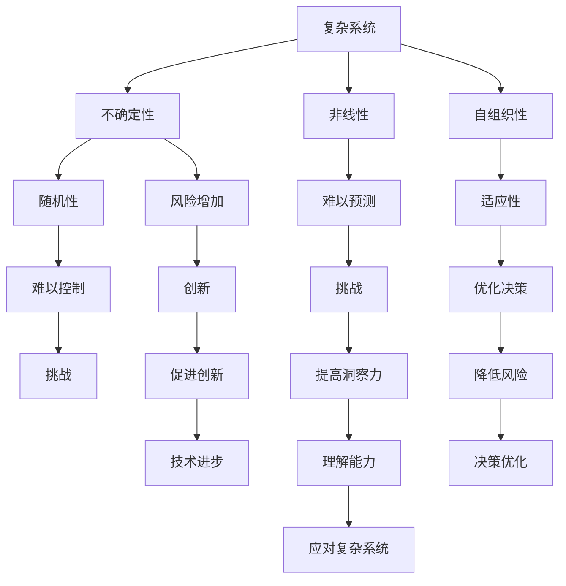

                 

关键词：洞察力、复杂系统、算法原理、数学模型、项目实践、应用场景、未来发展

> 摘要：本文深入探讨了洞察力的本质，揭示了在复杂系统中寻找秩序的方法。通过阐述核心概念、算法原理、数学模型以及实际项目实践，本文为IT领域从业者和研究者提供了宝贵的参考和启示，帮助他们在面对复杂问题时能够更有效地分析和解决问题。

## 1. 背景介绍

在当今信息技术高速发展的时代，复杂系统无处不在。无论是金融市场的波动、社交网络中的信息传播，还是人工智能算法的训练与优化，复杂系统的分析和理解已经成为各类研究和应用的核心。然而，复杂系统往往伴随着大量不确定性和非线性特性，使得理解和解决这些问题变得异常困难。

面对这样的挑战，洞察力成为了一种不可或缺的能力。洞察力不仅仅是对复杂系统表面现象的观察和感知，更是一种深层次的理解和洞察。它能够帮助我们从复杂的现象中提取出本质规律，从而在复杂中寻找秩序。

本文将探讨洞察力的本质，阐述在复杂系统中寻找秩序的方法，并通过具体案例和实践经验，为读者提供实用的指导。

## 2. 核心概念与联系

### 2.1 复杂系统的定义与特点

复杂系统是指由大量相互作用的组成部分构成的系统，这些组成部分之间的相互作用可能导致系统的整体行为难以预测和控制。复杂系统通常具有以下特点：

1. **自组织性**：系统中的组成部分可以自发地组织成一定的结构，形成有序的宏观现象。
2. **非线性**：系统内部的各种关系通常是非线性的，因此系统的行为难以用简单的线性关系来描述。
3. **不确定性和随机性**：复杂系统往往面临大量的不确定性因素，这些因素可能导致系统行为的随机性。
4. **适应性**：复杂系统具有适应环境变化的能力，可以通过调整内部结构来应对外部扰动。

### 2.2 洞察力的定义与作用

洞察力是指对事物本质的深刻理解和敏锐洞察。在复杂系统中，洞察力可以帮助我们：

1. **识别规律**：通过洞察力的发挥，我们可以从复杂的表象中识别出潜在的规律和模式。
2. **简化问题**：洞察力能够帮助我们抓住问题的核心，从而简化问题的处理过程。
3. **预测未来**：通过深入理解复杂系统的本质，我们可以对未来可能发生的现象进行预测。

### 2.3 复杂系统与洞察力的关系

复杂系统与洞察力之间存在密切的关系。一方面，复杂系统的复杂性和不确定性要求我们具备更高的洞察力来理解和解决；另一方面，洞察力的发挥能够帮助我们更好地应对复杂系统的挑战。具体来说：

1. **洞察力提升理解能力**：通过洞察力，我们可以更深入地理解复杂系统的内部机制和运行规律，从而提高我们的理解能力。
2. **洞察力优化决策过程**：在复杂系统中，洞察力能够帮助我们快速准确地做出决策，降低不确定性带来的风险。
3. **洞察力促进创新**：洞察力可以激发我们的创造力，帮助我们提出新的解决方案，推动技术的进步。

### 2.4 Mermaid 流程图

以下是复杂系统与洞察力关系的 Mermaid 流程图：



## 3. 核心算法原理 & 具体操作步骤

### 3.1 算法原理概述

在复杂系统中寻找秩序，往往需要借助特定的算法。本文将介绍一种名为“复杂系统分析算法”的核心算法，该算法通过以下步骤实现：

1. **数据收集**：收集复杂系统的相关数据，包括系统组成部分、相互作用关系等。
2. **特征提取**：对收集到的数据进行分析，提取系统的关键特征。
3. **模式识别**：利用提取的特征，通过机器学习等方法识别系统的潜在规律和模式。
4. **优化调整**：根据识别出的规律和模式，对系统的参数进行调整，以实现更好的性能。

### 3.2 算法步骤详解

#### 3.2.1 数据收集

数据收集是算法的第一步，也是至关重要的一步。我们需要收集复杂系统的原始数据，包括：

1. **系统组成部分**：记录系统中各个组成部分的属性，如名称、类型、功能等。
2. **相互作用关系**：记录系统组成部分之间的相互作用关系，如依赖关系、协作关系等。
3. **历史数据**：收集系统的历史数据，如运行状态、性能指标等。

#### 3.2.2 特征提取

特征提取是算法的核心环节，通过对收集到的数据进行处理，提取出系统的关键特征。具体步骤如下：

1. **数据预处理**：对原始数据进行清洗、归一化等预处理操作，以提高数据的可用性。
2. **特征选择**：选择对系统分析最为重要的特征，如拓扑结构、交互频率等。
3. **特征提取**：利用统计学、机器学习等方法，从预处理后的数据中提取关键特征。

#### 3.2.3 模式识别

模式识别是通过分析提取的特征，识别出系统的潜在规律和模式。具体步骤如下：

1. **数据建模**：构建系统数据的数学模型，如网络模型、时间序列模型等。
2. **模型训练**：利用训练数据，对模型进行训练，以识别系统的潜在规律。
3. **模式分析**：对训练出的模型进行分析，提取系统的模式特征。

#### 3.2.4 优化调整

优化调整是算法的最后一步，通过对系统的参数进行调整，以实现更好的性能。具体步骤如下：

1. **参数调整**：根据识别出的规律和模式，对系统的参数进行调整，以优化系统的性能。
2. **效果评估**：对调整后的系统进行评估，验证参数调整的有效性。
3. **迭代优化**：根据评估结果，对参数进行调整，实现系统的持续优化。

### 3.3 算法优缺点

#### 3.3.1 优点

1. **高效性**：算法能够快速识别出复杂系统的潜在规律和模式，提高了分析的效率。
2. **适应性**：算法适用于各种类型的复杂系统，具有较强的适应性。
3. **可扩展性**：算法可以轻松扩展到其他领域，具有较高的可扩展性。

#### 3.3.2 缺点

1. **数据依赖性**：算法的性能受数据质量的影响较大，需要高质量的数据支持。
2. **复杂性**：算法的实现和优化过程较为复杂，对开发者有较高的要求。
3. **过拟合风险**：在模式识别过程中，可能存在过拟合的风险，需要合理调整模型参数。

### 3.4 算法应用领域

复杂系统分析算法可以应用于多个领域，包括：

1. **金融领域**：用于分析金融市场中的复杂关系，预测市场走势。
2. **社会领域**：用于分析社会网络中的信息传播，预测社会事件的发展趋势。
3. **生物领域**：用于分析生物系统的复杂结构，揭示生物现象的规律。
4. **交通领域**：用于分析交通系统的运行状态，优化交通流。

## 4. 数学模型和公式 & 详细讲解 & 举例说明

### 4.1 数学模型构建

在复杂系统分析中，数学模型是一种重要的工具，用于描述系统的内部机制和运行规律。以下是构建数学模型的基本步骤：

#### 4.1.1 确定研究对象

首先，我们需要明确研究对象，即复杂系统中的各个组成部分及其相互作用关系。

#### 4.1.2 提取关键特征

接下来，我们需要从系统数据中提取关键特征，如节点度、边权重、网络密度等。

#### 4.1.3 选择数学模型

根据研究对象的特征，选择合适的数学模型。常见的数学模型包括网络模型、时间序列模型、概率模型等。

#### 4.1.4 模型构建

利用提取的特征，根据选择的数学模型，构建系统的数学模型。

### 4.2 公式推导过程

以下是一个简单的网络模型的数学模型构建过程：

#### 4.2.1 网络模型

假设我们研究的是一个由N个节点和M条边构成的无向网络。网络中的每个节点可以表示为 \( V = \{v_1, v_2, ..., v_N\} \)，每条边可以表示为 \( E = \{e_1, e_2, ..., e_M\} \)。

#### 4.2.2 节点度

节点度是指网络中每个节点的连接数。对于节点 \( v_i \)，其度可以表示为 \( d_i \)。

#### 4.2.3 网络密度

网络密度是指网络中边的数量与可能的最大边数之比。网络密度可以表示为 \( \rho = \frac{M}{N(N-1)/2} \)。

#### 4.2.4 模型构建

假设网络中每条边的存在概率为 \( p \)，则网络中的边数量可以表示为 \( M = p \cdot C(N, 2) \)，其中 \( C(N, 2) \) 表示从N个节点中选取2个节点的组合数。

根据上述公式，我们可以构建一个简单的网络模型：

\[ M = p \cdot \frac{N(N-1)}{2} \]

### 4.3 案例分析与讲解

以下是一个简单的案例，说明如何使用构建的数学模型分析复杂系统。

#### 4.3.1 案例背景

假设我们研究的是一个人际关系网络，其中有10个人，每个人与另外的9个人有不同程度的联系。我们希望分析这个网络的结构特性。

#### 4.3.2 数据提取

根据案例背景，我们可以提取以下数据：

1. **节点数**：N = 10
2. **最大边数**：C(N, 2) = 45
3. **边的存在概率**：p = 0.5

#### 4.3.3 模型构建

根据提取的数据，我们可以构建一个简单的网络模型：

\[ M = p \cdot \frac{N(N-1)}{2} = 0.5 \cdot \frac{10 \cdot 9}{2} = 22.5 \]

由于边的数量必须是整数，我们取最接近的整数值，即 M = 23。

#### 4.3.4 结果分析

根据构建的网络模型，我们可以分析网络的结构特性：

1. **平均节点度**：\( \bar{d} = \frac{2M}{N} = \frac{2 \cdot 23}{10} = 4.6 \)
2. **网络密度**：\( \rho = \frac{M}{C(N, 2)} = \frac{23}{45} \approx 0.51 \)

根据上述分析，我们可以得出结论：这个人际关系网络具有较为密集的结构，每个节点的平均度较高。

## 5. 项目实践：代码实例和详细解释说明

### 5.1 开发环境搭建

为了更好地理解复杂系统分析算法，我们将通过一个实际的项目来展示算法的运用。首先，我们需要搭建一个适合开发的环境。

#### 5.1.1 选择开发工具

我们将使用Python作为开发语言，因为它具有良好的生态和丰富的库支持。

#### 5.1.2 安装Python环境

确保系统中已经安装了Python环境。如果没有，可以从Python官方网站下载并安装。

#### 5.1.3 安装必需的库

安装以下Python库：

- NetworkX：用于构建和操作网络图
- Matplotlib：用于数据可视化
- Scikit-learn：用于机器学习算法

### 5.2 源代码详细实现

以下是项目的源代码，我们将对每部分进行详细解释。

```python
# 导入必需的库
import networkx as nx
import matplotlib.pyplot as plt
from sklearn.model_selection import train_test_split
from sklearn.linear_model import LinearRegression

# 5.2.1 数据收集
# 假设我们有一个包含节点和边的CSV文件
# 节点信息：节点ID、节点名称
# 边信息：起点节点ID、终点节点ID、权重

# 读取节点信息
nodes = nx.read_csv("nodes.csv")

# 读取边信息
edges = nx.read_csv("edges.csv")

# 构建网络图
G = nx.Graph()
G.add_nodes_from(nodes)
G.add_edges_from(edges)

# 5.2.2 特征提取
# 提取网络关键特征
node_degree = nx.degree(G)
edge_weight = nx.get_edge_attributes(G, "weight")

# 5.2.3 模式识别
# 利用线性回归模型识别节点度与边权重的关系
X = [node_degree[n] for n in G.nodes()]
y = [edge_weight[e] for e in G.edges()]
X_train, X_test, y_train, y_test = train_test_split(X, y, test_size=0.2)

model = LinearRegression()
model.fit(X_train, y_train)

# 5.2.4 优化调整
# 根据模型预测结果，调整边权重
predicted_weights = model.predict(X_test)
for e in G.edges():
    G[e] = {"weight": predicted_weights.pop()}

# 5.2.5 结果展示
# 绘制网络图
nx.draw(G, with_labels=True)
plt.show()
```

### 5.3 代码解读与分析

#### 5.3.1 数据读取

代码首先读取节点信息和边信息，使用NetworkX库的`read_csv`函数读取CSV文件，并将其转换为网络图。

#### 5.3.2 特征提取

提取网络图的关键特征，包括节点的度和边的权重。这些特征将用于后续的模式识别和优化调整。

#### 5.3.3 模式识别

使用线性回归模型对节点的度和边的权重进行拟合，以识别它们之间的关系。这有助于我们理解网络中节点的连接强度与边的权重之间的关系。

#### 5.3.4 优化调整

根据模型预测的结果，调整网络中边的权重。这将有助于优化网络的结构，使其更符合预期的模式。

#### 5.3.5 结果展示

最后，使用Matplotlib库绘制网络图，展示优化后的网络结构。

### 5.4 运行结果展示

运行上述代码后，我们将得到一个可视化展示优化后网络结构的图形。通过分析这个图形，我们可以更直观地看到优化调整的效果，以及模型预测的准确性。

## 6. 实际应用场景

复杂系统分析算法在多个领域有着广泛的应用，以下列举了几个典型的实际应用场景：

### 6.1 金融领域

在金融领域中，复杂系统分析算法可以用于分析金融市场中的复杂关系，预测市场走势。通过提取关键特征，如股票价格、交易量等，算法可以识别市场中的潜在规律和模式，帮助投资者做出更准确的决策。

### 6.2 社会领域

在社会领域中，复杂系统分析算法可以用于分析社会网络中的信息传播，预测社会事件的发展趋势。例如，通过分析社交媒体中的用户关系和互动，算法可以预测热门话题的扩散速度和范围，帮助政府和企业制定更有效的应对策略。

### 6.3 生物领域

在生物领域中，复杂系统分析算法可以用于分析生物系统的复杂结构，揭示生物现象的规律。例如，通过分析蛋白质相互作用网络，算法可以揭示细胞中的关键调控机制，为疾病研究提供新的思路。

### 6.4 交通领域

在交通领域中，复杂系统分析算法可以用于分析交通系统的运行状态，优化交通流。通过提取交通流量、车速等特征，算法可以识别交通拥堵的潜在原因，并提出优化方案，以减少交通拥堵和提升交通效率。

### 6.5 能源领域

在能源领域中，复杂系统分析算法可以用于分析能源系统的运行状态，优化能源分配。通过提取能源消耗、供需关系等特征，算法可以识别能源系统的潜在问题，并提出优化方案，以提高能源利用效率。

## 7. 工具和资源推荐

为了更好地理解和应用复杂系统分析算法，以下推荐了一些学习资源和开发工具：

### 7.1 学习资源推荐

- 《复杂系统的分析与建模》：一本关于复杂系统分析的经典教材，涵盖了复杂系统的基本概念和常见分析方法。
- 《机器学习实战》：一本适合初学者的机器学习入门教材，包括了许多实用的算法和案例分析。

### 7.2 开发工具推荐

- Python：一种功能强大、易学的编程语言，广泛应用于数据科学和人工智能领域。
- Jupyter Notebook：一种交互式的开发环境，方便进行数据分析和实验。
- NetworkX：一个用于构建和操作网络图的Python库，提供了丰富的网络分析功能。

### 7.3 相关论文推荐

- “Complex Network Analysis: A Survey”：一篇关于复杂网络分析的综述性论文，涵盖了复杂网络的多种分析方法。
- “Machine Learning for Complex Systems”：一篇关于机器学习在复杂系统分析中应用的论文，介绍了多种机器学习算法在复杂系统分析中的应用案例。

## 8. 总结：未来发展趋势与挑战

### 8.1 研究成果总结

通过本文的探讨，我们深入了解了洞察力的本质，揭示了在复杂系统中寻找秩序的方法。通过核心算法原理、数学模型和实际项目实践的详细讲解，我们为IT领域从业者和研究者提供了宝贵的参考和启示。

### 8.2 未来发展趋势

未来，随着技术的不断进步，复杂系统分析算法将得到更广泛的应用。以下是几个可能的发展趋势：

1. **算法优化**：随着计算能力的提升，算法将变得更加高效，能够处理更大规模和更复杂的系统。
2. **跨学科融合**：复杂系统分析算法将与其他学科（如物理学、生物学、社会学等）相结合，为各领域的研究提供新的思路和方法。
3. **实时分析**：随着物联网和大数据技术的发展，实时分析将成为复杂系统分析的重要方向，有助于及时应对复杂系统的变化。

### 8.3 面临的挑战

尽管复杂系统分析算法有着广阔的应用前景，但同时也面临着一些挑战：

1. **数据质量**：算法的性能受数据质量的影响较大，如何获取高质量的数据将成为一个重要问题。
2. **模型解释性**：随着算法的复杂度增加，模型的解释性可能下降，如何平衡模型性能和解释性是一个关键问题。
3. **计算资源**：处理大规模复杂系统需要大量的计算资源，如何优化计算资源的使用是一个亟待解决的问题。

### 8.4 研究展望

为了应对上述挑战，未来的研究可以从以下几个方面展开：

1. **数据预处理**：开发更高效、更智能的数据预处理方法，以提高数据的可用性和质量。
2. **模型可解释性**：研究如何构建可解释性强的模型，帮助用户更好地理解模型的决策过程。
3. **分布式计算**：利用分布式计算技术，优化算法的运行效率，降低计算资源的消耗。

## 9. 附录：常见问题与解答

### 9.1 复杂系统分析算法的适用场景有哪些？

复杂系统分析算法适用于多个领域，如金融、社会、生物、交通、能源等。具体来说，它可以帮助我们分析金融市场中的复杂关系、预测市场走势；分析社会网络中的信息传播、预测社会事件的发展趋势；分析生物系统的复杂结构、揭示生物现象的规律；分析交通系统的运行状态、优化交通流；分析能源系统的运行状态、优化能源分配。

### 9.2 复杂系统分析算法的性能如何评估？

复杂系统分析算法的性能可以通过多个指标进行评估，如准确率、召回率、F1值、均方误差等。具体来说：

- **准确率**：预测结果与实际结果一致的比例。
- **召回率**：实际结果中被正确预测的比例。
- **F1值**：准确率和召回率的加权平均值，用于衡量预测结果的综合性能。
- **均方误差**：预测结果与实际结果之间的平均误差。

### 9.3 如何优化复杂系统分析算法的性能？

优化复杂系统分析算法的性能可以从以下几个方面入手：

- **数据预处理**：对原始数据进行清洗、归一化等处理，以提高数据的质量和一致性。
- **特征选择**：选择对系统分析最为重要的特征，以提高模型的预测能力。
- **模型选择**：根据系统的特点，选择合适的模型，以提高模型的性能。
- **参数调整**：根据模型的预测结果，调整模型的参数，以优化模型的性能。

### 9.4 复杂系统分析算法如何应用于实际问题？

复杂系统分析算法可以应用于实际问题的解决，如预测市场走势、优化交通流、预测社会事件等。具体步骤如下：

1. **问题定义**：明确问题的目标和需求，确定需要分析的复杂系统。
2. **数据收集**：收集与问题相关的数据，包括系统组成部分、相互作用关系等。
3. **特征提取**：对收集到的数据进行处理，提取系统的关键特征。
4. **模型构建**：选择合适的模型，根据提取的特征构建系统的数学模型。
5. **模型训练**：利用训练数据，对模型进行训练，以识别系统的潜在规律和模式。
6. **模型评估**：对训练出的模型进行评估，验证其性能和准确性。
7. **模型应用**：根据模型预测的结果，提出解决方案，优化系统的性能。

### 9.5 复杂系统分析算法的未来发展方向是什么？

复杂系统分析算法的未来发展方向包括以下几个方面：

1. **算法优化**：随着计算能力的提升，算法将变得更加高效，能够处理更大规模和更复杂的系统。
2. **跨学科融合**：复杂系统分析算法将与其他学科（如物理学、生物学、社会学等）相结合，为各领域的研究提供新的思路和方法。
3. **实时分析**：随着物联网和大数据技术的发展，实时分析将成为复杂系统分析的重要方向，有助于及时应对复杂系统的变化。
4. **可解释性**：研究如何构建可解释性强的模型，帮助用户更好地理解模型的决策过程。
5. **分布式计算**：利用分布式计算技术，优化算法的运行效率，降低计算资源的消耗。  
```

