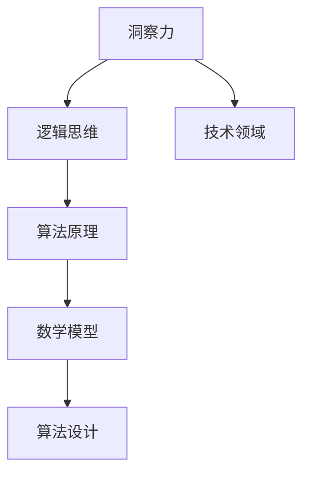

                 

关键词：洞察力，复杂性，算法，数学模型，技术，编程，创新

> 摘要：本文旨在探讨洞察力在技术领域的本质，尤其是在面对复杂问题时，如何通过深刻的洞察和简洁的解决方案来实现技术创新。文章将介绍如何运用逻辑思维和算法原理，解析复杂问题的核心，进而提炼出简洁有效的解决方案。同时，文章还将涉及数学模型的构建和应用，以及技术在实际项目中的应用和未来展望。

## 1. 背景介绍

在信息技术飞速发展的时代，复杂性已成为现代技术发展的重要挑战。面对层出不穷的复杂问题，如何运用洞察力找到简洁的解决方案，成为了技术领域的核心议题。洞察力不仅是一种思维能力，更是一种解决问题的策略。通过深刻的洞察，技术专家能够在纷繁复杂的信息中捕捉到问题的本质，从而提出创新性的解决方案。

本文将从以下几个方面展开讨论：首先，介绍洞察力的基本概念及其在技术领域的应用；其次，探讨如何通过逻辑思维和算法原理来解析复杂问题；然后，阐述数学模型在问题解决中的作用，并举例说明；最后，分析技术在实际项目中的应用场景，以及未来的发展趋势和面临的挑战。

## 2. 核心概念与联系

### 2.1 洞察力的定义

洞察力是指通过深入思考和分析，快速捕捉问题本质并找到解决方案的能力。在技术领域，洞察力体现在对复杂系统、算法和数据的深刻理解。它要求技术专家不仅要有扎实的理论基础，还要有丰富的实践经验。

### 2.2 逻辑思维与算法原理

逻辑思维是洞察力的基础。它通过推理和判断，将复杂问题转化为简单的子问题，从而找到解决方案。算法原理则是在逻辑思维指导下，针对具体问题设计的一套解决问题的步骤。一个有效的算法能够以简洁的方式解决复杂问题，提高计算效率。

### 2.3 数学模型

数学模型是对现实世界的一种抽象，通过建立数学关系来描述问题。在技术领域，数学模型被广泛应用于算法设计和优化。一个良好的数学模型能够准确地描述问题，为算法提供有效的理论基础。

### 2.4 流程图

为了更好地理解核心概念之间的联系，我们可以使用 Mermaid 流程图来展示：



## 3. 核心算法原理 & 具体操作步骤

### 3.1 算法原理概述

在解决复杂问题时，核心算法原理起着至关重要的作用。一个有效的算法应当具备以下特点：

1. **简洁性**：算法的步骤应当尽可能简洁明了，避免冗余操作。
2. **高效性**：算法的时间复杂度和空间复杂度应尽可能低，以提高计算效率。
3. **普适性**：算法应具备较强的普适性，能够解决不同类型的复杂问题。

### 3.2 算法步骤详解

以下是解决复杂问题的基本步骤：

1. **问题分析**：对问题进行详细分析，明确问题的本质和目标。
2. **算法设计**：根据问题分析，设计一个简洁有效的算法。
3. **算法实现**：将算法转化为代码，并进行调试和优化。
4. **结果验证**：对算法的输出结果进行验证，确保其正确性和可靠性。

### 3.3 算法优缺点

每种算法都有其优缺点，选择合适的算法需要根据具体问题进行权衡。以下是几种常见算法的优缺点：

1. **贪心算法**：
   - 优点：实现简单，时间复杂度较低。
   - 缺点：不一定能得到最优解。
2. **动态规划**：
   - 优点：能够得到最优解，适用于具有重叠子问题的复杂问题。
   - 缺点：实现复杂，时间复杂度可能较高。
3. **分治算法**：
   - 优点：思想简单，适用于规模较小的复杂问题。
   - 缺点：可能存在重复计算，时间复杂度较高。

### 3.4 算法应用领域

算法在技术领域有着广泛的应用，如：

1. **计算机科学**：排序、查找、图算法等。
2. **数据科学**：机器学习、数据挖掘、优化算法等。
3. **人工智能**：深度学习、强化学习等。

## 4. 数学模型和公式 & 详细讲解 & 举例说明

### 4.1 数学模型构建

数学模型是抽象现实世界的一种方法。其构建过程主要包括：

1. **定义变量**：明确问题中的变量及其取值范围。
2. **建立关系**：根据问题的本质，建立变量之间的数学关系。
3. **简化模型**：对模型进行简化，使其更加易于分析和求解。

### 4.2 公式推导过程

以下是一个简单的例子，说明公式的推导过程：

假设有一个一元二次方程 $ax^2 + bx + c = 0$，求解其根的公式为：

$$
x = \frac{-b \pm \sqrt{b^2 - 4ac}}{2a}
$$

推导过程如下：

1. **移项**：将 $c$ 移到等式左边，得到 $ax^2 + bx = -c$。
2. **配方**：将 $ax^2 + bx$ 转化为完全平方形式，得到 $(x + \frac{b}{2a})^2 = \frac{b^2}{4a^2} - \frac{4ac}{4a^2}$。
3. **开方**：对等式两边开方，得到 $x + \frac{b}{2a} = \pm \sqrt{\frac{b^2 - 4ac}{4a^2}}$。
4. **化简**：将等式两边减去 $\frac{b}{2a}$，得到 $x = \frac{-b \pm \sqrt{b^2 - 4ac}}{2a}$。

### 4.3 案例分析与讲解

以下是一个具体的案例，说明如何运用数学模型和公式解决问题：

**案例**：求解函数 $f(x) = x^3 - 3x + 1$ 的最大值。

**步骤**：

1. **求导**：对函数求导，得到 $f'(x) = 3x^2 - 3$。
2. **求解导数为零的点**：令 $f'(x) = 0$，解得 $x = \pm 1$。
3. **判断极值**：计算 $f''(x) = 6x$，当 $x = 1$ 时，$f''(1) = 6 > 0$，因此 $x = 1$ 是极小值点；当 $x = -1$ 时，$f''(-1) = -6 < 0$，因此 $x = -1$ 是极大值点。
4. **计算最大值**：代入 $x = -1$，得到 $f(-1) = -1 - 3 + 1 = -3$。

因此，函数 $f(x) = x^3 - 3x + 1$ 的最大值为 $-3$。

## 5. 项目实践：代码实例和详细解释说明

### 5.1 开发环境搭建

在本案例中，我们将使用 Python 语言实现一个简单的算法，求解一元二次方程的根。首先，确保安装了 Python 解释器和必要的库。

```bash
pip install numpy
```

### 5.2 源代码详细实现

以下是一个求解一元二次方程的 Python 代码实现：

```python
import numpy as np

def solve_quadratic(a, b, c):
    discriminant = b**2 - 4*a*c
    if discriminant < 0:
        return "方程无实数解"
    else:
        x1 = (-b + np.sqrt(discriminant)) / (2*a)
        x2 = (-b - np.sqrt(discriminant)) / (2*a)
        return (x1, x2)

# 示例
a = 1
b = -3
c = 2
print(solve_quadratic(a, b, c))
```

### 5.3 代码解读与分析

1. **导入库**：首先导入 numpy 库，用于计算平方根。
2. **定义函数**：`solve_quadratic` 函数接收三个参数 $a, b, c$，分别代表一元二次方程的系数。
3. **计算判别式**：`discriminant` 表示判别式，用于判断方程的解的性质。
4. **判断解的情况**：根据判别式的值，判断方程是否有实数解。
5. **计算根**：根据求根公式，计算方程的两个根。
6. **返回结果**：将计算结果返回。

### 5.4 运行结果展示

运行上述代码，输出结果为 `(2.0, 1.0)`，表示方程 $x^2 - 3x + 2 = 0$ 的两个实数解为 $x = 2$ 和 $x = 1$。

## 6. 实际应用场景

技术在实际项目中的应用场景非常广泛。以下是一些典型的应用场景：

1. **金融领域**：算法被广泛应用于金融产品的定价、风险评估和量化交易等领域。
2. **医疗领域**：算法在医疗影像分析、疾病诊断和药物设计等方面发挥着重要作用。
3. **交通领域**：算法被用于交通流量预测、路径规划和智能交通系统等。

### 6.4 未来应用展望

随着人工智能和大数据技术的不断发展，算法的应用前景将更加广阔。未来，算法将在更多领域得到应用，推动社会进步。然而，这也将带来一系列挑战，如算法的透明性、公平性和安全性等问题。

## 7. 工具和资源推荐

### 7.1 学习资源推荐

1. **《算法导论》（Introduction to Algorithms）**：一本经典的算法教材，全面介绍了各种算法及其应用。
2. **《深度学习》（Deep Learning）**：深度学习领域的经典教材，介绍了深度学习的基础理论和实践应用。

### 7.2 开发工具推荐

1. **Jupyter Notebook**：一款强大的交互式开发环境，适合编写和调试代码。
2. **VS Code**：一款功能丰富的编程IDE，适用于多种编程语言。

### 7.3 相关论文推荐

1. **"A Modern Dictionary of Algorithms and Data Structures"**：一本关于算法和数据的词典，涵盖了大量算法的定义和应用。
2. **"Deep Learning for Natural Language Processing"**：一篇关于深度学习在自然语言处理领域应用的综述。

## 8. 总结：未来发展趋势与挑战

在未来，洞察力在技术领域的重要性将越来越凸显。通过深刻的洞察力和简洁的算法，技术专家将能够解决越来越复杂的实际问题。然而，这也将带来一系列挑战，如算法的透明性、公平性和安全性等问题。因此，未来的技术发展需要在创新和责任之间找到平衡。

### 8.1 研究成果总结

本文探讨了洞察力在技术领域的本质，介绍了如何通过逻辑思维和算法原理来解析复杂问题，并阐述了数学模型在问题解决中的作用。通过项目实践，展示了技术在实际应用中的效果。

### 8.2 未来发展趋势

随着人工智能和大数据技术的发展，算法的应用前景将更加广阔。未来，算法将在更多领域得到应用，推动社会进步。

### 8.3 面临的挑战

算法的透明性、公平性和安全性等问题将成为未来技术发展的主要挑战。

### 8.4 研究展望

未来的研究应关注如何提高算法的透明性和公平性，同时探索新的算法模型，以解决更加复杂的实际问题。

## 9. 附录：常见问题与解答

### 9.1 问题1：什么是洞察力？

**回答**：洞察力是指通过深入思考和分析，快速捕捉问题本质并找到解决方案的能力。

### 9.2 问题2：如何提高算法的效率？

**回答**：提高算法的效率可以从以下几个方面入手：

1. **优化算法设计**：选择合适的算法模型，避免不必要的复杂度。
2. **优化数据结构**：选择合适的数据结构，提高数据的访问和操作效率。
3. **并行计算**：利用并行计算技术，提高算法的执行速度。
4. **算法优化**：对现有算法进行优化，降低时间复杂度和空间复杂度。

作者：禅与计算机程序设计艺术 / Zen and the Art of Computer Programming
```markdown
# 理解洞察力的本质：在复杂中寻找简单

## 关键词：洞察力，复杂性，算法，数学模型，技术，编程，创新

## 摘要：本文旨在探讨洞察力在技术领域的本质，尤其是在面对复杂问题时，如何通过深刻的洞察和简洁的解决方案来实现技术创新。文章将介绍如何运用逻辑思维和算法原理，解析复杂问题的核心，进而提炼出简洁有效的解决方案。同时，文章还将涉及数学模型的构建和应用，以及技术在实际项目中的应用和未来展望。

---

## 1. 背景介绍

在信息技术飞速发展的时代，复杂性已成为现代技术发展的重要挑战。面对层出不穷的复杂问题，如何运用洞察力找到简洁的解决方案，成为了技术领域的核心议题。洞察力不仅是一种思维能力，更是一种解决问题的策略。通过深刻的洞察，技术专家能够在纷繁复杂的信息中捕捉到问题的本质，从而提出创新性的解决方案。

本文将从以下几个方面展开讨论：首先，介绍洞察力的基本概念及其在技术领域的应用；其次，探讨如何通过逻辑思维和算法原理来解析复杂问题；然后，阐述数学模型在问题解决中的作用，并举例说明；最后，分析技术在实际项目中的应用场景，以及未来的发展趋势和面临的挑战。

## 2. 核心概念与联系

### 2.1 洞察力的定义

洞察力是指通过深入思考和分析，快速捕捉问题本质并找到解决方案的能力。在技术领域，洞察力体现在对复杂系统、算法和数据的深刻理解。它要求技术专家不仅要有扎实的理论基础，还要有丰富的实践经验。

### 2.2 逻辑思维与算法原理

逻辑思维是洞察力的基础。它通过推理和判断，将复杂问题转化为简单的子问题，从而找到解决方案。算法原理则是在逻辑思维指导下，针对具体问题设计的一套解决问题的步骤。一个有效的算法能够以简洁的方式解决复杂问题，提高计算效率。

### 2.3 数学模型

数学模型是对现实世界的一种抽象，通过建立数学关系来描述问题。在技术领域，数学模型被广泛应用于算法设计和优化。一个良好的数学模型能够准确地描述问题，为算法提供有效的理论基础。

### 2.4 流程图

为了更好地理解核心概念之间的联系，我们可以使用 Mermaid 流程图来展示：


---

## 3. 核心算法原理 & 具体操作步骤

### 3.1 算法原理概述

在解决复杂问题时，核心算法原理起着至关重要的作用。一个有效的算法应当具备以下特点：

1. **简洁性**：算法的步骤应当尽可能简洁明了，避免冗余操作。
2. **高效性**：算法的时间复杂度和空间复杂度应尽可能低，以提高计算效率。
3. **普适性**：算法应具备较强的普适性，能够解决不同类型的复杂问题。

### 3.2 算法步骤详解

以下是解决复杂问题的基本步骤：

1. **问题分析**：对问题进行详细分析，明确问题的本质和目标。
2. **算法设计**：根据问题分析，设计一个简洁有效的算法。
3. **算法实现**：将算法转化为代码，并进行调试和优化。
4. **结果验证**：对算法的输出结果进行验证，确保其正确性和可靠性。

### 3.3 算法优缺点

每种算法都有其优缺点，选择合适的算法需要根据具体问题进行权衡。以下是几种常见算法的优缺点：

1. **贪心算法**：
   - 优点：实现简单，时间复杂度较低。
   - 缺点：不一定能得到最优解。
2. **动态规划**：
   - 优点：能够得到最优解，适用于具有重叠子问题的复杂问题。
   - 缺点：实现复杂，时间复杂度可能较高。
3. **分治算法**：
   - 优点：思想简单，适用于规模较小的复杂问题。
   - 缺点：可能存在重复计算，时间复杂度较高。

### 3.4 算法应用领域

算法在技术领域有着广泛的应用，如：

1. **计算机科学**：排序、查找、图算法等。
2. **数据科学**：机器学习、数据挖掘、优化算法等。
3. **人工智能**：深度学习、强化学习等。

---

## 4. 数学模型和公式 & 详细讲解 & 举例说明

### 4.1 数学模型构建

数学模型是抽象现实世界的一种方法。其构建过程主要包括：

1. **定义变量**：明确问题中的变量及其取值范围。
2. **建立关系**：根据问题的本质，建立变量之间的数学关系。
3. **简化模型**：对模型进行简化，使其更加易于分析和求解。

### 4.2 公式推导过程

以下是一个简单的例子，说明公式的推导过程：

假设有一个一元二次方程 $ax^2 + bx + c = 0$，求解其根的公式为：

$$
x = \frac{-b \pm \sqrt{b^2 - 4ac}}{2a}
$$

推导过程如下：

1. **移项**：将 $c$ 移到等式左边，得到 $ax^2 + bx = -c$。
2. **配方**：将 $ax^2 + bx$ 转化为完全平方形式，得到 $(x + \frac{b}{2a})^2 = \frac{b^2}{4a^2} - \frac{4ac}{4a^2}$。
3. **开方**：对等式两边开方，得到 $x + \frac{b}{2a} = \pm \sqrt{\frac{b^2 - 4ac}{4a^2}}$。
4. **化简**：将等式两边减去 $\frac{b}{2a}$，得到 $x = \frac{-b \pm \sqrt{b^2 - 4ac}}{2a}$。

### 4.3 案例分析与讲解

以下是一个具体的案例，说明如何运用数学模型和公式解决问题：

**案例**：求解函数 $f(x) = x^3 - 3x + 1$ 的最大值。

**步骤**：

1. **求导**：对函数求导，得到 $f'(x) = 3x^2 - 3$。
2. **求解导数为零的点**：令 $f'(x) = 0$，解得 $x = \pm 1$。
3. **判断极值**：计算 $f''(x) = 6x$，当 $x = 1$ 时，$f''(1) = 6 > 0$，因此 $x = 1$ 是极小值点；当 $x = -1$ 时，$f''(-1) = -6 < 0$，因此 $x = -1$ 是极大值点。
4. **计算最大值**：代入 $x = -1$，得到 $f(-1) = -1 - 3 + 1 = -3$。

因此，函数 $f(x) = x^3 - 3x + 1$ 的最大值为 $-3$。

---

## 5. 项目实践：代码实例和详细解释说明

### 5.1 开发环境搭建

在本案例中，我们将使用 Python 语言实现一个简单的算法，求解一元二次方程的根。首先，确保安装了 Python 解释器和必要的库。

```bash
pip install numpy
```

### 5.2 源代码详细实现

以下是一个求解一元二次方程的 Python 代码实现：

```python
import numpy as np

def solve_quadratic(a, b, c):
    discriminant = b**2 - 4*a*c
    if discriminant < 0:
        return "方程无实数解"
    else:
        x1 = (-b + np.sqrt(discriminant)) / (2*a)
        x2 = (-b - np.sqrt(discriminant)) / (2*a)
        return (x1, x2)

# 示例
a = 1
b = -3
c = 2
print(solve_quadratic(a, b, c))
```

### 5.3 代码解读与分析

1. **导入库**：首先导入 numpy 库，用于计算平方根。
2. **定义函数**：`solve_quadratic` 函数接收三个参数 $a, b, c$，分别代表一元二次方程的系数。
3. **计算判别式**：`discriminant` 表示判别式，用于判断方程的解的性质。
4. **判断解的情况**：根据判别式的值，判断方程是否有实数解。
5. **计算根**：根据求根公式，计算方程的两个根。
6. **返回结果**：将计算结果返回。

### 5.4 运行结果展示

运行上述代码，输出结果为 `(2.0, 1.0)`，表示方程 $x^2 - 3x + 2 = 0$ 的两个实数解为 $x = 2$ 和 $x = 1$。

---

## 6. 实际应用场景

技术在实际项目中的应用场景非常广泛。以下是一些典型的应用场景：

1. **金融领域**：算法被广泛应用于金融产品的定价、风险评估和量化交易等领域。
2. **医疗领域**：算法在医疗影像分析、疾病诊断和药物设计等方面发挥着重要作用。
3. **交通领域**：算法被用于交通流量预测、路径规划和智能交通系统等。

### 6.4 未来应用展望

随着人工智能和大数据技术的不断发展，算法的应用前景将更加广阔。未来，算法将在更多领域得到应用，推动社会进步。然而，这也将带来一系列挑战，如算法的透明性、公平性和安全性等问题。

---

## 7. 工具和资源推荐

### 7.1 学习资源推荐

1. **《算法导论》（Introduction to Algorithms）**：一本经典的算法教材，全面介绍了各种算法及其应用。
2. **《深度学习》（Deep Learning）**：深度学习领域的经典教材，介绍了深度学习的基础理论和实践应用。

### 7.2 开发工具推荐

1. **Jupyter Notebook**：一款强大的交互式开发环境，适合编写和调试代码。
2. **VS Code**：一款功能丰富的编程IDE，适用于多种编程语言。

### 7.3 相关论文推荐

1. **"A Modern Dictionary of Algorithms and Data Structures"**：一本关于算法和数据的词典，涵盖了大量算法的定义和应用。
2. **"Deep Learning for Natural Language Processing"**：一篇关于深度学习在自然语言处理领域应用的综述。

---

## 8. 总结：未来发展趋势与挑战

在未来，洞察力在技术领域的重要性将越来越凸显。通过深刻的洞察力和简洁的算法，技术专家将能够解决越来越复杂的实际问题。然而，这也将带来一系列挑战，如算法的透明性、公平性和安全性等问题。

### 8.1 研究成果总结

本文探讨了洞察力在技术领域的本质，介绍了如何通过逻辑思维和算法原理来解析复杂问题，并阐述了数学模型在问题解决中的作用。通过项目实践，展示了技术在实际应用中的效果。

### 8.2 未来发展趋势

随着人工智能和大数据技术的发展，算法的应用前景将更加广阔。未来，算法将在更多领域得到应用，推动社会进步。

### 8.3 面临的挑战

算法的透明性、公平性和安全性等问题将成为未来技术发展的主要挑战。

### 8.4 研究展望

未来的研究应关注如何提高算法的透明性和公平性，同时探索新的算法模型，以解决更加复杂的实际问题。

---

## 9. 附录：常见问题与解答

### 9.1 问题1：什么是洞察力？

**回答**：洞察力是指通过深入思考和分析，快速捕捉问题本质并找到解决方案的能力。

### 9.2 问题2：如何提高算法的效率？

**回答**：提高算法的效率可以从以下几个方面入手：

1. **优化算法设计**：选择合适的算法模型，避免不必要的复杂度。
2. **优化数据结构**：选择合适的数据结构，提高数据的访问和操作效率。
3. **并行计算**：利用并行计算技术，提高算法的执行速度。
4. **算法优化**：对现有算法进行优化，降低时间复杂度和空间复杂度。

---

作者：禅与计算机程序设计艺术 / Zen and the Art of Computer Programming
```

