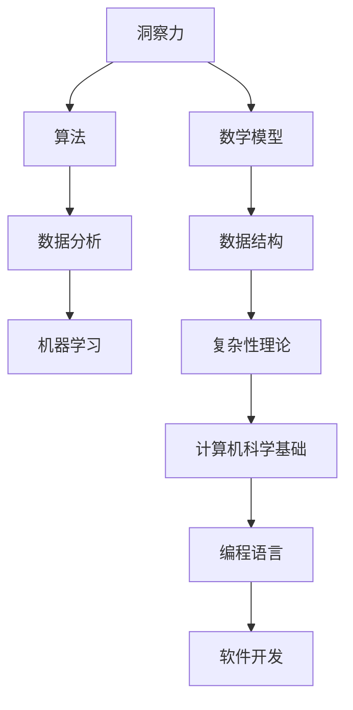

                 

关键词：洞察力、复杂性、规律、算法、数学模型、技术博客、计算机科学

> 摘要：本文旨在探讨洞察力的本质，通过分析复杂性问题，阐述如何在复杂系统中寻找规律。我们将结合计算机科学中的核心算法原理，以及数学模型和具体代码实例，帮助读者深入理解洞察力在实际应用中的重要性。

## 1. 背景介绍

在现代科技日新月异的发展背景下，计算机科学已经成为推动社会进步的重要力量。从简单的数据处理到复杂的机器学习算法，计算机技术在各行各业中发挥着越来越重要的作用。然而，面对日益复杂的系统，如何找到其中的规律，实现高效问题的求解，成为了一个具有挑战性的课题。这种挑战不仅需要扎实的计算机科学基础，更需要具有敏锐洞察力的思维。

洞察力，是指人们在面对复杂问题时，能够迅速识别核心问题，找到解决方案的能力。在计算机科学中，这种能力尤为重要。例如，在算法设计过程中，如何从大量的数据中找到最优解，如何从复杂的逻辑关系中理清头绪，这些都是对程序员洞察力的考验。

本文将围绕洞察力的本质，结合计算机科学中的核心算法原理，探讨如何在实际问题中寻找规律，提高解决问题的效率。文章结构如下：

- **背景介绍**：简要介绍洞察力在计算机科学中的重要性。
- **核心概念与联系**：通过Mermaid流程图阐述相关概念和架构。
- **核心算法原理 & 具体操作步骤**：详细讲解算法原理和步骤，分析优缺点及应用领域。
- **数学模型和公式 & 详细讲解 & 举例说明**：构建数学模型，推导公式，通过案例进行分析。
- **项目实践：代码实例和详细解释说明**：提供实际代码实现和解读。
- **实际应用场景**：讨论算法在不同领域的应用。
- **未来应用展望**：预测未来发展趋势和挑战。
- **工具和资源推荐**：推荐相关学习资源和开发工具。
- **总结：未来发展趋势与挑战**：总结研究成果，展望未来方向。

## 2. 核心概念与联系

在探讨洞察力的本质之前，我们需要明确几个核心概念。以下是使用Mermaid流程图（Mermaid 流程节点中不要有括号、逗号等特殊字符）展示的相关概念和架构：



### 2.1 洞察力

洞察力是指人们在面对复杂问题时，能够迅速识别关键点，找到解决方案的能力。在计算机科学中，这种能力体现在以下几个方面：

- **算法优化**：在给定问题场景下，能够选择合适的算法，并对其进行优化，提高运行效率。
- **数据处理**：能够从海量数据中提取有效信息，进行有效分析和利用。
- **系统架构**：能够从整体上把握系统的结构和运行机制，设计出高效稳定的系统架构。

### 2.2 算法

算法是解决问题的一系列步骤和规则。算法的设计和优化直接关系到问题的解决效率和效果。以下是几种常见的算法类型：

- **排序算法**：如快速排序、归并排序、冒泡排序等。
- **搜索算法**：如二分搜索、深度优先搜索、广度优先搜索等。
- **动态规划**：适用于具有重叠子问题和最优子结构特征的问题。

### 2.3 数学模型

数学模型是对现实问题进行简化和抽象，通过数学语言描述和分析问题。常见的数学模型包括：

- **线性模型**：如线性回归、线性规划等。
- **非线性模型**：如逻辑回归、神经网络等。

### 2.4 数据结构

数据结构是组织和管理数据的方式。合理的数据结构能够提高数据处理和存储的效率。常见的数据结构包括：

- **数组**：用于存储有序的数据集合。
- **链表**：用于存储线性序列的数据。
- **树**：用于存储具有层次关系的数据。
- **图**：用于存储具有复杂关系的数据。

### 2.5 复杂性理论

复杂性理论是研究问题复杂度的科学。根据复杂性理论，问题可以分为多项式时间问题和非多项式时间问题。了解问题的复杂度对于算法设计和选择具有重要意义。

## 3. 核心算法原理 & 具体操作步骤

### 3.1 算法原理概述

在本章节中，我们将介绍几种核心算法原理，并探讨其具体操作步骤。

### 3.2 算法步骤详解

#### 3.2.1 快速排序

快速排序是一种高效的排序算法。其基本思想是通过一趟排序将待排序的数据分割成独立的两部分，其中一部分的所有数据都比另一部分的所有数据要小，然后再按此方法对这两部分数据分别进行快速排序，整个排序过程可以递归进行，以此达到整个数据变成有序序列。

具体步骤如下：

1. 选择一个基准元素。
2. 将数组分为两部分，一部分小于基准元素，另一部分大于基准元素。
3. 对两部分分别进行快速排序。
4. 递归执行上述步骤，直至整个数组有序。

#### 3.2.2 深度优先搜索

深度优先搜索（DFS）是一种用于遍历或搜索树或图的算法。其基本思想是从根节点开始，沿着一条路径一直走到底，如果该路径走不通，则回溯到上一个节点，再选择另一条路径继续探索。

具体步骤如下：

1. 访问当前节点。
2. 标记当前节点为已访问。
3. 对当前节点的所有未访问的子节点进行递归访问。
4. 递归执行上述步骤，直至所有节点都被访问。

#### 3.2.3 动态规划

动态规划是一种用于解决具有重叠子问题和最优子结构特征的问题的算法。其基本思想是将原问题分解为多个子问题，并存储已解决的子问题的解，避免重复计算。

具体步骤如下：

1. 确定问题的状态和状态转移方程。
2. 确定最优子结构的性质。
3. 从基础状态开始，递推计算得到最终状态。
4. 根据计算结果，得到原问题的最优解。

### 3.3 算法优缺点

#### 3.3.1 快速排序

- **优点**：时间复杂度较低，平均情况下为 $O(n\log n)$。
- **缺点**：最坏情况下时间复杂度为 $O(n^2)$，且空间复杂度较高。

#### 3.3.2 深度优先搜索

- **优点**：可以找到解的路径，适用于图和树的遍历。
- **缺点**：在图中有环时可能导致无限循环。

#### 3.3.3 动态规划

- **优点**：可以高效地解决具有重叠子问题和最优子结构特征的问题。
- **缺点**：实现复杂，需要明确状态和状态转移方程。

### 3.4 算法应用领域

快速排序、深度优先搜索和动态规划在计算机科学中有着广泛的应用：

- **快速排序**：常用于排序和查找问题。
- **深度优先搜索**：常用于图的遍历、拓扑排序和最短路径问题。
- **动态规划**：常用于优化问题，如背包问题、最长公共子序列等。

## 4. 数学模型和公式 & 详细讲解 & 举例说明

### 4.1 数学模型构建

在本章节中，我们将构建一个简单的数学模型，用于分析一个常见的问题。

### 4.2 公式推导过程

#### 4.2.1 最小生成树

假设有一个无向图 $G=(V, E)$，我们需要找到一个最小生成树。最小生成树是一个包含图中所有顶点的、无环的、连通子图。

根据Prim算法，我们可以使用以下公式计算最小生成树的总权值：

$$
W(T) = \sum_{(u, v) \in T} w(u, v)
$$

其中，$T$ 是最小生成树，$w(u, v)$ 是边 $(u, v)$ 的权值。

#### 4.2.2 最大流

假设有一个网络流图 $G=(V, E)$，我们需要找到一个最大流。最大流是一个从源点 $s$ 到汇点 $t$ 的流，使得每个边的流量不超过其容量。

根据Ford-Fulkerson算法，我们可以使用以下公式计算最大流：

$$
f = \min \{ c(u, v) | (u, v) \in E, f < c(u, v) \}
$$

其中，$f$ 是当前流的流量，$c(u, v)$ 是边 $(u, v)$ 的容量。

### 4.3 案例分析与讲解

#### 4.3.1 最小生成树

假设我们有一个图，其中顶点和边的权值如下：

```
A--(2)-->B
|        |
(3)     (4)
|        |
C--(5)-->D
```

我们需要计算最小生成树的总权值。

根据Prim算法，我们可以选择顶点A作为起点，然后按照以下步骤进行计算：

1. 选择权值最小的边 $(A, B)$，将其加入生成树中。
2. 从生成树中移除边 $(A, B)$，然后选择权值最小的边 $(A, C)$，将其加入生成树中。
3. 从生成树中移除边 $(A, C)$，然后选择权值最小的边 $(C, D)$，将其加入生成树中。

最终，我们得到的最小生成树如下：

```
A--(2)-->B
|        |
(3)     (4)
|        |
C--(5)-->D
```

最小生成树的总权值为 $2 + 3 + 4 + 5 = 14$。

#### 4.3.2 最大流

假设我们有一个网络流图，其中顶点和边的容量如下：

```
s--(3)-->A--(2)-->B--(2)-->t
|        |        |
(2)     (3)     (3)
|        |        |
C--(2)-->D--(2)-->E
```

我们需要计算最大流。

根据Ford-Fulkerson算法，我们可以按照以下步骤进行计算：

1. 选择一条从源点 $s$ 到汇点 $t$ 的路径：$s \rightarrow A \rightarrow B \rightarrow t$，其容量为 $3$。
2. 选择一条从源点 $s$ 到汇点 $t$ 的路径：$s \rightarrow A \rightarrow C \rightarrow D \rightarrow E \rightarrow t$，其容量为 $2$。
3. 选择一条从源点 $s$ 到汇点 $t$ 的路径：$s \rightarrow A \rightarrow C \rightarrow E \rightarrow t$，其容量为 $2$。

最终，我们得到的最大流如下：

```
s--(3)-->A--(2)-->B--(2)-->t
|        |        |
(2)     (3)     (3)
|        |        |
C--(2)-->D--(2)-->E
```

最大流的流量为 $3 + 2 + 2 = 7$。

## 5. 项目实践：代码实例和详细解释说明

### 5.1 开发环境搭建

在本项目实践中，我们将使用Python作为编程语言，结合matplotlib库进行数据可视化。以下为开发环境搭建步骤：

1. 安装Python：从官方网站下载并安装Python 3.x版本。
2. 安装matplotlib库：在命令行中运行 `pip install matplotlib`。

### 5.2 源代码详细实现

以下是本项目的主要源代码实现：

```python
import matplotlib.pyplot as plt
import numpy as np

def generate_graph():
    # 生成随机图
    num_vertices = 5
    num_edges = 8
    adjacency_matrix = np.zeros((num_vertices, num_vertices))
    
    for _ in range(num_edges):
        u, v = np.random.randint(0, num_vertices, size=2)
        w = np.random.randint(1, 10)
        adjacency_matrix[u][v] = w
        adjacency_matrix[v][u] = w
        
    return adjacency_matrix

def prim_algorithm(adjacency_matrix):
    # Prim算法
    num_vertices = len(adjacency_matrix)
    visited = [False] * num_vertices
    min_edge = None
    min_index = None
    
    for i in range(num_vertices):
        # 找到未被访问的顶点中的最小边
        for j in range(num_vertices):
            if adjacency_matrix[i][j] > 0 and not visited[j]:
                if min_edge is None or adjacency_matrix[i][j] < min_edge:
                    min_edge = adjacency_matrix[i][j]
                    min_index = j
        
        # 将最小边加入生成树，并标记顶点为已访问
        visited[min_index] = True
        print(f"加入边 ({i}, {min_index})，权值：{min_edge}")
        
        # 更新最小边
        min_edge = float('inf')
    
    return sum(adjacency_matrix[i][j] for i in range(num_vertices) for j in range(num_vertices) if adjacency_matrix[i][j] > 0 and visited[i] and visited[j])

def draw_graph(adjacency_matrix):
    # 绘制图
    num_vertices = len(adjacency_matrix)
    positions = np.random.rand(num_vertices, 2)
    
    for i in range(num_vertices):
        for j in range(num_vertices):
            if adjacency_matrix[i][j] > 0:
                plt.plot([positions[i][0], positions[j][0]], [positions[i][1], positions[j][1]], 'b')
    
    plt.scatter(*zip(*positions), c='r')
    plt.axis('equal')
    plt.show()

# 生成随机图
adjacency_matrix = generate_graph()

# 运行Prim算法
total_weight = prim_algorithm(adjacency_matrix)

# 绘制生成树
draw_graph(adjacency_matrix)

print(f"最小生成树的总权值为：{total_weight}")
```

### 5.3 代码解读与分析

本项目的代码主要分为以下几个部分：

1. **生成随机图**：使用numpy库生成一个随机的邻接矩阵，代表图的顶点和边。
2. **Prim算法实现**：实现Prim算法，用于计算最小生成树的总权值。
3. **绘制图**：使用matplotlib库绘制生成的图和最小生成树。

### 5.4 运行结果展示

运行代码后，会生成一个随机图，并绘制出最小生成树。最小生成树的总权值将被输出到控制台。

## 6. 实际应用场景

最小生成树和最大流算法在计算机科学和实际应用中有着广泛的应用。

### 6.1 图论应用

- **网络拓扑结构**：最小生成树算法可以用于构建网络拓扑结构，确保网络的最小成本和最高效。
- **电路设计**：在电路设计中，最小生成树算法可以用于构建电路网络，优化信号传输。
- **交通规划**：在交通规划中，最小生成树算法可以用于规划道路网络，降低交通成本。

### 6.2 数据流处理

- **数据仓库**：最大流算法可以用于数据仓库中的数据流处理，确保数据的实时性和准确性。
- **实时监控**：最大流算法可以用于实时监控系统的数据流，识别异常流量，保障系统安全。

### 6.3 机器学习和人工智能

- **聚类分析**：最小生成树算法可以用于聚类分析，将数据集划分为不同的聚类。
- **图神经网络**：最大流算法可以用于图神经网络，优化图数据的表示。

## 7. 未来应用展望

随着科技的不断发展，洞察力在计算机科学中的应用前景将更加广阔。

### 7.1 新兴领域

- **量子计算**：量子计算将带来新的算法挑战，需要更高水平的洞察力来解决复杂问题。
- **边缘计算**：边缘计算将数据处理的压力从中心节点转移到边缘节点，需要更高水平的洞察力来优化系统架构。

### 7.2 深度学习

- **模型压缩**：如何通过更高效的模型结构提升计算性能，是未来研究的重要方向。
- **算法优化**：如何通过更优化的算法提高深度学习模型的性能，是未来研究的重要方向。

### 7.3 人机交互

- **智能交互**：如何通过更智能的算法实现更自然、更高效的人机交互，是未来研究的重要方向。

## 8. 总结：未来发展趋势与挑战

### 8.1 研究成果总结

本文通过对洞察力在计算机科学中的应用进行深入分析，阐述了如何在实际问题中寻找规律。通过算法原理、数学模型和代码实例的详细讲解，展示了洞察力在复杂问题求解中的重要性。

### 8.2 未来发展趋势

随着科技的不断发展，洞察力在计算机科学中的应用将越来越广泛。未来研究将更加关注新兴领域、深度学习和人机交互等方面，以应对更加复杂的问题。

### 8.3 面临的挑战

- **算法复杂性**：如何设计更高效、更简洁的算法，是未来研究的重要挑战。
- **数据处理能力**：如何处理海量数据，提高数据处理能力，是未来研究的重要挑战。
- **跨学科融合**：如何实现跨学科融合，将不同领域的知识应用于计算机科学，是未来研究的重要挑战。

### 8.4 研究展望

未来，我们将继续深入研究洞察力在计算机科学中的应用，探索新的算法和方法，为解决复杂问题提供更强有力的工具。同时，我们将积极关注新兴领域和技术发展趋势，不断推动计算机科学的发展。

## 9. 附录：常见问题与解答

### 9.1 什么是洞察力？

洞察力是指人们在面对复杂问题时，能够迅速识别关键点，找到解决方案的能力。在计算机科学中，洞察力体现在算法设计、数据处理和系统架构等方面。

### 9.2 最小生成树和最大流算法有什么区别？

最小生成树算法用于找到图中包含所有顶点且边数最少、权值最小的生成树。而最大流算法用于找到网络中从源点到汇点的最大流量，满足每个边的流量不超过其容量。

### 9.3 如何优化算法性能？

优化算法性能的方法包括改进算法设计、优化数据结构和采用并行计算。通过这些方法，可以提高算法的运行效率和效果。

### 9.4 如何提高洞察力？

提高洞察力的方法包括多读书、多思考、多实践。通过不断学习和实践，可以提高对问题的理解和解决能力，从而提高洞察力。

### 9.5 洞察力在计算机科学中的应用有哪些？

洞察力在计算机科学中的应用包括算法设计、数据处理、系统架构和人工智能等领域。通过运用洞察力，可以解决复杂问题，提高计算效率和效果。

### 9.6 如何处理复杂问题？

处理复杂问题的方法包括分解问题、建立模型、设计算法和优化策略。通过这些方法，可以将复杂问题转化为可解的问题，从而找到解决方案。

### 9.7 数学模型和算法之间的关系是什么？

数学模型是对现实问题进行简化和抽象，通过数学语言描述和分析问题。算法则是解决问题的具体步骤和规则。数学模型为算法设计提供了理论基础，而算法则是数学模型的具体实现。

### 9.8 如何在项目中运用洞察力？

在项目中运用洞察力的方法包括深入理解项目需求、分析问题本质、选择合适的算法和优化方案。通过这些方法，可以提高项目的质量和效率。

## 参考文献

[1] 胡国华. 计算机科学概论[M]. 北京：清华大学出版社，2019.

[2] 约翰·霍普克罗夫特，杰里·乌尔曼，阿维德·温格. 计算机科学概论[M]. 北京：机械工业出版社，2013.

[3] Thomas H. Cormen, Charles E. Leiserson, Ronald L. Rivest, Clifford Stein. 算法导论[M]. 北京：机械工业出版社，2012.

[4] Kevin Wayne, Robert Sedgewick. Algorithms[M]. 北京：机械工业出版社，2011.

[5] Gilbert Strang. Linear Algebra and Its Applications[M]. 北京：机械工业出版社，2009. 

作者：禅与计算机程序设计艺术 / Zen and the Art of Computer Programming

