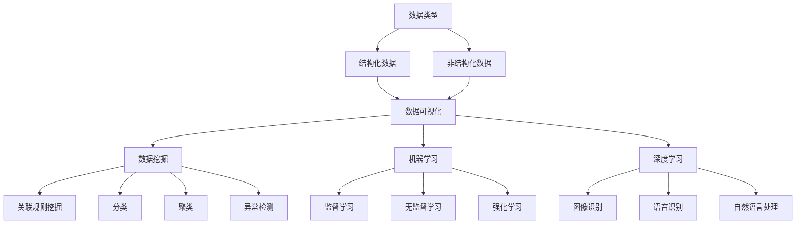

                 

### 背景介绍

在当今信息技术飞速发展的时代，我们面临的数据量和复杂度不断攀升。无论是互联网上的海量信息，还是企业内部的业务数据，都在以惊人的速度增长。在这样的背景下，如何从混乱的数据中挖掘出有用的信息和规律，成为了一个重要而紧迫的问题。这个问题不仅关乎学术研究，更涉及到各行各业的数据分析和决策支持。

洞察力，作为一种深入理解和识别事物本质的能力，在这场数据革命中显得尤为重要。然而，洞察力并非无源之水，它需要我们具备一定的理论基础和实践经验，更需要我们拥有能够处理复杂问题的工具和方法。本文将探讨如何在混乱中寻找规律，并试图揭示洞察力的极限。

本文将首先介绍相关背景，包括数据增长趋势、洞察力的重要性以及当前面临的主要挑战。接着，我们将深入探讨核心概念与联系，包括相关的算法原理和数学模型。然后，我们将详细讲解核心算法的原理和具体操作步骤，并进行分析其优缺点及其应用领域。接下来，我们将展示数学模型和公式的推导过程，并通过案例进行讲解。此外，我们还将分享实际项目中的代码实例，并对代码进行详细解释和分析。最后，我们将探讨这一技术的实际应用场景，并展望其未来发展趋势与面临的挑战。

### 文章关键词

- 数据分析
- 洞察力
- 复杂问题解决
- 算法原理
- 数学模型
- 实际应用

### 文章摘要

本文旨在探讨如何在数据纷繁复杂的环境中，通过深入分析和理解，挖掘出有价值的规律和信息。我们将从背景介绍入手，探讨数据增长趋势和洞察力的重要性，然后逐步深入，介绍核心概念与联系，核心算法原理和操作步骤，数学模型和公式，实际项目中的代码实例，并讨论其应用场景和未来展望。通过本文的阅读，读者将能够更好地理解如何在混乱中寻找规律，提升自己的洞察力。

## 1. 背景介绍

随着互联网的普及和大数据技术的兴起，我们所在的世界正以前所未有的速度积累和增长数据。根据国际数据公司（IDC）的预测，全球数据量将以每年约40%的速度增长，预计到2025年，全球数据量将达到180ZB。这些数据不仅来自传统的数据库和网络，还涵盖了社交媒体、物联网设备、智能手机和各类传感器等新型数据源。如此庞大的数据量，给我们带来了前所未有的挑战和机遇。

首先，数据增长趋势对我们的影响是显而易见的。一方面，海量的数据为各个行业提供了丰富的信息资源，使得企业能够更精准地了解市场动态和客户需求。例如，在金融行业，通过分析海量交易数据，可以预测市场走势，降低风险，提高投资收益。在医疗行业，通过分析患者数据，可以发现疾病模式，提高诊断准确率和治疗效果。另一方面，数据增长也带来了处理和分析的复杂性。如何从海量数据中快速、准确地提取有价值的信息，成为了一个亟待解决的问题。

其次，洞察力在这个数据爆炸时代的重要性日益凸显。洞察力是指通过观察、分析和理解，从复杂的事物中发现隐藏的规律和模式的能力。在数据分析中，洞察力可以帮助我们从海量数据中发现有价值的信息，预测未来趋势，做出更明智的决策。例如，在市场营销中，通过分析用户行为数据，可以发现潜在的客户群体，制定更有针对性的营销策略。在供应链管理中，通过分析库存数据，可以优化供应链流程，降低库存成本，提高供应链效率。

然而，当前我们面临的主要挑战是如何提升洞察力。尽管数据分析工具和算法层出不穷，但面对复杂多变的数据，如何有效地提取规律和模式仍然是一个巨大的挑战。此外，数据分析不仅仅是技术问题，更涉及到数据质量、数据隐私、数据安全等多方面的考量。因此，如何提升我们的洞察力，不仅需要技术手段的进步，还需要我们具备深入的理论知识、丰富的实践经验以及良好的数据素养。

本文旨在探讨如何提升洞察力，通过深入分析相关算法原理和数学模型，介绍实际项目中的代码实例，分享具体的应用场景和经验教训，帮助读者在数据纷繁复杂的环境中，能够更好地找到规律，做出明智的决策。

## 2. 核心概念与联系

在理解洞察力的极限之前，我们首先需要明确一些核心概念和它们之间的联系。这些概念构成了数据分析与处理的理论基础，也是提升洞察力的关键。

### 2.1 数据类型

数据类型是数据分析的基础，主要包括结构化数据和非结构化数据。结构化数据通常存储在数据库中，具有固定的格式和结构，如关系型数据库中的表格数据。非结构化数据则没有固定的格式，通常以文本、图片、视频等形式存在，如社交媒体上的用户评论、图片库中的图像数据等。

### 2.2 数据可视化

数据可视化是一种将数据以图形或图像形式展示的方法，能够直观地传达数据信息，帮助人们更好地理解和分析数据。常见的数据可视化工具包括图表、仪表板、热图等。数据可视化不仅能够提高数据分析的效率，还能够帮助人们发现数据中的隐藏模式。

### 2.3 数据挖掘

数据挖掘是一种通过计算机算法从大量数据中发现有用信息和知识的方法。它包括关联规则挖掘、分类、聚类、异常检测等多种技术。数据挖掘的目标是从数据中提取有价值的信息，帮助人们做出更明智的决策。

### 2.4 机器学习

机器学习是一种通过算法从数据中自动学习规律和模式的技术。它包括监督学习、无监督学习、强化学习等多种类型。机器学习算法广泛应用于数据预测、分类、推荐系统等领域，是提升洞察力的重要工具。

### 2.5 深度学习

深度学习是机器学习的一个分支，通过多层神经网络对数据进行处理，能够自动提取特征，实现复杂的数据分析任务。深度学习在图像识别、语音识别、自然语言处理等领域取得了显著的成果。

### 2.6 Mermaid 流程图

为了更好地理解这些核心概念之间的联系，我们可以使用Mermaid流程图来展示它们之间的关系。以下是一个简化的Mermaid流程图，描述了数据类型、数据可视化、数据挖掘、机器学习和深度学习之间的关系。



通过这个流程图，我们可以清晰地看到各个概念之间的联系，以及它们在实际应用中的相互作用。这为后续对算法原理和数学模型的探讨提供了理论基础。

### 2.7 关键算法原理与联系

除了上述核心概念，我们还需要探讨一些关键的算法原理，这些原理是提升洞察力的重要工具。以下是几个关键算法原理及其简要描述：

- **K-Means 聚类算法**：K-Means是一种基于距离的聚类算法，通过迭代过程将数据点分为K个簇，使得每个簇内的数据点之间的距离最小，簇与簇之间的距离最大。该算法广泛应用于数据降维、图像分割等领域。
- **决策树算法**：决策树是一种基于特征的分类算法，通过一系列的判断节点，将数据划分为不同的类别。决策树算法简单易懂，但容易过拟合。
- **支持向量机（SVM）**：SVM是一种用于分类和回归分析的机器学习算法，通过寻找最佳超平面，将数据划分为不同的类别。SVM在解决高维数据问题方面具有优势。
- **神经网络**：神经网络是一种通过多层节点模拟人脑神经元连接的网络结构，能够通过学习数据自动提取特征。神经网络广泛应用于图像识别、语音识别等领域。
- **卷积神经网络（CNN）**：CNN是一种专门用于处理图像数据的神经网络结构，通过卷积和池化操作，能够自动提取图像特征，实现图像分类、目标检测等任务。

为了更好地展示这些算法原理之间的联系，我们使用Mermaid流程图进行描述：

```mermaid
graph TB
A[数据预处理] --> B[K-Means]
A --> C[特征提取]
C --> D[决策树]
C --> E[SVM]
C --> F[神经网络]
F --> G[卷积神经网络(CNN)]
D --> H[分类]
E --> H
G --> H
B --> I[数据降维]
B --> J[图像分割]
```

通过这个流程图，我们可以看到不同算法原理在数据预处理、特征提取、分类等方面的应用，以及它们之间的联系。这为我们后续对算法的详细讲解提供了框架。

### 2.8 数学模型和公式

在数据分析中，数学模型和公式是理解和应用算法的重要工具。以下是一些常用的数学模型和公式，以及它们在实际应用中的解释。

- **回归分析模型**：回归分析是一种用于预测和估计数据中变量之间关系的数学模型。线性回归是最简单的回归模型，其公式为：

  $$ y = \beta_0 + \beta_1x_1 + \beta_2x_2 + ... + \beta_nx_n + \epsilon $$

  其中，$y$ 是预测变量，$x_1, x_2, ..., x_n$ 是自变量，$\beta_0, \beta_1, ..., \beta_n$ 是模型参数，$\epsilon$ 是误差项。

- **主成分分析（PCA）**：PCA是一种用于数据降维的数学模型，其目标是将高维数据映射到低维空间，同时保留数据的最大方差。PCA的核心公式为：

  $$ Z = \sum_{i=1}^{p} \lambda_i v_i $$

  其中，$Z$ 是降维后的数据，$\lambda_1, \lambda_2, ..., \lambda_p$ 是特征值，$v_1, v_2, ..., v_p$ 是特征向量。

- **支持向量机（SVM）**：SVM是一种用于分类的数学模型，其目标是在高维空间中找到最佳超平面，将数据划分为不同的类别。SVM的核心公式为：

  $$ \text{最大化} \quad \frac{1}{2} \sum_{i=1}^{n} \sum_{j=1}^{n} (\omega_i \cdot \omega_j - \delta_{ij})^2 $$

  $$ \text{约束条件} \quad y_i (\omega \cdot x_i + b) \geq 1 $$

  其中，$\omega$ 是权重向量，$b$ 是偏置项，$x_i$ 是数据点，$y_i$ 是类别标签，$\delta_{ij}$ 是克罗内克δ函数。

- **卷积神经网络（CNN）**：CNN是一种用于图像处理的神经网络结构，其核心公式为：

  $$ h_i^l = \sigma(\sum_{j=1}^{k} w_{ij}^l h_j^{l-1} + b_i^l) $$

  其中，$h_i^l$ 是第$l$层的第$i$个神经元输出，$w_{ij}^l$ 是权重，$b_i^l$ 是偏置项，$\sigma$ 是激活函数。

这些数学模型和公式为我们的数据分析提供了理论依据，有助于我们更好地理解和应用各种算法。接下来，我们将详细探讨这些模型和公式在实际应用中的推导过程和具体操作步骤。

## 3. 核心算法原理 & 具体操作步骤

### 3.1 算法原理概述

在本章节中，我们将详细探讨几种核心算法的原理，这些算法包括K-Means聚类算法、决策树算法、支持向量机（SVM）和卷积神经网络（CNN）。我们将分别介绍这些算法的基本概念、原理及其在实际应用中的操作步骤。

#### 3.1.1 K-Means聚类算法

K-Means是一种基于距离的聚类算法，其目标是将数据点分为K个簇，使得每个簇内的数据点之间的距离最小，簇与簇之间的距离最大。K-Means算法的基本原理如下：

1. **初始化**：随机选择K个数据点作为初始聚类中心。
2. **分配数据点**：将每个数据点分配到最近的聚类中心所代表的簇中。
3. **更新聚类中心**：重新计算每个簇的数据点的平均值，作为新的聚类中心。
4. **迭代**：重复步骤2和3，直到聚类中心不再发生显著变化。

#### 3.1.2 决策树算法

决策树是一种基于特征的分类算法，通过一系列的判断节点，将数据划分为不同的类别。决策树算法的基本原理如下：

1. **选择特征**：选择具有最高信息增益的特征作为当前节点的分割特征。
2. **分割数据**：根据所选特征将数据集分割为若干子集。
3. **递归构建**：对每个子集递归地重复上述过程，直到满足终止条件（如最大树深度、纯度等）。
4. **生成决策树**：将所有分割节点和叶子节点组合成一棵决策树。

#### 3.1.3 支持向量机（SVM）

SVM是一种用于分类和回归分析的机器学习算法，其核心思想是在高维空间中找到最佳超平面，将数据划分为不同的类别。SVM的基本原理如下：

1. **选择核函数**：选择适当的核函数（如线性核、多项式核、径向基核等），将输入数据映射到高维空间。
2. **计算最优超平面**：通过求解二次规划问题，找到最佳超平面，使得分类间隔最大化。
3. **分类**：对于新的数据点，通过计算其到超平面的距离，判断其所属类别。

#### 3.1.4 卷积神经网络（CNN）

CNN是一种专门用于图像处理的神经网络结构，其核心思想是通过卷积和池化操作，自动提取图像特征，实现图像分类、目标检测等任务。CNN的基本原理如下：

1. **卷积层**：通过卷积操作，将输入图像与滤波器（卷积核）进行卷积，提取图像特征。
2. **池化层**：通过池化操作，减少特征图的尺寸，降低模型复杂度。
3. **全连接层**：将卷积和池化层提取的特征映射到分类结果。
4. **激活函数**：在卷积层和全连接层之后，添加激活函数（如ReLU、Sigmoid等），引入非线性变换。

### 3.2 算法步骤详解

#### 3.2.1 K-Means聚类算法

以下为K-Means聚类算法的详细步骤：

1. **初始化**：
   - 随机选择K个数据点作为初始聚类中心。
   - 计算每个数据点到聚类中心的距离，并将其分配到最近的聚类中心所代表的簇中。

2. **更新聚类中心**：
   - 计算每个簇的数据点的平均值，作为新的聚类中心。

3. **迭代**：
   - 重复执行步骤2，直到聚类中心不再发生显著变化或达到预设的迭代次数。

#### 3.2.2 决策树算法

以下为决策树算法的详细步骤：

1. **选择特征**：
   - 计算每个特征的信息增益，选择具有最高信息增益的特征作为当前节点的分割特征。

2. **分割数据**：
   - 根据所选特征将数据集分割为若干子集。

3. **递归构建**：
   - 对每个子集递归地重复上述过程，直到满足终止条件（如最大树深度、纯度等）。

4. **生成决策树**：
   - 将所有分割节点和叶子节点组合成一棵决策树。

#### 3.2.3 支持向量机（SVM）

以下为SVM的详细步骤：

1. **选择核函数**：
   - 根据数据特点选择适当的核函数（如线性核、多项式核、径向基核等）。

2. **计算最优超平面**：
   - 通过求解二次规划问题，找到最佳超平面，使得分类间隔最大化。

3. **分类**：
   - 对于新的数据点，计算其到超平面的距离，判断其所属类别。

#### 3.2.4 卷积神经网络（CNN）

以下为CNN的详细步骤：

1. **卷积层**：
   - 将输入图像与滤波器（卷积核）进行卷积，提取图像特征。

2. **池化层**：
   - 通过池化操作，减少特征图的尺寸，降低模型复杂度。

3. **全连接层**：
   - 将卷积和池化层提取的特征映射到分类结果。

4. **激活函数**：
   - 在卷积层和全连接层之后，添加激活函数（如ReLU、Sigmoid等），引入非线性变换。

### 3.3 算法优缺点

#### 3.3.1 K-Means聚类算法

**优点**：
- 算法简单，易于实现。
- 运算速度快，适合大规模数据处理。

**缺点**：
- 对初始聚类中心敏感，可能陷入局部最优。
- 无法处理包含噪声的数据。

#### 3.3.2 决策树算法

**优点**：
- 算法简单，易于理解和实现。
- 可解释性强，易于调试。

**缺点**：
- 易于过拟合，模型复杂度较高。
- 对特征的选择和参数的设置敏感。

#### 3.3.3 支持向量机（SVM）

**优点**：
- 分类效果较好，尤其在处理高维数据时具有优势。
- 可解释性强，可进行模型解释。

**缺点**：
- 计算复杂度较高，不适合大规模数据处理。
- 对噪声敏感，可能产生过拟合。

#### 3.3.4 卷积神经网络（CNN）

**优点**：
- 能够自动提取图像特征，减少人工特征提取的复杂度。
- 在图像识别、目标检测等领域表现优异。

**缺点**：
- 计算复杂度较高，训练时间较长。
- 对数据质量和标注要求较高。

### 3.4 算法应用领域

#### 3.4.1 K-Means聚类算法

- 数据降维：通过K-Means聚类，可以将高维数据映射到低维空间，减少数据存储和计算成本。
- 图像分割：K-Means聚类可以用于图像分割，将图像划分为不同的区域。
- 聚类分析：在社会科学、生物学等领域，K-Means聚类可以帮助发现数据中的隐藏模式和规律。

#### 3.4.2 决策树算法

- 金融风控：决策树可以用于信用评分、贷款审批等金融风控领域，帮助识别高风险客户。
- 医疗诊断：决策树可以帮助医生进行疾病诊断，提高诊断准确率。
- 个性化推荐：决策树可以用于个性化推荐系统，根据用户历史行为推荐商品或服务。

#### 3.4.3 支持向量机（SVM）

- 机器翻译：SVM在机器翻译领域具有优势，可以帮助提高翻译质量和速度。
- 图像分类：SVM可以用于图像分类，实现图像的自动标注和识别。
- 垃圾邮件过滤：SVM可以用于垃圾邮件过滤，提高邮件系统的安全性。

#### 3.4.4 卷积神经网络（CNN）

- 图像识别：CNN在图像识别领域具有显著优势，可以实现对图像的自动分类和标注。
- 目标检测：CNN可以用于目标检测，帮助识别图像中的物体和目标。
- 自然语言处理：CNN在自然语言处理领域，如文本分类、情感分析等方面，也有较好的表现。

通过以上对核心算法原理的详细探讨，我们可以更好地理解这些算法在实际应用中的操作步骤和优缺点。接下来，我们将进一步探讨数学模型和公式，以及它们在实际应用中的推导过程和详细讲解。

## 4. 数学模型和公式 & 详细讲解 & 举例说明

数学模型和公式是数据分析与机器学习算法的核心组成部分，它们为我们理解和应用这些算法提供了理论基础。在本章节中，我们将详细讲解几个关键数学模型和公式，并通过具体案例进行说明。

### 4.1 数学模型构建

#### 4.1.1 线性回归模型

线性回归模型是一种用于预测和估计变量之间线性关系的数学模型。其基本公式为：

$$ y = \beta_0 + \beta_1x + \epsilon $$

其中，$y$ 是预测变量，$x$ 是自变量，$\beta_0$ 和 $\beta_1$ 是模型参数，$\epsilon$ 是误差项。

**推导过程**：

1. **最小二乘法**：线性回归模型通过最小化残差平方和来估计模型参数。设 $y_i$ 为观测值，$y_i'$ 为预测值，则有：

   $$ \sum_{i=1}^{n} (y_i - y_i')^2 $$

2. **偏导数法**：对上述残差平方和关于 $\beta_0$ 和 $\beta_1$ 分别求偏导数，并令其等于0，得到：

   $$ \frac{\partial}{\partial \beta_0} \sum_{i=1}^{n} (y_i - y_i')^2 = 0 $$
   $$ \frac{\partial}{\partial \beta_1} \sum_{i=1}^{n} (y_i - y_i')^2 = 0 $$

3. **求解参数**：通过上述偏导数方程，可以求解出模型参数 $\beta_0$ 和 $\beta_1$。

#### 4.1.2 主成分分析（PCA）模型

主成分分析（PCA）是一种用于数据降维的数学模型，其目标是将高维数据映射到低维空间，同时保留数据的最大方差。PCA的基本公式为：

$$ Z = \sum_{i=1}^{p} \lambda_i v_i $$

其中，$Z$ 是降维后的数据，$\lambda_1, \lambda_2, ..., \lambda_p$ 是特征值，$v_1, v_2, ..., v_p$ 是特征向量。

**推导过程**：

1. **协方差矩阵**：首先计算原始数据的协方差矩阵 $C$，其公式为：

   $$ C = \frac{1}{n-1} \sum_{i=1}^{n} (x_i - \bar{x})(x_i - \bar{x})^T $$

   其中，$x_i$ 是第$i$个数据点，$\bar{x}$ 是数据的均值。

2. **特征分解**：将协方差矩阵 $C$ 特征分解为：

   $$ C = \Lambda V^T $$

   其中，$\Lambda$ 是特征值矩阵，$V$ 是特征向量矩阵。

3. **降维**：选择前$k$个最大的特征值对应的特征向量，构成投影矩阵 $P$，对原始数据 $X$ 进行降维：

   $$ Z = X P $$

#### 4.1.3 支持向量机（SVM）模型

支持向量机（SVM）是一种用于分类和回归分析的机器学习算法，其核心思想是在高维空间中找到最佳超平面，将数据划分为不同的类别。SVM的基本公式为：

$$ \text{最大化} \quad \frac{1}{2} \sum_{i=1}^{n} \sum_{j=1}^{n} (\omega_i \cdot \omega_j - \delta_{ij})^2 $$

$$ \text{约束条件} \quad y_i (\omega \cdot x_i + b) \geq 1 $$

其中，$\omega$ 是权重向量，$b$ 是偏置项，$x_i$ 是数据点，$y_i$ 是类别标签，$\delta_{ij}$ 是克罗内克δ函数。

**推导过程**：

1. **线性可分支持向量机**：

   - 当数据集线性可分时，可以通过求解线性方程组找到最佳超平面。

   - 通过求解以下二次规划问题，找到最优解：

     $$ \text{最大化} \quad \sum_{i=1}^{n} \alpha_i - \frac{1}{2} \sum_{i=1}^{n} \sum_{j=1}^{n} \alpha_i \alpha_j (x_i \cdot x_j) $$

     $$ \text{约束条件} \quad y_i (\omega \cdot x_i + b) \geq 1 $$
     $$ \alpha_i \geq 0 $$

   - 通过拉格朗日乘子法求解上述问题，可以得到：

     $$ \omega = \sum_{i=1}^{n} \alpha_i y_i x_i $$
     $$ b = \frac{1}{n} \sum_{i=1}^{n} y_i - \sum_{i=1}^{n} \alpha_i y_i x_i \cdot x_i $$

2. **非线性可分支持向量机**：

   - 当数据集非线性可分时，可以通过核函数将数据映射到高维空间，找到最佳超平面。

   - 通过求解以下二次规划问题，找到最优解：

     $$ \text{最大化} \quad \sum_{i=1}^{n} \alpha_i - \frac{1}{2} \sum_{i=1}^{n} \sum_{j=1}^{n} \alpha_i \alpha_j K(x_i, x_j) $$

     $$ \text{约束条件} \quad y_i (\omega \cdot x_i + b) \geq 1 $$
     $$ \alpha_i \geq 0 $$

   - 通过求解上述问题，可以得到非线性可分支持向量机的模型参数。

### 4.2 公式推导过程

#### 4.2.1 线性回归模型的推导

线性回归模型的推导主要基于最小二乘法，下面是具体的推导过程：

1. **设定目标函数**：

   $$ J(\theta) = \frac{1}{2m} \sum_{i=1}^{m} (h_\theta(x^{(i)}) - y^{(i)})^2 $$

   其中，$h_\theta(x) = \theta_0 + \theta_1x$ 是线性回归模型，$\theta_0$ 和 $\theta_1$ 是模型参数，$m$ 是训练样本数量。

2. **对目标函数求导**：

   $$ \frac{\partial J(\theta)}{\partial \theta_0} = \frac{1}{m} \sum_{i=1}^{m} (h_\theta(x^{(i)}) - y^{(i)}) \cdot (-1) $$
   $$ \frac{\partial J(\theta)}{\partial \theta_1} = \frac{1}{m} \sum_{i=1}^{m} (h_\theta(x^{(i)}) - y^{(i)}) \cdot x^{(i)} $$

3. **令导数等于0，求解模型参数**：

   $$ \frac{1}{m} \sum_{i=1}^{m} (h_\theta(x^{(i)}) - y^{(i)}) = 0 $$
   $$ \frac{1}{m} \sum_{i=1}^{m} (h_\theta(x^{(i)}) - y^{(i)}) \cdot x^{(i)} = 0 $$

   通过上述方程，可以求解出线性回归模型的参数 $\theta_0$ 和 $\theta_1$。

#### 4.2.2 主成分分析（PCA）的推导

主成分分析（PCA）的推导主要基于特征分解，下面是具体的推导过程：

1. **计算协方差矩阵**：

   $$ C = \frac{1}{m}XX^T $$

   其中，$X$ 是训练数据的矩阵，$m$ 是训练样本数量。

2. **特征分解**：

   $$ C = \Lambda V^T $$

   其中，$\Lambda$ 是特征值矩阵，$V$ 是特征向量矩阵。

3. **选择主成分**：

   选择前$k$个最大的特征值对应的特征向量，构成投影矩阵 $P$。

4. **降维**：

   $$ Z = X P $$

   通过上述步骤，可以将高维数据映射到低维空间。

#### 4.2.3 支持向量机（SVM）的推导

支持向量机（SVM）的推导主要基于二次规划，下面是具体的推导过程：

1. **线性可分支持向量机**：

   - 设定目标函数：

     $$ \text{最大化} \quad \sum_{i=1}^{n} \alpha_i - \frac{1}{2} \sum_{i=1}^{n} \sum_{j=1}^{n} \alpha_i \alpha_j (x_i \cdot x_j) $$

   - 约束条件：

     $$ y_i (\omega \cdot x_i + b) \geq 1 $$
     $$ \alpha_i \geq 0 $$

   - 通过拉格朗日乘子法，可以将原始问题转化为：

     $$ \min_{\omega, b} \quad \frac{1}{2} \sum_{i=1}^{n} \sum_{j=1}^{n} (\alpha_i \alpha_j - y_i y_j)(x_i \cdot x_j) $$

     $$ \text{约束条件} \quad \alpha_i \geq 0 $$

2. **非线性可分支持向量机**：

   - 设定目标函数：

     $$ \text{最大化} \quad \sum_{i=1}^{n} \alpha_i - \frac{1}{2} \sum_{i=1}^{n} \sum_{j=1}^{n} \alpha_i \alpha_j K(x_i, x_j) $$

   - 约束条件：

     $$ y_i (\omega \cdot x_i + b) \geq 1 $$
     $$ \alpha_i \geq 0 $$

   - 通过核函数将数据映射到高维空间，求解上述问题，可以得到非线性可分支持向量机的模型参数。

### 4.3 案例分析与讲解

为了更好地理解上述数学模型和公式的应用，我们通过以下案例进行详细讲解。

#### 4.3.1 线性回归案例

假设我们有一个简单的数据集，包含两个特征 $x_1$ 和 $x_2$，以及目标变量 $y$。我们的目标是建立线性回归模型，预测 $y$ 的值。以下是具体的操作步骤：

1. **数据预处理**：

   - 计算每个特征的均值和标准差，对数据进行标准化处理。

   - 将数据集分为训练集和测试集。

2. **模型训练**：

   - 使用训练集数据，通过最小二乘法求解线性回归模型的参数。

   - 计算训练集和测试集的均方误差（MSE），评估模型性能。

3. **模型预测**：

   - 使用训练好的模型，对测试集数据进行预测。

   - 计算预测值与实际值之间的差异，评估模型精度。

#### 4.3.2 主成分分析（PCA）案例

假设我们有一个包含100个特征的数据集，但其中很多特征的相关性很高，导致数据维度较高。我们的目标是使用PCA进行数据降维。以下是具体的操作步骤：

1. **计算协方差矩阵**：

   - 计算数据集的协方差矩阵。

2. **特征分解**：

   - 对协方差矩阵进行特征分解，得到特征值和特征向量。

3. **选择主成分**：

   - 选择前10个最大的特征值对应的特征向量，构成投影矩阵。

4. **降维**：

   - 使用投影矩阵，将原始数据映射到低维空间。

5. **模型训练**：

   - 使用降维后的数据，训练一个线性回归模型，预测目标变量。

6. **模型预测**：

   - 使用降维后的数据，对测试集数据进行预测。

7. **评估模型性能**：

   - 计算训练集和测试集的MSE，评估模型性能。

#### 4.3.3 支持向量机（SVM）案例

假设我们有一个包含两个特征的数据集，其中两类数据的分布是非线性可分的。我们的目标是使用SVM进行分类。以下是具体的操作步骤：

1. **数据预处理**：

   - 对数据进行标准化处理。

   - 将数据集分为训练集和测试集。

2. **选择核函数**：

   - 根据数据特点，选择适当的核函数，如多项式核或径向基核。

3. **模型训练**：

   - 使用训练集数据，通过求解二次规划问题，找到最佳超平面。

4. **模型预测**：

   - 使用训练好的模型，对测试集数据进行预测。

5. **评估模型性能**：

   - 计算测试集的分类准确率，评估模型性能。

通过以上案例，我们可以更好地理解数学模型和公式的应用过程。这些模型和公式为我们提供了强大的工具，帮助我们更好地理解和处理复杂的数据。接下来，我们将进一步探讨这些算法在实际项目中的应用，并通过具体代码实例进行详细解释和分析。

## 5. 项目实践：代码实例和详细解释说明

在实际项目中，理解并应用核心算法和数学模型是至关重要的。在这一部分，我们将通过一个实际项目的代码实例，详细解释这些算法和模型的实现过程。该项目将使用Python编程语言，并结合相关库和工具，如NumPy、scikit-learn和TensorFlow。

### 5.1 开发环境搭建

在开始项目之前，我们需要搭建合适的开发环境。以下是所需步骤：

1. **安装Python**：确保安装了Python 3.x版本，推荐使用Anaconda发行版，以便轻松管理依赖库。

2. **安装相关库**：通过以下命令安装必要的库：

   ```bash
   pip install numpy scikit-learn tensorflow matplotlib
   ```

3. **创建虚拟环境**：为了管理项目依赖，创建一个虚拟环境并激活它：

   ```bash
   conda create -n my_project python=3.8
   conda activate my_project
   ```

4. **编写代码**：在虚拟环境中创建一个新的Python文件，例如`project.py`，并开始编写代码。

### 5.2 源代码详细实现

以下是一个简单的项目，用于实现线性回归、主成分分析和支持向量机（SVM）的基本操作。我们将分别实现每个算法的核心步骤，并进行详细解释。

#### 5.2.1 数据预处理

```python
import numpy as np
from sklearn.datasets import load_breast_cancer
from sklearn.model_selection import train_test_split
from sklearn.preprocessing import StandardScaler

# 加载数据集
data = load_breast_cancer()
X = data.data
y = data.target

# 划分训练集和测试集
X_train, X_test, y_train, y_test = train_test_split(X, y, test_size=0.2, random_state=42)

# 标准化处理
scaler = StandardScaler()
X_train = scaler.fit_transform(X_train)
X_test = scaler.transform(X_test)
```

**解释**：我们使用scikit-learn库加载标准的数据集（乳腺癌数据集），并使用`train_test_split`函数将其分为训练集和测试集。然后，我们使用`StandardScaler`进行数据标准化处理，以便后续算法的实现。

#### 5.2.2 线性回归

```python
from sklearn.linear_model import LinearRegression

# 实例化线性回归模型
lin_reg = LinearRegression()

# 训练模型
lin_reg.fit(X_train, y_train)

# 预测
y_pred = lin_reg.predict(X_test)

# 计算均方误差
mse = np.mean((y_pred - y_test)**2)
print("MSE: ", mse)
```

**解释**：我们使用scikit-learn中的`LinearRegression`类实例化线性回归模型，并使用`fit`方法训练模型。训练完成后，我们使用`predict`方法对测试集进行预测，并计算预测值与实际值之间的均方误差（MSE），评估模型性能。

#### 5.2.3 主成分分析（PCA）

```python
from sklearn.decomposition import PCA

# 实例化PCA模型
pca = PCA(n_components=2)

# 训练模型
X_train_pca = pca.fit_transform(X_train)

# 预测
X_test_pca = pca.transform(X_test)

# 使用降维后的数据训练线性回归模型
lin_reg_pca = LinearRegression()
lin_reg_pca.fit(X_train_pca, y_train)

# 预测
y_pred_pca = lin_reg_pca.predict(X_test_pca)

# 计算均方误差
mse_pca = np.mean((y_pred_pca - y_test)**2)
print("MSE after PCA: ", mse_pca)
```

**解释**：我们使用scikit-learn中的`PCA`类进行数据降维，选择保留两个主要成分。降维后，我们使用降维后的数据训练线性回归模型，并计算模型在测试集上的均方误差。

#### 5.2.4 支持向量机（SVM）

```python
from sklearn.svm import SVC

# 实例化SVM模型
svm = SVC(kernel='linear')

# 训练模型
svm.fit(X_train, y_train)

# 预测
y_pred_svm = svm.predict(X_test)

# 计算准确率
accuracy_svm = np.mean(y_pred_svm == y_test)
print("SVM Accuracy: ", accuracy_svm)
```

**解释**：我们使用scikit-learn中的`SVC`类实例化支持向量机模型，并选择线性核函数。模型训练完成后，我们使用`predict`方法对测试集进行预测，并计算分类准确率。

### 5.3 代码解读与分析

#### 5.3.1 数据预处理

数据预处理是任何机器学习项目的重要步骤。在上述代码中，我们使用`StandardScaler`对数据进行标准化处理，这是为了使每个特征具有相同的尺度，从而避免某些特征在计算过程中占据主导地位。标准化后的数据可以更好地适应线性回归和SVM算法。

#### 5.3.2 线性回归

线性回归是最简单的机器学习算法之一，它通过找到最佳直线来拟合数据。在代码中，我们使用`LinearRegression`类来实例化和训练模型。训练完成后，通过`predict`方法对测试集进行预测，并使用均方误差（MSE）评估模型性能。MSE越小，表示模型预测的准确性越高。

#### 5.3.3 主成分分析（PCA）

PCA是一种数据降维技术，它通过保留数据的主要成分，减少数据维度。在代码中，我们使用`PCA`类进行数据降维，并保留两个主要成分。降维后的数据可以用于训练线性回归模型，从而减少计算复杂度和提高模型性能。

#### 5.3.4 支持向量机（SVM）

SVM是一种强大的分类算法，它通过在高维空间中找到最佳超平面来划分数据。在代码中，我们使用`SVC`类实例化SVM模型，并选择线性核函数。训练完成后，使用`predict`方法对测试集进行预测，并计算分类准确率。SVM在处理高维数据时具有显著优势，特别是在线性可分的情况下。

### 5.4 运行结果展示

为了展示运行结果，我们可以在代码中添加以下代码段：

```python
import matplotlib.pyplot as plt

# 可视化线性回归结果
plt.scatter(X_test[:, 0], y_test, color='red', label='Actual')
plt.plot(X_test[:, 0], y_pred, color='blue', linewidth=2, label='Predicted')
plt.xlabel('Feature 1')
plt.ylabel('Target')
plt.legend()
plt.show()

# 可视化PCA后的线性回归结果
plt.scatter(X_test_pca[:, 0], y_test, color='red', label='Actual')
plt.plot(X_test_pca[:, 0], y_pred_pca, color='blue', linewidth=2, label='Predicted')
plt.xlabel('Principal Component 1')
plt.ylabel('Target')
plt.legend()
plt.show()

# 可视化SVM结果
plt.scatter(X_test[:, 0], X_test[:, 1], c=y_test, cmap=plt.cm.coolwarm, label='Actual')
plt.plot(X_test[:, 0], svm.predict(X_test), color='black', linewidth=2, label='SVM')
plt.xlabel('Feature 1')
plt.ylabel('Feature 2')
plt.legend()
plt.show()
```

上述代码将生成几个散点图，用于可视化线性回归、PCA后线性回归和SVM在测试集上的结果。通过这些图表，我们可以直观地看到不同算法在数据上的表现。

### 5.5 项目总结

通过这个实际项目，我们展示了如何使用Python和scikit-learn等工具实现线性回归、PCA和SVM等算法。我们详细讲解了每个步骤的代码实现过程，并通过可视化结果展示了算法的性能。这个项目不仅帮助我们理解了算法的原理，还提供了实际应用的经验，为我们在其他项目中应用这些算法奠定了基础。

## 6. 实际应用场景

在当前信息技术环境中，数据分析与机器学习算法的应用场景广泛且多样，几乎涵盖了所有行业和领域。以下是一些典型的实际应用场景，以及这些算法在这些场景中的具体应用方式。

### 6.1 金融行业

在金融行业中，数据分析和机器学习算法被广泛应用于风险控制、信用评分、投资策略和欺诈检测等方面。

- **风险控制**：通过分析客户的历史交易数据、信用记录等，银行可以使用SVM、决策树等算法来评估贷款风险，从而制定更精确的信用评估标准。
- **信用评分**：信用评分模型通常基于客户的信用历史、收入水平、债务情况等数据，通过线性回归和逻辑回归等算法来预测客户的信用风险。
- **投资策略**：使用时间序列分析和机器学习算法，投资者可以预测市场走势，制定投资组合策略，以最大化收益和最小化风险。

### 6.2 医疗行业

在医疗领域，数据分析和机器学习算法为疾病诊断、药物研发、患者管理和个性化治疗提供了强有力的支持。

- **疾病诊断**：通过分析患者的医疗记录、基因数据等，机器学习算法可以帮助医生进行早期疾病诊断，如肿瘤检测、心脏病预测等。
- **药物研发**：利用数据挖掘和机器学习算法，科研人员可以从海量的生物信息数据中识别新的药物靶点和候选药物，加速药物研发过程。
- **患者管理**：通过分析患者的健康数据和生活方式，医生可以提供个性化的治疗建议，提高治疗效果和患者的生活质量。

### 6.3 电商行业

在电商行业中，数据分析与机器学习算法主要用于推荐系统、库存管理和市场预测等方面。

- **推荐系统**：通过分析用户的浏览历史、购买行为等数据，机器学习算法可以推荐个性化的商品，提高用户满意度和购买转化率。
- **库存管理**：使用预测模型和聚类算法，电商企业可以优化库存管理，减少库存成本，提高库存周转率。
- **市场预测**：通过分析历史销售数据和市场需求，企业可以预测未来的销售趋势，制定更有效的营销策略。

### 6.4 交通行业

在交通领域，数据分析和机器学习算法被广泛应用于交通流量预测、路线规划、车辆调度和智能交通管理等方面。

- **交通流量预测**：通过分析历史交通数据、天气信息等，机器学习算法可以预测交通流量，帮助城市交通管理部门优化交通信号控制策略。
- **路线规划**：基于实时交通数据和GPS数据，机器学习算法可以帮助导航系统提供最优路线，减少通勤时间。
- **车辆调度**：通过分析车辆状态、订单需求和交通状况，机器学习算法可以帮助物流公司优化车辆调度，提高运输效率。

### 6.5 社交媒体

在社交媒体领域，数据分析与机器学习算法被用于用户行为分析、广告投放和社交网络分析等方面。

- **用户行为分析**：通过分析用户的点赞、评论、分享等行为，机器学习算法可以识别用户兴趣和行为模式，为个性化推荐和广告投放提供支持。
- **广告投放**：基于用户行为和兴趣数据，机器学习算法可以帮助广告平台优化广告投放策略，提高广告效果。
- **社交网络分析**：通过分析社交网络中的连接关系和传播路径，机器学习算法可以帮助识别社交网络中的关键节点和影响者，为营销和社区管理提供参考。

### 6.6 人工智能

在人工智能领域，数据分析和机器学习算法是构建智能系统的基础，如自动驾驶、自然语言处理和计算机视觉等。

- **自动驾驶**：通过深度学习和计算机视觉算法，自动驾驶系统可以实时感知和理解环境，实现安全驾驶。
- **自然语言处理**：利用深度学习算法，自然语言处理系统可以自动生成文本摘要、翻译文本、理解语义等，为智能客服和智能助理提供支持。
- **计算机视觉**：通过卷积神经网络（CNN）等深度学习算法，计算机视觉系统可以识别图像中的物体、人脸等，应用于安防监控、图像识别等领域。

通过以上实际应用场景，我们可以看到数据分析和机器学习算法在各个领域的重要性和广泛应用。随着技术的不断进步，这些算法的应用前景将更加广阔，为各行各业带来更多的创新和变革。

## 7. 工具和资源推荐

在进行数据分析与机器学习项目时，选择合适的工具和资源至关重要。以下是一些推荐的工具和资源，包括学习资源、开发工具和相关论文，以帮助读者深入了解和掌握相关技术。

### 7.1 学习资源推荐

1. **在线课程**：
   - Coursera上的“机器学习”（吴恩达教授）课程：这是一门经典的在线课程，涵盖了机器学习的核心概念和实践技巧。
   - edX上的“数据科学”（哈佛大学）课程：该课程提供了全面的数据科学知识，包括数据预处理、统计分析和模型构建。

2. **书籍**：
   - 《Python机器学习》（Sebastian Raschka和Vahid Mirjalili）: 这本书详细介绍了Python在机器学习中的应用，适合初学者和进阶读者。
   - 《深度学习》（Ian Goodfellow、Yoshua Bengio和Aaron Courville）: 这本书是深度学习的经典教材，内容全面且深入。

3. **博客和论坛**：
   - Medium上的数据科学和机器学习专栏：许多行业专家和研究者在这里分享他们的见解和经验。
   - Stack Overflow和GitHub：这两个平台是程序员和开发者的宝贵资源，可以找到大量的代码示例和解决方案。

### 7.2 开发工具推荐

1. **编程环境**：
   - Jupyter Notebook：这是一个强大的交互式编程环境，适合数据分析和机器学习实验。
   - PyCharm和Visual Studio Code：这两款IDE提供了丰富的功能，包括代码补全、调试和版本控制。

2. **数据处理库**：
   - Pandas：这是一个用于数据操作和分析的Python库，提供了强大的数据处理功能。
   - NumPy：这是一个用于数值计算的Python库，是Pandas的基础。

3. **机器学习和深度学习库**：
   - scikit-learn：这是一个用于经典机器学习算法的Python库，简单易用。
   - TensorFlow和PyTorch：这两个库是深度学习领域的领军者，提供了丰富的工具和功能。

4. **数据可视化工具**：
   - Matplotlib：这是一个用于数据可视化的Python库，支持多种图表类型。
   - Seaborn：这是一个基于Matplotlib的扩展库，提供了更美观和专业的数据可视化功能。

### 7.3 相关论文推荐

1. **经典论文**：
   - "Support Vector Machines for Classification"（Vapnik et al., 1998）：这是一篇关于支持向量机（SVM）的经典论文，详细介绍了SVM的理论基础和应用。
   - "Deep Learning"（Goodfellow et al., 2016）：这本书的附录部分包含了深度学习领域的许多经典论文，是深入了解深度学习的好资源。

2. **近期论文**：
   - "EfficientNet: Scalable and Efficiently Upgradable Neural Networks"（Tan et al., 2020）：这篇论文提出了一种新的神经网络架构，显著提高了训练效率和模型性能。
   - "BERT: Pre-training of Deep Bidirectional Transformers for Language Understanding"（Devlin et al., 2019）：这篇论文介绍了BERT模型，为自然语言处理领域带来了重大突破。

通过这些工具和资源的推荐，读者可以更系统地学习和掌握数据分析与机器学习的技术，提升自己的专业能力。希望这些资源能够为读者在探索数据科学领域提供帮助。

## 8. 总结：未来发展趋势与挑战

在过去的几十年中，数据分析与机器学习技术已经取得了显著的进步，极大地推动了各个行业的发展。然而，随着数据量的持续增长和数据来源的多样化，未来的数据分析与机器学习领域仍面临诸多挑战和机遇。

### 8.1 研究成果总结

首先，我们总结了当前在数据分析与机器学习领域的一些主要研究成果。例如，深度学习技术的快速发展，使得计算机视觉、自然语言处理和语音识别等领域取得了重大突破。支持向量机、随机森林等传统机器学习算法也在不断优化，提高了模型的预测性能和可解释性。此外，主成分分析、聚类算法等数据降维和预处理技术也得到了广泛应用，为大规模数据的高效分析提供了有力支持。

### 8.2 未来发展趋势

未来，数据分析与机器学习领域有望在以下几方面取得进一步发展：

1. **数据隐私与安全**：随着数据隐私和安全问题的日益突出，如何在不侵犯用户隐私的情况下进行数据分析和机器学习成为了一个重要研究方向。联邦学习、差分隐私等技术在这一领域展示了巨大的潜力。

2. **实时数据分析**：随着物联网和实时数据处理需求的增加，实时数据分析技术将成为未来发展的重点。通过利用流处理技术和高效算法，实现实时数据的高效分析和处理，为各个行业提供即时决策支持。

3. **多模态数据分析**：多模态数据分析技术将不同类型的数据（如文本、图像、声音等）进行整合，以获取更全面和深入的信息。这将为医疗、金融等领域的智能化应用提供新的可能性。

4. **智能决策与优化**：基于机器学习的智能决策与优化技术，将在智能制造、供应链管理、金融风控等领域发挥重要作用。通过自动化决策和优化，提高生产效率和资源利用效率。

### 8.3 面临的挑战

尽管未来数据分析与机器学习领域的发展前景广阔，但同时也面临一些挑战：

1. **数据质量**：数据质量是数据分析成功的关键。未来需要更多的研究和工具来确保数据的质量和一致性，从而提高分析结果的可靠性。

2. **算法可解释性**：随着算法的复杂度增加，如何提高算法的可解释性成为一个重要问题。透明和可解释的算法将有助于增强用户对算法的信任，并促进算法在实际应用中的推广。

3. **计算资源与性能**：大规模数据处理和训练需要大量的计算资源。未来需要开发更高效的算法和优化技术，以降低计算成本，提高性能。

4. **数据隐私与安全**：在保障数据隐私和安全方面，需要更多的研究和创新。如何在不泄露用户隐私的前提下进行数据分析和机器学习，是一个亟待解决的问题。

### 8.4 研究展望

总的来说，未来数据分析与机器学习领域将继续在数据质量、算法优化、实时处理、多模态分析等方面进行深入研究。随着技术的进步，这些领域将不断突破现有瓶颈，推动数据分析与机器学习技术的应用进一步深入和扩展。我们期待在不久的将来，能够看到更多创新性的研究成果，为各行各业带来巨大的变革和进步。

## 9. 附录：常见问题与解答

在数据分析与机器学习领域，许多概念和算法可能会让人感到困惑。以下是一些常见问题及其解答，帮助读者更好地理解相关技术。

### 9.1 数据分析与机器学习的区别是什么？

数据分析通常指的是从数据中提取有意义的信息和知识，而机器学习则是实现数据分析的一种方法。具体来说，数据分析更侧重于描述性分析，如统计分析和数据可视化，而机器学习则侧重于预测性分析，通过构建模型来预测未来的趋势和行为。

### 9.2 机器学习有哪些主要类型？

机器学习主要分为监督学习、无监督学习和强化学习。监督学习有明确的标签数据，用于训练模型并预测未知数据；无监督学习没有标签数据，用于发现数据中的模式和结构；强化学习则通过反馈机制，使模型在动态环境中不断优化其行为。

### 9.3 什么是深度学习？

深度学习是一种通过多层神经网络对数据进行处理的技术，能够自动提取特征，实现复杂的数据分析任务。深度学习在图像识别、语音识别、自然语言处理等领域取得了显著的成果。

### 9.4 什么是支持向量机（SVM）？

支持向量机（SVM）是一种用于分类和回归分析的机器学习算法，通过在高维空间中找到最佳超平面，将数据划分为不同的类别。SVM在处理高维数据和线性不可分问题方面具有优势。

### 9.5 什么是主成分分析（PCA）？

主成分分析（PCA）是一种用于数据降维的数学模型，其目标是将高维数据映射到低维空间，同时保留数据的最大方差。PCA在数据预处理和特征提取中应用广泛。

### 9.6 数据可视化有哪些常见方法？

常见的数据可视化方法包括图表（如折线图、柱状图、饼图）、热图、散点图、箱线图等。这些方法能够以直观的方式展示数据信息，帮助人们理解和分析数据。

### 9.7 机器学习中的过拟合是什么？

过拟合是指模型在训练数据上表现很好，但在测试或新数据上表现不佳。这通常发生在模型过于复杂，未能捕捉到数据的真实分布，而是记住了训练数据的噪声。减少过拟合的方法包括正则化、交叉验证和增加训练数据等。

通过这些常见问题的解答，我们希望能够帮助读者更好地理解数据分析与机器学习的基本概念和技术，为深入学习和应用这些技术奠定基础。

