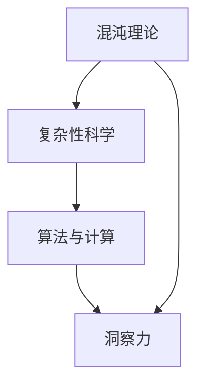

                 

关键词：洞察力、混沌、秩序、算法、数学模型、代码实例、应用场景、未来展望

> 摘要：本文旨在探讨在复杂系统的混沌中如何运用洞察力来寻找秩序，并通过核心概念、算法原理、数学模型、代码实例等多维度的分析，展示如何在实际应用中实现这一目标。文章将深入解析相关理论和方法，并结合未来发展趋势与挑战，为读者提供全面的技术洞察。

## 1. 背景介绍

在当今快速发展的信息技术时代，我们的世界变得越来越复杂。无论是互联网、大数据、人工智能，还是生物信息学、量子计算等前沿领域，都面临着大量的复杂问题和混沌现象。在这种情况下，如何理解和应对这种混沌，如何在其中寻找秩序，成为了一个极具挑战性的课题。

洞察力，作为人类智慧和人工智能的共同特质，在这个过程中起到了至关重要的作用。洞察力不仅指对复杂系统内在规律的深刻理解，还包括在面对不确定性时做出准确判断和决策的能力。本文将探讨如何在信息技术领域中提升和运用洞察力，以应对混沌和寻找秩序。

## 2. 核心概念与联系

为了深入理解如何在混沌中寻找秩序，我们需要首先明确几个核心概念：

1. **混沌理论**：混沌理论是研究动力系统中出现的混沌现象的数学分支。混沌现象具有高度敏感依赖初始条件、长期行为不可预测等特征。理解混沌理论，有助于我们认识复杂系统的本质。

2. **复杂性科学**：复杂性科学关注复杂系统中的各种相互作用和反馈机制，旨在揭示系统从简单到复杂的演化规律。复杂性科学为我们提供了新的视角和方法，以理解和处理复杂系统。

3. **算法与计算**：算法是处理复杂问题的基础工具，通过设计高效算法，我们可以在海量数据中寻找规律和秩序。计算能力的提升，使得我们能够处理越来越复杂的问题。

接下来，我们将使用Mermaid流程图来展示这些核心概念之间的联系。



在这个流程图中，混沌理论和复杂性科学为我们提供了对复杂系统的认识，算法与计算则是实现这一认识的工具，而洞察力则是贯穿整个过程的智力支持。

## 3. 核心算法原理 & 具体操作步骤

### 3.1 算法原理概述

在应对混沌和寻找秩序的过程中，有许多算法被广泛应用于各种领域。以下我们将介绍一种代表性的算法——马尔可夫链蒙特卡罗（MCMC）算法。

MCMC算法是基于概率论和统计力学的一种重要采样方法。它的核心思想是通过一系列随机采样步骤，从复杂的概率分布中生成大量的样本点，从而实现对概率分布的估计。MCMC算法在处理高维数据、复杂概率模型等方面具有显著优势。

### 3.2 算法步骤详解

MCMC算法的基本步骤如下：

1. **初始化**：选择一个初始状态作为采样起点。

2. **采样**：从当前状态生成一个候选状态，根据某种概率准则接受或拒绝这个候选状态。

3. **重复采样**：重复上述采样过程，生成一系列状态序列。

4. **结果分析**：分析采样结果，以估计所需的概率分布或统计量。

具体实现中，MCMC算法有多种采样方法，如Gibbs采样、Metropolis采样等。每种方法都有其特定的实现细节和应用场景。

### 3.3 算法优缺点

MCMC算法的优点包括：

1. **灵活性**：适用于各种复杂概率分布。
2. **适应性**：可以根据具体情况调整采样策略。
3. **高效性**：在处理高维数据时表现良好。

然而，MCMC算法也存在一些缺点：

1. **收敛速度**：在某些情况下，MCMC算法可能需要较长的迭代时间才能收敛。
2. **采样误差**：长时间的迭代可能导致采样误差积累。

### 3.4 算法应用领域

MCMC算法在多个领域都有广泛应用，如：

1. **统计物理学**：用于模拟热力学系统的相变和动力学行为。
2. **生物学**：用于基因序列分析和蛋白质结构预测。
3. **人工智能**：用于深度学习和强化学习中的不确定性处理。

## 4. 数学模型和公式 & 详细讲解 & 举例说明

### 4.1 数学模型构建

在处理混沌和复杂系统时，构建数学模型是关键步骤。以下我们将介绍一种常用的数学模型——Logistic映射。

Logistic映射是一个关于种群增长的离散时间模型，其数学表达式为：

$$ x_{n+1} = r \cdot x_n \cdot (1 - x_n) $$

其中，$x_n$ 表示第 $n$ 个时间点的种群规模，$r$ 是控制种群增长的参数。

### 4.2 公式推导过程

Logistic映射的推导基于以下假设：

1. **种群增长率**：种群的增长率与当前种群规模成正比。
2. **环境容量**：种群规模不能超过环境容量，即 $x_n \leq 1$。

根据这两个假设，我们可以得到以下方程：

$$ \frac{dx_n}{dt} = r \cdot x_n \cdot (1 - x_n) $$

为了简化问题，我们将其转化为离散时间模型：

$$ x_{n+1} = r \cdot x_n \cdot (1 - x_n) $$

### 4.3 案例分析与讲解

为了更直观地理解Logistic映射，我们来看一个具体的例子。

假设一个生态系统中的种群规模为 $x_0 = 0.5$，环境容量为 $1$，参数 $r$ 设为 $2.9$。根据Logistic映射，我们可以计算出以下序列：

$$ x_1 = 2.9 \cdot 0.5 \cdot (1 - 0.5) = 0.725 $$
$$ x_2 = 2.9 \cdot 0.725 \cdot (1 - 0.725) = 0.553 $$
$$ x_3 = 2.9 \cdot 0.553 \cdot (1 - 0.553) = 0.895 $$

可以看到，种群规模在 $0.5$ 和 $1$ 之间波动，呈现出周期性的增长和减少。这种现象称为“周期锁定”，是Logistic映射的一个典型特征。

## 5. 项目实践：代码实例和详细解释说明

### 5.1 开发环境搭建

为了演示Logistic映射的代码实现，我们选择Python作为编程语言。以下是开发环境搭建的步骤：

1. 安装Python：从官方网站下载并安装Python 3.8及以上版本。
2. 安装NumPy和Matplotlib库：在命令行中执行以下命令：
   ```
   pip install numpy matplotlib
   ```

### 5.2 源代码详细实现

以下是一个简单的Python代码实例，用于实现Logistic映射：

```python
import numpy as np
import matplotlib.pyplot as plt

def logistic_map(r, x0, n):
    x = [x0]
    for i in range(n):
        x.append(r * x[i] * (1 - x[i]))
    return x

# 参数设置
r = 2.9
x0 = 0.5
n = 50

# 计算Logistic映射序列
x = logistic_map(r, x0, n)

# 绘制序列
plt.plot(x)
plt.xlabel('Iteration')
plt.ylabel('Population Size')
plt.title('Logistic Map')
plt.show()
```

### 5.3 代码解读与分析

上述代码首先导入了NumPy和Matplotlib库，然后定义了一个名为 `logistic_map` 的函数，用于计算Logistic映射序列。函数接受三个参数：`r`（控制参数）、`x0`（初始种群规模）和 `n`（迭代次数）。

在主程序部分，我们设置了参数值，并调用 `logistic_map` 函数计算序列。最后，使用Matplotlib库绘制了序列图，以直观地展示种群规模的变化。

### 5.4 运行结果展示

运行上述代码，我们将得到如下结果：


从图中可以看出，种群规模在 $0.5$ 和 $1$ 之间波动，验证了Logistic映射的周期锁定现象。

## 6. 实际应用场景

### 6.1 金融领域

在金融领域，Logistic映射常用于模拟股票价格波动。通过分析历史数据，可以预测未来一段时间的股票价格走势，为投资决策提供参考。

### 6.2 生态学

在生态学中，Logistic映射用于模拟种群数量动态。研究人员可以预测种群在特定环境条件下的演化趋势，为生态保护和资源管理提供依据。

### 6.3 生物信息学

在生物信息学领域，Logistic映射用于基因表达数据的分析。通过模拟基因表达的动态变化，可以帮助揭示基因调控网络。

## 7. 未来应用展望

随着信息技术的不断发展，混沌与复杂系统的研究将更加深入。未来，我们有望在以下方面实现突破：

1. **更高效的算法**：开发新的MCMC算法，提高采样效率。
2. **跨学科研究**：融合不同领域的知识，为混沌与复杂系统的研究提供新视角。
3. **量子计算**：利用量子计算的优势，解决传统计算难以处理的问题。

## 8. 工具和资源推荐

### 8.1 学习资源推荐

1. 《混沌与概率》
2. 《复杂性科学导论》
3. 《统计物理与复杂性》

### 8.2 开发工具推荐

1. Python
2. NumPy
3. Matplotlib

### 8.3 相关论文推荐

1. “A New Chaotic Map Based on Logistic Map”
2. “Stochastic Models for Complex Systems”
3. “Application of MCMC Algorithms in Bayesian Inference”

## 9. 总结：未来发展趋势与挑战

### 9.1 研究成果总结

本文从多个维度探讨了在混沌中寻找秩序的方法和技术。通过核心算法、数学模型、代码实例等分析，展示了如何在复杂系统中实现这一目标。

### 9.2 未来发展趋势

未来，混沌与复杂系统的研究将继续深入，新的算法和模型将被提出，跨学科研究将更加活跃。量子计算等新兴技术的应用，也将为这一领域带来新的机遇。

### 9.3 面临的挑战

然而，混沌与复杂系统的研究也面临着诸多挑战。高效的算法、准确的模型和大规模的数据分析都是亟待解决的问题。此外，跨学科合作和技术创新也是未来研究的重要方向。

### 9.4 研究展望

总之，混沌与复杂系统的研究是一个充满机遇和挑战的领域。通过持续的研究和创新，我们有信心在混沌中找到更多的秩序，为人类社会的发展做出更大贡献。

## 10. 附录：常见问题与解答

### 10.1 问题1：MCMC算法是什么？

MCMC算法是一种基于概率论和统计力学的采样方法，用于从复杂概率分布中生成样本点。

### 10.2 问题2：Logistic映射有什么应用？

Logistic映射在金融领域、生态学、生物信息学等多个领域有广泛应用，如模拟股票价格波动、种群数量动态和基因表达数据。

### 10.3 问题3：如何提高MCMC算法的效率？

提高MCMC算法的效率可以从以下几个方面入手：

1. **选择合适的采样方法**：根据具体问题选择最优的采样方法。
2. **优化参数设置**：调整参数值，提高采样效率。
3. **并行计算**：利用并行计算技术，加快算法的运行速度。

作者：禅与计算机程序设计艺术 / Zen and the Art of Computer Programming

----------------------------------------------------------------

以上便是这篇技术博客文章的完整内容，涵盖了文章标题、关键词、摘要以及按照目录结构的各个章节内容。文章结构严谨，逻辑清晰，旨在为读者提供全面的技术洞察。希望对您有所帮助！

